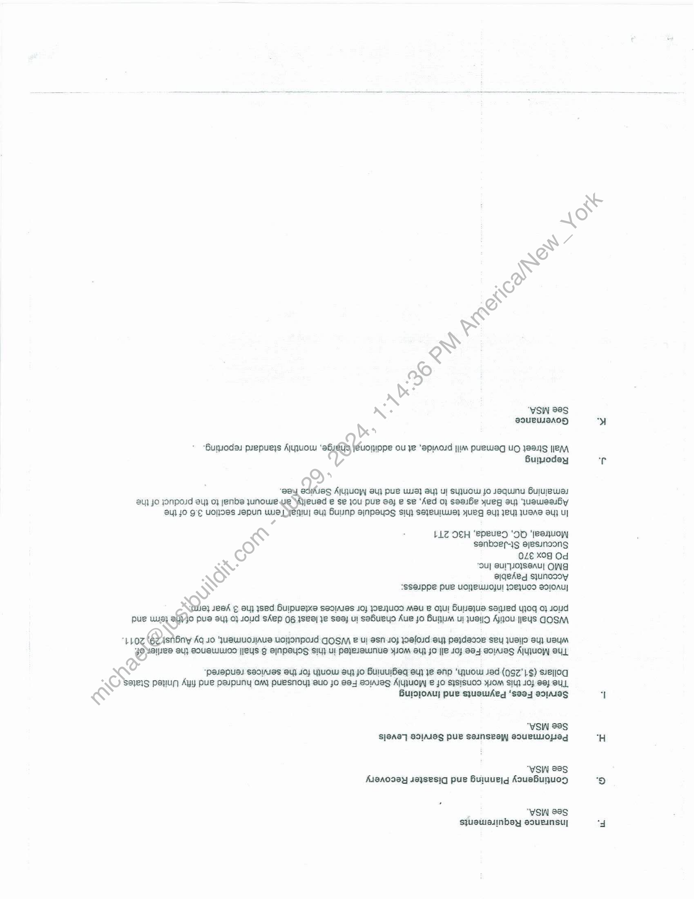

##### Schedule 8 - Statement of Work for Credit Research Reports and Equity Research Company Reports]

  
````col
```col-md
flexGrow=.5
===
> [!info] [Page 1](_attachments/images_BMO-3.6.1.21.700221871.pdf_212606/page_1.png)
> 
```  
```col-md
SCHEDULE 8  
This Schedule is made pursuant to a Master Services Agreement made between the Bank of Montreal (the
“Bank") and Wall Street on Demand, Inc. (WSOD) (the "Service Provider") effective as of the 10" day of December,
2008 (the "Agreement’). Unless otherwise set out, the terms and provisions of the Agreement are incorporated in
this Schedule. This Schedule is effective as of the 13" day of May, 2071.  
A. Term and Termination
This statement of work will automatically terminate at the end of the 3 year term, beginning from the billing
commencement date, In the event that Client requests a continuation of services, the parties may enter into  
a separate SOW governing additional services.
B. Description of Services BS
Wall Street On Demand will deliver to BMO, Credit Research Reports (~300 files (KML & PDF) set yearly |  
with updates being provided daily) and Equity Research Company Reports (~ 30 files (XML & PDF) set
monthly, with updates being provided daily). Data provider shall be Morningstar.  
RS 7  
The Credit Research Reports (average/approx. 6 pages in length) will offer in-depth analysis a ans
covered by Morningstar's credit analysts. Reports provided will be limited to all Canadian-do a. Jd
companies on Morningstar's credit research coverage list, as well’ as an additional 300 fm damicies
outside Canada. This list is refreshed at Licensee's request once after each year. aN  
* Delivery Frequency is to be daily as credit ratings and data are updated wi market events.  
¢ Delivery Format is one RIXML file and one PDF file for each company wee (approx 310 RIXML  
and 310 PDF files) ve
« Ahistorical set will be maintained for future enhancements.  
The Equity Research Company Reports (average/approx. 5 pages in length, plus financials & definitions) will
offer in-depth analysis on companies covered by Marningstar's equi! Spiyets, Reports provided will be
limited to those equities that are referenced in either the Morningst nada Core Picks List or the
Morningstar Canada Income Picks List. *
* Delivery Frequency is to be daily and equity ratings data will be updated by the close of business
every day that major U.S. stock exchanges are opea. °
* Delivery Format is a single XML file for all 4 Siena one PDF for each company (approx. 30  
expected).
»  Ahistorical set will be maintained for tutu Sbnancements  
immediately included in the research repo) @n necessary (PDF Reports are updated with equity notes
intra-day, meaning that if we added a not Oam, a new PDF is immediately generated). BMO will
receive Equity Notes in a separate RReey hich would allow BMOIL clients to stay updated on notable
events.
* Delivery Frequency is to be daily and Equity Notes are to be updated intraday as market events
occur.
¢ Delivery Format is & single XML file with all equity notes for MS universe.  
With relation to De ent, Wall Street On Demand will perform the following tasks for project realization:  
Bring in XML/PDF. from Morningstar FTP and storing data in a SQL database; Create a QID to pull the
data from the Sai Hetabase and build a .CSV file; and, create an API to push the .CSV file to the BMO FTP  
site. X
“5?  
Cc. ten Security Requirements
A.  
Equity Research Notes — Morningstar cor 200-400 ‘Equity Notes’ per day and these notes are  
Se  
D scSabcontractor who will assist in providing the Services  
. NO) None.  
¢<  
E. Audit Rights and Attestations
See MSA  
```
````
Notes:    
````col
```col-md
flexGrow=.5
===
> [!info] [Page 2](_attachments/images_BMO-3.6.1.21.700221871.pdf_212606/page_2.png)
> 
```  
```col-md‘VSI 88S
\ @OUBLUBANH
4  
“Bumuodas puepueys Ajyjuow ‘al ed, UONIPPe OU Je 'APIAOJA jim PUBWAG UO }8ANS [eM
Bunsodey
4  
U} JO JONposd ay} 0} jenbes juNowe: jeued e Se jou pue aj e Se ‘Aed 0} soaiHe yueg ou) ‘JUueWeauBy
ay} JO 9°€ UOHIOSs JepuNn We; yeniu| aij Buunp ainpauss si se}euluwe} yUeg By] JEU) JU@AS OU] UY
¢  
ser AjujuOy au} pue Ws} By} ul SYJUOW Jo JequuNu BujUeWaL  
& e LL@ O€H ‘epeued ‘OH ‘}eeuoy)  
fe) sanboer-}g ayesunoong  
(©) O4€ XOG Od  
WW “OuU] BUITOWSSAU] OWA
NS) ajqeked sjunoooy  
ISSOIPPE PUB UONBUUOJU! JOEJUOD SdIOAU  
Qa aeek ¢ 0uj) sed Buipueyxe seoiases 10) joRIJUOD MAU B OI! BuLejUe sayied yjOg Oo} JOUd
pue wus, 2f}0 Pua 34} 0} 10d Shep 06 ISB9) Je Seay UI sabueYO Aue Jo Bum ul JUayD Awou Jeus GOSM  
WORE isnBny Aq JO UuswiUOJAUS UOHONpOId GOS B Ul aSn 40} Weloid ayy paydesce sey jUAIIO sy) UeyM
8 1128 BY} SOURLULUOD HEUS G BINPEYOS Siu} UI PeyeJeWNUS YIOM SUR JO {je 10} 9e-4 eoIAJEg AjyUOW SUL  
SN “pasepuss Seoiues St JO} YJUOW By} Jo BuluUIBeq eu) Je onp ‘tUOW Jed (9gz'1$) svEIIOg
NO) SIEIS PayuN AYy Pue Paypuny OM} PuesNoY] BuO JO B84 SoIAJeg AjJUOW] & JO S}SISUOD YOM SIU} JO) Se} SUL
Bursjoauy pue sjuawiAeg ‘seay ao1as  
“VSN 98S
S]OAS7] SOIAIOS puke Sesnseey eoUeUUOLeg  
“YSIN 88S
Aigaoasy s03sesiq pue Huiuuejg Asuehujuog  
7 “VSIA 88S
sjuswasinbsy soueunsu]  
```
````
Notes:    
````col
```col-md
flexGrow=.5
===
> [!info] [Page 3](_attachments/images_BMO-3.6.1.21.700221871.pdf_212606/page_3.png)
> 
```  
```col-md
IN WITNESS WHEREOF the parties hereto have signed this Schedule 8, effective as of the date and year first written
above.  
BANK < TREAL Pas  
See RAKNUSSO
‘Ni
“EP stemecy + Peopucr DumrofieniT  
ela I>  
Wate)  
WALL STREET ON DEMAND, INC.  
Per:  
(Sighature) a  
6 Tanner 7
WPhesident ¢ cre we
ml 118 : ~
ee) 6)  
@atey WS  
```
````
Notes:    
````col
```col-md
flexGrow=.5
===
> [!info] [Page 4](_attachments/images_BMO-3.6.1.21.700221871.pdf_212606/page_4.png)
> 
```  
```col-md  
```
````
Notes:  


![[_attachments/BMO-3.6.1.21.7 00221871.pdf]