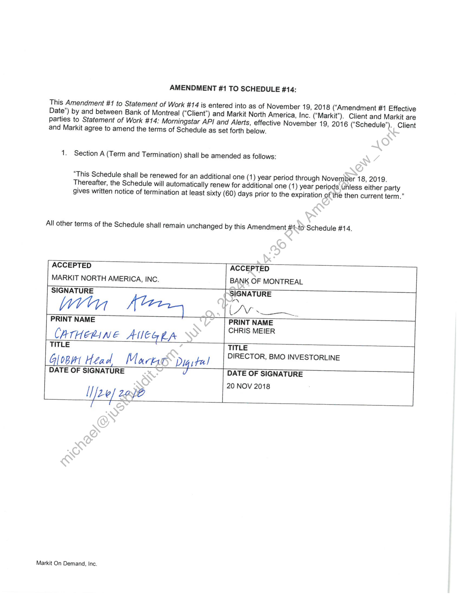

##### Amendment #1 to Statement of Work #14: Morningstar API and Alerts]

  
````col
```col-md
flexGrow=.5
===
> [!info] [Page 1](_attachments/images_BMO-3.6.1.21.800221946.pdf_210423/page_1.png)
> 
```  
```col-md
AMENDMENT #1 TO SCHEDULE #14:  
This Amendment #1 to Statement of Work #14 is entered into as of November 19, 2018 (‘Amendment #1 Effective
Date”) by and between Bank of Montreal (“Client”) and Markit North America, Inc. (“Markit”). Client and Markit are
parties to Statement of Work #14: Morningstar API and Alerts, effective November 19, 2016 (“Schedule”). Client  
and Markit agree to amend the terms of Schedule as set forth below.  
1. Section A (Term and Termination) shall be amended as follows:  
“This Schedule shall be renewed for an additional
Thereafter, the Schedule will automatically renew for additional one (1 ) year periods Unless either party
gives written notice of termination at least sixty (60) days prior to th  
All other terms of the Schedule shall remain unchanged by this Amendment #40’ Schedule #14.  
ACCEPTED ACCEPTED
MARKIT NORTH AMERICA, INC. BANK OF MONTREAL
| SIGNATURE SIGNATURE
oN
| PRINT NAME ~ | PRINT NAME
CHRIS MEIER
CATHERINE AEG LA |
TITLE TITLE
DIRECTOR, BMO INVESTORLINE
Glob Head Marto Digital _|
DATE OF SIGNATURE DATE OF SIGNATURE
20 NOV 2018  
Ufee) 2208  
Markit On Demand, Inc.  
one (1) year period through November 18, 2019.  
e expiration of the then current term.”  
```
````
Notes:  


![[_attachments/BMO-3.6.1.21.8 00221946.pdf]