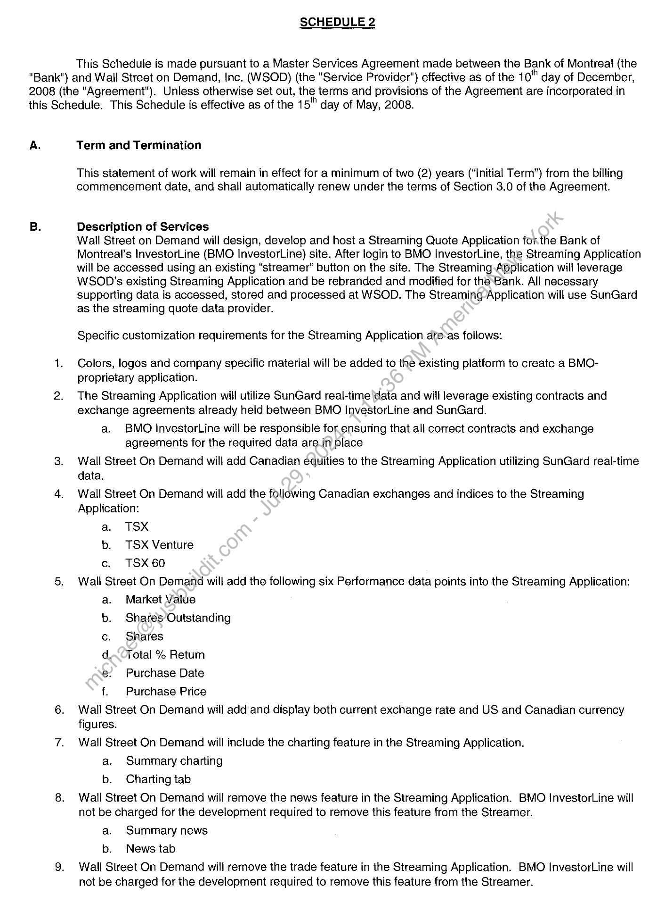
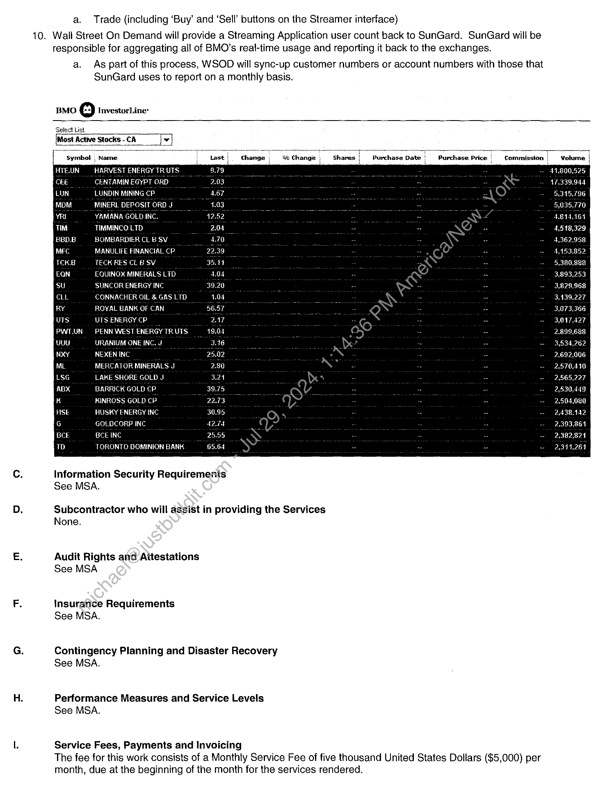
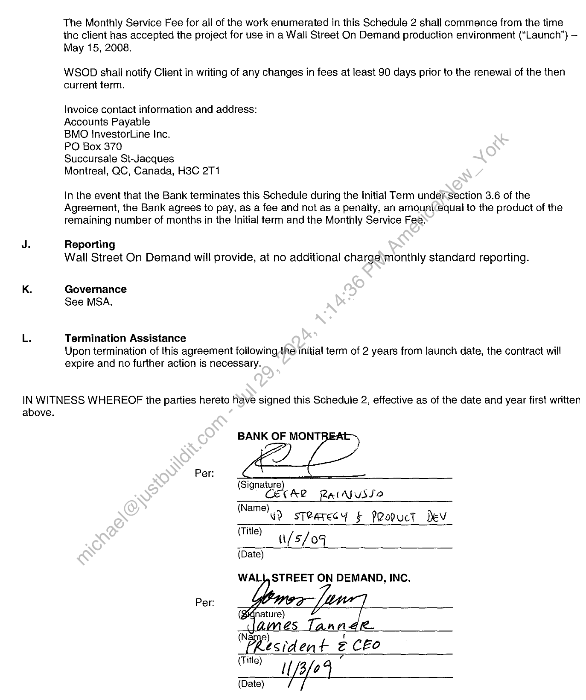

##### Schedule 2 - Streaming Quote Application for BMO InvestorLine]

  
````col
```col-md
flexGrow=.5
===
> [!info] [Page 1](_attachments/images_BMO-3.6.1.21.900221869.pdf_210350/page_1.png)
> 
```  
```col-md
SCHEDULE 2  
This Schedule is made pursuant to a Master Services Agreement made between the Bank of Montreal (the  
"Bank") and Wall Street on Demand, Inc. (WSOD) (the "Service Provider’) effective as of the 10” day of December,
2008 (the "Agreement'). Unless otherwise set out, the terms and provisions of the Agreement are incorporated in
this Schedule. This Schedule is effective as of the 15" day of May, 2008.  
A.  
Term and Termination  
This statement of work will remain in effect for a minimum of two (2) years (“Initial Term”) from the billing
commencement date, and shall automatically renew under the terms of Section 3.0 of the Agreement.  
Description of Services  
Wall Street on Demand will design, develop and host a Streaming Quote Application forthe Bank of
Montreal’s InvestorLine (BMO InvestorLine) site. After login to BMO InvestorLine, the Streaming Application
will be accessed using an existing “streamer” button on the site. The Streaming Application will leverage
WSOD’s existing Streaming Application and be rebranded and modified for the'Bank. All necessary
supporting data is accessed, stored and processed at WSOD. The Streaming Application will use SunGard
as the streaming quote data provider.  
Specific customization requirements for the Streaming Application ate*as follows:  
Colors, logos and company specific material will be added to the existing platform to create a BMOproprietary application.
The Streaming Application will utilize SunGard real-time ‘data and will leverage existing contracts and
exchange agreements already held between BMO investorLine and SunGard.
a. BMO InvestorLine will be responsible for ensuring that all correct contracts and exchange
agreements for the required data are.in place  
Wall Street On Demand will add Canadian equities to the Streaming Application utilizing SunGard real-time
data.  
Wall Street On Demand will add the following Canadian exchanges and indices to the Streaming
Application:  
a. TSX
b. TSX Venture
c. TSX60  
Wall Street On Demand will add the following six Performance data points into the Streaming Application:
Market Value  
Shares Outstanding  
Shares  
Total % Return  
Purchase Date  
Purchase Price  
Wall Street On Demand will add and display both current exchange rate and US and Canadian currency
figures.  
Wall Street On Demand will include the charting feature in the Streaming Application.
a. Summary charting
b. Charting tab  
Wall Street On Demand will remove the news feature in the Streaming Application. BMO InvestorLine will
not be charged for the development required to remove this feature from the Streamer.  
a. Summary news
b. News tab  
Wall Street On Demand will remove the trade feature in the Streaming Application. BMO InvestorLine will
not be charged for the development required to remove this feature from the Streamer.  
em Oa 9° 5 »  
```
````
Notes:    
````col
```col-md
flexGrow=.5
===
> [!info] [Page 2](_attachments/images_BMO-3.6.1.21.900221869.pdf_210350/page_2.png)
> 
```  
```col-md
a. Trade (including ‘Buy’ and ‘Sell’ buttons on the Streamer interface)  
10. Wall Street On Demand will provide a Streaming Application user count back to SunGard. SunGard will be
responsible for aggregating all of BMO’s real-time usage and reporting it back to the exchanges.
a. As part of this process, WSOD will sync-up customer numbers or account numbers with those that
SunGard uses to report on a monthly basis.  
BMO oO InvestorLine*
Select List,
Most Active Stocks - CA v  
symbol , Name ast! Change i % Change | Purchase Date | Purchase Price | Commission | Volume i
HARVEST ENERGY TR UTS
CENTAMIN EGYPT ORD
LUNDIN MININ  
MINERL DEPOSIT ORD J
YAMANA GOLD  
TIMMINCO LTD
BOMBARDIER CL B SV
MANULIFE FINANCIAL CP  
TE  
EQUINOX MINERALS LTD
SUNCOR ENERGY INC
CONNACHER OIL & GAS LTD  
ROYAL BANK OF CAN  
Shares |  
UTS ENERGY CP
PENN WEST ENERGY  
URANIUM ONE IN  
NEXEN INC  
MERCATOR MINERALS J  
LAKE SHORE GOLD J  
BARI GOLD CP  
KINROSS GOLD CP 2 as : ~ ~ - -- 2,504,080
HUSKY ENERGY INC ° ~ - 2.438.142
GOLDCORP INC  
BCE INC  
TORONTO DOMINION BANK  
Information Security Requiremenis
See MSA.  
Subcontractor who will assist in providing the Services
None.  
Audit Rights and Aitestations
See MSA  
Insurance Requirements
See MSA.  
Contingency Planning and Disaster Recovery
See MSA.  
Performance Measures and Service Levels
See MSA.  
Service Fees, Payments and Invoicing
The fee for this work consists of a Monthly Service Fee of five thousand United States Dollars ($5,000) per
month, due at the beginning of the month for the services rendered.  
```
````
Notes:    
````col
```col-md
flexGrow=.5
===
> [!info] [Page 3](_attachments/images_BMO-3.6.1.21.900221869.pdf_210350/page_3.png)
> 
```  
```col-md
The Monthly Service Fee for all of the work enumerated in this Schedule 2 shall commence from the time
the client has accepted the project for use in a Wall Street On Demand production environment (“Launch”) —
May 15, 2008.  
WSOD shall notify Client in writing of any changes in fees at least 90 days prior to the renewal of the then
current term.  
Invoice contact information and address:
Accounts Payable  
BMO InvestorLine Inc.  
PO Box 370  
Succursale St-Jacques  
Montreal, QC, Canada, H3C 2T1  
In the event that the Bank terminates this Schedule during the Initial Term undersection 3.6 of the
Agreement, the Bank agrees to pay, as a fee and not as a penalty, an amount:equal to the product of the
remaining number of months in the Initial term and the Monthly Service Fee:  
J. Reporting
Wall Street On Demand will provide, at no additional charge\monthly standard reporting.  
K. Governance
See MSA.
L. Termination Assistance  
Upon termination of this agreement following the initial term of 2 years from launch date, the contract will
expire and no further action is necessary.  
IN WITNESS WHEREOF the parties hereto have signed this Schedule 2, effective as of the date and year first written
above.
BANK OF MONT!
7)
(Signature)
Cet  
(Name  
Per:  
AR Ratvusso  
ey) sT@arecy § PRoducT ev
u/s/04  
(Title)  
(Date)  
WALIJ, STREET ON DEMAND, INC.  
Per:  
@s an
t
esiden + @C&o  
(Title)
_ Wefe 4  
```
````
Notes:  


![[_attachments/BMO-3.6.1.21.9 00221869.pdf]