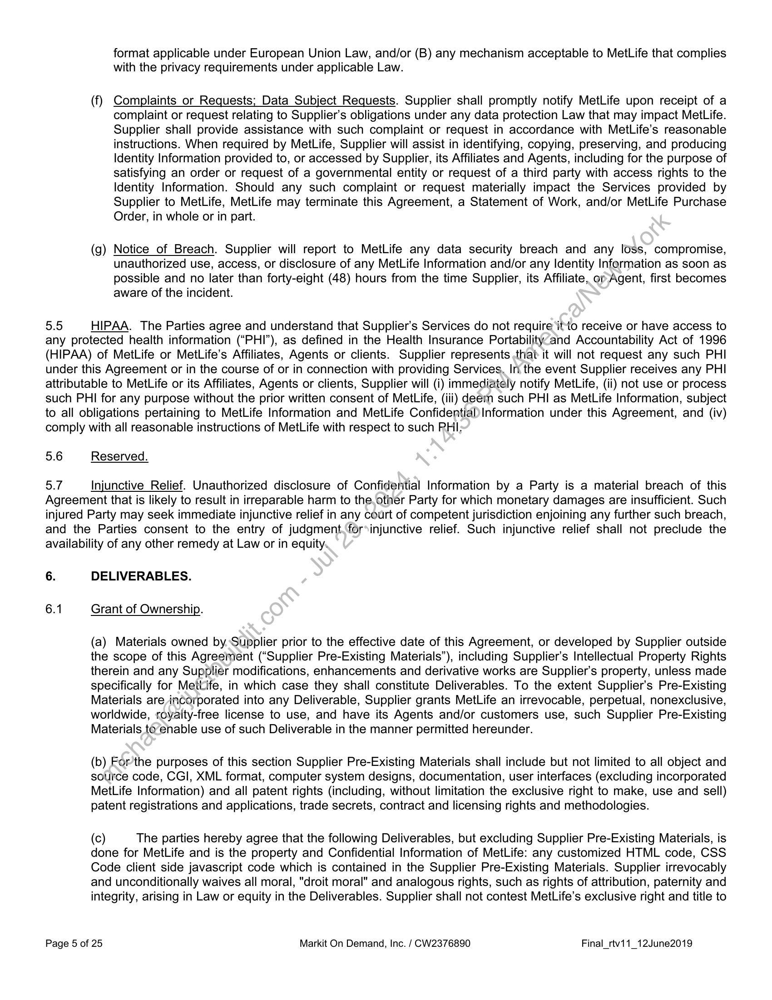
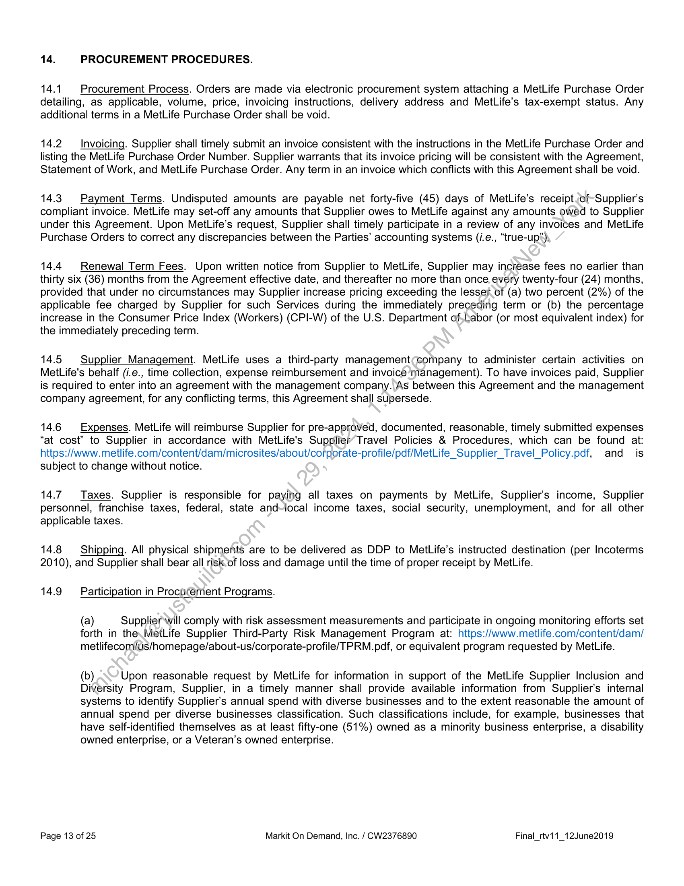

##### Procurement Agreement]

  
````col
```col-md
flexGrow=.5
===
> [!info] [Page 1](_attachments/images_MetLife-3.6.1.22.1Metlife-ProcurementAgreement.pdf_210425/page_1.png)
> 
```  
```col-md
CW2376890  
iy MetLife  
MARKIT ON DEMAND, INC. - PROCUREMENT AGREEMENT
MetLife Investment Management Client Portal  
This Procurement Agreement (inclusive of attached and referenced schedules, addenda and policies, the “Agreement”), is
made as of May 31, 2019 by and between Markit on Demand, Inc. (“Supplier”), 620 8th Avenue, 35th Floor, New York, NY
10018, United States, and MetLife Services and Solutions, LLC (“MSS”), 200 Park Avenue, New York, NY. 10166-0005
(each a “Party” and collectively the “Parties”).  
This Procurement Agreement is effective only for the acquisition of the MetLife Investment Management Client Portal.
For good and valuable consideration, the receipt and sufficiency of which is acknowledged, the Parties agree as follows:
1. DEFINITIONS.  
“Affiliate” means any business enterprise organized under Law, controlled by, controlling, or under common
control with a Party. Ownership of fifty percent (50%) in the United States and. twenty five percent (25%) in any other
jurisdiction of the equity, shares, or securities entitling voting rights for election of managing authority constitutes control of
any such enterprise. Affiliates, as necessary, shall be identified in an applicable Statement of Work.  
“Agent” means any employee, officer, director, partner, consultant, representative, contractor or other person
that acts or performs on a Party’s behalf.  
“Confidential Information” means (i) the terms ofthis Agreement, and (ii) all information provided by the
disclosing Party (“Discloser”) to the receiving Party (“Recipient”) that is commercially valuable, confidential, proprietary, a
trade secret, or could reasonably be considered confidential, but does not include information that: (a) was already known
at the time of the disclosure or later becomes generally known or available to the public through no fault of Recipient; (b)
was at the time of disclosure already in Recipient's possession or is later received from a third-party that Recipient
reasonably believed had the right to disclose such information; or (c) is independently developed by Recipient without
reliance on Discloser’s Confidential Information. These exceptions apply if the information was not delivered to or
obtained by Recipient as a result of any breach of this Agreement, Law, or any contractual, ethical, or fiduciary obligation
owed to Discloser.  
“Deliverable(s)” means;.subject to section 6 herein, all materials, processes and information Supplier provides,
develops, in whole or in part;solely or jointly with others, for or on behalf of MetLife pursuant to this Agreement, a
Statement of Work, and/or,a MetLife Purchase Order, including all intermediate and partial versions, in any medium, and
all documentation relating thereto. “Deliverable(s)” include Output derived from the combination of Supplier Services and
MetLife Information (as,defined below) where “Output” means the MetLife Investment Management Client Portal.  
“Hosting Services” means the Supplier-provided traditional IT functions such as infrastructure, monitoring,
storage, website. hosting, over the Internet or other wide area networks supporting the Platform Services.  
“Identity Information” means names, addresses, phone numbers, social security or other government issued
identification numbers, dates of birth, and any other information relating to an identifiable individual.  
“Intellectual Property Rights” means any patent, copyright, trademark, service mark, trade secret or other
intellectual property or industrial property right (including applications), and any moral rights and goodwill related thereto.  
“Law” means all laws, rules, regulations, guidelines and ordinances, and all binding orders of any court, agency
or other governmental, regulatory or administrative body of the United States and any other intended or applicable
jurisdiction.  
Page 1 of 25 Markit On Demand, Inc. / CW2376890 Final_rtv11_12June2019  
```
````
Notes:    
````col
```col-md
flexGrow=.5
===
> [!info] [Page 2](_attachments/images_MetLife-3.6.1.22.1Metlife-ProcurementAgreement.pdf_210425/page_2.png)
> 
```  
```col-md
“MetLife” means MSS and/or its Affiliates, as applicable.  
“MetLife Information” means (i) all information disclosed by MetLife at any time, about the research,
development, or business activities of MetLife; its customers; prospective customers; or personnel, under circumstances
where Supplier could reasonably understand the information to be confidential. The content of written work that
constitutes a Deliverable under this Agreement is also MetLife Information.  
“MetLife Purchase Order” means a requisition document generated by MetLife listing any Deliverables and/or
Services to be purchased by MetLife in accordance with the applicable Statement of Work.  
MetLife Systems” means (i) all telecommunication and computer systems, equipment and programs, owned by,
licensed to and/or operated by MetLife and/or its Agents, (ii) all property interfacing therewith, and (iii) the data transmitted
via such systems.  
“Platform Services” means the Supplier-provided software and hardware technologies.that-are used as the basis
on which the applicable Services, including Deliverables, can be run.  
“Services” means the services provided by Supplier for MetLife under a Statement of Work  
“Statement of Work” means a requisition document or ordering agreement describing in detail any Deliverables
and/or Services to be provided by Supplier for MetLife, and signed by the Parties:  
“Supplier” means Supplier and its Affiliates and Agents.  
“Supplier Personnel” means any personnel of Supplier, its Affiliates or Agents working in connection with this
Agreement.  
2. DELIVERY OF SERVICES AND/OR DELIVERASBi.ES. Supplier shall provide Services and/or Deliverables in
accordance with a Statement of Work subject to the terms of this Agreement.  
3. ACCEPTANCE / CORRECTIONS OF DELIVERABLES.  
3.1 Acceptance. MetLife shall have) thirty (30) days after receipt of Deliverables (the “Acceptance Period”) to (i)
accept the Deliverables, or (ii) to notify the‘Supplier of its failure to satisfy the requirements of this Agreement, Statement
of Work, MetLife Purchase Order, or otherspecifications provided to MetLife in writing.  
3.2 Corrections. Supplier shail)correct any failure(s) of a Deliverable to comply with the requirements of this
Agreement, Statement of Work, MetLife Purchase Order, or other specifications provided to MetLife in writing, and:  
(a  
LS  
Deliver the correction to MetLife within ten (10) business days, unless otherwise agreed to by the Parties.  
(b  
aS  
Upon re-delivery, MetLife shall have an additional Acceptance Period to either accept the Deliverables or to
notify Supplier of any failure(s).  
(c  
The foregoing acceptance/rejection/correction process shall be repeated until all failures have been corrected
by Supplier and MetLife has accepted the Deliverable.  
(d  
=  
Notwithstanding (c) above, if after two (2) or more Acceptance Periods, Supplier has not satisfied the
requirements and specifications, MetLife may reject the Deliverables and terminate all or part of the
applicable Statement of Work or MetLife Purchase Order with no obligation to remit further fees, and Supplier
shall refund to MetLife all payments for such rejected Deliverables and any associated Services.  
Page 2 of 25 Markit On Demand, Inc. / CW2376890 Final_rtv11_12June2019  
```
````
Notes:    
````col
```col-md
flexGrow=.5
===
> [!info] [Page 3](_attachments/images_MetLife-3.6.1.22.1Metlife-ProcurementAgreement.pdf_210425/page_3.png)
> 
```  
```col-md
4. RELATIONSHIP.  
41 Independent Contractor. Supplier is an independent contractor. All employees of Supplier, its Affiliates and
Agents are Supplier Personnel and not personnel of MetLife for any purpose, are not entitled to any compensation or
benefits from MetLife, and are under the exclusive control and direction of Supplier. Supplier is solely responsible for the
(a) recruitment, hiring, training, assignment, promotion, discipline, termination, or other employment-related activities of
such personnel, and (b) payment of all such personnel’s taxes, benefits, immigration related costs, and any deductions,
withholdings and fees required by Law. Supplier may not bind or obligate MetLife in any manner.  
4.2 Supplier Personnel.  
(a) Supplier hereby confirms that Supplier Personnel are subjected to background screening prior to.employment
with Supplier and includes, among other things, criminal history, education verification.) employment
verification and judgments; and Social Security number verification and Supplier will ‘confirm/reaffirm
Supplier's compliance to MetLife if so requested.  
(b) Supplier shall use commercially reasonable efforts to ensure the continuity of Supplier Personnel. At any time
during the course of the project, MetLife may request that Supplier remove any-Supplier Personnel from the
project due to incompetence, or unprofessional, illegal, or behaviors reasonably unacceptable to MetLife. In
the event that occurs, Supplier will remove that team member immediately-from MetLife premises and the
Services (except as is reasonable and necessary to effect knowledge transfer respecting the Services) upon
notice and replace him or her with another employee of similar expertise and experience as quickly as
possible to avoid business/project delay and/or disruption but in no.évent less than ten (10) business days.  
4.3 Conflict of Interest.  
(a) Personal Conflict of Interest. Each party represents and warrants that no employee of such Party, its Agents
or Affiliates has received or shall receive compensation other than from such Party related to obtaining or
negotiating this Agreement, and that such Party knows of no relationship with an employee of the other Party,
its Agents or Affiliates, or other entity, that may.impair the objectivity of performance under this Agreement.
Each party will promptly notify the other partyin writing if it becomes aware of any such conflict of interest.  
(b  
aS  
Insider_Information. Supplier, its Affiliates, Agents, and their respective employees and personnel are
prohibited from buying or selling MetLife securities on the basis of Confidential Information and from providing
others with such information or recommending the purchase or sale of securities based on such information.
Supplier is responsible for instructing such employees and personnel of this prohibition.  
44 Subcontracting / Delegation. Supplier shall not subcontract or delegate any obligation, in whole or in part, without
MetLife’s written approval, which maybe withheld in MetLife’s discretion. Notwithstanding such approval, Supplier is liable
for the performance and conductof its Affiliates and Agents, as if such performance and conduct is Supplier’s own. The
subcontractors listed in Schedule “B” are approved subcontractors under this Agreement. Any changes to Schedule “B”
must be made by a mutually‘executed amendment to this Agreement.  
4.5 MetLife Affiliates. MSS may extend this Agreement to its Affiliates. When an MSS Affiliate executes a Statement
of Work, such Affiliate shall be solely responsible and liable for the performance of all of its obligations in connection
therewith. Suppliershall copy MSS on all notices sent to MSS Affiliates with respect to any dispute under this Agreement.  
46 Metlife Policies. Supplier will comply with all MetLife policies communicated in written form (email is acceptable)
to Supplier which are relevant to the Services provided by Supplier, including policies regarding access to MetLife’s
Systems and premises. Supplier shall provide MetLife timely notice of any MetLife policy with which Supplier disagrees
and the parties shall work in good faith to resolve the issue.  
5. CONFIDENTIALITY.  
5.1 MetLife Information / Records. MetLife Information is the property of MetLife. Supplier Personnel with a need-toknow may be given access to MetLife Information, provided each is bound by obligations of non-disclosure, confidentiality,  
Page 3 of 25 Markit On Demand, Inc. / CW2376890 Final_rtv11_12June2019  
```
````
Notes:    
````col
```col-md
flexGrow=.5
===
> [!info] [Page 4](_attachments/images_MetLife-3.6.1.22.1Metlife-ProcurementAgreement.pdf_210425/page_4.png)
> 
```  
```col-md
data security and privacy as restrictive as those herein. Supplier shall keep complete and accurate records of MetLife
Information, and if disclosed to third parties as permitted herein, records as to such disclosure.  
5.2 Confidentiality. Each Party agrees (i) not to disclose the other Party’s Confidential Information without its express
written consent, and (ii) to use the same standard of care to protect the other Party's Confidential Information as it uses to
protect its own, but no less than a commercially reasonable standard of care.  
MetLife is permitted to disclose Supplier's Confidential Information to MetLife’s Affiliates and Agents with a need-to-know;
and to MetLife’s outside legal counsel, professional advisors, and external auditors that are subject to obligations of
confidentiality.  
If either Party is legally compelled to disclose the other Party’s Confidential Information, that Party shall, (a);to-the extent
permissible, provide as much advance notice as possible of the prospective release to enable the other\Party to oppose
the disclosure, and (b) disclose only the Confidential Information it is legally obligated to disclose.  
5.3. Return / Destruction of MetLife Information. Upon completion or termination of the Services or upon MetLife’s
request, Supplier shall return or destroy MetLife Information, and confirm the same, in accordance with MetLife’s direction.
Supplier may retain MetLife Information only if required by Law, and may retain an archival copy of MetLife Information to
the extent made as part of routine, ordinary-course electronic backup of its information technology systems in accordance
with its records retention and IT backup policies. Any MetLife Information that is not-destroyed or returned shall be
continually protected in accordance with the terms of this Agreement.  
5.4 Privacy Law Compliance.  
(a) Confidentiality / Use of Identity Information. Identity Information disclosed by or on behalf of a Party is the
Confidential Information of that Party. Identity Information disclosed by MetLife may only be used by Supplier
to perform its obligations under this Agreement.  
(b) Processing Identity Information. Supplier will -(i)sProcess Identity Information provided by MetLife in
accordance with MetLife’s written instructions, (ii)/Process Identity Information in the country which MetLife
delivered it to Supplier or in which access was granted by MetLife unless otherwise directed by MetLife in
writing, (iii) immediately cease Processing, such Identity Information upon MetLife’s direction, and (iv) not
disclose, transfer or provide access to such Identity Information to any third party without MetLife’s written
approval. “Process” means any operation performed upon Identity Information such as collection; recording;
organization; storage; adaptation; alteration; retrieval; consultation; use; transfer; disclosure by transmission,
dissemination, or otherwise; alignment or combination; blocking; erasure or destruction.  
(c) Consent. Identity Information’ provided by Supplier may be collected, Processed, and/or transferred (each, a
“Transfer”) across international boundaries to MetLife Systems. If such Transfer requires consent from any
person prior to Transfer by MetLife, Supplier shall be solely responsible for obtaining legally compliant
consent permitting:stich Transfer and shall provide copies of such consent to MetLife upon request.  
(d) U.S. and International Data Protection Laws. Supplier shall comply with all applicable Laws governing privacy,
data protection, data security and data security breaches. If required by MetLife, Supplier, its Affiliates and
Agents;-as applicable, shall promptly execute supplemental security and data protection terms, and controllerto-processor data transfer agreements as required for the Processing or Transfer of Identity Information
provided by MetLife in accordance with Law or as otherwise mutually agreed upon. Supplier shall notify
MetLife in writing if any Affiliates or Agents perform any Services outside the United States and have access
to Identity Information provided by MetLife or MetLife Information.  
(e) European Union. If Supplier Processes the personal data of any European Union resident governed by the
European Union General Data Protection Regulation, Supplier (a) shall enter into MetLife’s European Union
Data Privacy Agreement, and (b) shall Process such data (i) in the European Economic Area (“EEA”) or a
country considered by the European Commission as providing adequate data privacy protection, or (ii)
outside the EEA provided Supplier ensures the Transfer of such personal data outside the EEA and
subsequent Processing is in compliance with Law by means of entering into (A) the controller-to-processor
data transfer agreement approved by the European Commission, the current version Standard Contractual
Clauses (controller to processor), in compliance with Commission Decision C (2010) 593 or any subsequent  
Page 4 of 25 Markit On Demand, Inc. / CW2376890 Final_rtv11_12June2019  
```
````
Notes:    
````col
```col-md
flexGrow=.5
===
> [!info] [Page 5](_attachments/images_MetLife-3.6.1.22.1Metlife-ProcurementAgreement.pdf_210425/page_5.png)
> 
```  
```col-md
format applicable under European Union Law, and/or (B) any mechanism acceptable to MetLife that complies
with the privacy requirements under applicable Law.  
(f) Complaints or Requests; Data Subject Requests. Supplier shall promptly notify MetLife upon receipt of a
complaint or request relating to Supplier’s obligations under any data protection Law that may impact MetLife.
Supplier shall provide assistance with such complaint or request in accordance with MetLife’s reasonable
instructions. When required by MetLife, Supplier will assist in identifying, copying, preserving, and producing
Identity Information provided to, or accessed by Supplier, its Affiliates and Agents, including for the purpose of
satisfying an order or request of a governmental entity or request of a third party with access rights to the
Identity Information. Should any such complaint or request materially impact the Services provided by
Supplier to MetLife, MetLife may terminate this Agreement, a Statement of Work, and/or MetLife Purchase
Order, in whole or in part.  
oy
2  
Notice of Breach. Supplier will report to MetLife any data security breach and any loss, compromise,
unauthorized use, access, or disclosure of any MetLife Information and/or any Identity Information as soon as
possible and no later than forty-eight (48) hours from the time Supplier, its Affiliate, or Agent, first becomes
aware of the incident.  
5.5 HIPAA. The Parties agree and understand that Supplier's Services do not require ifto receive or have access to
any protected health information (“PHI”), as defined in the Health Insurance Portability-and Accountability Act of 1996
(HIPAA) of MetLife or MetLife’s Affiliates, Agents or clients. Supplier represents that it will not request any such PHI
under this Agreement or in the course of or in connection with providing Services, In the event Supplier receives any PHI
attributable to MetLife or its Affiliates, Agents or clients, Supplier will (i) immediately notify MetLife, (ii) not use or process
such PHI for any purpose without the prior written consent of MetLife, (iii) deem such PHI as MetLife Information, subject
to all obligations pertaining to MetLife Information and MetLife Confidential Information under this Agreement, and (iv)
comply with all reasonable instructions of MetLife with respect to such PHI:  
5.6 Reserved.  
5.7 Injunctive Relief. Unauthorized disclosure of Confidential Information by a Party is a material breach of this
Agreement that is likely to result in irreparable harm to the.other Party for which monetary damages are insufficient. Such
injured Party may seek immediate injunctive relief in any court of competent jurisdiction enjoining any further such breach,
and the Parties consent to the entry of judgment. for»injunctive relief. Such injunctive relief shall not preclude the
availability of any other remedy at Law or in equity.  
6. DELIVERABLES.  
6.1 Grant of Ownership.  
(a) Materials owned by. Supplier prior to the effective date of this Agreement, or developed by Supplier outside
the scope of this Agreement (“Supplier Pre-Existing Materials”), including Supplier’s Intellectual Property Rights
therein and any Supplier modifications, enhancements and derivative works are Supplier's property, unless made
specifically for Mettife, in which case they shall constitute Deliverables. To the extent Supplier's Pre-Existing
Materials are incorporated into any Deliverable, Supplier grants MetLife an irrevocable, perpetual, nonexclusive,
worldwide, royalty-free license to use, and have its Agents and/or customers use, such Supplier Pre-Existing
Materials te‘enable use of such Deliverable in the manner permitted hereunder.  
(b) For'the purposes of this section Supplier Pre-Existing Materials shall include but not limited to all object and
source code, CGI, XML format, computer system designs, documentation, user interfaces (excluding incorporated
MetLife Information) and all patent rights (including, without limitation the exclusive right to make, use and sell)
patent registrations and applications, trade secrets, contract and licensing rights and methodologies.  
(c) The parties hereby agree that the following Deliverables, but excluding Supplier Pre-Existing Materials, is
done for MetLife and is the property and Confidential Information of MetLife: any customized HTML code, CSS
Code client side javascript code which is contained in the Supplier Pre-Existing Materials. Supplier irrevocably
and unconditionally waives all moral, "droit moral" and analogous rights, such as rights of attribution, paternity and
integrity, arising in Law or equity in the Deliverables. Supplier shall not contest MetLife’s exclusive right and title to  
Page 5 of 25 Markit On Demand, Inc. / CW2376890 Final_rtv11_12June2019  
```
````
Notes:    
````col
```col-md
flexGrow=.5
===
> [!info] [Page 6](_attachments/images_MetLife-3.6.1.22.1Metlife-ProcurementAgreement.pdf_210425/page_6.png)
> 
```  
```col-md
the Deliverables and the Intellectual Property Rights related thereto or the validity thereof, and agrees not to make
any claim against any party authorized by MetLife to exploit the Deliverables.  
(d) Unless otherwise as stated in an SOW, the parties acknowledge that providing Services may result in the
development by Supplier of new concepts, software, methods, techniques, processes, adaptations and ideas, in
addition to Suppliers prior technology, which may be embodied in the Services provided pursuant to this
Agreement and/or the intellectual property underlying such solution. The parties agree that such property shall
belong to Supplier exclusively. For clarity and the avoidance of doubt the Deliverable — including but not limited to
the website design - shall remain the exclusive proprietary property of MetLife.  
6.2 Works Made for Hire. To the extent the Deliverables are copyrightable subject matter, regardless of the
jurisdiction made or delivered, they shall constitute “works made for hire” for MetLife within the meaning—of the US
Copyright Act of 1976, as amended. MetLife shall be deemed to be the “author” and owner of all such “works made for
hire” and Supplier hereby expressly disclaims all interest in any of them.  
6.3 Assignment of Right, Title and Interest in Deliverables. If any Deliverable or aspect thereof is not MetLife property
under Section 6.1(b) and is not a “work made for hire” under Section 6.2, Supplier hereby assigns, transfers, and delivers
to MetLife, free of all liens and encumbrances, and for no additional cost, all Supplier’s rights, titles and interests in and to
such Deliverable (in all media now known or later developed) and related Intellectual Property Rights, including any right
to collect past damages for the infringement or unauthorized use of such Deliverables,.Supplier shall deliver, assign and
perfect to and on behalf of MetLife all Intellectual Property Rights relating to each Deliverable. At MetLife’s request,
Supplier shall timely assist MetLife in perfecting, registering and enforcing all.Intellectual Property Rights under this
Section 6 in any and all countries. In the event that Supplier does not provide*such timely assistance, MetLife is hereby
granted power of attorney to sign all documents on behalf of Supplier necessary to confirm or perfect MetLife’s exclusive
ownership of the Deliverables. Supplier shall cause its Affiliates and Agents) to fulfill the same assignment, delivery and
assistance obligations to MetLife as set forth in this Section 6 in executed writing(s) to and for the benefit of MetLife.  
6.4 License. If a Deliverable is not a “work made for hire" and\is not assignable hereunder, Supplier grants MetLife
and its Agents such license to use, execute, reproduce, display,.and perform the Deliverable (inclusive of any Supplier
Pre-Existing Materials used, embodied, or reflected therein); prepare derivative or collective works based upon or
containing the Deliverable, to distribute, assign, transferjre-license and sublicense the Deliverable, and/or to authorize
others to do any or all of the foregoing, solely to enable the’use of such Deliverable for any purpose permitted hereunder.  
7. REPRESENTATIONS, WARRANTIES & COVENANTS.  
7.1 Mutual Warranties. Each Party représents, warrants, and covenants that it (a) has the requisite power and
authority to execute, deliver and perform its.obligations under this Agreement, and (b) is in compliance with all applicable
Laws related to such performance, and-has obtained all necessary permits and licenses.  
7.2 Supplier Warranties. Supplier represents, warrants, and covenants that:  
(a) Right to Furnish.{i) Supplier has the right to furnish the Services and/or Deliverables, (ii)they do not and shall
not violate, ‘infringe or misappropriate any Intellectual Property Right, and (iii) they will be delivered free of all
liens, claims, and other restrictions with respect to MetLife's permitted uses as set forth herein.  
Supplier shall disclose in the applicable Statement of Work all third-party ownership rights and open source
code used in connection with the Output provided for MetLife.  
(b) Performance.  
i. Supplier has the facilities, experience and expertise in line with industry standards to provide the
Deliverables and/or Services;  
ii. Supplier will ensure that all Supplier Personnel are employees of Supplier or its authorized Affiliates or
Agents, and have the requisite professional skills and judgment;  
Page 6 of 25 Markit On Demand, Inc. / CW2376890 Final_rtv11_12June2019  
```
````
Notes:    
````col
```col-md
flexGrow=.5
===
> [!info] [Page 7](_attachments/images_MetLife-3.6.1.22.1Metlife-ProcurementAgreement.pdf_210425/page_7.png)
> 
```  
```col-md
iii. Supplier will provide the Deliverables and/or Services using at all times at least due care as well as  
professional and industry standard best practices, the terms of this Agreement and applicable
Statement(s) of Work; and  
iv. the Deliverables and/or Services will conform to terms of this Agreement, applicable Statement(s) of Work,  
and all written specifications and descriptions provided or made available to MetLife, and shall be free from
all defects in design, material and workmanship.  
(c)_Employment Eligibility. Supplier Personnel are legally eligible to work in the country where Services are
provided and are free from legal or contractual restraints on such work, including employment agreements and
non-competition agreements.  
(d) Security. Supplier will comply with MetLife’s IT Controls Requirements attached as Schedule A>
8. INSURANCE.
8.1 Supplier, at its cost and expense, shall maintain at all times during the performance of this Agreement the  
following insurance, and shall be responsible for its own deductibles and self-insured retentions.  
(a)  
(b  
aS  
s  
eo 2
2 2  
z  
Page 7 of 25  
Workers’ Compensation Insurance (in compliance with Laws) and Employers’ Liability Insurance of not less
than one million dollars ($1,000,000) covering Supplier Personnel.  
Commercial General Liability Insurance on an “occurrence(basis” of not less than one million dollars
($1,000,000) combined single limit per occurrence and two million dollars ($2,000,000) limit aggregate for
bodily injury and property damage liability. Coverage shall haming MetLife as an Additional Insured, and shall
be primary insurance without contribution from any insurance maintained by MetLife.  
Automobile Insurance covering all owned, non-owned and leased automobiles, with limits of not less than one
million dollars ($1,000,000) combined single limit}per occurrence for bodily injury and property damage.  
Reserved
Fidelity/Crime (Dishonesty and Computer Fraud) Liability Insurance coverage for damages in connection with
fraudulent or dishonest acts of Supplier Personnel, acting alone or in collusion with others, including coverage  
of property and funds of others.in their care, custody or control, in a minimum amount of two million dollars
($2,000,000).  
Reserved  
Technology and*Professional Errors and Omissions Liability Insurance including Cyber Liability/Network
Security/Privacy coverage for all Deliverables and Services provided by Supplier, in an amount of at least ten
million dollars($10,000,000),  
Reserved  
Umbrella Liability Insurance with a minimum limit of five million dollars ($5,000,000) in excess of the
insurance under other policies indicated in this section.  
Reserved  
In any non-US jurisdiction, Supplier shall obtain all insurance coverages required to perform the Services
under the Law of the applicable jurisdiction(s), and as otherwise set forth in any Statement of Work.  
Markit On Demand, Inc. / CW2376890 Final_rtv11_12June2019  
```
````
Notes:    
````col
```col-md
flexGrow=.5
===
> [!info] [Page 8](_attachments/images_MetLife-3.6.1.22.1Metlife-ProcurementAgreement.pdf_210425/page_8.png)
> 
```  
```col-md
8.2 Requirements. As evidence of the coverage required by this Agreement, Supplier will provide MetLife with
certificates of insurance, setting forth the coverage, limits of liability, insurance carrier, policy number, date of expiration
and the name and/or location of the MetLife site receiving Services. Supplier will provide MetLife with such certificates
prior to commencing Services. MetLife shall be shown as an Additional Insured under the insurance coverages required in
Sections 8.1(b), (c), and (f). Each policy shall provide that it cannot be canceled without notice to MetLife in accordance
with the policy provisions. If a policy expires or is canceled before acceptance of the Deliverables or Services and
Supplier, its Affiliates and/or Agents fails to immediately procure replacement insurance, MetLife has the right (but not the
obligation) to procure such insurance and deduct the cost from any sum due Supplier. MetLife shall be provided with
renewal certificates of insurance, or binders, not more than ten (10) business days following any expiration. Supplier's
liability shall not be limited to the insurance required hereunder, nor the amounts thereof, nor because of exclusions from
coverage in any insurance policy.  
8.3 Agent / Affiliate Insurance. Supplier shall (i) require all Affiliates and Agents providing Services in Connection with
this Agreement to maintain insurance policies of the types and amounts required under this "Insurance" section, or (ii)
maintain insurance policies that cover such Affiliates and Agents in the above types and amounts.  
9. INDEMNIFICATION AND REMEDIATION.  
9.1 SUPPLIER INDEMNITY. SUPPLIER SHALL DEFEND, INDEMNIFY AND HOLD.HARMLESS METLIFE FROM
ANY LOSS TO THE EXTENT RELATING TO OR ARISING OUT OF ANY THIRD-PARTY CLAIM OR THREATENED
CLAIM, RELATED TO OR ARISING DIRECTLY OUT OF AGAINST ANY AND ALL-CLAIMS BROUGHT BY ANY THIRD
PARTY ARISING FROM (I) ANY CLAIM OF INFRINGMENT IN CONNECTION WITH THE HOSTING SERVICES
AND/OR PLATFORM SERVICES UNDER THIS AGREEMENT;OR (Il) THE*GROSS NEGLIGENCE OR WILLFUL
MISCONDUCT OF SUPPLIER, ITS AFFILIATES AND/OR AGENTS,.IN THE PERFORMANCE UNDER THIS
AGREEMENT, OR A SOW EXCLUDING CLAIMS OF IN CONNECTION WITH METLIFE INFORMATION.  
9.1.1 SUPPLIER EXECLUSIONS: SUPPLIER SHALL NOT BE RESPONSIBLE FOR INDEMNIFICATION
UNDER SECTION 9.1 ABOVE IF:  
(a) THE INFRINGEMENT CLAIM IS BASED ONTHE UNAUTHORITZED USE OF THE PLATFORM OR
HOSTING SERIVCES NOT IN ACCORDANCE WITH THIS AGREEMENT.  
(b) THE MODIFICATION OF THE PLATFORM OR HOSTING SERVICES NOT SPECIFICALLY AUTHORIZED  
IN WRITING BY SUPPLIER OR NOT IN ACCORDANCE WITH THE DOCUMENTATION.  
THE CLAIM OF INFRINGMENT ISSBASED ON METLIFE SPECIFCIATIONS INCORPORATED IN THE  
DELIEVERIABLE.  
(d) THE CLAIM OF INFRINGMENT IS BASED ON ANY ACTION AGAINST METLIFE ASSERTING THAT
ANY SERVICE, WORK;-PRODUCT, OR DELIVERABLE INFRINGES ANY INTELLECTUAL PROPERTY
RIGHTS OVER A. TECHNOLOGY, METHOD OR INVENTION THAT IS IN SUCH WIDESPREAD
UNLICENSED OR.FREELY OR OPENLY LICENSED USE BY THIRD PARTIES AS TO BE REASONABLY
CONSIDERED ASFUNDAMENTAL PUBLIC DOMAIN ELEMENT  
(c  
9.2 METLIFE INDEMNITY. METLIFE SHALL DEFEND, INDEMNIFY AND HOLD HARMLESS THE SUPPLIER
INDEMNITEES FROM’AND AGAINST ANY AND ALL LOSSES TO THE EXTENT RESULTING FROM ANY THIRDPARTY CLAIM OR*THREATENED CLAIM RELATING TO OR ARISING FROM (A) METLIFE’S INFORMATION
PROVIDED BY (METLIFE TO SUPPLIER FOR USE IN DEVELOPMENT OR INCORPORATION INTO THE
DELIVERABLE;  
9.3 SETTLEMENT OF CLAIMS. NEITHER PARTY AS THE INDEMNITOR SHALL SETTLE OR OTHERWISE
DISPOSE OF ANY INDEMNIFIED CLAIM OR ACTION IN A MANNER ADVERSELY AFFECTING ANY OF THE RIGHTS
OF THE INDEMNITEE, OR IMPOSING LIABILITY OR OBLIGATION ON AN INDEMNITEE, WITHOUT THE
INDEMNITEE’S PRIOR WRITTEN CONSENT.  
9.4 NOTICE. EACH PARTY SHALL GIVE THE OTHER PARTY PROMPT WRITTEN NOTICE OF ANY THREAT,
WARNING OR NOTICE OF ANY SUCH CLAIM OR ACTION WHICH MAY ADVERSELY AFFECT IT OR ANY OF ITS
RIGHTS UNDER THIS AGREEMENT. THE INDEMNIFYING PARTY SHALL HAVE THE RIGHT TO CONDUCT THE
DEFENSE OF ANY SUCH CLAIM OR ACTION, AND ALL NEGOTIATIONS FOR ITS SETTLEMENT; PROVIDED,  
Page 8 of 25 Markit On Demand, Inc. / CW2376890 Final_rtv11_12June2019  
```
````
Notes:    
````col
```col-md
flexGrow=.5
===
> [!info] [Page 9](_attachments/images_MetLife-3.6.1.22.1Metlife-ProcurementAgreement.pdf_210425/page_9.png)
> 
```  
```col-md
HOWEVER, THE INDEMNITEE MAY OBSERVE SUCH DEFENSE OR NEGOTIATIONS, AT ITS OWN EXPENSE,
USING SUITABLE COUNSEL IN ITS DISCRETION, AND THE INDEMNIFYING PARTY SHALL COOPERATE AND
PROVIDE REASONABLE ASSISTANCE TO THE INDEMNITEE AND ITS COUNSEL. IN THE EVENT THAT THE
INDEMNIFYING PARTY SHALL FAIL TO DEFEND THE INDEMNITIEES’ INDEMIFIED CLAIMS WITHIN TEN (10) DAYS
FOLLOWING DELIEVERY OF NOTICE, INDEMNITEE SHALL HAVE THE RIGHT THE RIGHT TO RETAIN COUNSEL
OF ITS CHOOSING TO DEFEND THE CLAIM OR ACTION AT INDEMNITIEES’S SOLE COST AND EXPENSE.  
9.5 SUPPLIER REMEDIES  
If a Platform/Hosting Service or Deliverable is held or are believed by Supplier to infringe, Supplier may choose, at its sole
expense,  
(a) to modify the Platform/Hosting Service or Deliverable so that they are non-infringing;  
(b) to replace the Platform/Hosting Service or Deliverable with non-infringing Platform/Hosting Service or
Deliverable that are functionally equivalent;  
(c) to obtain a license for MetLife to continue to use the Platform/Hosting Service or Deliverable;  
or if none of (a), (b), or (c) is commercially reasonable, then  
(d) to terminate the SOW for the infringing Platform/Hosting Service or Deliverable and refund Fees paid for such
Service or Deliverable  
Other than Supplier’s indemnification obligations, this section states the entire liability of Supplier and MetLife’s sole and
exclusive remedy for any infringement or breach of warranty of non-infringement related to third party proprietary rights of
this kind.  
10.1. LIMITATION OF LIABILITY - INDIRECT DAMAGES: IN’'NO EVENT SHALL EITHER PARTY BE LIABLE FOR
LOST PROFITS OR ANY INDIRECT, INCIDENTAL, SPECIAL, PUNITIVE, EXEMPLARY OR CONSEQUENTIAL
DAMAGES OF ANY KIND, HOWSOEVER CAUSED. PROVIDED THAT THE FOREGOING LIMITATION SHALL NOT
APPLY TO DAMAGES RESULTING FROM SUPPLIER’S GROSS NEGLIGENCE OR WILLFUL MISCONDUCT OR
BREACH OF ITS CONFIDENTIALITY.  
10.2 — Limitation of Liability — Direct Damages.’the maximum liability of Supplier, its third party providers, for all claims
under this Agreement, whether in contract,-in tort (including negligence), will be limited to financial compensation up to a
sum not to exceed Three times (3x) the-Fees paid by MetLife to Supplier or its Affiliates in the prior 12 months for the
relevant Deliverables or Hosting Services to which the liability relates. THE FOREGOING LIMITATION SHALL NOT
APPLY TO DAMAGES RESULTING FROM SUPPLIER’S (A) INDEMNIFICATION OBLIGATIONS, (B) GROSS
NEGLIGENCE OR WILLFUL MISCONDUCT OR BREACH OF ITS CONFIDENTIALITY OBLIGATIONS, (D) BREACH OF
ITS SECURITY OBLIGATIONS, OR (E) DAMAGE TO METLIFE SYSTEMS AS A RESULT OF SUPPLIER’S
FURNISHING OF THE DELIVERABLES AND/OR SERVICES.  
Limitation of Liability =Direct Damages. Except for MetLife’s’s indemnification obligations under Section 9, the maximum
liability of MetLife forall claims under this Agreement will be limited to financial compensation up to a sum not to exceed
the aggregate of the Fees paid by MetLife to Supplier or its Affiliates in the prior 12 months for the relevant Deliverables to
which the liabilityrelates.  
11. FORCE MAJEURE. Neither Party shall be liable for delay or failure to perform obligations under this Agreement
caused by an event of natural disaster, act of God, pandemic, war, riot, terrorism, or event of similar nature. MetLife shall
receive equal priority to Supplier's similarly situated customers in reinstatement of Services. In the event of a force
majeure, Supplier shall not increase its charges to MetLife. If the delay or failure continues beyond a commercially
reasonable period and adversely affects MetLife (in MetLife’s reasonable discretion), MetLife may terminate this
Agreement, a Statement of Work, and/or MetLife Purchase Order, in whole or in part, upon written notice, with no further
liability and receive a refund of any prepaid fees unearned as of the termination date.  
12. COMPLIANCE WITH LAWS.  
Page 9 of 25 Markit On Demand, Inc. / CW2376890 Final_rtv11_12June2019  
```
````
Notes:    
````col
```col-md
flexGrow=.5
===
> [!info] [Page 10](_attachments/images_MetLife-3.6.1.22.1Metlife-ProcurementAgreement.pdf_210425/page_10.png)
> 
```  
```col-md
12.1. General Compliance with Laws. Supplier represents and warrants that the provision of Services and/or  
Deliverables shall comply with all applicable Laws of the relevant jurisdiction(s), including, without limitation, the
requirements set forth in Section 12.  
Supplier shall promptly notify MetLife of anything which may have a material impact on its ability to carry out the Services
effectively and in compliance with Laws. Supplier will not be considered in breach of this notice requirement unless
MetLife can prove that it was prejudiced by delay in receiving notice.  
12.2 Employment Laws.  
(a)  
(b  
aS  
s  
(d  
=  
Supplier represents, warrants, and covenants that Supplier and its U.S.-based Agents and Affiliates: (i) shall
not discriminate against qualified individuals based on their status as protected veterans of individuals with
disabilities, or against any individual based on their race, color, religion, sex, sexual orientation, gender
identity, national origin, or other category protected by Law, (ii) shall employ and advance in employment
individuals without regard to race, color, religion, sex, sexual orientation, gendersidentity, national origin,
protected veteran status, disability, or other category protected by Law, and \(iil) shall comply with all
applicable federal, state, and local employment, equal opportunity, labor, immigration, and wage and hour
Laws, now in effect or hereafter adopted, i Supplier further represents, warrants;and covenants that Supplier
and its Agents and Affiliates shall comply with the employment Laws of any.and all foreign jurisdictions, if and
where applicable.  
Supplier will identify to MetLife whether it is a minority-owned) business, a women-owned business, a
business with significant number of individuals with disabilities and/or a small business.  
Supplier is responsible for compliance with all employment-related issues and requirements in connection
with Supplier's employees and personnel, including all-(i) immigration issues, (ii) workers' compensation or
unemployment insurance, (iii) payment of wages, benefit, and employment-related taxes; and statutory leave
and severance/redundancy, and (iv) ensuring compliance with all Laws. MetLife shall not be required to
participate in any immigration or visa activities.  
Supplier will comply with the Pay Transparency Nondiscrimination Provision promulgated by the Office of
Federal Contract Compliance Programs,of the U.S. Department of Labor. The provision, available at
https://www.dol.gov/ofecp/PayTransparencyNondiscrimination.html, is incorporated by reference into this
Agreement as if fully set forth herein.  
12.3 Anti-Corruption Laws.  
(a)  
(b  
aS  
Page 10 of 25  
Anti-Bribery Laws. Both parties, its officers, directors, employees, Agents, Affiliates, anyone for whom they
may be vicariously liable, and anyone acting on behalf of any of them, shall not make any payments or offer
to provide anything of value in violation of any anti-bribery Law in connection with or relating to this
Agreement. Both-parties acknowledge that anti-corruption Laws, including the U.S. Foreign Corrupt Practices
Act and the U.K. Bribery Act, prohibit any direct or indirect payment/receipt of anything of value to/from any
person (including but not limited to any government office, international organization, non-U.S. political party,
official or political candidate) for the purpose of obtaining, retaining or directing business, securing any
improper advantage in the conduct of business or inducing the improper performance of any public or
business-related function. Both parties represent and warrant that neither has offered or made and will not
offer or make, or cause to be made, any such prohibited payment in connection with this Agreement and/or its
performance hereunder. No party shall be obligated under this Agreement to take any action or omit to take
any action that it believes could cause it to be in violation of any Law.  
Byrd Anti-Lobbying Amendment. If payments under this Agreement exceed an aggregate spend of
$100,000.00, Supplier certifies that it will not use and has not used federal appropriated funds to pay any
person or organization to influence or attempt to influence an officer or employee of an agency, member or
officer or employee of Congress, or employee of a member of Congress in connection with obtaining any
federal contract, grant or other award covered by 31 U.S.C. 1352. Supplier will disclose any lobbying with
non-federal funds in connection with obtaining any federal award. Supplier will ensure compliance by its
Affiliates and Agents.  
Markit On Demand, Inc. / CW2376890 Final_rtv11_12June2019  
```
````
Notes:    
````col
```col-md
flexGrow=.5
===
> [!info] [Page 11](_attachments/images_MetLife-3.6.1.22.1Metlife-ProcurementAgreement.pdf_210425/page_11.png)
> 
```  
```col-md
12.4 Export Control Regulations.  
Both parties shall comply with all applicable export controls and sanctions laws and regulations, and agree to not take any
actions that would cause the other party to violate any such laws and regulations.  
12.5 Federal Acquisition Regulations (FARS). This section is not applicable to MetLife and is provided for informational  
purposes only. For clarity and the avoidance of doubt MetLife is not a federal contractor for purposes of this
Agreement. The following is a required notice to MetLife as well as to any third party recipients of Supplier's data,
software products and services:  
The Products/Services provided hereunder: (a) were developed at private expense and are IHS
Markit proprietary information; (b) were not developed with government funds; (c) are anNHS
Markit trade secret for purposes of the Freedom of Information Act; and (d) are commercial items
as defined in FAR 2.101.  
Any Products or Services used by, for, or on behalf of the U.S. Government_are<provided with
limited rights.  
Any software or tools embedded in Products or Services used by of on behalf of the U.S.
Government is provided with restricted rights.  
Use, duplication, or disclosure of data or software by the <u.S. Government is subject to
restrictions as set forth in the Rights in Technical Data and Computer Software clause at FARS
12.211 and 12.212(a) and/or Commercial Computer Software at DFARS 227.7202-1(a) or
subparagraphs (c) (1) and (2) of the Commercial Computer Software-Restricted Rights at 48 CFR
§2.227-19, as applicable. Manufacturer is IHS Markit?  
12.6 Records and Audits.  
(a)  
(b  
aS  
Page 11 of 25  
Records. During the term of this Agreemernit)and for not less than seven (7) years after its expiration or
termination, Supplier shall maintain complete and accurate records on the performance of its obligations
under this Agreement and all amounts charged by Supplier, and if required by Law to retain MetLife
Information in accordance with Section5.3, complete and accurate records of such MetLife Information.  
Audit Rights.  
No more than once per annum during the Term, MetLife and its respective auditors (not being competitors of
Supplier), (“Auditors”) will have the right to audit the records and the site pertaining solely to Supplier's
compliance with this Agreement (each, an “Audit”) not previously audited by Supplier's external auditor (e.g.,
via its SSAE 16-Type 2, AT101 SOC2 — Type 2 or SOC3 reports, or other generally-accepted control
assessment in the financial services industry). The parties agree to mutually work together to address any
additional regulatory or statutory audit requirements required due to the use of the Deliverable(s).  
When eonducting an Audit, Supplier will grant Auditors reasonable access to such records and site and will
provide Auditors reasonable assistance.  
The parties agree that:  
(a) Audits may only occur during normal business hours at the locations where Supplier personnel host the
Services, and only after reasonable notice to Supplier (not less than 30 Business Days’ notice);  
(b) Audits will be conducted in a manner that does not have any adverse impact on Supplier’s normal
business operations;  
(c) Auditors will comply with the Supplier's standard safety, confidentiality and security procedures in
conducting any such Audits; and  
Markit On Demand, Inc. / CW2376890 Final_rtv11_12June2019  
```
````
Notes:    
````col
```col-md
flexGrow=.5
===
> [!info] [Page 12](_attachments/images_MetLife-3.6.1.22.1Metlife-ProcurementAgreement.pdf_210425/page_12.png)
> 
```  
```col-md
(d) any records, data or information accessed by Auditors in the performance of any such Audit will be
deemed to be the Confidential Information of Supplier or Client, as applicable.  
(e  
LY  
Audit Reconciliation. Supplier shall provide to MetLife written clarification of any issues identified by an audit,
within the timeframe reasonably specified by MetLife, but no later than thirty (30) days from Supplier's receipt
of an inquiry. At MetLife’s discretion, MetLife or its external auditor may conduct an exit conference with
Supplier to review each issue and agree upon how to address same. Supplier shall receive a copy of the final
issues and action plans and will be responsible for completing all action items by the designated target
date(s) agreed to by the Parties.  
(f) Financial Statements. Upon MetLife’s request, Supplier shall provide a copy of Supplier's most recent audited
financial statements, a letter from Supplier’s certified public accountant, or other documentation*adequate to
establish Supplier’s financial status. Supplier warrants that such documentation shall be complete and
accurate. Such documentation is Supplier's Confidential Information in accordance with Section 5.2.  
13. TERMINATION.
13.1 Termination for Cause.  
(a) Supplier Breach. If Supplier breaches this Agreement, MetLife may terminate this Agreement, a Statement of
Work, and/or MetLife Purchase Order, in whole or in part, with thirty(30) days written notice; provided that
such shall not terminate if (i) Supplier cures the breach to the réasonable satisfaction of MetLife within the
thirty (30) day period, or (ii) the breach is of a nature which-cannot be cured within such period and an
alternate timeframe is mutually agreed to in writing by the Parties.  
(b  
aS  
MetLife Breach. If MetLife fails to pay any undisputed due amount within thirty (30) days after receipt of
written notice of such failure, Supplier may terminate the Statement of Work and/or MetLife Purchase Order to
which such failure relates upon an additional ten, (#0) business days prior written notice. The Statement of
Work and/or MetLife Purchase Order shall _notterminate at the end of that period if MetLife pays the
undisputed amount. In the event of any other material breach of this Agreement by MetLife, Supplier may
terminate this Agreement, in whole or_in part, by giving thirty (30) days’ prior written notice; provided,
however, that such shall not terminate if (i) MetLife cures the breach within such period, or (ii) the breach is of
a nature which cannot be cured within the thirty (30) day period and MetLife commences to cure the breach
within such period and reasonably prosecutes the curing thereof.  
s  
Bankruptcy. A Party may immediately terminate this Agreement, in whole or in part if the other Party (i) is
liquidated, dissolved, or adjudicated to be in a state of bankruptcy, insolvency, or receivership, (ii) makes an
assignment to or for the-benefit of its creditors, or (iii) ceases to conduct business in the normal course.  
(d  
=  
Violation of Anti-Bribery Laws. Either party may terminate this Agreement or suspend payment at any time if
the party reasonably believes that a violation of any anti-bribery Law has occurred, or is reasonably likely to
occur by, on-behalf of, or attributable to the other party. In such event, MetLife will have no obligation to make
any payments except for lawful Services already performed and only if such payment does not violate any
Law.  
13.2 Reserved  
13.3 Obligations upon Expiration / Notice of Termination. Upon expiration, or notice of termination of, the Agreement,
any Statement of Work, and/or MetLife Purchase Order, in whole or in part, Supplier shall (i) promptly and orderly wind
down work in progress so as to minimize further cost to MetLife, (ii) not reassign Supplier Personnel necessary to provide
remaining Services, nor otherwise make any material changes to Services provided to MetLife through final termination,
(iii) timely and fully transition all undelivered, paid-for Services and/or Deliverables to MetLife or its designee, (iv) return
MetLife Information, work product, MetLife Intellectual Property, and records, (iv) effect knowledge-transfer or data
migration to MetLife or its designee that MetLife may reasonably require, and (v) promptly refund any prepaid fees for
unused Services, Services improperly performed, defective Deliverables and Deliverables upon which work has not
materially begun. Nothing contained herein shall preclude MetLife from exercising any remedies available to MetLife
under this Agreement, at Law, and/or in equity.  
Page 12 of 25 Markit On Demand, Inc. / CW2376890 Final_rtv11_12June2019  
```
````
Notes:    
````col
```col-md
flexGrow=.5
===
> [!info] [Page 13](_attachments/images_MetLife-3.6.1.22.1Metlife-ProcurementAgreement.pdf_210425/page_13.png)
> 
```  
```col-md
14. PROCUREMENT PROCEDURES.  
14.1 Procurement Process. Orders are made via electronic procurement system attaching a MetLife Purchase Order
detailing, as applicable, volume, price, invoicing instructions, delivery address and MetLife’s tax-exempt status. Any
additional terms in a MetLife Purchase Order shall be void.  
14.2 Invoicing. Supplier shall timely submit an invoice consistent with the instructions in the MetLife Purchase Order and
listing the MetLife Purchase Order Number. Supplier warrants that its invoice pricing will be consistent with the Agreement,
Statement of Work, and MetLife Purchase Order. Any term in an invoice which conflicts with this Agreement shall be void.  
14.3. Payment Terms. Undisputed amounts are payable net forty-five (45) days of MetLife’s receipt ,of-Supplier’s
compliant invoice. MetLife may set-off any amounts that Supplier owes to MetLife against any amounts owed to Supplier
under this Agreement. Upon MetLife’s request, Supplier shall timely participate in a review of any invoices and MetLife
Purchase Orders to correct any discrepancies between the Parties’ accounting systems (i.e., “true-up*),  
14.4 Renewal Term Fees. Upon written notice from Supplier to MetLife, Supplier may increase fees no earlier than
thirty six (36) months from the Agreement effective date, and thereafter no more than once. every twenty-four (24) months,
provided that under no circumstances may Supplier increase pricing exceeding the lessef of (a) two percent (2%) of the
applicable fee charged by Supplier for such Services during the immediately preceding term or (b) the percentage
increase in the Consumer Price Index (Workers) (CPI-W) of the U.S. Department of,Labor (or most equivalent index) for
the immediately preceding term.  
14.5 Supplier Management. MetLife uses a third-party management¢company to administer certain activities on
MetLife's behalf (i.e., time collection, expense reimbursement and invoice management). To have invoices paid, Supplier
is required to enter into an agreement with the management company.\As between this Agreement and the management
company agreement, for any conflicting terms, this Agreement shall supersede.  
14.6 Expenses. MetLife will reimburse Supplier for pre-approved, documented, reasonable, timely submitted expenses
“at cost” to Supplier in accordance with MetLife's Supplief’ Travel Policies & Procedures, which can be found at:
https://www.metlife.com/content/dam/microsites/about/corporate-profile/pdf/MetLife_Supplier_Travel_Policy.pdf, and is
subject to change without notice.  
14.7. Taxes. Supplier is responsible for paying all taxes on payments by MetLife, Supplier’s income, Supplier
personnel, franchise taxes, federal, state and-local income taxes, social security, unemployment, and for all other
applicable taxes.  
14.8 Shipping. All physical shipments are to be delivered as DDP to MetLife’s instructed destination (per Incoterms
2010), and Supplier shall bear all risk-of loss and damage until the time of proper receipt by MetLife.  
14.9 Participation in Procurement Programs.  
(a) Supplier will comply with risk assessment measurements and participate in ongoing monitoring efforts set
forth in the. MetLife Supplier Third-Party Risk Management Program at: https://www.metlife.com/content/dam/
metlifecom/us/homepage/about-us/corporate-profile/TPRM.pdf, or equivalent program requested by MetLife.  
(b) Upon reasonable request by MetLife for information in support of the MetLife Supplier Inclusion and
Diversity Program, Supplier, in a timely manner shall provide available information from Supplier's internal
systems to identify Supplier’s annual spend with diverse businesses and to the extent reasonable the amount of
annual spend per diverse businesses classification. Such classifications include, for example, businesses that
have self-identified themselves as at least fifty-one (51%) owned as a minority business enterprise, a disability
owned enterprise, or a Veteran’s owned enterprise.  
Page 13 of 25 Markit On Demand, Inc. / CW2376890 Final_rtv11_12June2019  
```
````
Notes:    
````col
```col-md
flexGrow=.5
===
> [!info] [Page 14](_attachments/images_MetLife-3.6.1.22.1Metlife-ProcurementAgreement.pdf_210425/page_14.png)
> 
```  
```col-md
15. MISCELLANEOUS.  
15.1 No Publicity. Supplier shall not identify, refer to, or use the name or marks of MetLife or any MetLife Affiliate or
Agent (including any contraction, abbreviation or simulation), in publicity releases, promotional or marketing materials,
announcements, customer listings, testimonials, or advertising, without the prior written consent of MetLife.  
15.2 Contents of Agreement. Under no circumstances shall either Party place any terms of this Agreement or a
Statement of Work into the public domain, including on Supplier discussion boards or forums.  
15.3 Assignment / Change-in-Control.  
(a) Attempted assignment of this Agreement or any rights or obligations hereunder without the prior written consent
of the other Party shall be void, provided however that MetLife may assign this Agreement and/or ‘ts rights and/or
obligations to Affiliates, or to successors-in-interest to the business to which this Agreement relates, and Supplier
shall fully and unconditionally release the MetLife assignor from all obligations and liabilities\arising hereunder on
or after the date of assignment. Notwithstanding the foregoing, Supplier may assign this Agreement in the event
of a merger, acquisition or sale of substantially all of Supplier's assets (“Merger”).  
=  
Unless prohibited by Law, Supplier shall provide MetLife with thirty (30) days, prior written notice of a Merger
or change in control, in whole or in part, of Supplier or an entity that controls Supplier (“Change-in-Control”).  
(c) In the event of a Merger or Change-in-Control of Supplier, MetLife.may terminate this Agreement, effective
immediately, if:  
i. Supplier fails to give notice as set forth in subsection (b);
ii. the acquiring company is a competitor of, or is in dispute with, MetLife or is on the OFAC or similar list; or  
iii. the Merger or Change-in-Control, in MetLife‘s sole but reasonable determination, may result in detriment to
MetLife’s brand, reputation or image, or to)the quality of the Deliverables and/or Services.  
(d) This Agreement shall be binding upon.the Parties’ respective successors and assigns.  
15.4 Divestiture. If any part of MetLife is divested (the "Divested Entity"), for a period of eighteen (18) months after
such Divested Entity is no longer an Affiliate, and at no additional charge, MetLife may act as a service bureau to provide
the Divested Entity with access to the Services, and Supplier shall provide Services to the Divested Entity under the terms
and conditions of this Agreement, provided that the Divested Entity continues to comply with this Agreement.  
15.5 Choice of Law. This Agreement and its performance shall be governed by, interpreted, and enforced in
accordance with the Laws of,the-State of New York, without giving effect to any choice of Law or conflict of Laws rules (of
the State of New York or any*other jurisdiction) that would cause the application of the Laws of any jurisdiction other than
the State of New York.  
15.6 Venue. TheParties submit to the exclusive jurisdiction of the courts of the State of New York, the United States
District Court in-Manhattan, City of New York, and appellate courts thereof for any dispute relating to this Agreement or its
performance. This choice of venue shall apply notwithstanding that the provide Services and/or Deliverables in dispute may
be located,in.or performed outside the United States.  
15.7. ICC Arbitration. Any dispute arising outside the U.S. for which jurisdiction is declined by New York courts under
Section 15.6 shall be settled by arbitration under the Rules of Arbitration of the International Chamber of Commerce
(“ICC”).  
(a) A single neutral arbitrator, knowledgeable in the subject matter of the Agreement, shall be appointed by the
International Court of Arbitration of the ICC (the “Court”) in the manner set forth below:  
Page 14 of 25 Markit On Demand, Inc. / CW2376890 Final_rtv11_12June2019  
```
````
Notes:    
````col
```col-md
flexGrow=.5
===
> [!info] [Page 15](_attachments/images_MetLife-3.6.1.22.1Metlife-ProcurementAgreement.pdf_210425/page_15.png)
> 
```  
```col-md
i. no more than thirty (30) days after the Request for Arbitration has been delivered to the ICC Secretariat,
the Court shall provide a list of at least five potential arbitrators to the Parties;  
ii. each Party shall have a period of no more than fifteen (15) business days in which to rank the proposed
arbitrators and to register objections, if any;  
iii. the Court shall consider the rankings and objections and appoint an arbitrator from the list no more than
sixty (60) days after a Request for Arbitration has been delivered to the ICC Secretariat;  
iv. if no one arbitrator can be selected from the list, the Court shall repeat the same process using a new list
of potential arbitrators within the time frames set out above.  
(b) The place of arbitration shall be New York, New York, and the language shall be English:The rules for
discovery or disclosure and the taking of evidence in the arbitration shall be the IBA Rules on the Taking of
Evidence in International Commercial Arbitration. All costs and expenses of the arbitrator‘and the ICC shall be
borne equally by the Parties. Each Party shall be responsible for its own attorney's fees:  
s  
The arbitration award shall specify the factual and legal bases for the award in. writing. NOTWITHSTANDING
THIS SECTION 15.7, INNO EVENT SHALL ANY AWARD EXCEED THE LIMITATIONS OF LIABILITY SET
OUT IN SECTION 10 OF THIS AGREEMENT.  
(d  
=  
All awards of the arbitral tribunal shall be final and binding on the\Parties and judgment may be entered
thereon in any court of competent jurisdiction. Each Party irrevocably submits to the non-exclusive jurisdiction
of the courts of the State of New York and the United States District Court located in Manhattan, in the City of
New York, and the appellate courts thereof to confirm the award and enforce judgment.  
(e  
LY  
This ICC Arbitration provision shall survive the rescission or termination of the Agreement and shall be
governed by and construed under the Laws of the State of New York, excluding its conflict of laws rules.  
(f) Notwithstanding the above, either Party may,at-any time, seek a temporary restraining order, other injunctive
relief, or other interim or provisional relief from a court of competent jurisdiction (i) to prevent reputational
harm, breach of privacy or data, or infringement of intellectual property rights, or (ii) to ensure continuing
performance of this Agreement.  
15.8 Severability. If any provision of this Agreement is held to be unenforceable, the remaining provisions shall be
unimpaired and remain in full force and .effect. If practicable, the Parties shall substitute for the affected provision an
enforceable provision which approximatés)the intent and economic effect of the affected provision.  
15.9 Rights / Remedies. Failureé_or delay by a Party in exercising any right or remedy in this Agreement, at Law, or in
equity, shall not operate as a waiver thereof and does not preclude other or later exercise thereof, or of any other right or
remedy provided herein, at kaw or in equity. Each right and remedy is nonexclusive, cumulative and available in addition
to every other right or remedy provided in this Agreement, at Law or in equity.  
15.10 Survival. Supplier's representations, warranties, confidentiality, indemnification, recordkeeping and "no publicity"
obligations, and intetiectual property obligations pertaining to Deliverables and MetLife's payment obligations shall survive the
expiration, termination or rescission of this Agreement.  
15.11. Communications. All communications under this Agreement shall be in writing and deemed effective on (a) the
date of personal service, (b) the day after delivery to an overnight carrier service, or (c) the fifth (Sth) day after mailing, if
by first class mail, registered or certified, postage prepaid and properly addressed as follows:  
Page 15 of 25 Markit On Demand, Inc. / CW2376890 Final_rtv11_12June2019  
```
````
Notes:    
````col
```col-md
flexGrow=.5
===
> [!info] [Page 16](_attachments/images_MetLife-3.6.1.22.1Metlife-ProcurementAgreement.pdf_210425/page_16.png)
> 
```  
```col-md
If to Supplier: If to MetLife:
MetLife Services and Solutions, LLC
Global Procurement - Chief Procurement Officer
200 Park Avenue, 6" Floor, New York, NY 10166-0005
Markit North America Inc. ProcurementContracts@MetLife.com
620 8th Avenue
35th Floor, With a copy to:
New York, NY
10018 MetLife Legal Affairs
Chief Counsel, General Corporate Section
200 Park Avenue, 4° Floor, New York, NY°10166-0005  
A change of address notice shall be deemed effective ten (10) days following delivery.  
15.12 Entire Agreement. This Agreement constitutes the entire understanding between the Parties and governs any
Statement of Work and MetLife Purchase Order. No amendment or modification to this Agreement shall be valid or
enforceable unless in writing and executed by authorized representatives ofboth Parties. No waiver shall be valid or
enforceable unless in writing and executed by an authorized representative of the waiving Party.  
15.13 Orderof Precedence. In the event of a conflict between this Agreement and a Statement of Work, the
Agreement shall take precedence in every instance unless the Statement of Work (i) makes clear that the Parties desire
to make an exception or modification pertaining to that individual Statement of Work, (ii) states the Section(s) of the
Agreement that is/are excepted or modified for that individual Statement of Work, and (iii) is executed by an authorized
signatory of each Party.  
15.14 Counterparts. This Agreement may be executed in counterparts, each deemed an original. Facsimiles of a Party’s
authorized representative's signature and electronic signatures are binding.  
The Parties have caused this Agreement to.be executed by their respective authorized representatives.  
MARKIT ON DEMAND INC. METLIFE SERVICES AND SOLUTIONS, LLC  
Name: Catherine Allegra Name: Brian Kelly  
Title: SVP Markit Title: VP Global Strategic Sourcing  
De ay  
Page 16 of 25 Markit On Demand, Inc. / CW2376890 Final_rtv11_12June2019  
```
````
Notes:    
````col
```col-md
flexGrow=.5
===
> [!info] [Page 17](_attachments/images_MetLife-3.6.1.22.1Metlife-ProcurementAgreement.pdf_210425/page_17.png)
> 
```  
```col-md
SCHEDULE A - IT CONTROLS REQUIREMENTS  
|. POLICY AND COMPLIANCE OBLIGATIONS  
1.  
Due Diligence and Compliance information requests.  
1. MetLife Supplier Risk Assessment Process.  
a)  
b)  
2.  
Supplier shall comply with the MetLife Supplier risk assessment requirements prior to performance of
Services and with periodic re-certifications or reassessments thereafter; at a minimum once per year and at
MetLife’s option whenever there is a breach of security or the provisions hereof.
Supplier shall certify compliance with MetLife IT policies and standards through the MetLife Supplier risk
assessment process, including:  
i. Completing risk assessment questionnaires provided by MetLife within thirty (30) days.  
ii. Atleast once every two (2) years, conducting a risk assessment of all vendors to whomit-has transferred
MetLife Information.  
iii. For all Supplier facilities and applications where MetLife Information is accessed, processed, stored
and/or transmitted, annually providing MetLife with a current SOC 2 Type II Report attesting to no less
than the Security and Availability and Principles specified by the AICPA,1SO 27001 certification, or
another independent audit report/certification similar in scope.  
iv. Continuous testing of control effectiveness throughout the term of the Agreement through subsequent
SOC 2 reports, ISO certifications, and/or other independent audit reports.  
v. Issuing or providing MetLife access to each year during the term of the Agreement an annual
SSAE18/SOC1 Type 2 report that covers Supplier's controls.and procedures for each facility where
Services for MetLife are being performed, encompassing at least nine months of the calendar year.  
vi. Remediating issues identified by the MetLife Supplier.fisk assessment process in a timely manner
commensurate with the risk and consistent with insurance industry best practices and standards.  
MetLife may immediately terminate the this Agreement, a,Statement of Work, and/or MetLife Purchase Order,
in whole or in part in the event Supplier fails to provide MetLife with complete information as required herein,
or fails to provide MetLife with the access necessary for MetLife to complete its IT security assessment  
Client shall treat all information which it receives, directly or indirectly, pursuant to this Section as Confidential
Information of Supplier.  
Should Client’s regulator require a follow-up to the aforementioned standard information request response,
Supplier shall make available for follow up the requested personnel with knowledge as to the applicable
Services area.  
Information Risk and. Security Policies. Supplier shall have comprehensive information risk and security
policies (including technical security policies and standards) governing all Services, and shall update, review,
and recertify them atleast annually.  
Il. SUPPLIER REQUIREMENTS Supplier must adhere to the following whenever it accesses, hosts, stores, processes,
and/or transmits MetLife information, including, without limitation, application hosting, cloud services or core infrastructure
services (e.g., network-bandwidth, and production system monitoring).  
1. Security:Controls. Supplier shall implement and maintain the following security controls for MetLife Information
consistent with industry best practices:  
a)  
b)  
c)  
qd)  
Page 17 of 25  
Controls; Policies & Procedures: Appropriate technical and administrative controls, and organizational policies
and procedures.  
Access Authorization. Access controls for provisioning users, which shall include providing MetLife with a
mechanism to view MetLife users and their access privileges to the extent any such users have access to
Supplier systems.  
Audit Logging. System and application audit logging where technically possible. Supplier must retain logs for
a minimum of six (6) months, verify such logs periodically for completeness, and make such logs available to
MetLife upon request.  
Malicious Codes/Software Disabling Items. Malware prevention software (e.g. antivirus, antispyware) at both
server and client levels, with daily updates, a quarantine and remediation process, and most current versions  
Markit On Demand, Inc. / CW2376890 Final_rtv11_12June2019  
```
````
Notes:    
````col
```col-md
flexGrow=.5
===
> [!info] [Page 18](_attachments/images_MetLife-3.6.1.22.1Metlife-ProcurementAgreement.pdf_210425/page_18.png)
> 
```  
```col-md
installed within 90 days of release. Supplier shall not introduce any malicious codes or commands to any
MetLife system, nor shall Supplier connect to or install any software, hardware or other equipment on MetLife
system(s) without the prior written approval of MetLife.  
e) Intrusion Detection: IDS solutions are deployed, designed to detect and prevent anomalous activity within the
Supplier network. In addition, all Supplier system builds include Antivirus, Anti Malware, and DDOS
Protection, to detect and prevent unauthorized access to systems. Network traffic is encrypted to prevent
malicious sniffing of data as it traverses the web. Access rights by privileged users are provisioned based on
roles.  
f) Network Security. Network and IT security controls that follow insurance industry best practices, including:  
i. A high-level sanitized network diagram, which shall be provided to MetLife upon request.  
ii. Implementation of a three-tier architecture design (e.g., at least two (2) firewalls or logical segregation
configurations) to protect the application’s data tier, which should be clearly depicted on the
aforementioned network map for any Internet-facing application with MetLife Information.  
iii. A program for evaluating security patches and implementing patches using a formal change process within
the time limits specified in subparagraph (vi) below, along with provisions for applying’emergency patches.  
iv. A minimum of weekly vulnerability scans on all Internet-facing systems and monthly scans on all other
systems supporting MetLife, its business partners, or its customers.  
v. Reserved  
g) Penetration Testing and operational controls  
i. No more than once per annum, Supplier shall allow, at MetLife’s expense, a third-party service provider to
perform Penetration Testing of Supplier Systems related to the pravision of Services.  
ii. In relation to such penetration testing and ethical hacking activities: (i) upon request and in a timely
manner, a copy of the management summary of penetration-test report will be shared, which shall include
high level details of the results of Supplier's investigations. Such report shall be deemed Confidential
Information of Supplier. (ii) Supplier shall resolve in axtimely manner any critical and major security risks
identified as a result of such activities to the extent the’identified risks demonstrate that the Services do not
meet the requirements set out in this Addendum. Supplier shall also provide to MetLife the contact
information for a Supplier person who may be contacted by MetLife for discussion of any specific findings
on the report.  
iii. Supplier shall engage an independent_auditor to conduct and evaluate an audit that tests and validates
Supplier's key controls (e.g., SSAE 16, Type 2, AT101 SOC2 — Type 2 or SOC3 reports, or other generallyaccepted control assessment in the financial services industry); and (ii) update such audit report annually.
Upon MetLife’s request, Supplierwill provide a summary or extract of such reports to MetLife.  
iv. Documentation of identified vulnerabilities ranked based on risk severity, and corrective action according to
such rank. Critical or high risks must be remedied within 30 days from incident identification, unless an
appropriate risk acceptance-or risk mitigation strategy has been identified and mutually agreed to.  MetLife
may at any time request,.and Supplier shall provide, evidence of corrective action.  
v. Reserved.  
h) Asset Management? An asset management policy in accordance with industry best practices, including asset
classification (e:g.; information, software, hardware).  
i) Mobile Devices. If personal mobile devices are used to access MetLife Information in the provision of
Services;mobile device management controls consistent with industry best practices, and encryption of
MetLifetnformation accessible on such devices in accordance with Sec. 2(c) below.  
j) Downstream Service Providers. A due diligence review at least once every two years of any critical
downstream service providers (e.g., third party service providers, subcontractors, or outside parties) that may
have access to MetLife Information. Such providers shall have information security controls similar to and no
less protective of data than the requirements in this Schedule. Upon request from MetLife, Supplier shall
make available to MetLife a summary of due diligence for such downstream service providers.  
k) Physical and Environmental Controls for Datacenter Environments. Controlled access areas on Supplier
premises or at third party hosting facilities for all system and network infrastructure components providing
Services to MetLife. Supplier shall be solely responsible for the operation of all datacenter facilities in which
MetLife Information is stored, processed, and/or accessed, and, provided that MetLife shall have reasonably  
Page 18 of 25 Markit On Demand, Inc. / CW2376890 Final_rtv11_12June2019  
```
````
Notes:    
````col
```col-md
flexGrow=.5
===
> [!info] [Page 19](_attachments/images_MetLife-3.6.1.22.1Metlife-ProcurementAgreement.pdf_210425/page_19.png)
> 
```  
```col-md
relied upon and followed Supplier’s instructions in accessing said facilities, MetLife hereby disclaims all
responsibility for it and its authorized users.  
Services Environment. To the extent that MetLife Information is stored, processed and/or transmitted in a
multitenant hosting environment, Supplier shall implement and maintain the cloud computing controls set forth
in subparagraph (k) below, consistent with industry best practices.  
Cloud Computing. To the extent that MetLife Information is stored, processed and/or transmitted in a shared
computing environment, Supplier shall implement and maintain controls consistent with industry best
practices for cloud computing, including but not limited to the Cloud Security Alliance, FEDRAMP, ISO 27002
and/or other accreditations commensurate with the data in scope (e.g., HIPAA and PCI).  
2. Data Security.  
a)  
b)  
Testing. Supplier shall not use MetLife Information for testing purposes unless the data ‘has been deidentified or masked to MetLife’s reasonable satisfaction, and all Supplier personnel involved in the testing are
preauthorized by Supplier to access the data. Any such authorized MetLife Information-that is copied to a test
system must be covered by the same controls that apply to the production version, including all legal,
regulatory, and security requirements.  
Remote Access. If Supplier Personnel have remote access to email (e.g., us¢.a webmail client interface or
use personal devices on Supplier networks), Supplier must have in place security measures such as data loss
prevention so that MetLife Information is not accessible outside of_the.“Supplier network, and Supplier
Personnel may not transmit MetLife Information to computers and devices outside of Supplier's control, such
as personal or public computers or hotel business centers.  
Encryption. For MetLife Information in transit Supplier must use Transport Layer Security or the latest
secure protocol with at least 128-bit encryption for secretokey cyphers, and must use 1024-bit for
public/private key algorithms for all MetLife Information in’ transit over unprotected networks. For MetLife
Information at rest, Supplier must use Advanced Encryption Standard with at least 256-bit encryption or
stronger.  
3. Application Security.  
a)  
b)  
Authentication. All passwords for applications that access, process, store, and/or transmit MetLife
Information shall adhere to industry best practices.  
Federation Trust Models. Applicatioris Using a federation trust model (e.g., Security Assertion Markup
Language (SAML) 2.0, Active Directory) with MetLife as the exclusive authentication mechanism for MetLife
users must comply with all such password requirements by design. To the extent that an application is
intended for use by external customers (e.g., MetLife policyholders), less restrictive password requirements
may be used pursuant to terms specified in an applicable Statement of Work.  
Government ID Use Prohibited. Supplier may never use a social security number or any other governmental
identification in whole orin-part to access an application or system. For the avoidance of doubt, the use of the
last four (4) digits of.a social security number to access information is not permitted.  
4. Vulnerability Testing) Where Services include Supplier hosting an Internet-facing web application, Supplier
must:  
a)  
b)  
c)
qd)  
Allow Metkife~ authorized staff to conduct authenticated web application vulnerability testing, at mutually
agreeable-times for each applicable in-scope web application.  
Upon_request from MetLife, provide MetLife with a summary report from recent web application vulnerability
testing, inclusive of a vulnerability scan, static code analysis, and ethical hacking if application risk warrants,
performed within the last 12 months by an independent third party.  
Document all identified vulnerabilities and rank each by risk based on severity.  
Reserved  
Critical or high risk vulnerability findings should be remedied as soon as possible and in any case within 30 days
from identification, unless a documented risk acceptance or risk mitigation plan has been approved by the
relevant stakeholders.  
e)  
Page 19 of 25  
Provide MetLife with evidence that identified vulnerabilities have been corrected if requested by MetLife.  
Markit On Demand, Inc. / CW2376890 Final_rtv11_12June2019  
```
````
Notes:    
````col
```col-md
flexGrow=.5
===
> [!info] [Page 20](_attachments/images_MetLife-3.6.1.22.1Metlife-ProcurementAgreement.pdf_210425/page_20.png)
> 
```  
```col-md
5. Incident Detection, Response, and Reporting. Supplier shall:  
a)  
b)
c)  
qd)  
f)  
9)
h)  
have operational host and network-based Intrusion Detection Systems (“IDS”) and/or Intrusion Prevention
Systems (“IPS”), which shall be updated and monitored regularly by Supplier;  
implement procedures to apply emergency IDS/IPS updates, as necessary;  
have a clearly defined and documented escalation and communication process (internal and external), in the
form of a Computer Security Incident Response Plan (“CSIRT” Plan), to be employed in the event of an
incident. Such CSIRT Plan shall conform to best practices (e.g., NIST 800-61, ISO 27035) and shall include a
Supplier point of contact that will be responsible for contacting MetLife in the event of a security incident. The
CSIRT Plan and any associated testing shall be made available to MetLife upon request.  
test the CSIRT Plan at least annually (e.g., tabletop exercise) and document testing details;  
without undue delay, report to MetLife any unauthorized use, loss, or disclosure of MetLife Information;
cooperate fully with MetLife in investigating any such unauthorized use, loss, or disclosuré}and take all
actions required by Law and as may be necessary or reasonably requested by MetLife.to mitigate the
problem, such as notifying affected individuals and/or governmental entities, minimizing any resulting
damage, and reviewing MetLife’s written recommendations to enhance Supplier's security measures after a
forensic investigation or audit (e.g., implementing encryption solutions);  
obtain written instruction from MetLife before notifying any affected individuals and/or governmental entities;
ensure that any Agent to whom it transfers or discloses MetLife Information iniplements and maintains a data
privacy incident reporting process for the prompt reporting of any privacy ordata security breach to Supplier
that at a minimum meets the requirements set forth in this section for‘Supplier, who, in turn, shall promptly
report this information to MetLife; and  
be responsible for all expenses related to all Supplier actions taken during the security incident notification
and remediation process.  
6. Business Resilience. Supplier shall adhere to the following requirements:  
a)
b)  
c)  
Page 20 of 25  
Back up MetLife applications, data, and software on a tegular basis.  
Have available and support all infrastructure for (MetLife applications and data in a tested and managed
disaster recovery program that includes storage-capacity, processing power, points of presence, power
generators, and backup power.  
Have in place a tested business continuity plan that covers infrastructure and applications used to host
MetLife data or provide Services to Metlife.  
Markit On Demand, Inc. / CW2376890 Final_rtv11_12June2019  
```
````
Notes:    
````col
```col-md
flexGrow=.5
===
> [!info] [Page 21](_attachments/images_MetLife-3.6.1.22.1Metlife-ProcurementAgreement.pdf_210425/page_21.png)
> 
```  
```col-md
SCHEDULE B —- APPROVED SUBCONTRACTORS  
The subcontractors listed below are approved subcontractors under this Agreement:  
NTT Data Services, LLC: Data Center Operations, Infrastructure as a Service (laaS)
Globant: Development, Quality Assurance (QA), Dev/Ops  
Page 21 of 25 Markit On Demand, Inc. / CW2376890 Final_rtv11_12June2019  
```
````
Notes:    
````col
```col-md
flexGrow=.5
===
> [!info] [Page 22](_attachments/images_MetLife-3.6.1.22.1Metlife-ProcurementAgreement.pdf_210425/page_22.png)
> 
```  
```col-md
HOSTED SERVICES ADDENDUM  
This HOSTED SERVICES ADDENDUM (“Addendum”) is incorporated into the Master Procurement Agreement and shall
apply to all MetLife Purchase Orders, Statements of Work, and/or other business arrangements between the Parties that
involve Hosted Services.  
1. DEFINITIONS. The terms below are defined as follows:  
“Authorized Users” means those MetLife Agents requiring use of the Hosted Services in order to perform
certain tasks for MetLife, solely in furtherance of MetLife's business operations.  
“Cloud Computing” means any shared computing environment in which a set of systems and-processes act
together to provide services in a manner that is disassociated with the underlying specific hardware or-software used for
such purpose.  
“Documentation” means all written (including electronic) technical, user, and operational materials or
specifications published by Supplier or provided to MetLife applicable to the Hosted Services including, but not limited to,
Supplier's responses to MetLife’s requests for information, quotes or proposals.  
“Hosted Services” means software installed, hosted, and accessed entirely from a remote server or location
such as SaaS Services, PaaS (Platform as a Service), or Cloud Computing.  
“Services”, as used in the Agreement, shall include the Hosted Services and Support.  
“SaaS Services” means the on-demand, Web-based service offered by Supplier on Supplier Systems during the
term set forth in a Statement of Work or a MetLife Purchase Order.  
“Scheduled Maintenance Downtime” means downtime of the Hosted Services during which scheduled
maintenance is performed. It is to be performed during the hours of (i) midnight (Friday-Saturday) to 7:00 a.m. Saturday
U.S. Eastern Time; or (ii) midnight (Saturday-Sunday) to 7:00 a.m. Sunday U.S. Eastern Time.  
"Support" means the support services set forth herein, and such maintenance and/or support purchased by
MetLife from Supplier as listed on a Statement of Work and/or MetLife Purchase Order.  
“Supplier Systems” means (i) alltelecommunication, online and computer systems, and programs, owned by,
licensed to and/or operated by Supplier; \(ii) all Supplier property interfacing therewith and (iii) the data transmitted via
such systems used to provide the Hosted Services hereunder.  
"System Availability" means the percentage of total time during which the SaaS Service is available to Customer
less the Scheduled Maintenance Downtime, which should be less than 8 hours per month and be performed during the
hours of (i) midnight Friday-to 7:00 a.m. Saturday U.S. Eastern Time or (ii) midnight Saturday to 7:00 a.m. Sunday U.S.
Eastern Time.  
“Incident” means any issue that prevents the Customized Solution from functioning as intended in a production
environment.  
“Incident Response” means Supplier's standard process for handling Incidents, including internal and external
communication, documentation and resolution.  
“Incident Manager” means Supplier staff trained in Incident Response; capable of coordinating Incident
investigation and responsible for communicating technical details to Client and Supplier staff.  
Page 22 of 25 Markit On Demand, Inc. / CW2376890 Final_rtv11_12June2019  
```
````
Notes:    
````col
```col-md
flexGrow=.5
===
> [!info] [Page 23](_attachments/images_MetLife-3.6.1.22.1Metlife-ProcurementAgreement.pdf_210425/page_23.png)
> 
```  
```col-md
2. SERVICES.  
2.1 Hosted Services. Supplier shall provide MetLife the Hosted Services on the Supplier Systems in a manner more
fully described in the Agreement, the applicable Statement of Work and/or MetLife Purchase Order, and in compliance with
the applicable service level metrics.  
2.2 Grant/Restrictions. Supplier hereby grants to MetLife and its Authorized Users a worldwide, non-exclusive, nontransferable (except as provided herein), right to access, integrate and use, in the course of MetLife’s business
operations, the Hosted Services, including but not limited to accessing the Supplier Systems, and processing its own
information and that of its Affiliates and clients as part of its business in accordance with the provisions of the Statement
of Work or MetLife Purchase Order.  
2.3 Supplier Changes to Hosted Services. Supplier shall not make any change to the Hosted Services_that materially
adversely affects the function, performance or resource efficiency of the Hosted Services to MetLife, or results in an
increase in MetLife’s charges or costs, without MetLife’s prior written approval. In the event such change is made without
MetLife’s prior written approval, MetLife may terminate the Agreement, applicable Statement of-Work, and/or MetLife
Purchase Order, in whole or in part.  
3. REPRESENTATIONS, WARRANTIES & COVENANTS.  
Supplier represents warrants and covenants that the Documentation is current amd accurately describes the Hosted
Services providing sufficient instructions to allow MetLife to use the Hosted Services to its full functionality and capacity,
and shall be promptly revised and/or supplemented to reflect all changes and/or modifications to the Hosted Services.  
4. ONGOING COMMITMENTS.  
Unless otherwise specified in a Statement of Work, throughout the period during which Supplier is providing Services, Supplier
shall ensure the following:  
a) Supplier will ensure that the Hosted Services will/be-available at least 99.9% of the time as measured over each
calendar month during the Term (“Uptime Requirement’).
b) Monitoring Approach: Supplier will choose one) or more pages of the Customized Solution to monitor in order to  
determine Uptime. Page selections will be.reviewed with the Client to ensure appropriateness. Each page will be
monitored continuously from more than‘one location outside of Supplier's network on a round-robin basis at least
once per minute. A page fails a monitoring test if two monitoring locations fail to access a page in two successive
tries from each monitoring location.  
c) Uptime Calculation: Uptime will-be calculated at the end of each month based on data provided by Supplier’s
external monitoring provider, A.page will be considered to be unavailable from the time of the first failure until the
first subsequent success.*All’ such intervals will be reviewed and validated by Supplier. Uptime will then be
calculated as the sum of-all periods during which the page was available during the calendar month, divided by
the total time in the.month. One percentage will be calculated per month. Scheduled Maintenance Downtime
below shall not be included for purposes of calculating Uptime.  
d) Exclusions: Any-faiiure due to an outage of a Third Party will be excluded from the Uptime calculation.  
e) Credits: If, in‘any calendar month during the Term, Uptime falls below the Uptime Requirement, Supplier will grant
Client a credit for that month based on the table set forth below, calculated as follows: the percentage set forth in
the table‘below multiplied by the Service Fees due for the same period.  
Service Level Metric Uptime Credit
Uptime 99.80-99.89% 5%
99.70-99.79% 10%
99.60%-99.69% 15%
99.50%-99.59% 20%
99.49% or less 50%  
Page 23 of 25 Markit On Demand, Inc. / CW2376890 Final_rtv11_12June2019  
```
````
Notes:    
````col
```col-md
flexGrow=.5
===
> [!info] [Page 24](_attachments/images_MetLife-3.6.1.22.1Metlife-ProcurementAgreement.pdf_210425/page_24.png)
> 
```  
```col-md
5. SUPPORT SERVICES. Supplier shall provide MetLife Support for the Hosted Services, at no additional cost or
expense, consisting of the following:  
a) Supplier shall provide 24 hours a day/7 days a week telephone assistance and 24 hours a day/7 days a week
email assistance for general advice and technical support, as well as technical assistance and remediation for
operational issues as further described below. Supplier’s tier 1 support center (“Tier 1”) can be reached at MODNOC@ihsmarkit.com or +1.303.583.4308. Response to any escalation will be from a technical incident responder
in the Tier 1 and not an automated reply.  
b) Supplier shall correct all problems that are reported by MetLife or of which Supplier otherwise becomes aware in
accordance with the following (whether reported by MetLife or via Supplier internal monitoring alert):  
Severity Level  
Sev 1 — Total Outage  
Sev 2 — Major Outage  
An Issue that has major widespread effect on all Supplier clients
and/or end users. Example: complete inaccessibility or unavailability
of the solution due to a major failure across multiple clients:  
An Issue that has significant impact on MetLife and/or its)end
users. Examples: complete inaccessibility or unavailability of the
solution or a key page or module therein  
Sev 3a — Major Impact  
Sev 3b — Minor Impact  
Sev 6 — Minor Issue
and Inquiries  
An Issue that affects one of Supplier's productS-or services, multiple  
users; a single symbol’s business critical.content; Examples: multiple
data points on multiple securities have discrepancies or multiple
incorrectly calculated data points, intermittent/sporadic issues.  
Any minor service or data degradation or stale non-business critical
data. Examples: multiple documents or multiple symbols impacted by
same data point.  
An Issue has some impact on MetLife and/or end users but has no
material impact. Examples: a single data point has discrepancies; a
question about a single data source or calculation of a data point.  
Note: Sev 4 and Sev 5 issues are reserved for internal issues.  
If, as a result of the ongoing investigation, severity is determined to be lower or higher than initially observed,
Supplier will reset severity level and response expectations. Incidents caused by Supplier third party vendors
(contracting directly with Supplier))will be classified and handled the same as Supplier-related issues.  
c) Supplier will provide status updates with the following frequency:  
Page 24 of 25  
Markit On Demand, Inc. / CW2376890 Final_rtv11_12June2019  
```
````
Notes:    
````col
```col-md
flexGrow=.5
===
> [!info] [Page 25](_attachments/images_MetLife-3.6.1.22.1Metlife-ProcurementAgreement.pdf_210425/page_25.png)
> 
```  
```col-md
qd)  
e)  
f)  
9)  
h)  
a)  
b)  
a)  
b)  
Sev 1 — Total Every 30 minutes until Supplier identifies the problem and determines a prospective
Outage: plan for correction in production. Once the problem is identified, Supplier will provide
Client with the estimated time of completion.  
Sev 2 — Major Every 30 minutes until Supplier identifies the problem and determines a prospective  
Outage plan for correction in production. Once the problem is identified, Supplier will provide
Client with the estimated time of completion.  
Sev 3a — Major Every 4 hours until Supplier identifies the problem and determines a prospective plan  
Impact: for correction in production. Once the problem is identified, Supplier will provide Client
with the estimated time of completion.  
Sev 3b — Minor Daily updates until Supplier identifies the problem and determines a prospective plan  
Impact: for correction in production. Once the problem is identified, Supplier-willprovide Client
with the estimated time of completion.  
Sev 6 — Minor Once the problem is identified, Supplier will provide Client with.an estimated time of  
Outage and completion.  
Inquiries:  
Upon notice of any Incident related to any part of the services provided by Supplier to MetLife, Tier 1 personnel
will initiate the Incident Response procedure and provide the Supplier tracking. ticket number within 15 minutes.
Tier 1 will respond within 15 minutes of receiving notice of the Incident, regardless of severity level.  
For all issues classified “Sev 1 —Total Outage” or “Sev 2 — Major Outage” as per Section 2.5 below, Tier 1 will
contact an Incident Manager in conjunction with creating the initial tracking ticket. The Incident Manager will join
the investigation within 15 minutes during Supplier's core support-hours (24 hours a day, Monday through Friday,
excluding holidays) and within 30 minutes otherwise (including weekends). The Incident Manager will provide
Client with proactive status updates via email or phone.  
Supplier will respond to Incidents, requests for maintenance; support service escalations, or queries from Client or
approved representatives of Client only. Should an end,user contact Supplier directly, Supplier will (i) instruct the
end user to contact Client directly and (ii) request the Project Manager to follow up with Client.  
The Markit Incident Manager will be available to join’a bridge line or other such cooperative coordination effort to
resolve a Sev 1 —Total Outage or Sev 2 — Major Outage Incident.  
Markit may proactively initiate conference calls or bridge lines where Markit deems it necessary or helpful to
resolving any Incident.  
MAINTENANCE  
Supplier will give MetLife atleast five (5) business days prior notice (email to suffice) of any scheduled
maintenance. Scheduled maintenance whereby the availability of the solution is impacted shall occur no more
often than once per month; Scheduled Maintenance Downtime shall not be included for purposes of calculating
Uptime.  
Supplier may perfarny additional unscheduled maintenance as necessary to support the delivery of the solution.
MetLife will be ‘notified of such maintenance as far in advance as practical. Supplier will endeavor to perform
additional maintenance activities in such a way as to minimize impact to Uptime. The impact on Uptime as a
result of such-unscheduled maintenance shall be included for purposes of calculating Uptime.  
TERMINATION OF SERVICE  
MeiLife shall have the right to terminate services upon written notice if Uptime drops 99.60% for a period of 3
consecutive months.  
In the event Client exercises such right of termination, no payments will be due to Supplier with respect to any  
periods occurring after the date of termination. If MetLife has prepaid any monies for periods after the date of
termination, Supplier shall issue a refund to MetLife.  
Page 25 of 25 Markit On Demand, Inc. / CW2376890 Final_rtv11_12June2019  
```
````
Notes:  


![[_attachments/MetLife-3.6.1.22.1 Metlife - Procurement Agreement.pdf]