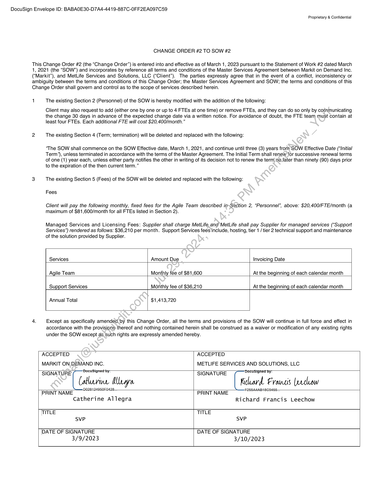

##### CHANGE ORDER #2 TO SOW #2]

  
````col
```col-md
flexGrow=.5
===
> [!info] [Page 1](_attachments/images_MetLife-3.6.1.22.200144467.pdf_210214/page_1.png)
> 
```  
```col-md
DocuSign Envelope ID: BABAOE30-D7A4-4419-887C-OFF2EA097C59  
Proprietary & Confidential  
CHANGE ORDER #2 TO SOW #2  
This Change Order #2 (the “Change Order”) is entered into and effective as of March 1, 2023 pursuant to the Statement of Work #2 dated March
1, 2021 (the “SOW’”) and incorporates by reference all terms and conditions of the Master Services Agreement between Markit on Demand Inc.
(“Markit”), and MetLife Services and Solutions, LLC (“Client”). The parties expressly agree that in the event of a conflict, inconsistency or
ambiguity between the terms and conditions of this Change Order; the Master Services Agreement and SOW; the terms and conditions of this
Change Order shall govern and control as to the scope of services described herein.  
1  
The existing Section 2 (Personnel) of the SOW is hereby modified with the addition of the following:  
Client may also request to add (either one by one or up to 4 FTEs at one time) or remove FTEs, and they can do so only by communicating
the change 30 days in advance of the expected change date via a written notice. For avoidance of doubt, the FTE team must contain at
least four FTEs. Each additional FTE will cost $20,400/month.”  
The existing Section 4 (Term; termination) will be deleted and replaced with the following:  
‘The SOW shall commence on the SOW Effective date, March 1, 2021, and continue until three (3) years from SOW Effective Date (“Initial
Term’), unless terminated in accordance with the terms of the Master Agreement. The Initial Term shall renew for successive renewal terms
of one (1) year each, unless either party notifies the other in writing of its decision not to renew the term no_later than ninety (90) days prior
to the expiration of the then current term.”  
The existing Section 5 (Fees) of the SOW will be deleted and replaced with the following:
Fees  
Client will pay the following monthly, fixed fees for the Agile Team described in-Section 2, “Personnel”, above: $20,400/FTE/month (a
maximum of $81,600/month for all FTEs listed in Section 2).  
Managed Services and Licensing Fees: Supplier shall charge MetLife and MetLife shall pay Supplier for managed services (“Support
Services”) rendered as follows: $36,210 per month. Support Services fees include, hosting, tier 1 / tier 2 technical support and maintenance
of the solution provided by Supplier.  
Services Amount Due Invoicing Date  
| Agile Team Monthly fee of $81,600 At the beginning of each calendar month
Support Services Monthly fee of $36,210 At the beginning of each calendar month
Annual Total $1,413,720  
Except as specifically amended by this Change Order, all the terms and provisions of the SOW will continue in full force and effect in
accordance with the provisions thereof and nothing contained herein shall be construed as a waiver or modification of any existing rights
under the SOW except as such rights are expressly amended hereby.  
SVP  
ACCEPTED ACCEPTED
MARKIT ON. DEMAND INC. METLIFE SERVICES AND SOLUTIONS, LLC
SIGNATURE ignedt by: SIGNATURE Decusigned by:
Catlurive Mara Kicdeard Francs (erclow
PRINT NAME PRINT NAME
Catherine Allegra Richard Francis Leechow
TITLE TITLE  
SVP  
[DATE OF SIGNATURE
3/9/2023  
DATE OF SIGNATURE
3/10/2023  
```
````
Notes:  


![[_attachments/MetLife-3.6.1.22.2 00144467.pdf]