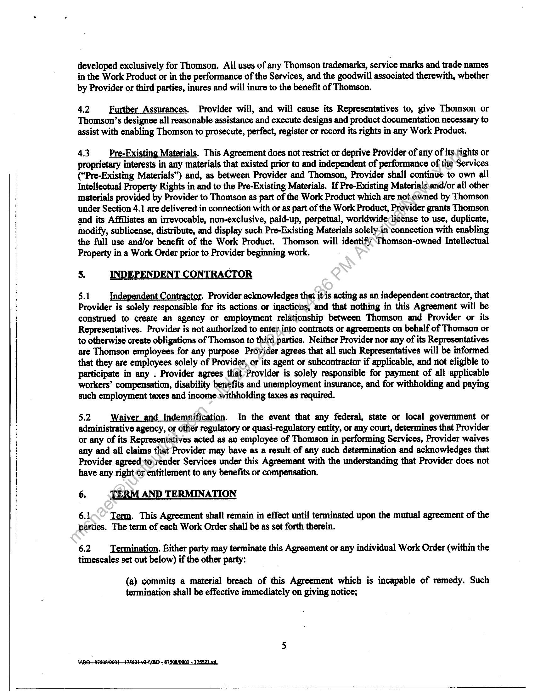
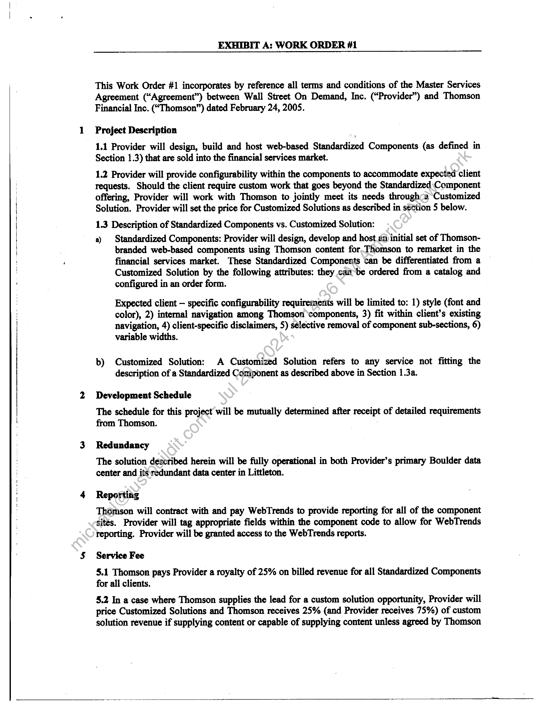

##### Master Services Agreement]

  
````col
```col-md
flexGrow=.5
===
> [!info] [Page 1](_attachments/images_Refinitiv-UK-3.6.1.23.100173948.pdf_212218/page_1.png)
> 
```  
```col-md
MASTER SERVICES AGREEMENT  
This Master Services Agreement is entered into as of the 24" day of February, 2005, by and between
Thomson Financial Inc., with an office at 195 Broadway, New York, NY 10007 (“Thomson”), and Wall
Street on Demand, Inc. with an office at 3005 Center Green Drive, Boulder, Colorado (“Provider”).  
WHEREAS, Thomson may request that Provider provide Services and Provider desires to provide such
Services.  
THEREFORE, in consideration of the mutual agreements below, and intending to be legally bound, the
parties agree:  
1. DEFINITIONS  
The following terms used in this Agreement shall have the meanings set forth below. Other terms may be
defined within the body of this Agreement.  
11 “Affiliate” means any entity that controls, is controlled by, or-is under common control with
Thomson. For purposes of this Agreement, "control" means possessing, directly or indirectly, the power to
direct or cause the direction of the management, policies or operations of an entity, whether through
ownership of voting securities, by contract or otherwise.  
12 “Agreement” means this Master Services Agreement, the Exhibits hereto, the Work Orders set
forth on Exhibit A, and any duly executed amendments.thereto.  
13 “Customized Solution” means any service not fitting the definition of a Standardized Component
as described in section 1.9 below.  
Any restrictions on Thomson’s use of atiy Customized Solutions shall be set forth in the applicable Work
Order.  
14 “Documentation” means’ any standard written material that describes the design, functions,
operation or use of the Customized Solution.  
15 “Intellectual Property Rights” means patents, trade marks, service marks, trade and service names,
copyrights, database tights and design rights (whether or not any of them are registered and including
applications for registration of any of them), rights in know-how, moral rights, trade secrets and rights of
confidence, all rights or forms of protection of a similar nature or having similar or equivalent effect to any
of them which may subsist anywhere in the world now existing or hereafter arising which are protected or
otherwise protectable.  
1.6 “Representatives” means Provider’s officers, directors, employees, agents and subcontractors (and
their employees).  
1.7 “Services” means all services and Work Product (as described in Section 4.3) under this
Agreement.  
18 - “Standardized Component” means a module that can be differentiated from a Customized Solution  
by all of the following attributes: can be ordered from a catalog, configured in an order form, has the  
potential of two or more customers, exists before it is sold and is configured through entitlements or a style  
{NBO £7508/0001-175521-¥2 NRO = R7SORMO01 «178821 v4,  
```
````
Notes:    
````col
```col-md
flexGrow=.5
===
> [!info] [Page 2](_attachments/images_Refinitiv-UK-3.6.1.23.100173948.pdf_212218/page_2.png)
> 
```  
```col-md
sheet. Any restrictions on Thomson’s use of any Standardized Components shall be set forth in the
applicable Work Order.  
19 “Work Order” means the Work Orders which the parties may enter into pursuant to this Agreement,
which shall be in the format substantially similar to Work Order #1 attached hereto.  
1.10 “Work Product” means the materials and other deliverables provided by Provider to Thomson
under a Work Order, as described in such Work Order.  
2. IRVICES  
2.1 Work Order Services. Provider will perform the services described in the Work Order or otherwise
set forth in this Agreement, including the development and delivery to Thomson of the deliverables set
forth in the Work Order (the “Deliverables”) on the dates scheduled for the delivery thereof (the “Delivery
Dates”) (collectively, the “Services”).  
2.2 Technical Direction. Provider will report to and receive technical direction only from such
Thomson employees or officers as are listed in the Work Order or as may be designated by such employees
or officers.  
2.3 Security and Supervision. Provider’s Representatives, when on Thomson’s premises or accessing
Thomson’s networks or providing support services hereunder, will comply with all of Thomson’s security,
supervision and other standard procedures applicable to such Representatives. Thomson shall make such
applicable procedures available to such Representatives,  
2.4 Acceptance. Thomson may at any titne following receipt from Provider of any Deliverable or
the completion of any Service test such Deliverable or Service in accordance with the acceptance test
procedures determined by Thomson and. provided to Provider in advance as part of “requirements”
documentation from time to time in its sole-discretion. At any time following the acceptance testing of the
Deliverable or Service in accordance with the acceptance test procedure, Thomson may notify Provider in
writing that it rejects any Deliverable or Service which does not conform to or perform in accordance with
the Work Order or otherwise fails to meet the specifications therefore as set out in the Work Order. If
Thomson delivers to Providet.a notice that Thomson rejects a Deliverable or Service, Thomson may: (i)
require that Provider replaces all or any part of the Deliverable or Service so that it conforms to and
performs in accordance with the Work Order and otherwise meets the specifications therefore as set out in
the Work Order. Provider will provide an estimate of the number of days required to implement the
changes in accordatice with the Change Procedure (Section 2.6); or (ii) terminate this Work Order in whole
or in part in accordance with Section 6 hereof.  
2.5 Change Procedure. Either party may make changes to the Work Order in accordance with the
following procedure. A change must be requested in writing by the relevant party, specifying the nature
and-details of the change and the reasons why it is necessary or desirable. Within five (5) days following
réceipt by the relevant party of the notice referred to in the preceding sentence, Provider will deliver a
detailed written description of: (i) the impact of the change on any applicable Work Order and/or the fees
payable under this Agreement; and (ii) any other relevant details which will enable Thomson to assess the
anticipated impact of the change (the “Change Impact Statement”). Within two (2) days of receiving the
Change Impact Statement, Thomson will have the right to notify Provider that it rejects or requires further
information or clarification of the Change Impact Statement and Provider will within two (2) days of
receiving such notice, send Thomson an amended Change Impact Statement. The procedure set out in this
Section 2.5 will apply to any such amended Change Impact Statement until it is accepted by Thomson or
until Thomson advises Provider that it rejects such change. Upon acceptance by Thomson of the relevant  
$WBO~87508/0001175521-+2 NBO « S7SOR/0001 «175521 v4.  
```
````
Notes:    
````col
```col-md
flexGrow=.5
===
> [!info] [Page 3](_attachments/images_Refinitiv-UK-3.6.1.23.100173948.pdf_212218/page_3.png)
> 
```  
```col-md
Change Impact Statement, the change and corresponding Change Impact Statement will be deemed to be
incorporated into this Agreement as if this Agreement has been amended in accordance with the terms of
this Agreement. The costs associated with preparing and delivering any Change Impact Statement will be
borne by the party who requested the change unless the change is suggested by Provider as an enhancement
or improvement to the service and Thomson decides to proceed with the change. Neither party is under an
obligation to accept a change that is not subject to an agreed contract amendment. All! changes are subject
to written agreement between the parties.  
2.6 Payment Terms. All invoices are based on a work order. Unless otherwise specified ina Work
Order, Provider will invoice Thomson monthly for services performed during the immediately preceding
month. Thomson’s payment terms on undisputed invoices are payable in 45 days, as measured from
Thomson’s receipt of the invoice. A service fee of 1.5% per month will be applied to all amounts not paid
when due. Thomson shall, within 30 days of receipt of any invoice, provide written notice to Provider of
any dispute setting forth in reasonable detail the reason for such dispute.  
i ion Providers. For any work that includes content from
information providers other than’ Thomson, the party that owns the client contract will pay the information
providers on time, according to the terms in its agreements with those providers unless the end client agrees
to pay information providers directly.  
2.8 Change in Service. Provider will notify Thomson of changes in the content, format or nature of the
Service and of upgrades to the Service as follows: (a) if the change removes existing functionality from the
Service, Provider shall provide Thomson prior written notice of the relevant proposed change or upgrade as
soon as practicable and in any event at least one hundred eighty (180) days prior to such change or upgrade
being applicable to Thomson and its End Users;\(b) if the change or upgrade is material, but is not
reasonably likely to materially affect the functionality of the Service, Provider shall provide Thomson prior
written notice of such proposed change or upgrade as soon as practicable prior to such change or upgrade
being applicable to Thomson and its End-Users; and (c) notwithstanding subsections (a) and (b) above, if
the change or upgrade materially degrades the performance of the Service, Provider shall provide Thomson
written notice thereof immediately upon becoming aware thereof. Notwithstanding the foregoing, the
timeframes for notifications and implementation of any changes or upgrades subject to a service level
agreement between the parties will be governed by the terms set forth therein.  
3. NON-DISCLOSURE  
3.1 Confidential Information. "Confidential Information" includes (i) all information and material
related to the business or technology of Thomson or any of its Affiliates, clients or other third parties, to
which Provider has or obtains access, whether in oral, written, graphic or machine-readable form, in the
course of or in connection with providing the Services, including without limitation information concerning,
Thomson’s past, present and future suppliers, vendors, business strategies, methodologies, trade secrets,
pricing, software, business relationships, client lists and information regarding clients, and personal
information of Thomson’s employees or customers; (ii) all Work Product; (iii) all notes, analyses and
studies prepared by Provider or any of its Representatives, during the term of this Agreement or anytime
thereafter, incorporating any of the information described in this Article 3, and (iv) the terms and conditions
of this Agreement.  
3.2 Restrictions. Provider will keep the Confidential Information confidential. Provider may disclose
the Confidential Information to its Representatives who have a need to know such Confidential Information
solely in connection with this Agreement. Provider will cause such Representatives to comply with this
Agreement and will assume full responsibility for any breach of this Agreement by any such
Representatives. Provider will not transfer or disclose any Confidential Information to any third party  
```
````
Notes:    
````col
```col-md
flexGrow=.5
===
> [!info] [Page 4](_attachments/images_Refinitiv-UK-3.6.1.23.100173948.pdf_212218/page_4.png)
> 
```  
```col-md
without Thomson’s prior written permission and without such third party having a contractual obligation
(consistent with this Article 3 ("Non-Disclosure") to keep such Confidential Information confidential.
Provider will not use any Confidential Information for any purpose other than to provide the Services to
Thomson under this Agreement.  
3.3 onpublic Personal Information and Foreign Da
and conditions set forth in Exhibit C attached hereto to
governing the protection of personal information  
a Protection. Provider will comply with the terms
comply with state, federal and international law  
3.4 Exclusions. Provider will not be prohibited from using information that: (i) is obtained by Provider
from the public domain and independently of Provider’s knowledge of any Confidential Information; (ii)
was lawfully and demonstrably in the possession of Provider prior to its receipt from Thomson; (iii) is
independently developed by Provider without use of or reference to Thomson’s Confidential Information;
or (iv) becomes known by Provider from a third party independently of Provider’s knowledge of the
Confidential Information and is not subject to an obligation of confidentiality.  
3.5 Legal Requirements. If Provider is requested or required to disclose any of Thomson’s
Confidential Information under a subpoena, court order, statute, law, mile, regulation or other similar
requirement (a “Legal Requirement"), Provider will, to the extent not:precluded by law, provide prompt
notice of such Legal Requirement to Thomson so Thomson may.seek an appropriate protective order or
other appropriate remedy or waive compliance with the provisions of this Agreement. If Thomson is not
successful in obtaining a protective order or other appropriate remedy and Provider is, in the reasonable
opinion of its counsel, legally compelled to disclose suckConfidential Information, or if Thomson waives
compliance with the provisions of this Agreement itwriting, Provider may disclose, without liability
hereunder, such Confidential Information in accordance with, but solely to the extent necessary, in the
reasonable opinion of its counsel, to comply with the Legal Requirement.  
3.6 ispositi onfidential In erminati Xpiration. Upon termination or
expiration of this Agreement or upon Thomson’s written request, Provider will return to Thomson all
copies of Confidential Information already in Provider’s possession or within its control. Alternatively,
with Thomson’s prior written consent, Provider may destroy such Confidential Information, in which case
an officer of Provider will certify in writing to Thomson that all such Confidential Information has been so
destroyed.  
4. OWNERSHIP  
4.1 Intellectual\Property. Notwithstanding anything in the Agreement to the contrary, except for any
Pre-Existing Materials (as defined below), the parties agree that Provider’s development of the "look and
feel" of the web pages (the HTML Design), customized PDF reports, HTML, ASP code, style guides, wire
frames, requirements documents, functional and design specifications and other technical documentation,
to the extent originated and prepared exclusively for Thomson pursuant to this Agreement, and to the extent
copyrtightable under United States copyright law, shall vest in Thomson immediately upon their creation.
‘All such materials shall constitute “works made for hire” under the Copyright Law of the U.S. and the
author thereof shall be Thomson, and if such materials do not constitute “works made for hire” under the
Copyright Law of the U.S., Provider hereby irrevocably assigns all right title and interest in and to such
materials, including all rights under the laws of copyright to Thomson. To the extent originated and
developed exclusively for Thomson and to the extent copyrightable under United States copyright law,
Provider agrees to execute any assignments or other documents reasonably requested by Thomson in order
to put into effect the intentions of the parties under this Section 4.1. Except for any Pre-Existing Materials,
Provider acknowledges that the “look and feel” of the web pages (the HTML design), customized PDF
designs, style guides, wire frames, requirements documents and functional and design specifications are  
‘WBO-£7508/0001475521-42 NBO = A7SQA/0001 = 178821 v4.  
```
````
Notes:    
````col
```col-md
flexGrow=.5
===
> [!info] [Page 5](_attachments/images_Refinitiv-UK-3.6.1.23.100173948.pdf_212218/page_5.png)
> 
```  
```col-md
developed exclusively for Thomson. All uses of any Thomson trademarks, service marks and trade names
in the Work Product or in the performance of the Services, and the goodwill associated therewith, whether
by Provider or third parties, inures and will inure to the benefit of Thomson.  
42 Further Assurances. Provider will, and will cause its Representatives to, give Thomson or
Thomson’s designee all reasonable assistance and execute designs and product documentation necessary to
assist with enabling Thomson to prosecute, perfect, register or record its rights in any Work Product.  
43 Pre-Existing Materials. This Agreement does not restrict or deprive Provider of any of its.rights or
proprietary interests in any materials that existed prior to and independent of performance of the Services
(“Pre-Existing Materials”) and, as between Provider and Thomson, Provider shall continue to own ail
Intellectual Property Rights in and to the Pre-Existing Materials. If Pre-Existing Materials.and/or all other
materials provided by Provider to Thomson as part of the Work Product which are not. cwmed by Thomson
under Section 4.1 are delivered in connection with or as part of the Work Product, Provider grants Thomson
and its Affiliates an irrevocable, non-exclusive, paid-up, perpetual, worldwide license to use, duplicate,
modify, sublicense, distribute, and display such Pre-Existing Materials solely.in'connection with enabling
the full use and/or benefit of the Work Product. Thomson will identify’Thomson-owned Intellectual
Property in a Work Order prior to Provider beginning work.  
5. INDEPENDENT CONTRACTOR  
$.1 Independent Contractor. Provider acknowledges that it is acting as an independent contractor, that
Provider is solely responsible for its actions or inactions, and that nothing in this Agreement will be
construed to create an agency or employment relationship between Thomson and Provider or its
Representatives. Provider is not authorized to enter.into contracts or agreements on behalf of Thomson or
to otherwise create obligations of Thomson to thitd parties. Neither Provider nor any of its Representatives
are Thomson employees for any purpose Provider agrees that all such Representatives will be informed
that they are employees solely of Provider, or its agent or subcontractor if applicable, and not eligible to
participate in any . Provider agrees that Provider is solely responsible for payment of all applicable
workers’ compensation, disability benefits and unemployment insurance, and for withholding and paying
such employment taxes and income withholding taxes as required.  
5.2 Waiver and Indemnification. In the event that any federal, state or local government or
administrative agency, or cther regulatory or quasi-regulatory entity, or any court, determines that Provider
or any of its Representatives acted as an employee of Thomson in performing Services, Provider waives
any and all claims that Provider may have as a result of any such determination and acknowledges that
Provider agreed:to,render Services under this Agreement with the understanding that Provider does not
have any right or entitlement to any benefits or compensation.  
6. TERM. TERMINATION  
6.1 Term. This Agreement shall remain in effect until terminated upon the mutual agreement of the
parties. The term of each Work Order shall be as set forth therein.  
6.2 Termination. Either party may terminate this Agreement or any individual Work Order (within the
timescales set out below) if the other party:  
(a) commits a material breach of this Agreement which is incapable of remedy. Such
termination shall be effective immediately on giving notice;  
\WBO—87808/0001175521-¥9 NBO « A7SQ8/0001 178821 74.  
```
````
Notes:    
````col
```col-md
flexGrow=.5
===
> [!info] [Page 6](_attachments/images_Refinitiv-UK-3.6.1.23.100173948.pdf_212218/page_6.png)
> 
```  
```col-md
(b) commits a material breach of this Agreement, which remains unremedied 30 days after
giving notice. Such termination shall be effective at the end of the 30 day notice period.
However, if the breach is capable of remedy but cannot reasonably be cured within such 30 day
period, termination shall not be effective if the party in default commences cure of the breach
within 30 days and thereafter diligently pursues such cure to completion within 60 days of such
notice of breach; or  
(c) makes an assignment for the benefit of its creditors, files or has filed against it a petition
under any bankruptcy, insolvency, reorganization or similar law, appoints or has appointed
against it a trustee or receiver for any of its property or commences or has commenced against
it (by resolution or otherwise) the liquidation or winding-up of its affairs, which termination
shall be effective immediately upon giving notice.  
6.3 Effect of Termination. Upon any termination or expiration of this Agreement or any Work Order,
Provider will: (i) deliver to Thomson all Work Product, including any in progress at the time of termination
or expiration; and (ii) work with Thomson to ensure a smooth transition of Services to Thomson or a third
party; and (iii) cease to use and return all equipment, documentation, data aad any other materials provided
by Thomson. After expiration or termination of a Work Order, if requested by Thomson, Provider will
provide transition assistance at the rate of $1,000 per day per Provider employee, unless termination was by
Thomson for breach in which case a reasonable amount of transition assistance will be provided at no
charge. Any termination of this Agreement will be without prejudice to each party’s accrued rights and
remedies. In the event of expiration or termination of a Work Order, if requested by Thomson, Provider
will continue to provide the Services for up to a six (6) month wind-down period at the rates then applicable
under the relevant Work Order.  
7. REPRESENTATIONS, WARRANTIES COVENANTS AND_ LIMITATION OF
LIABILITY
71 Performance.  
(a) Provider represents, warrants and covenants that all Services: (i) will be performed in
accordance with Thomzon’s reasonable written instructions; (ii) will be performed in an effective,
timely, professiona]-and workmanlike manner in accordance with applicable industry standards
and practices; (iii) will be performed in accordance with any specifications and documentation set
forth in the Work Order; and (iv) will be fully compatible with Thomson’s computer environment
existing at the time of installation, or such other environment as agreed to by the parties in the Work
Order.  
(b) Provider represents, warrants and covenants that it will comply with all laws, rules, regulations,
orders of any governmental (including any regulatory or quasi-regulatory) agency that are
applicable to Provider in its performance of the Services.  
(c) Provider also represents, warrants and covenants that it’s entering into this Agreement and
provision of the Services does not violate any other of its contractual obligations.  
72 Viruses and Other Disabling Code. Virus means any code or device which is designed or intended
to impair the operation of any computer or database, prevents or hinders access to or the operation of any
program or data (whether by altering, erasing, duplicating or rearranging within the computer or any
storage medium or device, the program or data in whole or in part, or otherwise) including, without
limitation, computer viruses, worms and trojan horses. Provider will use all reasonable commercial efforts
to ensure that the Customized Solution or Standardized Component has been scanned for Viruses utilizing  
```
````
Notes:    
````col
```col-md
flexGrow=.5
===
> [!info] [Page 7](_attachments/images_Refinitiv-UK-3.6.1.23.100173948.pdf_212218/page_7.png)
> 
```  
```col-md
the most recent version of generally available anti-virus protection and that a Virus has not been
intentionally inserted into the Customized Solution or Standardized Component or Services by any
Provider employee or agent. In the event a Virus is detected in the Customized Solution or Standardized
Component or Services, Provider shall use commercially reasonable efforts to remove such virus as soon as
possible.  
7.3. Disclaimer. EXCEPT AS EXPRESSLY SET FORTH IN THIS AGREEMENT, NEITHER
PARTY MAKES ANY OTHER WARRANTY, EXPRESS OR IMPLIED, INCLUDING WITHOUT
LIMITATION ANY IMPLIED WARRANTIES OF MERCHANTABILITY OR-FITNESS\FOR A
PARTICULAR PURPOSE OR NONINFRINGEMENT. Thomson acknowledges that the information
displayed by the Provider’s service is obtained by Provider from various sources which Provider s believes
to be reliable, that transmission of the content (defined as Thomson content or third-party content as might
apply for a Customized Solution) is accomplished by communications facilities over which Provider has no
control, and that Provider assumes no responsibility for such content or for outages or for interruptions of
service. Except as expressly set forth in this agreement or a Work Order, Provider aiid its suppliers make no
warranty or representation that the Customized Solution will meet Thomson. requirements or that the
content displayed will be error free or be received by Provider without interruption. Provider and its
suppliers make and Thomson receives no other warranties whether express, implied, statutory, or otherwise
arising from course of dealing or usage of trade, and Provider expressly disclaims all other warranties,
including the implied warranties of merchantability, non-infringement and fitness for a particular purpose.  
74 Limitation of Liability. IN NO EVENT WILL~PROVIDER OR THOMSON OR ITS
AFFILIATES BE LIABLE FOR DIRECT DAMAGESNIN EXCESS OF THE AMOUNTS PAID TO
PROVIDER BY THOMSON PURSUANT TO THIS AGREEMENT DURING THE 12-MONTH
PERIOD IMMEDIATELY PRECEDING SUCH. CLAIM OR ANY INDIRECT, INCIDENTAL,
CONSEQUENTIAL, SPECIAL OR PUNITIVE DAMAGES (INCLUDING WITHOUT LIMITATION
LOST PROFITS) EVEN IF IT HAS BEEN ADVISED OF THE POSSIBILITY OF SUCH DAMAGES.
NOTWITHSTANDING THE FOREGOING, NO LIMITATION OR EXCLUSION OF EITHER
PARTY’S LIABILITY WILL APPLY WITH RESPECT TO ANY CLAIMS ARISING OUT OF OR
RELATING TO ARTICLES 3,.(“NON-DISCLOSURE”), 4 (“OWNERSHIP”), SECTION 5.2
(“WAIVER”) AND ARTICLE 8.1 AND 8.2 (“INDEMNIFICATION”) OF THIS AGREEMENT, OR ITS
WILLFUL MISCONDUCT OR GROSS NEGLIGENCE, OR ANY CLAIMS FOR PERSONAL INJURY
OR PROPERTY DAMAGE.(INCLUDING WITHOUT LIMITATION ALL COSTS ASSOCIATED
WITH THE RECOVERY OR REPLACEMENT OF LOST OR DAMAGED DATA.  
8. INDEMNIFICATION  
8.1 Indemaity by Provider. Provider agrees to indemnify Thomson and its affiliates and their officers,
directors, employees and agents (collectively, the “Thomson Indemnified Parties”) against any damages
suffered by the Thomson Indemnified Parties arising from any third party claim that the Provider Services,
Documentation, Customized Solution or Standardized Component or any other product or service delivered
or\performed by Provider pursuant to this Agreement or any Work Order (collectively, the “Provider
Products”) infringe any Intellectual Property Right of any third party; provided, that, Provider’s indemnity
obligation under this Section 8 (a) shall be limited to claims of infringement during the term of this
Agreement and (b) shall not apply to the extent that the claim arises out of or results from (i) Provider’s
compliance with (A) any written technical or product specification created by Thomson or provided by
Thomson to Provider (a “Thomson Specification”) or (B) any written instruction given or provided by
Thomson to Provider (a “Thomson Instruction”), (ii) any materials created by Thomson or provided by
Thomson to Provider (including without limitation Thomson’s original work product) (a “Thomson
Original Product”), or (iii) any modification made by Thomson to a Provider Product (a “Thomson
Modification”).  
```
````
Notes:    
````col
```col-md
flexGrow=.5
===
> [!info] [Page 8](_attachments/images_Refinitiv-UK-3.6.1.23.100173948.pdf_212218/page_8.png)
> 
```  
```col-md
8.2 Indemnity by Thomson. Thomson agrees to indemnify Provider and its affiliates and their offices,
directors, employees and agents (collectively, the “Provider Indemnified Parties”) against any damages
suffered by the Provider Indemnified Parties arising from any third party claim that any Thomson
Specification, Thomson Instruction, Thomson Original Product or Thomson Modification (collectively, the
“Thomson Intellectual Property”) infringes any Intellectual Property Right of any third party.  
8.3 Contingencies. The foregoing indemnities shall be contingent upon (a) the indemnified party
giving prompt written notice to the indemnifying party of any claim, demand or action for which
indemnification is sought, (b) the indemnifying party being given the right to control the defense| thereof,  
. provided, that, the indemnifying party shall not settle a claim, demand or action without the indemnified  
party’s written consent, which consent shall not be unreasonably withheld, and (c) the indemnified party
full cooperating in the defense or settlement of any such claim, demand or action, at the expense of the  
indemnifying party.  
8.4 Indemnified Party’s Right to Participate. The indemnifying party will have-the right to conduct the
defense of any such claim or action and all negotiations for its settlement or;compromise except that the
indemnified party may in its sole discretion participate in the defense of any such claim or action at such
indemnified party’s sole expense. If the indemnifying party fails to appoint an attorney within ten (10) days
after notification of any such claim or action, or after the indemnifying party becomes aware of such claim
or action, whichever is earlier, the indemnified party will have the right to select and appoint an alternative
attorney and the reasonable cost and expense thereof will be paid/by the indemnifying party.  
8.5 Election of Remedy. If any Provider Product orany portion thereof becomes, or in Provider’s or
Thomson’s reasonable opinion is likely to become, the subject of any such claim or action under Section 8.1,
then (a) Thomson may terminate this Agreement and/or (b) Provider may require Thomson to discontinue
use of such allegedly or potentially infringing-Provider Product. In the event of subsection (b) above,
Thomson shall receive a pro rata refund of)any prepaid fees related to such allegedly or potentially
infringing Provider Product.  
8.6 Future Indemnification. Following termination of this Agreement, the parties agree to negotiate in
good faith an option pursuant to)which Thomson would pay Provider for undertaking additional
indemnification obligations with respect to infringement claims related to the Provider Products.  
9. NO PUBLICITY  
Without written request, Provider agrees not to disclose the identity of Thomson or its Affiliates or any of
their directors, officers, managers, employees, consultants or agents as a customer or prospective customer
of Provider or thé existence or nature of this Agreement. Without limiting the generality of the foregoing,
Provider wil! not use, in advertising, publicity or otherwise, the name of Thomson or its Affiliates or any of
their directors, officers, managers, employees, consultants or agents or any trade name, trademark, service
mark, logo or symbol of Thomson or its Affiliates. Thomson agrees that Provider will not receive
attribution. Thomson will not use Provider’s name in any sales, marketing or public relations. Any
exceptions to this will require written permission from
Provider.  
10. INSURANCE
10.1 Insurance Coverage. Provider will, and will cause its approved subcontractors to, at their own cost  
and expense, obtain and maintain in full force and effect during the term of this Agreement, the Provider’ s
current insurance coverage as indicated in Exhibit D.  
```
````
Notes:    
````col
```col-md
flexGrow=.5
===
> [!info] [Page 9](_attachments/images_Refinitiv-UK-3.6.1.23.100173948.pdf_212218/page_9.png)
> 
```  
```col-md
10.2 NoLimitation. Nothing in this Article 10 (“Insurance”) will be construed as limiting Provider’s (or
any subcontractor’s or agent’s) liability to Thomson or any third party. The mere purchase and existence of
insurance does not reduce or release Provider from liability incurred or assumed within the scope of this
Agreement. Provider’s failure to maintain insurance will not relieve it of liability under this Agreement.  
10.3. Claims. Provider will promptly make a full written report to Thomson as to all accidents or claims
for damage arising from or in connection with: (i) this Agreement; (ii) the discharge of Provider’s duties
under this Agreement or the Work Order; or (iii) the presence of Provider or Provider’s Representatives on
Thomson’s premises. Provider will cooperate fully with Thomson and with any insurance cartier in the
investigation and defense of all such accidents and claims, such obligation to survive the termination or
expiration of this Agreement.  
11. GENERAL  
11.1 Assignment. Neither party will assign, as a result of a change of control (which will be deemed to
be an assignment) or by operation of law nor otherwise, its rights or obligations under this Agreement
without the prior written consent of the other party and any attempt to do,¢o-without such consent will be
null and void.  
11.2 Notices. All notices given under this Agreement must bein writing, and be sent to the person and
address designated in the Work Order or to such other addresses as Provider or Thomson may designate
under this Section by certified mail (return receipt requested), overnight courier or personal delivery.
Notices can be considered delivered if by email, and the recipient has acknowledged receipt with an e-mail
of his or her own. A copy (which will not constitute notice hereunder) of any notice given will likewise be
sent to:  
Thomson Financial Inc.
Legal Department  
195 Broadway  
New York, New York 10007  
11.3. Remedies. Provider acknowledges that a breach of Article 3 (“Non-Disclosure”) of this Agreement
may result in irreparable and continuing damage to Thomson for which monetary damages may not be
sufficient, and agrees that Thomson will be entitled to seek, in addition to its other rights and remedies
hereunder or at law, injimctive or all other equitable relief, and such further relief as may be proper from a
court of competent jurisdiction.  
11.4 EntirecAgreement. This Agreement constitutes the complete agreement and understanding
between the parties with respect to the subject matter hereof, and supersedes all prior agreements and
understandings between the parties. In entering this Agreement, neither party has relied on any statement,
warranty or representation (except in the case of fraud) made by the other save as set out in this Agreement.  
115 No Waiver by Conduct. No waiver of any of the terms of this Agreement or the Work Order will be
valid unless in writing and designated as such. Any forbearance or delay on the part of either party in
enforcing any of its rights under this Agreement will not be construed as a waiver of such right to enforce
same for such occurrence or any other occurrence.  
11.6 Non-Exclusivity. This Agreement with Provider is non-exclusive and each of Thomson and
Provider may in its sole discretion enter into arrangements with third parties to perform any Services.  
```
````
Notes:    
````col
```col-md
flexGrow=.5
===
> [!info] [Page 10](_attachments/images_Refinitiv-UK-3.6.1.23.100173948.pdf_212218/page_10.png)
> 
```  
```col-md
11.7 Severability. If any one or more of the provisions of this Agreement are for any reason held to be
invalid, illegal or unenforceable by a court of competent jurisdiction, the remaining provisions of this
Agreement will be unimpaired and will remain in full force and effect, and the invalid, illegal or
unenforceable provision will be replaced by a valid, legal and enforceable provision that comes closest to
the intent of the parties underlying the invalid, illegal or unenforceable provision.  
11.8 Survival. Any provision of this Agreement which, by its nature, would survive termination or
expiration of this Agreement will survive any such termination or expiration of this Agreement, including
Articles/Sections 3 (“Non-Disclosure”), 4 (“Ownership”), 5 (“Independent Contractor”), 6.3 (“Effect of
Termination”), 7 (“Representations, Warranties, Covenants and Limitation of Liebility”), 8
(“Indemnification”), 9 (“No Publicity”), 11 (“General”) and Exhibit C (“Compliance with
Gramm-Leach-Bliley and Non-U.S. Data Protection”).  
11.9 Governing Law and Choice of Forum. This Agreement will be governed by, and construed in
accordance with, the internal laws of the State of New York, without regard to its choice of laws principles.
The parties hereby irrevocably consent to the exclusive jurisdiction of, and venue in, any federal or state
court of competent jurisdiction located in the Borough of Manhattan, New York City for the purposes of
adjudicating any matter arising from or in connection with this Agreement:  
11.10 No Jury Trial. THE PARTIES UNCONDITIONALLY WAIVE THEIR RESPECTIVE RIGHTS
TO A JURY TRIAL FOR ANY CLAIM OR CAUSE OF ACTION ARISING OUT OF OR RELATING
TO, DIRECTLY OR INDIRECTLY, THIS AGREEMENT, ANY OF THE RELATED DOCUMENTS,
OR ANY DEALINGS BETWEEN THEM ARISING OUT OF OR RELATING TO THE SUBJECT
MATTER OF THIS TRANSACTION OR ANY RELATED TRANSACTIONS.  
11.11 Interpretation. The terms and conditions|of this Agreement are the result of negotiations between
the parties. The parties intend that this Agreement should not be construed in favor of or against any party
by reason of the extent to which any party or its professional advisors participated in the preparation or
drafting of the Agreement.  
11.12 Export Compliance. Thomson acknowledges that certain software developed hereunder may be
subject to United States or other export regulations for high-technology items and agrees to comply with all
such regulations.  
11.13 Force Majeure. Neither party shall be liable for any failure to perform (except payment obligations)
under this Agreement if prevented from doing so by acts of God, strikes, lock-outs, governmental orders or
restrictions, war,-threat of war, hostilities, revolution, riots, epidemics, fire, earthquake, flood or other
occurrence that could not with reasonable diligence be controlled or prevented by the party. Any failure to
perform shall-be cured as soon as reasonably practical by the non-performing party. Any event of force
majeure that continues for more than ninety (90) days shall entitle the other party to terminate upon serving
notice On the non-performing party.  
19.14 Work Order. If the terms of this Agreement and any Work Order conflict, the terms of the Work
Order shall control. A Work Order shall not be binding on either party until it has been signed by both  
parties.  
11.15 Counterparts: Method of Amendment. This Consulting Agreement and any amendments hereto
may be executed in counterparts and will not be effective or enforceable unless and until it is executed with
the handwritten signature of an authorized representative of each of the relevant entities.  
eeaee  
10  
```
````
Notes:    
````col
```col-md
flexGrow=.5
===
> [!info] [Page 11](_attachments/images_Refinitiv-UK-3.6.1.23.100173948.pdf_212218/page_11.png)
> 
```  
```col-md
IN WITNESS WHEREOF, the parties have caused this Consulting Agreement to be executed by their
duly authorized representatives.  
THOMSON FINANCIAL INC,  
Name: (Um Oconae  
Title: Global Mana ey Diechar
Date: pm ak 4  
PROVIDER  
By:
Name:  
rma Xe OS CLF
Date: 3 3/7 1/05  
il  
```
````
Notes:    
````col
```col-md
flexGrow=.5
===
> [!info] [Page 12](_attachments/images_Refinitiv-UK-3.6.1.23.100173948.pdf_212218/page_12.png)
> 
```  
```col-md
EXHIBIT A: WORK ORDER #1  
This Work Order #1 incorporates by reference all terms and conditions of the Master Services
Agreement (“Agreement”) between Wall Street On Demand, Inc. (“Provider”) and Thomson
Financial Inc. (“Thomson”) dated February 24, 2005.  
Project Description  
1.1 Provider will design, build and host web-based Standardized Components (as defined in
Section 1.3) that are sold into the financial services market.  
1.2 Provider will provide configurability within the components to accommodate expected client
requests. Should the client require custom work that goes beyond the Standardized: Component
offering, Provider will work with Thomson to jointly meet its needs throughca ‘Customized
Solution. Provider will set the price for Customized Solutions as described in séction 5 below.
1.3 Description of Standardized Components vs. Customized Solution:  
a) Standardized Components: Provider will design, develop and host az initial set of Thomsonbranded web-based components using Thomson content for.Thomson to remarket in the
financial services market. These Standardized Components can be differentiated from a
Customized Solution by the following attributes: they cai be ordered from a catalog and
configured in an order form.  
Expected client — specific configurability requirements will be limited to: 1) style (font and
color), 2) internal navigation among Thomson components, 3) fit within client’s existing
navigation, 4) client-specific disclaimers, 5) selective removal of component sub-sections, 6)
variable widths.  
b) Customized Solution: A Customized Solution refers to any service not fitting the
description of a Standardized Component as described above in Section 1.3a.  
Development Schedule  
The schedule for this project will be mutually determined after receipt of detailed requirements  
from Thomson.  
Redundancy  
The solution described herein will be fully operational in both Provider’s primary Boulder data  
center and its redundant data center in Littleton.  
Reporting  
Thomson will contract with and pay WebTrends to provide reporting for all of the component
sités. Provider will tag appropriate fields within the component code to allow for WebTrends
reporting. Provider will be granted access to the WebTrends reports.  
Service Fee  
5.1 Thomson pays Provider a royalty of 25% on billed revenue for all Standardized Components
for all clients.  
5.2 In a case where Thomson supplies the lead for a custom solution opportunity, Provider will
price Customized Solutions and Thomson receives 25% (and Provider receives 75%) of custom
solution revenue if supplying content or capable of supplying content unless agreed by Thomson  
```
````
Notes:    
````col
```col-md
flexGrow=.5
===
> [!info] [Page 13](_attachments/images_Refinitiv-UK-3.6.1.23.100173948.pdf_212218/page_13.png)
> 
```  
```col-md
10  
to different terms. When Thomson is not capable of supplying the content for a Thomson
generated Custom Solution lead, (e.g. content not available from Thomson or a project without
content), Provider will pay Thomson or the Thomson sales rep the first month of Provider revenue
in the form of payment agreed to by both parties agreed to by both parties. Thomson has the
option to charge additional fees to those charged by Provider for Customized Solutions if
Thomson supplies the lead for the opportunity.  
5.3 All third party content will be treated as a pass-thru. For Example, if Provider was charging
$75 for its services, Thomson would get $25, and the third party provider would get X. The client
would be billed $100 + X.  
5.4 In a case where Provider supplies the lead for a custom solution opportunity, Provider -will
price Customized Solutions and Thomson receives 25% (and Provider receives 75%)-of
Customized Solution revenue if supplying content .  
5.5 In a case where Provider is bidding a custom solution and Thomson chooses to bid a solution,
Provider will need to negotiate with Thomson on the price of the Thomson data. The 25%
royalty for data will not apply unless otherwise agreed to with both parties.  
5.6 Thomson will pay Provider a monthly minimum of $35,000 for 24 consecutive months. This
minimum is only to offset the initial development spend that is assumed by Provider. The
minimum will commence when the components (as listed in Appendix C) pass the Provider
quality assurance process.  
Content  
6.1 Standardized Components will incorporate only Thomson-supplied data. Any exceptions
which require additional data will be agreed to between both parties.  
6.2 Content Providers: Thomson will be responsible for licensing all data content needed for
Standardized Components, unless otherwise agreed to between Thomson and Provider.  
Disclaimer  
Thomson will ensure that all websites containing Work Product (as defined in the Service
Agreement) contain a disclaimer on behalf of Provider regarding the Work Product’s accuracy,
completeness and timeliness.  
Term  
8.1 This Work Order_will remain in effect for a minimum of three years (“Initial Term”).  
8.2. The Initial Term shall renew for successive renewal terms of one (1) year (“Renewal Term”),
unless either party provides the other party with written notice of non-renewal at least six (6)
months prior to the commencement of any Renewal Term.  
  
8.3 Either-party may terminate this Work Order for convenience upon six (6) months’ written
notice to the other party, subject to the break-up fee described in Section 14.1 below.  
Thomson Responsibilities  
Thomson will use commercially reasonable efforts to keep Provider informed of changes in its
clients’ likely usage of the service to the extent Thomson becomes aware of such issues.
Material Changes and New Functionality  
Provider to incorporate changes/enhancements to Standardized Components as requested by
Thomson, up to a cost of 20% of the revenue that Provider has derived from Standardized
Components.  
```
````
Notes:    
````col
```col-md
flexGrow=.5
===
> [!info] [Page 14](_attachments/images_Refinitiv-UK-3.6.1.23.100173948.pdf_212218/page_14.png)
> 
```  
```col-md
il  
12  
13  
Whenever Thomson wants a firm bid for additional work, an additional Work Order will be
created for that work and the work will be priced by Provider.  
Sales, Marketing and Revenue Recognition  
11.1 Thomson to develop marketing materials, collateral, and train sales force. Provider to
assist in preparing such materials for TF to the extent that screen shots or the like are necessary
for such marketing material.  
11.2. Thomson sales force sells and closes deals for all Standardized Component opportunities.
Thomson sales will also sell and close deals for all Customized Solution or hybrid opportunities
where Thomson brings the lead to Provider unless otherwise agreed. Provider will sell and close
the deal for all Customized Solution or hybrid opportunities where Provider brings the lead-to
Thomson unless otherwise agreed. (See matrix in Appendix A)  
11.3 Contract shall be between Thomson and the Thomson client or Provider client that  
receives the Work Product (End Client) for all Standardized Component opportunities as well as  
all opportunities where Thomson brings the lead to Provider. Contract shall be\between Provider  
and End Client for all Customized Solutions and hybrid opportunities where Provider brings the  
lead to Thomson, unless otherwise agreed between Thomson and Provider. (See matrix in  
Appendix A) ;
11.4 End Client shall be billed by Thomson for Standardized Component projects or projects  
where the lead comes from Thomson. End Client shall be billed by Provider for Customized '
Solution or hybrid projects where the lead comes from Provider unless otherwise agreed to with  
Thomson. The party that conducts billing also recognizes the revenue for the opportunity.  
11.5 At the discretion of Thomson, Thomson has the‘option to transfer the contract, including
billing and collecting, to Provider.
Support  
12.1 Standardized Components: Thonison supports End Client (tier 1 client support). Provider
supports Thomson. Provider provides support to Thomson 24/7.  
12.2 Customized Solution: Provider supports the client (tier 1 client support) and Thomson
supports Provider. Thomson provides support on content quality and availability 24/7.  
12.3. Hybrid (Customized Solution and Standardized Component) projects: Thomson will
provide tier 1 support forall Thomson generated deals and Provider will provide tier 1 support for
all Provider generated deals unless otherwise negotiated between Thomson and Provider.  
12.4 Provider will honor the Thomson Service Level Agreement (SLA) whenever the SLA is
passed along tothe customer.  
Business issues  
13.1,~ There shall be no exclusivity on Customized Solution business.  
13:2 Provider will not sell or utilize any Standardized Components for a competitor of
Thomson (as specifically listed in Appendix B)
13.3 If Provider sells Thomson Standardized Components to a client, Thomson will continue
to receive 75% of the fees, as documented in 5.1.  
13.4 Provider cannot offer exclusivity on charting components as these products are not easily
differentiated between Customized Solution and Standardized Component businesses.  
13.5 Provider to offer Thomson selected New Components developed by Provider for sale to
others, for incorporation into suite of initial Standardized Components, with the understanding
that Thomson will use a portion of the product enhancement budget for these New Components.  
```
````
Notes:    
````col
```col-md
flexGrow=.5
===
> [!info] [Page 15](_attachments/images_Refinitiv-UK-3.6.1.23.100173948.pdf_212218/page_15.png)
> 
```  
```col-md
14  
13.6 For New Component requests from Thomson that are derived from Provider Customized
Solutions, Provider may need to delay the introduction of a component due to client exclusivity.
For new component requests from Thomson that are not derived from Provider Customized
Solutions, scheduling of the development will be done at a mutually acceptable pace.  
13.7. New Component requests that derive from Provider custom work shall not be exclusive
to Thomson other than in the Thomson “look and feel” of the components, unless agreed between
Thomson and Provider.  
13.8 Premium Components which are derived from Provider Customized Solution work for
non-Thomson clients may have a different set of terms and conditions from the standardized
components including, but not limited to: 1) priced by Provider, 2) IP is owned by Provider, and
3) revenue sharing arrangement with Thomson may be different. Premium components will-be
exclusive to Thomson with respect to the Thomson “look and feel” but may be remarketed to
others in a different design.  
13.9 New Components that derive from Thomson ideas (and not from Provider Custom
Solutions work) are not subject to the provisions in 13.7 above.  
13.10 Thomson will incur the costs for any additional private lines required to accommodate
integration of new data sets not currently available to Provider.  
13.11 Either party can terminate the contract for any reason;subject to Section 4 of the
Agreement. Thomson will receive the HTML code and documentation for the standard
components should Provider cease operations or otherwise fail'to offer contracted services or if
either party should terminate this Work_Order. Upon termination of a Work Order, Thomson
shall pay any outstanding fees accrued through the date of termination including any applicable
break-up fee (Section 14).  
13.12 All sites will be Thomson branded. Provider will not receive attribution. Thomson will
not use Provider’s name in any sales, marketing.cr public relations discussions or materials. Any
exceptions to this will require written permission from Provider.  
13.13 Provider will not communicate ‘the price of Thomson data to End Clients, unless  
otherwise agreed to by Thomson.
13.14 The Provider platform wil! serve all Thomson locations worldwide.  
13.15 Optional cancellation’of this contract on change-of-control of the other party. If Provider
is purchased by a Thomson competitor (Exhibit B), Provider will continue to provide services
outlined in this Work Order for at least 6 months and will not charge a break-up fee.  
13.16 Thomson >wiil be given the opportunity to make an offer to purchase Provider in
anticipation of, or subsequent to, an acquisition from another party. An acquisition will constitute
an asset or share purchase where more than 50% of the shares or assets are sold to another party.  
Break-up/Termination  
14.4. In the event that Thomson wishes to cancel this Work Order for any reason, within the
term of the contract_pursuant to Section 8 of the Work Order, other than for Provider breach of
this Work Order, Thomson will pay a break-up fee of $210,000 and will continue to pay royalties
(or minimum as agreed in Section 5.6) for the greater of six months or when Thomson requests
that the service ends. In the event that Provider wishes to cancel this Work Order for any reason
other than Thomson breach, Provider will provide 6 months notice of cancellation plus pay  
Thomson $210,000.  
```
````
Notes:    
````col
```col-md
flexGrow=.5
===
> [!info] [Page 16](_attachments/images_Refinitiv-UK-3.6.1.23.100173948.pdf_212218/page_16.png)
> 
```  
```col-md
es  
Appendix A (Deal Matrix)  
‘TF brings W8OD the lead
WSOD brings TF the lead  
Components Hybrid Custom
4. Sales lead ‘TF takes the sales lead ‘TF takes the sales lead ‘TF takes the sales lead
2. Contract ownership ‘TF has contract and recognizes revenue TF has contract recognizes revenue ‘TF has contract recognizes revenue
2. Pricing 1. TF prices the components 1. TF prices components 1. W8OD prises custom work.
2. WEOD receives 28% with 2. W8OD receives 26% of component § ‘3. W800 prices custom work and TF
‘a minimum of $38K / mo. 2. W8OD prices custom work and TF receives 28% if supplying content and
(to offset upfront investment) receives 28% if supplying content and receives tet month revenue not supplying
receives tet month revenue if not supplying content unless negotieted otherwise between.
3. Additional custom work content uniese negotiated otherwise between = TF and W800.
involves & W8OD fee. TF and W800.
4. Commission NA ‘TF sales person receives 18{ month revenue = TF exis pereon receives tet month revenue
I TF is not supplying content 1t TF Ie not supplying content
6. Service TF +1, W8OD -2 Discuss Discves
CT
1, Sales lead ‘TF takes the sales ead WSEOD takes the sales lead WSOD takes the sales lead
2. Contract ownership ‘TF hes contract and recognizes revenue WSOD has contract / recognizes revenue WSOD has comract / recognizes revenue
3. Pricing 1. TF prices the components 4. TF prices components 3. WSOD prices custom work and TF
2. W8OD receives 28% with 2. WBOD receives 2536 of component $ receives 25% if supplying content,
a minimum of $38K / mo. 3. WSOD prices Gusiom work and TF
(to offset uptront inveastmertt) receives 25% if SLapplying content.
3. Additional custom work
involves @ WSOD fee.
4, Commission NA NA NA
6. Service TF-1, WSOD-2 Discuss Discuss  
Definitions for component: Can order from a catalog, contigure in an order form, has 2+ customers, exiets before ft is sald andis
configured through entiisments or a style sheet.  
```
````
Notes:    
````col
```col-md
flexGrow=.5
===
> [!info] [Page 17](_attachments/images_Refinitiv-UK-3.6.1.23.100173948.pdf_212218/page_17.png)
> 
```  
```col-md
Appendix B  
Competitor List  
owe Naw PF YN  
— et
nv KF OS  
SunGard  
Morningstar  
Emerging Information Systems Incorporated
Performance Technologies  
Checkfree  
Information/net Decide  
Standard & Poors  
Multex  
FactSet  
. Reuters  
. CBS MarketwatchBloomberg  
13.
14.  
Dow Jones
IDC  
```
````
Notes:    
````col
```col-md
flexGrow=.5
===
> [!info] [Page 18](_attachments/images_Refinitiv-UK-3.6.1.23.100173948.pdf_212218/page_18.png)
> 
```  
```col-md
Appendix C  
List of Initial Standardized Components  
1. Delayed Quotes  
2. Stock Tipsheet  
3. Mutual Fund Tipsheet  
4. Company Financials  
5. Company Earnings: Snapshotand estimate
8. Company : Recommendations  
11. Company News / Headline News
12. intraday Index Table and Chart
13. Power Chart (Historica! Chart)
14. Intraday Company Chart  
18. insider Data by Ticker  
19. Mutual Fund Full Report  
20. Market Overview: Pulse  
21. Market Overview. Update  
22, Market Overview:  
23. Market Overview: Movers - Performers
24, Market Movers: Best and Worst Industries
25. Market Movers: Overall Market  
26. Stock Screener  
27. Mutual Fund Screener  
28. Portfolio Tracker and Watchlist  
38. Insider Market and Industry Tearsheet
39. Insider Trends Tearsheet
40. Options Quotes  
Note thet I-Watch has been postponed to a later release. Also note that NAV charts are included in the Power Charts. :  
```
````
Notes:    
````col
```col-md
flexGrow=.5
===
> [!info] [Page 19](_attachments/images_Refinitiv-UK-3.6.1.23.100173948.pdf_212218/page_19.png)
> 
```  
```col-md
Exhibit C
To the Consulting Services Agreement  
Nonpublic Personal Information and Foreign Data Protection  
Contractor acknowledges that Thomson may be subject to privacy regulations under
domestic or international law as well as contractual requirements to its clients, Thomson
is required to obtain certain undertakings from Contractor with regard.io Thomson’s
personnel data and/or customer data (“Protected Data”). Therefore, notwithstanding
anything to the contrary contained herein, Contractor agrees that (i) it shall not disclose
or use any of Thomson’s Protected Data except to the extent 1écessary to carry out its
obligations hereunder and for no other purpose, (ii) it shalh not disclose Thomson’s
Protected Data to any third party without the prior consent of Thomson and an agreement
in writing from such party to use or disclose such Thottson’s Protected Data only to the
extent necessary to carry out Contractor’s obligations under this Agreement and for no
other purposes, (iii) it shall maintain, and shall require all third parties approved under
subsection (ii) to maintain, effective information security measures to protect Thomson’s
Protected Data from unauthorized disclosure‘or use, and (iv) it shall provide Thomson
with information regarding such security measures upon the reasonable request of
Thomson and provide Thomson with, iriformation regarding any failure of such security
measures or any security breach related to Thomson’s Protected Data for which it has
knowledge.  
The parties agree that if there is a breach by Contractor of this provision it shall give
Thomson notice as soomss possible so that Thomson can give appropriate notice to any
governmental! body and Client as required by law or contract.  
```
````
Notes:    
````col
```col-md
flexGrow=.5
===
> [!info] [Page 20](_attachments/images_Refinitiv-UK-3.6.1.23.100173948.pdf_212218/page_20.png)
> 
```  
```col-md
Exhibit D
To the Consulting Services Agreement  
Insurance Coverage  
Upon request, Consultant shall provide Thomson Financial with a copy of-its
Certificate of Insurance evidencing its insurance coverage, listing Thomson
Financial as an additional insured for any claims relating to this Agreement.
Consultant shall notify Thomson Financial in writing of any material change to
such insurance 30 days prior to such change. Notwithstanding the foregoing,
Consultant shall maintain the following minimum insurance:  
Workers Compensation. Workers Compensation, at statutory limits;
Employers Liability. Employers Liability, with $15000,000 limit of liability;  
Comprehensive General Liability. Comprehensive General Liability,  
including Products/Completed Operations coverage, and Broad Form  
Contractual, with the following limits of liability:  
I. $1,000,000 per occurrence for bodily injury or property damage arising out
of Products, Completed Operations, and Broad Form Contractual;  
II. $5,000,000 General Aggregate;  
Automobile Liability. Automobile Liability, with a combined single limit of
liability of $1,000,000/accident; and,  
Umbrella Liability. Umbrella Liability with the following limits of liability:
I, $1,000,000 each occurrence;
II. $10,000,000 General Aggregate, including Products/Completed Operations.  
```
````
Notes:  


![[_attachments/Refinitiv-UK-3.6.1.23.1 00173948.pdf]