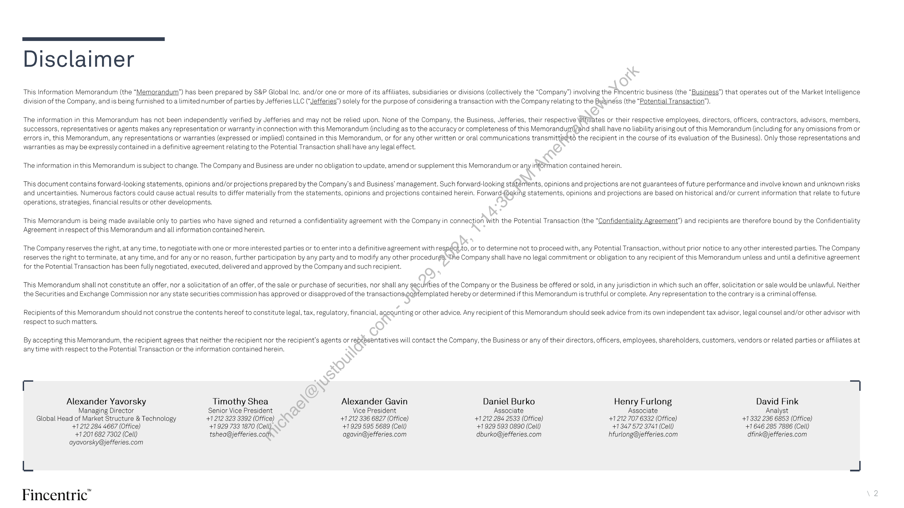
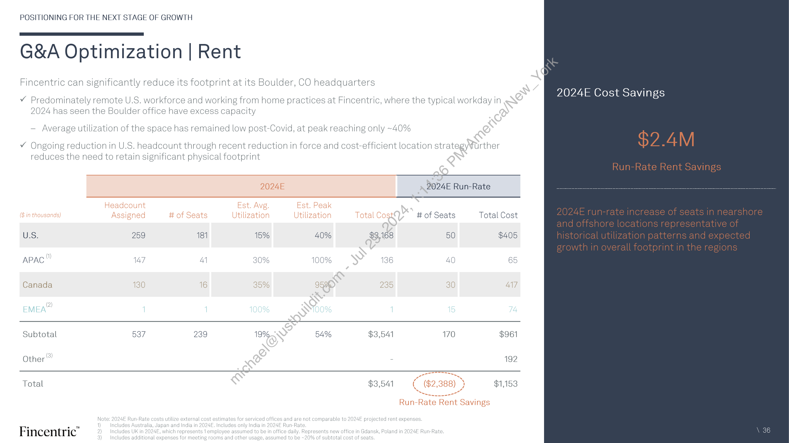
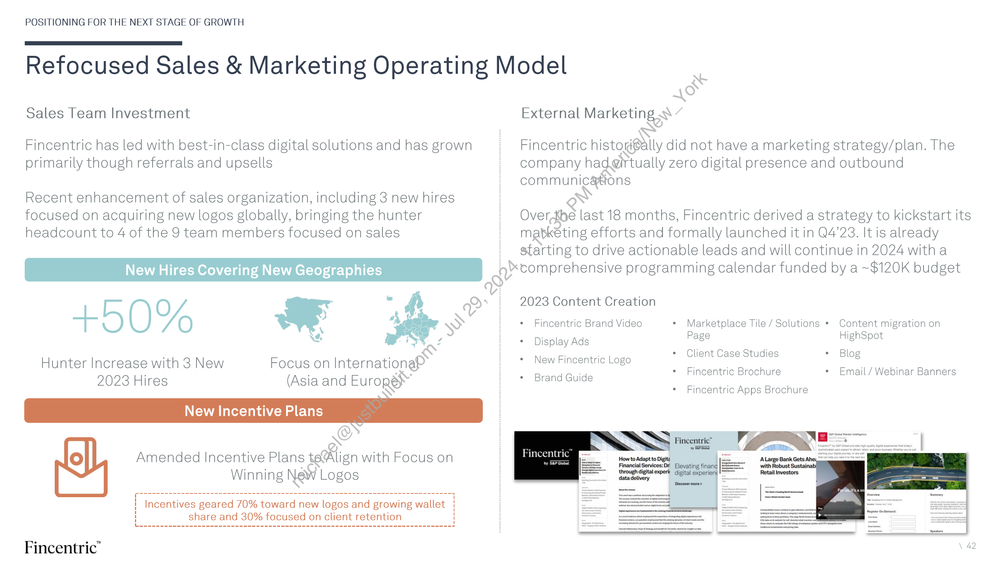
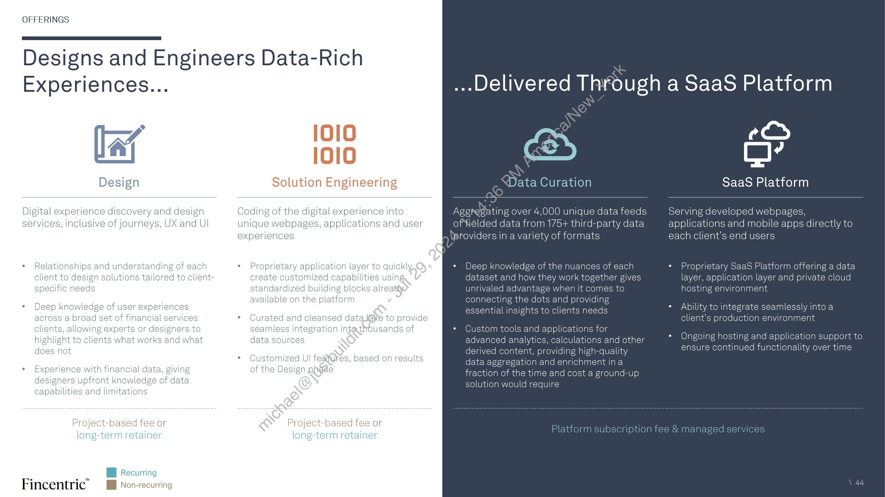
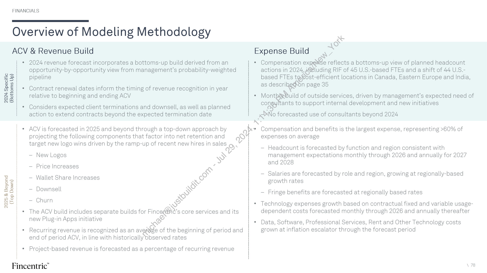
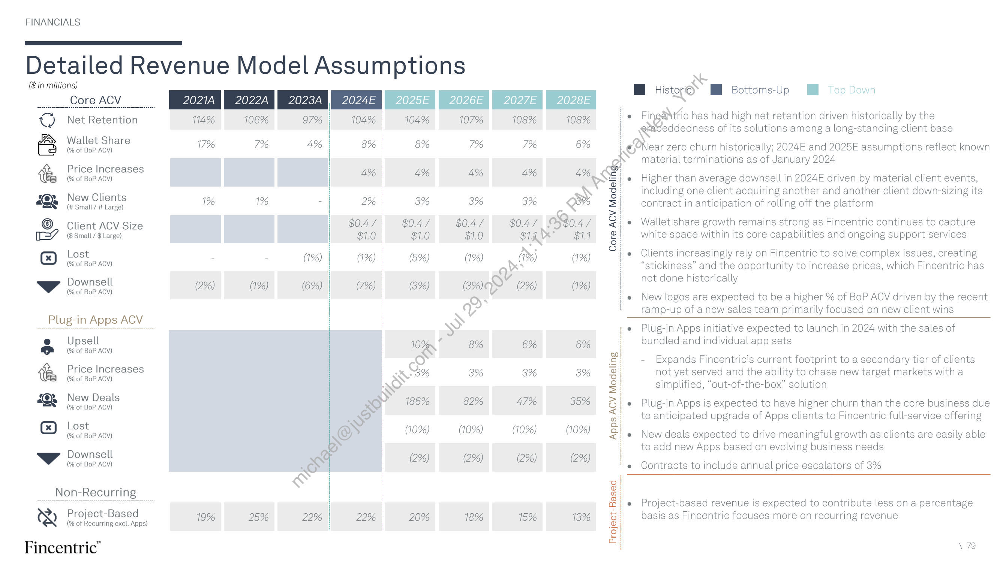
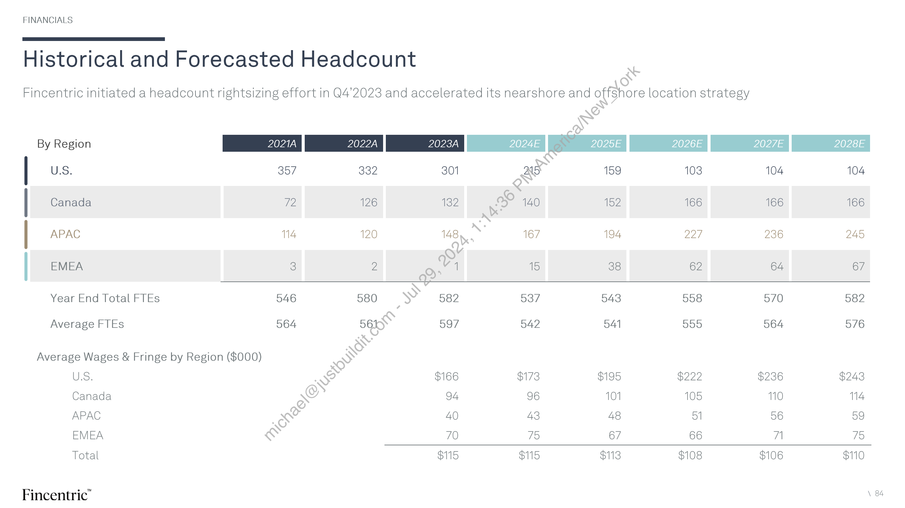

##### Confidential Information Memorandum - Fincentric]

  
````col
```col-md
flexGrow=.5
===
> [!info] [Page 1](_attachments/images_ProjectSpring-CIMvF.pdf_154305/page_1.png)
> 
```  
```col-md
Fincentric  
Tencent Holdings Ltd  
Confidential Information Memorandum  
Winter 2024 / Confidential  
Jefferies  
```
````
Notes:    
````col
```col-md
flexGrow=.5
===
> [!info] [Page 2](_attachments/images_ProjectSpring-CIMvF.pdf_154305/page_2.png)
> 
```  
```col-md
Disclaimer  
This Information Memorandum (the “Memorandum”) has been prepared by S&P Global Inc. and/or one or more of its affiliates, subsidiaries or divisions (collectively the “Company”) involving the Fincentric business (the “Business”) that operates out of the Market Intelligence
division of the Company, and is being furnished to a limited number of parties by Jefferies LLC (“Jefferies”) solely for the purpose of considering a transaction with the Company relating to the Busingss (the “Potential Transaction’),  
The information in this Memorandum has not been independently verified by Jefferies and may not be relied upon. None of the Company, the Business, Jefferies, their respective ‘affiliates or their respective employees, directors, officers, contractors, advisors, members,
successors, representatives or agents makes any representation or warranty in connection with this Memorandum (including as to the accuracy or completeness of this Memorandum)/and shall have no liability arising out of this Memorandum (including for any omissions from or
errors in, this Memorandum, any representations or warranties (expressed or implied) contained in this Memorandum, or for any other written or oral communications transmittedto the recipient in the course of its evaluation of the Business). Only those representations and
warranties as may be expressly contained in a definitive agreement relating to the Potential Transaction shall have any legal effect.  
The information in this Memorandum is subject to change. The Company and Business are under no obligation to update, amend or supplement this Memorandum or any information contained herein.
This document contains forward-looking statements, opinions and/or projections prepared by the Company's and Business’ management. Such forward-looking statements, opinions and projections are not guarantees of future performance and involve known and unknown risks
and uncertainties. Numerous factors could cause actual results to differ materially from the statements, opinions and projections contained herein. Forward4oaking statements, opinions and projections are based on historical and/or current information that relate to future  
operations, strategies, financial results or other developments.  
This Memorandum is being made available only to parties who have signed and returned a confidentiality agreement with the Company in connection With the Potential Transaction (the “Confidentiality Agreement”) and recipients are therefore bound by the Confidentiality
Agreement in respect of this Memorandum and all information contained herein.  
The Company reserves the right, at any time, to negotiate with one or more interested parties or to enter into a definitive agreement with respectto, or to determine not to proceed with, any Potential Transaction, without prior notice to any other interested parties. The Company
reserves the right to terminate, at any time, and for any or no reason, further participation by any party and to modify any other procedurés. The Company shall have no legal commitment or obligation to any recipient of this Memorandum unless and untila definitive agreement  
for the Potential Transaction has been fully negotiated, executed, delivered and approved by the Company and such recipient.  
This Memorandum shall not constitute an offer, nor a solicitation of an offer, of the sale or purchase of securities, nor shall any securities of the Company or the Business be offered or sold, in any jurisdiction in which such an offer, solicitation or sale would be unlawful. Neither
the Securities and Exchange Commission nor any state securities commission has approved or disapproved of the transactionseontemplated hereby or determined if this Memorandum is truthful or complete. Any representation to the contrary is a criminal offense.  
Recipients of this Memorandum should not construe the contents hereof to constitute legal, tax, regulatory, financial, acequnting or other advice. Any recipient of this Memorandum should seek advice from its own independent tax advisor, legal counsel and/or other advisor with
respect to such matters.  
By accepting this Memorandum, the recipient agrees that neither the recipient nor the recipient's agents or representatives will contact the Company, the Business or any of their directors, officers, employees, shareholders, customers, vendors or related parties or affiliates at
any time with respect to the Potential Transaction or the information contained herein  
~ 7  
Alexander Yavorsky Timothy Shea Alexander Gavin Daniel Burko Henry Furlong David Fink
Managing Director Senior Vice President Vice President Associate Associate Analyst
Global Head of Market Structure & Technology +1 212 323 3392 (Office) +1212 336 6827 (Office) +1 212 284 2533 (Office) +1212 707 6332 (Office) +1332 236 6853 (Office)
+1 212 284 4667 (Office) +1 929 733 1870 (Cell). +1929 595 5689 (Cell) +1929 593 0890 (Cell) +1 347 572 3741 (Cell) +1 646 285 7886 (Cell)
+1 201 682 7302 (Cell) tshea@jefferies.com agavin@jefferies.com dburko@jefferies.com hfurlong@jefferies.com dfink@jefferies.com  
ayavorsky@jefferies.com  
L za  
Fincentric”  
```
````
Notes:    
````col
```col-md
flexGrow=.5
===
> [!info] [Page 3](_attachments/images_ProjectSpring-CIMvF.pdf_154305/page_3.png)
> 
```  
```col-md
COMPANY OVERVIEW  
Fincentric™  
Designing, engineering and
managing investor and
advisor-facing digital
solutions for financial
firms, powering core
capabilities across the
industry's leading websites
and mobile platforms  
\oxcett  
a  
Fincentric”  
```
````
Notes:    
````col
```col-md
flexGrow=.5
===
> [!info] [Page 4](_attachments/images_ProjectSpring-CIMvF.pdf_154305/page_4.png)
> 
```  
```col-md
Table of Contents  
01:
02:
03:  
04:  
05  
06:  
07  
08:  
Company Overview
Investment Highlights
Positioning Fincentric for the Next Stage of Growth  
Fincentric Offerings  
Market Dynamics  
People. & Operations  
Technology  
Financials  
10  
30  
43  
52  
57  
65  
74  
```
````
Notes:    
````col
```col-md
flexGrow=.5
===
> [!info] [Page 5](_attachments/images_ProjectSpring-CIMvF.pdf_154305/page_5.png)
> 
```  
```col-md
01  
Company Overview  
```
````
Notes:    
````col
```col-md
flexGrow=.5
===
> [!info] [Page 6](_attachments/images_ProjectSpring-CIMvF.pdf_154305/page_6.png)
> 
```  
```col-md
COMPANY OVERVIEW  
Leading Provider of Digital Solutions to the Financial Industry  
Business Overview Services  
* Fincentric provides full-service solutions for the design, engineering and | .
ongoing management of online digital experiences (websites, mobile apps, etc.) lay Design  
* Unique expertise in the curation and delivery of thousands of financial data
eeds to a client’s end users through a highly scalable SaaS platform ;  
* Premier client base composed of the largest names in financial services with (88) Solution Engineering
many relationships spanning decades i  
* Deep  
y embedded in client workstreams  
* Recu  
ring revenue model supplemented by re-occurring project-based work  
* Founded in 1992 and headquartered in Boulder, CO  
* 9385+
¢ Wholl  
employees, located in the U.S., Canada, India, EMEA and APAG | (e) SaaS Platform
y-owned subsidiary of S&P Global  
Representative Clients  
BlackRock «§ %%CNBC —/ Sexeys""* Fidelity
ENT JPMorGAN CHASE & Co. MERRILL GS Morgan Stanley o Santander  
Client Segments  
—O—  
iu! Online Brokerage  
“sg Wealth Management  
Media & Information  
FINANCIAL
FT TIMES  
TIAA  
```
````
Notes:    
````col
```col-md
flexGrow=.5
===
> [!info] [Page 7](_attachments/images_ProjectSpring-CIMvF.pdf_154305/page_7.png)
> 
```  
```col-md
COMPANY OVERVIEW  
Fincentric By the Numbers  
Financial & Operating  
$96.2M 82% $11.4M
2024E Adj. 2024E Recurring — 2024E RR Adj.  
Revenue!” Revenue EBITD  
Total Clients® Avg. Client Client AUA“
Tenure  
Third-party Data Unique Feeds FTP Weekly  
Providers  
Technology Stack  
165M 11B 7.8M§  
Average Peak Monthly AverageSuote  
Logins / Month Webpage Views Call Aime  
Fincentric”  
935+  
Employees  
Unique End Users  
Siz@of Database  
2.9B  
Peak Monthly
API Calls  
Adj. Revenue ($i)
Growth 8% 3) 3% 7% 8% 9% 10%  
Recurring 80% 82% 82% 83% 84% 86% 88%  
$1041 $113.1 ai  
$87.3 $93.9 $93.4 $96.2 $100.3  
Adj. EBITDA ($M)  
$11.4 $13.0  
($0.7)
2021A 20224 2028A 2024E 2024ERR 2025E 2026E
mmm Adj. EBITDA —o=Margin  
10%  
90%  
$137.0  
```
````
Notes:    
````col
```col-md
flexGrow=.5
===
> [!info] [Page 8](_attachments/images_ProjectSpring-CIMvF.pdf_154305/page_8.png)
> 
```  
```col-md
COMPANY OVERVIEW  
30 Years of Premier Digital Engagement Inno .
2010 2017 1 2023
1992 1996 Acquired by Markit and 2014 Developed 2 Rebranded as
Company founded Relocated to rebranded as Markit on invest ; Fi . om
as Wall Street b Boulder, CO and Demana nalized digital vigSreality” 2019 incentric
‘ y vobranded ae 2000 personalized digital viral reality Change in
Paci New ore Wall Street on Integrated news, peveroped anc launched experiences to aS martText Launched AP) leadership
research and the Financial Times iPad optimize user 2) activated on Gateway and API 2021 :
app pre-iPad launch (and Developer Portal
Amazon Alexa : Introduced
Thematic Investing  
won an Apple Design award  
ratings data
for it)  
Delivered research Demand
reports via fax i  
Developed tools
for Palm Pilot  
2016  
1994
Designed financial : 2012 Markit on Demand :
data for web-based 1997-1998 Launched F2, an open- becomes Markit 2018 :
consumption Deployed the first i ~ source framework to Digital to reflect : : 2024
stock screener and 200322004 integrate tools and omni-channel Created 2020 2022
first launch of content from multiple services provided dynamic S&P acquired S&P
price, volume and Launche@smartText — providers into a single to clients data-driven Generated IHS Markit announced
earnings alerts dynagglly generated front end video Conversational strategic
c entary and built Ul Launched ESG review
HTMLS6 interactive Ratings and key
charts issues insights
Growth Enabler for Online Brokerage Digital Experience Specialist
\8  
Fincentric”  
```
````
Notes:    
````col
```col-md
flexGrow=.5
===
> [!info] [Page 9](_attachments/images_ProjectSpring-CIMvF.pdf_154305/page_9.png)
> 
```  
```col-md
COMPANY OVERVIEW  
Fincentric Today and Positioning for Growth and Margin Expansion  
Pricing  
Fincentric is being transformed following the + Pricie¥fdw vs competitors and client  
S&P Global / IHS Markit merger valyle  
* New CEO appointment * ¢€ontractual price increases not enforced
Fs X oo :  
* Rebranded to Fincentric from Markit Digital EE Implement price increases from "24  
G&A - Rent * Move to longer term contracts with builtin annual price escalation  
* Increased focus on commercial excellence . wee
sos * Lowoffice utilization o€ 218%  
* Conducted business review ‘ant in high-cost location  
Workforce Size * Reduce real estaté footprint $20.9 M®)
* Significant excess in ‘24 RR/  
Foundational business review findings include: capacity coupled with $4.4M2) $63.8M0)  
low attrition in ’23 RR/
Y Market-leading and differentiated product $3.1M2) "28E impact  
* Completed RIFsin $28 3M2. . . . . . i RR/ 0
v Premier client base with high satisfaction 4Q'23 (22 FTEs) and : a
“ 10°24 (45 FTEs) ; $17.7M2) 28E impact  
v Deeply embedded in customer workflows driving : ’28E impact
highly recurring revenues i  
v Substantial scope for cost savings  
v Sizeable and growing TAM Underpinned by  
Refocused  
: : Sales & Marketing gn
Transformation Plan to deliver 7-10% growth
and ~30% margin is underway Product  
G&A - Tech * Plug and play solutions  
* Excess platform capacity at wanted by Tier 2/3 firms
Workforce Location non-peak hours * Interest in new capabilities
(e.g. options, ESG)  
* Prioritized opportunities to drive sustainable revenue
growth and margin expansion highlighted here  
— 2024 target of ~7% RR growth and ~11% RR  
. * Offshore teams perform * Optimize tech platform for
margin (+16ppt) equivalently to onshore; real-time scaling * Introduce Plug-in Apps to
* Completed two RIFs with $8.8M RR impact material headroom to penetrate whitespace
increase offshoring * Enhance prod i. _ product offerings to
* Further detail of the Transformation Plan is laid out * Accelerate offshoring gain wallet share
in Section 3 program to ~50% by 2026  
Excludes savings impact of SBC portion of LTI  
Fincentric’” 2) Excludes impact of downsell and churn on new  
3) Total impact net of associated costs for Plug-in Apps.  
```
````
Notes:    
````col
```col-md
flexGrow=.5
===
> [!info] [Page 10](_attachments/images_ProjectSpring-CIMvF.pdf_154305/page_10.png)
> 
```  
```col-md
Investment Highlights  
```
````
Notes:    
````col
```col-md
flexGrow=.5
===
> [!info] [Page 11](_attachments/images_ProjectSpring-CIMvF.pdf_154305/page_11.png)
> 
```  
```col-md
INVESTMENT HIGHLIGHTS  
Ne
x  
fe)
1 Market-leading provider of online digital investing experiences -  
ww
ce
&
2 Long-standing, premier-quality client base with a track record of inopéasing wallet share
ge
*:
\
3 Extensive SaaS platform delivering complex capabilities with performance and scale
Vv 4
re
Oy »  
4 Embedded into client workstreams, driving bothiigh retention and >80% recurring revenue  
Ss
RS
5 Expanding TAM as more prospective gients look to external providers with expertise in financial data
Ny
»
RC)  
we  
6 Tenured management teama@ith deep operational and business expertise  
```
````
Notes:    
````col
```col-md
flexGrow=.5
===
> [!info] [Page 12](_attachments/images_ProjectSpring-CIMvF.pdf_154305/page_12.png)
> 
```  
```col-md
MARKET-LEADING OFFERING  
[|  
Fincentric has an Unparalleled Array of Capabilities.    
Quotes
)
7  
Real-time & Delayed  
seppe7 puog,  
Fincentric offers the most
comprehensive set of
capabilities that comprise
industry-leading digital
investing experiences  
Charting  
‘Stock Screener  
=) 5
8/3
8/8
3
3
| $  
Screener  
Fincentric”  
```
````
Notes:    
````col
```col-md
flexGrow=.5
===
> [!info] [Page 13](_attachments/images_ProjectSpring-CIMvF.pdf_154305/page_13.png)
> 
```  
```col-md
MARKET-LEADING OFFERING  
.  Delivered by Fincentric’s Market Leading SaaS Platform  
Multi-layered platform provides highly customizable and seamless end-to-end solutions for clients  
Client Agnostic  
Customizable  
» i.  
e
e  
Ingestion Normalization
7 am
aa am
z= a=
Validation Storage  
OT  
Cross Reference Aggregation  
Creates a repository of highly curated third-party and
client data and content in a structured format, which fuels
the engines that power the platform’s capabilities  
Chart Generation  
Content Curation &  
Dynamic Content &
Video Generation  
EA  
Calculation Engines  
Triggering  
EE
Search & Document
Screening Management  
200+ engines serve as the building blocks to pull in data  
and generate content, resulting in efficient creation of
capabilities  
a  
Web Mobile
APIs  
Streaming Content  
ea  
Messaging Reports  
Performant, portable, and custom interfaces to power  
sophisticated and intuitive experiences that drive high
client satisfaction  
SaaS Platform  
Fincentric”  
Solutions provided directly from the private cloud with Fincentric managing all aspects from data through end-user experiences  
```
````
Notes:    
````col
```col-md
flexGrow=.5
===
> [!info] [Page 14](_attachments/images_ProjectSpring-CIMvF.pdf_154305/page_14.png)
> 
```  
```col-md
MARKET-LEADING OFFERING  
.  to Four Primary Client Segments  
Clients  
Revenue  
ACV  
Fincentric”  
-——O—
aul!  
Online Brokerage  
Provide intuitive investing experiences
spanning research, screening, analysis
and other tools relevant to selfdirected investors  
18  
$47.8M  
$38.1M  
Representative Clients  
lrg  
Wealth Management  
Deliver advisor and advised client
research platforms and portfolio tools
for wirehouses, national/regional BDs,
RIA aggregators and IBDs  
17
$24.6M  
$20.3M  
Asset Ma¥fragement  
Empower sates teams with fund
reporting, ahalysis and hypothetical
portfol@solutions targeted at advisors
and wholesale distributors  
12  
$11.9  
$11.4M  
Media & Information  
Turn complex financial data into
insights to engage and monetize the
audiences of financial media and
information firms  
18  
$7.5M  
$7.3M  
EXTRADE mensiifS 0!" BlackRock Mii MetLife SkeNBC FT Hx!
Fidelity 1pMoxcan cuase&co. MorganStanley Santander cA mes (TIAA HIKE x REUTERS
Note: Excludes clients not classified into a segment. Some clients are included in multiple segments. Revenue reflects 2023A Adjusted Revenue, which includes recuring and project-based revenue. ACV and client count as of December 2023 14  
```
````
Notes:    
````col
```col-md
flexGrow=.5
===
> [!info] [Page 15](_attachments/images_ProjectSpring-CIMvF.pdf_154305/page_15.png)
> 
```  
```col-md
MARKET-LEADING OFFERING  
.  
With Connectivity to the Most Relevant Data Sources  
Representative examples  
Market Research
Bloomberg @Msxes CFRA
WOH LSEG wits — MCANINGSTAR a UBS Moopy’s  
SVX TELEKURS  
Fundamentals  
WOH LSEG 2t%s — MCRNINGSTAR  
Sector & Industry  
TP aaneee RANKS:  
COMTEX S*2CNBC
FRED  
DD | DOW JONES ° 8Q% LSEG Riis  
REUTERS MTNEWSWIRES  
Client Provided  
WOH LSEG Bilifics  
MC ANINGSIAR ~=S&P Global  
Fincentric”  
ICBG<@)
WOH LSEG 282%: oWANINGSTAR  
S&P Global 4a ZACKS  
Proprietary  
Portfolio Positions  
User Analytics  
Fincentric consumes and manages over 4,000
unique feeds of fielded data from over 175
third-party data providers  
Data is cross-referenced, normalized and
optimized for digital consumption by
proprietary data engines  
Insulate client solutions from underlying data
issues and change through ongoing end-to-end
operational support of all data sets  
Third-party feeds can be combined with a
client’s proprietary data to deliver a seamless
user experience  
New data providers and/or feeds can be
efficiently incorporated into the existing
platform at the request of clients  
Data Distribution & Licensing Models:  
1. Entitlement of client licenses
2. Use of Fincentric enterprise licenses
3. Redistribution with cost passed to client  
```
````
Notes:    
````col
```col-md
flexGrow=.5
===
> [!info] [Page 16](_attachments/images_ProjectSpring-CIMvF.pdf_154305/page_16.png)
> 
```  
```col-md
MARKET-LEADING OFFERING  
Clients Have Consistently Won Awards for the Capabilities Fincentric Provides  
BARRON'S  
2023  
Best Online Brokers and Trading Platforms
7 of the top 10 work with Fincentric  
@ Investopedia  
2023
Best Online Brokerage Accounts and  
Trading Platforms
5 of the top 8 work with Fincentric  
Fincentric”  
“ StockBrokers con  
2023  
Best TradingPlatforms
5 of the top S.woerk with Fincentric  
Kiplinger  
2023  
Best Online Brokers and Trading Platforms
7 of the top 10 work with Fincentric  
INVESTOR'S
BUSINESS
DAILY  
2023  
Best Online Stock Brokers
3 of the top 3 work with Fincentric  
2022  
Aite-Novaricalmpact Awards
Digital Client Engagement Category Advisor
Focused: Atria Wealth Solutions
Onboarding: Bank of America Merrill Lynch  
```
````
Notes:    
````col
```col-md
flexGrow=.5
===
> [!info] [Page 17](_attachments/images_ProjectSpring-CIMvF.pdf_154305/page_17.png)
> 
```  
```col-md
PREMIER CLIENT BASE  
Fincentric Services a Premier, Blue-Chip Client Base  
@, ATRIA  
Ameriprise JASX LM, Wealth Solutions
BlackRock. BMO €Y Bank of Montreal ye BNY MELLON
CIBC® %% CNBC CIN)
Edward Jones === EMPOWER Fidelity
HKEX «>
Si <2 fii HSBC INTUIT  
SA mrs
3 nab  
PIPER| SANDLER  
[i eon  
Quicken  
PIMCO
OTIAA  
STIFEL  
N  
Fincentric”  
AUSIEX  
CAPITAL
GROUP".  
‘Commonwealth Bank  
FT  
%  
Jefferson Research  
iyi MetLife  
NIKKEI  
Royal Bank
of Canada  
RBC  
TheStreet
ABfestpac  
WELLS
FARGO  
MERRILLESS. belldirect >
& Cetera
Deutsche Bank D 1 re X 1 on
@) Goldman
PRANKLIN TEMPLETON Sa chs
JPMorGAN CHASE & Co. ow LSEG
Morgan Stanley MORNINGSTAR
vw, sieee ()PPENHEIMER.
«> Santander Scotiabank  
THOMSON REUTERS  
9  
```
````
Notes:    
````col
```col-md
flexGrow=.5
===
> [!info] [Page 18](_attachments/images_ProjectSpring-CIMvF.pdf_154305/page_18.png)
> 
```  
```col-md
PREMIER CLIENT BASE  
Clients Use Multiple Fincentric Capabilities . ae  
OB = Online Brokerage, WM = Wealth Management, AM = Asset Management, MI = Media & Information 4o Areas of Focus
Fund Info Jarkets CompanyInfo = Charting News ane Quotes Screening Notifications ss
Client 1 Fincentric has recently been
expanding the capabilities that
- it offers in these areas
Client 2 following market demand and
is actively pursing wallet sharegrowth opportunities in the
Client 3 white space seen here
Client 4
Select Clients
Client 5 GF
amo @ > caprat
Client 6 GROUP”
Client 8
i meamiilS vowenstentey 34 nab
Client 9 EXTRADE
Client 10 OTIAA Ei) Bank
RBC
Client 11
FARGO
Client 12
Client 13  
Fincentric” \ 18  
```
````
Notes:    
````col
```col-md
flexGrow=.5
===
> [!info] [Page 19](_attachments/images_ProjectSpring-CIMvF.pdf_154305/page_19.png)
> 
```  
```col-md
PREMIER CLIENT BASE  
Long-Standing Relationships with Financial Services Leaders  
Adj. Revenue by Year Current Recurring 21-23, _/ Client Tenure Client Uses
: (8 in millions) Hi Recurring Project Based ACV ($M) Revenue % % Growth (Years)
2023 $16.4 [ .
; Online Brokerage
2022 15.5 9X
Client 1 2021 14.7 $16.1 91% 1 WM - Advisor, Clients and Plans
DT 12.0 Online Brokerage
Client 2 a 13.5 8.9 80% 6%) Be WM - Advisor
eT
12.5 Asset Management
Client 3 Es 8.6 Online Brok
ee 9 85% is | nline Brokerage
7 45 52% & WM - Advisor
Client 4 7 .
Online Brokerage
ae) 45 96% 21 WM - Advisor and Clients
Client 5 3 9 ep Online Brokerage
mm 7 , 4.2 90% 176% * 22 WM - Private Bank Clients
; 4S (29% .
Client 6 eC, 40 84% 160% Online Brokerage
mo 17 WM - Client
— 45 .
— Online Brokerage
Client 7 mu 41 7 39% 84% WM - Advisor and ClientsEs 3.9 i
Client 8 —— 41 34 771% 0%) Online Brokerage
as 43 WM - Advisor and Clients
| .
Client 9 ey 24 771% 2% Online Brokerage
MG WM - Advisor and Clientsee a) Online Brokerage
Client 10 as 4 £0 2.4 85% + 15%) WM - Advisor and Clients  
Asset Management
Fincentricy yo opsccemver 0: v9  
```
````
Notes:    
````col
```col-md
flexGrow=.5
===
> [!info] [Page 20](_attachments/images_ProjectSpring-CIMvF.pdf_154305/page_20.png)
> 
```  
```col-md
PREMIER CLIENT BASE  
Client Wallet Share Growth Driven by Increased Client Penetration  
4S  
Fincentric forms long-lasting relationships and expands across client products and business lings, resulting in wallet share growth  
MERRILL bos.  
A BANK OF AMERICA COMPANY  
Client Since 1996  
For over 28 years, Fincentric has been Merrill’s
innovation partner helping to create, develop and
transform its self-directed, advisor-focused and
institutional retirement platforms  
Advisory tools
for Advisor
Workstation  
Institutional
Retirement
Investment Center  
Stock
Stories  
2008 2013  
2017  
Markets Alternative CollaborativeO
Data Investment On-Boardi  
Research Fact Card Experiens
Site Daweh
&  
ce  
<  
Revenue Milestones  
Fincentric”  
Alternative
Investments
Website Design  
Both Merrill and Bank of America were
clients prior to their 2008 merger and
Fincentric’s footprint has grown since  
Options
Strategy
Builder  
\)
aw JPMORGAN CHASE & Co.  
‘S
Client since@d00  
Aclien 24 years, the partnership expanded in JPMorgan is one of Fincentric’s fastest
201 Wit the commencement of work on Quotes & — growing clients with significant white
Regéarch content and continues to grow space still to capture  
Morgan Online Chase
Wealth Quotes & Chase Stock
Management Tool Research Screener
2006 2022
Public ADR.com Hong Kong
Quotes & website Private Bank
News site Markets and
International
Stocks
Research  
=> <>  
\ 20  
```
````
Notes:    
````col
```col-md
flexGrow=.5
===
> [!info] [Page 21](_attachments/images_ProjectSpring-CIMvF.pdf_154305/page_21.png)
> 
```  
```col-md
SAAS PLATFORM  
Highly Scalable and Extensible Technology Platform  
Fincentric’s platform delivers reliability and performance. . . . . . Dati Busi Mi i Front-End a
while ENSUring the security demanded In financial SETVICES Data Onboarcing Finished Output  
Platform Highlights  
Mis  
Streaming  
API Gateway
>  
|  
v  
2 Web
JavaScript
Mobile
Css O
HTML5 Messaging
Canvas S
Reportin
Node p .
Objective-C [#4 Streaming
Java Web  
Angular Components  
React lal Custom APIs  
Vue EI Dynamic Video  
v¥ Sophisticated data management pipelines and extensive Data _
business engines functionality
v¥ Hosted and managed in NTT data centers in a private cloud
— Fully redundant network and server design reports & |
— In process of upgrading to TX-1 data center (at no cost to
Fincentric)
v  Infrastructure-agnostic model allows for provider optionality paket |—>
v¥ Modernized code base written primarily in C-Sharp / C++
(backend) and JavaScript (API and front-end) Proprietary
Y Lightweight and portable Ul supports seamless, low-effort User Data
client integrations  
Lines of Code Code Releases in Infrastructure Database
the 12 Months Refresh Completed Transactions / Min  
Fincentric’  
Data Storage  
FTP Weekly  
Hosted Client
Domains  
```
````
Notes:    
````col
```col-md
flexGrow=.5
===
> [!info] [Page 22](_attachments/images_ProjectSpring-CIMvF.pdf_154305/page_22.png)
> 
```  
```col-md
SAAS PLATFORM  
SaaS Platform Further Utilizes Client Project-Based Work to Grow Over Time  
Project-based Work Fulfills Client Needs and Builds
Recurring Revenue  
* Clients pursue project-based work to continually innovate userexperience and bring new capabilities to market  
* This allows clients to align re-occurring enhancement work with
their strategic priorities  
Re-occurring  
* Project-based work typically starts in the design phase, Project-kased
continues through the engineering phase and, upon launch,
generates recurring revenue through ongoing platform
subscriptions and managed services  
Flywheel  
Project-based Flywheel Enhances the
SaaS Platform Value  
* Functionality developed in project-based work includes both
custom client implementations and platform enhancements  
* Platform enhancements grow the foundation and then are
leverageable as upsell opportunities across Fincentric’s £Ut
client base  
* Revenue generating client work augments this coptyiuous cycle
of platform product development investments  
SaaS Platform Foundation  
Fincentric”  
```
````
Notes:    
````col
```col-md
flexGrow=.5
===
> [!info] [Page 23](_attachments/images_ProjectSpring-CIMvF.pdf_154305/page_23.png)
> 
```  
```col-md
HIGH CLIENT RETENTION  
Fincentric is a Sticky Solution and Deeply Embedded with its Clients  
Client Workstream Integration End User Interaction
Partnership Reliance Trust
Clients partner with Fincentric on the design Clients rely on Fincentric to deliver misgten- Clients trust Fincentric to represent their
and engineering of their core product critical core functionality through itsSaaS brands and directly serve content and
offerings with interaction spanning the platform, including clients’ proprietary experiences to their customers
executive level through individual engineers business logic, sensitive data afte’analytics  
C te Strat  
orporate otraresy LI End User View  
Product Strategy  
@ Roadmap
@® Design Fincentric Platform Subscription f Direct Content Delivery
Engineering j f
© Operations Fincentric SaaS Platform
Marketing
Monitoring & Feedback ry] Data was Client Domains  
360+ 100M+  
Client Domains Unique End Users  
Fincentric”  
```
````
Notes:    
````col
```col-md
flexGrow=.5
===
> [!info] [Page 24](_attachments/images_ProjectSpring-CIMvF.pdf_154305/page_24.png)
> 
```  
```col-md
HIGH CLIENT RETENTION  
.  Driving Highly Recurring Revenue with Diverse Client Base  
Adj. Revenue  
Project-Based
18%  
Recurring
82%  
More than 80% of Fincentric’s revenue is recurkihg, with incremental
project-based revenue largely re-occurring and generated from the
same client base  
Fincentric’  
<5 years
9%
5-10 years
7%
10-15 years $77M >20 years
17% Dec-23 58%
15-20 years
10%  
More than 50% of Fincentric’s ACV is generated from clients with over
20 years of tenure  
Furthermore, ~90% of ACV is from clients with more than 5 years of  
tenure, highlighting the stickiness and longevity of client relationships  
```
````
Notes:    
````col
```col-md
flexGrow=.5
===
> [!info] [Page 25](_attachments/images_ProjectSpring-CIMvF.pdf_154305/page_25.png)
> 
```  
```col-md
HIGH CLIENT RETENTION  
ACV Retention Has Remained High Over Time  
Components of Churn Downsell Upsell
ACV Build * Represents cases where a client * Decrease in ACV (but not a loss Increase in ACV relative to prior
leaves Fincentric of client) relative to prior period period
Included in Retention Metrics en | a |_|
Retention Metrics (ACV) Commentary
Gross Retention Gross Retention
(excl. Downsell) (incl. Downsell) a Net Retention
¢ Minimat customer churn driven by high client satisfaction and the
114% partmérship, reliance and trust brought by the embedded nature of
100%ggog 100% 990% 99% gr, 99% 04% Ritcentric’s client relationships  
93% 92%  
2021A 2022A 2023A 2024E  
Fincentric”  
* Decline in retention metrics in 2023 impacted by two one-time events
— Industry consolidation drove the acquisitions of three clients (each
acquired by existing Fincentric clients), resulting in increased downsell
— One asset management client is in the process of insourcing its
marketing solution by the beginning of 2025 and is gradually reducing
spend with Fincentric
¢ Net retention has been strong given Fincentric’s ability to upsell new  
capabilities to existing clients as the industry evolves and the demand for
innovation continues  
\ 25  
```
````
Notes:    
````col
```col-md
flexGrow=.5
===
> [!info] [Page 26](_attachments/images_ProjectSpring-CIMvF.pdf_154305/page_26.png)
> 
```  
```col-md
EXPANDING TAM  
Industry Tailwinds Support Long-term Market Growth.    
TAM and SAM Summary JAM reflects ~1,650 addressable financial
Theoretical value of the market at full institution clients globally and represents
penetration at competitive market pricing, Pin . .
ence Jen including large scale one-time design and-dev total spend on retailinvestor / advisor d igital
os projects engagement solutions (including design,  
engineering and managed services)  
/ Vended + In-House Strong tailwinds will support a TAM growth of
/ $1.6 BN ~4-6% CAGR and a SAM growth of ~5-7%
i Theoretical value of the addressable market CAGR over the next five years
i at full penetration for Fincentric and its
H direct competitors at Fincentric’s pricing Vended + In-House (TAM)
* Growth in self-directed brokerage propositions by banks and
\ Vended Market brokers (e.g., in EMEA) and launch of new fintech
‘ Self-directed brokerages and retail wealth managers
4 ~$1 BN continued investment in the digital experience of retail
\ Penetration-weighted total investors and advisors
\ addressable market using third-party Asset managers are increasingly looking to arm wholesalers  
solution(s) with sophisticated tools to support solution selling  
\. / Vended Market (SAM)  
. PX * Shift from in-house development to specialized third-parties
Fincentric as data complexity increases resulting from the  
multiplication of data types ESG) and vendors and the
$94M bar for digital experiences raises  
Fincentric”  
```
````
Notes:    
````col
```col-md
flexGrow=.5
===
> [!info] [Page 27](_attachments/images_ProjectSpring-CIMvF.pdf_154305/page_27.png)
> 
```  
```col-md
EXPANDING TAM  
.  With All Components of TAM Expected to Grow Over the Next Five Years  
The market is expected to grow modestly at ~5-7% a year with nearly uniform growth across client tiers and revenue types  
TAM by Client Tier Total TAM: ~$2.1 BN TAM Growth byRevenue Type Total TAM: ~$2.1 BN
$ BN, 2023 - 2028 $ BN, 2023 - 2628  
CAGR CAGR
@) % Outsourced 793-28 23-28  
~$2.1  
~$1.6  
2023 2028 2023 2028
Hl tier Tier 2 Wi Tiers HB Project Based HB Recurring  
Fincentric’” Source: Oliver Wyman  
i)
SI  
```
````
Notes:    
````col
```col-md
flexGrow=.5
===
> [!info] [Page 28](_attachments/images_ProjectSpring-CIMvF.pdf_154305/page_28.png)
> 
```  
```col-md
EXPANDING TAM  
.  
and Multi-Dimensional Growth Pathways  
Fincentric has multi-dimensional
growth pathways that will allow it to
offer more services to clients,  
2 Client Use Cases increasing the footprint it can service  
ry  
. . within th mark
~ 1 Client Segments Other Use Cases Geographies 3 a i ul total eUINEL
RIA (e.g., Financial planning)
Mid-Marké Proposal Generation RoW Wallet share growth of existing clients:
Wealth Advisory Portfolio Simulation . Multi-leg options - quotes enhancements to  
Asset Managers Insichts Europe incorporate multi-leg guided experiences  
Media and Info Services ESG integration — data and tooling to provide
APAG risk and return insights using ESG as an  
alternative data set  
Research and
Pre-Trade  
Large Bank Wealth Advisory Analytics  
Self-directed Brokerages North Amerie Fixed Income — data and tooling on fixed  
income as investors diversify beyond equities  
0) = experience ents
News and Quotes! Vendaragnostic data infrastructure with customized front end Crypto — data and experience enhancements  
post SEC approval of BTC spot ETFs  
Research
ESG . .
New logos via geographical and
xed Income » Soluti segment expansion:
Fincentrie current positioning crypto Single data vendor “Plug-in Apps” Solutions 5 c
C tri tri yp / 0 Plug-in Apps - standardized capabilities that
e@ cotoning rie Options “Out-of-the-box" Saas Soluti Tier 2 and 3 brokerage clients can seamlessly
p 8 ; ; ut-of the-box" Saas Solution embed into their existing websites
Growth opportunity Private Markets : : :
Mid-market Wealth — extension of Apps tailored
O Farther adjacency 4 Data Types 5 Delivery Model to mid-market wealth advisors to drive segment  
growth  
APAC and Europe — geographic expansion into
APAC and Europe with more localized data sets  
Fincentric”  
```
````
Notes:    
````col
```col-md
flexGrow=.5
===
> [!info] [Page 29](_attachments/images_ProjectSpring-CIMvF.pdf_154305/page_29.png)
> 
```  
```col-md
6 | MANAGEMENT  
Tenured Management Team with Deep Operational and Business Expertise  
Renee Spampinato
Global Head of Fincentric
Years with Fincentric: 21  
Fincentric”  
Hannah Kattermann
Head of Strateg¥& Product
Years with Fxeeéntric: 3  
ASSOCIATES Bed TISHMAN SPEYER  
Fincentric”  
Bethany Baer
Chief Technology Officer
Years with Fincentric: 7  
Bankrate 2ABITZ  
WORLDWIDE  
Scott Kortgard
Head of Sales & Business Development
Years with Fincentric: 8  
Interactive Data [2 DOW JONES  
```
````
Notes:    
````col
```col-md
flexGrow=.5
===
> [!info] [Page 30](_attachments/images_ProjectSpring-CIMvF.pdf_154305/page_30.png)
> 
```  
```col-md
O03  
Positioning Fincentric
for the Next Stage of
Growth  
```
````
Notes:    
````col
```col-md
flexGrow=.5
===
> [!info] [Page 31](_attachments/images_ProjectSpring-CIMvF.pdf_154305/page_31.png)
> 
```  
```col-md
POSITIONING FOR THE NEXT STAGE OF GROWTH  
Strategic Transformation Underway With
~$22M in Run-rate Benefits in 2024  
Following the departure of Fincentric’s former CEO in 2023, S&P and  
Fincentric ma
identified seve  
agement have reviewed the business practices and
al opportunities for transformation  
Cost Rationalization  
Costs through 2023 were significantly above peer businesses where EBITDA
margins generally range from 15% to 35%!”  
Near-term cost rationalization consists of executed reductions in force,
accelerated offshoring to India and other cost-efficient locations beginning in
2024, and G&A expense initiatives over the next three years  
Cost actions total ~$26M over the next three years, with ~$15M of run rate
impact realized immediately in 2024  
Revenue Optimization  
Fincentric” ?  
Revenue growth through 2023 lagged targets as client contracts feflected
legacy billing models and price escalators went unenforced  
Fincentric
value of its  
is optimizing its existing book of business to capture the commercial
services by re-contracting and increasing pees  
Longer-term initiatives include launching Plug-in A
capabilities, including ESG, crypto and options and
segments and geographies  
ps’ offering new data
éxpanding into new client  
Fincentric expanded its sales and marketing team in 2023 to support these
revenue efforts and allow added focus on new logo acquisition  
Target Margin Improvement tqo*%30% by 2028  
(2021-2022) Adj. EBITDA Margin by Peer Archetype  
) Quartile
9 2m (2 45%
Fincentric” ” Ret  
Bottom  
Peers  
RR Digital Mgmt.  
In Year Run-Rate Revenue and Cost Actions®)
Adj. EBITDA Margin  
4% 12% 20%  
and Annual Growth of ~10%y 2026  
$67.4M  
Total Re ue
Actions  
22.1
$ $20.1  
$28.5M  
Total Cost
Actions  
2025E
mCost Actions mRevenue Actions  
2026E 2027E  
```
````
Notes:    
````col
```col-md
flexGrow=.5
===
> [!info] [Page 32](_attachments/images_ProjectSpring-CIMvF.pdf_154305/page_32.png)
> 
```  
```col-md
POSITIONING FOR THE NEXT STAGE OF GROWTH  
Multiple Levers Being Pulled to Position the Business for Future Growth  
@) Offshoring  
Workf
FEI ihc  
ate  
tC sFile  
G&A
Optimization  
Recontracting
& Repricing  
Growth
Initiatives  
Near-term Offshoring  
Targeting shift of 10
positions to Canada, 20
positions to India and 14
positions to Poland in 2024  
Results in 34% of workforce
in cost-efficient locations  
Long-term Offshoring  
Targeting over 50% of
workforce in cost-efficient
locations by 2026  
Acceleration of existing low cost /  
near-shoring program  
Rent  
* Scale-down Boulder footprintto reflect  
reduc  
ion in U.S. workforee and expected  
split of office vs. worksffém-home time  
* $2.4  
Run-Rate Cost Savings in 2024  
Tech Optimization  
Cloud  
native Modernization of  
applications’and data systems for  
reduc  
ion’in run costs for both private  
andpublic cloud  
+ Jderea
infras
costs  
* Altoo  
* Benefi  
in $1.0  
Underu  
Autoscaling and containerization to eliminate  
sed automation inCl/CD &  
ructure as code for reduced labor  
ing for enhanced productivity  
ts start accruing in 2027 and result
M in run-rate savings  
ilized offices due to hybrid trends  
non-peak capacity  
Contract Renegotiation  
* Implement new contract
erms as clients come up for
renewal  
+ Extend contract terms  
* Convert to service/deliverybased model rather than
pure FTE allocation  
* Emphasize platform
subscription  
Price Increases  
* Enforce annual escalators in
existing contracts  
* Increase rate cards  
Plug-in Apps Initiative  
+ Launch of pre-built, ready to
integrate Plug-in Apps  
Other Initiatives  
* Delivery of incremental data
and tooling enhancements
(options, ESG, fixed income,
crypto, insights)  
« New logo acquisitions in
APAC and Europe, midmarket wealth advisory,
supported by expanded
sales and marketing team  
Services underpriced relative to  
customer value and the market  
Scale, repeatability and
geographic expansion  
| Type
Reduction in Force
* Executed Q4’23 RIF of 22
U.S.-based employees
focused on non-producer
roles, generating $2.0M in
run rate savings
, Executed Q124 RIF of 45
Actions & U.S.-based employees
Benefits distributed across the
company, generating
$6.8M in run rate savings
Surplus of non-producing roles
Drivers Lower than expected attrition,
resulting in excess capacity
2024 RR $8.8M0
Impact
Additional
Impact  
Fincentric”  
$5.0M / $6.8M
2025E / 2026E  
$1.0M / $1.0M
2027E / 2028E  
$3.1M / $3.5M
2025E / 2026E  
$6.8M® / $9.8M2
2025E / 2026E  
```
````
Notes:    
````col
```col-md
flexGrow=.5
===
> [!info] [Page 33](_attachments/images_ProjectSpring-CIMvF.pdf_154305/page_33.png)
> 
```  
```col-md
POSITIONING FOR THE NEXT STAGE OF GROWTH  
Executed Reductions in Force  
Pro Forma Headcount (Q4’23 RIF — Q1’24 RIF)
Wages Run-Rate Savings 2024E Cost Savings  
604 $8.8M®  
(22) 582
Run-Rate Cost Savings  
Fincentric continues to execute on its strategic
plan to optimize the business  
* Executed a RIF in Q4’23 RIF of 22 employees,
primarily from Client Success  
— Created $2.0 million run-rate savings  
Sep-23 RR Q4'23 RIF Dec-23 RR Q1'24 RIF
Executed an additional RIF in Q1’24 of 45  
Commentary employees across all functional groups,
~ excluding sales  
* ~5% attrition in 2023, which was lower than historicalWatural attrition, led to excess capacity in staff  
— Created $6.8 million run-rate savings”  
* Fincentric conducted an internal capacity reviewand determined a level at which staff could be removed
without impacting existing client commitmentédr near-term new revenue capacity  
* Helps to shape cost structure and reinforces offshoring initiative by removing North American headcount,
leading to a larger proportion of staff in offshore cost-efficient locations relative to onshore  
Fincentric’” N e (eogcon ani association netrics ref tive of Ri actions only and do not factor in natural attrition in Q4'24. Dollar amounts may not tie due to rounding  
```
````
Notes:    
````col
```col-md
flexGrow=.5
===
> [!info] [Page 34](_attachments/images_ProjectSpring-CIMvF.pdf_154305/page_34.png)
> 
```  
```col-md
POSITIONING FOR THE NEXT STAGE OF GROWTH  
Fincentric is Shifting Headcount to Lower Cost Nearshore and Offshore Locations.    
Fincentric is targeting three locations for its location strategy  
Nearshore
Canada
130 => 166 ~$97k
Feb-24 Dec-26 Dec-24
Presence Target Comp / FTE  
* Canada offers a similarly skilled workforce as the U.S.
across most functional groups at ~55% of the total cost
per employee  
* Overlapping time zone and similar culture makes for a
seamless client experience relative to the U.S.  
* Canadian roles will largely replace natural U.S. attrition ww?  
Comparison to U.S. numbers  
Feb-24
Presence  
Dec-26
Target  
Dec-24
Comp / FTE  
\
Roy  
Note: Compensation includes Fringe Benefits  
Fincentric”  
&
oe
Offshore x Role Types by Country
~$68k US/
cou a \ Dec-24 CAN POL IND
a Target Comp / FTE
Poland ° P offers a more favorable time zone overlap at a Feature
eS ye tly higher cost than India Tech vv wv
nN Fincentric plans to continue its development center
he expansion by adding a team in 2024 | Component
wv Component yoy ¥
Vv .
Q)> India
Re Design vv
Client
| Success vv wv
410 = 221 ~$44k |
Feb-24 Dec-26 Dec-24
| Product &
Presence Target Comp / FTE | ‘Strategy Vv
* After starting to offshore in India in 2012, Fincentric
continues to build out and expects to grow headcount
there by ~50% over the next two years | Sales & Y
| Marketing
* Have targeted similarly skilled resources to U.S. located |
employees for most roles allowing for 1:1 replacement at! | omen
a much lower cost per employee Seared. VvVv
- . a 7 | Services
* Fincentric has “adjusted work hours” to create overlap |
with teams and clients in North America with India
based agile teams having full client ownership \ 34  
```
````
Notes:    
````col
```col-md
flexGrow=.5
===
> [!info] [Page 35](_attachments/images_ProjectSpring-CIMvF.pdf_154305/page_35.png)
> 
```  
```col-md
POSITIONING FOR THE NEXT STAGE OF GROWTH  
.  Resulting in Significant Compensation Cost Savings  
Fincentric has over 140 FTEs in India and 130 in Canada, on average costing 46% and 75% less than U.S. workforce  
* Target shift of at least 10 positions from the U.S. to Canada, 20 positions to India, and 14 positions to Polardsin
2024, creating $3.5M of run-rate cost savings  
* Target an additional shift of 112 positions across all locations in 2025 and 2026, reducing average carsfensation
per FTE by ~3% per year  
* Headcount location target level is consistent with levels seen at peers”  
— Shifts result in ~60% of technology resources offshore by 2026, in line with peers whaor average offshore
~60-90% of technology resources  
Headcount Distribution by Region Average Compensation by Year
mHigh-Cost Cost-Efficient _ Mf High-Cost
582
537. «537. «#B43_—s«HB 100%
$115 $115 $113
$108
Dec-23 Feb-24 2023A 2024E 2025E 2026E  
Post-RIF  
. em Note
Fincentric  
2024E Cost Savings  
$3.5M  
Run-Rate Cost Savings  
2025E / 2026E Cost Savings  
$5.0M / $6.8M  
Run-Rate Cost Savings  
Additional savi
through d  
```
````
Notes:    
````col
```col-md
flexGrow=.5
===
> [!info] [Page 36](_attachments/images_ProjectSpring-CIMvF.pdf_154305/page_36.png)
> 
```  
```col-md
POSITIONING FOR THE NEXT STAGE OF GROWTH  
G&A Optimization | Rent  
Fincentric can significantly reduce its footprint at its Boulder, CO headquarters  
2024E Cost Savings  
Y¥ Predominately remote U.S. workforce and working from home practices at Fincentric, where the typical workday in
2024 has seen the Boulder office have excess capacity  
— Average utilization of the space has remained low post-Covid, at peak reaching only ~40%  
¥ Ongoing reduction in U.S. headcount through recent reduction in force and cost-efficient location strategyfurther $2 4 M  
reduces the need to retain significant physical footprint
Run-Rate Rent Savings  
2024E Run-Rate  
of Seats Total Cost 2024E run-rate increase of seats in nearshore  
and offshore locations representative of  
U.S. 259 181 15% 40% $3,168 50 $405 historical utilization patterns and expected
growth in overall footprint in the regions  
APAC" 147 41 30% 100% 136 40 65  
emen® ; ; 100% Ho% ; oS 5  
Subtotal 537 239 19% 54% $3,541 170 $961  
Other 192  
Total $3,541 $1,153  
Fincentric  
```
````
Notes:    
````col
```col-md
flexGrow=.5
===
> [!info] [Page 37](_attachments/images_ProjectSpring-CIMvF.pdf_154305/page_37.png)
> 
```  
```col-md
POSITIONING FOR THE NEXT STAGE OF GROWTH  
G&A Optimization | Technology  
Private Cloud Hybrid Infrastructure Modernization  
(In-Progress) 2027E / 2028E Cost Savings
* Demonstrate mature development, security, financial * Ability to leverage fractional rates for platform capagpy
and operational practices through migration to a public cloud provider or  
renegotiation with NTT at contract expiration (2027)  
* Retoolcloud native technology  
* Single pane management of in ucturawould allow  
* Adoption of any identified PaaS/SaaS replacements seamless migrat on of workloads withagMbusiness  
of proprietary services interruption across regions and potegtially providers Run-Rate Technology Savings  
* Fully automated infrastructure management  
Acceleration of this program for some level of  
Optimized Technology Stack Provides Significant Leverage to Scale Capacity in\Periods of Lower Platform  
additional investment could
Activity, While Maintaining Sufficient Excess Capacity to Service Peak Traffic acomonar investmen® coure t  
forwa enhance these s  
Usage == Current Static Platform Capacity Savings From: Full Contai\er%ation (Hourly) given the favorable dr
existing NTT contract
/ings @ * Fully c  
provid  
Sunday Monday Tuesday Wednesday Thursday Friday Saturday
Fincentric  
```
````
Notes:    
````col
```col-md
flexGrow=.5
===
> [!info] [Page 38](_attachments/images_ProjectSpring-CIMvF.pdf_154305/page_38.png)
> 
```  
```col-md
POSITIONING FOR THE NEXT STAGE OF GROWTH  
Shift in Contract Structure Provides Foundation for Pricing Uplift Opportunity.    
Fincentric is right-sizing contracts at renewal, implementing a new structure that provides both meke stability and a higher level of  
recurring revenue by emphasizing the service / delivery-based model over the FT  
Legacy Contracts  
Term Typically 1 year  
Typically Not Enforced  
Escalator Enforcement
at Renewal  
New Feature Development, Support  
FTE Usage and Platform Subscription
FTE Rate Set in 2015
FTE Flex Client Can Upsize or Downsize  
Platform Subscription Situational  
Fincentric”  
New Contracts  
1-3 years  
Model  
Automatic Each Year  
Fr New Feature Development Only  
Fixed — Additional FTEs at Additional
Rate  
Separate Platform Fee Not Tied to
FTEs  
E Allocation madet  
Mpportunity  
Y Clients are increasingly relying on third-party providers to
solve ongoing complexities with data, integration and
platform bugs, creating “stickiness” and willingness to
pay a premium for the highest quality service  
Y Clients are looking for simplified service models that are
more subscription in nature to improve efficiency and
scalability (without having to draft a new contract each
time for FTE driven work)  
Benefits  
v Transition to subscription-based managed services
model from FTE-dependent retainers allows for more
flexible staffing at a lower cost  
v Provides higher quality recurring revenue tied to
subscriptions rather than FTEs  
v Separate platform fee provides higher base recurring
revenue (some clients had historically pared back on FTE
contracts while keeping the same platform subscription
services)  
v Annual in-contract-term price escalators are easier to
enforce than price escalation clauses at contract  
renewal
\ 38  
```
````
Notes:    
````col
```col-md
flexGrow=.5
===
> [!info] [Page 39](_attachments/images_ProjectSpring-CIMvF.pdf_154305/page_39.png)
> 
```  
```col-md
POSITIONING FOR THE NEXT STAGE OF GROWTH  
.  Driving Sustainable Revenue Growth from Price
Increases  
High Stickiness of Solutions  
* High stickiness of Fincentric solution makes it hard for * Fincentric has not historically included price
clients to “replatform” escalators into contracts or enforced onesthat exist  
* Solutions are materially underpriced foRdesign and  
engineering vs. peers"?
Very Sticky g 8 P  
Sticky  
Neutral  
ACV Uplift from Price Increases (2024E — 2028E)  
(oy iT} oe)
($ in millions)  
% of Eligible ACV? @ % of BoP acv  
2028E  
2024E  
Fincentric  
2024E Run-Rate Revenue Increase  
$3.1M  
Total Run-Rate Revenue  
2025E — 2028E Run-Rate Revenue from
Price Increases  
$14.7M  
Total Run-Rate Revenue  
```
````
Notes:    
````col
```col-md
flexGrow=.5
===
> [!info] [Page 40](_attachments/images_ProjectSpring-CIMvF.pdf_154305/page_40.png)
> 
```  
```col-md
POSITIONING FOR THE NEXT STAGE OF GROWTH  
New Product Development | Plug-in Apps Will Expand Fincentric’s Footprint and  
Meet Market Need  
Fincentric’s Plug-in Apps are anew and simplified
product offering aimed at a secondary tier of
customers seeking a more “out-of-the-box” solution  
¥__ Intuitive and modern design that is fully configurable
and can be customized to match the visual style of the
client’s brand  
¥ Offers pre-built capabilities with direct data integration
in a low-code environment  
v¥_ Pre-defined entitlement packages expedites
onboarding process  
y¥ Fully recurring revenue-based model, at a high
incremental margin  
OHlighly Addressable TAM
we  
Pa  
Market feedback has highlighted dem ror lighter-weight
solutions (vis-a-vis heavily custom @@veloped solutions)  
BHigh M&@ Moderate Low  
($ in millions) Footprint Toda Today + Plug-in Apps
Tier 1 Tier 2 Tier 1 Tier 2 Tier 3
a&
Self-Directed Brokerabe $195 $345 $125
Wealth Managesbent $115  
Asset Magseement  
\  
Fingal News & Media $30  
Addressability expanded to EMEA & APAC
$340 Through Plug-in Apps $1 10  
Client Value Proposition XO  
RE 9 &  
Quick and Intuitiveand Web and Mobile Global
Seamless Modern Design Optimization Coverage
Integration 6 ° °  
Fincentric’” 1) Per Oliver Wyman Analysis and Expert Interviews.  
Revenue & ACV  
($ in millions)  
oe  %13  
$12.7
$11.2
$9.7
$8.2
$6.7
a $5.2  
2024E 2025E 2026E 2027E 2028E  
m Revenue BACV \ 40  
```
````
Notes:    
````col
```col-md
flexGrow=.5
===
> [!info] [Page 41](_attachments/images_ProjectSpring-CIMvF.pdf_154305/page_41.png)
> 
```  
```col-md
POSITIONING FOR THE NEXT STAGE OF GROWTH  
Plug-in Apps and Other LT Growth Initiatives Drive  
Fu rther Revenue Upside 2024E Run-Rate Revenue from Plug-in  
Apps and Growth Initiatives  
Capability Enhancements New Logos
* Data Integration * New Product Development $4 4 M o)
— Expand data integration and related experiences — Expand Plug-in Apps beyond quotes daprd research :
across multi-leg options, ESG, fixed income and workflows, into financial planning.aad portfolio Total Rua-Baite Bewenue
crypto, driving wallet share growth of existing clients simulation to effectively penetrate mid-market wealth
* Capability Enhancements * Segment & Geographical Expansion
— Focus on insight tooling to drive value add for clients — Expand international data coverage, capitalizing on  
self-directed investomgrowth in Asia and the UK
brokerage market  
2025E — 2028E Run-Rate Revenue from  
Plug-in Apps and Growth Initiatives  
ACV Uplift from LT Growth Initiatives  
$15.9
Total Run-Rate Revenue
$12.8
$9.8
$6.8
$4.4
2024E 2025E 2026E 2027E 2028E  
Fincentric™ 2) eens "ue Apps A0¥ epee  
```
````
Notes:    
````col
```col-md
flexGrow=.5
===
> [!info] [Page 42](_attachments/images_ProjectSpring-CIMvF.pdf_154305/page_42.png)
> 
```  
```col-md
POSITIONING FOR THE NEXT STAGE OF GROWTH  
Refocused Sales & Marketing Operating Model  
Sales Team Investment  
Fincentric has led with best-in-class digital solutions and has grown
primarily though referrals and upsells  
Recent enhancement of sales organization, including 3 new hires
focused on acquiring new logos globally, bringing the hunter
headcount to 4 of the 9 team members focused on sales  
New Hires Covering New Geographies  
+50% © if  
\e i f
Hunter Increase with 3 New Focus on Internationat
2023 Hires (Asia and Europe)  
New Incentive Plans  
Amended Incentive Plans teAlign with Focus on
Winning New Logos
Incentives geared 70% toward new logos and growing wallet
share and 30% focused on client retention  
Fincentric”  
External Marketing  
Fincentri  
company hadwirtua  
commun  
Overthe
matketin
starting  
compreh  
2023 Con  
c histod@al  
ications  
g efforts an  
ensive prog  
tent Creation  
* Fincentric Brand Video  
* Display Ads  
* New Finc  
entric Logo
* Brand Guide  
y did not have a marketing strategy/plan. The
ly zero digital presence and outbound  
last 18 months, Fincentric derived a strategy to kickstart its  
d formally launched it in Q4’23. It is already  
to drive actionable leads and will continue in 2024 with a  
ramming calendar funded by a ~$120K budget  
* Marketplace Tile / Solutions * Content migration on  
Page HighSpot
* Client Case Studies + Blog
* Fincentric Brochure * Email/ Webinar Banners  
* Fincentric Apps Brochure  
Ne:  
<I.  
ALarge Bank Gets
with Robust Sustainal  
\ 42  
```
````
Notes:    
````col
```col-md
flexGrow=.5
===
> [!info] [Page 43](_attachments/images_ProjectSpring-CIMvF.pdf_154305/page_43.png)
> 
```  
```col-md
O04  
Q Welcome to the \dea’Builder  
“
Explore ideas in
Opportunities in Clean Tech  
Lt . .
E | al C e Nn t 4 | C O tfe r | al gs Find inspiration. Find ideas. Find the investments. of your future  
```
````
Notes:    
````col
```col-md
flexGrow=.5
===
> [!info] [Page 44](_attachments/images_ProjectSpring-CIMvF.pdf_154305/page_44.png)
> 
```  
```col-md
OFFERINGS  
Designs and Engineers Data-Rich
Experiences.    
oe  
a  
Design  
Digital experience discovery and design
services, inclusive of journeys, UX and Ul  
Project-based fee or  
Fincentric” MM Non-recurring  
lol0
lolo  
Solution Engineering  
Coding of the digital experience into
unique webpages, applications and user
experiences  
Project-based fee or  
.  Delivered Through a SaaS Platform  
&  
Data Curation  
“©
mag  
SaaS Platform  
Aggregating over 4,000 unique data feeds
of fielded data from 175+ third-party data
providers in a variety of formats  
* Deep knowledge of the nuances of each
dataset and how they work together gives
unrivaled advantage when it comes to
connecting the dots and providing
essential insights to clients needs  
* Custom tools and applications for
advanced analytics, calculations and other
derived content, providing high-quality
data aggregation and enrichment ina
fraction of the time and cost a ground-up
solution would require  
Serving developed webpages,
applications and mobile apps directly to
each client’s end users  
« Proprietary SaaS Platform offering a data
layer, application layer and private cloud
hosting environment  
* Ability to integrate seamlessly into a
client’s production environment  
* Ongoing hosting and application support to
ensure continued functionality over time  
Platform subscription fee & managed services  
\ 44  
```
````
Notes:    
````col
```col-md
flexGrow=.5
===
> [!info] [Page 45](_attachments/images_ProjectSpring-CIMvF.pdf_154305/page_45.png)
> 
```  
```col-md
OFFERINGS  
Client Centric Bespoke Solutions Driven by Agile Teams  
Fincentric is passionate about the customized solutions it creates for its clients’ business priorities and specific needs  
Through a collaborative agile team approach built around its clients’ specific needs, Fincentric functional grauyss work together to engage with clients to identify,
understand and deliver tailored outcomes that drive their businesses forward  
I  
' Agile Team Members per
- 1 Team  
= ‘ Leads th@reélationship with the client, guiding the whole organization  
: Client Success @ to und@nstand the client's needs and the best path to seamlessly 1  
exacute  
I  
I  
I  
I  
Works with clients to make technical design decisions during the
7 fe early phases of a project and throughout the solution lifecycle,
Tech Re ensuring the best user experience that meets each client’s unique 6-8
requirements and keeps them ahead of the competition  
Partners with clients’ key stakeholders to discuss product
iv envisioning, strategy development, technical feasibility analysis in
Vd order to clarify direction, achieve consensus and prioritize the best 1
way forward, together  
Design  
Clients  
Product & Collaborates with cross-functional teams to design, engineer and
Strategy evolve capabilities sets to satisfy client’s needs  
Introduces potential clients to Fincentric and helps foster existing
Sales & (\ relationships with the Client Success team. Through deliberate,
Marketing 2 targeted communication, the team creates the foundation for  
_ mutually beneficial long-term engagements  
Ensures that client solutions are functional and secure at all times
and shifts include 24/7/365 if any incidents arise  
Engage teams  
i
!
!
!
!
!
!
; as needed
!
!
!
!
!
!
!
L  
Operations  
Fincentric” \ 45  
```
````
Notes:    
````col
```col-md
flexGrow=.5
===
> [!info] [Page 46](_attachments/images_ProjectSpring-CIMvF.pdf_154305/page_46.png)
> 
```  
```col-md
OFFERINGS  
Core Capability Sets Delivered on Fincentric’s SaaS Platform  
Key Functionality  
Markets Overview Charting
Market Indices Simple
Gainers/Losers nteractive
Most Active ndicators
Sector Performance Technicals
Calendars Drawing Tools
Quotes Portfolio
Real-time + Delayed Quotes Holdings
Quote Counting nvestment Performance
Corporate Actions Asset Allocation
Session Information Hypothetical
Options Pricing Growth of $10k
Fixed Income Pricing
Fund Pricing  
Optimized Data  
Screening
Stocks
ETF + Mutual Fund
Options  
Financial Planning
College Planning
Retirement Planning
Wealth Projector
Income Projector.  
High quality data aggregation and Petabytes affinancial data | Cloud-based architecture always
enrichment in a fraction of the ingested, normalized and enables real-time horizontal
time and expense that a ground- aggregated to power the charts, scaling and significant headroom
up solution would require news, analysis and client and volumes
experience for billions of financial  
Fincentric’ | consumers  
Multi-regional data centers and
inclusion of all necessary  
hardware, facilities, connectivity,  
CDN utilization, software
licensing, patching and support  
i  
Support  
24/7/365 Network Operations
Center oversees internal and
external monitors of all systems  
```
````
Notes:    
````col
```col-md
flexGrow=.5
===
> [!info] [Page 47](_attachments/images_ProjectSpring-CIMvF.pdf_154305/page_47.png)
> 
```  
```col-md
OFFERINGS  
Deliver Customized Global Financial Data With APIs  
11G+ APIs Already in Library and
Additional 2024 Releases  
v Provide customized raw data via HTTP-based APIs support clients’ websites and/or mobile apps  
Types:
v Superior performance compared to direct data provider offerings , P Charts
~ 7
v Highest availability with improved error handling, insulating experiences from underlying data issue Oy Fund Information
; . Fundamentals
¥ Customized business logic for each client’s needs Ks
» Market Data
¥ Optimized end-points for any use case providing both consistency and efficiency © News
ye Options
RS Proprietary Data
IF be Quotes
mye Y Research
Ox SO
ZAIN 9.” Ratings
° ; Rich Media
Seamless Data v Data Aggregation
y eres Screeners
Robust APIs for all types of financial Entitlements can be applied to Ane Clients can incorporate data into their Sources:
data, including structured and so users can be targeted with spe ific own modules or pages developed and :
unstructured content ona request-by-reqggst hosted by their own firm or a third Australian Securities Exchange
Restful JSON model and supports basis Roy party Big Dough
many content scenarios * Establish an agreed- nmechanism  ° Provide flexibility for design and FactSet
«API request parameters are sent as at the outset for aginenticating and technical teams Lipper Canada
HTTP GET or POST requests, and the entitling Contes MSCI ESG
response can be returned in various ; eS Morningstar
ormats, including XML, JSON, JSONP \Y Fravsi
and YAN &< Morningstar ESG  
Refinitiv
S&P Global  
Fincentric”  
```
````
Notes:    
````col
```col-md
flexGrow=.5
===
> [!info] [Page 48](_attachments/images_ProjectSpring-CIMvF.pdf_154305/page_48.png)
> 
```  
```col-md
OFFERINGS  
Fincentric’s History of Innovation  
Fincentric is a pioneer in the financial design space, innovating on the user experience to m  
Guided Experiences  
Guided experiences provide
educational and investment context
for both beginners and advanced
investors alike. In this example,
guided experiences help options
investors as they shift from single leg
to multi-leg strategies, helping them
to set a goal around their portfolio
rather than placing a bet as to
whether a stock will go up or down  
Fincentric”  
Market Intelligent News
Discovery (MIND)  
MIND is an event-gathering and
ranking capability for selecting the
most relevant and custom content to
drive richly personalized experiences  
When paired with an investor's
portfolio holdings, MIND provides
insights, helping an investor to
answer the question: "What are the
most important, useful things | should
know about a stock or my wkdle
portfolio right now?"  
Stock Storieg  
Story telling provides a variety of
information on a company through
scrolling narrative, setting the stage
to understand the important details  
These experiences outline the recent
narrative of the company giving
investors insight into unique metrics
and the necessary background to
understand the company economic
environment  
telient demands  
Data Visualization  
Data visualization help investors
understand new and evolving data
sets, such as sustainability. In this
ESG screener, data visualization helps
an investor re-define and re-identify
their investable through based on
ESG scores. By setting a score
parameter on the S&P 500, an
investor can identify those companies
that rise to the top  
```
````
Notes:    
````col
```col-md
flexGrow=.5
===
> [!info] [Page 49](_attachments/images_ProjectSpring-CIMvF.pdf_154305/page_49.png)
> 
```  
```col-md
OFFERINGS  
Capabilities Enhancement Roadmap  
Importance of Digital Experiences  
79% of global individual investors choose their
self-directed investment platform based on the
quality of the data and research made available
to them."” Fincentric translates data and
research into actionable insights  
In 2024, Fincentric continues its capability  
enha  
ncements focused on investment idea  
generation and investment context across four
core themes:  
>  
ternative data: thematics, sustainability,  
and digital asset tags  
aking more of content: news, research and  
analyst consensus data  
nancial metrics for validation: options,  
screener work-flow, technical and  
fundamentals  
2.
3. Fi
4. A  
wi  
Fincentric”*  
as an enabler: Fincentric internal workflows  
th select external POCs  
&  
Investment Idea Generation  
Data Integration and  
Distribution
OP
»y
Ss :
To
xO
~  
vestment Context  
Enhanced extended KS  
trading  
Crypto pricing whe  
asset tags  
SPGI com oe mation
data, i ne ing Topic Tags  
es scores  
. ral MSCI and Morningstar
tailed carbon data
5  
Single-leg and multi-leg
options calculations and
experiences  
1  
Plan ned for 2024  
Al-driven news (proof of
concept)  
International market data
expansion  
Enhanced business logic for
XREF and search  
API discovery portal  
Re-imagining screeners:
“what’s the best way to find  
the right investment for me?”  
Defining ESG + sustainability
insights and tooling  
Explor 2  
Enhanced streaming quotes  
Al-driven news and research
content tags  
Hedge fund trades lists
Top analyst stocks  
Top insider stocks  
eS  
‘S .  
Tooling  
Fincentric Individual Investor Questionnaire (August 2023), N = 1,300 Global Individual Investors.  
Hypothetical returns in
varying historical market
environments  
Wealth projector in an
inflationary environment  
Options in the context of
markets  
Carbon and ESG score
portfolio exposure  
Enhanced technicals and
fundamentals analysis  
\ 49  
```
````
Notes:    
````col
```col-md
flexGrow=.5
===
> [!info] [Page 50](_attachments/images_ProjectSpring-CIMvF.pdf_154305/page_50.png)
> 
```  
```col-md
OFFERINGS  
New Product Roadmap | Plug-in Apps, a “One-Stop” Solution for New Logo  
Acquisition  
v Basic App layout is pre-set and cannot be modified by the client
Y — Client responsible for overall website and webpage design seen  
Design y investors
¥ Only configurable elements of Plug-in Apps are CSS directed
styles (e.g. colors, fonts)
Engineering v Ready to deploy with ability to trial  
Managed Services  
Capabilities v
Data v
Target Market ¥ — Tier 2 and below with focus on Asi  
Pricin i
8 v¥ Recurring revenue  
Plug-in Apps  
v Access to non-customizable capabilities
nsights capabilities available via Premium packagé  
¥  Competitively priced on a perX@s and bundled basis  
v icensing and usage of Fincentric's SaaS platform, including data
management, platform services and frameworks  
Access to pre-defined market and compaayynformation data  
A atk} wealth management °  
Full-Service Offering  
add Ul design  
° Fine@ntric provides full design services including all aspects of UX  
° Completely customizable capabilities tailored to specific  
customer needs  
° Fincentric team handles all aspect of coding / engineering  
platform
° Access to over 300 capabilities  
° Access to over 1,500 data sources  
° The usage, support, maintenance and 3" party vendor
management for the bespoke client instances built on the  
° New capabilities can be developed as needed by the client  
° Ability to integrate new third-party or proprietary data  
° Pricing customized based on project scope  
Sophisticated large organizations  
° Design and engineering can be project-based or recurring  
° Platform subscription is recurring  
“When it’s a tool like a calculator or screener its easier. tego to a vendor if they have
an “out-of-the-box” tool they can leverage to get thegsroject out the door quicker”  
Product Owner, Multinational Bank  
Fincentric”  
“There is a change in the competitive landscape and how technology is aligned to
clients, with many taking the SaaS approach for development and design. Bespoke is
expensive, and you can get the same value from a plug and play solution”  
Director of Product Strategy, Multinational Bank  
\ 50  
```
````
Notes:    
````col
```col-md
flexGrow=.5
===
> [!info] [Page 51](_attachments/images_ProjectSpring-CIMvF.pdf_154305/page_51.png)
> 
```  
```col-md
OFFERINGS  
Plug-in Apps Pre-Sales in Progress and Near-Term Roadmap in Execution  
~
ae eet Powered by global market data, insti
iia _ uae grade equity fundamentals data, pl ium news,
mm = wa = and more IS
20 eto fu (680200 (2)
- - In Development: Stock ee Roadmap
2 © Profil .
“ea a Near-Term (2024): Markets Overview
* Quote ne * Markets News
* Charting » * Markets Overview
wv * Watchlistmons se :
* Economic calendar
Q catingpos id-Term: Derivatives and Funds
7 Research  
x?
& owners
\©* Ownership * Fund profile  
* Events * Options chain  
. ° Screeners
* Competitors  
* Company News :
Long-Term: Fixed Income and  
Financial Planning  
Fincentric” Vai  
```
````
Notes:    
````col
```col-md
flexGrow=.5
===
> [!info] [Page 52](_attachments/images_ProjectSpring-CIMvF.pdf_154305/page_52.png)
> 
```  
```col-md
OS  
Market Dynamics  
```
````
Notes:    
````col
```col-md
flexGrow=.5
===
> [!info] [Page 53](_attachments/images_ProjectSpring-CIMvF.pdf_154305/page_53.png)
> 
```  
```col-md
MARKET  
Market Overview and Key Growth Drivers  
Market  
Key Tailwinds °  
Key Headwinds  
Fincentric competes in a large and growing market; the TAM is $1.6 BN and the SAMis<$1 BN  
Fincentric’s addressable market is expected to grow steadily by mid-single digit&m the next 5 years  
Self-directed brokerages and retail wealth managers continue to invest taprove the digital experience
advisors to enable competitive differentiation  
- orth America Wealth Management IT budgets are expected <0 increase 4.6% from 2022 to 2023, re
ate of increase relative to other geographic regions  
om  
ophisticated, user-friendly digital solutions  
Asset managers are increasingly looking to arm wholesalers with sophisticated tools to support solution s  
oderate shift expected from in-house development fo third-parties such as Fincentric as data complexi
the multiplication of data types (e.g., ESG) and yéddors, and the bar for digital experiences raises  
ngoing consolidation in self-directed brokerage and wealth management (e.g., Schwab's acquisitions of  
to impact mostly design of Ul, andwst development of business logic and complex customized data visua
Mi sam TAM
$1.8
Forecasted 16 $17
$1.0 $1.0 $1.1
2023 2024 2025  
an  
Fincentric’” Source: Oliver Wyma  
of retail investors and  
resenting one of the highest  
nancial institutions are launching a growing number self-dipeéted and hybrid-advisory propositions, driving up need to invest in  
elling  
ty increases resulting from  
USAA self-directed platform,  
O
Scottrade and TD Ameritrade), resulting potential decline in the total number of addressable institutions if trend persists
G  
owth in low-/no-code platforms caitd lead to overall compression of software development revenue; however, this trend is expected
izations  
CAGR  
23-28  
®  
```
````
Notes:    
````col
```col-md
flexGrow=.5
===
> [!info] [Page 54](_attachments/images_ProjectSpring-CIMvF.pdf_154305/page_54.png)
> 
```  
```col-md
MARKET  
Core Competitive Landscape  
Fincentric competes against a diverse set of competitors with different value propositions  
Competitive Map  
Data-agnostic Front-office
Custom FS Software Providers  
Providers  
Consulting
Firms  
peo
t  
‘Fincentric’  
> _.
accenturedigital  
nay
= ; .
<c = Deloitte. quotemedia
oO frog Digital
= @webre
IN ۩ cognizant
E
E FACTSET | :
° Digital ® financial.com
° mipnite | MOR LSEG Rites |
e i |
s MORNINGSTAR’ Yppattks:
£ Data Proxiters With
5 Frontssod Capabilities
n
2 YCHARTS
2 kwant: . expero
3 & koyfin Fi360 Out-of-the-box
& °  
= SaaS Providers  
i  
Low High
Specialization in Data  
Fincentric’” Source: Oliver Wyman  
Perspectives on Core Competitors  
Dataeetgnostic front-office providers develop highly or fully customizable
frdgrtoffice solutions, in addition to offering data aggregation and
formalization capabilities, most closely mirroring Fincentric’s offerings  
Consulting firms provide UI / UX services and will focus on developing
custom front-office solutions  
These firms have low specialization in data, most often linking front-office
solutions to data back-end, occasionally providing data management
services via their parent organization (e.g., Accenture)  
Core value proposition is the provision and sourcing of data, with
aggregation and normalization of it  
Front-office customization capabilities are limited, however partnerships
with the likes of LabCl and financial.com allow for development of more
custom solutions for certain providers  
Vendors enable development of business applications via low-code / nocode platform, source & aggregate data from data providers  
Also provide framework for user interface in which third-party business
applications / widgets can be inserted, with widget vendors providing data
shown in widgets  
True out-of-the box solutions, with limited customization capabilities
following a SaaS modelat a lower price point than Fincentric  
\ 54  
```
````
Notes:    
````col
```col-md
flexGrow=.5
===
> [!info] [Page 55](_attachments/images_ProjectSpring-CIMvF.pdf_154305/page_55.png)
> 
```  
```col-md
MARKET  
Overview of Core Competitor Coverage Across Fincentric Value Chain  
Large competitors typically either 1) specialize in data provision and infrastructure, with simpler out\of the box user interfaces or 2) customized
UI / UX without data infrastructure expertise  
Competitive Archetypes Select Competitors Value Proposition Solution Delivery Value Chain
Managed Data Sourcing & Data Aggregation & Business Applications
Design Engineering Services Provision Normalization / Front-End  
errr T_T TS —_ rr = 1
REPU a - i  
Data-agnostic Front-office  
; WebFG allfunds
Providers ———— Qwerre Oatlunds  
quotemedia  
>
aks
Deloitte.
Digital  
Consulting Firms ~
accenturedigital  
FACTSET Digital  
e : financial. LabCl Limited LSEG Ba hics  
Degree of focus  
Custom FS Software —ungore
Providers  
investcloud
Out-of-the-box
SaaS Providers YCHARTS  
°
=
fol
a  
Fincentric’” Source: Oliver Wyman High  
```
````
Notes:    
````col
```col-md
flexGrow=.5
===
> [!info] [Page 56](_attachments/images_ProjectSpring-CIMvF.pdf_154305/page_56.png)
> 
```  
```col-md
MARKET  
Clients’ Perception of Fincentric  
Fincentric outperforms with a leading client satisfaction score of 8.2 and NPS of +40, significantly ahead of core competitors  
Key Purchasing Criteria Assessment (1 = Lagging, 5 = Market Leading) Cliex@l estimonials
Fincentric’s clients identify cost, financial data knowledge and customization as key criteria when Clients identify Fincentric’s most significant advantages being quality
evaluating financial data aggregators; Fincentric is viewed as a market leader as a result of its of service, financial data expertise and ability to meet needs  
comprehensive service offering, financial data agnosticism and reputation  
Cost of Ongoing Managed Services  
“Fincentric’s team is quick and responsive when it comes to meeting our  
needs, sometimes even faster than our internal data teams”  
Cost of Design & Engineering”  
~
a  
wo
fon)  
Financial Data Expertise  
lo)  
Product Manager, Multinational Media Publishing Company  
&
lo)  
Flexibility / Ability to Customize  
“Our data is complicated and having Fincentric be able to engage and
understand our strategy has been invaluable”  
An
an  
Market Reputation  
Marketing & Operations Lead, Multinational Insurance Company  
“One-Stop-Shop” Service Offering  
&
NS  
“After the design stage, Fincentric has done a lot of customization work  
for us and has been flexible to our needs”  
&
BIN  
Quality of Service / Responsiveness  
&
BIN  
Expertise in Design & Development  
Sr. Product Manager, Multinational Self-directed Brokerage  
Financial Data Agnosticism  
“Fincentric’s team is quick and responsive when it comes to meeting our  
needs, sometimes even faster than our internal data teams”  
a  
lo)
[ov  
Industry Expertise / Know-How  
Source: Oliver Wyman.  
Fincentric’” 1) Likely that some bias exists in client feedback to Oliver Wyman on satisfaction with Fincentric pricing, with potential upside in Fincentric actual performance vs. w  
Product Manager, Multinational Media Publishing Company  
hat is presented  
\ 56  
```
````
Notes:    
````col
```col-md
flexGrow=.5
===
> [!info] [Page 57](_attachments/images_ProjectSpring-CIMvF.pdf_154305/page_57.png)
> 
```  
```col-md
People & Operations  
```
````
Notes:    
````col
```col-md
flexGrow=.5
===
> [!info] [Page 58](_attachments/images_ProjectSpring-CIMvF.pdf_154305/page_58.png)
> 
```  
```col-md
PEOPLE & OPERATIONS  
Fincentric Organization Structure  
Technology  
Design  
Client Success  
Strategy and
Product  
Sales, Marketing &  
Business  
Development  
Operations & Shared
Services  
Fincentric”  
Collabo  
New development, ongoing maintenance
and technical support for all client
implementations  
Immersive discovery of user behaviors,
needs and preferences to define project
scope  
End-to-end ownership of client
relationships from ideation to post
development support  
OOF vith cross-functional teams
to desigr slop and evolve
capabilities sets to satisfy existing  
lient ne  
e  
new sales opportunities andelp inform
product development radé@map  
Dedicated team focused’on new logos  
Information secugty and risk and
compliance support  
24/7 monitoring and incident management  
Regularly engage existing clientSto identify «  
* Development and management of SaaS
platform (e.g., data integration)  
¢ Architecture, Data Eng, and BevOps  
Front-End Developer
Platform Engineer
Platform Architect  
QA SME
DevOps Engineer  
practices  
* Rich financial data discdvery and integration
assessment  
* Design ideatign, prototyping and validation  
* Embeddédin all project workstreams to
ensure Seamless execution and client
saf}sfaction  
Financial Data Expert
Graphic Design
UX Design  
Capabilities Specialist
Client Engagement
Client Support  
Design QA  
Client Delivery
Scrum  
°~ Strategic insights and industry trends  
* Product vision and roadmap to drive growth
and penetrate new markets
Finan ject matter exper  
Highly-targeted digital marketing  
* Drive referrals through relationships with
data providers and other market  
* Procurement and management of thirdparty vendor relationships  
Product Architect
Product Manager
Product Owner  
Hunter
Farmer
Sales Support  
Risk & Compliance
Vendor Management  
Financial Expert  
Business Development
Marketing Specialist  
participants  
\ 58  
```
````
Notes:    
````col
```col-md
flexGrow=.5
===
> [!info] [Page 59](_attachments/images_ProjectSpring-CIMvF.pdf_154305/page_59.png)
> 
```  
```col-md
PEOPLE & OPERATIONS  
FTEs by Functional Role and Region  
95 81  
Front-End Tech  
Platform Tech  
Design  
Client Success  
Product & Strategy  
Sales & Marketing  
Operations &
Shared Services  
Total  
Note: FTEs as of 2/1/2024.  
Fincentric”  
73  
32  
32  
13  
259  
20  
130  
107  
es  
»  
Px)  
22  
147  
283  
93  
36  
66  
10  
12  
37  
537  
\ 59  
```
````
Notes:    
````col
```col-md
flexGrow=.5
===
> [!info] [Page 60](_attachments/images_ProjectSpring-CIMvF.pdf_154305/page_60.png)
> 
```  
```col-md
PEOPLE & OPERATIONS  
Fincentric Organization Overview  
HB Executive Leadership  
Senior Leadership Renee Spampinato  
!) Functional Roles
Scott Kortgare
Head, ofSales & Head of Design Head of Operations Risk & Compliance
Business Development  
Bethany Baer Hannah Kattermann Michelle Bishop  
Chief Technology Officer ee roo & Head of Client Solutions Head of Client Delivery  
Front End Product  
: Portfolio Creative Operations Developers Managers Ghoup Diesen Manager Feiner Directors Managers RE AmEtas
Platform Engagement - Exchange
Mawalepens Product Owners Managers Hunters Designers Engineers /asmelhyest
;  
Product  
; Client Services
Architect Data Solutions  
Sales Operations Reps  
India Site Leader Financial Experts  
Operations &
Consultants  
Project Aligned  
Fincentric’” Note: Functional roles are not presented in order of reporting hierarchy.  
\ 60  
```
````
Notes:    
````col
```col-md
flexGrow=.5
===
> [!info] [Page 61](_attachments/images_ProjectSpring-CIMvF.pdf_154305/page_61.png)
> 
```  
```col-md
PEOPLE & OPERATIONS  
Organization Overview  
Kara Baude
Head of Design  
Designers  
* Designers work directly
with clients to analyze
end-user behaviors and
needs, assess data
access and requirements
and ideate and design
engaging digital
experiences  
* Pp
- Figma
— Sketch
— Adobe Creative Cloud  
— Code (HTML,
JavaScript, D3)  
+  
imary Tools  
1%  
Fincentric”  
y, ideation and  
36 FTEs  
* Relevant Skills:  
36
FTEs  
UX Design
Information Design
Data Visualization
Visual Design  
Animation / Motion
Graphics  
User Research
Thought Leadership
Data Analysis  
UX Development  
89%  
port staff headcount  
Farmers PIES Hunters 4 FTEs  
Sales & Business Development”  
Scott Kortgard  
Farmers focus on cultivating and nurturmfp/existing clients * Hunters focus on landing new logos and penetrating  
for upsell opportunities identified growth regions  
Work with Client Solutions team onvexisting client + With 3 recent hires, hunting is an area of emphasis moving
relationships and responsiblefar winning additional forward as Fincentric pursues new logos  
engagements across client@yganizations
BAe S * Prospecting based on geography  
Client coverage based. On geography  
— 4based in U.S,  
- based in U.S.  
- 1based in Canada  
-— 1based in Australia . .
- 1based in UK, covering Europe  
— 1based in Singapore, covering Asia  
20% sg 25% 25%
5 4 4 \
FTEs FTEs
80% 25% 25%  
MUS. MH Canada MW APAC = EMEA \ 61  
```
````
Notes:    
````col
```col-md
flexGrow=.5
===
> [!info] [Page 62](_attachments/images_ProjectSpring-CIMvF.pdf_154305/page_62.png)
> 
```  
```col-md
PEOPLE & OPERATIONS  
Organization Overview (Cont’d)  
Client Success Organization  
Jeff Percell Heads coordination of client eads client relationships  
Head of Client Delivery  
Michelle Bishop
Head of Client Solutions globally  
22 FTEs Client Solutions G7 FTEs  
Client Delivery  
* Responsible for resource allocation through portfolio * End-to-end ownership of client relationéAids from ideation
management and agile practices to post-development support  
* Drive effective project delivery that supports clients and * Embedded in all project workstreams to ensure seamless
internal teams through the agile methodology execution and client satisfaction  
* Project-aligned, working across functional teams to deliver * In-house experts in Fineentric’s capabilities and how to
product development, data and vendor initiatives properly leverage tho66-capabilities to create best-in-class
solutions for clients  
* Scrum masters assigned to front-end tech agile teams to
ensure coordination and best practices  
11%
27% @  
22 35% 37  
50% ates FTEs 54%
y 23%  
i ic’ BUS. @ APAC
Fincentric US Canada  
Note: FTEs as of 2/1/2024  
Katherine Cote Leads data solutions
Head of Data Solutions globally  
Data Solutions  
Manages all third-party data vendor relationships including
licensing and entitlements  
Owns requirements for third-party data feed integration and
ongoing operations  
Embedded in project teams for data consultation including
mapping designs to available client-licensed data  
14%  
FTEs
86%  
```
````
Notes:    
````col
```col-md
flexGrow=.5
===
> [!info] [Page 63](_attachments/images_ProjectSpring-CIMvF.pdf_154305/page_63.png)
> 
```  
```col-md
PEOPLE & OPERATIONS  
Organization Overview (Cont’d)  
Strategy and Product  
Hannah Kattermann
Head of Strategy and Product  
Lea  
_ 7 FTEs  
Product Management  
wth globally  
Financial Experts  
Operations, Risk & Compliance“  
Clint Randall
Head of Operations  
Operations | 82 FTEs  
Jon Hentzen
Head of Risk & Compliance  
Risk & Compliance  
* Product Architects  
- Responsible for the overall structure,
unctionality and technical aspects of
product development, ensuring
capabilities come together holistically  
- Ensures capabilities evolve in
response to changing needs and
echnological advancements  
* Product Managers  
- Responsible for commercial success
of their product portfolio, including
he vision and roadmap  
- Plays active role in pre-sales and  
solutioning with clients  
* Product Owners  
- Responsible for the execution of  
client and product management
priorities, including sequencing of
requirements and managing the
product backlog  
— Represents the customer to the
development team  
1/2024
bal Head of Fincentric, w  
Fincentric” |"  
* Specialists
— Ensures accuracy of products,
provides financial intelligence to the  
organization, and builds trust with our  
clients through knowledge  
3D%6
( 10
FTEs
70%  
MUS. MH Canada  
ho is included in Operations functional group  
@ APAC  
Respofigtble for setting Fincentric’s
operational strategy  
Intake client incidents and monitor
production systems  
Resolve client issues and manage vendor
communication for any data incidents  
Tier 1 support via traditional 24 / 7 / 365
support team  
Tier 2 support for incident triage and vendor
escalations  
25%
32 \  
S99 FTEs J 5  
M EMEA  
Ensure data and user information is
protected from leaks or system errors  
Stress testing including penetration testing
Manage parts of the NTT relationship
Coordinate exchange audits  
Quote data approval and validation  
Maintain SOC 2 compliance for process &
control development, implementation and
monitoring  
FTEs
100%  
```
````
Notes:    
````col
```col-md
flexGrow=.5
===
> [!info] [Page 64](_attachments/images_ProjectSpring-CIMvF.pdf_154305/page_64.png)
> 
```  
```col-md
PEOPLE & OPERATIONS  
Employee Backgrounds, Qualifications and Sources of Talent  
Technology  
Design  
Client Success  
Strategy and
Product  
Sales, Marketing &  
Business  
Development  
Operations &
Delivery  
Fincentric”  
is  
Ny)  
Diverse design backgrounds (70% traditional, 30%  
and fundamental financial anal  
Proficiencies in C-Sharp / C++, JavaScript, SQL  
High volume, low latency, high transaction system
knowledge  
co
* Globally sourced «s 51
* Senior positions generally promoted from within .  
* Predo@jnantly U.S., with some hiring in Canada  
fields outside of design) ‘ : cn ‘ a 55
Experience with Figma, Sketch, Adobe Creative Cloud, . Ext ally ror traditional design rms of from within .
design-intensive roles at client firms  
Invision, Code (HTML, JavaScript, D3) XN  
Financial Industry knowledge  
Software/Product Delivery and relationship mgmt.oy
expertise  
Predominantly North America, in-region with clients
* Senior positions generally promoted from within  
> backgrounds across product, technotogy and * North Ameri
al expertise fe) * Product team predominantly sourced from internal 74
Experience with product req uiremegetting, technical Client Success or Tech teams .  
oo NS
Motivated junior team with 1. ant sales team .
experience, including expepiance with market data and
digital experiences Ey  
&  
\
Customer Servic tier technical support * Predominantly India, with select North American roles  
Sourced in region to maximize client exposure
Senior positions generally promoted from within  
6.4  
Rick & Compliance expertise  
\ 64  
```
````
Notes:    
````col
```col-md
flexGrow=.5
===
> [!info] [Page 65](_attachments/images_ProjectSpring-CIMvF.pdf_154305/page_65.png)
> 
```  
```col-md  
```
````
Notes:    
````col
```col-md
flexGrow=.5
===
> [!info] [Page 66](_attachments/images_ProjectSpring-CIMvF.pdf_154305/page_66.png)
> 
```  
```col-md
TECHNOLOGY  
Technology Organization Overview  
Bethany Baer  
Chief Technology Officer  
Lean organizational design with
aligned managerial and delivery
scope for technologists  
Front-End developer teams are
typically comprised of:  
* 1Manager / Director  
* 1Technical Lead  
* 4-6 Developers  
* 1QASME  
Members of client success and
design are also part of the agile
team, while product & strategy,
sales & marketing and operations
are engaged as needed  
Note: FTEs as of 2/1/2024.  
Fincentric”  
Front-End  
Manages global development, engineering and tech architecture  
283 FTEs  
Front-End developers work directly with the client, Design  
teams and Client Solutions teams to code digital  
experiences into unique webpages, applications, mobile  
apps and user experiences  
Developers are organized in Agile teams and may ge  
assigned to multiple clients at once  
— Whole agile teams may also be dedicatedoarger clients
to support the ongoing implementatian of new
capabilities and maintenance  
35% 33%  
283
FTEs  
29%
BUS.  
M@ Canada  
Platform & Architecture  
*/ Platform developers primarily focus
on the development and continuous
enhancement of the SaaS platform
foundation, including:  
— Data source integration  
— Database management
Data normalization engines
— Business applications  
— Frameworks and Tooling  
* Platform teams also support client
specific roadmap deliveries as
needed  
“C7
93  
@ APAC  
93 FTEs  
Enterprise architects are individual
contributors who own and direct all
architecture and technical strategies
for assigned areas  
— Work alongside NTT to monitor
and manage system architecture  
Solutions architects are embedded
within the Client facing groups and
support pre-sales and delivery
activities  
Technical Architects are embedded
within Platform groups and include
Data, System and Application
architecture  
78%  
\ 66  
```
````
Notes:    
````col
```col-md
flexGrow=.5
===
> [!info] [Page 67](_attachments/images_ProjectSpring-CIMvF.pdf_154305/page_67.png)
> 
```  
```col-md
TECHNOLOGY  
Platform Highlights
A  
AO  
Fincentric employs industry-leading technology that is modern, functional and scalable to Suppise sealer high throughput at speed for core  
capabilities, services and content  
Context Fincentric Positioning
* Fincentric supports hundreds of capabilities on a single
SaaS platform
o~N « Financial firms are in an arms race to * Technicall a . . .. . a . y optimized for maximum reuse while enabling
oN pute ese fencion eMsIe Felts Ue ol aS the most valuable client specific differentiation  
with time to market a critical factor
* Speed-to-market with quality is a significant advantage  
SaaS Platform : : .
over competing deployed or in-house solutions  
GES * Connectivity to over 1,500 data sources through a single
(iy) , j Ral . partner
ZH * Clients of financial firms are demanding Deite ei; ted ted f q
F access to institutional quality data © DENIS INGSSUCL ER TERENeCl, CROESHTENEENCEE!,
Data Handling optimized for digital, change managed and served by
Fincentric
sue NX * Fincentric manages data intensive pages and elements
N) for clients, allowing a smoother and more performant  
¢ Very high availability including lay  
hart." end-user experience
latency burst capacity is rigs critical  
aS  
System Capacity * Active/Active multi-regional data centers with significant  
& excess Capacity ensure both uptime and low latency
om .  
 . * Proprietary platform has been developed from the
— * Data and system security is increasingly ground up with security front and center  
Security important to clients and end users  
* Private cloud environment is both secure and efficient  
\ 67  
Fincentric”  
```
````
Notes:    
````col
```col-md
flexGrow=.5
===
> [!info] [Page 68](_attachments/images_ProjectSpring-CIMvF.pdf_154305/page_68.png)
> 
```  
```col-md
TECHNOLOGY  
Infrastructure History & Roadmap  
i) 2021-Present
W7  
@
—_— H \ . Wechnical modernization program was initiated
—_ 2016 - 2017 — .  
©°to rearchitect the applications and platform for
Or full cloud native adoption, while remaining  
° Migrated all infrastructure from 3 ene * Apigee’s API Gateway was implemented, entirely infrastructure provider agnostic
managed traditional data centers to supporting the new architecture F F thi: , ° Th d within BAU budget
Data Managed Services private cloud creating greater opportunity for » andie aligned with the NTT Data contract oycle
installations efficiency, quality and performance,
* The environment was moved from 50% improvements in consumption ob.
physical to 95% virtualized with the platform data and services in addition to
transformation and automation for instance creating a more robust client offering
provisioning was added : WN
* In 2017, the operating model was transformed i>
to an agile SDLC, devops was introduced and P
lean reorganization, impacting 80% of the RY
team was executed Sy ° :
¢
°- ¢
: o E2) 2020
S63 <> * |n response to the dramatic increase in demand
OR CS 2018 during Q1, Fincentric focused on capacity and
=e performance and successfully served a sudden  
. : 5
* Optimization of the ew environments was focused on ang sustained volume increase of up to 300%
performance, resiti¢nce and financial engineering resulting q
in significant imrovement in operations * A full hardware refresh was also executed,  
° Additional new application architecture was defined to funded by NTT Data and valued at roughly $5M  
create improved horizontal scalability and set the
foundation for cloud native technologies, including
container orchestration and control planes  
Fincentric” \ 68  
```
````
Notes:    
````col
```col-md
flexGrow=.5
===
> [!info] [Page 69](_attachments/images_ProjectSpring-CIMvF.pdf_154305/page_69.png)
> 
```  
```col-md
TECHNOLOGY  
Managed Services Model Allows Fincentric to Focus on its Clients and Core Capabilities  
By partnering with industry-leading service provider, NTT Data, Fincentric’s
technology expertise can be applied to the highest value priorities while
operational tasks are entrusted to NTT  
Private Cloud Model Benefits Services Provided by NTT Key Contract Terms
* Built for liquid capacity and scalability * Data center hosting and operations * June 2023 renewal runs through March 2027
* Designed for high availability coupled with * Server management * Fixed and variable fee structures based upon
Active-Active data center redundancies * Dedicated cloud senyrees usage and is structured as an OPEX financial
* Big Data infrastructure in place at lowest * Storage and backdlp rnanagement mode
possible costs . twork : * Favorable early termination draw-down pricing
* Highly transparent, highly instrumented etwork makagemen schedule to facilitate public cloud migration
; ; * InformatienYsecurity _ ;
* OS/ Application agnostic No floor for variable draw down
* Enables advanced operations and * Infragteitcture monitoring — Annual fixed draw down allowance
architectural models, including DevOps * Semgve management — Fee for full termination decreases linearly
automation, cloud-native application ¢ -IS and Linux OS management by $192K per month over the term of the
architecture, and Cl / CD workflows ~” Active directory contractAllows for seamless migration between cloud
providers December 2024 $5.4
December 2025 $3.1
December 2026 $0.8  
Fincentric” \ 69  
```
````
Notes:    
````col
```col-md
flexGrow=.5
===
> [!info] [Page 70](_attachments/images_ProjectSpring-CIMvF.pdf_154305/page_70.png)
> 
```  
```col-md
TECHNOLOGY  
System Architecture  
Multi-layered platform with powerful data onboarding,
normalization and conversion tools that work together
to simplify operations for clients and enhance the user
experience  
Technical Design Highlights  
* Highly decoupled Web and Service Tiers  
* Microservices individually optimized due to functional profile
of each  
* Performance and cost optimized data tier  
* Ringfenced Client specific logic  
* Strategic employment of various SCM strategies  
* Active/Active data processing and traffic management
* Proprietary tooling and communication frameworks  
* Extensive backup, archive, recovery regimes  
* Strategic use of physical, virtual and serverless infrastructure
o optimize cost and performance EN
oF  
* Horizontally scalable S  
* Extensive build pipelines including security, performance and
quality tooling SN
\  
&  
Fincentric”  
Inbound Traffic  
<  
Key Tools  
Nomad  
© o> OO  
Portal Monitoring  
Source Repos  
Logging  
m—~V
oon Cita
A  
BoC)  
RS  
Auth it ul
o  
Service Tier  
Data Tier  
mai  
Traefik  
aN Tier
{sin  
Auth  
gl os i  
ASP ASP.NET  
ig Caddy  
Static Files  
il > Tig  
Custom APIs  
Platform APIs  
fal —> f---—-  
OpenSQL  
ial  
Portfolio  
ial  
XREF  
ial  
Alerts  
Tunnels  
ial  
Quote  
ial  
DM  
ial  
Screener  
i
SQL Server  
Hadoop,
Cassandra, etc.  
File Server  
Outbound  
Fielded Data
& Documents  
Market Data  
Data Onboarding  
Data Source 2
Data Source N  
Vendor 1  
Vendor N  
Onboarding API  
Extract, Transform,  
SFTP  
Near Realtime  
1"  
f  
```
````
Notes:    
````col
```col-md
flexGrow=.5
===
> [!info] [Page 71](_attachments/images_ProjectSpring-CIMvF.pdf_154305/page_71.png)
> 
```  
```col-md
TECHNOLOGY  
Data Center Footprint and Network Connectivity  
Data Center Architecture  
: CTC . ISRx1 ISP-2
Cincinnati, OH
DMZ
Data'Vendors
Firewall
S&P V1 V2 Vn
Production  
Data  
Connectivity  
WAN  
Sonnection  
Core Firewall  
Fincentric”  
Two fully active data centers,
including hot-hot data processing  
Running out of a single data center,
Fincentric would still operate with
40% excess capacity  
Each data center has fully diverse,
redundant circuits with 2 ISPs, tie  
lines and corporate connections  
Full migration from PTC to awardwinning TX1 NTT data center in Dallas,
Texas by May 2025  
```
````
Notes:    
````col
```col-md
flexGrow=.5
===
> [!info] [Page 72](_attachments/images_ProjectSpring-CIMvF.pdf_154305/page_72.png)
> 
```  
```col-md
TECHNOLOGY  
Implementation Overview and IT Vendors  
The powerful combination of microservices-based architecture and private cloud  
feature growth  
Platform architecture and private
cloud optimized for both
presentation and data processing
performance while delivering high
availability coupled with ActiveActive data center redundancies  
Notable Data Systems and Software  
Ne
41>
RNY 7
infrastructure enables minimum time to market, maximum leveragability and continual AS
W&
&
Key Hardware and OS / Framework we
@ Data Centers & * Dedicated private cloud ‘ © @ Data Systems
Network * Plano Technology Center (PTC, to fse-Uplifted
to TX1) N“
* Cincinnati Technology Center wc)
* Century Link / Level3 / Zayy » :
(e) @ Enterprise
( ) Infrastructure * Cisco ASA Firewalls Vv Services
Vendors & * Cisco, Dell and Ari$ta switches
Equipment ° Dell Blades / S S
: ieee SANS (@) DevOps Tools &
° FS Src Monitoring
* Traefiktoad Balancing
° are
on d (Container Orchestration)
we © spic
xO —_
OS Platforms. * RedHat 7 Linux Collaboration &
* Windows Server 2022 Messagin
e
Languages / ° C#/ NET 472
Frameworks + C++20 @ InfoSec Tools
¢ Java 17  
Fincentric”  
Node,js 18/20  
H@ Managed by NTT  
SQL Server 2019
Hadoop
Cassandra  
Ping Identity
Apigee
Twilio  
onolith  
jotcom  
LK / Prometheus
ctoperf  
OmO  
S 365  
Jira / Confluence
ira  
Figma  
SonarQube
end (fka
WhiteSource)
Crowdstrike  
Redis
Elastic Search
S3 / Scality  
CrushFTP
SecretServer  
Lighthouse
Jenkins
Bitbucket
Rundeck  
Qualys
Symantec  
\ 72  
```
````
Notes:    
````col
```col-md
flexGrow=.5
===
> [!info] [Page 73](_attachments/images_ProjectSpring-CIMvF.pdf_154305/page_73.png)
> 
```  
```col-md
TECHNOLOGY  
Security and Data Protection Governed by Leading Technology
1°)  
As aservice to regulated entities that handle personal financial data for hundreds of millions 7
of individuals, Fincentric has a comprehensive security and data protection program that is  
Achieved Unqualified SOC2
Certification for 7 years running  
ww  
constantly evaluated both internally and externally by clients Red
Or
¥ Business Continuity Plan es
ested, reviewed, and updated INFASTRUCTURE APPLICATION NETWORK PHYSICAL CORPORATE
by key stakeholders and Patch Management Secure Coding Standards DDOS itoring and SOC2 and ISO Certification Data Loss Prevention
management at least on an
annual basis Preven on for Data Centers Email filtering and external  
v  
Disaster Recovery test semiannually to confirm system
capacity at data centers
remains sufficient  
etwork penetration testing
completed on an annual basis  
— Fincentric will often
participate in client pen
tests as well (at no cost)  
Vigorous internal policies and
procedures minimize risk of
damage to company and client
information or reputation  
Proprietary client data made
available to data engines
exclusively on an anonymized
basis to ensure security
Multi-zone firewall design
ensures strict control of
network traffic  
Fincentric”  
delivery validation
Web content filtering
Remote access controls  
Annual Data Center Site
Visits & Audits  
iNtrusion Detection and
Monitoring
Weekly Internal Vulnerability Client Specific Code Tefting Annual Network Penetration Secure Office Facilities
scanning and Analysis > Testing  
Weekly External Vulnerability Static Code Analysis
Scanning  
Workstation Controls
USB / CDRW restrictions
Software allow list  
Administration access
restrictions  
NS
Malware / Virus Scanning Client Specific Per Tests Firewall & Access Controls  
S agcDN Hosting  
SY
a@hentication Protocols
~~)  
; (0 ; ; Annual SOC2 Audit of Security and
Risk Managen;ert Protocols Global Information Security Training / Support Available Controls  
Private Cloud Information Security
Manager and Support  
Secure Data Practices D  
Incident Mahagement Protocols ritical Vendor Mon  
| Fincentric Activity (with support from NTT Data Services, as applicable)
| S&P Global Activity (with support from Fincentric, as applicable)  
| Bespoke Client Requirement \ 73  
```
````
Notes:    
````col
```col-md
flexGrow=.5
===
> [!info] [Page 74](_attachments/images_ProjectSpring-CIMvF.pdf_154305/page_74.png)
> 
```  
```col-md
Financials  
Net Income has been grdw9gg faster than revenues for the last 2 years resulting in an
improved net profit margin for AAPL.  
© Reverse BER incom:
$365.8B $94.7B  
TRAILING WEARS REVENUE TRAILING 3 YEARS NET INCOME  
2019 2020  
What does this really mean?  
Over the last 4 quarters, AAPL has beat its consensus earnings estimates 2 times. Their next
earnings announcement is approximately 3 weeks away.  
Date Reported
7/28/2022 What does this really mean?  
‘Show table view  
APPLE INC QUARTERLY EARNINGS PER SHARE  
74  
```
````
Notes:    
````col
```col-md
flexGrow=.5
===
> [!info] [Page 75](_attachments/images_ProjectSpring-CIMvF.pdf_154305/page_75.png)
> 
```  
```col-md
FINANCIALS  
Historical Revenue Overview  
Adj. Revenue (2021A — 2024E) @ % Recurring  
=  
<=>  
$93.9
$87.3  
2021A 2022A  
MRecurring &Project-Based  
Fincentric”  
@ Client Count  
82% 82%
S56 ep ep  
% Growth  
$96.2 $100.3  
$93.4  
$76.6  
2023A 2024E 2024E RR  
© Plug-in Apps  
Mechanics  
* Fimeentric generates the vast majority of its revenue from  
recurring sources (82% in 2023)  
— Recurring revenue typically trails ACV, as ACV is
recognized immediately, while the corresponding
revenue is recognized over the life of the contract  
* Project-Based revenue recognized upon delivery  
Trends  
* Recurring reve  
ue has grown modestly over the last 3  
years, with additional growth in project-based work  
— Growthinre
hrough wal  
curring revenue has been driven primarily
et share increases with existing clients as a  
esult of innovations to enhance product o
capture white space  
ferings and  
— Price increases have not been a source of growth  
historically, but are expected to be in 2024  
E and 2025E  
* Pent-up demand post-Covid led to a spike in revenue in  
2022, especially related to project-based wor  
* Historically, project-based work did not necessarily result  
in future recurring revenue  
— Projects initiated after mid-2023, as a mat
include recurring revenue post launch  
ter of policy,  
```
````
Notes:    
````col
```col-md
flexGrow=.5
===
> [!info] [Page 76](_attachments/images_ProjectSpring-CIMvF.pdf_154305/page_76.png)
> 
```  
```col-md
FINANCIALS  
ACV Rollforward  
High customer stickiness, embeddedness and satisfaction as well as Fincentric’s ability to upsell résults in strong retention metrics  
2021 — 2024E ACV Bridge  
($ in millions)  
@ Gross Retention (incl. Downsell)  
$74.6  
2021  
Fincentric”  
@ Net Retention  
2021 — 2022 Retention  
106%  
$0.6
ee  
($0.6)  
($0.3)  
Strong growth from wallet share expansion
from new contracts with Banco Santander,
Bank of America and J.P. Morgan  
Minimal churn and very limited downsell  
(-)Lost  (-) Downsell (+) Upsell (+) New  
$79.6  
2022  
($5.2)  
($0.6)  
$3.0  
Pn
oO
wo  
Moderate wallet share expansion, driven
primarily by ACV growth from Fidelity, BMO
and Empower  
Gross retention below historical averages
driven primarily by downsell from industry
consolidation  
(-)Lost  (-) Downsell (+) Upsell (+) New  
$77.1  
2023  
($0.5)
($5.6)  
Significant upsell opportunity, driven by
repricing existing book of business as well as
continuing to expand customer wallet share  
Downsell in-line with historical averages  
Initial signs of momentum in new logos from
ramping of 2023 new sales hires  
(-)Lost (-) Downsell (+) Upsell (+) New  
2024E  
\ 76  
```
````
Notes:    
````col
```col-md
flexGrow=.5
===
> [!info] [Page 77](_attachments/images_ProjectSpring-CIMvF.pdf_154305/page_77.png)
> 
```  
```col-md
FINANCIALS  
Management Discussion & Analysis of Adjusted Financials  
($ in millions)  
Total EoP ACV $74.6 $79.6 $77.1 $83.3
Recurring $73.1 $75.4 $76.6 $79.3
Project-Based 14.2 18.5 16.8 16.9
Total Revenue $87.3 $93.9 $93.4 $96.2
YoY Growth 8% (1%) 6
Wages $52.2 $53.0 $56.6 $51.6
Fringe 1.0 n2 ng’ 108
Total Compensation $63.2 $64.1 $68.6 $62.4
YoY Growth 1% RG (9%)
Technology $14.8 $14.6 $14.2 $15.8
Outside Services 3. 3.5 pov 1
Rent 3.8 4A] 3.5 3.5
Data & Information Services 2.9 38 y 3.1 Cs}
Software 2.8 28 2.9 3.0
RS
Other 0.1 2 0.1 1.0 1.0
Workplace Services 2.3 24 2.7 2.4
Total Non-Comp Direct Expenses $29.86 \ $30.5 $29.2 $30.2
YoY Growth 2% (4%) 3%
Total Direct Expenses $93.0 $94.7 $97.8 $92.6
Adj. EBITDA ($5.8) ($0.7) ($4.4) $3.6
Margin (7%) (1%) (5%) 4%  
Fincentric”  
Revenue  
* Histag@al focus on achieving shorter term revenue targets led
to etnphasis on project-based work, which was the primary  
diver of growth  
Increased recurring revenue primarily through wallet share  
growth  
Expenses
* Compensation Increases  
— 2022 hiring upswing and insourcing of Outside Services  
contractors  
— 2023 compensation increase due to market wage growth
and significant upward fringe rate and corporate benefit
adjustments to align with SPGI standards  
— Lack of attrition in 2023 resulted in no vacancy benefit and  
higher workforce leve
Technology  
s than targeted  
— Reduction of the variable spend as a result of decreased  
Rent  
platform usage followi  
ng Covid  
— Reduction to rent expense following mid-2023 partial  
impairment and exit o  
Other  
the Boulder office aligning to  
utilization trends of employees returning to the office  
— 2023 increase driven by rebound of travel and
entertainment post-Covid and marketing revamp to support
rebranding to Fincentric  
\ 77  
```
````
Notes:    
````col
```col-md
flexGrow=.5
===
> [!info] [Page 78](_attachments/images_ProjectSpring-CIMvF.pdf_154305/page_78.png)
> 
```  
```col-md
FINANCIALS  
Overview of Modeling Methodology  
ACV & Revenue Build  
2024 Specific
(Bottoms Up)  
2025 & Beyond  
(Top Down)  
* 2024 revenue forecast incorporates a bottoms-up build derived from an  
opportunity-by-opportunity view from management’s probability-weighted
pipeline  
Contract renewal dates inform the timing of revenue recognition in year
relative to beginning and ending ACV  
Considers expected client terminations and downsell, as well as planned
action to extend contracts beyond the expected termination date  
ACV is forecasted in 2025 and beyond through a top-down approach by
projecting the following components that factor into net retention and $F
target new logo wins driven by the ramp-up of recent new hires in sales Q):  
— New Logos ys
— Price Increases “
Ss
— Wallet Share Increases é)
SS
— Downsell RY
Roy
— Ch
urn SF  
The ACV build includes separate builds for Finca *s core services and its
new Plug-in Apps initiative  
Recurring revenue is recognized as an onal of the beginning of period and
end of period ACV, in line with historically observed rates  
* Project-based revenue is forecasted as a percentage of recurring revenue  
Fincentric”  
ss  
Expense Build RY,  
Keo  
Compensation exmate reflects a bottoms-up view of planned headcount
actions in 2024, ifte luding RIF of 45 U.S.-based FTEs and a shift of 44 U.S.based FTEs ent efficient locations in Canada, Eastern Europe and India,
as descri n page 35  
Montppbui of outside services, driven by management’s expected need of
congultants to support internal development and new initiatives  
dN forecasted use of consultants beyond 2024  
Compensation and benefits is the largest expense, representing >60% of
expenses on average  
— Headcount is forecasted by function and region consistent with
management expectations monthly through 2026 and annually for 2027
and 2028  
— Salaries are forecasted by role and region, growing at regionally-based
growth rates  
— Fringe benefits are forecasted at regionally based rates  
* Technology expenses growth based on contractual fixed and variable usage-  
dependent costs forecasted monthly through 2026 and annually thereafter  
* Data, Software, Professional Services, Rent and Other Technology costs  
grown at inflation escalator through the forecast period  
\ 78  
```
````
Notes:    
````col
```col-md
flexGrow=.5
===
> [!info] [Page 79](_attachments/images_ProjectSpring-CIMvF.pdf_154305/page_79.png)
> 
```  
```col-md
FINANCIALS  
Detailed Revenue Model Assumptions .
in millions) istori S ottoms- op Down
Ore ACY RS ME Meters te ME ee  
Oo Net Retention 14% 106% 97% | 104% | 104% 107% 108% 108% ie Fi tfic has had high net retention driven historically by the
i eet eddedness of its solutions among a long-standing client base
& Wallet Share 7% 7% 4% | 8% | 8% 7% 7% 6% i ¢2Near zero churn historically; 2024E and 2025E assumptions reflect known
& Price | / / 4” material terminations as of January 2024
rice Increases | ;
CS (% of BoP ACV) 4% 4% 4% 4% 4% & e Higher than average downsell in 2024E driven by material client events,
wy NewCli Bi including one client acquiring another and another client down-sizing its
dQ _ New Clients 1% 1% | 2% | 3% 3% 3% 6 3! contract in anticipation of rolling off the platform
(i Small / #t Large) j j a
Client ACV Size $0.4 / $0.4/ $0.4/ $0.4/ dee 4/ g e Wallet share growth remains strong as Fincentric continues to capture
7 small $ Large) $1.0 | $1.0 $1.0 Sig ds’ $1.1 g white space within its core capabilities and ongoing support services
Lost . - 1%) 19%) | 5% 196 ay) 1%, ie Clients increasingly rely on Fincentric to solve complex issues, creating
3) (% of BoP ACV) (196) | (196) | (6%) (196) ! ») (196) | “stickiness” and the opportunity to increase prices, which Fincentric has
| not done historica
Downsell (2%) (1%) (6%) 7%) (3%) 396)” (2%) 196) y
ono . ie New logos are expected to be a higher % of BoP ACV driven by the recent
i i w : ramp-up of anew sales team primarily focused on new client wins
Plug-in Apps ACV ; i - ee - .
__ vein opps > ; ¢ Plug-in Apps initiative expected to launch in 2024 with the sales of
> Upsell 10%. * 8% 6% 6% bundled and individual app sets
; (e) 2) - Expands Fincentric’s current footprint to a secondary tier of clients
& Price Increases ww % 3% 3% 3% = Bi not yet served and the ability to chase new target markets with a
, : / iN > oi simplified, “out-of-the-box” solution
FON New Deals SS) 186% 82% 47% 35% 8 ie Plug-in Apps is expected to have higher churn than the core business due
' ae < i to anticipated upgrade of Apps clients to Fincentric full-service offering
Lost Qi . .
3) (% of BoP ACV) Ko) (10%6) (10%) (10%) (10%) cal e New deals expected to drive meaningful growth as clients are easily able
D il ng H i to add new Apps based on evolving business needs
~ a ownse } i 9 (2%, (2%, (2%, i - .
(% of BoP ACV) Key / (2%) ey) ey) (276) *e Contracts to include annual price escalators of 3%
Non-Recurring g ; . .
eee mie Project-based revenue is expected to contribute less on a percentage
) Project Based 19% 25% 22% | 22% | 20% 18% 15% 13% 8 basis as Fincentric focuses more on recurring revenue
ai  
Fincentric” \ 79  
```
````
Notes:    
````col
```col-md
flexGrow=.5
===
> [!info] [Page 80](_attachments/images_ProjectSpring-CIMvF.pdf_154305/page_80.png)
> 
```  
```col-md
FINANCIALS  
Visible Growth in ACV from Price Increase Opportunities  
Recontracting
2024E — 2028E Run-Rate Revenue  
* Fincentric is underpriced compared to the competitors and the high stickiness of the solution makes it hard for clientsto  
replatform Impact of Price Increases from
Recontracting  
* In 2024, ~97% of the total ACV base is up for renewal of which management believes ~85% is eligible for price @mereases  
— Management expects to generate an additional $3.1M of ACV through implementing price increases, reflecting an
effective 4.8% increase on the eligible base of ACV  
* Management targets implementing price increases on the remaining 3% of total ACV and the remaitwng 15% of eligible
ACV in 2025 at the same effective rate of 4.8%, generating an additional $3.1M of ACV uplift  
* Renegotiated contracts are expected to include automatic 4% annual price escalators, which’s in line with industry 2024E — 2028E Run-Rate Revenue  
standards for SaaS companies Impact of Price Increases from
ACV Uplift from Price Increases Contractual Price Increases
@ BoP ACV?) ACV Eligible for Recontracting % Price Increase fromecontracting on Eligible ACV
$3.8 $4.2 —
$3.5 ; 2024E — 2028E Run-Rate Revenue
$3.1 $3.1 Impact of Total Price Increases
$3.1 4.8%
2024E 2025E 2026E 2027E 2028E  
mRecontracting CPI  
Fincentric’ °)  
```
````
Notes:    
````col
```col-md
flexGrow=.5
===
> [!info] [Page 81](_attachments/images_ProjectSpring-CIMvF.pdf_154305/page_81.png)
> 
```  
```col-md
FINANCIALS  
Revenue Forecast  
($ in millions)  
@ EoP ACV @ % Recurring Growth  
$93.9 $93.4  
$87.3  
$76.6  
2021A 2022A 20264  
Fincentric”  
$104.1
$96.2  
2024E 2024E RR 2025E  
mRecurring ™Project-Based Plug-in Apps  
$113.1  
2026E  
2027E  
2028E  
\ 81  
```
````
Notes:    
````col
```col-md
flexGrow=.5
===
> [!info] [Page 82](_attachments/images_ProjectSpring-CIMvF.pdf_154305/page_82.png)
> 
```  
```col-md
FINANCIALS  
Detailed Expense Model Assumptions  
_.Compensati  
Other Di  
aaa  
A  
pepe toy
&  
1} ke  
Fince  
Distribution
Cost-Efficient  
Wage Growth
United States
Canada  
APAC  
United States
Canada
APAC  
EMEA  
Technology
(% Growth)  
Prof. Services
(% Growth)  
Consultants
(Total Spend)  
Rent
(% Growth)  
Data
(% Growth)  
Software
(% Growth)  
Other
(% Revenue)  
Workplace Services
(% Growth)  
ntric”  
ect Expenses  
(2%)  
7%  
3%  
3%  
4%  
2.0% 3.5% 3.5% 3.5% 3.5%
2.0% 3.5% 3.5% 3.5% 3.5%
10.0% 10.0% 10.0% 7.0% Ze )
6.0% 6.0% 6.0% 6.0% 6.0%
24% 24% 24% 208 ( 24%
17% 17% 17% 17% 17%
16% 4 16% 16%
22% 22% 22%  
(2%)  
(14%)
3%  
be 3% 3% 3% 3% 3%
1% | 1% 1% 1% 1% 1%  
14% (12%) 3% 6% 6% 5%  
im 1 . .
I Margin Improvement Driver  
ot we  
Compefisation is Fincentric’s largest expense and is forecasted  
FegtOnally by fi  
unctional group  
Lower wage growth in 2024E reflective of business performance  
while compen  
sating top performers and influencing higher attrition  
based on targ  
Fringe rates a  
RIFs are based on identified employees, while location shifts are!  
eted roles identified by management  
re in line with historicals and modeled as a % of  
wages; reflective of regional variation in benefits compensation  
adoption  
- Moderniza  
Significant ex!
relying primar  
Technology costs reflect expected spend from NTT contract and
anticipated use of Azure cloud tooling to drive technical
modernization and rearchitect the platform for full cloud native  
ion expected to create $1M of run-rate savings in  
pected decrease in use of external consultants,
ily on in-house development resources  
WFH trends a
with lower off  
Data costs grow at a rate consistent with inflation  
Software cos  
s grow at arate consistent with inflation  
Other expenses forecasted in line with historicals as a % of revenue  
Workplace services are inflation-adjusted and vary based on  
headcount  
```
````
Notes:    
````col
```col-md
flexGrow=.5
===
> [!info] [Page 83](_attachments/images_ProjectSpring-CIMvF.pdf_154305/page_83.png)
> 
```  
```col-md
FINANCIALS  
Other Direct Expenses  
(¢ in millions)  
@® % of Adj. Revenue @ ee FTE % in North America  
Compensation & Benefits  
2021A = 2022A = 2023A = 2024E = 2024RR =92025E = 2026E-=— 2027E = 2028E  
mSalaries & Wages” ™ Fringe Benefits  
Salaries & Wages includes commissions.  
Fincentric’” 2) Includes NTT and Azure expenses.  
Other Direct Expenses  
$14.8 $14.6 $14.2  
2021A = 2022A =. 2023A  
Technology 2 a Rent mData  
$15.8  
$30.3 $30.7 $31.0  
$16.8 $17.2 $18.0 $17.9 $17.6  
2024E 2024RR 2025E 2026E 2027E 2028E  
m Software & Workplace Services  
™ Outside Services & Other  
```
````
Notes:    
````col
```col-md
flexGrow=.5
===
> [!info] [Page 84](_attachments/images_ProjectSpring-CIMvF.pdf_154305/page_84.png)
> 
```  
```col-md
FINANCIALS  
Historical and Forecasted Headcount  
Fincentric initiated a headcount rightsizing effort in Q4’2023 and accelerated its nearshore and offshore location strategy  
By Region 2021A 2022A 2023A 2024E 2025E 2026E 2027E 2028E  
| U.S. 357 332 301 215 159 103 104 104
| Canada 72 126 132 140 162 166 166 166
APAC 4 120 148 167 194 227 236 245
EMEA 6} 2 1 15 38 62 64 67
Year End Total FTEs 546 580 582 537 543 558 570 582
Average FTEs 564 561 597 542 541 555 564 576
Average Wages & Fringe by Region ($000)  
U.S. $166 $173 $195 $222 $236 $243  
Canada 94 96 101 105 110 14  
APAC 40 48 48 51 56 59  
EMEA 70 795 67 66 7) 795  
Total $115 $115 $113 $108 $106 $n10  
Fincentric”  
\ 84  
```
````
Notes:    
````col
```col-md
flexGrow=.5
===
> [!info] [Page 85](_attachments/images_ProjectSpring-CIMvF.pdf_154305/page_85.png)
> 
```  
```col-md
FINANCIALS  
Historical and Forecasted P&L
($ in mittions)  
2025E 2026E 2027E 2028E  
Total ACV $74.6 $79.6 $77.1 $91.3 $102.9 $115.6 $129.8
Recurring $73.1 $75.4 $76.6 $87.3 $97.1 $109.2 $122.7
Project-Based 14.2 18.5 16.8 16.8 16.1 15.2 14.3  
Total Adj. Revenue $87.3 $93.9 $93.4 $104.1 $113.1 $124.4 $137.0  
YoY Growth 8% (1%) 8% 9% 10% 10%
Wages” $52.2 $53.0 $56.6 $51.6 $50.7 $51.1 $53.9
Fringe 11.0 11.2 11.9 10.5 9.9 9.8 10.3  
Total Compensation $63.2 $64.1 $68.6 $62.1 $60.6 $60.9 $64.2  
YoY Growth 1% 7% (1%) (2%) 1% 5%
Technology $14.8 $14.6 $14.2 $17.2 $18.0 $17.9 $17.6
Outside Services 3.1 3.5 INN 0.2 0.3 0.3 0.3
Rent 3.8 4] 3.5 11 1.0 1.0 11
Data 2.9 30 © 3.1 3.8 3.9 4.0 4A
Software 2.8 2.8 2.9 3.1 3.2 3.3 3.4
Other 0.1 or 1.0 12 13 14 15
Workplace Services 2.3 2.4 2.7 2.5 2.6 2.8 2.9  
Total Non-Comp Direct Expenses  
YoY Growth (4%) 4% 1% 1%
Total Direct Expenses $93:0 $91.1 $90.9 $91.6 $95.2
Adj. EBITDA ($5.8) $13.0 $22.2 $32.8 $41.8
Margin (7%) 12% 20% 26% 31%
Fincentric 3) expenses not captured in workplace services \ 85  
```
````
Notes:    
````col
```col-md
flexGrow=.5
===
> [!info] [Page 86](_attachments/images_ProjectSpring-CIMvF.pdf_154305/page_86.png)
> 
```  
```col-md
i)
FINANCIALS | Note: Please see QoE Report for further detail. |  
Summary of Quality of Earnings  
Summary of Adjustments  
($ in millions) Adjustment Detail  
2021A 2022A 2023A 6 Removes-revenue associated with the Company’s digital advertising, Adhesion,  
busimess, which is currently being sunset and discontinued. Primary adjustments  
Reported Revenue $89,763 $99,101 $99,094 inétude 1) removal of Adhesion advertising business from historical operations; 2)
(-) Reventie stments (9 496) (5 198) (5 B84) removal of amortization revenue from the long-term amortization of project-  
A) ©) Revenue Adjustments (2,496) (5,198) (5,684) based revenue; 3) reallocation of project-based revenue into the period in which
Adjusted Revenue $87,267 $93,903 $93,410 work was done  
Historically, Fincentric capitalized labor. This policy was discontinued following
he merger with S&P and the capitalization impact was reversed  
Adjustments that are made in 2024 and beyond. Revenue adjusted to reflect
ending ACV plus in-period project-based revenue. Recognize cost actions as if
hey had occurred on January 1* of the given year. These include 1) 2024 RIF; 2)
offshoring actions; 2) technology spend; 4) consultant spend; 5) other expenses;a 6) workplace services _
Fincentric \ 86  
Reported EBITDA $10,873 $9,053 $604 . . . .
_—eereeeee NIE eB Cc) Adjusts revenue, as described in Item A, net of the costs associated with these
© © Accounting Policy Changes (13,576) (6,224) (3755) revenues
© © Revenue-Related Adjustments (221) 572 (1,286) D Reflects adjustments to personnel costs primarily to reflect compensation ona
(4) Compensation R »d Adiustments (146 945 1710 pro forma basis consistent with the Fincentric’s compensation structure under
LD) Hy eompensanton Se HOWUSTMEN , S&P and excludes the noncash portion of stock-based incentive program
(+) Q4’23 RIF Pro Forma Savings 2,005 _ oo, . . . .
Excludes one-time items including NTT set-up costs, one time audit settlements
CE) (+) Other One-time / Run Rate Adjustments 4,319 2,126 204 and specific data vendor costs associated with SCAP project
@ (-) Costs Recorded Outside Of Fincentric (- NQ) (4,725) (4,831) (2,007) @e ncludes direct expenses for software, data and London, ON rent that are not
CG) (-) Workplace Services / Finance Technology (2,389) (2,730) ra) currently charged to the business by S&P
Lye Cnet / lide: ncludes centralized technology infrastructure allocated primarily based on
LH) () Standalone Costs Not Included Fincentric headcount with the most material components being PCs and IT
Diligence Adjusted EBITDA ($5,772) ($748) ($4,353) security/help desk
C1) (+) Run-Rate Adjustments CH) Does not include any assumed expenses required to make the business
Pro Forma Adjusted Run-Rate EBITDA NA NA NA standalone (i.e., finance, HR, legal and others)  
```
````
Notes:  


![[_attachments/1.1.1 Project Spring - CIM vF.pdf]