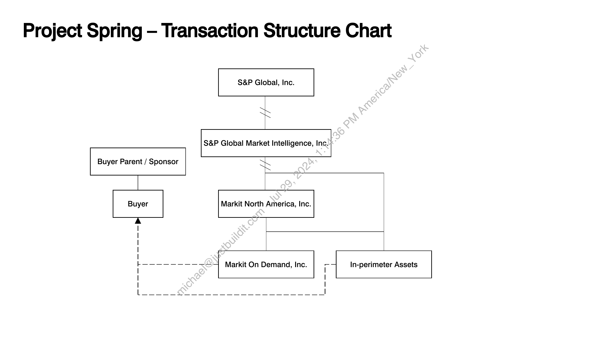

##### Project Spring — Transaction Structure Chart]

  
````col
```col-md
flexGrow=.5
===
> [!info] [Page 1](_attachments/images_ProjectSpringTransactionStructureChart.pdf_154346/page_1.png)
> 
```  
```col-md
Project Spring — Transaction Structure Chart  
S&P Global, Inc.  
S&P Global Market Intelligence, Inc.  
Buyer Parent / Sponsor  
Markit North Arnerica, Inc.  
Markit On Demand, Inc.  
|
|
|
|
|
kL
|
|
|
L  
- In-perimeter Assets
I
I
|  
```
````
Notes:  


![[_attachments/2.1.2 Project Spring – Transaction Structure Chart.pdf]