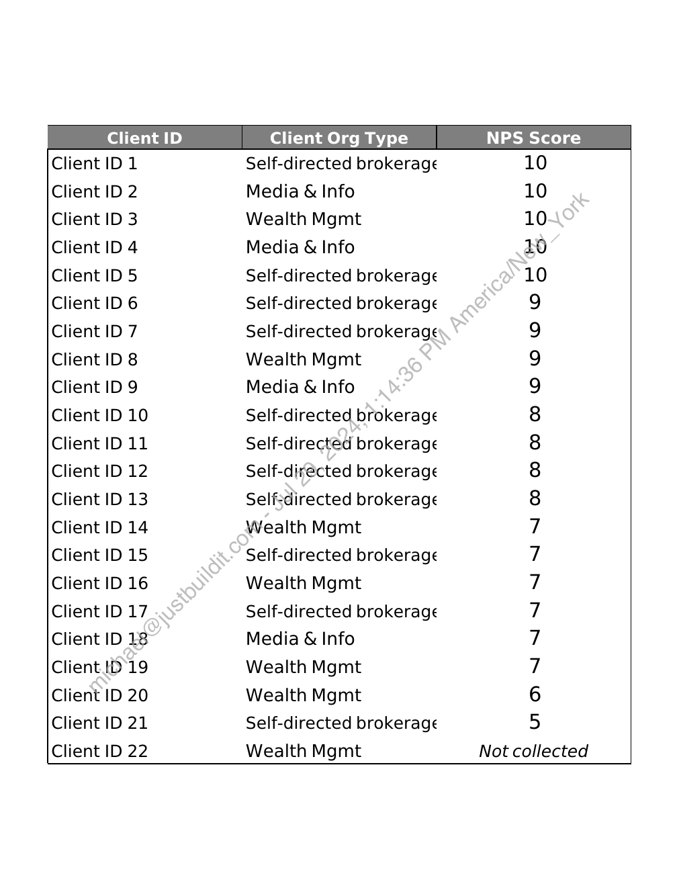

##### Client NPS Score Data]

  
````col
```col-md
flexGrow=.5
===
> [!info] [Page 1](_attachments/images_ProjectSpringNPSScoreData.pdf_154348/page_1.png)
> 
```  
```col-md
qQqQaqaqaqaqgqoaqaqaaqoaqoaqoqnaqaqqqaqaqgqaagaaagqaaqaaqaa  
Client ID  
ient |
ient |
ient |
ient |
ient |
ient |
ient |
ient |
ient |
ient |
ient |
ient |
ient |
ient |
ient |
ient |
ient |
ient |
ientl
ient |
ient |
ient |  
D1
D2
D3
D4
D5
D6
D7
D8
DQ
D10
Dil
D12
D13
D14
D15
D16
D17
D18
D19
D 20
D21
D 22  
Client Org Type NPS Score
Self-directed brokerage 10
Media & Info 10
Wealth Mgmt 10.
Media & Info 10
Self-directed brokerage 10
Self-directed brokerage
Self-directed brokerage
Wealth Mgmt
Media & Info
Self-directed brokerage
Self-directed brokerage
Self-directed brokerage
Self-directed brokerage
Wealth Mgmt
Self-directed brokerage
Wealth Mgmt
Self-directed brokerage
Media & Info
Wealth Mgmt
Wealth Mgmt
Self-directed brokerage
Wealth Mgmt  
AnNNINNAYNNWNWODWDWDWDNONUONVMO WO  
ul  
Not collected  
```
````
Notes:  


![[_attachments/2.1.3 Project Spring NPS Score Data.pdf]