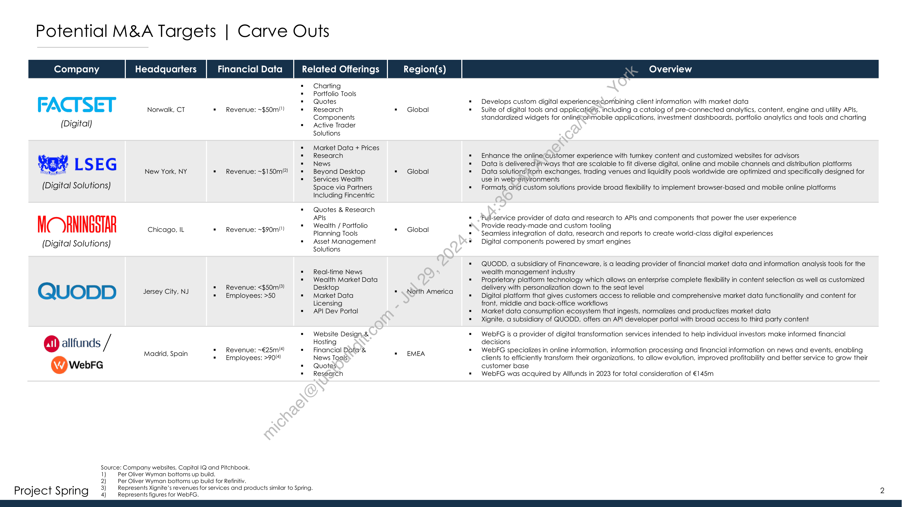
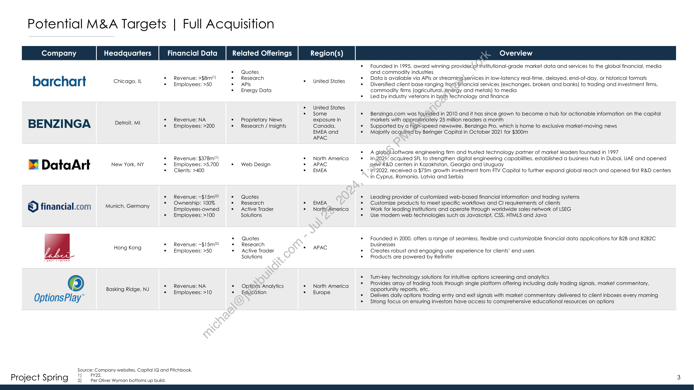
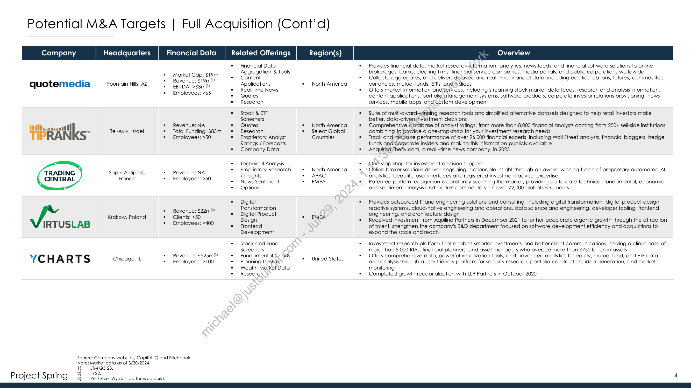

##### Project Spring: Potential M&A Targets]

  
````col
```col-md
flexGrow=.5
===
> [!info] [Page 1](_attachments/images_ProjectSpringMATargetsMarch2024.pdf_154341/page_1.png)
> 
```  
```col-md
Project Spring  
POTENTIAL M&A TARGETS rt >a  
Winter 2024 / Confidential J effe if es  
```
````
Notes:    
````col
```col-md
flexGrow=.5
===
> [!info] [Page 2](_attachments/images_ProjectSpringMATargetsMarch2024.pdf_154341/page_2.png)
> 
```  
```col-md
Potential M&A Targets | Carve Outs  
= Charting
* Portfolio Tools
FACTSET = Quotes * Develops custom digital experiences;combining client information with market data
° Norwalk, CT = Revenue: ~$50m\") = Research * Global * — Suite of digital tools and applications, including a catalog of pre-connected analytics, content, engine and utility APIs,
ok Components standardized widgets for onliné:emmobile applications, investment dashboards, portfolio analytics and tools and charting
(Digital) "Active Trader
Solutions
= Market Data + Prices
= Research = Enhance the onlinercustomer experience with turnkey content and customized websites for advisors
Didi L S E G = News = Data is delivered ir-ways that are scalable to fit diverse digital, online and mobile channels and distribution platforms
New York, NY = Revenue: ~$150m!?! = Beyond Desktop = Global = Data solutions from exchanges, trading venues and liquidity pools worldwide are optimized and specifically designed for
oo . = Services Wealth use in web-environments
(Digital Solutions) Space via Partners = Formats atid custom solutions provide broad flexibility to implement browser-based and mobile online platforms  
Including Fincentric  
= Quotes & Research  
APIs
Mc YANINGSTAR Chicago, IL + Revenue: ~$90mt) ~*~ Wealth / Portfolio * Global  
Planning Tools  
Pull-service provider of data and research to APIs and components that power the user experience
Provide ready-made and custom tooling
Seamless integration of data, research and reports to create world-class digital experiences  
(Digital Solutions) = Asset Management Digital components powered by smart engines
Solutions
= QUODD, a subsidiary of Financeware, is a leading provider of financial market data and information analysis tools for the
= Real-time News wealth management industry
= Wealth Market Data = Proprietary platform technology which allows an enterprise complete flexibility in content selection as well as customized
QUODD Jersey City, NJ = Revenue: <$50m) Desktop + Neith America delivery with personalization down to the seat level= Employees: >50 = Market Data = Digital platform that gives customers access to reliable and comprehensive market data functionality and content for
Licensing front, middle and back-office workflows
= API Dev Portal = Market data consumption ecosystem that ingests, normalizes and productizes market data
= Xignite, a subsidiary of QUODD, offers an AP! developer portal with broad access to third party content
= Website Design.& = WebFG is a provider of digital transformation services intended to help individual investors make informed financial
fi!) allfunds / Hosting decisions
Madri . = Revenue: ~€25m\4) = Financial Date & = WebFG specializes in online information, information processing and financial information on news and events, enabling
adrid, Spain . = EMEA ra ae . . ear . .
= Employees: >90!4) News Tools) clients to efficiently transform their organizations, to allow evolution, improved profitability and better service to grow their
@webrc = Quotes customer base
= Research = WebFG was acquired by Allfunds in 2023 for total consideration of €145m  
Source: Company websites, Capital IQ and Pitchbook.
1) Per Oliver Wyman bottoms up build.
2) Per Oliver Wyman bottoms up build for Refinitiv.
H H 3) Represents Xignite’s revenues for services and products similar to Spring.
Project Spring 4) Represents igures tor Web EG.  
```
````
Notes:    
````col
```col-md
flexGrow=.5
===
> [!info] [Page 3](_attachments/images_ProjectSpringMATargetsMarch2024.pdf_154341/page_3.png)
> 
```  
```col-md
Potential M&A Targets | Full Acquisition  
barcha rt Chicago, IL
BENZINGA Detroit, MI
B Da taArt New York, NY  
 financial.com —_mwrich Germany  
Hong Kong  
(6) Basking Ridge, NJ  
OptionsPlay”  
Revenue: >$8m!")
Employees: >50  
Revenue: NA
Employees: >200  
Revenue: $378m"")
Employees: >5,700
Clients: >400  
Revenue: ~$15m/2)
Ownership: 100%
Employees-owned
Employees: >100  
Revenue: ~$15m/2)
Employees: >50  
Revenue: NA
Employees: >10.  
Source: Company websites, Capital IQ and Pitchbook.  
FY22.  
Project Spring 3} perSiverwyman bottoms up build.  
Quotes
Research
APIs  
Energy Data  
Proprietary News
Research / Insights  
Web Design  
Quotes
Research
Active Trader
Solutions  
Quotes
Research
Active Trader
Solutions  
Options Analytics
Education  
United States  
United States
Some
exposure in
Canada,
EMEA and
APAC  
North America
APAC
EMEA  
EMEA  
North'America  
APAC  
North America
Europe  
Founded in 1995, award winning provider of institutional-grade market data and services to the global financial, media
and commodity industries  
Data is available via APIs or streaming services in low-latency real-time, delayed, end-of-day, or historical formats
Diversified client base ranging frenvfinancial services (exchanges, brokers and banks) to trading and investment firms,
commodity firms (agricultural,@nergy and metals) to media  
Led by industry veterans in both technology and finance  
Benzinga.com was founded in 2010 and it has since grown to become a hub for actionable information on the capital
markets with approximately 25 million readers a month  
Supported by a high-speed newswire, Benzinga Pro, which is home to exclusive market-moving news  
Mdjority acquited’by Beringer Capital in October 2021 for $300m.  
A global software engineering firm and trusted technology partner of market leaders founded in 1997  
In\202%, acquired SFL to strengthen digital engineering capabilities, established a business hub in Dubai, UAE and opened
new R&D centers in Kazakhstan, Georgia and Uruguay  
In’2022, received a $75m growth investment from FTV Capital to further expand global reach and opened first R&D centers
in Cyprus, Romania, Latvia and Serbia  
Leading provider of customized web-based financial information and trading systems
Customize products to meet specific workflows and Cl requirements of clients  
Work for leading institutions and operate through worldwide sales network of LSEG
Use modern web technologies such as Javascript, CSS, HTML5 and Java  
Founded in 2000, offers a range of seamless, flexible and customizable financial data applications for B2B and B2B2C
businesses  
Creates robust and engaging user experience for clients’ end users  
Products are powered by Refinitiv  
Turn-key technology solutions for intuitive options screening and analytics  
Provides array of trading tools through single platform offering including daily trading signals, market commentary,
opportunity reports, etc.  
Delivers daily options trading entry and exit signals with market commentary delivered to client inboxes every morning
Strong focus on ensuring investors have access to comprehensive educational resources on options  
```
````
Notes:    
````col
```col-md
flexGrow=.5
===
> [!info] [Page 4](_attachments/images_ProjectSpringMATargetsMarch2024.pdf_154341/page_4.png)
> 
```  
```col-md
Potential M&A Targets | Full Acquisition (Cont'd)  
Financial Data Provides financial data, market research.information, analytics, news feeds, and financial software solutions to online
* Market Cap: $19m Aggregation & Tools brokerages, banks, clearing firms, financial service companies, media portals, and public corporations worldwide 7= Revenue: $19m!") = Content = Collects, aggregates, and delivers delayed and real-time financial data, including equities, options, futures, commodities,
quotemedia Fountain Hills, AZ * EBITDA: >$3m"!) Applications * North America currencies, mutual funds, ETFs, andindicesEmployees: 365 = Real-time News "= Offers market information andServices, including streaming stock market data feeds, research and analysis information,= Quotes content applications, portfolio management systems, software products, corporate investor relations provisioning, news
= Research services, mobile apps, anc’custom development
= Stock & ETF = Suite of multicaward-winning research tools and simplified alternative datasets designed to help retail investors make
Screeners better, data-driveniinvestment decisions
hth atl = Revenue: NA = Quotes = North America = Comprehensive database of analyst ratings, from more than 8,000 financial analysts coming from 250+ sell-side institutions
ay ™ Tel-Aviv, Israel = Total Funding: $83m = Research = Select Global combining to Provide a one-stop-shop for your investment research needs
TIPRA S = Employees: >50 = Proprietary Analyst Countries = Track andmeasure performance of over 96,000 financial experts, including Wall Street analysts, financial bloggers, hedge
Ratings / Forecasts funds and ‘Corporate insiders and making this information publicly available
= Company Data = Acquired)Thefly.com, a real-time news company, in 2023
= Technical Analysis = One stop shop for investment decision supporta . . = Proprietary Research = North America * © Online broker solutions deliver engaging, actionable insight through an award-winning fusion of proprietary automated Al
TRADING Sophi Antipols. . Fovloyess 250 / Insights = APAC analytics, beautiful user interfaces and registered investment adviser expertise= News Sentiment = EMEA "Patented pattern recognition is constantly scanning the market, providing up-to-date technical, fundamental, economic
= Options and sentiment analysis and market commentary on over 72,000 global instruments
= Digital = Provides outsourced IT and engineering solutions and consulting, including digital transformation, digital product design,
Transformation reactive systems, cloud-native engineering and operations, data science and engineering, developer tooling, frontend  
= Revenue: $22m(2)  
= Digital Product engineering, and architecture design  
Keelaowt, Pelletne| : cients: 750 >400 Design OMIA. = Received investment from Aquiline Partners in December 2021 to further accelerate organic growth through the attraction
IRTUSLAB OSES = Frontend of talent, strengthen the company's R&D department focused on software development efficiency and acquisitions to
Development expand the scale and reach
= Stock and Fund = Investment research platform that enables smarter investments and better client communications, serving a client base of
Screeners more than 5,000 RIAs, financial planners, and asset managers who oversee more than $750 billion in assets
bY . = Revenue: ~$25m!) = Fundamental,.Gharis . 5 "Offers comprehensive data, powerful visualization tools, and advanced analytics for equity, mutual fund, and ETF data
(C H A R T Ss Chicago, IL = Employees: >100 = Planning Desktep United States and analysis through a user-friendly platform for security research, portfolio construction, idea generation, and market
= Wealth Market Data monitoring
= Research = Completed growth recapitalization with LLR Partners in October 2020
Source: Company websites, Capital |Q and Pitchbook.
Note: Market data as of 3/20/2024.
1) LIM Q3'23.
i A 2) FY22.
Project SPrING 3) _Ferciver wyman bottoms up bul. 4  
```
````
Notes:  


![[_attachments/2.1.4 Project Spring M&A Targets (March 2024).pdf]