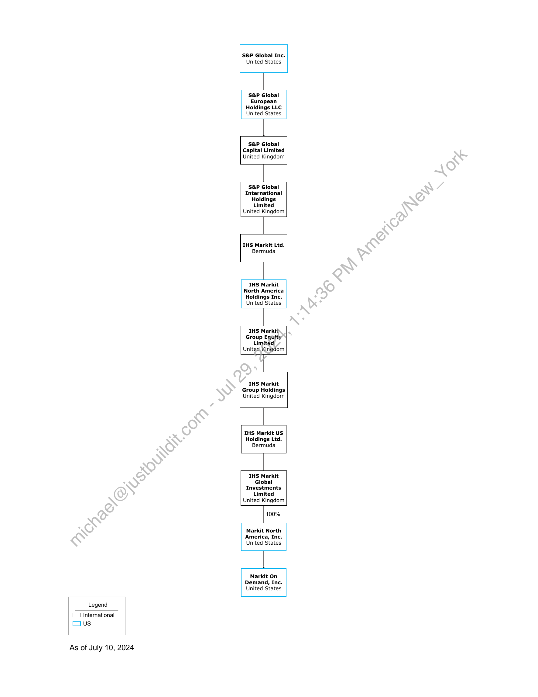

##### Legend: S&P Global and IHS Markit Entities]

  
````col
```col-md
flexGrow=.5
===
> [!info] [Page 1](_attachments/images_RelatedEntities.pdf_154304/page_1.png)
> 
```  
```col-md
Legend  
International
Cius  
As of July 10, 2024  
S&P Global Inc.
United States  
S&P Global
European
Holdings LLC
United States  
S&P Global
Capital Limited
United Kingdom  
S&P Global
International
Hol
Limi
United Kingdom  
IHS Markit Ltd.
Bermuda  
IHS Markit
North America
Holdings Inc.
United States  
IHS Markit
Group Equity
Limited
United, Kingdom  
IHS Markit
Group Holdings
United Kingdom  
IHS Markit US
Holdings Ltd.
Bermuda  
IHS Markit
Global
Investments
Limited
United Kingdom  
100%  
Markit North
America, Inc.
United States  
Markit On
Demand, Inc.
United States  
```
````
Notes:  


![[_attachments/2.1.6 Related Entities.pdf]