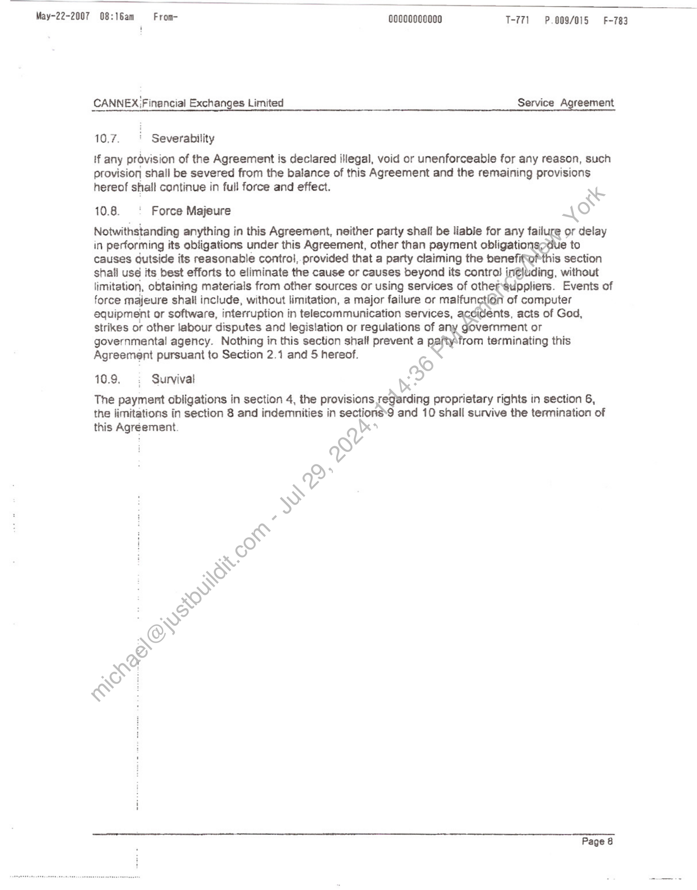

##### CANNEX Financial Exchanges Limited Service Agreement]

  
````col
```col-md
flexGrow=.5
===
> [!info] [Page 1](_attachments/images_3.6.4.1.1.1Cannex_MODCannexServiceAgreementExecuted20070518.pdf_155331/page_1.png)
> 
```  
```col-md
May- 2007 08:14am = From- odooconno00 1-771 P.002 F-783  
CANNEX'Financla Exchanges Limited Service Agreement
| SERVICE AGREEMENT  
THIS AGREEMENT is made as of
The 18" day of May, 2007 Lad |  
(the “Effective Date”) 4
by and between:
ee
CANNEX FINANCIAL EXCHANGES tIMITED
(hereinafter referred to as “Lice 5)  
R
wo  
Wall Street off Demand
(hereinafter referred to as the “Licensee”)
i bal  
IN CONSIDERATION of the mutual coppice set forth herein and for other good and valuable
consideration, the receipt and sufficiency of which are hereby acknowledged, the parties hereto  
covenant and agree as follows: );
y>  
Ss  
11. | Grant of icérse
Subject to the tetis and conditions of this Agreement, Licensor grants to Licensee a non-  
License  
exclusive, n nsferable license (the “License") for the term of this Agreement and any
renewals, tease the information identified in Schedule A hereto (the “Information") by means of
Licenseé&s Service identified in Schedule A. The rights granted by the License are limited to:  
a) displaying and distributing via the Service machine-readable copies of the
RNG \ Information by means of computer equipment;  
& (b) reproducing the Information in visually perceptible, machine-readable or printed
: copies in connection with such display and distribution;  
(c) authorising others to receive, store, retrieve and copy selected portions of the
: Information solely for their own use; and  
(d) authorising Licensee's customers, with whom Licensee has entered into a license
for the delivery and display of Licensee's content, including co-branded or private
labelled services, to receive, store, retrieve, copy and distribute selected portions
of the Information to such customers’ users.  
```
````
Notes:    
````col
```col-md
flexGrow=.5
===
> [!info] [Page 2](_attachments/images_3.6.4.1.1.1Cannex_MODCannexServiceAgreementExecuted20070518.pdf_155331/page_2.png)
> 
```  
```col-md
May-22-2007 08:14am = From- oo000000000 T-771 P0003 F-783  
CANNEX Financial Exchanges Limited Service Agreement  
4.2 _ Restrictions on Use  
(a) Use of the Information in any other manner or through any other means of
distribution, shall require prior written consent of Licensor.  
(b) Except as expressly permitted by this Agreement, Licensee shall not resell,distribute or retransmit any Information to any other person by any means
whatsoever without the prior written consent of Licensor.  
(c) Licensee may not alter data included in the Information, ex t6 correct errors in
: the data of which Licensor has been advised. Licensee ; promptly advise  
Licensor of any errors in the Information of which it bec S aware.
: WS
2: Delivery of Information &  
Ziv: Delivery is  
Licensof will deliver the Information to Licensee in the ‘gnner, format and frequency specified
in Schedule A. Licensor may change the manner, f it or frequency of delivery of the
Information upon ninety (90) days written notice tg bicensee.  
If the Information is delayed or unavailable for Any reason, Licensor will use all reasonable  
efforts to remedy the delay as quickly as possible. Licensor shail not be liable to Licensee or to
any of its clients for any delay or failure liver the information, regardless of cause.  
3. Licensee Obligations a .
N  
321 , Managing the information  
Licensee agrees to include : Information in the Service. Licensee is responsible for
receiving, storing, managidg and distributing the Information. Licensee may not combine the
Information with bagi owned or provided by anyone else except Licensee’s in such a way
that the ‘ownership KS e€ Information is not clearly identified.  
oe. ft RelatedServices  
facilities
Sched
aa Copyright Notices  
In using and authorizing others to use the Information, Licensee shall cause each screen
display and each copy transferred to an end user to bear Licensor’s proprietary and copyright
notice, or otherwise identify Licensor as the source of the Information, as set out in Schedule A,  
e Licensee’s site required to receive the Information delivered in accordance withLicensee is responsible for installation, support and maintenance of the Service.  
3.4. Unauthorized Use  
Licensee will promptly notify Licensor if it becomes aware of any unauthorized use of the
Information and assist Licensor in taking such reasonable steps as Licensor considers
necessary to prevent further unauthorized use  
Page 2  
```
````
Notes:    
````col
```col-md
flexGrow=.5
===
> [!info] [Page 3](_attachments/images_3.6.4.1.1.1Cannex_MODCannexServiceAgreementExecuted20070518.pdf_155331/page_3.png)
> 
```  
```col-md
May-22-2007 08:14am = From- ooooos0000 T-771—-P.004 F-783  
CANNEX Financial Exchanges Limited Service Agreement
35. _ Restrictions on Reproducing Information  
License@’s ctients who access the Information through the Service shall be permitted to copy
portions of the Information for their own personal use only, provided that they do not modify the
Information and provided that Licensor is identified as the source of the information on all
copies and all copies contain Licensor’s copyright notice. Licensee shall not_authorize or permit
any recipient of the Information to reproduce or retransmit the Information in ahy other manner
or for any other purpose.  
4 Charges
41. ° Fees  
Licensee shall pay Licensor license fees for the rights grantedunder this Agreement, as set out
in Schedule A.  
4.2. ‘ Late Payment  
if Licensee fails to pay any fees when due, in addititn to all other rights and remedies available
to Licensor, Licensor shall have the right to (i) suspend Licensee's delivery of the Information
to Licensee after giving five (5) days written notice to Licensee; and (ii) charge as a late
payment charge, interest on all outstanding/amounts at a rate of fifteen percent (15%) per
annum, calculated monthly, until all outstanding amounts are paid in full.  
4.3 Taxes  
In addition to the fees provided for herein, Licensee shall pay all applicable federal, and
provincial sales, use or value added taxes or other government fees or levies payable with
respect {fo the services provided from time to time during the term of this Agreement, other than
taxes based on Licensor’s net income. If required by Licensee, Licensor will provide Licensee
with a monthly invoiceshowing all taxes required to be collected and remitted by Licensor. If
Licensee is exemptfrom the payment of any such tax or levy, it shall provide Licensor with alt
documents and itiformation required to apply such exemption.  
4.4. | Reporting and Records  
The Licefisee shall provide to the Licensor, on a monthly basis, a list of the Licensee’s
custortiérs using the Information pursuant to Section 1.1(d) and of the fees payable to Licensor
pursuant to Schedule A . Licensor shall have the right through its authorized representative,
which shall be reasonably agreeable to Licensee, upon at least thirty (30) days’ prior written
notice to the Licensee to inspect and copy only that portion of the records related to the
payments due hereunder, during norma! business hours not more frequently than once per
year. All information gained by Licensor or its authorized representatives from such inspection
will be kept in confidence and will be used solely for the purpose of verifying the accuracy of the
fees payable hereunder.  
i Page 3  
```
````
Notes:    
````col
```col-md
flexGrow=.5
===
> [!info] [Page 4](_attachments/images_3.6.4.1.1.1Cannex_MODCannexServiceAgreementExecuted20070518.pdf_155331/page_4.png)
> 
```  
```col-md
May-22-2007 08:14am = From- co000000000 1-771 P.005 F-783  
CANNEX Financial Exchanges Limited ; Service Agreement
5. Term and Termination
Sits Term  
The term of this Agreement shall commence on the Effective Date and shalt continue for an
initial period of two (2) years. Thereafter it shall be automatically renewed for ed one
(1) year:periods, unless either party gives the other party thirty (30) days writ otice of
termination prior to the expiry of the then-current term of the Agreement. Subject to section 2.1
either party may terminate this Agreement for whatever reason any time 2supon thirty (30) days
written notice to the other party.  
Q
5.2. +: Termination For Cause RS
Either party may terminate this Agreement forthwith upon ok Suis to the other party if the
other party:
(a) is in default of any obligation under this Agr nt and fails to remedy such default  
within thirty (30) days of receipt of notice of Such default; or  
(b) makes a voluntary or involuntary assi Ament for the benefit of its creditors, enters  
'_ into any composition or arrangementWith its creditors, has a receiver or liquidator
appointed with respect to its business or assets, commences or is the subject of any
proceedings under any bankruptcy, insolvency or other law for the protection of
creditors or relief debtors, ases to carry on business in the ordinary course.  
: O)*
§.3.  . Obligations on Termi tén  
Upon termination of this Agreément for any reason, (a) Licensee shall pay ail outstanding
amounts owing at the date. of termination including all late payment charges; and (b) Licensor
will refund all unearn: epaid fees without deduction, plus applicable taxes to the Licensee.  
w  
6. Conta  
61. -ulbensee Obiigations  
Licensee shail hold in confidence and shall not, without the prior written consent of Licensor,
disclose to any person or entity, except in accordance with the terms of this Agreement,
jocuments, data and infarmation, whether in electronic or printed form, relating to Licensor’s
usiness, including without limitation the Information and the terms of this Agreement.  
Licensee shall use reasonable care, consistent with the measures taken to safeguard its own
confidential and proprietary information, to ensure that its directors, officers, employees,
agents, representatives and customers are required to keep all such information confidential.
Licensoy agrees that the foregoing restriction shall not apply to information which is made
available to the public by Licensor, or is otherwise known to Licensee apart from its disclosure
by Licensor pursuant to this Agreement.  
Page 4  
```
````
Notes:    
````col
```col-md
flexGrow=.5
===
> [!info] [Page 5](_attachments/images_3.6.4.1.1.1Cannex_MODCannexServiceAgreementExecuted20070518.pdf_155331/page_5.png)
> 
```  
```col-md
May-22-2007 08:15am = From- oooocoo0esa T-771 = P.006/015 F783  
i  
CANNEX' Financial Exchanges Limited Service Agreement
i
6.2. | Licensor Obligations  
Licensor shall hold in confidence and shall not, without the prior written consent of Licensee,
use or disclose to any person or entity, except in accordance with the terms of this Agreement,
all documents, data and information, whether in electronic or printed form, relating to the
Licensee's business. Licensor shall use reasonable care, consistent with the measures taken
to safeguard its own confidential and proprietary information, to ensure that its ctors,
officers, employees, agents, representatives, and customers are required to keep atl such
information confidential. Licensee agrees that the foregoing restriction shal\not apply to
information which is made available to the public by Licensee, or is othenwise known to Licensor
apart from its disclosure by Licensee pursuant to this Agreement. ON  
6.3. | Intellectual Property BS  
Licenseé acknowledges that Licensor shall retain all right, tle interest in the Information,
that the Information is protected by capyright and/or is a eet secret of Licensor. Licensee
acknowledges that it does not, by virtue of receiving thedn rmation, acquire any proprietary
rights therein, other than the limited rights granted ha@in.  
ING  
LG Warranties “  
4
7.1. Rights to Information sv  
Licensor.warrants that it owns or h the right to distribute the Information in accordance with
this Agraement and that it has theathority to enter into this Agreement and to grant to
Licensee the rights granted heey  
7.2. Exclusions  
¢
Licensar'does not warraithe accuracy, availability or timeliness of any Information. Except as
expressly stated in this Agreement, Licensor disclaims all warranties and conditions, whether
express or impliet arising under statute or operation of law, with respect to the products or
services to be ded or supplied under this Agreement, inciuding without limitation all
warranties or conditions of merchantable quality, fitness for a particular purpose or those arising
from a cq of dealing or usage of trade.  
2
8.05 Limitation of Liability
als . Delay or Interruption  
!  
Licensor shall not be liable to Licensee or any other person for any delay or failure in
performance or interruption in access to the Information due to causes outside its reasonable
control. Licensor's sole obligation and Licensee's sole remedy will be Licensor's exercise of
reasonable efforts to correct any malfunction and to deliver the Information in a timely manner.  
Page 5  
```
````
Notes:    
````col
```col-md
flexGrow=.5
===
> [!info] [Page 6](_attachments/images_3.6.4.1.1.1Cannex_MODCannexServiceAgreementExecuted20070518.pdf_155331/page_6.png)
> 
```  
```col-md
May-22-2007 08:15am = From- oo00c000000 T-771 P.007/015  F-783  
CANNEX ‘Financial Exchanges Limited Service Agreement  
8.2. ‘ Limitation of Damages  
Licensor shall not be liable to Licensee or any other person for any direct, indirect,
consequential or punitive damages resulting from the provision or failure to provide any
products or services or Information hereunder, including without limitation the loss of revenues,
income, profits, software, data or goodwill, even if Licensor has been advised of the possibility
or likelthood of such loss. This limitation shall apply regardless of whether any action is brought
in contract or in tort, including any claim of fundamental breach and shall SRO je expiry,
termination, avoidance or repudiation of this Agreement.  
8.3. ; Lost Software or Data 2)  
Licensed assumes sole responsibllity for the security and integrity of its software and data and
shall be responsible for restoring any Licensee software or data fil ich are jost or destroyed
due to any cause, including without limitation the wilfui or negli acts of Licensor or its
employees or agents. Licensor's sole responsibility shall be ovide Licensee with a current
copy of the Information in accordance with this Agreement,  
Q
a
9.1. | Defence of Claims nbx’
Licensor will defend or settle any claim or actién brought against the Licensee alleging that (i)
the Information; or (ii) Licensee's use thereof in accordance with the terms of this Agreement,
infringes: any Canadian patent, copyrig trade-mark. Licensor will pay all costs and
damages finally awarded in any such élaim or action provided that Licensee immediately
notifies Licensor of the threat or iL gee of any such claim or action, permits Licensor
to have sole control over the defen or settlement thereof and provides reasonable information
and assi8tance in such defen t settiement. Licensee shall have the right, at its expense, to
participate in the defense of such claim through counsel of its own choosing; provided,
however, that Licensor shait'not be required to pay any settlement amount that it has not
approved in advance. ¢)  
9.2. ‘Other Action  
If in Licehsor'sapinion, any part of the information or the use thereof is ar is likely to become
the subject ny infringement claim or action, Licensor may at its sole option and expense,  
é for Licensee the right to continue using the Information, modify or replace it so it
peco on-infringing or, if neither of the foregoing remedies are reasonably available,  
digg nue the delivery of, and terminate the License with respect to, the infringing Information.  
G :
A. ‘General
10.1. | Entire Agreement  
This Agreement, including any amendments and-supplements hereto, constitutes the entire
agreement between the parties with respect to the ‘subject matter hereof. This Agreement
supersedes: all'prior or contemporaneous agreements, negotiations, representations, proposals,
discussions and understandings, oral or written, relating to the subject matter hereof. This
Agreemént may be amended, supplemented or modified only-by written instrument, signed by
each of-{he parties hereto.  
9. Infringement  
Page 6  
```
````
Notes:    
````col
```col-md
flexGrow=.5
===
> [!info] [Page 7](_attachments/images_3.6.4.1.1.1Cannex_MODCannexServiceAgreementExecuted20070518.pdf_155331/page_7.png)
> 
```  
```col-md
May-22-2007 08:16am = From- oo000000000 T-771 = P.008/015 F-783  
CANNEX Financial Exchanges Limited Service Agreement
10.2. Governing Law  
This Agreement shall be governed by and interpreted in accordance with the laws of the
Province: of Ontario and the laws of Canada applicable therein. Each of the parties consents to
the jurisdiction of the courts of Ontario to hear any action brought with respect to this
Agreement.  
10.3. ; Notices ew  
All notices required or permitted to be given under this Agreement shall be in whiting and either
delivered personally or by pre-paid courier or transmitted by facsimile or hea similar means of  
confirmed electronic communication, w
to Licengar at: CANNEX Financial Exchanges Limited ce
: 1200 Bay Street, Suite 1001 BS
: Toronto, Ontario MSR 2A5
Attention: Alex Melvin, President Fax No; 498 926 0706  
ok
and to Licensee at: Wall Street on Demand yw
8718 Central Avenue.  
Boulder, CO 4
Wz
USA 80301 >
Attention: McKnight Fax No: 303 444 2586  
or to such ather address and fac imile number as each party may notify to other from time to
time. All notices shall be effective-when actually received.  
10.4. Relationship of ies  
The relationship of th ies shall be that of independent contractors. Nothing in this
Agreement shall bei reted to create any partnership, joint venture, or similar relationship,
or subject the pa © any implied duties or obligations respecting the conduct of their affairs
which are not e ssly stated herein.  
10.5. , Lessor and Assigns
This Ager shail be binding upon and enure to the benefit of each of the parties hereto and
p  
their. ective successors and permitted assigns. This Agreement may not be assigned by
either party, except with the prior written consent of the other party, such consent not to be
unreasonably withheld or unduly delayed.  
10.6. : Waiver  
The failure of either party at any time to require performance of any provision shall not affect
the right to require performance at any other time, nor shall the waiver by either party of a
breach of any provision be a waiver of any succeeding breach or a waiver of the provision itself.  
j Page 7  
```
````
Notes:    
````col
```col-md
flexGrow=.5
===
> [!info] [Page 8](_attachments/images_3.6.4.1.1.1Cannex_MODCannexServiceAgreementExecuted20070518.pdf_155331/page_8.png)
> 
```  
```col-md
May-22-2007 08:16am = From- oo000000000 T-771 =P.009/015 F-783  
CANNEX Financial Exchanges Limited Service Agreement  
10.7. | Severability  
if any prévision of the Agreement is declared illegal, void or unenforceable for any reason, such
provision shall be severed from the balance of this Agreement and the remaining provisions
hereof shall continue in full force and effect.  
AS  
10.8. ‘ Force Majeure \O  
Notwithstanding anything in this Agreement, neither party shall be liable for any failure or delay
in performing its obligations under this Agreement, other than payment obligatio' scoue to
causes gutside ifs reasonable control,.provided that a party claiming the benefi is section
shail use its best efforts to eliminate the cause or causes beyond its control i
limitation, obtaining materials from other sources or using services of other
force majeure shall include, without limitation, a major failure or malfun of computer
equipment or software, interruption in telecommunication services, apSnts acts of God,
strikes or other labour disputes and legislation or regulations of sy devermert or  
governmental agency. Nothing in this section shall prevent a p: om terminating this
Agreement pursuant to Section 2.1 and 5 hereof.  
©
10.9, : Survival 9  
The payment obligations in section 4, the provisions regarding proprietary rights in section 6,
the limitations in section 8 and indemnities in sections’9 and 10 shall survive the termination of  
this Agréement. & ss)
| sy  
vu
Q  
>
s
\
XO
oy
@s
Or
3
eS  
Page 8  
```
````
Notes:    
````col
```col-md
flexGrow=.5
===
> [!info] [Page 9](_attachments/images_3.6.4.1.1.1Cannex_MODCannexServiceAgreementExecuted20070518.pdf_155331/page_9.png)
> 
```  
```col-md
May-22-2007 08:16am = From- ooocooogo00 T-771 P.010/015 ~—-F-783  
CANNEX Financial Exchanges Limited Service Agreement  
IN WITNESS WHEREOF the parties hereto have executed this Agreement by their duly
authorized representatives as of the Effective date.  
CANNEX FinanciatExchanges Limited  
By: &
President mV)
RW
@
=oe
: 3
Wall Street on Demand &
RP
By:
Name / Title:
: @S
&
AN
<  
Page 9  
```
````
Notes:    
````col
```col-md
flexGrow=.5
===
> [!info] [Page 10](_attachments/images_3.6.4.1.1.1Cannex_MODCannexServiceAgreementExecuted20070518.pdf_155331/page_10.png)
> 
```  
```col-md
May-22-2007 08:16am = From- ogoa0000000 T-771 P.O11/015 —-F-783  
CANNEX. Financial Exchanges Limited Service Agreement  
SCHEDULE “A”  
a Licensed Information
Financial Rate Information
Rublicly available interest rate information will be provided for the foliowing\Canadian
financial products or services: \
* Mortgages 3s “
“ Guaranteed Investment Certificates AS
* Term Deposits &
“ Accumulation Annuities <
2 Registered Retirement Savings Plans gee Rate)
- Payout Annuities ©
“ Registered Retirement Income Foi (Fixed Rate)
- Savings and Chequing Accounts
- Prime Lending Rates °
7 Loan Rates oe
- Credit Card Rates) °
>  
Canadian Investment Funds Prices Information
Daily pricing for t iverse of Canadian investment funds gathered by Licensor.  
Where prices felivered to Licensor by mutual fund companies on less than a daily
basis, Licensee il continue to provide the most recent price until a new price is
delivered bythe mutual fund company.  
i ~\
Performance ieuation Values for Canadian Investment Funds  
clusive, 1 to 20 calendar years (At December 31) inclusive, year to date, month to
& date, week to date, change from previous price and fund inception date to date.
Absolute rate of return rankings and quartile rate of return rankings within the applicable
Investment Funds Standards Committee (IFSC) categories.  
Ee of return calculations, if applicable, for 1 to 11 months inclusive, 1 to 20 years  
Historical Canadian Investment Fund Prices  
Historical month end prices and distributions for the universe of Canadian investment
funds gathered by Licensor.  
i Page 10  
```
````
Notes:    
````col
```col-md
flexGrow=.5
===
> [!info] [Page 11](_attachments/images_3.6.4.1.1.1Cannex_MODCannexServiceAgreementExecuted20070518.pdf_155331/page_11.png)
> 
```  
```col-md
May-22-2007 08:16am = From- oooocooeoa T-771-P.012/015 = F-783  
CANNEX'Financial Exchanges Limited Service Agreement  
x Licensee’s Service  
Licensee may receive, display and otherwise use the Information on co-branded or private
Jabelled services where Licensee provides content and tools, including the Information, to its
customefs pursuant to Section 1.1 (d) and identified by the Licensee pursuant to Section 4.4.  
3. Delivery Y
The Information will be available for pick up by Licensee at a minimum frequency, ina
mutually:agreed upon format, from the Licensor's ftp site (ftp.cannex,cem), web site  
(www. cannex. com) or such other site as is mutually acceptable to KG arties, at the times
mutually: ‘agreed to by the parties. If the Information is not available*at the times set forth for
any reason, Licensor will take reasonable steps to correct the situation and make the
information available according ta Licensee's reasonable r. eee therefore.  
4. Fees and Payment Terms re)  
_ License
Licensed Information
: Fee
Financial Rate Infoanation 6 izati i $125USD/
: month /
1 customer
F Ganadian Investment Funds Prices By dealer organizations for use by their representatives when $128USD/
! Information _ >| advising their clients only month / |
2 iH customer i
“Performance Calculation ae "By dealer organizations for use by their representatives when “1 "$12508D7 |
Canadian Investment Fund: advising their clients only manth /
customer  
Financial Rate inf By publicly available web sites for use by their subscribers for their $250USD 7  
own persanai use only month f H
XO customer
eta —— —— a eae
Canadian nt Funds Prices By publicly available web sites for use by their subscribers for their $250USD/
Informa Own personal use only month / f
@' customer =|
iw: rye? ns na nnn en ee a
Pi ance Calculation Vaiues for By publicly available web sites for use by their subscribers for their $250USD/ jj
| dian Investment Funds | own personal use only month/ — |
2 i customer |
“Risforical Canadian Investment Fund By dealer organizations for use by their representatives when Ss000USE |
Pnoas } advising theif clients only or by publicly available web sites for use once / |
Hi ! by their subscribers for their own personat use only customer = j
Bete pec a a a er |  
All licence fees are subject to applicable taxes. Licence fees are for the first two (2) years of
this Agreement and thereaiter, will be as mutually agreed between the parties in writing. The
monthly license fees shall be payable, in advance, on the first day of each month during the
term of this Agreement.  
Page 11  
```
````
Notes:    
````col
```col-md
flexGrow=.5
===
> [!info] [Page 12](_attachments/images_3.6.4.1.1.1Cannex_MODCannexServiceAgreementExecuted20070518.pdf_155331/page_12.png)
> 
```  
```col-md
May-22-2007 08:17am = From- ooooooccoas T-771 P.013/015  F-783  
i  
i
CANNEX: Financial Exchanges Limited Service Agreement  
i
i  
5. Copyright Notice:  
[Copyright notice:} AS
i [e)
© Copyright [YEAR] CANNEX Financial Exchanges Limited.
[proprietary notice:} EY 7  
All rights reserved. Authorized users may copy partion this information
without alteration for their own personal or internal use‘only. CANNEX Financial
Exchanges Limited must be identified as the so’ of the data on all copies.  
Si
»
a
Ne
EN
| sv
i O)>
Vv
y>
SX
Se
Ss
i
| ow?
@S
>
eS !  
Page 12  
```
````
Notes:  


![[_attachments/3.6.4.1.1.1 Cannex_MOD Cannex Service Agreement Executed 20070518.pdf]