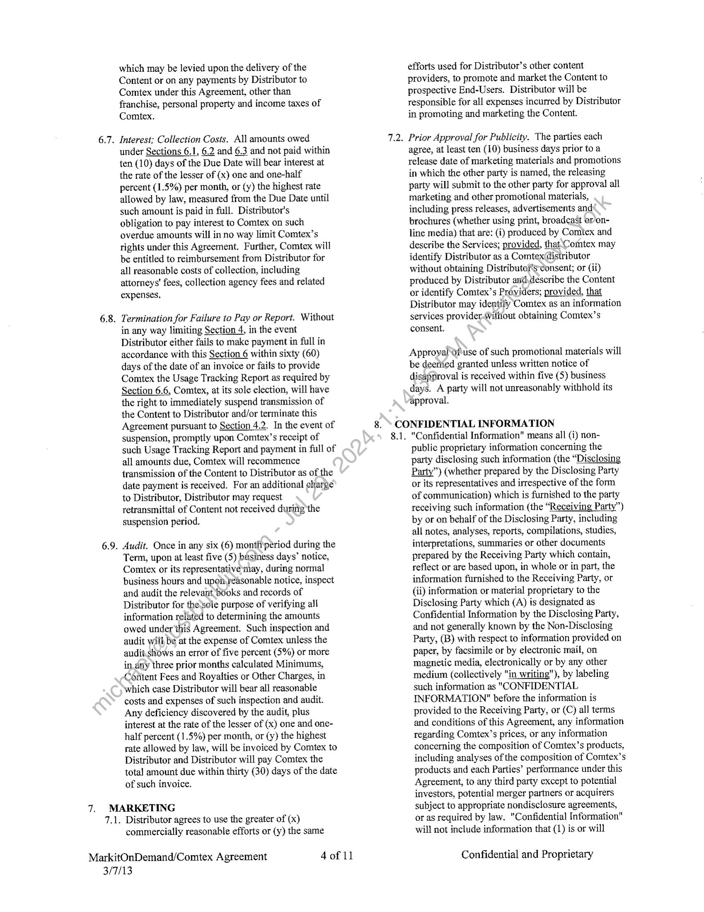

##### Content License Agreement]

  
````col
```col-md
flexGrow=.5
===
> [!info] [Page 1](_attachments/images_3.6.4.1.10.1ComtexMODLicenseAgreement--20130301.pdf_155124/page_1.png)
> 
```  
```col-md
CONTENT LICENSE AGREEMENT  
This Content License Agreement (“Agreement”)
supersedes any previously signed Agreements and is
entered into by and between Comtex News Network, Inc., a
Delaware corporation with its principal office at 6462 Little
River Turnpike, Suite E, Alexandria, Virginia 22312,
(“Comtex”) and Markit On Demand, Inc., formerly known
as Wall Street On Demand, Inc., a Delaware corporation
with its principal office at 5718 Central Avenue, Boulder,
Colorado 80301 (“Distributor”).  
WITNESSETH:
WHEREAS, Comtex compiles Content in  
electronic form; and  
WHEREAS, Distributor distributes information  
through its Services; and  
WHEREAS, The parties wish to enter into an  
agreement whereby Distributor will distribute
Comtex’s Content through Distributor’s Services.  
NOW THEREFORE, in consideration of the  
mutual promises set forth herein, as well as other good
and valuable consideration, Comtex and Distributor
intending to be legally bound, hereby agree as follows:  
DEFINITIONS  
1.1. Content. “Content” means the data, publications,
materials, reports, images and information that
Comtex is authorized to and does provide to
Distributor, as set forth in Exhibit A, including
stories, articles, translations, text, graphics,
images, charts, tables, formatting elements,
artwork, photographs and all other materials
contained therein, whether or not (i) protected by
copyright or (ii) it includes information or data’
which Comtex has collected from its Providers,  
1.2. CustomWires®, “CustomWires®” means, x
selection, at Comtex’s sole discretion; of stories
from more than one Provider. Distribution and
pricing to Distributors of CustomWires will be at
the sole discretion of Comtex.  
1.3. End-User. “End-Uset® means any individual, or
entity that has accessto the Content via the
Distributor’s Services.  
1.4. Newsroom™ Products. “Newsroom™ Products”
means \4.selection, at Comtex’s sole discretion, of
the topstories from more than one Provider.
Distribution and pricing to Distributors of
Newsroom Products will be at the sole discretion
of Comtex.  
1.5. Providers. “Providers” means Comtex and those
third parties from whom Comtex acquires the right
to distribute the Content that Comtex transmits or
otherwise makes available to Distributor.  
1.6. Services. “Services” means only those electronic
information services of Distributor that are set
forth in Exhibit A.  
MarkitOnDemand/Comtex Agreement lof 11  
3/7/13  
1.7. Third Party Partners. “Third Party Partner” means
those third party affiliates of Distributor,
permissioned and approved by Comtex, with
whom Distributor has entered into an agreement
and whereby Distributor either hosts and
distributes the Content via the Services to EndUsers for the third party; or Distributor delivers
the Content to the third party’s servers and the
third party delivers the Content to the End-Users.  
EFFECTIVE DATE. The effective date of this
Agreement (the "Effective Date") will be the ‘date set
forth in Exhibit A.  
GRANT OF LICENSE  
3.1. Grant of Rights. Subject tothe terms and conditions of
this Agreement and Exhibits hereto, Comtex grants
Distributor a nonexclusive license to (i) distribute,
display and make available the Content via the Services,
only as expressly provided in Exhibit A, and (ii) license
End-Users.fo use the Content as authorized by the EndUser Agfeeinient, only as expressly provided in Exhibit
B.  
3.2. Resirictions. Distributor will not license, transmit,
distribute or otherwise make available the Content to
any person or entity (i) for use in print, television or
radio news media, or any web sites supporting such
persons or entities, unless such person or entity’s use
of the Content has been preapproved by Comtex (ii)
that hyperlinks or in any way makes use of the content
for advertising purpose, outside of the approved
manner noted in Exhibit A, or (iii) on any web site or
other means of distribution that transfers, licenses,
displays, uses or otherwise makes available any
material that is pornographic, obscene, defamatory,
harassing, grossly offensive, malicious or potentially
or actually infringes or misappropriates copyrights,
patents, trademarks or other proprietary or intellectual
property rights of any person or entity.  
3.3. Third Party Partner/End-User Agreement.
Distributor will obtain from its ‘Third Party
Partners or its Third Party Partners will obtain
from each End-User, cither in writing or via
acknowledgment of an electronic form displayed
in accordance with applicable law (which
acknowledgment can be provided by use or
redistribution of the Content), consent to the
provisions set forth in Exhibit B to this Agreement
or provisions substantially equivalent thereto.  
3.4. Acknowledgment and Reservation. Distributor
acknowledges that Comtex may aggregate
information or data from various Providers to
create the collections of Content distributed by
Comtex and that Comtex is not responsible for the
information or data collected from Providers that
is incorporated into the Content. Distributor
further acknowledges that no proprietary right,
title or interest, including copyright, in the Content  
Confidential and Proprietary  
```
````
Notes:    
````col
```col-md
flexGrow=.5
===
> [!info] [Page 2](_attachments/images_3.6.4.1.10.1ComtexMODLicenseAgreement--20130301.pdf_155124/page_2.png)
> 
```  
```col-md
MarkitOnDemand/Comtex Agreement
3/7/13  
is transferred to Distributor under this Agreement.
Comtex reserves the right to add or withdraw
Providers and items of coverage from the Content
without notice.  
TERM & TERMINATION
4.1. Term of Agreement. The Term of this Agreement  
is set forth in Exhibit A.  
4.2. Termination.  
4.2.1. Either party may terminate this Agreement
if the other party materially breaches any
term or condition of this Agreement;
provided, that (i) the non-breaching party
first will provide notice to breaching party
describing the breach and identifying the
Section of the Agreement breached, and
(ii) if the breach remains uncured for thirty
(30) days after delivery of such notice,
termination will take effect immediately.
Upon receipt of the notice identifying the
breach, the breaching party will use its
best efforts to cure the breach.  
4.2.2. Notwithstanding any other remedies
granted by this Agreement, in the event
that Distributor’s, its Third Party Partners’
or an End-User’s breach of this
Agreement has a reasonable possibility of
causing Comtex to breach its agreement
with a Provider, in addition to and not in
lieu of any other remedies permitted
hereunder, Comtex may in its sole
discretion immediately suspend delivery
of such Provider’s Content to Distributor
until such breach is remedied. Comtex
actions under this Section 4.2.2 will not
constitute a breach of this Agreement.  
4.2.3, Each party, upon giving notice to the other
party, will have the right to terminate this
Agreement and the license granted
hereunder in the event the other party (i)
terminates or suspends its business; (ii)
becomes subject'to any bankruptcy or
insolvency*proceeding under Federal or
state law iii) becomes insolvent or
subjecto direct control by a trustee,
receiver or similar authority; or (iv) has
wound up or liquidated, voluntarily or
otherwise.  
4.3: Obligations Upon Termination. The parties hereto  
acknowledge that the charges set forth below have
been determined based on the Content to be
delivered to Distributor, as well as the length of
the Term of this Agreement. Therefore, effective
immediately upon termination of the Agreement,
Distributor will not license, transfer, archive,
make available or otherwise distribute the Content
nor access, use or retransmit the Content.
Distributor will (i) within thirty (30) days of such
termination, pay to Comtex all charges then owed
by it under Section 6, (ii) for the remainder of the
then-current Term pay to Comtex all Minimums  
2 of 11  
4.4,  
or Content Fees required under Section 6 and the
average of the Royalties paid to Comtex over the
previous twelve (12) months, unless the
termination is due solely to Comtex’s material
breach of this Agreement. Within thirty (30) days
of termination, Distributor and its Third Party
Partners will erase and purge the Content from any
on-line and off-line storage media, and will certify
such in writing to Comtex. Immediately upon
termination Distributor will return to Comtex all
other materials proprietary to Comtex or
containing Comtex Confidential Information,  
Suspension. Notwithstanding any other remedies
granted by this Agreement, Comtex may in its sole
discretion upon seven (7) days notieasuspend
delivery of Content to Distributorif Distributor
breaches any provision of thisAgreement. Such
suspension will continue until the breach is
remedied by Distributor) Comtex will resume
delivery of the Contentonly after Distributor has
taken action satisfactory to Comtex to assure that
no further breachof this Agreement will occur.  
5. DELIVERY OF CONTENT  
5.1.  
5.2.  
5.3.  
5.4.  
Comtex will transmit and make available for
delivery the Content to Distributor and Distributor
will receive the Content transmitted by Comtex in
accordance with the technical specifications in the
standard Comtex. proprietary format. Distributor
acknowledges that Comtex relies on the
performance of its Providers outside the control of
Comtex in order to make available the Content to
Distributor, Subject to any disruptions or delays
attributable to the lack of performance of such
Providers, Comtex will use commercially
reasonable efforts to maintain the timeliness of its
transmission of the Content to Distributor.  
If applicable, Distributor will retrieve and delete
from the Comtex directory all Content within
seventy-two (72) hours of Comtex making the
Content available to Distributor. If Distributor
fails to retrieve and delete the Content within
seventy-two (72) hours, Comtex may delete the
Content, Distributor may request a retransmission
of deleted Content, at an additional charge to
Distributor. Re-transmissions may only be
performed for Content transmitted within the
immediately preceding fourteen (14) calendar
days.  
In the event Distributor is not authorized to
distribute all Content transmitted by Comtex,
Distributor agrees to block and not license,
transfer, make available or otherwise distribute to
End-Users or any other third parties nor use in any
manner, Content that Distributor is not authorized
to distribute as part of the Services.  
Notices.  
5.4.1. Distributor will cause the Services to
display as part of each story, article or
other material that includes Content
transmitted by Comtex to Distributor the  
Confidential and Proprietary  
```
````
Notes:    
````col
```col-md
flexGrow=.5
===
> [!info] [Page 3](_attachments/images_3.6.4.1.10.1ComtexMODLicenseAgreement--20130301.pdf_155124/page_3.png)
> 
```  
```col-md
5.5.  
5.6.  
MarkitOnDemand/Comtex Agreement  
copyright notice transmitted therewith by
Comtex indicating that the copyright
owner of the Content is Comtex or a
Comtex Provider. Such notice will be
conspicuous to the End-User and comply
with any further requirements set forth in
the Comtex Reference Guide.  
5.4.2. "Standard Attribution Statement” means
the phrase "News Provided by Comtex" or
any other reasonable phrase and “(<insert
Publisher name> via Comtex)” to be
displayed on the Content. Distributor will
cause the Services to display as part of
each story, article or other material that
includes Content transmitted by Comtex to
Distributor, (i) the Standard Attribution
Statement, (ii) the Comtex logo (to be at
least 100 x 42 pixels in size), and (iii) an
operational] Internet web site link to
http://www.comtex.com, Such Standard
Attribution Statement, logo and web link
will be conspicuous to the End-User and
comply with any further requirements set
forth in this Agreement and in the Comtex
Reference Guide. Any reference by
Distributor to a specific Provider, whose
Content is being supplied to Distributor by
Comtex, will be referenced as being
delivered via Comtex (for example, (123
Newswire via Comtex)). Comtex will
waive the requirement for display of the
Comtex logo and/or establishment of the
web link for such periods that Distributor
demonstrates the commercial or technical
unfeasibility of complying with such
requirements.  
Use and Display of Content. Distributorwill not
edit, abridge, rewrite, translate or in any other way
alter or modify the Content or create any work
derived from the Content that materially alters the
meaning and/or interpretation of the Content,
except (i) to the minimum. extent necessarily
incident to forming the look and feel of
Distributor’s Services; provided, that such
modification déesnot materially alter the Content,
and (ii) to make available to End-Users only the
headlines, aS transmitted by Comtex, for the
Conteni’s articles and stories. Distributor may
choose not to distribute to End-Users every story
oratticle that Distributor is authorized to
distribute. Further, Distributor acknowledges that
Comtex’s Newsroom™ Products must remain
whole and complete to maintain their integrity and
in order to maintain Comtex’s compliance with the
Providers. With regards to CustomWires® and
Newsroom™ Products, Distributor may not
disaggregate the Content into categories (i.c., by
specific Provider, region, etc) and may not include
and/or index the dateline of a story for the purpose
of full text searching.  
Review by Comtex. During the Term, Distributor
will provide Comtex reasonable access to the  
3 of 11  
3/7/13  
Services for purposes of reviewing Distributor's
incorporation of the Content into the Services.
Distributor will provide this access to Comtex at
no charge.  
5.7. Corrections. Upon receipt of notice from Comtex
of an error in the distribution and transmission of
Content to Distributor or in the provision of the
Services by Distributor to End-Users, Distributor
will immediately (i) implement as directed by
Comtex such correction or other remedy, such as
retracting a story or article or transmitting a
correction, and (ii) provide Comtex documentation
evidencing such correction or remedy._ The
limitations of Section 13 will not apply to any
breach of this Section 5.7.  
PAYMENT  
6.1. Distributor will pay Comtex,those Minimums,
Content Fees, Royalties and Other Charges, set
forth in Exhibit A. Gommencing upon the
Effective Date, Disiributor will pay all Minimums,
Content Fees and Other Charges regardless of any
delay in Distributor commencing, or any
interruptiamin Distributor continuing, transmission
of Contént to End-Users. Upon each anniversary
of the Effective Date, Comtex reserves the right to
increase all rates and charges by at least ten
percent (10%). In addition and if applicable,
Comtex reserves the right to raise the monthly
Minimum to an amount equal to the average of the
total monthly amount received by Comtex during
the previous twelve (12) month period.
Further, if a Provider requires a fee to participate
in Distributor’s products or services, upon the
commencement of any Renewal Period,
Distributor agrees to pay such fee and any
applicable increase or such Provider's content will
be removed from the Content.  
6.2. Other Charges are calculated on the delivery
format, maintenance and support of the Content
and such charges may change from time to time
without prior notice.  
6.3. Distributor acknowledges that this Agreement is
between Comtex and Distributor and that
Distributor is responsible for payments to Comtex,
in accordance with the terms and conditions set
forth in this Section 6 as well as Exhibit A,
regardless of the timeliness of payments received
by Distributor from third parties.  
6.4. Invoices and Due Date. In advance of each
payment period, Comtex will provide Distributor
an invoice stating Minimums, Content Fees and
Other Charges owed by Distributor to Comtex.
Distributor will pay Comtex the net amount owed
on each invoice within thirty (30) days of the date
of invoice (the "Due Date").  
6.5. Intentionally Blank.  
6.6. Taxes. Distributor will be responsible for ail taxes,
including sales, excise and value added taxes,  
Confidential and Proprietary  
```
````
Notes:    
````col
```col-md
flexGrow=.5
===
> [!info] [Page 4](_attachments/images_3.6.4.1.10.1ComtexMODLicenseAgreement--20130301.pdf_155124/page_4.png)
> 
```  
```col-md
MarkitOnDemand/Comtex Agreement  
which may be levied upon the delivery of the
Content or on any payments by Distributor to
Comtex under this Agreement, other than
franchise, personal property and income taxes of
Comtex.  
6.7. Interest; Collection Costs. All amounts owed
under Sections 6.1, 6.2 and 6.3 and not paid within
ten (10) days of the Due Date will bear interest at
the rate of the lesser of (x) one and one-half
percent (1.5%) per month, or (y) the highest rate
allowed by law, measured from the Due Date until
such amount is paid in full. Distributor's
obligation to pay interest to Comtex on such
overdue amounts will in no way limit Comtex’s
rights under this Agreement. Further, Comtex will
be entitled to reimbursement from Distributor for
all reasonable costs of collection, including
attorneys’ fees, collection agency fees and related
expenses,  
6.8. Termination for Failure to Pay or Report. Without
in any way limiting Section 4, in the event
Distributor either fails to make payment in full in
accordance with this Section 6 within sixty (60)
days of the date of an invoice or fails to provide
Comtex the Usage Tracking Report as required by
Section 6.6, Comtex, at its sole election, will have
the right to immediately suspend transmission of
the Content to Distributor and/or terminate this
Agreement pursuant to Section 4.2, In the event of
suspension, promptly upon Comtex’s receipt of
such Usage Tracking Report and payment in full of
all amounts due, Comtex will recommence
transmission of the Content to Distributor as of the
date payment is received. For an additional charge
to Distributor, Distributor may request
retransmittat of Content not received during the
suspension period.  
6.9. Audit. Once in any six (6) monti»period during the
Term, upon at least five (5) business days’ notice,
Comtex or its representative may, during normal
business hours and upg reasonable notice, inspect
and audit the relevant, books and records of
Distributor for thesole purpose of verifying all
information related to determining the amounts
owed under'this Agreement. Such inspection and
audit will be at the expense of Comtex unless the
audit.shows an error of five percent (5%) or more
in dny three prior months calculated Minimums,
Covitent Fees and Royalties or Other Charges, in
which case Distributor will bear all reasonable
costs and expenses of such inspection and audit.
Any deficiency discovered by the audit, plus
interest at the rate of the lesser of (x) one and onehalf percent (1.5%) per month, or (y) the highest
rate allowed by law, will be invoiced by Comtex to
Distributor and Distributor will pay Comtex the
total amount due within thirty (30) days of the date
of such invoice.  
MARKETING  
7.1. Distributor agrees to use the greater of (x)
commercially reasonable efforts or (y) the same  
3/7/13  
4of 11  
efforts used for Distributor’s other content
providers, to promote and market the Content to
prospective End-Users. Distributor will be
responsible for all expenses incurred by Distributor
in promoting and marketing the Content.  
7.2. Prior Approval for Publicity. The parties each
agree, at least ten (10) business days prior to a
release date of marketing materials and promotions
in which the other party is named, the releasing
party will submit to the other party for approval all
marketing and other promotional materials,
including press releases, advertisements and
brochures (whether using print, broadcast or/online media) that are: (i) produced by Comtex and
describe the Services; provided, that:Comtex may
identify Distributor as a Comtex(istributor
without obtaining Distributof’s-consent; or (ii)
produced by Distributor anthdescribe the Content
or identify Comtex’s Préyiders; provided, that
Distributor may identify Comtex as an information
services provider-Wvithout obtaining Comtex’s
consent.  
Approyal fuse of such promotional materials will
be deerited granted unless written notice of
disaysproval is received within five (5) business
days. A party will not unreasonably withhold its
approval.  
CONFIDENTIAL INFORMATION  
8.1. "Confidential Information" means all (i) nonpublic proprietary information concerning the
party disclosing such information (the “Disclosing
Party”) (whether prepared by the Disclosing Party
or its representatives and irrespective of the form
of communication) which is furnished to the party
receiving such information (the “Receiving Party”)
by or on behalf of the Disclosing Party, including
all notes, analyses, reports, compilations, studies,
interpretations, summaries or other documents
prepared by the Receiving Party which contain,
reflect or are based upon, in whole or in part, the
information furnished to the Receiving Party, or
(ii) information or material proprietary to the
Disclosing Party which (A) is designated as
Confidential Information by the Disclosing Party,
and not generally known by the Non-Disclosing
Party, (B) with respect to information provided on
paper, by facsimile or by electronic mail, on
magnetic media, electronically or by any other
medium (collectively "in writing"), by labeling
such information as "CONFIDENTIAL
INFORMATION" before the information is
provided to the Receiving Party, or (C) all terms
and conditions of this Agreement, any information
regarding Comtex’s prices, or any information
concerning the composition of Comtex’s products,
including analyses of the composition of Comtex’s
products and each Parties’ performance under this
Agreement, to any third party except to potential
investors, potential merger partners or acquirers
subject to appropriate nondisclosure agreements,
or as required by law. "Confidential Information"
will not include information that (1) is or will  
Confidential and Proprietary  
```
````
Notes:    
````col
```col-md
flexGrow=.5
===
> [!info] [Page 5](_attachments/images_3.6.4.1.10.1ComtexMODLicenseAgreement--20130301.pdf_155124/page_5.png)
> 
```  
```col-md
10.  
MarkitOnDemand/Comtex Agreement  
become generally available to the public other than
as a result of a breach of this Agreement by the
Receiving Party, (2) was within the Receiving
Party’s possession prior to being furnished to the
Receiving Party by or on behalf of the Disclosing
Party; provided, that the Receiving Party did not
know that the source of such information was
bound by a confidentiality agreement with, or
other contractual, legal or fiduciary obligation of
confidentiality to, the Disclosing Party or any other
party with respect to such information, (3) is
independently developed by the Receiving Party
without use of information disclosed by the
Disclosing Party, (4) is or becomes available to the
Receiving Party on a non-confidential basis from a
source other than the Disclosing Party; provided,
that the Receiving Party did not know that the
source of such information was bound by a
confidentiality agreement with, or other
contractual, legal or fiduciary obligation of
confidentiality to, the Disclosing Party or any other
party with respect to such information, or (5) is
publicly disclosed by the Receiving Party with the
Disclosing Party’s prior written approval.  
8.2. The Receiving Party will not disclose or otherwise
transfer Confidential Information of the Disclosing
Party to any third party, without first obtaining the
Disclosing Party's consent, and will take all
reasonable precautions to prevent inadvertent
disclosure of such Confidential Information.  
8.3. The parties agree that damages will be an
inadequate remedy in the event of a breach by
either party of this Section 8 and that any such
breach by a Receiving Party will cause the
Disclosing Party irreparable injury and damage:
Accordingly, a Disclosing Party will be entitled,
without waiving any additional rights orremedies
otherwise available at law or in equity, to
injunctive and other equitable relief in the event of
a breach or intended or threatened breach of this
Section 8. The limitations of Section 13 will not
apply to any breach of this Section 8.  
INTELLECTUAL PROPERTY. Each party agrees
that (i) the other paity’s trademarks are the sole and
exclusive propeity-of such party that owns the marks;
(ii) the trademarks of the Providers are the sole and
exclusive property of the respective Providers; and (iii)
that no ‘party hereto will derive any ownership or other
rights any other party’s marks and all such rights
willnure exclusively for the benefit of the owner
thereof. Pursuant to Section 5.4, Comtex will have the
right to approve the use of its trademarks by
Distributor to promote and describe the Services.  
LIMITED WARRANTIES OF COMTEX. Comtex
warrants that its entry into this Agreement does not
violate any agreement between Comtex and any third
party. Comtex further warrants that to the best of its
knowledge, its performance under this Agreement and
the delivery to Distributor of the Content conforms to
all applicable laws and government rules and  
3/7/13  
Sof il  
11.  
13.  
14.  
regulations, subject to the terms and conditions of this  
Agreement.  
LIMITED WARRANTIES OF DISTRIBUTOR.  
11.1.Distributor warrants that its entry into this
Agreement does not violate any agreement
between Distributor and any third party.
Distributor further warrants that its performance
under this Agreement and the use of the Content as
part of the Services conforms to all applicable laws
and government rules and regulations, subject to
the terms and conditions of this Agreement.  
11.2.Distributor agrees that the Content is provided by
Comtex “AS IS".  
. DISCLAIMER OF ALL OTHER WARRANTIES.  
EXCEPT AS IS EXPRESSLY SETOUT IN THIS
AGREEMENT, NEITHER COMTEX NOR ITS
SUPPLIERS OR PROVIDERS MAKE ANY
WARRANTIES, EXPRESS OR IMPLIED, TO THE
OTHER PARTY, INCLUDING ANY IMPLIED
WARRANTY OF MERCHANTABILITY OR
FITNESS FORA PARTICULAR PURPOSE.  
LIMITATION OF LIABILITY. TO THE EXTENT
NOT-PROHIBITED BY APPLICABLE LAW, IN NO
EVEN? WILL EITHER PARTY BE LIABLE TO
THE OTHER FOR LOST REVENUE, LOST
PROFITS OR DATA, OR FOR ANY INDIRECT,
SPECIAL, EXEMPLARY, INCIDENTAL,
PUNITIVE OR CONSEQUENTIAL DAMAGES,
WHETHER OR NOT FORESEEABLE, HOWEVER
CAUSED AND REGARDLESS OF THE THEORY
OF LIABILITY, ARISING UNDER THIS
AGREEMENT OR ANY PERFORMANCE UNDER
THIS AGREEMENT.  
INDEMNIFICATION  
14.1.Distributor will indemnify and hold harmless
Comtex and its Providers from and against any
third party losses, expenses, liabilities, damages
and other claims, including reasonable legal fees
and expenses, arising out of Distributor's or its
End-User's (i) breach of any provision of this
Agreement, (ii) distribution, transmission,
duplication or use of the Content or the Services in
contravention of this Agreement, or (iii) alteration
or modification of the Content.  
14.2.Comtex will indemnify and hold harmless
Distributor from and against any third party losses,
expenses, liabilities, damages and other claims,
including reasonable legal fees and expenses,
arising out of Comtex’s breach of any provision of
this Agreement.  
14.3.Each party agrees to notify the other of any such
claim for indemnification promptly in writing.
The parties agree to cooperate fully during such
proceedings. Each party will have the right to
defend and select its own counsel, or call upon the
indemnifying party to defend and assist them and
their counsel. Neither party will make any
settlement, which materially affects the rights of  
Confidential and Proprietary  
```
````
Notes:    
````col
```col-md
flexGrow=.5
===
> [!info] [Page 6](_attachments/images_3.6.4.1.10.1ComtexMODLicenseAgreement--20130301.pdf_155124/page_6.png)
> 
```  
```col-md
the other party, nor will either party be responsible
for indemnifying the other party for any settlement
made, without the first party's prior written
consent, such consent not to be unreasonably
withheld.  
15. NON-SOLICITATION. Notwithstanding
termination due to Comtex’s breach of this Agreement,
commencing on the Effective Date of this Agreement
and extending for a period of one (1) year from
expiration or termination of this Agreement,
Distributor will not contact any Provider whose
Content is delivered via Comtex for the purpose of
procuring Content directly or indirectly from such
Provider. The foregoing sentence does not apply to
any Providers that Distributor currently has a business
relationship with as of the Effective Date and shall not
be interpreted to prevent Distributor from responding
to inquiries from interested Providers about
distributing their content via Distributor. If Comtex
does not make available Content to Distributor from an
Provider, this Section 15 will not apply to such
Provider.  
16. FORCE MAJEURE. Neither party will be liable to
the other party or be deemed to be in breach of this
Agreement for any delay or failure to perform under
this Agreement if caused by conditions beyond its
reasonable control, including fire, flood, accident,
storm, acts of war, riot, terrorism, government
interference, strikes or walkouts (each, a “Force
Majeure Event”); provided, that no such Force
Majeure Event will excuse any delay or failure to
perform by Distributor of its obligations to make
payments to Comtex under Section 6. However, if.a
Force Majeure Event prevents Distributor from
distributing or making available the Service or.the
Content, then Distributor’s obligation to pay will be
suspended for the duration of the Force Majeure Event.
The affected performing party will promptly notify the
other party of the nature and anticipated length of
continuance of such Force Majeure Event.  
17. NOTICES. All notices, statenients, reports and
demands required by this Agreement will be in writing
and delivery will be deemed to occur (i) if by hand
delivery, upon suclidelivery, (ii) if by mail, four (4)
days after deposit with the U.S. Postal Service, (iii) if
by overnight delivery service, three (3) days after
deposit with-such overnight delivery service, (iv) if by
facsimile transmission, upon receipt of confirmation of
delivery, and (v) if by e-mail, upon receipt of
confirmation of delivery.  
If to Comtex:
Contract Compliance
Comtex News Network, Inc.
6462 Little River Turnpike, Suite E
Alexandria, Virginia 22312
Facsimile: 703-820-2005  
E-mail: contracts@comtex.com  
If to Distributor:
Catherine Allegra
Global Head  
MarkitOnDemand/Comtex Agreement 6 of 11
3/7/13  
Markit On Demand, Inc.  
5718 Central Avenue  
Boulder, Colorado 80301  
Facsimile: 303-583-4331  
E-mail: Catherine.allegra@markit.com  
18. GENERAL TERMS AND CONDITIONS
18.1./ndependent Contractor. Neither party will be  
considered an agent of the other party nor will
either party have the authority to bind the other
party.  
18.2.Assignments. Either party may assign this  
Agreement only in connection with a transaction in
which (i) substantially all of the assets related to its
rights and obligations under this Agreement are
assigned to a third party, or (ii) the party is
acquired, reorganizes or merges? In the event such
a transaction is contemplated the assigning party
will provide the other party at least sixty (60) days
prior written notice.-1f, within thirty (30) days of
receipt of such notice, Comtex objects and certifies
in writing to Distributor that the proposed
assignmentwill result in a breach of any
obligations-of Comtex under any agreements
between, Comtex and its Providers, then the
assignment is prohibited. Except as specifically
authorized by this Section 13.2, neither party may
assign this Agreement without the prior written
consent of the other party.  
18.3. Beneficiaries. The rights and limitations in this  
Agreement are for the benefit of Comtex and its
Providers, each of which will have the right to
enforce its rights hereunder directly and on its own
behalf. Distributor expressly acknowledges and
agrees that the Providers are third party
beneficiaries of this Agreement and may enforce
the provisions of this Agreement against
Distributor to the same extent as Comtex.  
18.4.Liquidated Damages for Unauthorized  
Distribution or Redistribution. Distributor
acknowledges and agrees that in addition to the
amount Comtex would have been entitled to under
the terms of this Agreement for Distributor’s
unauthorized distribution of the Content,
Distributor will also pay Comtex liquidated
damages in an amount equal to what Comtex
would have received had Comtex sold its Content
directly to the unauthorized distribution channel,
site, application, or service.  
18.5.Arbitration. Any controversy or claim arising out  
of or relating to this Agreement, or the breach
thereof, will be settled by arbitration in accordance
with the Commercial Arbitration Rules of the
American Arbitration Association, and judgment
on the award rendered by the Arbitrators may be
entered in any court having jurisdiction thereof.  
18.6.Governing Law. This Agreement and performance  
hereunder will be governed by the laws of the State
of New York without giving affect to conflict of
laws principles.  
Confidential and Proprietary  
```
````
Notes:    
````col
```col-md
flexGrow=.5
===
> [!info] [Page 7](_attachments/images_3.6.4.1.10.1ComtexMODLicenseAgreement--20130301.pdf_155124/page_7.png)
> 
```  
```col-md
18:7.Non-Applicability of UCITA, The parties hereto {i}
acknowledge and agree that this Agreement will
not be governed by any of the provisions of the
Uniform Computer Information Transactions Act
(UCITA”) under the laws of the Commonwealth
of Virginia, and (ii) expressly opt-out of the
applicability of UCITA.  
18.8.Severdbility. If anyone or mare of the provisions
of this Agreement will, for-any ‘reason, be held to
be invalid, illegal or unenforceable in any. respect,
the same will not affect any other provisions of this
Agreement, and this Agreement will be construed
as if such provisions had never been contained
herein; provided, that such provisiens will be
curtailed, limited or eliminated only to the extent
necessary. to remove the invalidity, illegality or
unenforceability.  
18.9: Watver, Completeness, Amendments. No waiver of  
any breach of any of the provisions of this.
Agreement will be deemed a waiver of any
preceding or succeeding breach of the same or any
other provisions hereof. No such waiver will be
effective unless in writing and then only to the
extent expressly set forth in writing. This
Agreement constitutes the entire agreement
between the parties with respect to the subject
matter herein contained and supersedes any and all
prior proposals, understandings and other
agreements, oral or written, between the parties
relating'to the subject matter contained in this
Agreement. All Exhibits are hereby deemed
incorporated within this Agreement, This  
AGREED;  
Markit On Demand, Inc,  
Signature aa
CATHERINE ALES BA  
Printed Name  
Global Head of Martin on DEmaw D
Title  
Date: 3| ut { i  
MarkitOnDemand/Comtex Agreement Fof 11  
3/7/13  
Agreement may-not be modified, altered or
amended except by written insttament duly
executed by both parties.  
18.10. No Inference Against Author. No provision of
this Agreement will be interpreted against any
party because such party or: its legal representative.
drafted such provision.  
18.11, Headings. ‘The headings-used in this Agreement
are for the convenience of the'parties and are nottg
be construed to have any legal significance.  
18.12, Read. and Understood. Each party
acknowledges that it has read and. understands
this Agreement and agrees 10 be bound by its
terms and conditions.  
18.13. Duly Authorized Represemidtive. Each party
warrants that its representative whose signature.
appears below is duly Authorized by all necessaty
and-appropriate corporate actions to execute this
Agreement.  
18.14. Survival) Sections 3.4, 4.3, 68,9, 10, 11, 12.
13, 145 1S. and 18-will survive termination of this
Agreement.  
18,15 Goed Faith and Fair Dealing, Wis agreed and
acknowledged that the parties hereto have acted
and will continue to act in good-faith in
performing the obligations required hereunder
and in any subsequent re-negotiation of the terms
of this Agreement.  
Comtgx News Network, Inc.  
Signature
Printed Nam
vP  
Tithe  
Date: Where z, Zou 3  
Confidential and Proprietary  
```
````
Notes:    
````col
```col-md
flexGrow=.5
===
> [!info] [Page 8](_attachments/images_3.6.4.1.10.1ComtexMODLicenseAgreement--20130301.pdf_155124/page_8.png)
> 
```  
```col-md
Exhibit A  
I._ GRANT OF RIGHTS; SERVICES; PERMISSIONS; CONTENT; PRICING; REPORTING.
Comtex grants Distributor the following rights with regards to how the Content may be distributed, displayed or redistributed:  
A. CO-BRAND SERVICES RIGHTS  
1. Co-Brand Rights. “Co-Branding” means when Distributor and a Third Party Partner together create a
Service, whereby both the Distributor’s and the Third Party Partner’s branding are visible on the Third Party
web site, and where (i) such Third Party Partner has Comtex’s Content available on its web site for access by
End-Users, (ii) where the look, feel and performance of the Content is in a presentation consistent with the
parameters as defined by the Distributor, and (iii) where such Content is hosted by the Distributor.
Distributor and Third Party Partner may not allow any unauthorized third party to link to or frame any_pages
of the web sites set forth herein that contain the Content. Further, Distributor and Third Party Partner will not
allow hyperlinking of terms or in any way make use of the content for advertising purposes, outside of the
approved manner noted in Co-Brand Services.  
2.  Co-Brand Services, Markit On Demand specializes in providing financial research to retaiconsumers via
their web design and hosting business. They host large portions of the research sections.of sites for the top
on-line brokerage houses. Markit On Demand’s forte is creating, collecting and distributing visual displays of
the most current and accurate financial information available. Each co-brand client’s web
site(s)/application(s) will be permissioned and individually priced. Distributormhas the right to distribute the
Licensed Information through Distributor’s following co-brand partners:  
a. BMO Investorline. BMO Investorline is part of Bank of Mentreal’s financial portal. BMO
Investorline offers delayed and real-time financial market information, including but not limited to
stock quotes, options, news, and other company information, as well as analysis of that
information. The Licensed Information, as definedin(Section 4, shall be available via their open
website www.bmoinvestorline.com. Effective July 1) 2011.  
b.  Stifel Nicolaus. Stifel Nicolaus’ Investment Services Group consists of financial specialist who are
“on call” to provide expert advice for Annuitiés, Professional Money Management, Mutual Funds,
{nsurance, Qualified Plans, Financial Planning, Options, Correspondent Research, and much more.
Comtex Content will be used on the plublic portion of www.stifel,com in the Home, Quotes, and
potentially Research sections of the Site. Effective June 1, 2003.  
c. TD Waterhouse Investor Services, Inc. The Distributor has built and will host web pages for TD
Waterhouse Investor Services, Inc. The Licensed Information will be accessible to the following
TD Waterhouse web sites (TD Affiliate Sites”): www.tdwaterhouse.com, www.tdwaterhouse.ca,
and www.advisorservices.com. Effective June 1, 2002.  
d. TradeKing, formerly known as Zecco: TradeKing offers delayed and real-time financial market
information, including but not limited to stock quotes, options, news, and other company
information, as Well as analysis of that information using TradeKing's proprietary processes. The
Licensed Infotmation, as defined in Section 4, will be posted within the Markets and Quotes
sections. Of http://www.zecco.com/as well as http://www.tradeking.com/. Effective December 1,
2009.  
3. Authorization. for Co-Brand Sites. Each Co-Branded sites must be approved in writing by Comtex at least
thirty (30) days prior to the date Distributor will make the Content available to a third party. If Content from
one or- more Comtex Providers is not authorized to be distributed (i.e., an unauthorized distribution) to a CoBratided site, then Distributor must block distribution of such Provider’s content to such site. Failure to
comply with either of the requirements of this paragraph will constitute a material breach of this Agreement.  
a. No other Comtex Content offering or package, other than those defined in this Exhibit A, can be
made available without the express written approval from Comtex. Such approval will be executed
via a written amendment to this Agreement.  
b. No use or redistribution, other than that which is expressly approved in this Exhibit A, can be made
without the express written approval from Comtex. Such approval will be executed via a written
amendment to this Agreement.  
4. Content for Co-Branding. Comtex shall deliver Public Companies CustomWire and Top Stories Newsroom
categories to Markit On Demand for demonstration purposes only. The Content listed below supports the
respective Service(s) and co-brands listed above in Section 2.  
a. BMO Investorline: Pass thru of ACCESSWIRE English Full Feed (BSR), CNW Group English
Full Feed (CNW), CNW Group English, Not for Distribution in the US Full Feed (CND), Filing
Services Canada Full Feed (FSC), Filing Services Canada English, Not for Distribution in the US
Full Feed (FND), Marketwire Canada English Full Feed (CCN), Marketwire Canada English, Not
for Distribution in the US Full Feed (NFD)  
b.  Stifel Nicolaus: Public Companies Select CustomWire; Business, Finance & Front Page Top Story
‘Newsrooms  
MarkitOnDemand/Comtex Agreement 8 of 11 Confidential and Proprietary
3/7/13  
```
````
Notes:    
````col
```col-md
flexGrow=.5
===
> [!info] [Page 9](_attachments/images_3.6.4.1.10.1ComtexMODLicenseAgreement--20130301.pdf_155124/page_9.png)
> 
```  
```col-md
c. TD Waterhouse Investor Services Inc.: Business CustomWire with limited to content from
ACCESSWIRE (BSR), Business Wire (BIZ), Business Wire English, Not for Distribution in the
US (BZN), CNW Group (CNW), CNW Group English, Not for Distribution in the US (CND),
Filing Services Canada (FSC), Filing Services Canada English, Not for Distribution in the US
(END), Globenewswire (PMZ), Globenewswire English, Not for Distribution in the US (PMX),
Marketwire Canada (CCN), Marketwire Canada English, Not for Distribution in the US (NFD), PR
Newswire (PRN), TheNewswire.ca English, Not for Distribution in the US (NWD), Thomson
Reuters ONE (HUG)
d. TradeKing: Business CustomWire
5. Co-Brand Pricing. Comtex will deliver content to Distributor for non-commercial use. Each co-brand
client’s web site(s)/application will be permissioned and individually priced. Comtex and Distributor will
work together and price each co-brand opportunity prior to Comtex Content being made available in any
application or web site. Comtex shall deliver Public Companies and Top Stories Newsroom categories to
Markit On Demand for demonstration purposes only at no charge.  
In addition to the other Fees set forth in this Agreement, Distributor shall pay Comtex the following Monthly
Fees for the right to distribute the Licensed Information to the following co-brand sites:  
a. BMO Investorline: $500 per month (pass thru fee)  
b. Stifel Nicolaus: $1650 per month  
c. TD Waterhouse Investor Services Inc.: $1650 per month  
d. TradeKing: $4000 per month  
6. Reporting. All co-brands require prior approval from Comtex and must be added to this Agreement by  
Amendment. Further, Distributor will notify Comtex, in writing, withthe effective date of when a co-brand
terminates, Finally, on occasion when requested, Distributor and Comtex will compare lists of current cobrands.  
B. THIRD PARTY SERVICE PROVIDER  
1. Third Party Service Provider Rights. “Third Party Service Provider” means Distributor provides a service to
a Comtex Customer by providing technical design, application development and/or hosting of Comtex
Content for use by customer within its web site Or application. Distributor and Third Party Partner may not
allow any unauthorized third party to link ‘toor frame any pages of the web sites set forth herein that contain
the Content. Further, Distributor and Third/Party Partner will not allow hyperlinking of terms or in any way
make use of the content for advertising purposes, outside of the approved manner noted in Third Party
Service Provider Services.  
2. Third Party Service Provider Services. Distributor will make specified Comtex Content, licensed via
customer’s current agreement, With Comtex, available to an active Comtex customer via Distributor’s
technical platform.  
3. Authorization for Thir€ Party Service Provider. Each Comtex customer seeking Third Party Service
Provider services must be acknowledged in writing by Comtex at least thirty (30) days prior to the date
Distributor will thake the Content available to such Comtex customer. If content from one or more Comtex
Providers isnot-duthorized to be distributed (i.e., an unauthorized distribution) to a Third Party Service
Provider; then Distributor must block distribution of that Provider’s content to that Third Party Service
Provider's web site. Failure to comply with the requirements of this paragraph will constitute a material
breachof this Agreement.  
a. No other Comtex Content offering or package, other than those defined, can be made available
without the express written approval from Comtex.
b. Distributor currently acts as a Third Party Service Provider for the following Comtex direct
customers:
i, ETrade [deal between Dow Jones/MarketWatch and Comtex. DJ/MW has
distribution deal with Markit On Demand]
ii. Fidelity Brokerage Services LLC
iii. Midnight Trader
iy. Scottrade, Inc.
y. Scotiabank (fka ETrade Canada) [deal between Dow Jones/MarketWatch and
Comtex. DJ/MW has distribution deal with Markit On Demand]
vi. Valueline, Inc.  
4. Third Party Service Provider Pricing. Pricing for delivery of the content will be set between customer and
Distributor. Comtex will not charge or collect any communication fees from the customer if they choose to
receive via Distributor. Should the customer seek to receive content directly from Comtex, communication
fees would be applied to the customer’s agreement with Comtex. All content fees will be set in the Content
License agreement between Comtex and customer and customer will pay content fees directly to Comtex.  
MarkitOnDemand/Comtex Agreement 9 of 11 Confidential and Proprietary
3/7/13  
```
````
Notes:    
````col
```col-md
flexGrow=.5
===
> [!info] [Page 10](_attachments/images_3.6.4.1.10.1ComtexMODLicenseAgreement--20130301.pdf_155124/page_10.png)
> 
```  
```col-md
5. Reporting. On occasion when requested, Distributor will provide Comtex a Usage Report including Comtex
customer, URL, Comtex Content, required Provider blocks and effective start date. A Sample Usage Report
may look similar to the below:  
Customer URL Comtex Content | IP/Source Effective Start Date
Delivered Blocks
Etrade us.etrade.com/home Public FFR, DTM, ~2005
(Public website) Companies FWN, FWS,
Select ITR, KNS,
CustomWire KRT, WSH
Fidelity All Fidelity entities International FWN, FWS, 12/2/2009
Brokerage Business KRO
Services LLC CustomWire
Midnight Trader | www.midnighttradercom | Public Only publishers | Pending
Companies allowed: BIZ, ~March/April 2013
Select PMZ, INW,
CustomWire PRN, HUG
[limited to Business
Wire,
Globenewswire,
Marketwire US, PR
Newswire and
Thomson Reuters.
One]
Scotiabank www.scotiabank.com | Public FFR, DTM, Pending
Companies FWN, FWSs, «March 2013
Select ITR, KNS,
CustomWire KRT, WSH
Scottrade, Inc. www.scottrade.com Business COL, FFR, ~2005
CustomWire JGN, KRO,
KRT
Valueline www.valueline.com | Wall Street KRT 3/4/2013
CustomWire  
U. ARCHIVING RIGHTS FOR CONTENT.
Distributor may archive the Content for a period not.to exceed ninety (90) days.  
IH, OTHER CHARGES.
“Other Charges” means the following additional tees and charges:  
A. START UP/INSTALLATION FEES: Waived—obligation met June 2001 via original agreement.
B. COMMUNICATION FEES» For delivery of the Content, Distributor will pay Comtex the communication
charges as set forth below (per connection per month):
Distributor cufrently has two FTP connections [wallstondemandxml andwallstondemandxml2] at
$800/month A third connection, wallstondemandautxml, is for automatic kills and is available at no
charge.
C. MAINTENANCE/SUPPORT FEES; Waived.
IV. TERM.
‘A. Thevinitial term of this Agreement (the “Initial Term”) will be for two (2) years commencing upon the Effective
Date.
B. >The Initial Term of this Agreement will renew automatically for two (2) year periods (“Renewal Periods”), unless  
either party notifies the other party in writing, at least ninety (90) days before the end of the Initial Term or any
Renewal Period, of its election not to renew the Initial Term or any Renewal Period. For purposes of this
Agreement, “Term” means the Initial Term and any Renewal Periods.  
V,_ EFFECTIVE DATE. The Effective Date of this Agreement and Exhibits hereto is: March 1, 2013  
MarkitOnDemand/Comtex Agreement  
3/7/13  
10 of 11 Confidential and Proprietary  
```
````
Notes:    
````col
```col-md
flexGrow=.5
===
> [!info] [Page 11](_attachments/images_3.6.4.1.10.1ComtexMODLicenseAgreement--20130301.pdf_155124/page_11.png)
> 
```  
```col-md
Exhibit B  
Comtex End-User Agreement Provisions  
1. Ownership. End-User agrees that Comtex and its Providers retain all proprietary right, title or interest, including
copyright, in the stories, articles or other material, including, but not limited to, text, images and other multimedia data that
Comtex provides as part of Distributor’s Services (the "Content").  
2. Restrictions on Use. End-User agrees that it will not copy nor license, sell, transfer, make available or otherwise
distribute the Content to any entity or person. End-User will use its best efforts to stop any such copying or distribution
immediately after such use becomes known.  
3. No Warranty. The Content is provided "AS IS." COMTEX AND ITS INFORMATION PROVIDERS, DISCLAIM
ANY AND ALL WARRANTIES, EXPRESS OR IMPLIED, INCLUDING, BUT NOT LIMITED TO, THE IMPLIED
WARRANTIES OF MERCHANTABILITY AND FITNESS FOR A PARTICULAR PURPOSE, RELATING TO THIS
AGREEMENT, THE CONTENT AND ALL PERFORMANCE HEREUNDER. Comtex and its information providers make no
warranties regarding the completeness, accuracy or availability of the Content.  
4, Limitation of Liability. In no event will Comtex or its information providers be lialile.to End-User or any other
person or entity for any direct, indirect, special, exemplary or consequential damages, including.Jost profits, arising under this
Agreement or from performance there under based in contract, negligence, strict liability @r otherwise, whether or not they or it
had any knowledge, actual or constructive, that such damages might be incurred.  
5, Indemnification. End-User will indemnify and hold harmless Comtex‘ahd its information providers against any
claim, damages, loss, liability or expense, including attorneys fees, arising out of End-User's use of the Content in any way
contrary to this Agreement.  
6. Beneficiaries of this Agreement. The rights and limitations in this Comtex End-User Agreement are for the benefit
of Comtex and its information providers, each of which will have thocight to enforce its rights hereunder directly and on its own
behalf.  
MarkitOnDemand/Comtex Agreement 11 of 11 Confidential and Proprietary
3/7/13 .  
```
````
Notes:  


![[_attachments/3.6.4.1.10.1 Comtex MOD License Agreement--20130301.pdf]