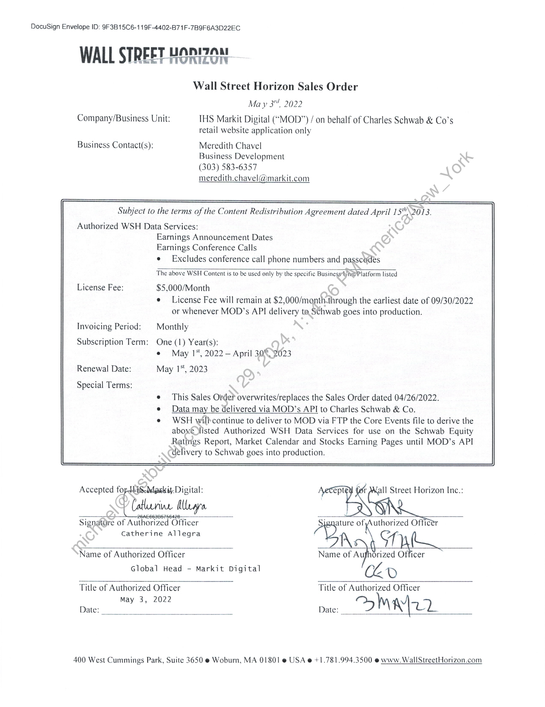

##### Wall Street Horizon Sales Order]

  
````col
```col-md
flexGrow=.5
===
> [!info] [Page 1](_attachments/images_3.6.4.1.11.1WallStreetHorizon_WSOD_SchwabRenewal_20220503.pdf_155034/page_1.png)
> 
```  
```col-md
DocuSign Envelope ID: 9F3B15C6-119F-4402-B71F-7B9F6A3D22EC  
WALL STREET HORIZON  
Wall Street Horizon Sales Order
Ma y 3", 2022  
Company/Business Unit: THS Markit Digital (“MOD”) / on behalf of Charles Schwab & Co’s
retail website application only  
Business Contact(s): Meredith Chavel
Business Development
(303) 583-6357
meredith.chavel@markit.com  
Subject to the terms of the Content Redistribution Agreement dated April 15""\2013.  
Authorized WSH Data Services:
Earnings Announcement Dates
Earnings Conference Calls  
e Excludes conference call phone numbers and passcudes  
The above WSH Content is to be used only by the specific Business*Wnit/Platform listed  
License Fee: $5,000/Month  
e License Fee will remain at $2,000/monththrough the earliest date of 09/30/2022
or whenever MOD’s API delivery ta Schwab goes into production.  
Invoicing Period: | Monthly  
Subscription Term: One (1) Year(s):
e@ May 1, 2022 — April 30% 2023  
Renewal Date: May 1*, 2023  
Special Terms:  
This Sales Order overwrites/replaces the Sales Order dated 04/26/2022.  
Data may be delivered via MOD’s API to Charles Schwab & Co.  
WSH wilhcontinue to deliver to MOD via FTP the Core Events file to derive the
above listed Authorized WSH Data Services for use on the Schwab Equity
Ratirigs Report, Market Calendar and Stocks Earning Pages until MOD’s API
delivery to Schwab goes into production.  
Accepted fo Maskit: Digital: ept t Mall Street Horizon Inc.:
Catlucrine MUrava
Signatdre of Authorized Officer : ature off con Officer
Catherine Allegra ar
Name of Authorized Officer Name of Aufhorized oP A
Global Head - Markit Digital Lo
Title of Authorized Officer Title of Authorized Officer  
Date: Nay By 2002 Date: OMir7  
400 West Cummings Park, Suite 3650 @ Woburn, MA 01801 @ USA @ +1.781.994.3500 @ www. WallStreetHorizon.com  
```
````
Notes:  


![[_attachments/3.6.4.1.11.1 Wall Street Horizon_WSOD_Schwab Renewal_20220503.pdf]