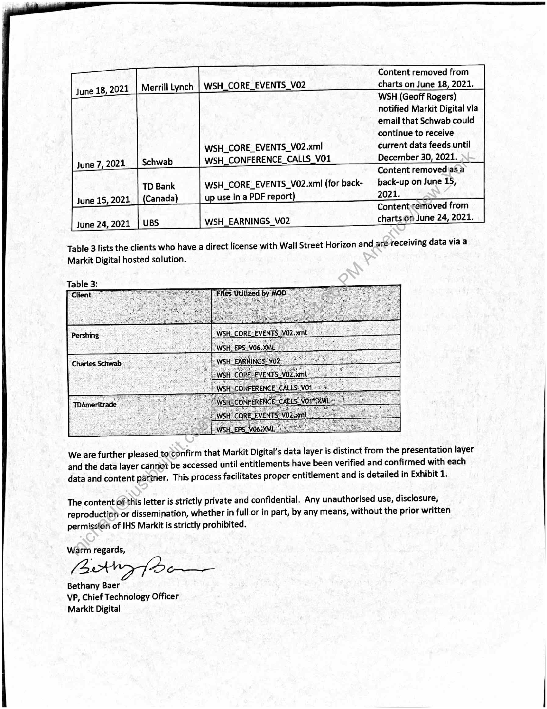

##### Markit Digital - Wall Street Horizon Data Access Status Update]

  
````col
```col-md
flexGrow=.5
===
> [!info] [Page 1](_attachments/images_3.6.4.1.11.2WallStreetHorizon_WSOD_CommonClientConfirmationLetter_20220404.pdf_155352/page_1.png)
> 
```  
```col-md
April 4, 2022  
Mr. Barry Star,  
Chief Executive Officer  
Wall Street Horizon, Inc.  
400 West Cummings Park #3650
Woburn, MA 01801  
Dear Mr. Star:  
PRIVATE AND CONFIDENTIAL  
In March of 2021 Wall Street Horizon requested that, by July 1, 2021, clients receiving Wall Street
Horizon data from Markit Digital (aka Markit on Demand, Inc.) via a hosted solution, either (1) have a
direct license in place with Wall Street Horizon; or (2) Markit Digital have a license in place with Wall
Street Horizon on behalf of the client. If neither of these licenses were put into place, the client’s access
to the Wall Street Horizon data was to be removed.  
Table 1 shows a summary of the client names and Wall Street Horizon data types delivered by Markit
Digital as of March 2021:  
Table 1:  
Merrill Lynch WSH_CORE_EVENTS.VO2  
Pershing > | WSH_CORE_EVENTS_Vo2.xmt
WSH_EPS_VO6.XML  
Charles Schwab WSH_EARNINGS_Vo2  
WSH_CORE_EVENTS_V02.xml  
WSH_CONFERENCE CALLS VO1___  
TDameritrade | WSH.CONFERENCE_CALLS_VO1*.XML_  
WSH_ CORE, EVENTS_VO2.sml  
WSH_EPS_V06.XML
WSH_CORE_EVENTS_V02.xml (for back-up use in a PDF  
WSH_EARNINGS, V02_  
Table 2 summarizes the actions taken by Markit Digital based on Wall Street Horizon’s request:  
Table 2:  
Date Client File Event  
```
````
Notes:    
````col
```col-md
flexGrow=.5
===
> [!info] [Page 2](_attachments/images_3.6.4.1.11.2WallStreetHorizon_WSOD_CommonClientConfirmationLetter_20220404.pdf_155352/page_2.png)
> 
```  
```col-md
Content removed from
H_CORE_EVENTS_V02 charts on June 18, 2021.
WSH (Geoff Rogers)
notified Markit Digital via
email that Schwab could
continue to receive
WSH_CORE_EVENTS_V02.xml current data feeds until
WSH_CONFERENCE_CALLS_V01 December 30, 2021.  
June 18,2021 _| Merrill Lynch | WS!  
June 7, 2021
Content removed as a
eee WSH_CORE_EVENTS_V02.xml (for back- back-up on June 15,
June 15, 2021 up use in a PDF report) 2021.
Content:removed from
June 24, 2021 WSH_EARNINGS_VO2 charts On June 24, 2021.  
Table 3 lists the clients who have a direct license with Wall Street Horizon and aré receiving data via a
Markit Digital hosted solution.  
Table 3:  
rther pleased to‘confirm that Markit Digital’s data layer is distinct from the presentation layer  
We are fu
and the data layer cannot be accessed until entitlements have been verified and confirmed with each  
data and content partner. This process facilitates proper entitlement and is detailed in Exhibit 1.  
The content of this letter is strictly private and confidential. Any unauthorised use, disclosure,
reproduction or dissemination, whether in full or in part, by any means, without the prior written
permission of IHS Markit is strictly prohibited.  
Warm regards,  
oy ere:  
Bethany Baer
VP, Chief Technology Officer
Markit Digital  
```
````
Notes:  


![[_attachments/3.6.4.1.11.2 Wall Street Horizon_WSOD_Common Client Confirmation Letter_20220404.pdf]