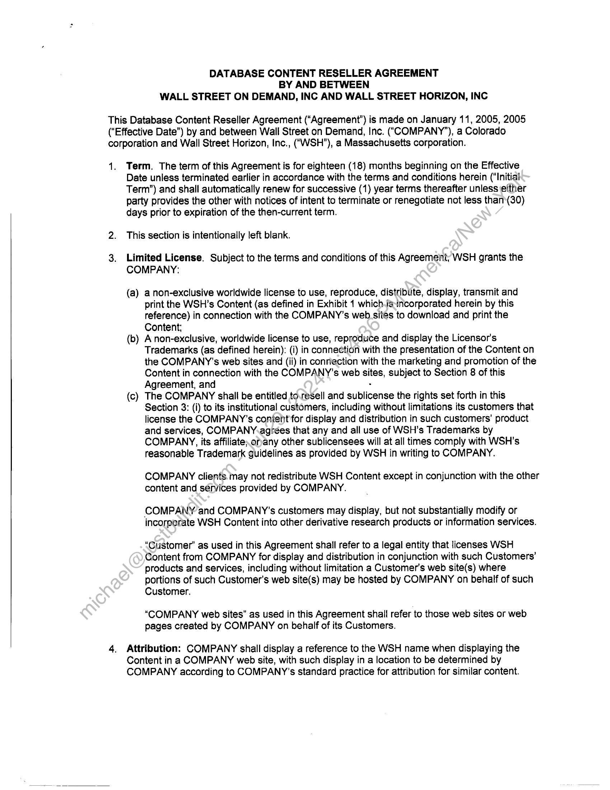
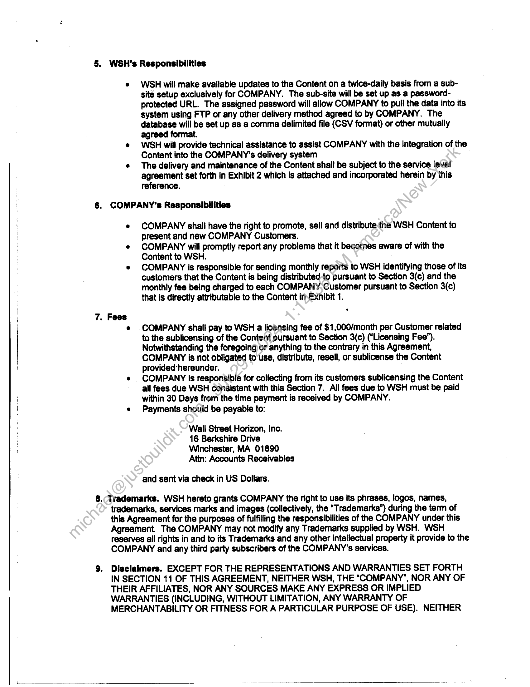
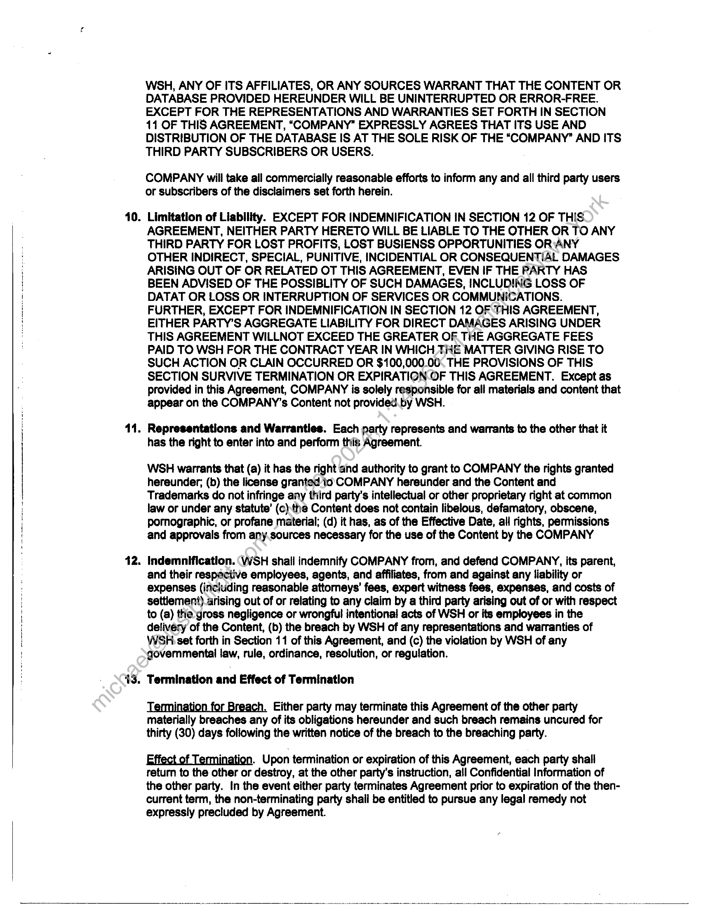
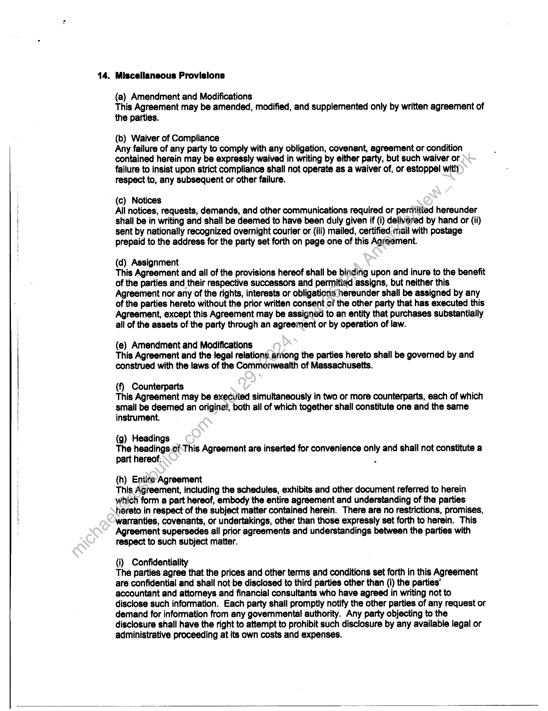
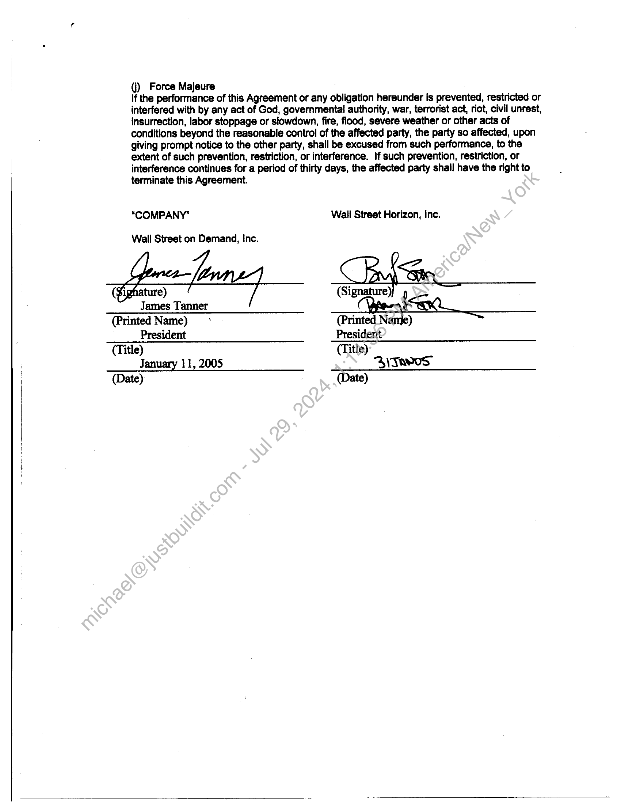
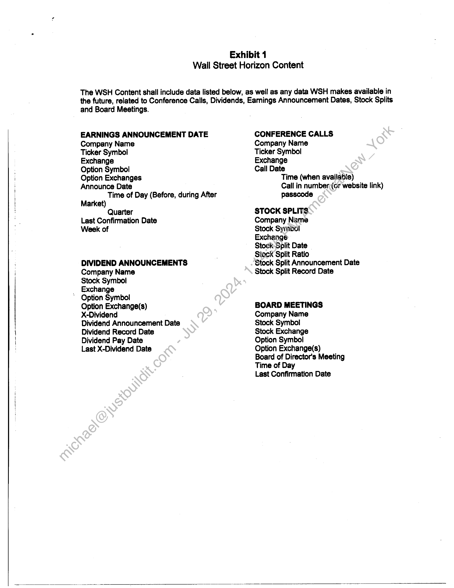
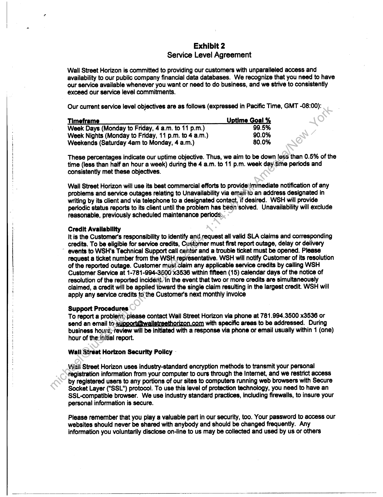
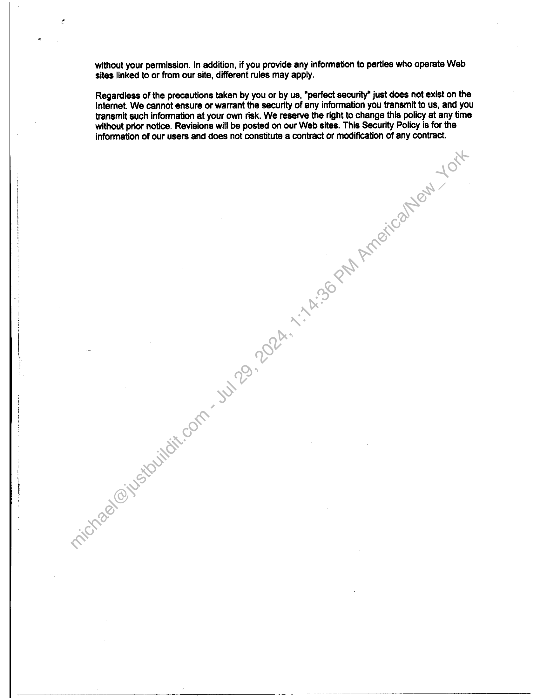

##### Database Content Reseller Agreement]

  
````col
```col-md
flexGrow=.5
===
> [!info] [Page 1](_attachments/images_3.6.4.1.11.3WallStreetHorizon_WSOD_DatabaseContentResellerAgreement_20050111.pdf_155324/page_1.png)
> 
```  
```col-md
DATABASE CONTENT RESELLER AGREEMENT
BY AND BETWEEN
WALL STREET ON DEMAND, INC AND WALL STREET HORIZON, INC  
This Database Content Reseller Agreement (“Agreement”) is made on January 11, 2005, 2005
(‘Effective Date”) by and between Wall Street on Demand, Inc. (‘COMPANY’), a Colorado
corporation and Wall Street Horizon, Inc., ("WSH"), a Massachusetts corporation.  
41. Term. The term of this Agreement is for eighteen (18) months beginning on the Effective
Date unless terminated earlier in accordance with the terms and conditions herein (‘Initial
Term”) and shall automatically renew for successive (1) year terms thereafter unless either
party provides the other with notices of intent to terminate or renegotiate not less than(30)
days prior to expiration of the then-current term.  
2. This section is intentionally left blank.  
3. Limited License. Subject to the terms and conditions of this Agreement, WSH grants the
COMPANY:  
(a) a non-exclusive worldwide license to use, reproduce, distribute, display, transmit and
print the WSH’s Content (as defined in Exhibit 1 which.is-incorporated herein by this
reference) in connection with the COMPANY’s web sites to download and print the
Content;  
(b) A non-exclusive, worldwide license to use, reproduce and display the Licensor’s  
Trademarks (as defined herein): (i) in connection with the presentation of the Content on  
the COMPANY’s web sites and (ii) in connection with the marketing and promotion of the  
Content in connection with the COMPANY's web sites, subject to Section 8 of this  
Agreement, and .  
The COMPANY shall be entitled to.resell and sublicense the rights set forth in this  
Section 3: (i) to its institutional customers, including without limitations its customers that  
license the COMPANY’s content for display and distribution in such customers’ product  
and services, COMPANY.agrées that any and all use of WSH’s Trademarks by  
COMPANY, its affiliate, onany other sublicensees will at all times comply with WSH’s  
reasonable Trademark guidelines as provided by WSH in writing to COMPANY.  
(Cc)  
na  
COMPANY clients. may not redistribute WSH Content except in conjunction with the other
content and services provided by COMPANY.  
COMPANY and COMPANY's customers may display, but not substantially modify or
incorporate WSH Content into other derivative research products or information services.  
“Customer” as used in this Agreement shall refer to a legal entity that licenses WSH
Content from COMPANY for display and distribution in conjunction with such Customers’
products and services, including without limitation a Customer's web site(s) where
portions of such Customer's web site(s) may be hosted by COMPANY on behalf of such
Customer.  
“COMPANY web sites” as used in this Agreement shail refer to those web sites or web
pages created by COMPANY on behalf of its Customers.  
4. Attribution: COMPANY shall display a reference to the WSH name when displaying the
Content in a COMPANY web site, with such display in a location to be determined by
COMPANY according to COMPANY’s standard practice for attribution for similar content.  
```
````
Notes:    
````col
```col-md
flexGrow=.5
===
> [!info] [Page 2](_attachments/images_3.6.4.1.11.3WallStreetHorizon_WSOD_DatabaseContentResellerAgreement_20050111.pdf_155324/page_2.png)
> 
```  
```col-md
5. WSH’s Responsibilities  
WSH will make available updates to the Content on a twice-daily basis from a subsité setup exclusively for COMPANY. The sub-site will be set up as a passwordprotected URL. The assigned password will allow COMPANY to pull the data into its
system using FTP or any other delivery method agreed to by COMPANY. The
database will be set up as a comma delimited file (CSV format) or other mutually
agreed format.  
WSH will provide technical assistance to assist COMPANY with the integration of the
Content into the COMPANY’s delivery system  
The delivery and maintenance of the Content shall be subject to the service level
agreement set forth in Exhibit 2 which is attached and incorporated herein by this
reference.  
6. COMPANY’s Responsibilities  
7. Fees  
COMPANY shail have the right to promote, sell and distribute the WSH Content to
present and new COMPANY Customers.  
COMPANY will promptly report any problems that it becomes aware of with the
Content to WSH.  
COMPANY is responsible for sending monthly reports to WSH identifying those of its
customers that the Content is being distributed to pursuant to Section 3(c) and the
monthly fee being charged to each COMPANY, Customer pursuant to Section 3(c)
that is directly attributable to the Content Ir Exhibit 1.  
-COMPANY shall pay to WSH a licensing fee of $1,000/month per Customer related  
to the sublicensing of the Content pursuant to Section 3(c) (“Licensing Fee’).
Notwithstanding the foregoing or anything to the contrary in this Agreement,
COMPANY is not obligated to'use, distribute, resell, or sublicense the Content
provided-hereunder.  
_ COMPANY is responsible for collecting from its customers sublicensing the Content  
all fees due WSH consistent with this Section 7. All fees due to WSH must be paid
within 30 Days from the time payment is received by COMPANY.
Payments should be payable to:  
Wall Street Horizon, Inc.  
16 Berkshire Drive
Winchester, MA 01890
Attn: Accounts Receivables  
and sent via check in US Dollars.  
8. (Trademarks. WSH hereto grants COMPANY the right to use its phrases, logos, names,
trademarks, services marks and images (collectively, the “Trademarks") during the term of
this Agreement for the purposes of fulfilling the responsibilities of the COMPANY under this
Agreement. The COMPANY may not modify any Trademarks supplied by WSH. WSH
reserves all rights in and to its Trademarks and any other intellectual property it provide to the
COMPANY and any third party subscribers of the COMPANY’s services.  
9, Disclaimers. EXCEPT FOR THE REPRESENTATIONS AND WARRANTIES SET FORTH
IN SECTION 11 OF THIS AGREEMENT, NEITHER WSH, THE “COMPANY”, NOR ANY OF
THEIR AFFILIATES, NOR ANY SOURCES MAKE ANY EXPRESS OR IMPLIED
WARRANTIES (INCLUDING, WITHOUT LIMITATION, ANY WARRANTY OF
MERCHANTABILITY OR FITNESS FOR A PARTICULAR PURPOSE OF USE). NEITHER  
```
````
Notes:    
````col
```col-md
flexGrow=.5
===
> [!info] [Page 3](_attachments/images_3.6.4.1.11.3WallStreetHorizon_WSOD_DatabaseContentResellerAgreement_20050111.pdf_155324/page_3.png)
> 
```  
```col-md
10.  
11.  
12.  
43.  
WSH, ANY OF ITS AFFILIATES, OR ANY SOURCES WARRANT THAT THE CONTENT OR
DATABASE PROVIDED HEREUNDER WILL BE UNINTERRUPTED OR ERROR-FREE.
EXCEPT FOR THE REPRESENTATIONS AND WARRANTIES SET FORTH IN SECTION  
11 OF THIS AGREEMENT, “COMPANY” EXPRESSLY AGREES THAT ITS USE AND
DISTRIBUTION OF THE DATABASE IS AT THE SOLE RISK OF THE “COMPANY” AND ITS
THIRD PARTY SUBSCRIBERS OR USERS.  
COMPANY will take all commercially reasonable efforts to inform any and all third party users
or subscribers of the disclaimers set forth herein.  
Limitation of Liability. EXCEPT FOR INDEMNIFICATION IN SECTION 12 OF THIS
AGREEMENT, NEITHER PARTY HERETO WILL BE LIABLE TO THE OTHER OR TO ANY
THIRD PARTY FOR LOST PROFITS, LOST BUSIENSS OPPORTUNITIES OR:ANY
OTHER INDIRECT, SPECIAL, PUNITIVE, INCIDENTIAL OR CONSEQUENTIAL DAMAGES
ARISING OUT OF OR RELATED OT THIS AGREEMENT, EVEN IF THE PARTY HAS
BEEN ADVISED OF THE POSSIBLITY OF SUCH DAMAGES, INCLUDING LOSS OF
DATAT OR LOSS OR INTERRUPTION OF SERVICES OR COMMUNICATIONS.
FURTHER, EXCEPT FOR INDEMNIFICATION IN SECTION 12 OF THIS AGREEMENT,
EITHER PARTY’S AGGREGATE LIABILITY FOR DIRECT DAMAGES ARISING UNDER
THIS AGREEMENT WILLNOT EXCEED THE GREATER OF THE AGGREGATE FEES
PAID TO WSH FOR THE CONTRACT YEAR IN WHICH THE MATTER GIVING RISE TO
SUCH ACTION OR CLAIN OCCURRED OR $100,000.00: THE PROVISIONS OF THIS
SECTION SURVIVE TERMINATION OR EXPIRATION OF THIS AGREEMENT. Except as
provided in this Agreement, COMPANY is solely responsible for all materials and content that
appear on the COMPANY ’s Content not provided.by WSH.  
Representations and Warranties. Each party represents and warrants to the other that it
has the right to enter into and perform this Agreement.  
WSH warrants that (a) it has the right and authority to grant to COMPANY the rights granted
hereunder; (b) the license granted io COMPANY hereunder and the Content and
Trademarks do not infringe any third party’s intellectual or other proprietary right at common
law or under any statute’ (c)the Content does not contain libelous, defamatory, obscene,
pornographic, or profane material; (d) it has, as of the Effective Date, all rights, permissions
and approvals from any.sources necessary for the use of the Content by the COMPANY  
Indemnification. (WSH shall indemnify COMPANY from, and defend COMPANY, its parent,
and their respactive employees, agents, and affiliates, from and against any liability or
expenses (including reasonable attorneys’ fees, expert witness fees, expenses, and costs of
settlement) arising out of or relating to any claim by a third party arising out of or with respect
to (a) the gross negligence or wrongful intentional acts of WSH or its employees in the
delivery of the Content, (b) the breach by WSH of any representations and warranties of
WSRH set forth in Section 11 of this Agreement, and (c) the violation by WSH of any
governmental law, rule, ordinance, resolution, or regulation.  
Termination and Effect of Termination  
Termination for Breach. Either party may terminate this Agreement of the other party
materially breaches any of its obligations hereunder and such breach remains uncured for
thirty (30) days following the written notice of the breach to the breaching party.  
Effect of Termination. Upon termination or expiration of this Agreement, each party shall
return to the other or destroy, at the other party's instruction, all Confidential Information of
the other party. In the event either party terminates Agreement prior to expiration of the thencurrent term, the non-terminating party shall be entitled to pursue any legal remedy not
expressly precluded by Agreement.  
```
````
Notes:    
````col
```col-md
flexGrow=.5
===
> [!info] [Page 4](_attachments/images_3.6.4.1.11.3WallStreetHorizon_WSOD_DatabaseContentResellerAgreement_20050111.pdf_155324/page_4.png)
> 
```  
```col-md
14. Miscellaneous Provisions  
(a) Amendment and Modifications
This Agreement may be amended, modified, and supplemented only by written agreement of
the parties.  
(b) Waiver of Compliance  
Any failure of any party to comply with any obligation, covenant, agreement or condition
contained herein may be expressly waived in writing by either party, but such waiver or
failure to insist upon strict compliance shall not operate as a waiver of, or estoppel witht
Tespect to, any subsequent or other failure.  
(c) Notices
All notices, requests, demands, and other communications required or permitted hereunder
shall be in writing and shall.be deemed to have been duly given if (i) delivered by hand or (ii)
sent by nationally recognized overnight courier or (iii) mailed, certified, mail with postage
prepaid to the address for the party set forth on page one of this Agreement.  
(d) Assignment  
This Agreement and all of the provisions hereof shall be binding upon and inure to the benefit
of the parties and their respective successors and permitted assigns, but neither this
Agreement nor any of the rights, interests or obligations hereunder shall be assigned by any
of the parties hereto without the prior written consent cf the other party that has executed this
Agreement, except this Agreement may be assigned to an entity that purchases substantially
all of the assets of the party through an agreement or by operation of law.  
(e) Amendment and Modifications
This Agreement and the legal relations arnong the parties hereto shall be governed by and
construed with the laws of the Commonwealth of Massachusetts.  
(f) Counterparts  
This Agreement may be executed simultaneously in two or more counterparts, each of which
small be deemed an origina!, both all of which together shall constitute one and the same
instrument.  
(g) Headings
The headings cf This Agreement are inserted for convenience only and shall not constitute a
part hereof. .  
(h) Entire Agreement  
This Agreement, including the schedules, exhibits and other document referred to herein
which form a part hereof, embody the entire agreement and understanding of the parties
hereto in respect of the subject matter contained herein. There are no restrictions, promises,
warranties, covenants, or undertakings, other than those expressly set forth to herein. This
Agreement supersedes all prior agreements and understandings between the parties with
respect to such subject matter.  
{i) Confidentiality  
The parties agree that the prices and other terms and conditions set forth in this Agreement
are confidential and shall not be disclosed to third parties other than (i) the parties’
accountant and attorneys and financial consultants who have agreed in writing not to  
disclose such information. Each party shall promptly notify the other parties of any request or
demand for information from any governmental authority. Any party objecting to the
disclosure shall have the right to attempt to prohibit such disclosure by any available legal or
administrative proceeding at its own costs and expenses.  
```
````
Notes:    
````col
```col-md
flexGrow=.5
===
> [!info] [Page 5](_attachments/images_3.6.4.1.11.3WallStreetHorizon_WSOD_DatabaseContentResellerAgreement_20050111.pdf_155324/page_5.png)
> 
```  
```col-md
(j) Force Majeure  
If the performance of this Agreement or any obligation hereunder is prevented, restricted or
interfered with by any act of God, governmental authority, war, terrorist act, riot, civil unrest,
insurrection, labor stoppage or slowdown, fire, flood, severe weather or other acts of
conditions beyond the reasonable control of the affected party, the party so affected, upon
giving prompt notice to the other party, shall be excused from such performance, to the
extent of such prevention, restriction, or interference. !f such prevention, restriction, or
interference continues for a period of thirty days, the affected party shall have the right to
terminate this Agreement.  
“COMPANY” Wall Street Horizon, Inc.  
Wall Street on Demand, Inc.  
¢ ture) (Signature),
James Tanner  
(Printed Name) = (Printed eek ~
President President  
(Title) (Title)
January 11, 2005 AyJavos”  
(Date) : (ate)  
```
````
Notes:    
````col
```col-md
flexGrow=.5
===
> [!info] [Page 6](_attachments/images_3.6.4.1.11.3WallStreetHorizon_WSOD_DatabaseContentResellerAgreement_20050111.pdf_155324/page_6.png)
> 
```  
```col-md
Exhibit 1  
Wail Street Horizon Content  
The WSH Content shall include data listed below, as well as any data WSH makes available in
the future, related to Conference Calls, Dividends, Earnings Announcement Dates, Stock Splits  
and Board Meetings.  
EARNINGS ANNOUNCEMENT DATE
Company Name
Ticker Symbol
Exchange
Option Symbol
Option Exchanges
Announce Date
Time of Day (Before, during After
Market)
Quarter
Last Confirmation Date
Week of  
DIVIDEND ANNOUNCEMENTS
Company Name  
Stock Symbol  
Exchange  
* Option Symbol  
Option Exchange(s)
X-Dividend  
Dividend Announcement Date
Dividend Record Date
Dividend Pay Date  
Last X-Dividend Date  
CONFERENCE CALLS  
Company Name  
Ticker Symbol  
Exchange  
Call Date
Time (when available)
Call in number((or website link)
passcode  
STOCK SPLITS.  
Company Name  
Stock Symbol  
Exchange  
Stock Split Date  
Stock Split Ratio  
Stock Split Announcement Date
Stock Split Record Date  
BOARD MEETINGS
Company Name  
Stock Symbol  
Stock Exchange  
Option Symbol  
Option Exchange(s)  
Board of Director's Meeting
Time of Day  
Last Confirmation Date  
```
````
Notes:    
````col
```col-md
flexGrow=.5
===
> [!info] [Page 7](_attachments/images_3.6.4.1.11.3WallStreetHorizon_WSOD_DatabaseContentResellerAgreement_20050111.pdf_155324/page_7.png)
> 
```  
```col-md
i  
Exhibit 2
Service Level Agreement  
Wall Street Horizon is committed to providing our customers with unparalleled access and
availability to our public company financial data databases. We recognize that you need to have
our service available whenever you want or need to do business, and we strive to consistently
exceed our service level commitments.  
Our current service level objectives are as follows (expressed in Pacific Time, GMT -08:00):  
Timeframe Uptime Goal %
Week Days (Monday to Friday, 4 a.m. to 11 p.m.) 99.5%
Week Nights (Monday to Friday, 11 p.m. to 4 a.m.) 90.0%
Weekends (Saturday 4am to Monday, 4 a.m.) 80.0%  
These percentages indicate our uptime objective. Thus, we aim to be down less than 0.5% of the
time (less than half an hour a week) during the 4 a.m. to 11 p.m. week day time periods and
consistently met these objectives.  
Wall Street Horizon will use its best commercial efforts to provide\immediate notification of any
problems and service outages relating to Unavailability via emaii'to an address designated in
writing by its client and via telephone to a designated contact, if desired. WSH will provide
periodic status reports to its client until the problem has been solved. Unavailability will exclude
teasonable, previously scheduled maintenance periods;  
Credit Availability  
It is the Customer's responsibility to identify and,request all valid SLA claims and corresponding
credits. To be eligible for service credits, Customer must first report outage, delay or delivery
events to WSH’s Technical Support call center and a trouble ticket must be opened. Please
request a ticket number from the WSH representative. WSH will notify Customer of its resolution
of the reported outage. Customer must claim any applicable service credits by calling WSH
Customer Service at 1-781-994-3500 x3536 within fifteen (15) calendar days of the notice of
resolution of the reported incident./in the event that two or more credits are simultaneously
claimed, a credit will be applied toward the single claim resulting in the largest credit. WSH will
apply any service credits ta the Customer's next monthly invoice  
Support Procedures  
To report a problem).please contact Wall Street Horizon via phone at 781.994.3500 x3536 or
send an email to support@wallstreethorizon.com with specific areas to be addressed. During
business hours;-review will be initiated with a response via phone or email usually within 1 (one)
hour of the:initial report.  
Wall Streat Horizon Security Policy -  
Wail Street Horizon uses industry-standard encryption methods to transmit your personal
registration information from your computer to ours through the Internet, and we restrict access
by registered users to any portions of our sites to computers running web browsers with Secure
Socket Layer ("SSL") protocol. To use this level of protection technology, you need to have an
SSL-compatible browser. We use industry standard practices, including firewalls, to insure your
personal information is secure.  
Please remember that you play a valuable part in our security, too. Your password to access our
websites should never be shared with anybody and should be changed frequently. Any
information you voluntarily disclose on-line to us may be collected and used by us or others  
```
````
Notes:    
````col
```col-md
flexGrow=.5
===
> [!info] [Page 8](_attachments/images_3.6.4.1.11.3WallStreetHorizon_WSOD_DatabaseContentResellerAgreement_20050111.pdf_155324/page_8.png)
> 
```  
```col-md
nN  
without your permission. In addition, if you provide any information to parties who operate Web
sites linked to or from our site, different rules may apply.  
Regardless of the precautions taken by you or by us, "perfect security” just does not exist on the
Internet. We cannot ensure or warrant the security of any information you transmit to us, and you
transmit such information at your own risk. We reserve the right to change this policy at any time
without prior notice. Revisions will be posted on our Web sites. This Security Policy is for the
information of our users and does not constitute a contract or modification of any contract.  
```
````
Notes:  


![[_attachments/3.6.4.1.11.3 Wall Street Horizon_WSOD_Database Content Reseller Agreement_20050111.pdf]