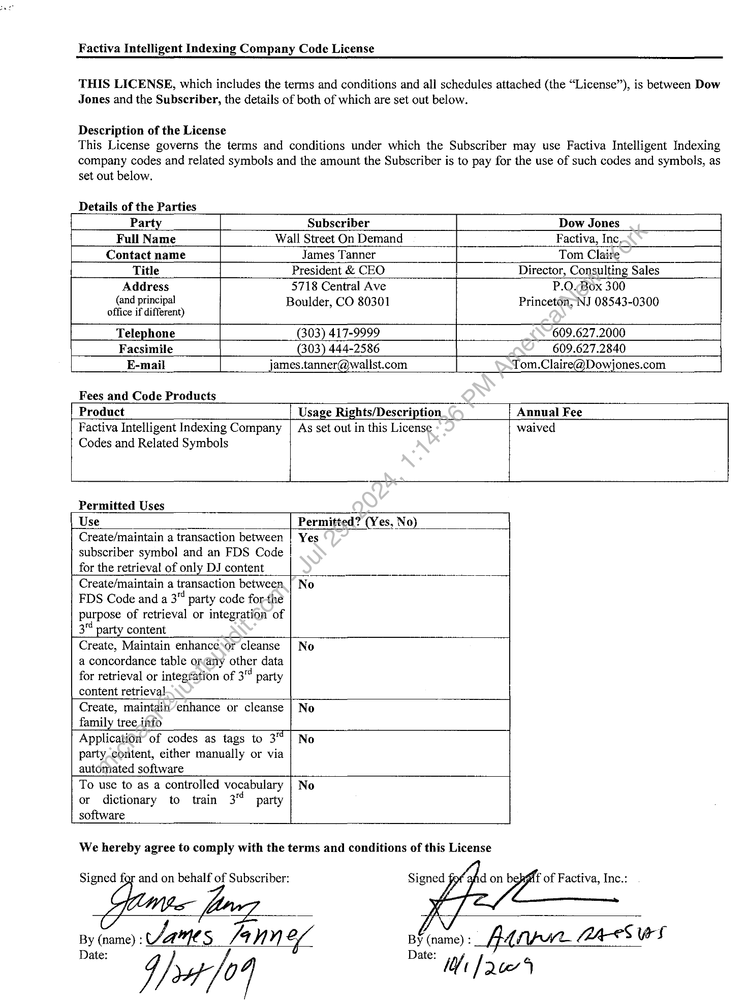
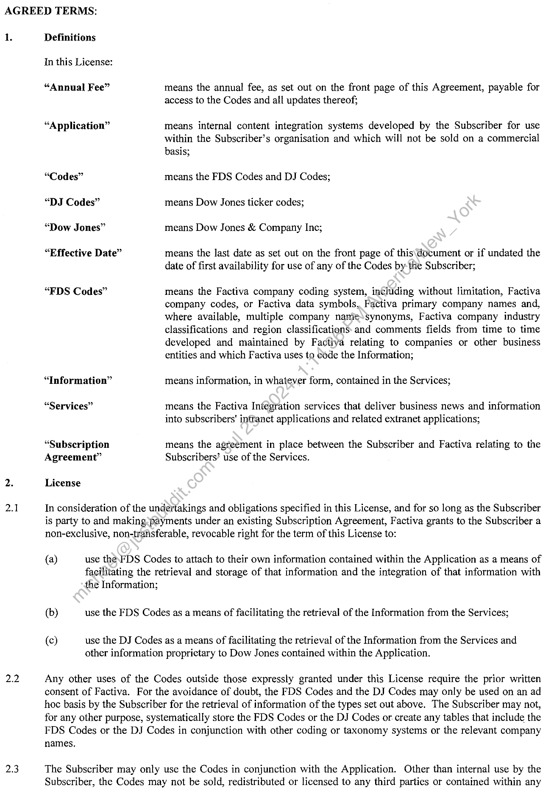
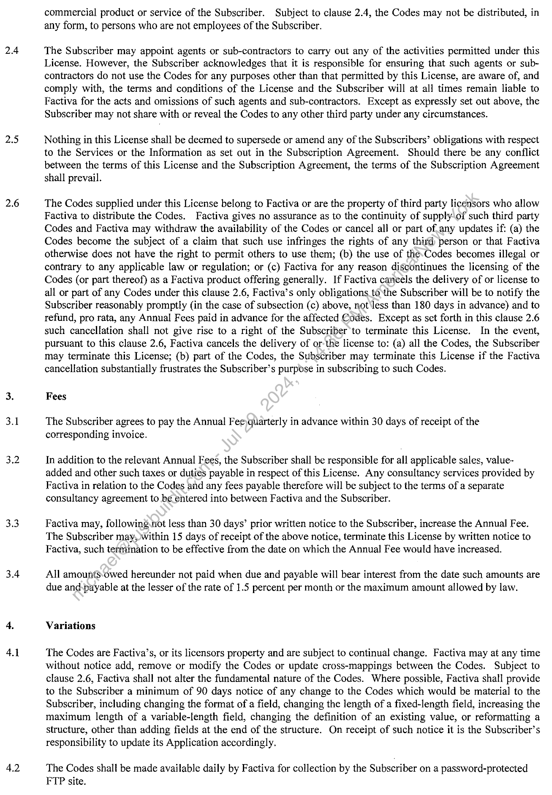
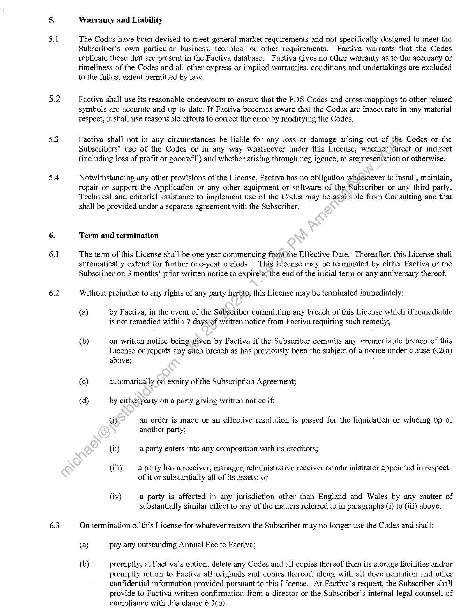
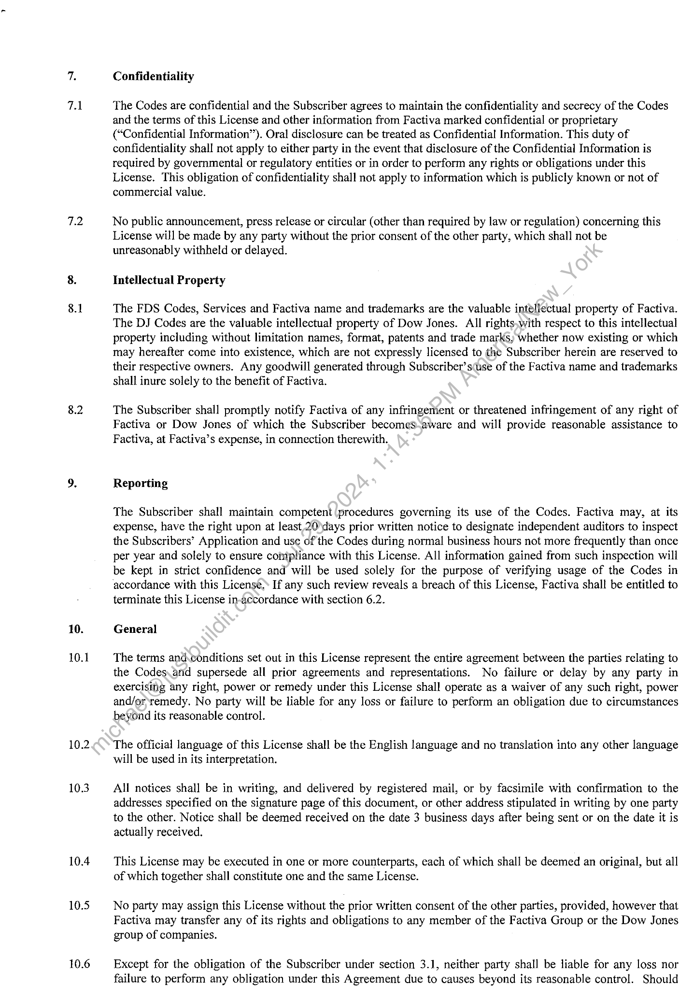
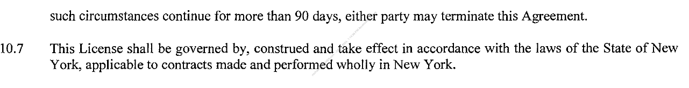
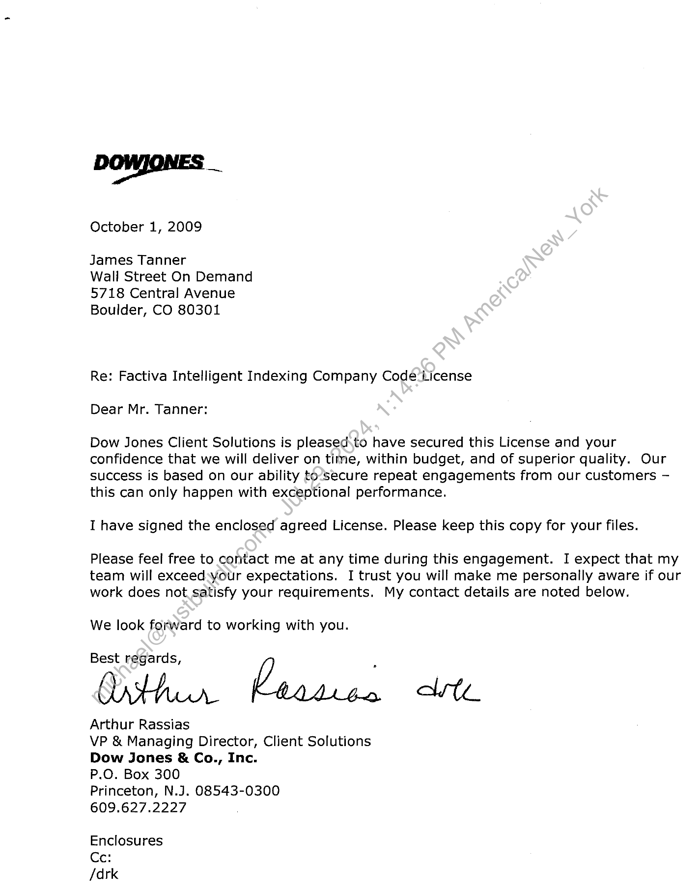

##### Factiva Intelligent Indexing Company Code License]

  
````col
```col-md
flexGrow=.5
===
> [!info] [Page 1](_attachments/images_3.6.4.1.12.1WSOD_20091001_DowJones_FactivaLicense.pdf_155006/page_1.png)
> 
```  
```col-md
Factiva Intelligent Indexing Company Code License  
THIS LICENSE, which includes the terms and conditions and all schedules attached (the “License”), is between Dow
Jones and the Subscriber, the details of both of which are set out below.  
Description of the License  
This License governs the terms and conditions under which the Subscriber may use Factiva Intelligent Indexing
company codes and related symbols and the amount the Subscriber is to pay for the use of such codes and symbols, as
set out below.  
Details of the Parties  
Party Subscriber Dow Jones
Full Name Wall Street On Demand Factiva, Inc,
Contact name James Tanner Tom Claire
Title President & CEO Director, Consulting Sales
Address 5718 Central Ave P.O.  
Box 300
(and principal Boulder, CO 80301 Princeton, NJ 08543-0300
office if different)
Telephone (303) 417-9999 609.627.2000
Facsimile (303) 444-2586 609.627.2840
E-mail james.tanner@wallst.com Tom.Claire@Dowjones.com  
Fees and Code Products  
Product Usage Rights/Description Annual Fee
Factiva Intelligent Indexing Company | As set out in this License waived  
Codes and Related Symbols  
Permitted Uses  
Use Permitted? (Yes, No)  
Create/maintain a transaction between | Yes
subscriber symbol and an FDS Code
for the retrieval of only DJ content  
Create/maintain a transaction between_| No
FDS Code and a 3" party code forthe
purpose of retrieval or integration of
3 party content  
Create, Maintain enhancesor cleanse | No
a concordance table orany other data
for retrieval or integration of 3“ party
content retrieval  
Create, maintain’enhance or cleanse | No
family tree info  
Application’ of codes as tags to 3 | No
partycontent, either manually or via
automated software  
To use to as a controlled vocabulary | No
or dictionary to train 3" party
software  
We hereby agree to comply with the terms and conditions of this License  
Signed for and on behalf of Subscriber:  
ay (name): AACS AVN) of  
Date:  
```
````
Notes:    
````col
```col-md
flexGrow=.5
===
> [!info] [Page 2](_attachments/images_3.6.4.1.12.1WSOD_20091001_DowJones_FactivaLicense.pdf_155006/page_2.png)
> 
```  
```col-md
AGREED TERMS:  
1.  
2.1  
2.2  
2.3  
Definitions
In this License:  
“Annual Fee” means the annual fee, as set out on the front page of this Agreement, payable for
access to the Codes and all updates thereof;  
“Application” means internal content integration systems developed by the Subscriber for use
within the Subscriber’s organisation and which will not be sold on a commercial
basis;  
“Codes” means the FDS Codes and DJ Codes;  
“DJ Codes” means Dow Jones ticker codes;  
“Dow Jones” means Dow Jones & Company Ince;  
“Effective Date” means the last date as set out on the front page of this\document or if undated the  
date of first availability for use of any of the Codes by-the Subscriber;  
“FDS Codes” means the Factiva company coding system, including without limitation, Factiva
company codes, or Factiva data symbols. Factiva primary company names and,
where available, multiple company namie\synonyms, Factiva company industry
classifications and region classifications and comments fields from time to time
developed and maintained by Factiya relating to companies or other business
entities and which Factiva uses to code the Information;  
“Information” means information, in whatever form, contained in the Services;  
“Services” means the Factiva Integration services that deliver business news and information
into subscribers’ intranet applications and related extranet applications;  
“Subscription means the agreement in place between the Subscriber and Factiva relating to the
Agreement” Subscribers’ use of the Services.
License  
In consideration of the undertakings and obligations specified in this License, and for so long as the Subscriber
is party to and making payments under an existing Subscription Agreement, Factiva grants to the Subscriber a
non-exclusive, non-trafisferable, revocable right for the term of this License to:  
(a) use the.FDS Codes to attach to their own information contained within the Application as a means of
facilitating the retrieval and storage of that information and the integration of that information with
the Information;  
(b) use the FDS Codes as a means of facilitating the retrieval of the Information from the Services;  
(c) use the DJ Codes as a means of facilitating the retrieval of the Information from the Services and
other information proprietary to Dow Jones contained within the Application.  
Any other uses of the Codes outside those expressly granted under this License require the prior written
consent of Factiva. For the avoidance of doubt, the FDS Codes and the DJ Codes may only be used on an ad
hoc basis by the Subscriber for the retrieval of information of the types set out above. The Subscriber may not,
for any other purpose, systematically store the FDS Codes or the DJ Codes or. create any tables that include the
FDS Codes or the DJ Codes in conjunction with other coding or taxonomy systems or the relevant company
names.  
The Subscriber may only use the Codes in conjunction with the Application. Other than internal use by the
Subscriber, the Codes may not be sold, redistributed or licensed to any third parties or contained within any  
```
````
Notes:    
````col
```col-md
flexGrow=.5
===
> [!info] [Page 3](_attachments/images_3.6.4.1.12.1WSOD_20091001_DowJones_FactivaLicense.pdf_155006/page_3.png)
> 
```  
```col-md
2.4  
2.5  
2.6  
3.1  
3.2  
3.3  
3.4  
4.1  
4.2  
commercial product or service of the Subscriber. Subject to clause 2.4, the Codes may not be distributed, in
any form, to persons who are not employees of the Subscriber.  
The Subscriber may appoint agents or sub-contractors to carry out any of the activities permitted under this
License. However, the Subscriber acknowledges that it is responsible for ensuring that such agents or subcontractors do not use the Codes for any purposes other than that permitted by this License, are aware of, and
comply with, the terms and conditions of the License and the Subscriber will at all times remain liable to
Factiva for the acts and omissions of such agents and sub-contractors. Except as expressly set out above, the
Subscriber may not share with or reveal the Codes to any other third party under any circumstances.  
Nothing in this License shall be deemed to supersede or amend any of the Subscribers’ obligations with respect
to the Services or the Information as set out in the Subscription Agreement. Should there be any conflict
between the terms of this License and the Subscription Agreement, the terms of the Subscription Agreement
shall prevail.  
The Codes supplied under this License belong to Factiva or are the property of third party licensors who allow
Factiva to distribute the Codes. Factiva gives no assurance as to the continuity of supply of such third party
Codes and Factiva may withdraw the availability of the Codes or cancel all or part of any updates if: (a) the
Codes become the subject of a claim that such use infringes the rights of any third person or that Factiva
otherwise does not have the right to permit others to use them; (b) the use of the-Codes becomes illegal or
contrary to any applicable law or regulation; or (c) Factiva for any reason discontinues the licensing of the
Codes (or part thereof) as a Factiva product offering generally. If Factiva cancels the delivery of or license to
all or part of any Codes under this clause 2.6, Factiva’s only obligations tothe Subscriber will be to notify the
Subscriber reasonably promptly (in the case of subsection (c) above, not\less than 180 days in advance) and to
refund, pro rata, any Annual Fees paid in advance for the affected Codes. Except as set forth in this clause 2.6
such cancellation shall not give rise to a right of the Subscriber’to terminate this License. In the event,
pursuant to this clause 2.6, Factiva cancels the delivery of or the license to: (a) all the Codes, the Subscriber
may terminate this License; (b) part of the Codes, the Subscriber may terminate this License if the Factiva
cancellation substantially frustrates the Subscriber’s purpose in subscribing to such Codes.  
Fees  
The Subscriber agrees to pay the Annual Fee)quarterly in advance within 30 days of receipt of the
corresponding invoice.  
In addition to the relevant Annual Fees, the Subscriber shall be responsible for all applicable sales, valueadded and other such taxes or duties payable in respect of this License. Any consultancy services provided by
Factiva in relation to the Codes aid any fees payable therefore will be subject to the terms of a separate
consultancy agreement to be entered into between Factiva and the Subscriber.  
Factiva may, following.not less than 30 days’ prior written notice to the Subscriber, increase the Annual Fee.
The Subscriber may, within 15 days of receipt of the above notice, terminate this License by written notice to
Factiva, such termination to be effective from the date on which the Annual Fee would have increased.  
All amountS:owed hereunder not paid when due and payable will bear interest from the date such amounts are
due and-payable at the lesser of the rate of 1.5 percent per month or the maximum amount allowed by law.  
Variations  
The Codes are Factiva’s, or its licensors property and are subject to continual change. Factiva may at any time
without notice add, remove or modify the Codes or update cross-mappings between the Codes. Subject to
clause 2.6, Factiva shall not alter the fundamental nature of the Codes. Where possible, Factiva shall provide
to the Subscriber a minimum of 90 days notice of any change to the Codes which would be material to the
Subscriber, including changing the format of a field, changing the length of a fixed-length field, increasing the
maximum length of a variable-length field, changing the definition of an existing value, or reformatting a
structure, other than adding fields at the end of the structure. On receipt of such notice it is the Subscriber’s
responsibility to update its Application accordingly.  
The Codes shall be made available daily by Factiva for collection by the Subscriber on a password-protected
FTP site.  
```
````
Notes:    
````col
```col-md
flexGrow=.5
===
> [!info] [Page 4](_attachments/images_3.6.4.1.12.1WSOD_20091001_DowJones_FactivaLicense.pdf_155006/page_4.png)
> 
```  
```col-md
5.1  
5.2  
5.3  
5.4  
6.1  
6.2  
6.3  
Warranty and Liability  
The Codes have been devised to meet general market requirements and not specifically designed to meet the
Subscriber’s own particular business, technical or other requirements. Factiva warrants that the Codes
replicate those that are present in the Factiva database. Factiva gives no other warranty as to the accuracy or
timeliness of the Codes and all other express or implied warranties, conditions and undertakings are excluded
to the fullest extent permitted by law.  
Factiva shall use its reasonable endeavours to ensure that the FDS Codes and cross-mappings to other related
symbols are accurate and up to date. If Factiva becomes aware that the Codes are inaccurate in any material
respect, it shall use reasonable efforts to correct the error by modifying the Codes.  
Factiva shall not in any circumstances be liable for any loss or damage arising out of the Codes or the
Subscribers’ use of the Codes or in any way whatsoever under this License, whether direct or indirect
(including loss of profit or goodwill) and whether arising through negligence, misrepresentation or otherwise.  
Notwithstanding any other provisions of the License, Factiva has no obligation whatsoever to install, maintain,
repair or support the Application or any other equipment or software of the Subscriber or any third party.
Technical and editorial assistance to implement use of the Codes may be.available from Consulting and that
shall be provided under a separate agreement with the Subscriber.  
Term and termination  
The term of this License shall be one year commencing fromthe Effective Date. Thereafter, this License shall
automatically extend for further one-year periods. This License may be terminated by either Factiva or the
Subscriber on 3 months’ prior written notice to expire’at the end of the initial term or any anniversary thereof.  
Without prejudice to any rights of any party heréto, this License may be terminated immediately:  
(a) by Factiva, in the event of the Subscriber committing any breach of this License which if remediable
is not remedied within 7 daysof written notice from Factiva requiring such remedy;  
(b) on written notice being given by Factiva if the Subscriber commits any irremediable breach of this
License or repeats any such breach as has previously been the subject of a notice under clause 6.2(a)
above; .  
(c) automatically on expiry of the Subscription Agreement;  
(a) by either party on a party giving written notice if:  
Gi) an order is made or an effective resolution is passed for the liquidation or winding up of
another party;
(ii) a party enters into any composition with its creditors;  
(iii) a party has a receiver, manager, administrative receiver or administrator appointed in respect
of it or substantially all of its assets; or  
{iv) a party is affected in any jurisdiction other than England and Wales by any matter of
substantially similar effect to any of the matters referred to in paragraphs (i) to (iii) above.  
On termination of this License for whatever reason the Subscriber may no longer use the Codes and shall:
(a) pay any outstanding Annual Fee to Factiva;  
(b) promptly, at Factiva’s option, delete any Codes and all copies thereof from its storage facilities and/or
promptly return to Factiva all originals and copies thereof, along with all documentation and other
confidential information provided pursuant to this License. At Factiva’s request, the Subscriber shall
provide to Factiva written confirmation from a director or the Subscriber’s internal legal counsel, of
compliance with this clause 6.3(b).  
```
````
Notes:    
````col
```col-md
flexGrow=.5
===
> [!info] [Page 5](_attachments/images_3.6.4.1.12.1WSOD_20091001_DowJones_FactivaLicense.pdf_155006/page_5.png)
> 
```  
```col-md
71  
7.2  
8.1  
8.2  
10.  
10.1  
10.2  
10.3  
10.4  
10.5  
10.6  
Confidentiality  
The Codes are confidential and the Subscriber agrees to maintain the confidentiality and secrecy of the Codes
and the terms of this License and other information from Factiva marked confidential or proprietary
(“Confidential Information”). Oral disclosure can be treated as Confidential Information. This duty of
confidentiality shall not apply to either party in the event that disclosure of the Confidential Information is
required by governmental or regulatory entities or in order to perform any rights or obligations under this
License. This obligation of confidentiality shall not apply to information which is publicly known or not of
commercial value.  
No public announcement, press release or circular (other than required by law or regulation) concerning this
License will be made by any party without the prior consent of the other party, which shall not be
unreasonably withheld or delayed.  
Intellectual Property  
The FDS Codes, Services and Factiva name and trademarks are the valuable intellectual property of Factiva.
The DJ Codes are the valuable intellectual property of Dow Jones. All rights,with respect to this intellectual
property including without limitation names, format, patents and trade marks, whether now existing or which
may hereafter come into existence, which are not expressly licensed to the Subscriber herein are reserved to
their respective owners. Any goodwill generated through Subscriber’s(use of the Factiva name and trademarks
shall inure solely to the benefit of Factiva.  
The Subscriber shall promptly notify Factiva of any infringement or threatened infringement of any right of
Factiva or Dow Jones of which the Subscriber becomes aware and will provide reasonable assistance to
Factiva, at Factiva’s expense, in connection therewith.  
Reporting  
The Subscriber shall maintain competent procedures governing its use of the Codes. Factiva may, at its
expense, have the right upon at least 20\days prior written notice to designate independent auditors to inspect
the Subscribers’ Application and use of the Codes during normal business hours not more frequently than once
per year and solely to ensure compliance with this License. All information gained from such inspection will
be kept in strict confidence and will be used solely for the purpose of verifying usage of the Codes in
accordance with this License, If any such review reveals a breach of this License, Factiva shall be entitled to
terminate this License in-accordance with section 6.2.  
General  
The terms and.conditions set out in this License represent the entire agreement between the parties relating to
the Codes.and supersede all prior agreements and representations. No failure or delay by any party in
exercising any right, power or remedy under this License shall operate as a waiver of any such right, power
and/orremedy. No party will be liable for any loss or failure to perform an obligation due to circumstances
beyond its reasonable control.  
The official language of this License shall be the English language and no translation into any other language
will be used in its interpretation.  
All notices shall be in writing, and delivered by registered mail, or by facsimile with confirmation to the
addresses specified on the signature page of this document, or other address stipulated in writing by one party
to the other. Notice shall be deemed received on the date 3 business days after being sent or on the date it is
actually received.  
This License may be executed in one or more counterparts, each of which shall be deemed an original, but all
of which together shall constitute one and the same License.  
No party may assign this License without the prior written consent of the other parties, provided, however that
Factiva may transfer any of its rights and obligations to any member of the Factiva Group or the Dow Jones
group of companies.  
Except for the obligation of the Subscriber under section 3.1, neither party shall be liable for any loss nor
failure to perform any obligation under this Agreement due to causes beyond its reasonable control. Should  
```
````
Notes:    
````col
```col-md
flexGrow=.5
===
> [!info] [Page 6](_attachments/images_3.6.4.1.12.1WSOD_20091001_DowJones_FactivaLicense.pdf_155006/page_6.png)
> 
```  
```col-md
such circumstances continue for more than 90 days, either party may terminate this Agreement.  
10.7 This License shall be governed by, construed and take effect in accordance with the laws of the State of New
York, applicable to contracts made and performed wholly in New York.  
```
````
Notes:    
````col
```col-md
flexGrow=.5
===
> [!info] [Page 7](_attachments/images_3.6.4.1.12.1WSOD_20091001_DowJones_FactivaLicense.pdf_155006/page_7.png)
> 
```  
```col-md
October 1, 2009  
James Tanner  
Wall Street On Demand
5718 Central Avenue
Boulder, CO 80301  
Re: Factiva Intelligent Indexing Company Code-License
Dear Mr. Tanner:  
Dow Jones Client Solutions is pleased\to have secured this License and your
confidence that we will deliver on time, within budget, and of superior quality. Our
success is based on our ability to‘secure repeat engagements from our customers —
this can only happen with exceptional performance.  
I have signed the enclosed agreed License. Please keep this copy for your files.  
Please feel free to contact me at any time during this engagement. I expect that my
team will exceed:your expectations. I trust you will make me personally aware if our
work does not satisfy your requirements. My contact details are noted below.  
We look forward to working with you.  
Best Dither. )  
Arthur Rassias  
VP & Managing Director, Client Solutions
Dow Jones & Co., Inc.  
P.O. Box 300  
Princeton, N.J. 08543-0300
609.627.2227  
Enclosures
Ce:
/drk  
```
````
Notes:  


![[_attachments/3.6.4.1.12.1 WSOD_20091001_DowJones_Factiva License.pdf]