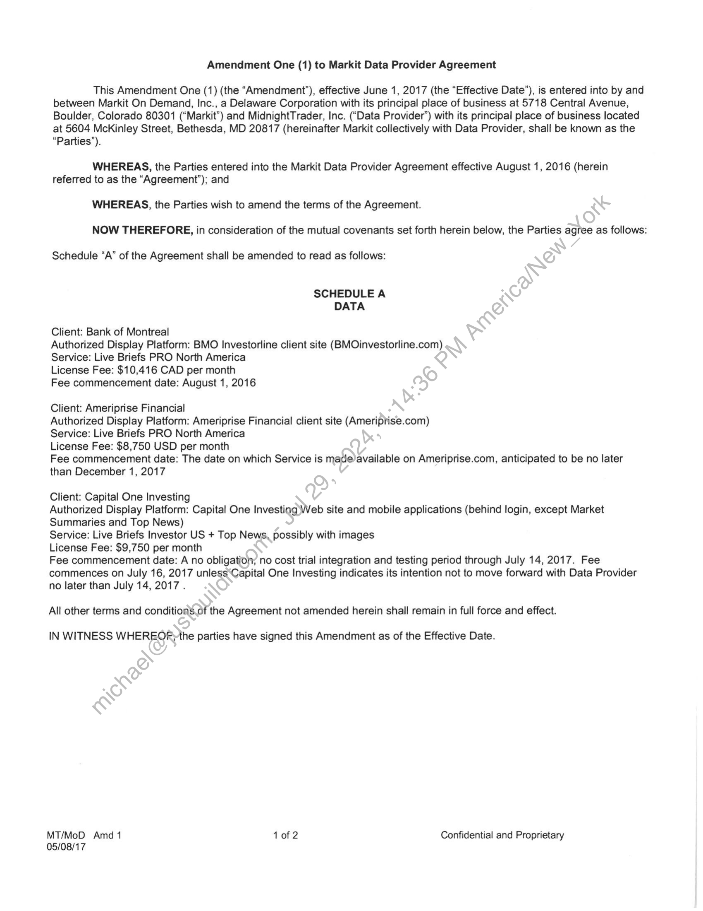
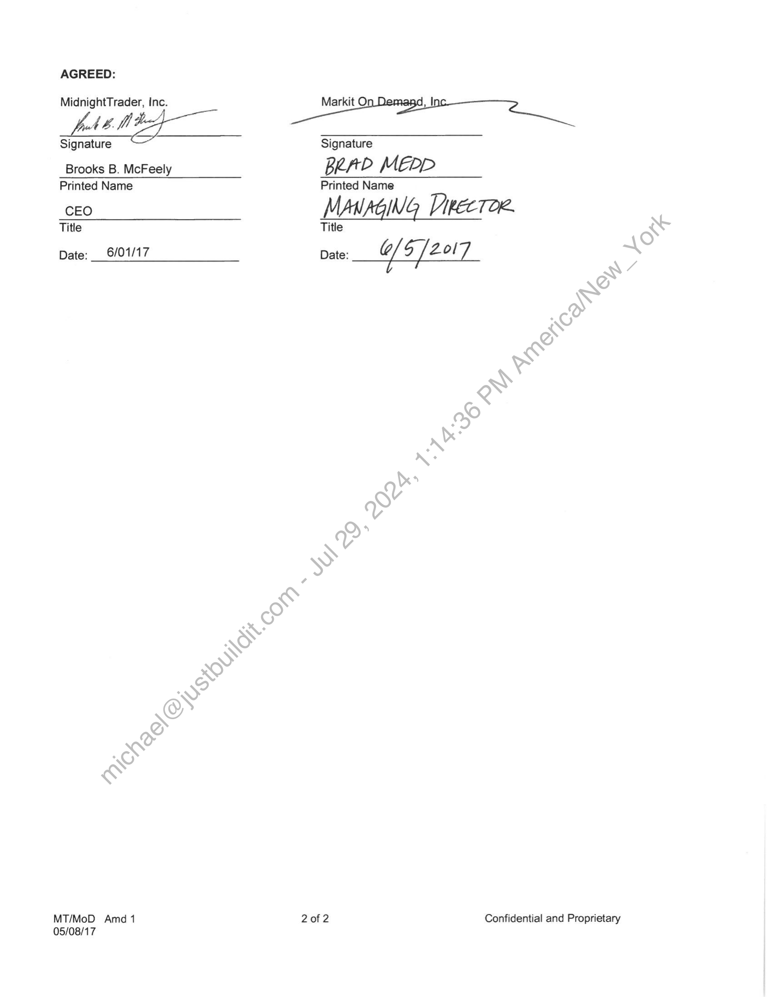

##### Amendment One (1) to Markit Data Provider Agreement]

  
````col
```col-md
flexGrow=.5
===
> [!info] [Page 1](_attachments/images_3.6.4.1.13.2MidnightTrader_MOD_Amendment1_20170601.pdf_155453/page_1.png)
> 
```  
```col-md
Amendment One (1) to Markit Data Provider Agreement  
This Amendment One (1) (the “Amendment”), effective June 1, 2017 (the “Effective Date”), is entered into by and
between Markit On Demand, Inc., a Delaware Corporation with its principal place of business at 5718 Central Avenue,
Boulder, Colorado 80301 (“Markit”) and MidnightTrader, Inc. (“Data Provider’) with its principal place of business located
at 5604 McKinley Street, Bethesda, MD 20817 (hereinafter Markit collectively with Data Provider, shall be known as the  
“Parties’).  
WHEREAS, the Parties entered into the Markit Data Provider Agreement effective August 1, 2016 (herein
referred to as the “Agreement”); and  
WHEREAS, the Parties wish to amend the terms of the Agreement.  
NOW THEREFORE, in consideration of the mutual covenants set forth herein below, the Parties agree as follows:  
Schedule “A” of the Agreement shall be amended to read as follows:  
SCHEDULE A
DATA  
Client: Bank of Montreal  
Authorized Display Platform: BMO Investorline client site (BMOinvestorline.com)
Service: Live Briefs PRO North America  
License Fee: $10,416 CAD per month  
Fee commencement date: August 1, 2016  
Client: Ameriprise Financial  
Authorized Display Platform: Ameriprise Financial client site (Ameriprise.com)  
Service: Live Briefs PRO North America  
License Fee: $8,750 USD per month  
Fee commencement date: The date on which Service is made/available on Ameriprise.com, anticipated to be no later  
than December 1, 2017  
Client: Capital One Investing  
Authorized Display Platform: Capital One Investing Web site and mobile applications (behind login, except Market
Summaries and Top News)  
Service: Live Briefs Investor US + Top News, possibly with images  
License Fee: $9,750 per month  
Fee commencement date: A no obligation; no cost trial integration and testing period through July 14, 2017. Fee
commences on July 16, 2017 unless‘Capital One Investing indicates its intention not to move forward with Data Provider  
no later than July 14, 2017.
All other terms and conditions.of the Agreement not amended herein shall remain in full force and effect.  
IN WITNESS WHEREOF;the parties have signed this Amendment as of the Effective Date.  
MT/MoD Amd 1 1 of 2 Confidential and Proprietary
05/08/17  
```
````
Notes:    
````col
```col-md
flexGrow=.5
===
> [!info] [Page 2](_attachments/images_3.6.4.1.13.2MidnightTrader_MOD_Amendment1_20170601.pdf_155453/page_2.png)
> 
```  
```col-md
AGREED:  
MidnightTrader, Inc. en a
VAL 7 ae  
Signature Signature  
Brooks B. McFeely Ber D MEPpP
Printed Name Printed Name  
CEO MANAGING DikecToR
Title Title  
Date: __ 6/01/17 Date: & 5/ Zol7  
MT/MoD Amd 1 2 of 2 Confidential and Proprietary
05/08/17  
```
````
Notes:  


![[_attachments/3.6.4.1.13.2 MidnightTrader_MOD_Amendment1_20170601.pdf]