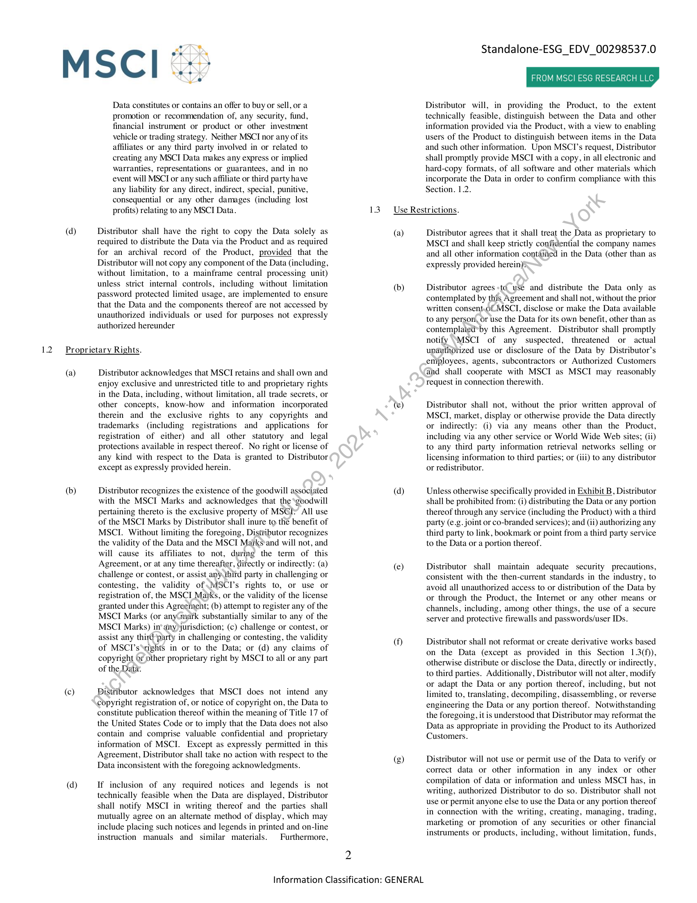

##### DATA DISTRIBUTION AGREEMENT]

  
````col
```col-md
flexGrow=.5
===
> [!info] [Page 1](_attachments/images_MSCI-ESG-Data-3.6.4.1.14.1.1Master-EDV_00298537.0_FO_012122_MarkitDigital_Revised_2-3-22v2.pdf_155056/page_1.png)
> 
```  
```col-md
MSCl  
Date of A;  
Standalone-ESG_EDV_00298537.0  
ROM MSCI ESG RESEARCH LLC  
DATA DISTRIBUTION AGREEMENT  
greement: February 3", 2022 (the “Effective Date”)  
Distributor wishes to receive the data contained in the product(s) set forth in each Schedule A (the product(s) listed in each Schedule A together with the data
contained therein, the "Data") attached hereto and made a part hereof. Additional Schedules A may be added to this Agreement from time to time by written  
agreement  
it of the parties.  
The parties to this Agreement, by their signatures below, acknowledge that they have read and agree to be bound by the terms and conditions of this
Agreement and each Schedule A signed by Distributor and MSCI.  
Mark  
it on Demand, Inc. (“Distributor”),  
5775 Flatiron Parkway  
Bould  
United States  
By  
ler, Colorado 80301-2849
DocuSigned by:  
Wetfacl Salerno  
Name  
SECTION 1.  
11  
Michael B7BG08303DE4aB  
(printed)  
MSCI ESG Research LLC (“MSCI”), a Delaware Corporation
7 World Trade Center  
250 Greenwich Street, 49th Floor  
New York, NY 10007, USA  
By  
Name.  
IT IS AGREED  
LICENSE  
Grant of License.  
(a)  
(b)  
Subject to all the provisions hereof, including all exhibits,
schedules and supplements annexed hereto, MSCI hereby
grants to Distributor a temporary, non-sublicensable, nontransferable, nonexclusive, limited license to: (i) electronically
disseminate and display the Data for the term set forth in
Section 7.1 only through Distributor’s product(s) described in
Schedule B (each, a “Product”) to Distributor’s customers for
use by such customers in accordance with all the terms afd
conditions of this Agreement; (ii) hyperlink to MSCT's web site,
https://www.msci.com/esg-integration, from any\\Distributor
web page containing MSCTI data or information, provided that
this license may be revoked at any time by MSCI without
affecting any of the other rights granted hereunder; and (iii) use
the MSCI Marks (as defined in Section 4.1) solely in
connection with Distributor's obligations in, and subject to the
terms and conditions of, Section4.1»  
Distributor shall distribute the,Data only to such customers of
Distributor who have executed agreements with MSCI for the
receipt of the Data and-which MSCT has authorized, by notice
in writing to Distributor, to receive the Data (each, an
“Authorized Customer”). Before distributing Data to any
Authorized*Customer, Distributor shall submit all requests to
msciesgappr9ve@msci.com (as may be updated by MSCI from
time to time on prior notice to Distributor). Such requests shall
include ‘company name, main contact name, main contact
information (address, phone number, e-mail address (as
ayailable)), and MSCI Data requested. MSCTI shall notify
Distributor of approved Authorized Customers.  
Additionally, Distributor may submit a request to MSCI via email to msciesgapprove@msci.com (as may be updated by
MSCI from time to time on prior notice to Distributor)
requesting approval for a Data trial. Such requests will include
company name, main contact name, main contact information
(address, phone number, e-mail address (as available)), the
requested Data and dates of the trial period. MSCI will notify
Distributor of approved trials for Authorized Customers.
Distributor shall ensure that each trial is turned off on the end  
Information Classification: GENERAL  
(printed)  
(c)  
(d)  
date. Additionally, Distributor will comply with any request
from MSCI to turn off a trial at any time.  
MSCI may from time to time by notice in writing to Distributor,
effective as of the time indicated in such notice, revoke the right
of any Authorized Customer to receive the Data or any portion
thereof.  
Within fifteen (15) business days of the end of each calendar
month, Distributor shall provide to MSCI a report in Excel
(xls) format containing the following information (including
any trials): (a) the name of each Authorized Customer receiving
any of the Data during such calendar month; (b) all types of
Data that each Authorized Customer received during such
calendar month; (c) location of each Authorized Customer
((address, city, state, country); d) the date on which each such
Authorized Customer began to receive such Data; and (e)
aggregate count of individual users of each Authorized
Customer by the individual user’s location.  
.Distributor shall display, or prominently provide a link to, on
each page or screen containing any Data the following
disclaimer (or such similar language as may be provided in
writing by MSCI):  
Copyright MSCI ESG Research LLC [Year Data were
provided to Distributor]. All Rights Reserved. Any
MSCI data, information or other materials (collectively,
the “Data”) available or utilized herein are the sole and
exclusive intellectual property of MSCI ESG Research
LLC, its affiliates, and/or its information providers
(“MSCI"). All MSCI Data is provided solely for your
internal use, and may not be reproduced or
redisseminated in any form or used as the basis for any
financial securities, funds, financial products or
instruments, or other investment vehicles or as the basis
for or in connection with any indices (custom or
otherwise) without express prior written permission
from MSCI. The MSCI Data is provided on an “as is”
basis and you assume the entire risk of any use you may
make of it. None of the MSCI Data or any use thereof is
intended to constitute a recommendation to make (or
refrain from making) any investment decision. No MSCI  
```
````
Notes:    
````col
```col-md
flexGrow=.5
===
> [!info] [Page 2](_attachments/images_MSCI-ESG-Data-3.6.4.1.14.1.1Master-EDV_00298537.0_FO_012122_MarkitDigital_Revised_2-3-22v2.pdf_155056/page_2.png)
> 
```  
```col-md
MSCI °:)  
(d)  
Ve  
Data constitutes or contains an offer to buy or sell, or a
promotion or recommendation of, any security, fund,
financial instrument or product or other investment
vehicle or trading strategy. Neither MSCI nor any of its
affiliates or any third party involved in or related to
creating any MSCI Data makes any express or implied
warranties, representations or guarantees, and in no
event will MSCI or any such affiliate or third party have
any liability for any direct, indirect, special, punitive,
consequential or any other damages (including lost
profits) relating to any MSCI Data.  
Distributor shall have the right to copy the Data solely as
required to distribute the Data via the Product and as required
for an archival record of the Product, provided that the
Distributor will not copy any component of the Data (including,
without limitation, to a mainframe central processing unit)
unl strict internal controls, including without limitation
password protected limited usage, are implemented to ensure
that the Data and the components thereof are not accessed by
unauthorized individuals or used for purposes not expressly
authorized hereunder  
1.2 Proprietary Rights.  
(a)  
(b)  
(©)  
(d)  
Distributor acknowledges that MSCI retains and shall own and
enjoy exclusive and unrestricted title to and proprietary rights
in the Data, including, without limitation, all trade secrets, or
other concepts, know-how and information incorporated
therein and the exclusive rights to any copyrights and
trademarks (including registrations and applications for
registration of either) and all other statutory and legal
protections available in respect thereof. No right or license of
any kind with respect to the Data is granted to Distributor
except as expressly provided herein.  
Distributor recognizes the existence of the goodwill associated
with the MSCI Marks and acknowledges that the ‘goodwill
pertaining thereto is the exclusive property of MSCI> All use
of the MSCI Marks by Distributor shall inure to the benefit of
MSCI. Without limiting the foregoing, Distributor recognizes
the validity of the Data and the MSCI Marks*and will not, and
will cause its affiliates to not, during the term of this
Agreement, or at any time thereafter, directly or indirectly: (a)
challenge or contest, or assist any.third party in challenging or
contesting, the validity of MSCI’s rights to, or use or
registration of, the MSCI Marks, or the validity of the license
granted under this Agreement; (b) attempt to register any of the
MSCI Marks (or any(mark substantially similar to any of the
MSCI Marks) in’ any) jurisdiction; (c) challenge or contest, or
assist any third'party in challenging or contesting, the validity
of MSCI’s‘rights in or to the Data; or (d) any claims of
copyright or other proprietary right by MSCT to all or any part
of the Data.  
Distributor acknowledges that MSCI does not intend any
copyright registration of, or notice of copyright on, the Data to
constitute publication thereof within the meaning of Title 17 of
the United States Code or to imply that the Data does not also
contain and comprise valuable confidential and proprietary
information of MSCI. Except as expressly permitted in this
Agreement, Distributor shall take no action with respect to the
Data inconsistent with the foregoing acknowledgments.  
If inclusion of any required notices and legends is not
technically feasible when the Data are displayed, Distributor
shall notify MSCI in writing thereof and the parties shall
mutually agree on an alternate method of display, which may
include placing such notices and legends in printed and on-line
instruction manuals and similar materials. Furthermore,  
Information Classification: GENERAL  
2  
Standalone-ESG_EDV_00298537.0  
FROM MSCI ESG RESEARCH L'  
Distributor will, in providing the Product, to the extent
technically feasible, distinguish between the Data and other
information provided via the Product, with a view to enabling
users of the Product to distinguish between items in the Data
and such other information. Upon MSCT’s request, Distributor
shall promptly provide MSCI with a copy, in all electronic and
hard-copy formats, of all software and other materials which
incorporate the Data in order to confirm compliance with this
Section. 1.2.  
1.3 Use Restrictions.  
(a)  
(b)  
(e)  
(d)  
()  
(g)  
Distributor agrees that it shall treat the Data as proprietary to
MSCI and shall keep strictly confidential the company names
and all other information contained in the Data (other than as
expressly provided herein)s  
Distributor agrees +té_yse and distribute the Data only as
contemplated by this Agreement and shall not, without the prior
written consent.of MSCI, disclose or make the Data available
to any person, or use the Data for its own benefit, other than as
contemplated*by this Agreement. Distributor shall promptly
notify \MSCI of any suspected, threatened or actual
unauthorized use or disclosure of the Data by Distributor’s
employees, agents, subcontractors or Authorized Customers
and shall cooperate with MSCI as MSCI may reasonably
request in connection therewith.  
Distributor shall not, without the prior written approval of
MSCI, market, display or otherwise provide the Data directly
or indirectly: (i) via any means other than the Product,
including via any other service or World Wide Web sites; (ii)
to any third party information retrieval networks selling or
licensing information to third parties; or (iii) to any distributor
or redistributor.  
Unless otherwise specifically provided in Exhibit B, Distributor
shall be prohibited from: (i) distributing the Data or any portion
thereof through any service (including the Product) with a third
party (e.g. joint or co-branded services); and (ii) authorizing any
third party to link, bookmark or point from a third party service
to the Data or a portion thereof.  
Distributor shall maintain adequate security precautions,
consistent with the then-current standards in the industry, to
avoid all unauthorized access to or distribution of the Data by
or through the Product, the Internet or any other means or
channels, including, among other things, the use of a secure
server and protective firewalls and passwords/user IDs.  
Distributor shall not reformat or create derivative works based
on the Data (except as provided in this Section 1.3(f)),
otherwise ibute or disclose the Data, directly or indirectly,
to third parties. Additionally, Distributor will not alter, modify
or adapt the Data or any portion thereof, including, but not
limited to, translating, decompiling, disassembling, or reverse
engineering the Data or any portion thereof. Notwithstanding
the foregoing, it is understood that Distributor may reformat the
Data as appropriate in providing the Product to its Authorized
Customers.  
Distributor will not use or permit use of the Data to verify or
correct data or other information in any index or other
compilation of data or information and unless MSCI has, in
writing, authorized Distributor to do so. Distributor shall not
use or permit anyone else to use the Data or any portion thereof
in connection with the writing, creating, managing, trading,
marketing or promotion of any securities or other financial
instruments or products, including, without limitation, funds,  
```
````
Notes:    
````col
```col-md
flexGrow=.5
===
> [!info] [Page 3](_attachments/images_MSCI-ESG-Data-3.6.4.1.14.1.1Master-EDV_00298537.0_FO_012122_MarkitDigital_Revised_2-3-22v2.pdf_155056/page_3.png)
> 
```  
```col-md
14  
SECTION 2.  
2.1  
2.2  
MSCI *:)  
synthetic or derivative securities (e.g., options, warrants, swaps,
and futures), whether listed on an exchange or traded over the
counter or on a private-placement basis or otherwise or to
create, market or promote any indices (custom or otherwise).  
(h) An authorized officer of Distributor shall certify in writing
annually that Distributor is in compliance with its obligations
and the restrictions set forth in this Agreement. MSCI or its
representative may, on giving Distributor ten (10) business days
prior written notice, audit the records and systems of Distributor
to verify compliance with this Agreement. A shorter notice will
be allowed where, in MSCT's sole discretion, MSCI in good
faith suspects a breach or threatened breach of the Agreement.
MSCT retains the right to audit Distributor for one (1) year after
termination or expiration of this Agreement. Distributor shall
cooperate with any reasonable requests of MSCI to facilitate
any such audit.  
(i) Distributor shall use the Data only as expressly permitted by
this Agreement and in accordance with all applicable laws,
rules and regulations. Except as expressly set forth herein,
Distributor shall have no other rights or license of any kind with
respect to the Data or any component thereof.  
Gi) Distributor acknowledges that a breach of its obligations to
MSCI under this Agreement, other than any payment
obligations hereunder, will result in irreparable and continuing
damage for which monetary damages may not be sufficient, and
agrees that MSCI will be entitled to seek, in addition to its other
rights and remedies hereunder or at law, injunctive and/or other
equitable relief, and such further relief as may be proper from a
court of competent jurisdiction. All remedies of MSCI set forth
in this Agreement are cumulative and in addition to and not in
lieu of any other remedy of MSCT at law or in equity.  
Distributor’s Product.  
(a) Distributor shall provide to MSCI ID’s, passwords, log-on or
sign-on manuals or documentation or similar security and
access details as are necessary to enable MSCTI to access the
Product. Such access shall be provided, without charge, for the
duration of this Agreement, including any.renewals hereof.  
(b) Upon request by MSCI and at no.cost,to MSCI, Distributor shall
prominently place a graphic representation of the MSCI logo on
all pages or screens of the Product containing any Data. Such
graphic representation willbe supplied by MSCI in a mutually
agreed graphic format.  Distributor shall not make any changes
in, additions to or deletions from the submitted graphics without
MSCT’s prior writteh consent.  
DELIVERY  
Delivery. MSCI, or any authorized distributor as set forth in the
applicable Schedule A, will provide Distributor with the Data, including
any updates and modifications which from time to time may be made
thereto and which are provided generally and without any additional
charge by MSCI to other entities licensed to have access to the Data.
MSCT shall not (a) be responsible for the procurement, installation or
maintenance of any equipment on which the Data is accessed by
Distributor nor for any communications connection by which the Data is
transmitted; (b) have any liability for communication delays or
interruptions of the Data; (c) be responsible for the transmission to
Distributor of the Data beyond the point of MSCI's computer facility; or
(d) be liable for any fees payable by Distributor for any communications
lines, to any person, firm or entity.  
Changes in MSCI Database. Distributor acknowledges that MSCT, in
its sole discretion, may: (a) cease or suspend compiling, calculating,  
3  
SECTION 3.  
3.1  
3.2  
SECTION 4.  
41  
42  
Standalone-ESG_EDV_00298537.0  
FROM MSCI ESG RESEARCH L'  
publishing or distributing all or any part of the Data; (b) make changes
in the titles, names, format, organization or content of the Data or a
portion thereof; or (c) discontinue or alter the existing communications
facilities that disseminate the Data. MSCI shall provide Distributor with
reasonable prior notice of any material changes in the Data or
Distributor’s ability to receive and utilize the Data as contemplated
herein, unless a malfunction in MSCI’s system requires otherwise or
circumstances preclude advance notice.  
FEES  
License Fees. In consideration of the license granted hereunder,
Distributor agrees to pay the charges set forth in each Schedule A,
pursuant to the terms hereof and the terms-set forth in the applicable
Schedule A. Such charges are subject.te’change by MSCI from time to
time upon written notice to Distributor: All charges to MSCI hereunder
are exclusive of any taxes and déliyery costs, which shall be the sole
responsibility of Distributor: Distributor shall pay interest computed at
the rate of one and one-half percent (1.5%) per month or the maximum
rate permitted by law, whichever is lower, on any amounts due hereunder
that are remitted more than thirty (30) days late. All charges are due
within thirty (30) days ‘from Distributor‘s receipt of the relevant invoice.
Should any audit, conducted pursuant to Section 1.3(h) reveal an
underpayment of fees by Distributor in respect of the period covered by
the audit: (a) Distributor shall forthwith pay such fees to MSCI plus
interest\at\the rate of one and one-half percent (1.5%) per month or the
maximum rate permitted by law, whichever is lower, which interest
charges shall begin accruing on the appropriate due date and shall
continue until such fees are paid in full; and (b) if such underpayment is
equal to more than five percent (5%) of the fees owed in respect of the
period covered by the audit, then the reasonable cost of such audit
(including travel costs) shall be borne by Distributor.  
Taxes. Distributor agrees to pay all applicable taxes, including without
limitation, all national, territorial, state and local taxes, however
designated, arising out of this Agreement, other than taxes in the form of
a tax on MSCT’s income.  
MARKETING AND CUSTOMER RELATIONS  
Marketing. Distributor shall make reference in its marketing of the
Product to MSCI as the source of data available in connection with the
Product; provided, however, that no reference to MSCI shall imply any
endorsement of Distributor or the Product by MSCI or contain any
misleading reference to the nature or status of the relationship between
Distributor and MSCI. Prior to the initial use by Distributor of any
marketing materials, user documentation, or any other materials used in
connection with Distributor’s marketing and distribution of the Product
which mention MSCI or the Data, Distributor shall submit to MSCI
copies of such materials and MSCI shall have the right to approve or
disapprove, in its sole discretion, any reference to any MSCI trade
names, trademarks, or service marks (collectively, the “MSCI Marks”),
in such materials. Distributor shall not use any such materials without
MSCTI’s prior written approval, which approval will not be unreasonably
withheld. Failure of MSCI to respond within ten (10) business days after
receipt of any such submission shall be deemed to constitute MSCI’s
approval.  
Distributor also agrees to: (i) participate in a mutually agreed upon joint
press release with MSCI, to be released by MSCI and Distributor,
announcing the availability of the Data via the Product(s) and (ii)
following the initial press release, distribute at least one broad external
communication per year regarding the availability of the Data via
Distributor.  
Distributor’s Authorized Customers.  
(a) Distributor shall be solely responsible for training its
Authorized Customers and other support activities in  
Information Classification: GENERAL  
```
````
Notes:    
````col
```col-md
flexGrow=.5
===
> [!info] [Page 4](_attachments/images_MSCI-ESG-Data-3.6.4.1.14.1.1Master-EDV_00298537.0_FO_012122_MarkitDigital_Revised_2-3-22v2.pdf_155056/page_4.png)
> 
```  
```col-md
SECTION 5.  
5.1  
5.2  
SECTION 6.  
MSCI °:)  
connection with its distribution of the Data. MSCT shall not be
required to communicate directly with any Authorized
Customer of Distributor except as may otherwise be agreed in
particular cases.  
(b) Distributor shall enforce the use restrictions in its agreements
with its Authorized Customers receiving any Data and shall
promptly notify MSCI of any actual, suspected or threatened
breach of such restrictions.  
(c) Upon execution of this Agreement and on a quarterly basis
thereafter, Distributor shall provide MSCI with a list of all thencurrent Authorized Customers.  
DISCLAIMERS; LIMITATION OF LIABILITY  
Exclusion of Warranties. ALTHOUGH MSCI SHALL OBTAIN
INFORMATION FOR INCLUSION IN THE DATA FROM SOURCES
THAT MSCI CONSIDERS RELIABLE, THE DATA IS PROVIDED
TO DISTRIBUTOR "AS IS" AND NEITHER MSCI, ANY OF ITS
AFFILIATES, ANY OF ITS OR THEIR DIRECT OR INDIRECT
INFORMATION PROVIDERS NOR ANY THIRD PARTY
INVOLVED IN, OR RELATED TO, COMPILING, COMPUTING OR
OTHERWISE CREATING THE DATA OR ANY COMPONENT
THEREOF MAKES ANY REPRESENTATION OR WARRANTY OF
ANY KIND TO DISTRIBUTOR OR ANY THIRD PARTY, EITHER
EXPRESS OR IMPLIED, WITH RESPECT TO THE DATA, THE
TIMELINESS THEREOF, THE RESULTS TO BE OBTAINED BY
THE USE THEREOF OR ANY OTHER MATTER. FURTHER, MSCI,
ITS AFFILIATES, ITS AND THEIR DIRECT AND INDIRECT
INFORMATION PROVIDERS AND ANY THIRD PARTY
INVOLVED IN, OR RELATED TO, COMPILING, COMPUTING OR
OTHERWISE CREATING THE DATA OR ANY COMPONENT
THEREOF EXPRESSLY DISCLAIM, AND DISTRIBUTOR
WAIVES, ANY AND ALL IMPLIED WARRANTIES, INCLUDING,
WITHOUT LIMITATION, WARRANTIES OF ORIGINAEITY,
ACCURACY, COMPLETENESS, TIMELINESS, NONINFRINGEMENT, MERCHANTABILITY AND FITNESS\FOR A
PARTICULAR PURPOSE.  
Limitation of Liability. DISTRIBUTOR ASSUMES THE ENTIRE
RISK OF ANY USE DISTRIBUTOR MAY MAKE, OR PERMIT OR
CAUSE TO BE MADE, OF THE DATA. (NEITHER MSCI, ITS
AFFILIATES, ITS OR THEIR DIRECT OR INDIRECT
INFORMATION PROVIDERS NOR \*ANY THIRD PARTY
INVOLVED IN, OR RELATED TO,GOMPILING, COMPUTING OR
OTHERWISE CREATING THE~DATA OR ANY COMPONENT
THEREOF SHALL HAVE AN¥ BIABILITY TO DISTRIBUTOR OR
ANY THIRD PARTY FOR<ANY DAMAGES OF ANY KIND
ARISING OUT OF,.QR’ IN CONNECTION WITH, THIS
AGREEMENT OR (THE SUBJECT MATTER HEREOF, ANY
ERRORS, DELAYS}OMISSIONS OR INTERRUPTIONS OF OR
RELATED TO THE/DATA OR DISTRIBUTOR’S OR ANY THIRD
PARTY'S USESOF OR INABILITY TO USE THE DATA OR ANY
PORTION THEREOF, OR OTHERWISE ARISING OUT OF, OR IN
CONNECTION WITH, THIS AGREEMENT, WHETHER DIRECT,
INDIRECT, INCIDENTAL, SPECIAL, PUNITIVE OR
CONSEQUENTIAL (INCLUDING, WITHOUT LIMITATION, LOSS
OF USE, LOSS OF PROFITS OR REVENUES OR OTHER
ECONOMIC LOSS OF DISTRIBUTOR OR ANY THIRD PARTY),
WHETHER IN TORT (INCLUDING, WITHOUT LIMITATION,
NEGLIGENCE OR STRICT LIABILITY), CONTRACT OR
OTHERWISE, AND WHETHER OR NOT MSCI, ITS AFFILIATES,
ITS OR THEIR DIRECT OR INDIRECT INFORMATION
PROVIDERS OR ANY SUCH THIRD PARTY HAS BEEN ADVISED
OF, OR OTHERWISE MIGHT HAVE ANTICIPATED, THE
POSSIBILITY OF SUCH DAMAGES.  
INDEMNIFICATION  
4  
6.1  
6.2  
63  
64  
Standalone-ESG_EDV_00298537.0  
FROM MSCI ESG RESEARCH LLC  
Distributor Indemnity. Except as set forth in Section 6.2 and subject to
Section 6.4, Distributor agrees to indemnify, defend and hold harmless
MSCL, its affiliates and subsi ies, any of its and their direct or indirect
information providers and any third party involved in, or related to,
compiling, computing or otherwise creating the Data, and any of their
respective officers, directors, managers, employees, agents, consultants
or other representatives (collectively, the "€MSCI Indemnified Parties")
from and against any claims, losses, damages, liabilities, c and
expenses, including, without limitation, reasonable attorneys' and
experts’ fees and costs, as incurred, arising in any manner out of (a)
Distributor’s or any third party's use of, or inability-fo. use, the Product
or the Data, (b) any breach by Distributor of any provision contained in
this Agreement or (c) the circumstances described in Section 6.3.  
MSCI Indemnity. Subject to Sections 64 and 6.4, MSCI, at its expense,
will indemnify, defend and hold hatmiess Distributor and its officers,
directors, managers or employees, (collectively, the "Distributor
Indemnified Parties") against aly ¢laim or action threatened or brought
against any Distributor Indemnified Party based on or arising out of any
claim that the Data or.any use thereof constitutes an infringement,
violation, contraventiqnor breach of any patent, copyright or trademark
or constitutes the muSappropriation of a trade secret of any third party.
Without limiting. the foregoing, and notwithstanding anything to the
contrary in this Agreement, if the Data, or any component or use thereof,
becomes, of in MSCT's reasonable opinion is likely to become, the
subject of\a claim or action of infringement, contravention or breach of
any patent, copyright or trademark or of misappropriation of a trade
setret of any third party, then MSCTI shall have the right, in its sole
discretion, to either: (i) procure for Distributor the right to continue
using such Data, or such relevant component thereof, as contemplated
hereunder; (ii) modify such Data, or such relevant component thereof, to
render same non-infringing; (iii) replace such Data, or such relevant
component thereof, with equally suitable, functionally equivalent noninfringing data; or (iv) immediately terminate, in MSCT's discretion, this
Agreement, a Schedule A or any individual MSCI product licensed
hereunder.  
Exceptions to MSCI Indemnity. Notwithstanding anything to the
contrary in this Agreement, MSCI shall have no liability or obligation to
Distributor under Section 6.2 if any such claim or action arises from or
in connection with: (a) any negligent act or omission by any Distributor
Indemnified Party; (b) Distributor’s use of other than the current version
of the Data; (c) Distributor’s modification of the Data; (d) Distributor’s
use of the Data in combination with any software or other product or
material not provided by MSCI; (e) any compliance by MSCI with
Distributor’s designs, specifications or modifications; or (f) Distributor’s
use of the Data other than forth in this Agreement. In the event
any of the foregoing occurs, Distributor shall indemnify MSCI pursuant
to Section 6.1.  
Indemnification Procedures. The indemnified party shall promptly
notify the indemnifying party of any such claim or action (although
failure to do so will only relieve the indemnifying party of its obligations
hereunder to the extent the indemnifying party was prejudiced thereby).
The indemnified party shall reasonably cooperate with the indemnifying
party, at the indemnifying party's expense, in the defense of any such
claim or action. The indemnifying party shall have full control over the
defense and settlement of any such claim or action, subject to this
Section 6.4. The indemnified party shall have the right, at its own
expense, to participate in the defense of any such claim or action;
provided, however, that, in the event that Distributor shall fail to appoint
an attorney within ten (10) calendar days after an MSCI Indemnified
Party has notified Distributor of any such claim or action, the MSCI
Indemnified Party shall have the right to select and appoint an alternative
attorney and the reasonable cost and expense thereof shall be paid by
Distributor. The indemnifying party shall have total control over all
negotiations for the settlement or compromise of a claim or action which
such party is required to defend and/or handle under this Section 6,
provided that such settlement or compromise is solely monetary in
nature. Without limiting the generality of the foregoing, the  
Information Classification: GENERAL  
```
````
Notes:    
````col
```col-md
flexGrow=.5
===
> [!info] [Page 5](_attachments/images_MSCI-ESG-Data-3.6.4.1.14.1.1Master-EDV_00298537.0_FO_012122_MarkitDigital_Revised_2-3-22v2.pdf_155056/page_5.png)
> 
```  
```col-md
SECTION 7.  
71  
72  
73  
MSCI *:)  
indemnifying party may not, without the other party's prior written
consent, settle, compromise or consent to the entry of any judgment in
any such commenced or threatened claim or action, unless such
settlement, compromise or consent: (a) includes an unconditional release
of the relevant Indemnified Party from all liability arising out of such
commenced or threatened claim or action; and (b) does not include a
statement as to, or an admission of fault, culpability or failure to act by
or on behalf of, the relevant Indemnified Party or otherwise adversely
affect the relevant Indemnified Party.  
TERM AND TERMINATION  
The initial term of this Agreement shall be for one (1) year, commencing
on the Effective Date, and shall automatically renew for successive one
(1) year renewal terms at MSCT's then prevailing charges or as otherwise
agreed in writing, unless earlier terminated as provided herein. In the
event this Agreement is terminated for any reason: (a) Distributor shall
pay all amounts due and owing to MSCI as of the effective date of such
termination; and (b) except as set forth in Section7.2(a) below,
Distributor shall not be entitled to any refund or credit of fees paid or
payable hereunder.  
This Agreement, any Schedule A or any individual MSCI product
licensed hereunder, may be terminated as follows:  
(a) By MSCI at any time sixty (60) days following written notice
to Distributor in which event MSCT shall credit Distributor with
the pro-rata portion of any pre-paid fees for any applicable Data
representing the unused portion of such fees;  
(b) By Distributor or MSCI without cause on written notice to the
other party at least thirty (60) days before the next annual
renewal term;  
(c) By MSCI at any time ten (10) days following written deniand
to Distributor, if Distributor shall have failed to pay any amount
due hereunder;  
(d) Subject to Section 7.2(c), by MSCI immediately upon notice to
Distributor in the event of any breach by the.Distributor of any
of the terms of this Agreement; and  
(e) By Distributor on written notice to. MS€I if MSCI fails to cure
any breach of the terms of thissAgreement within thirty (30)
days after receipt of such writtennotice.  
(f) By MSCI immediately ifrequired by law, rule or regulation, or
by a provider of data to. MSCI.  
(a) Upon termination of this Agreement, a Schedule A or any MSCI
product for.any reason, Distributor shall return to MSCI all
copies ofsthe terminated Data and all components thereof (the
"Terminated Data") in Distributor's possession or control.  
(b) Notwithstanding Section 7.3(a), if Distributor reasonably
determines that it would be unduly onerous to return or destroy
copies of the Terminated Data which are commingled with
other data in Distributor’s data-backup files, Distributor may
retain such copies of the Terminated Data but Distributor may
not use such copies of the Terminated Data. Nothing contained
in this Section 7.3(b) shall prevent Distributor from using databackup files containing Terminated Data to restore lost data of
Distributor provided that if copies of any Terminated D: We
created as a result of such use of the data-backup files, such
copies of any Terminated Data shall be destroyed or returned to
MSCI.  
5  
SECTION 8.  
Standalone-ESG_EDV_00298537.0  
FROM MSCI ESG RESEARCH  
CERTAIN THIRD PARTY DATA  
To the extent the Data includes CUSIP identifiers, then the following
terms and conditions shall apply:  
Distributor agrees and acknowledges that the CUSIP Database and the
information contained therein is and shall remain valuable intellectual
property owned by, or licensed to, the American Bankers Association
("ABA"), and CUSIP Global Services (“CGS”) (CGS is operated on
behalf of the ABA by S&P Capital IQ), and that no proprietary rights are
being transferred to Distributor in such materials\or in any of the
information contained therein. Any use by Distributor outside of the
clearing and settlement of transactions requires a license from the CGS,
along with an associated fee based on usage.“Distributor agrees that
misappropriation or misuse of such materials will cause serious damage
to CGS and ABA and that in su¢levent money damages may not
constitute sufficient compensatiom to CGS and ABA; consequently,
Distributor agrees that in the, event of any misappropriation or misuse,
CGS and ABA shall have the right to obtain injunctive relief in addition
to any other legal or financial remedies to which CGS and ABA may be
entitled.  
Distributor agrees ‘that Distributor shall not publish or distribute in any
medium the’CUSiP Database or any information contained therein or
summaries of subsets thereof to any person or entity except (i) in
conneetion) with the normal clearing and settlement of security
transactions; and (ii) on behalf of DISTRIBUTOR, provided Distributor
has ‘the appropriate agreement in place with CGS to distribute CUSIP
Data. Distributor further agrees that the use of CUSIP numbers and
descriptions is not intended to create or maintain, and does not serve the
purpose of the creation or maintenance of, a master file or database of
CUSIP descriptions or numbers for itself or any third party recipient of
such service and is not intended to create and does not serve in any way
as a substitute for the CUSIP MASTER TAPE, PRINT, DB, INTERNET,
ELECTRONIC, CD-ROM Services and/or any other future services
developed by CGS.  
NEITHER CGS, ABA NOR ANY OF THEIR AFFILIATES MAKE
ANY WARRANTIES, EXPRESS OR IMPLIED, AS TO THE
ACCURACY, ADEQUACY OR COMPLETENESS OF ANY OF THE
INFORMATION CONTAINED IN THE CUSIP DATABASE. ALL
SUCH MATERIALS ARE PROVIDED TO REDISTRIBUTOR ON AN
"AS IS" BASIS, WITHOUT ANY WARRANTIES AS TO
MERCHANTABILITY OR FITNESS FOR A_ PARTICULAR
PURPOSE OR USE NOR WITH RESPECT TO THE RESULTS
WHICH MAY BE OBTAINED FROM THE USE OF SUCH
MATERIALS. NEITHER CGS, ABA NOR THEIR AFFILIATES
SHALL HAVE ANY RESPONSIBILITY OR LIABILITY FOR ANY
ERRORS OR OMISSIONS NOR SHALL THEY BE LIABLE FOR
ANY DAMAGES, WHETHER DIRECT OR INDIRECT, SPECIAL OR
CONSEQUENTIAL EVEN IF THEY HAVE BEEN ADVISED OF THE
POSSIBILITY OF SUCH DAMAGES. IN NO EVENT SHALL THE
LIABILITY OF CGS, ABA OR ANY OF THEIR AFFILIATES
PURSUANT TO ANY CAUSE OF ACTION, WHETHER IN
CONTRACT, TORT, OR OTHERWISE EXCEED THE FEE PAID BY
REDISTRIBUTOR FOR ACCESS TO SUCH MATERIALS IN THE
MONTH IN WHICH SUCH CAUSE OF ACTION IS ALLEGED TO
HAVE ARISEN. FURTHERMORE, CGS AND ABA SHALL HAVE
NO RESPONSIBILITY OR LIABILITY FOR DELAYS OR FAILURES
DUE TO CIRCUMSTANCES BEYOND THEIR CONTROL.  
Distributor agrees that the foregoing terms and conditions shall survive
any termination of its right of access to the materials identified above.  
Notwithstanding anything to the contrary herein, the foregoing terms and
conditions shall not affect, but shall be subject to, any direct agreement
between (i) Distributor and (ii) CGS or ABA.  
Information Classification: GENERAL  
```
````
Notes:    
````col
```col-md
flexGrow=.5
===
> [!info] [Page 6](_attachments/images_MSCI-ESG-Data-3.6.4.1.14.1.1Master-EDV_00298537.0_FO_012122_MarkitDigital_Revised_2-3-22v2.pdf_155056/page_6.png)
> 
```  
```col-md
MSCI *:)  
SECTION 9. BINDING EFFECT; ASSIGNMENT  
This Agreement shall not be assigned or transferred by Distributor without prior
written consent of MSCI, and any attempt by Distributor to so assign or transfer
this Agreement without such written consent shall be null and void. MSCI may
perform any of its duties hereunder either directly or by or through its
distributors or agents. This Agreement shall be valid and binding on the parties
hereto and their successors and permitted assigns.  
SECTION 10. RELATIONSHIP OF THE PARTIES  
The parties are independent contractors. Nothing in this Agreement will be
construed to constitute or appoint either party as the agent, partner, joint
venturer or representative of the other party for any purpose whatsoever, or to
grant to either party any right or authority to assume or create any obligation or
responsibility express or implied, for or on behalf of or in the name of the other,
or to bind the other in any way or manner whatsoever.  
SECTION 11. GOVERNING LAW; JURISDICTION; JURY WAIVER  
This Agreement shall be governed by, and construed in accordance with, the
laws of the State of New York without regard to its conflict or choice of laws
principles. The parties hereby consent to the exclusive jurisdiction of, and
venue in, any federal or state court of competent jurisdiction located in the
Borough of Manhattan, New York City for the purposes of adjudicating any
matter arising from or in connection with this Agreement. THE PARTIES
UNCONDITIONALLY WAIVE THEIR RESPECTIVE RIGHTS TO A JURY
TRIAL FOR ANY CLAIM OR CAUSE OF ACTION BASED UPON OR
ARISING OUT OF, DIRECTLY OR INDIRECTLY, THIS AGREEMENT,
ANY OF THE RELATED DOCUMENTS, AND/OR ANY DEALINGS
BETWEEN THEM RELATING TO THE SUBJECT MATTER OF THIS
TRANSACTION OR ANY RELATED TRANSACTIONS.  
SECTION 12. NOTICES  
Notices and other communications under this Agreement shall be in writing
and, except as otherwise provided herein, may be sent by facsimile and, if sent
by facsimile, will be deemed delivered upon confirmation of transmi n.
Notwithstanding the foregoing, notices and communications made, under
Section 6 or 7 of this Agreement shall be: (a) in writing; (b) delivered by hand
or by registered or certified mail, return receipt requested, to MSCI at the
addresses set forth below and to Distributor to the attention of the individual
designated for such purposes at Distributor 's address as setforth on page one
of this Agreement, or to such addresses as either party shal) specify by a written
notice to the other; and (c) deemed given upon receipt.  
Notice to MSCI: MSCIESG Research LLC  
7 World Trade Center  
250 Greenwich Street, 49th Floor
New. York, NY 10007, USA
Attn MSCI Finance Department
Fax: 212-804-2919  
with a copy,to (which shall not constitute notice hereunder):  
MSCIESG Research LLC  
7 World Trade Center  
250 Greenwich Street, 49th Floor
New York, NY 10007, USA
Attn: General Counsel  
Fax: 212-804-2906  
SECTION 13. SURVIVAL  
Any provision of this Agreement which, by its nature, would survive
termination of this Agreement shall survive any such termination of this
Agreement, including, without limitation, Sections 3, 5, 6 and 8 through 16,
inclusive, and Sections 1 .3(j) and 7.3.  
6  
Standalone-ESG_EDV_00298537.0  
FROM MSCI ESG RESEARCH  
SECTION 14. FORCE MAJEURE  
MSCI shall not be responsible for any delay or failure in performance of its
obligations under this Agreement resulting from acts beyond the control of
MSCI, including but not limited to, any act of God, act of governmental
authority, act of public enemy, act of terrorism, computer or system failure, or
due to war, riot, fire, flood, civil commotion, insurrection, labor difficulty
(including, without limitation any strike, or other work stoppage or slowdown),
or severe or adverse weather conditions.  
SECTION 15. COUNTERPARTS  
This Agreement may be executed in counterparts, which counterparts, taken
together, shall constitute one agreement and each party Hereto may execute this
Agreement by signing such counterpart. The-parties hereby agree that an
authorized representative of either party may\execute this Agreement and any
schedules, addenda, exhibits, amendments\or,other documents or modifications
to or governed by this Agreement using,an electronic signature, and any such
electronic signature shall be deemedveffective, binding and enforceable against
such party.  
SECTION 16. MISCELLANEOUS  
This Agreement, together with all schedules hereto, supersedes all prior
agreements and understandings, and constitutes the complete agreement and
understanding between the parties with respect to the subject matter hereof. No
amendmentver other modification to this Agreement shall be valid or binding
with respect to either party unless acknowledged and agreed to in writing and
signed by<a duly authorized officer of each party. No breach, default or
threatened breach of this Agreement by either party shall relieve the other party
of ‘its obligations or liabilities under this Agreement with respect to the
protection of the property or proprietary nature of any property which is the
subject of this Agreement. Any forbearance or delay on the part of either party
in enforcing any provision of this Agreement or any of its rights hereunder shall
not be construed as a waiver of such provision or of a right to enforce same for
such occurrence or any future occurrence. Except for MSCI and Distributor,
no other party is intended, or shall be deemed, to be a beneficiary of any
provision of this Agreement, provided that this sentence shall not be interpreted
as affecting the rights of any MSCI Indemnified Parties or Distributor
Indemnified Parties as set forth in this Agreement. In the event any one or more
provisions of this Agreement shall for any reason be held invalid, illegal or
unenforceable by a court of competent jurisdiction, the remaining provisions of
this Agreement shall be unimpaired and shall remain in full force and effect,
and the invalid, illegal or unenforceable provisions shall be replaced by a valid,
legal and enforceable provision that comes closest to the intent of the parties
underlying the invalid, illegal or unenforceable provision. To the extent
permitted by applicable law, the parties acknowledge that this Agreement and
the transactions contemplated herein shall not be subject to the Uniform
Computer Information Transactions Act (prepared by the National Conference
of Commissioners on Uniform State Laws) as currently enacted by any
jurisdiction or as may be codified or amended from time to time by any
jurisdiction. The heading of the Articles, Sections, paragraphs and subparagraphs of this Agreement are for general information and reference only
and they in no way define, limit, or describe the scope of the provisions of such
sections and shall not be considered in the interpretation or enforcement of this
Agreement. Further, the parties agree that the terms and conditions of this
Agreement are the result of negotiations between the parties and that this
Agreement shall not be construed in favor of or against any party by reason of
the extent to which any party or its professional advisors participated in the
preparation of this Agreement.  
Information Classification: GENERAL  
```
````
Notes:    
````col
```col-md
flexGrow=.5
===
> [!info] [Page 7](_attachments/images_MSCI-ESG-Data-3.6.4.1.14.1.1Master-EDV_00298537.0_FO_012122_MarkitDigital_Revised_2-3-22v2.pdf_155056/page_7.png)
> 
```  
```col-md
AA Standalone-ESG_EDV_00298537.0  
oe y
eo.
e t / FROM MSCI ESG RESEARCH  
SCHEDULE B  
DISTRIBUTOR’S PRODUCT(S)  
Name of the Product(s): Markit Digital web interfaces
interfaces where users are required to open an account and register with Markit Digital.  
Narrative Description of the Product(s):
Markit Digital designs, builds and hosts web-based interfaces for financial services clients. Such services include, but are not limited to:
1. HTML pages
2. PDF reports
3. Tools (portfolios, alerts, screening tools, etc)  
Delivery Media (URL Address, if applicable):
Markit Digital has 3 different delivery methods for the services:
1. Public Web Sites (no password is required). End Users are not required to agree to click through terms as outlined in Seétion | .1(b) of the Agreement but each
such site must comply with the disclaimer requirements of Section 1.1(b) of the Agreement
2. Client Password Protected Web Sites where End Users are required to open an account and register with the applicable Customer. These sites are typically
private labeled with a Customer’s branding. However, Distributor designs, develops and hosts the interfaces-and therefore controls distribution and display of
the data.
3. Markit Digital Password Protected  
Regularity & Method of Update:
Continuously being enhanced and updated depending on client need.  
C-1
Information Classification: GENERAL  
```
````
Notes:  


![[_attachments/MSCI-ESG-Data-3.6.4.1.14.1.1 Master-EDV_00298537.0_FO_012122_Markit Digital_Revised_2-3-22 v2.pdf]