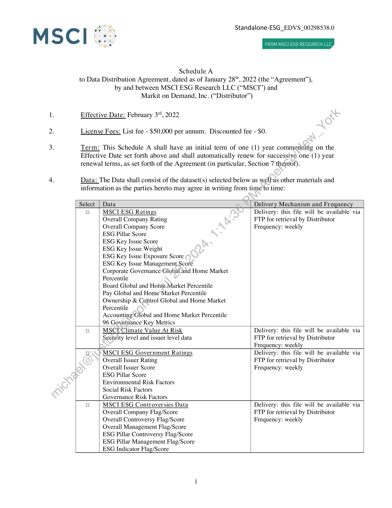
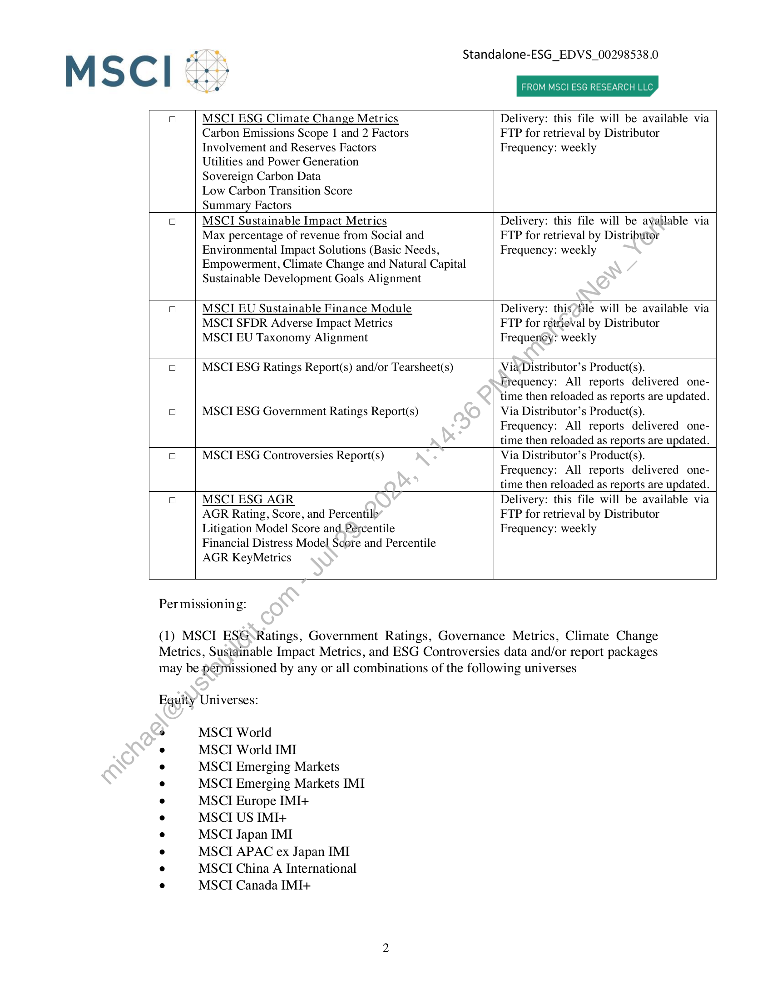
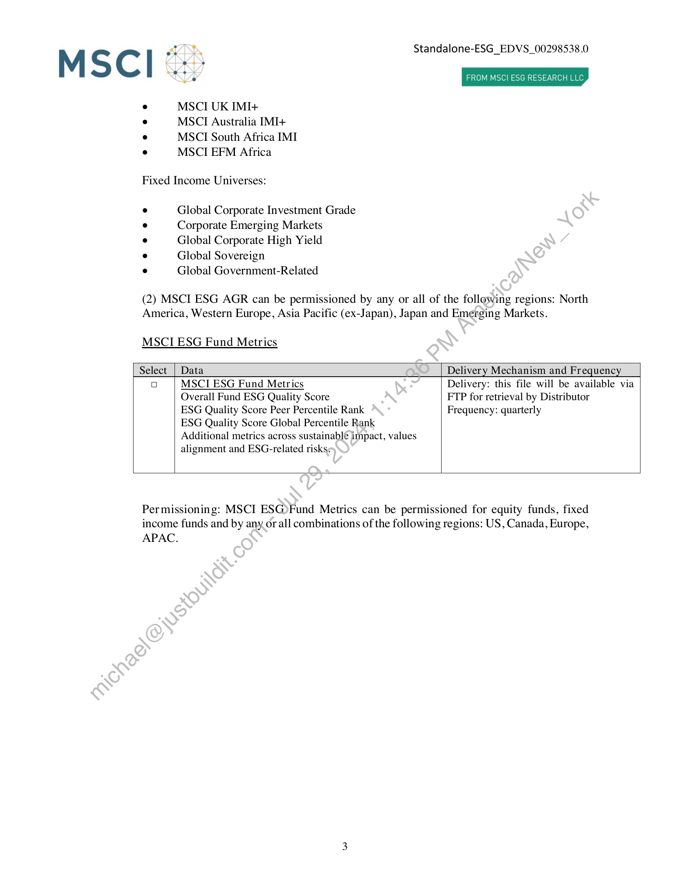
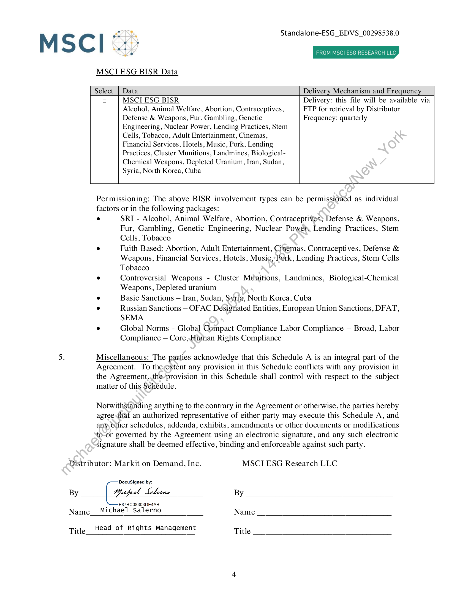

##### Schedule A to Data Distribution Agreement]

  
````col
```col-md
flexGrow=.5
===
> [!info] [Page 1](_attachments/images_MSCI-ESG-Data-3.6.4.1.14.1.2Schedule-EDVS_00298538.0_FO_012122_MarkitDigital_Revised_2-3-22v2.pdf_155403/page_1.png)
> 
```  
```col-md
MSCl  
FANS
oe sy
eo.
ee  
se  
Schedule A  
Standalone-ESG_EDVS_00298538.0  
FROM MSCI ESG RESEARCH LLC  
to Data Distribution Agreement, dated as of January 28", 2022 (the “Agreement”),
by and between MSCI ESG Research LLC (“MSCTI’) and
Markit on Demand, Inc. (“Distributor”)  
1. Effective Date: February 3", 2022
2. License Fees: List fee - $50,000 per annum. Discounted fee - $0.
3. Term: This Schedule A shall have an initial term of one (1) year commencing on the  
Effective Date set forth above and shall automatically renew for successive one (1) year
renewal terms, as set forth of the Agreement (in particular, Section 7 thereof).  
4. Data: The Data shall consist of the dataset(s) selected below as well\as other materials and
information as the parties hereto may agree in writing from time to time:  
Select  
Data  
Delivery Mechanism and Frequency  
i)  
MSCIESG Ratings
Overall Company Rating  
Overall Company Score  
ESG Pillar Score  
ESG Key Issue Score  
ESG Key Issue Weight  
ESG Key Issue Exposure Score  
ESG Key Issue Management Score  
Corporate Governance Globaland Home Market
Percentile  
Board Global and Home-Market Percentile  
Pay Global and Home*Market Percentile
Ownership & Control Global and Home Market
Percentile  
Accounting Global and Home Market Percentile
96 Governance Key Metrics  
Delivery: this file will be available via
FTP for retrieval by Distributor
Frequency: weekly  
MSCIClimate Value At Risk
Security level and issuer level data  
Delivery: this file will be available via
FTP for retrieval by Distributor
Frequency: weekly  
MSCI ESG Government Ratings
Overall Issuer Rating  
Overall Issuer Score  
ESG Pillar Score  
Environmental Risk Factors  
Social Risk Factors  
Governance Risk Factors  
Delivery: this file will be available via
FTP for retrieval by Distributor
Frequency: weekly  
MSCI ESG Controversies Data
Overall Company Flag/Score
Overall Controversy Flag/Score
Overall Management Flag/Score
ESG Pillar Controversy Flag/Score
ESG Pillar Management Flag/Score
ESG Indicator Flag/Score  
Delivery: this file will be available via
FTP for retrieval by Distributor
Frequency: weekly  
```
````
Notes:    
````col
```col-md
flexGrow=.5
===
> [!info] [Page 2](_attachments/images_MSCI-ESG-Data-3.6.4.1.14.1.2Schedule-EDVS_00298538.0_FO_012122_MarkitDigital_Revised_2-3-22v2.pdf_155403/page_2.png)
> 
```  
```col-md
MSCl  
*  
oe
a)  
ace
Ve  
Dy Standalone-ESG_EDVS_00298538.0  
FROM MSCI ESG RESEARCH LLC  
ia) MSCIESG Climate Change Metrics Delivery: this file will be available via
Carbon Emissions Scope | and 2 Factors FTP for retrieval by Distributor
Involvement and Reserves Factors Frequency: weekly
Utilities and Power Generation
Sovereign Carbon Data
Low Carbon Transition Score
Summary Factors
ia) MSCI Sustainable Impact Metrics Delivery: this file will be available via
Max percentage of revenue from Social and FTP for retrieval by Distributor
Environmental Impact Solutions (Basic Needs, Frequency: weekly
Empowerment, Climate Change and Natural Capital
Sustainable Development Goals Alignment
ia) MSCLIEU Sustainable Finance Module Delivery: this?file will be available via
MSCI SFDR Adverse Impact Metrics FTP for retrieVal by Distributor
MSCI EU Taxonomy Alignment Frequency? weekly
ia) MSCI ESG Ratings Report(s) and/or Tearsheet(s) Via Distributor’s Product(s).
Frequency: All reports delivered onetime then reloaded as reports are updated.
ia) MSCI ESG Government Ratings Report(s) Via Distributor’s Product(s).
Frequency: All reports delivered onetime then reloaded as reports are updated.
ia) MSCI ESG Controversies Report(s) Via Distributor’s Product(s).
Frequency: All reports delivered onetime then reloaded as reports are updated.
ia) MSCI ESG AGR Delivery: this file will be available via
AGR Rating, Score, and Percentile FTP for retrieval by Distributor
Litigation Model Score and Percentile Frequency: weekly
Financial Distress Model Score and Percentile
AGR KeyMetrics
Per missioning:  
(1) MSCI ESGsRatings, Government Ratings, Governance Metrics, Climate Change
Metrics, Sustainable Impact Metrics, and ESG Controversies data and/or report packages
may be pérmissioned by any or all combinations of the following universes  
Equity Universes:  
MSCI World  
MSCI World IMI  
MSCI Emerging Markets
MSCI Emerging Markets IMI
MSCI Europe IMI+  
MSCI US IMI+  
MSCI Japan IMI  
MSCI APAC ex Japan IMI
MSCI China A International
MSCI Canada IMI+  
```
````
Notes:    
````col
```col-md
flexGrow=.5
===
> [!info] [Page 3](_attachments/images_MSCI-ESG-Data-3.6.4.1.14.1.2Schedule-EDVS_00298538.0_FO_012122_MarkitDigital_Revised_2-3-22v2.pdf_155403/page_3.png)
> 
```  
```col-md; Standalone-ESG_EDVS_00298538.0  
MSCI °:)  
MSCI UK IMI+  
MSCI Australia IMI+
MSCI South Africa IMI
MSCI EFM Africa  
Fixed Income Universes:  
Global Corporate Investment Grade
Corporate Emerging Markets
Global Corporate High Yield
Global Sovereign  
Global Government-Related  
FROM MSCI ESG RESEARCH LLC  
(2) MSCI ESG AGR can be permissioned by any or all of the following regions: North
America, Western Europe, Asia Pacific (ex-Japan), Japan and Emerging Markets.  
MSCIESG Fund Metrics  
Select_| Data  
Delivery Mechanism and Frequency  
ia) MSCI ESG Fund Metrics  
Overall Fund ESG Quality Score  
ESG Quality Score Peer Percentile Rank  
ESG Quality Score Global Percentile Rank
Additional metrics across sustainable impact, values
alignment and ESG-related risks¢  
Delivery: this file will be available via
FTP for retrieval by Distributor
Frequency: quarterly  
Permissioning: MSCI ESG)Fund Metrics can be permissioned for equity funds, fixed
income funds and by any. or all combinations of the following regions: US, Canada, Europe,  
APAC.  
```
````
Notes:    
````col
```col-md
flexGrow=.5
===
> [!info] [Page 4](_attachments/images_MSCI-ESG-Data-3.6.4.1.14.1.2Schedule-EDVS_00298538.0_FO_012122_MarkitDigital_Revised_2-3-22v2.pdf_155403/page_4.png)
> 
```  
```col-md
MSCl  
AND, Standalone-ESG_EDVS_00298538.0  
eo.  
XN v 4 FROM MSCI ESG RESEARCH LLC  
MSCIESG BISR Data  
Select_| Data Delivery Mechanism and Frequency
ia) MSCI ESG BISR Delivery: this file will be available via
Alcohol, Animal Welfare, Abortion, Contraceptives, FTP for retrieval by Distributor
Defense & Weapons, Fur, Gambling, Genetic Frequency: quarterly  
Engineering, Nuclear Power, Lending Practices, Stem
Cells, Tobacco, Adult Entertainment, Cinemas,
Financial Services, Hotels, Music, Pork, Lending
Practices, Cluster Munitions, Landmines, BiologicalChemical Weapons, Depleted Uranium, Iran, Sudan,
Syria, North Korea, Cuba  
Permissioning: The above BISR involvement types can be permissioned as individual
factors or in the following packages:  
Misc  
SRI - Alcohol, Animal Welfare, Abortion, Contraceptives; Defense & Weapons,
Fur, Gambling, Genetic Engineering, Nuclear Powers, Lending Practices, Stem
Cells, Tobacco  
Faith-Based: Abortion, Adult Entertainment, Cinemas, Contraceptives, Defense &
Weapons, Financial Services, Hotels, Music,’ Pork, Lending Practices, Stem Cells
Tobacco  
Controversial Weapons - Cluster Munitions, Landmines, Biological-Chemical
Weapons, Depleted uranium  
Basic Sanctions — Iran, Sudan, Syria, North Korea, Cuba  
Russian Sanctions - OFAC Designated Entities, European Union Sanctions, DFAT,
SEMA  
Global Norms - Global Compact Compliance Labor Compliance — Broad, Labor
Compliance — Core,.Htman Rights Compliance  
ellaneous: The parties acknowledge that this Schedule A is an integral part of the  
Agreement. To theextent any provision in this Schedule conflicts with any provision in
the Agreement,,the’provision in this Schedule shall control with respect to the subject
matter of this Schedule.  
Notwithstanding anything to the contrary in the Agreement or otherwise, the parties hereby
agree {hat an authorized representative of either party may execute this Schedule A, and
any, other schedules, addenda, exhibits, amendments or other documents or modifications  
to-or  
governed by the Agreement using an electronic signature, and any such electronic  
signature shall be deemed effective, binding and enforceable against such party.  
Distributor: Markit on Demand, Inc. MSCIESG Research LLC  
DocuSigned by:  
F87BC08303DE4AB.
Name Michael Salerno Name
Title Head of Rights Management Title  
```
````
Notes:  


![[_attachments/MSCI-ESG-Data-3.6.4.1.14.1.2 Schedule-EDVS_00298538.0_ FO_012122_Markit Digital_Revised_2-3-22 v2.pdf]