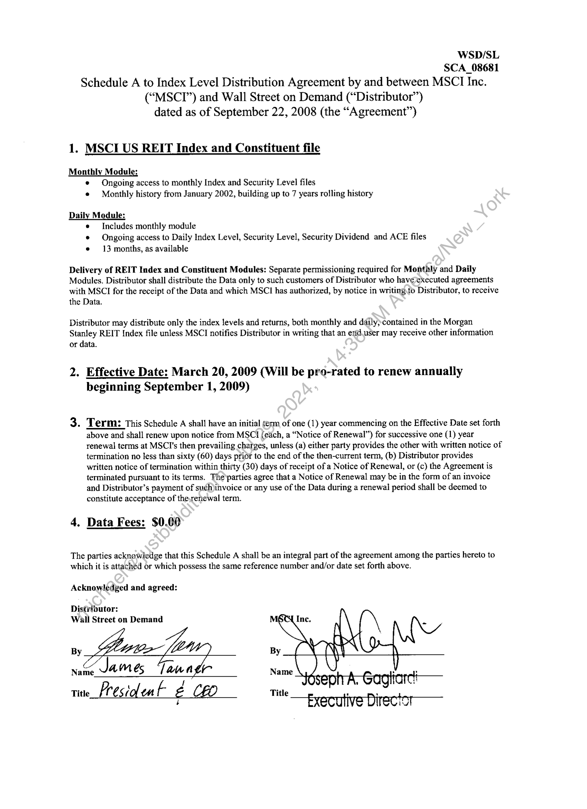

##### Schedule A to Index Level Distribution Agreement]

  
````col
```col-md
flexGrow=.5
===
> [!info] [Page 1](_attachments/images_MSCI-Index-Data-3.6.4.1.14.2.1MSCI_MOD_IndexDistribution_USREIT_ScheduleA_20090320.pdf_155003/page_1.png)
> 
```  
```col-md
WSD/SL
SCA_08681
Schedule A to Index Level Distribution Agreement by and between MSCI Inc.
(“MSCTI”) and Wall Street on Demand (“Distributor”)
dated as of September 22, 2008 (the “Agreement”)  
1. MSCIUS REIT Index and Constituent file  
Monthly Module:
e Ongoing access to monthly Index and Security Level files
¢ Monthly history from January 2002, building up to 7 years rolling history  
Daily Module:
¢ Includes monthly module
© Ongoing access to Daily Index Level, Security Level, Security Dividend and ACE files
e 13 months, as available  
Delivery of REIT Index and Constituent Modules: Separate permissioning required for Monthly and Daily
Modules. Distributor shall distribute the Data only to such customers of Distributor who haveexecuted agreements
with MSCI for the receipt of the Data and which MSCI has authorized, by notice in writing.to Distributor, to receive
the Data.  
Distributor may distribute only the index levels and returns, both monthly and daily,contained in the Morgan
Stanley REIT Index file unless MSCI notifies Distributor in writing that an end user may receive other information
or data.  
2. Effective Date: March 20, 2009 (Will be pro-rated to renew annually
beginning September 1, 2009)  
3. Term: This Schedule A shall have an initial term of one (1) year commencing on the Effective Date set forth
above and shall renew upon notice from MSCI (each, a “Notice of Renewal”) for successive one (1) year
renewal terms at MSCI's then prevailing charges, unless (a) either party provides the other with written notice of
termination no less than sixty (60) days prior to the end of the then-current term, (b) Distributor provides
written notice of termination within thirty (30) days of receipt of a Notice of Renewal, or (c) the Agreement is
terminated pursuant to its terms. The’parties agree that a Notice of Renewal may be in the form of an invoice
and Distributor’s payment of such)invoice or any use of the Data during a renewal period shall be deemed to
constitute acceptance of the,renewal term.  
4. Data Fees: $0.00  
The parties acknowledge that this Schedule A shall be an integral part of the agreement among the parties hereto to
which it is attached or which possess the same reference number and/or date set forth above.  
Acknowledged and agreed:  
Distributor:
Wall Street on Demand  
By
Name. Jam és nage  
Title President g CEO  
```
````
Notes:  


![[_attachments/MSCI-Index-Data-3.6.4.1.14.2.1 MSCI_MOD_IndexDistribution_US REIT_Schedule A_20090320.pdf]