##### INDEX LEVEL DISTRIBUTION AGREEMENT]

  
````col
```col-md
flexGrow=.5
===
> [!info] [Page 1](_attachments/images_MSCI-Index-Data-3.6.4.1.14.2.3MSCI_MoD-IndexDistribution_Agreement_20080922.pdf_155339/page_1.png)
> 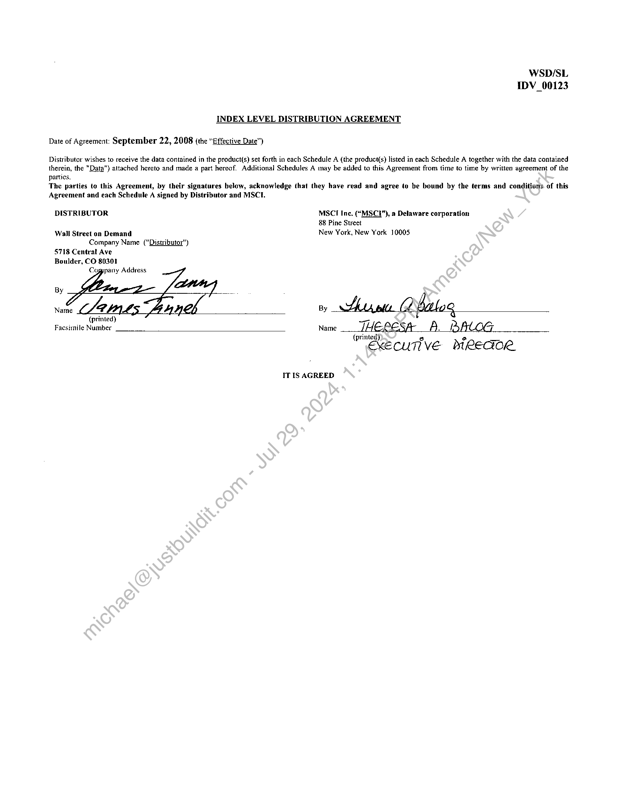
```  
```col-md
WSD/SL
IDV_00123  
INDEX LEVEL DISTRIBUTION AGREEMENT  
Date of Agreement: September 22, 2008 (the “Effective Date”)  
Distributor wishes to receive the data contained in the product(s) set forth in each Schedule A (the product(s) listed in each Schedule A together with the data contained
therein, the "Data") attached hereto and made a part hereof. Additional Schedules A may be added to this Agreement from time to time by written agreement of the
parties.  
The parties to this Agreement, by their signatures below, acknowledge that they have read and agree to be bound by the terms and conditions. of this
Agreement and each Schedule A signed by Distributor and MSCT.  
DISTRIBUTOR MSCT Inc. (“MSC”), a Delaware corporation
88 Pine Street
Wall Street on Demand New York, New York 10005  
Company Name ("Distributor")
5718 Central Ave
Boulder, CO 80301
Cogppany Address  
By  
A de  
(printed) —
Facsimile Number Name THERESA A. PAlLOG  
(printed)  
EXECUTIVE DIRECTOR  
By  
IT IS AGREED  
```
````
Notes:    
````col
```col-md
flexGrow=.5
===
> [!info] [Page 2](_attachments/images_MSCI-Index-Data-3.6.4.1.14.2.3MSCI_MoD-IndexDistribution_Agreement_20080922.pdf_155339/page_2.png)
> 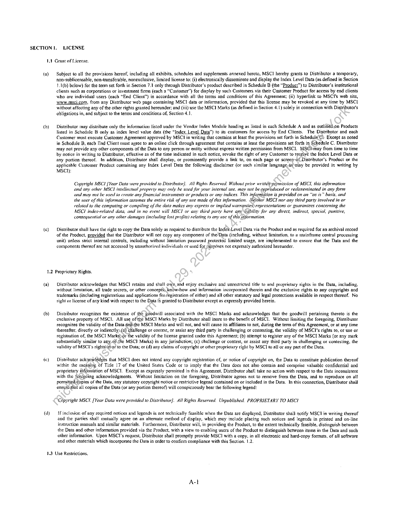
```  
```col-md
SECTION I. LICENSE  
1.4 Grant of License.  
(ay  
(b)  
(c)  
Subject to all the provisions hereof, including all exhibits, schedules and supplements annexed hereto, MSCI hereby grants to Distributor a temporary,
non-sublicensable, non-transferable, nonexclusive, limited license to: (i) electronically disseminate and display the Index Level Data (as defined in Section
1.1(b) below) for the term set forth in Section 7.1 only through Distributor’s product described in Schedule B (the “Product”) to Distributor’s institutional
clients such as corporations or investment firms (each a “Customer”) for display by such Customers via their Customer Product for access by end clients
who are individual users (each “End Client”) in accordance with all the terms and conditions of this Agreement; (ii) hyperlink to MSCI's web site,
www.msci.com, from any Distributor web page containing MSCI data or information, provided that this license may be revoked at any time by MSCL
without affecting any of the other rights granted hereunder; and (iii) use the MSC] Marks (as defined in Section 4.1) solely in connection with Distributor’s
obligations in, and subject to the terms and conditions of, Section 4.1.  
Distributor may distribute only the information listed under the Vendor Index Module heading as listed in each Schedule A and as outlined.on Products
listed in Schedule B only as index level value data (the “Index Level Data”) to its customers for access by End Clients. The Distributor and each
Customer must execute Customer Agreement approved by MSCI in writing that contains at least the provisions set forth in Schedule C) Except as noted
in Schedule B, each End Client must agree to an online click through agreement that contains at least the provisions set forth in Schedule C, Distributor
may not provide any other components of the Data to any person or entity without express written permission from MSC]. MSChmay from time to time
by notice in writing to Distributor, effective as of the time indicated in such notice, revoke the right of any Customer to receive the Index Level Data or
any portion thereof. In addition, Distributor shall display, or prominently provide a link to, on each page or screen-of Distributor’s Product or the
applicable Customer Product containing any Index Level Data the following disclaimer (or such similar language-as*may be provided in writing by
MSCI):  
Copyright MSCI [Year Data were provided to Distributor]. All Rights Reserved. Without prior writt&ppermission of MSCL, this information
and any other MSCI intellectual property may only be used for your internal use, may not be reproduced or redisseminated in any form
and may not be used to create any financial instruments or products or any indices. This information is provided on an “as is” basis, and
the user of this information assumes the entire risk of any use made of this information. Neither MSCI nor any third party involved in or
related to the computing or compiling of the data makes any express or implied warranties,representations or guarantees concerning the
MSCI index-related data, and in no event will MSCI or any third party have any lidbility for any direct, indirect, special, punitive,
consequential or any other damages (including lost profits) relating to any use of this information.  
Distributor shall have the right to copy the Data solely as required to distribute the IndeXLevel Data via the Product and as required for an archival record
of the Product, provided that the Distributor will not copy any component of the’/Data (including, without limitation, to a mainframe central processing
unit) untess strict interna] controls, including without limitation password protected limited usage, are implemented to ensure that the Data and the
components thereof are not accessed by unauthorized individuals or used for parpdses not expressly authorized hereunder.  
1.2 Proprictary Rights.  
(a)  
(b)  
(c)  
(d)  
Distributor acknowledges that MSC] retains and shall own, and enjoy exclusive and unrestricted title to and proprietary rights in the Data, including,
without limitation, all trade secrets, or other concepts; knOw-how and information incorporated therein and the exclusive rights to any copyrights and
trademarks (including registrations and applications for-tegistration of either) and all other statutory and legal protections available in respect thereof. No
right or license of any kind with respect to the Data {s granted to Distributor except as expressly provided herein.  
Distributor recognizes the existence of the Boodwill associated with the MSCI Marks and acknowledges that the goodwill pertaining thereto is the
exclusive property of MSC]. All use of the MSCI Marks by Distributor shall inure to the benefit of MSCI. Without limiting the foregoing, Distributor
recognizes the validity of the Dataindthe MSCTI Marks and will not, and will cause its affiliates to not, during the term of this Agreement, or at any time
thereafter, directly or indirectly:(@) Challenge or contest, or assist any third party in challenging or contesting, the validity of MSCI’s rights to, or use or
registration of, the MSCI Marks)or the validity of the license granted under this Agreement, (b) attempt to register any of the MSCI Marks (or any mark
substantially similar to any-of.the MSC] Marks) in any jurisdiction; (c) challenge or contest, or assist any third party in challenging or contesting, the
validity of MSCI's rightsinvo? to the Data; or (d) any claims of copyright or other proprietary right by MSC] to all or any part of the Data.  
Distributor acknowledges that MSC] does not intend any copyright registration of, or notice of copyright on, the Data to constitute publication thereof
within the meaning of Title 17 of the United States Code or to imply that the Data docs not also contain and comprise valuable confidential and
proprietary information of MSCI. Except as expressly permitted in this Agreement, Distributor shail take no action with respect to the Data inconsistent
with the foregoing acknowledgments. Without limitation on the foregoing, Distributor agrees not to remove from the Data, and to reproduce on all
permitted:copies of the Data, any statutory copyright notice or restrictive legend contained on or included in the Data. In this connection, Distributor shail
ensuréthat all copies of the Data (or any portion thereof) will conspicuously bear the following legend:  
Copyright MSC. [Year Data were provided to Distributor]. Ail Rights Reserved. Unpublished. PROPRIETARY TO MSCI  
if inclusion of any required notices and legends is not technically feasible when the Data are displayed, Distributor shali notify MSCI in writing thereof
and the parties shall mutually agree on an alternate method of display, which may include placing such notices and legends in printed and on-line
instruction manuals and similar materials. Furthermore, Distributor will, in providing the Product, to the extent technically feasible, distinguish between
the Data and other information provided via the Product, with a view to enabling users of the Product to distinguish between items in the Data and such
other information. Upon MSCI’s request, Distributor shall promptly provide MSC] with a copy, in all electronic and hard-copy formats, of all software
and other materials which incorporate the Data in order to confirm compliance with this Section. 1.2.  
1.3 Use Restrictions,  
```
````
Notes:    
````col
```col-md
flexGrow=.5
===
> [!info] [Page 3](_attachments/images_MSCI-Index-Data-3.6.4.1.14.2.3MSCI_MoD-IndexDistribution_Agreement_20080922.pdf_155339/page_3.png)
> 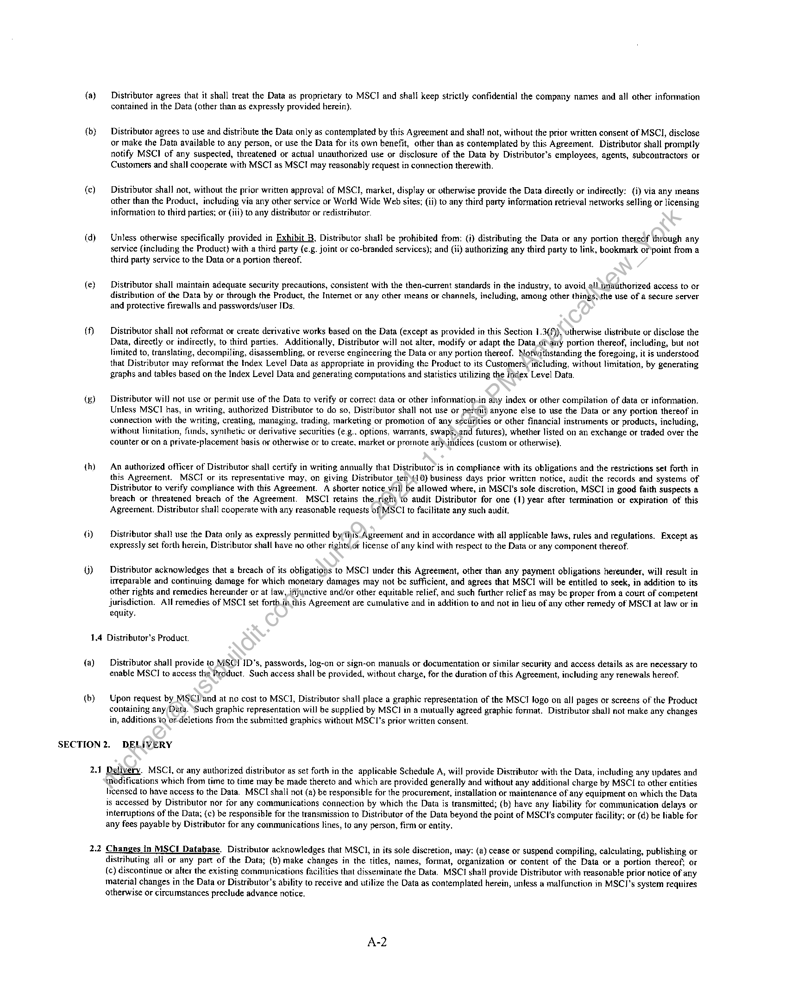
```  
```col-md
(ay  
(b}  
(cy  
(d)  
(e)  
(eB)  
«hy  
@)  
G)  
1,4  
(a)  
(b)  
Distributor agrees that it shall treat the Data as proprietary to MSCI and shall keep strictly confidential the company names and all other information
contained in the Data (other than as expressly provided herein).  
Distributor agrees to use and distribute the Data only as contemplated by this Agreement and shall not, without the prior written consent of MSCI, disclose
or make the Data available to any person, or use the Data for its own benefit, other than as contemplated by this Agreement. Distributor shall promptly
notify MSCI of any suspected, threatened or actual unauthorized use or disclosure of the Data by Distributor’s employees, agents, subcontractors or
Customers and shall cooperate with MSCI as MSCI may reasonably request in connection therewith.  
Distributor shall not, without the prior written approval of MSCI, market, display or otherwise provide the Data directly or indirectly: (i) via any means
other than the Product, including via any other service or World Wide Web sites; (ii) to any third party information retrieval networks selling or licensing
information to third parties; or (iii) to any distributor or redistrihutor.  
Unless otherwise specificaily provided in Exhibit B, Distributor shal} be prohibited from: (i) distributing the Data or any portion thereof through any
service {including the Product) with a third party (e.g. joint or co-branded services); and (ii) authorizing any third party to link, bookmark or’point from a
third party service to the Data or a portion thereof.  
Distributor shall maintain adequate security precautions, consistent with the then-current standards in the industry, to avoid all inauthorized access to or
distribution of the Data by or through the Product, the Internet or any other means or channels, including, among other things)the use of a secure server
and protective firewalls and passwords/user IDs.  
Distributor shall not reformat or create derivative works based on the Data (except as provided in this Section 1.3(f}), utherwise distribute or disclose the
Data, directly or indirectly, to third parties. Additionally, Distributor will not alter, modify or adapt the Data oi\any portion thereof, including, but not
limited to, translating, decompiling, disassembling, or reverse engineering the Data or any portion thereof. Notwithstanding the foregoing, it is understood
that Distributor may reformat the Index Level Data as appropriate in providing the Product to its Customersy including, without limitation, by generating
graphs and tables based on the Index Level Data and generating computations and statistics utilizing the Index Level Data.  
Distributor wil] not use or permit use of the Data to verify or correct data or other information.in any index or other compilation of data or information.
Unless MSCI has, in writing, authorized Distributor to do so, Distributor shall not use or pervhit anyone else to use the Data or any portion thereof in
connection with the writing, creating, managing, trading, marketing or promotion of any securities or other financial instruments or products, including,
without limitation, funds, synthetic or derivative securities (e.g.  
 options, warrants, swaps)and futures), whether listed on an exchange or traded over the
counter or on a private-placement basis or otherwise or to create, market or promote any indices (custom or otherwise).  
An authorized officer of Distributor shall certify in writing annually that Distributor is in compliance with its obligations and the restrictions set forth in
this Agreement. MSCI or its representative may, on giving Distributor ten\¢10) business days prior written notice, audit the records and systems of
Distributor to verify compliance with this Agreement. A shorter notice will be allowed where, in MSCI's sole discretion, MSCI in good faith suspects a
breach or threatened breach of the Agreement. MSCI retains the right to audit Distributor for one (1) year after termination or expiration of this
Agreement. Distributor shall cooperate with any reasonable requests of MSCI to facilitate any such audit.  
Distributor shall use the Data only as expressly permitted bythis: Agreement and in accordance with all applicable laws, rules and regulations. Except as
expressly set forth herein, Distributor shall have no other rights.or ticense of any kind with respect to the Data or any component thereof.  
Distributor acknowledges that a breach of its obligations to MSC] under this Agreement, other than any payment obligations hereunder, will result in
irreparable and continuing damage for which monetary damages may not be sufficient, and agrees that MSCI will be entitled to seek, in addition to its
other rights and remedies hereunder or at law, ifijunctive and/or other equitable relief, and such further relief as may be proper from a court of competent
jurisdiction. All remedies of MSCI set forth.tn.this Agreement are cumulative and in addition to and not in lieu of any other remedy of MSCI at law or in
equity.  
Distributor’s Product.  
Distributor shall provide to MSC] ID's, passwords, log-on or sign-on manuals or documentation or similar security and access details as are necessary to
enable MSCI to access the Product. Such access shall be provided, without charge, for the duration of this Agreement, including any renewals hereof.  
Upon request by MSCI/and at no cost to MSCI, Distributor shall place a graphic representation of the MSCI logo on all pages or screens of the Product
containing any/Deta. ‘Such graphic representation will be supplied by MSC] in a mutually agreed graphic format. Distributor shall not make any changes
in, additions to or deletions from the submitted graphics without MSCI’s prior written consent.  
SECTION 2. DELIVERY  
2,  
2.2  
Delivery. MSCI, or any authorized distributor as set forth in the applicable Schedule A, will provide Distributor with the Data, including any updates and
modifications which from time to time may be made thereto and which are provided generally and without any additional charge by MSCI to other entities
licensed to have access to the Data. MSCI shali not (a) be responsible for the procurement, installation or maintenance of any equipment on which the Data
is accessed by Distributor nor for any communications connection by which the Data is transmitted; (b} have any liability for communication delays or
interruptions of the Data; (c) be responsible for the transmission to Distributor of the Data beyond the point of MSCI's computer facility; or (d) be lable for
any fees payable by Distributor for any communications lines, to any person, firm or entity.  
Changes in MSCI Database. Distributor acknowledges that MSC], in its sole discretion, may: (a) cease or suspend compiling, calculating, publishing or
distributing all or any part of the Data; (b) make changes in the titles, names, format, organization or content of the Data or a portion thereof, or
(c) discontinue or alter the existing communications facilities that disseminate the Data. MSCI shail provide Distributor with reasonable prior notice of any
material changes in the Data or Distributor’s ability to receive and utilize the Data as contemplated herein, unless a malfunction in MSCI’s system requires
otherwise or circumstances preclude advance notice.  
A-2  
```
````
Notes:    
````col
```col-md
flexGrow=.5
===
> [!info] [Page 4](_attachments/images_MSCI-Index-Data-3.6.4.1.14.2.3MSCI_MoD-IndexDistribution_Agreement_20080922.pdf_155339/page_4.png)
> 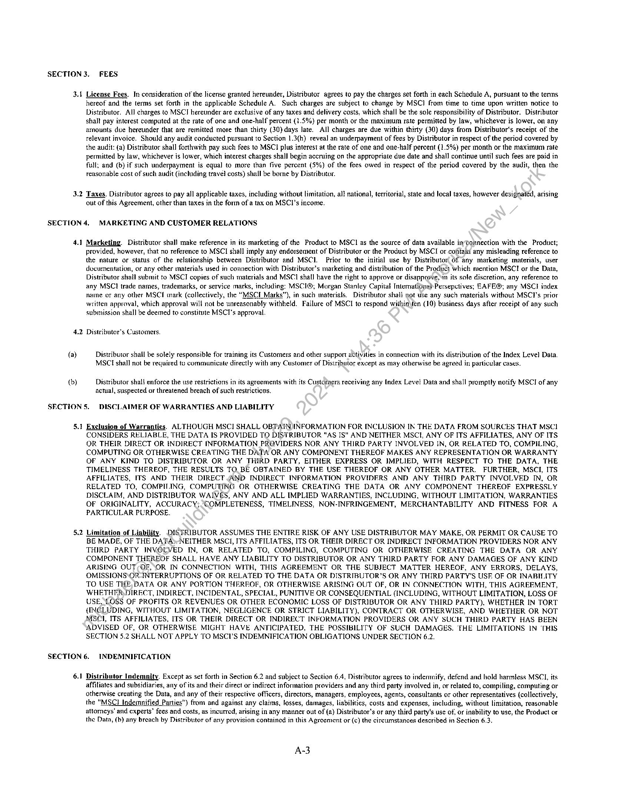
```  
```col-md
SECTION 3. FEES  
3.1 License Fees. In consideration of the license granted hereunder, Distributor agrees to pay the charges set forth in each Schedule A, pursuant to the terns
hereof and the terms set forth in the applicable Schedule A. Such charges are subject to change by MSC] from time to time upon written notice to
Distributor. All charges to MSCI hereunder are exclusive of any taxes and delivery costs, which shall be the sole responsibility of Distributor. Distributor
shalt pay interest computed at the rate of one and one-half percent (3.5%) per month or the maximum rate permitted by law, whichever is lower, on any
amounts due hereunder that are remitted more than thirty (30) days late. All charges are due within thirty (30) days from Distributor‘s receipt of the
relevant invoice. Should any audit conducted pursuant to Section 1.3(h) reveal an underpayment of fees by Distributor in respect of the period covered by
the audit: (a) Distributor shall forthwith pay such fees to MSCI plus interest at the rate of one and one-half percent (1.5%) per month or the maximum rate
permitted by law, whichever is lower, which interest charges shall begin accruing on the appropriate due date and shall continue until such fees are paid in
full; and (b) if such underpayment is equal to more than five percent (5%) of the fees owed in respect of the period covered by the audit, then the
reasonable cost of such audit (including travel costs) shall be borne by Distributor.  
3.2 Taxes. Distributor agrees to pay all applicable taxes, including without limitation, al! national, territorial, state and local taxes, however designated, arising
out of this Agreement, other than taxes in the form of a tax on MSCI’s income.  
SECTION 4, MARKETING AND CUSTOMER RELATIONS  
4.1 Marketing. Distributor shall make reference in its marketing of the Product to MSCI as the source of data available inconnection with the Product;
provided, however, that no reference to MSCI shall imply any endorsement of Distributor or the Product by MSCI or contain any misleading reference to
the nature or status of the relationship between Distributor and MSCI. Prior to the initial use by Distributor_of any marketing materials, user
documentation, or any other materials used in connection with Distributor’s marketing and distribution of the Product which mention MSCI or the Data,
Distributor shail submit to MSCI copies of such materials and MSC1 shall have the right to approve or disapprove,“in its sole discretion, any reference to
any MSC1 trade names, trademarks, or service marks, including: MSCI®; Morgan Stanley Capital Internationa) Persepctives; EAFE@; any MSCI index
naine or any other MSCI mark (collectively, the “MSCI Marks”), in such materials. Distributor shail aot use any such materials without MSCI’s prior
written approval, which approval will not be unreasonably withheld. Failure of MSCI to respond within\ten (10) business days after receipt of any such
submission shall be deemed to constitute MSCI's approval.  
4.2, Distributor’s Customers.  
(ay Distributor shall be sotely responsible for training its Customers and other support activities in connection with its distribution of the Index Level Data.
MSCI shall not be required to communicate directly with any Customer of Distributor except as may otherwise be agreed in particular cases.  
(b) Distributor shall enforce the use restrictions in its agreements with its Customers receiving any Index Level Data and shall promptly notify MSCI of any
actual, suspected or threatened breach of such restrictions,  
SECTION §. DISCLAIMER OF WARRANTIES AND LIABILITY  
5.1 Exclusion of Warranties, ALTHOUGH MSCI SHALL OBTAIN) INFORMATION FOR INCLUSION IN THE DATA FROM SOURCES THAT MSC1
CONSIDERS RELIABLE, THE DATA IS PROVIDED TO DISTRIBUTOR "AS IS" AND NEITHER MSCI, ANY OF ITS AFFILIATES, ANY OF ITS.
OR THEIR DIRECT OR INDIRECT INFORMATION PROVIDERS NOR ANY THIRD PARTY INVOLVED IN, OR RELATED TO, COMPILING,
COMPUTING OR OTHERWISE CREATING THE DATA OR ANY COMPONENT THEREOF MAKES ANY REPRESENTATION OR WARRANTY
OF ANY KIND TO DISTRIBUTOR OR ANY THIRD PARTY, EITHER EXPRESS OR IMPLIED, WITH RESPECT TO THE DATA, THE
TIMELINESS THEREOF, THE RESULTS TOBE OBTAINED BY THE USE THEREOF OR ANY OTHER MATTER. FURTHER, MSCI, ITS
AFFILIATES, ITS AND THEIR DIRECT AND INDIRECT INFORMATION PROVIDERS AND ANY THIRD PARTY INVOLVED IN, OR
RELATED TO, COMPHLING, COMPUTING OR OTHERWISE CREATING THE DATA OR ANY COMPONENT THEREOF EXPRESSLY
DISCLAIM, AND DISTRIBUTOR WAIVES, ANY AND ALL IMPLIED WARRANTIES, INCLUDING, WITHOUT LIMITATION, WARRANTIES
OF ORIGINALITY, ACCURACY; COMPLETENESS, TIMELINESS, NON-INFRINGEMENT, MERCHANTABILITY AND FITNESS FOR A
PARTICULAR PURPOSE.  
5.2 Limitation of Liability. DISTRIBUTOR ASSUMES THE ENTIRE RISK OF ANY USE DISTRIBUTOR MAY MAKE, OR PERMIT OR CAUSE TO
BE MADE, OF THE DATAS-NEITHER MSCI, ITS AFFILIATES, ITS OR THEIR DIRECT OR INDIRECT INFORMATION PROVIDERS NOR ANY
THIRD PARTY INVOLVED IN, OR RELATED TO, COMPILING, COMPUTING OR OTHERWISE CREATING THE DATA OR ANY
COMPONENT THEREOF SHALL HAVE ANY LIABILITY TO DISTRIBUTOR OR ANY THIRD PARTY FOR ANY DAMAGES OF ANY KIND
ARISING OUT; OF, ‘OR IN CONNECTION WITH, THIS AGREEMENT OR THE SUBJECT MATTER HEREOF, ANY ERRORS, DELAYS,
OMISSIONS\OR-ANTERRUPTIONS OF OR RELATED TO THE DATA OR DISTRIBUTOR’S OR ANY THIRD PARTY'S USF OF OR INABILITY
TO USE THE,DATA OR ANY PORTION THEREOF, OR OTHERWISE ARISING OUT OF, OR IN CONNECTION WITH, THIS AGREEMENT,
WHETHER DIRECT, INDIRECT, INCIDENTAL, SPECIAL, PUNITIVE OR CONSEQUENTIAL (INCLUDING, WITHOUT LIMITATION, LOSS OF
USE, LOSS OF PROFITS OR REVENUES OR OTHER ECONOMIC LOSS OF DISTRIBUTOR OR ANY THIRD PARTY), WHETHER IN TORT
(INCLUDING, WITHOUT LIMITATION, NEGLIGENCE OR STRICT LIABILITY), CONTRACT OR OTHERWISE, AND WHETHER OR NOT
MSCI, ITS AFFILIATES, ITS OR THEIR DIRECT OR INDIRECT INFORMATION PROVIDERS OR ANY SUCH THIRD PARTY HAS BEEN
ADVISED OF, OR OTHERWISE MIGHT HAVE ANTICIPATED, THE POSSIBILITY OF SUCH DAMAGES. ‘FHE LIMITATIONS IN THIS
SECTION 5.2 SHALL NOT APPLY TO MSCI’S INDEMNIFICATION OBLIGATIONS UNDER SECTION 6.2.  
SECTION 6. INDEMNIFICATION  
6.1 Distributor Indemnity. Except as set forth in Section 6.2 and subject to Section 6.4, Distributor agrees to indenmify, defend and hold harmless MSCI, its
affiliates and subsidiaries, any of its and their direct or indirect information providers and any third party involved in, or related to, compiling, computing or
otherwise creating the Data, and any of their respective officers, directors, managers, employees, agents, consultants or other representatives (collectively,
the “MSCI Indemnified Parties") from and against any claims, losses, damages, liabilities, costs and expenses, including, without limitation, reasonable
attomeys’ and experts” fees and costs, as incurred, arising in any manner out of (a) Distributor’s or any third party's use of, or inability to use, the Product or
the Data, (b) any breach by Distributor of any provision contained in this Agreement or (c) the circumstances described in Section 6.3.  
A-3  
```
````
Notes:    
````col
```col-md
flexGrow=.5
===
> [!info] [Page 5](_attachments/images_MSCI-Index-Data-3.6.4.1.14.2.3MSCI_MoD-IndexDistribution_Agreement_20080922.pdf_155339/page_5.png)
> 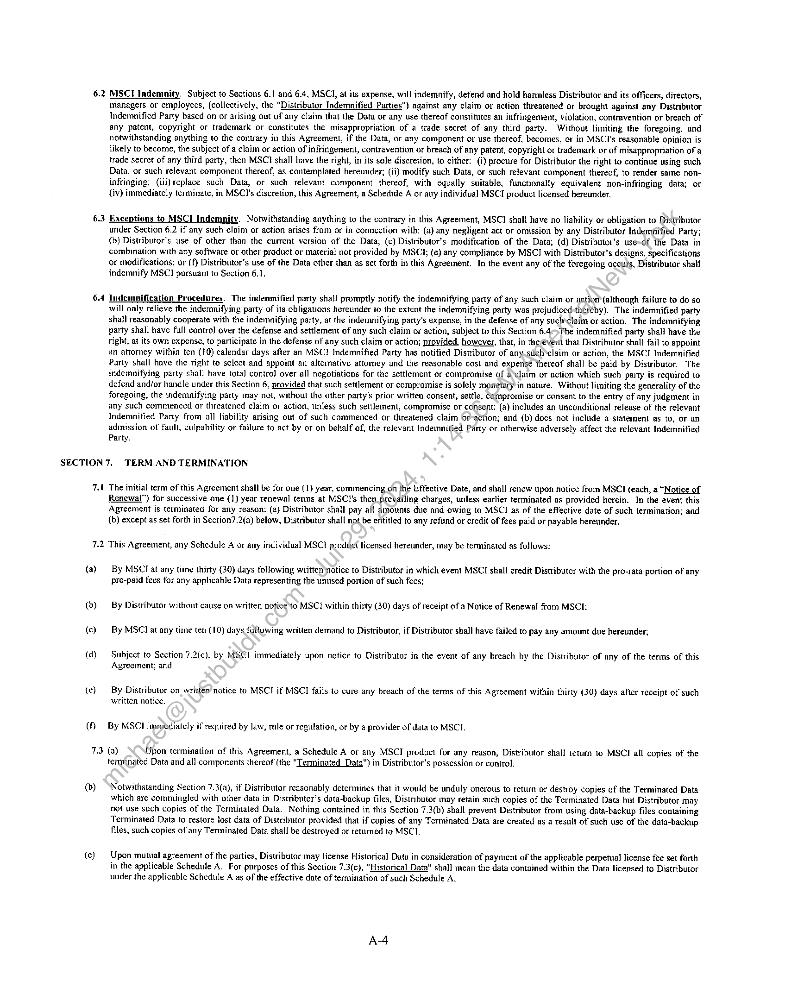
```  
```col-md
62  
6.3  
6.4  
MSCI Indemnity. Subject to Sections 6.1 and 6.4, MSCI, at its expense, will indemnify, defend and hold harmless Distributor and its officers, directors,
managers or employees, (collectively, the “Distributor Indemnified Parties") against any claim or action threatened or brought against any Distributor
Indemnified Party based on or arising out of any claim that the Data or any use thereof constitutes an infringement, violation, contravention or breach of
any patent, copyright or trademark or constitutes the misappropriation of a trade secret of any third party. Without limiting the foregoing, and
notwithstanding anything to the contrary in this Agreement, if the Data, or any component or use thereof, becomes, or in MSCI's reasonable opinion is
likely to become, the subject of a claim or action of infringement, contravention or breach of any patent, copyright or trademark or of misappropriation of a
trade secret of any third party, then MSCI shalt have the right, in its sole discretion, to either: (i) procure for Distributor the right to continue using such
Data, or such relevant component thereof, as contemplated hereunder; (ii) modify such Data, or such relevant component thereof, to render same noninfringing; (iii) replace such Data, or such relevant component thereof, with equally suitable, functionally equivalent non-infringing data; or
(iv) immediately terminate, in MSCT's discretion, this Agreement, a Schedule A or any individual MSCI product licensed hereunder.  
Exceptions to MSCI Indemnity. Notwithstanding anything to the contrary in this Agreement, MSCI shall have no liability or obligation to Distributor
under Section 6.2 if any such claim or action arises from or in connection with: (a) any negligent act or omission by any Distributor Indemnified Party;
(b) Distributor’s use of other than the current version of the Data; (c) Distributor’s modification of the Data; (d) Distributor’s use-of the Data in
combination with any software or other product or material not provided by MSCI; (e) any compliance by MSCI with Distributor’s designs, specifications
or modifications; or (f) Distributor’s use of the Data other than as set forth in this Agreement. In the event any of the foregoing occuts, Distributor shal!
indemnify MSCI pursuant to Section 6.1.  
Indemnification Procedures. The indemnified party shall promptly notify the indemnifying party of any such claim or action (although failure to do so
will only relieve the indemmifying party of its obligations hereunder to the extent the indemnifying party was prejudiced-thereby). The indemnified party
shall reasonably cooperate with the indemnifying party, at the indemnifying party's expense, in the defense of any such claim or action. The indemnifying
party shall have full contro] over the defense and settlement of any such claim or action, subject to this Section 6.4- The indemnified party shall have the
right, at its own expense, to participate in the defense of any such claim or action; provided, however, that, in theévent that Distributor shall fail to appoint
an attorney within ten (10) calendar days after an MSCI Indemnified Party has notified Distributor of any.such'claim or action, the MSCI Indemmified
Party shail have the right to select and appoint an alternative attorney and the reasonable cost and expense thereof shall be paid by Distributor. The
indemnifying party shall have total control over all negotiations for the settlement or compromise of a’claim or action which such party is required to
defend and/or handle under this Section 6, provided that such settlement or compromise is solely monetary in nature. Without limiting the generality of the
foregoing, the indemnifying party may not, without the other party's prior written consent, settle, Compromise or consent to the entry of any judgment in
any such commenced or threatened claim or action, unless such settlement, compromise or consent: (a) includes an unconditional release of the relevant
Indemnified Party from all liability arising out of such commenced or threatened claim Of-action; and (b) does not include a statement as to, or an
admission of fault, culpability or failure to act by or on behalf of, the relevant Indemnified Party or otherwise adversely affect the relevant Indemnified
Party.  
SECTION 7. TERM AND TERMINATION  
vA)  
72  
(a)  
(b)
(c)  
(d)  
(e)  
(U)  
73  
(b)  
{c)  
The initial term of this Agreement shall be for one (1) year, commencing on the t/ffective Date, and shall renew upon notice from MSCI (each, a “Notice of
Renewal”) for successive one (1) year renewal terms at MSC1’s then prevailing charges, unless earlier terminated as provided herein. In the event this
Agreement is terminated for any reason: (a) Distributor shall pay all amounts due and owing to MSCI as of the effective date of such termination; and
(b) except as set forth in Section7.2(a) below, Distributor shall not be erititled to any refund or credit of fees paid or payable hereunder.  
This Agreement, any Schedule A or any individual MSC product licensed hereunder, inay be terminated as follows:  
By MSCI at any time thirty (30) days following written notice to Distributor in which event MSCI shall credit Distributor with the pro-rata portion of any
pre-paid fees for any applicable Data representing the unused portion of such fees;  
By Distributor without cause on written notice ‘to MSC! within thirty (30) days of receipt of a Notice of Renewal from MSCI:
By MSCTI at any time ten (10) days following wrilten demand to Distributor, if Distributor shall have failed to pay any amount due hereunder,  
Subject to Section 7.2(c). by MSCI immediately upon notice to Distributor in the event of any breach by the Distributor of any of the terms of this
Agreement; and  
By Distributor on written’ notice to MSCI if MSCI fails to cure any breach of the terms of this Agreement within thirty (30) days after receipt of such
written notice.  
By MSC1 itnmedialely if required by law, rule or regulation, or by a provider of data to MSCI.  
(a) Upon termination of this Agreement, a Schedule A or any MSCI product for any reason, Distributor shall retum to MSCI all copies of the
terminated Data and all components thereof (the "Terminated Data") in Distributor’s possession or control.  
Notwithstanding Section 7.3(a), if Distributor reasonably determines that it would be unduly onerous to return or destroy copies of the Terminated Data
which are commingled with other data in Distributor’s data-backup files, Distributor may retain such copies of the Terminated Data but Distributor may
not use such copies of the Terminated Data. Nothing contained in this Section 7.3(b) shall prevent Distributor from using data-backup files containing
Terminated Data to restore lost data of Distributor provided that if copies of any Terminated Data are created as a result of such use of the data-backup
files, such copies of any Terminated Data shat] be destroyed or retumed to MSCI.  
Upon mutual agreement of the parties, Distributor may license Historical Data in consideration of payment of the applicable perpetual license fee set forth
in the applicable Schedule A. For purposes of this Section 7.3(c), "Historical Data" shall mean the data contained within the Data licensed to Distributor
under the applicable Schedule A as of the effective date of termination of such Schedule A.  
A4  
```
````
Notes:    
````col
```col-md
flexGrow=.5
===
> [!info] [Page 6](_attachments/images_MSCI-Index-Data-3.6.4.1.14.2.3MSCI_MoD-IndexDistribution_Agreement_20080922.pdf_155339/page_6.png)
> 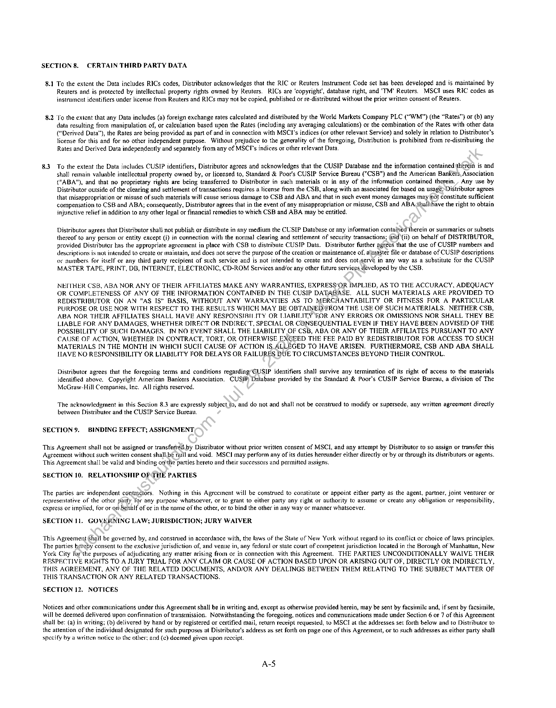
```  
```col-md
SECTION 8 CERTAIN THIRD PARTY DATA  
8.1 To the extent the Data includes RICs codes, Distributor acknowledges that the RIC or Reuters Instrument Code set has been developed and is maintained by
Reuters and is protected by intellectual property rights owned by Reuters. RICs are ‘copyright’, database right, and ‘TM’ Reuters. MSCT uses RIC codes as
instrument identifiers under license from Reuters and RICs may not be copied, published or re-distributed without the prior written consent of Reuters.  
8.2 To the extent that any Data includes (a) foreign exchange rates calculated and distributed by the World Markets Company PLC (“WM”) (the “Rates”) or (b) any
data resulting from manipulation of, or calculation based upon the Rates (including any averaging calculations) or the combination of the Rates with other data
(Derived Data”), the Rates are being provided as part of and in connection with MSCI’s indices (or other relevant Service) and solely in relation to Distributor's
license for this and for no other independent purpose. Without prejudice to the generality of the foregoing, Distribution is prohibited from re-distributing the
Rates and Derived Data independently and separately from any of MSCI’s indices or other relevant Data.  
8.3 To the extent the Data includes CUSIP identifiers, Distributor agrees and acknowledges that the CUSIP Database and the information contained therein is and
shal] remain valuable intetlectual property owned by, or licensed to, Standard & Poor's CUSIP Service Bureau ("CSB") and the American Bankers, Association
("ABA"), and that no proprietary rights are being transferred to Distributor in such materials or in any of the information contained therein. Any use by
Distributor outside of the clearing and settlement of transactions requires a license from the CSB, along with an associated fee based on usage, Distributor agrees
that misappropriation or misuse of such materials will cause serious damage te CSB arid ABA and that in such event money damages may (not constitute sufficient
compensation to CSB and ABA; consequently, Distributor agrees that in the event of any misappropriation or misuse, CSB and ABA Sbalbhave the right to obtain
injunctive relief in addition to any other Jegal or financial remedies to which CSB and ABA may be entitled.  
Distributor agrees that Distributor shall not publish or distribute in any medium the CUSIP Database or any information contained therein or summaries or subsets
thereof to any person or entity except (i) in connection with the normal clearing and settlement of security transactions; and (ii) on behalf of DISTRIBUTOR,
provided Distributor has the appropriate agreement in place with CSB to distribute CUSIP Data. Distributor further agrees that the use of CUSIP numbers and
descriptions is not intended to create or maintain, and does not serve the purpose of the creation or maintenance of, a\master file or database of CUSIP descriptions
or numbers for itself or any third party recipient of such service and is not intended to create and does notyserve in any way as a substitute for the CUSIP
MASTER TAPE, PRINT, DB, INTERNET, ELECTRONIC, CD-ROM Services and/or any other titure services developed by the CSB.  
NEITHER CSB, ABA NOR ANY OF THEIR AFFILIATES MAKE ANY WARRANTIES, EXPRESS OR IMPLIED, AS TO THE ACCURACY, ADEQUACY
OR COMPLETENESS OF ANY OF THE INFORMATION CONTAINED IN THE CUSIP DATABASE. ALL SUCH MATERIALS ARE PROVIDED TO
REDISTRIBUTOR ON AN "AS IS" BASIS, WITHOUT ANY WARRANTIES AS TO MERCHANTABILITY OR FITNESS FOR A PARTICULAR
PURPOSE OR USE NOR WITH RESPECT TO THE RESULTS WHICH MAY BE OBTAINED)FROM THE USE OF SUCH MATERIALS. NEITHER CSB,
ABA NOR THEIR AFFILIATES SHALL HAVE ANY RESPONSIBILITY OR LIABILITY FOR ANY ERRORS OR OMISSIONS NOR SHALL THEY BE
LIABLE FOR ANY DAMAGES, WHETHER DIRECT OR INDIRECT, SPECIAL OR CONSEQUENTIAL EVEN IF THEY HAVE BEEN ADVISED OF THE
POSSIBILITY OF SUCH DAMAGES. FN NO EVENT SHALL THE LIABILITY OF CSB, ABA OR ANY OF THEIR AFFILIATES PURSUANT TO ANY
CAUSE OF ACTION, WHETHER IN CONTRACT, TORT, OR OTHERWISE EXGEED THE FEE PAID BY REDISTRIBUTOR FOR ACCESS TO SUCH
MATERIALS IN THE MONTH IN WHICH SUCH CAUSE OF ACTION IS_ALLEGED TO HAVE ARISEN. FURTHERMORE, CSB AND ABA SHALL
HAVE NO RESPONSIBILITY OR LIABILITY FOR DELAYS OR FAILURES DUE TO CIRCUMSTANCES BEYOND THEIR CONTROL,  
Distributor agrees that the foregoing terms and conditions regarding’GUSIP identifiers shal] survive any termination of its right of access to the materials
identified above. Copyright American Bankers Association. CUSIP Database provided by the Standard & Poor's CUSIP Service Bureau, a division of The
McGraw-Hill Companies, Inc. All rights reserved.  
The acknowledgment in this Section 8.3 are expressly subject_to, and do not and shall not be construed to modify or supersede, any written agreement directly
between Distributor and the CUSIP Service Bureau.  
SECTION 9, BINDING EFFECT; ASSIGNMENT,  
This Agreement shall not be assigned or transferred.by Distributor without prior written consent of MSCI, and any attempt by Distributor to so assign or transfer this
Agreement without such written consent shall.bé null and void. MSCI may perform any of its duties hereunder either directly or by or through its distcibutors or agents.
This Agreement shall be valid and binding onthe parties hereto and their successors and permitted assigns.  
SECTION 10. RELATIONSHIP OF\THE PARTIES  
The parties are independent contractors. Nothing in this Agrccment will be construed to constitute or appoint either party as the agent, parmer, joint venturer or
representative of the other party for any purpose whatsoever, or to grant to either party any right or authority to assume or create any obligation or responsibility,
express or implied, for or on\behalf of or in the name of the other, or to bind the other in any way or manner whatsoever.  
SECTION 11. GOVERNING LAW; JURISDICTION; JURY WAIVER  
This Agreement Shall be governed by, and construed in accordance with, the laws of the Stale of New York without regard lo its contlict or choice of laws principles.
The parties hereby consent to the exclusive jurisdiction of, and venue in, any fecleral or state court of competent jurisdiction located in the Borough of Manhattan, New
York City forthe purposes of adjudicating any matter arising from or in connection with this Agreement. THE PARTIES UNCONDITIONALLY WAIVE THEIR
RESPECTIVE RIGHTS TO A JURY TRIAL FOR ANY CLAIM OR CAUSE OF ACTION BASED UPON OR ARISING OUT OF, DIRECTLY OR INDIRECTLY,
THIS AGREEMENT, ANY OF THE RELATED DOCUMENTS, AND/OR ANY DEALINGS BETWEEN THEM RELATING TO THE SUBJECT MATTER OF
THIS TRANSACTION OR ANY RELATED TRANSACTIONS.  
SECTION 12, NOTICES  
Notices and other communications under this Agreement shall be in writing and, except as otherwise provided herein, may be sent by facsimile and, if sent by facsimile,
will be deemed delivered upon confinnation of transmission. Notwithstanding the foregoing, notices and communications made under Section 6 or 7 of this Agreement
shall be: (a) in writing; (b) delivered by hand or by registered or certified mail, return receipt requested, to MSCI at the addresses set forth below and to Distributor to
the attention of the individual designated for such purposes al Distributor's address as set forth on page one of this Agreement, or to such addresses as either party shall
specify by a written notice lo the other, and (c) deemed given upon receipt.  
A-S  
```
````
Notes:    
````col
```col-md
flexGrow=.5
===
> [!info] [Page 7](_attachments/images_MSCI-Index-Data-3.6.4.1.14.2.3MSCI_MoD-IndexDistribution_Agreement_20080922.pdf_155339/page_7.png)
> 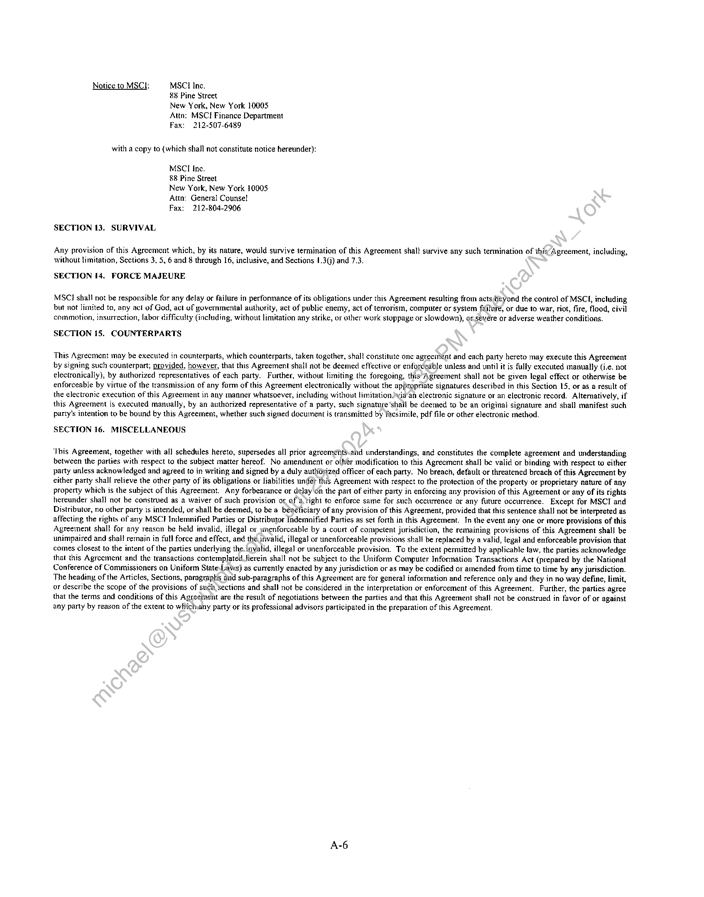
```  
```col-md
Notice to MSCI: MSCI Inc.
&8 Pine Street
New York, New York 10005
Attn: MSCI Finance Department
Fax: 212-507-6489  
with a copy to (which shall not constitute notice hereunder):  
MSCI Inc.  
88 Pine Street  
New York, New York 10005
Attn: General Counsel  
Fax: 212-804-2906  
SECTION 13. SURVIVAL  
Any provision of this Agreement which, by its nature, would survive termination of this Agreement shall survive any such termination of this Agreement, including,
without limitation, Sections 3, 5, 6 and 8 through 16, inclusive, and Sections 1.3(j) and 7.3.  
SECTION 14. FORCE MAJEURE  
MSC] shall not be responsible for any delay or failure in performance of its obligations under this Agreement resulting from acts(6eyond the control of MSCL, including
but not limited to, any act of God, act of governmental authority, act of public enemy, act of terrorism, computer or system failure, or due to war, riot, fire, flood, civil
commotion, insurrection, labor difficulty (including, without limitation any strike, or other work stoppage or slowdown), or.severe or adverse weather conditions.  
SECTION 15. COUNTERPARTS  
This Agreement may be executed in counterparts, which counterparts, taken together, shall constitute onc agreement and each party hereto may execute this Agreement
by signing such counterpart; provided, however, that this Agreement shall not be deemed effective or enforceable unless and until it is fully exccuted manually (i.e. not
electronically), by authorized representatives of each party. Further, without limiting the foregoing, this Agreement shall not be given legal effect or otherwise be
enforceable by virtue of the transmission of any form of this Agreement electronically without the appropriate signatures described in this Section 15, or as a result of
the electronic execution of this Agreement in any manner whatsoever, including without limitationvia‘an electronic signature or an electronic record. Alternatively, if
this Agreement is executed manually, by an authorized representative of a party, such signature’shall be deemed to be an original signature and shall manifest such
party's intention to be bound by this Agreement, whether such signed document is transmitted by facsimile, pdf file or other electronic method.  
SECTION 16. MISCELLANEOUS  
‘This Agreement, together with all schedules hereto, supersedes all prior agreemenits.and understandings, and constitutes the complete agreement and understanding
between the parties with respect to the subject matter hereof. No amendment or other modification to this Agreement shall be valid or binding with respect to either
party unless acknowledged and agreed to in writing and signed by a duly auttioyized officer of each party. No breach, default or threatened breach of this Agrcement by
either party shall relieve the other party of its obligations or liabilities under this Agreement with respect to the protection of the property or proprietary nature of any
property which is the subject of this Agreement. Any forbearance or delay on the part of either party in enforcing any provision of this Agreement or any of its rights
hereunder shall not be construed as a waiver of such provision or of a right to enforce same for such occurrence or any future occurrence. Except for MSCT and
Distributor, no other party is intended, or shall be deemed, to be a beneficiary of any provision of this Agreement, provided that this sentence shall not be interpreted as
affecting the rights of any MSCI Indemnified Parties or Distributor Indemnified Parties as set forth in this Agreement. In the event any one or more provisions of this
Agreement shall for any reason be held invalid, iflegal or ynenforceable by a court of competent jurisdiction, the remaining provisions of this Agreement shall be
unimpaired and shal! remain in full force and effect, and the invalid, illegal or unenforceable provisions shall be replaced by a valid, tegal and enforceable provision that
comes closest to the intent of the parties underlying the. invalid, illegal or unenforceable provision. To the extent permitted by applicable law, the parties acknowledge
that this Agreement and the transactions contemplated.herein shall not be subject to the Uniform Computer Information Transactions Act (prepared by the National
Conference of Commissioners on Uniform State\Laws) as currently enacted by any jurisdiction or as may be codified or amended from time to time by any jurisdiction.
The heading of the Articles, Sections, paragraphis dnd sub-paragraphs of this Agreement are for general information and reference only and they in no way define, limit,
or describe the scope of the provisions of such sections and shail not be considered in the interpretation or enforcement of this Agreement. Further, the parties agree
that the terms and conditions of this Agreement are the result of negotiations between the parties and that this Agreement shall not be construed in favor of or against
any party by reason of the extent to whichany party or its professional advisors participated in the preparation of this Agreement.  
```
````
Notes:    
````col
```col-md
flexGrow=.5
===
> [!info] [Page 8](_attachments/images_MSCI-Index-Data-3.6.4.1.14.2.3MSCI_MoD-IndexDistribution_Agreement_20080922.pdf_155339/page_8.png)
> 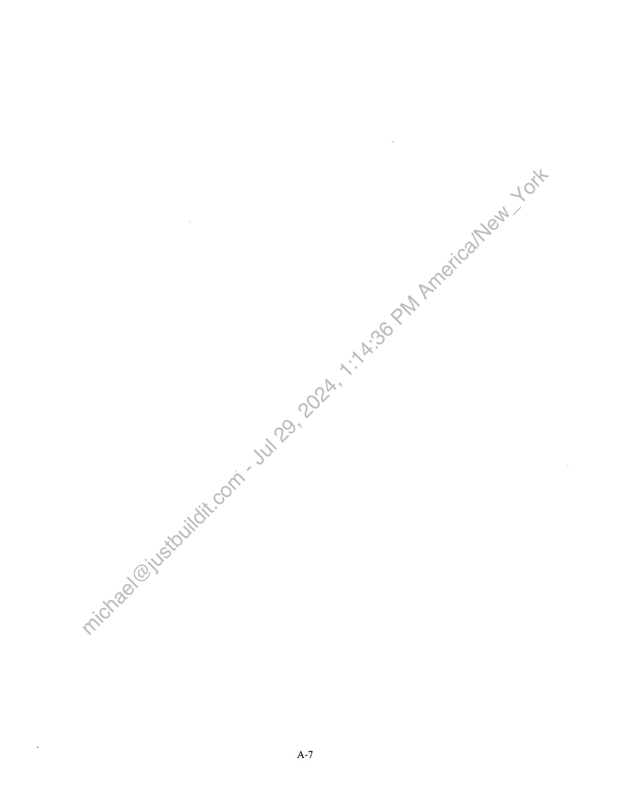
```  
```col-md
A-7  
```
````
Notes:    
````col
```col-md
flexGrow=.5
===
> [!info] [Page 9](_attachments/images_MSCI-Index-Data-3.6.4.1.14.2.3MSCI_MoD-IndexDistribution_Agreement_20080922.pdf_155339/page_9.png)
> 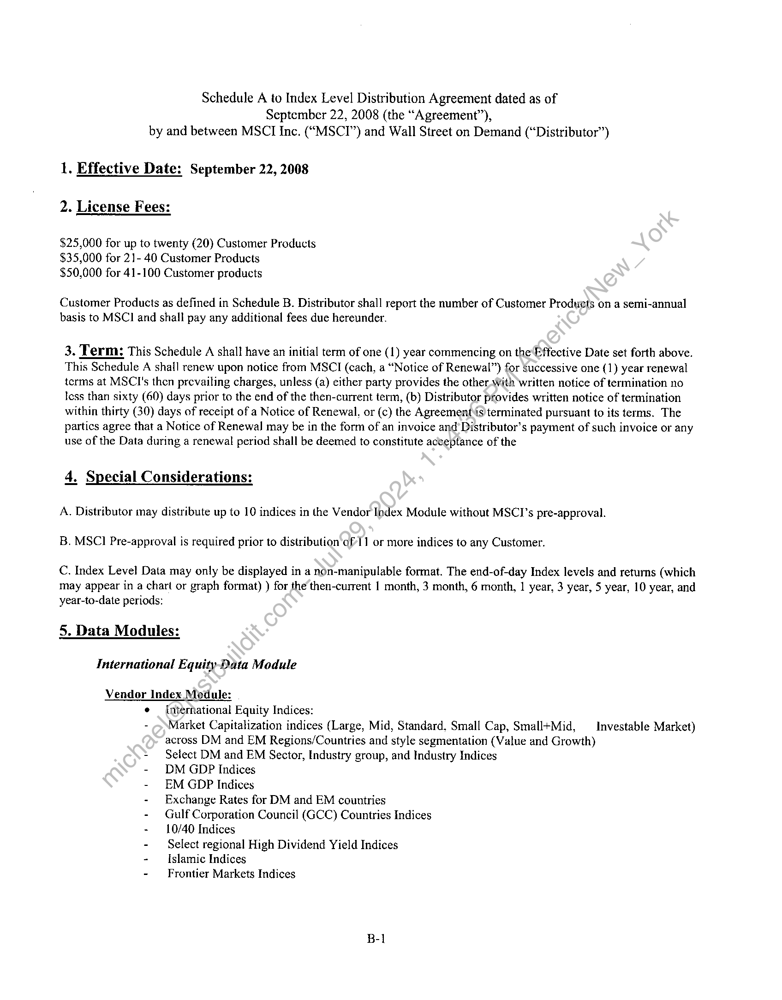
```  
```col-md
Schedule A to Index Level Distribution Agreement dated as of
September 22, 2008 (the “Agreement”),
by and between MSCT Inc. (“MSCI”) and Wall Street on Demand (“Distributor”)  
1. Effective Date: September 22, 2008  
2. License Fees:  
$25,000 for up to twenty (20) Customer Products
$35,000 for 21- 40 Customer Products
$50,000 for 41-100 Customer products  
Customer Products as defined in Schedule B. Distributor shall report the number of Customer Products on a semi-annual
basis to MSC] and shall pay any additional fees due hereunder.  
3. Term: This Schedule A shall have an initial term of one (1) year commencing on the Effective Date set forth above.
This Schedule A shall renew upon notice from MSCI (cach, a “Notice of Renewal”) for Successive one (1) year renewal
terms at MSCl's then prevailing charges, unless (a) either party provides the other With written notice of termination no
less than sixty (60) days prior to the end of the then-current term, (b) Distributor provides written notice of termination
within thirty (30) days of receipt of a Notice of Renewal, or (c) the Agreements terminated pursuant to its terms. The
partics agree that a Notice of Renewal may be in the form of an invoice and’ Distributor’s payment of such invoice or any
use of the Data during a renewal period shall be deemed to constitute acceptance of the  
4, Special Considerations:  
A. Distributor may distribute up to 10 indices in the Vendor Index Module without MSCI’s pre-approval.
B. MSC] Pre-approval is required prior to distribution of 11 or more indices to any Customer.  
C. Index Level Data may only be displayed in a non-manipulable format. The end-of-day Index levels and returns (which
may appear in a chart or graph format) ) for the then-current | month, 3 month, 6 month, 1 year, 3 year, 5 year, 10 year, and
year-to-date periods:  
5. Data Modules:  
International Equity Data Module  
Vendor Index Module:
¢ — international Equity Indices:
- ¢ Market Capitalization indices (Large, Mid, Standard. Small Cap, Small+Mid, —_ Investable Market)
across DM and EM Regions/Countries and style segmentation (Value and Growth)
+ Select DM and EM Sector, Industry group, and Industry Indices
- DM GDP Indices
- EM GDP Indices
- Exchange Rates for DM and EM countries
- Gulf Corporation Council (GCC) Countries Indices
- 10/40 Indices
- Select regional High Dividend Yield Indices
- Islamic Indices
- Frontier Markets Indices  
B-1  
```
````
Notes:    
````col
```col-md
flexGrow=.5
===
> [!info] [Page 10](_attachments/images_MSCI-Index-Data-3.6.4.1.14.2.3MSCI_MoD-IndexDistribution_Agreement_20080922.pdf_155339/page_10.png)
> 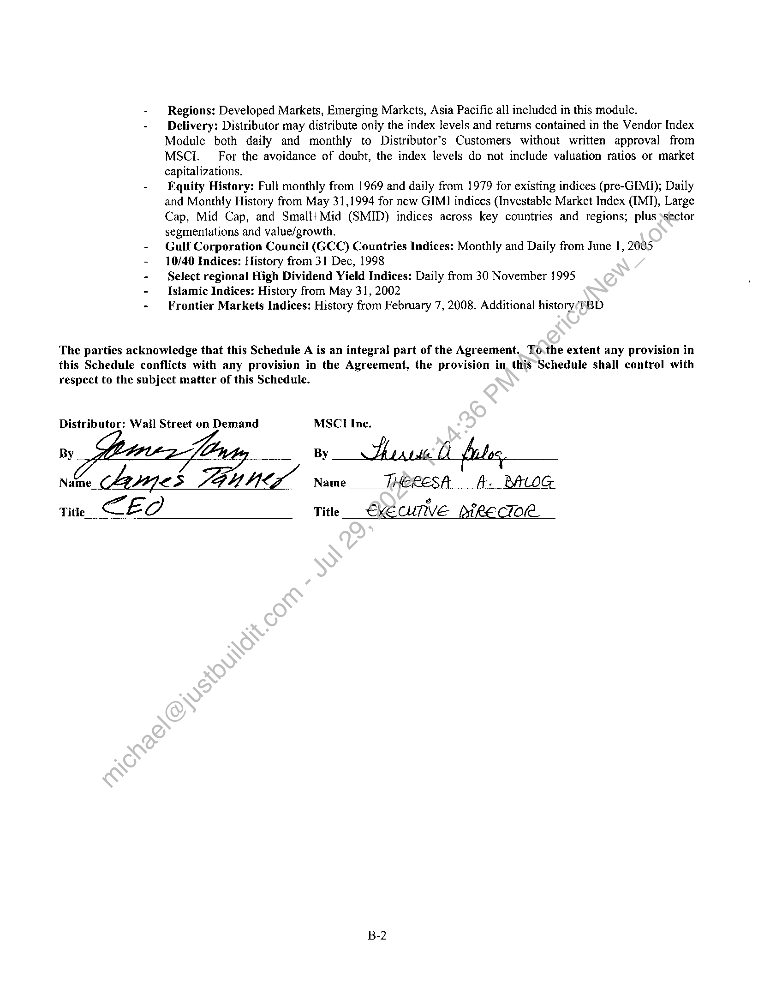
```  
```col-md
Regions: Developed Markets, Emerging Markets, Asia Pacific all included in this module.  
Delivery: Distributor may distribute only the index levels and returns contained in the Vendor Index
Module both daily and monthly to Distributor’s Customers without written approval from
MSCI. For the avoidance of doubt, the index levels do not include valuation ratios or market
capitalizations.  
Equity History: Full monthly from 1969 and daily from 1979 for existing indices (pre-GIMI); Daily
and Monthly History from May 31,1994 for new GIMI indices (Investable Market Index (IMI), Large
Cap, Mid Cap, and SmaltiMid (SMID) indices across key countries and regions; plus »sector
segmentations and value/growth.  
Gulf Corporation Council (GCC) Countries Indices: Monthly and Daily from June 1, 2005  
10/40 Indices: History from 3] Dec, 1998  
Select regional High Dividend Yield Indices: Daily from 30 November 1995  
Islamic Indices: History from May 31, 2002  
Frontier Markets Indices: History from February 7, 2008. Additional history TBD  
The parties acknowledge that this Schedule A is an integral part of the Agreement. To.the extent any provision in
this Schedule conflicts with any provision in the Agreement, the provision in this Schedule shall control with
respect to the subject matter of this Schedule.  
Distributor: Wail Street on Demand MSCI Inc.  
By  
By Burst files,  
Name 4ynes SGU Mix Name THERESA ft. BALOG  
Title CE a  
Title EXECUTIVE DikE CTO“.  
B-2  
```
````
Notes:    
````col
```col-md
flexGrow=.5
===
> [!info] [Page 11](_attachments/images_MSCI-Index-Data-3.6.4.1.14.2.3MSCI_MoD-IndexDistribution_Agreement_20080922.pdf_155339/page_11.png)
> 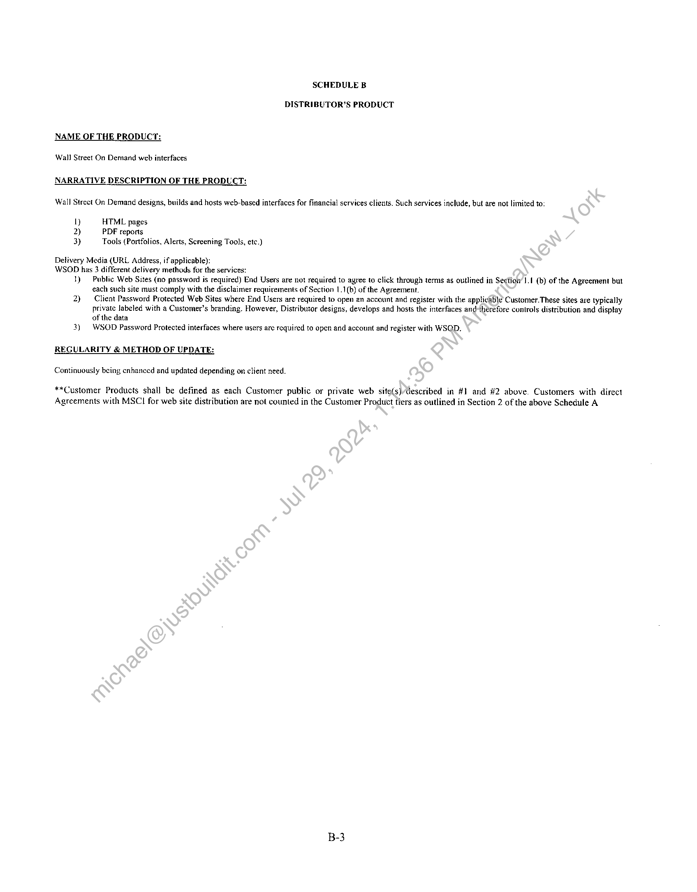
```  
```col-md
SCHEDULE B  
DISTRIBUTOR’S PRODUCT  
NAME OF THE PRODUCT:  
Wall Street On Demand web interfaces  
NARRATIVE DESCRIPTION OF THE PRODUCT:  
Wall Strect On Demand designs, builds and hosts web-based interfaces for financial services clients. Such services include, but are not limited to:  
i) HTML pages
2) PDF reports
3) Tools (Portfolios, Alerts, Screening Tools, etc.)  
Delivery Media (URL Address, if applicable):
WSOD has 3 different delivery methods for the services:  
1) Public Web Sites (no password is required) End Users are not required to agree to click through terms as outlined in Section’ 1.1 (b) of the Agreement but
each such site must comply with the disclaimer requirements of Section 1.1(b) of the Agreement.  
2) — Client Password Protected Web Sites where End Users are required to open an account and register with the applicable Customer. These sites are typically
private labeled with a Customer’s branding. However, Distributor designs, develops and hosts the interfaces and-thérefore controls distribution and display
of the data  
3) WSOD Password Protected interfaces where users are required to open and account and register with WSQD.  
REGULARITY & METHOD OF UPDATE:
Continuously being cnhaneed and updated depending on client need.  
**Customer Products shall be defined as each Customer public or private web site(s)/described in #1 and #2 above. Customers with direct
Agreements with MSCI for web site distribution are not counted in the Customer Product fiers as outlined in Section 2 of the above Schedule A  
```
````
Notes:    
````col
```col-md
flexGrow=.5
===
> [!info] [Page 12](_attachments/images_MSCI-Index-Data-3.6.4.1.14.2.3MSCI_MoD-IndexDistribution_Agreement_20080922.pdf_155339/page_12.png)
> 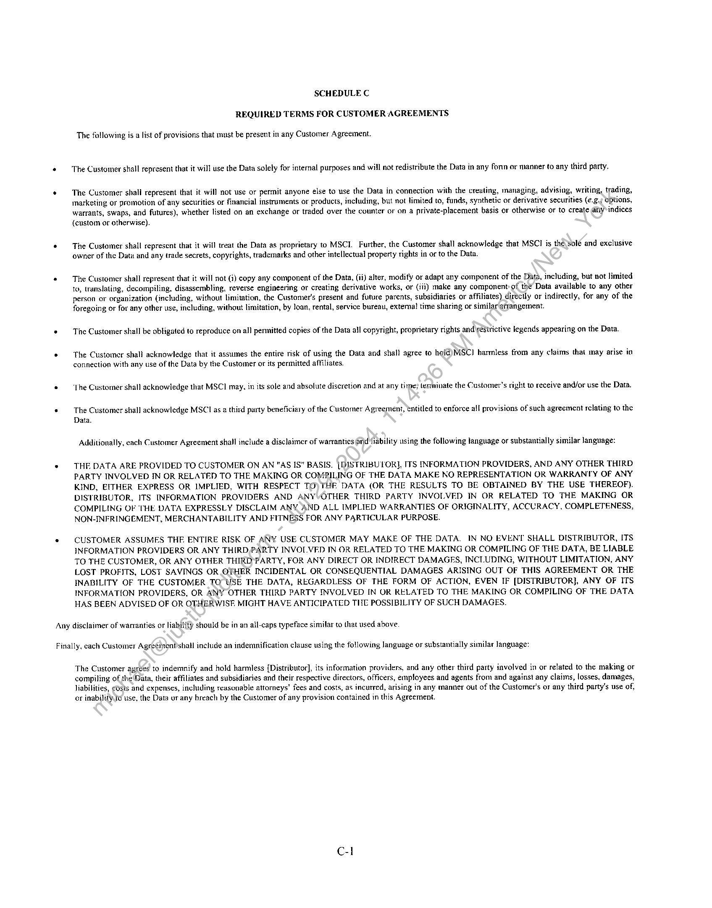
```  
```col-md
SCHEDULE C
REQUIRED TERMS FOR CUSTOMER AGREEMENTS  
The following is a list of provisions that must be present in any Customer Agreement.  
¢ The Customer shall represent that it will use the Data solely for internal purposes and will not redistribute the Data in any fonn or manner to any third party.  
¢ — The Customer shall represent that it will not use or permit anyone else to use the Data in connection with the creating, managing, advising, writing, trading,
marketing or promotion of any securities or financial instruments or products, including, but not limited to, funds, synthetic or derivative securities (e.g. eptions,
warrants, swaps, and futures), whether listed on an exchange or traded over the counter or on a private-placement basis or otherwise or to create ahy*indices
(custom or otherwise).  
¢ — The Customer shall represent that it will treat the Data as proprietary to MSCI. Further, the Customer shall acknowledge that MSCI is the sole and exclusive
owner of the Data and any trade secrets, copyrights, trademarks and other intellectual property rights in or to the Data.  
© — The Customer shall represent that it will not () copy any component of the Data, (ii) alter, modify or adapt any component of the Data, including, but not limited
to, translating, decompiling, disassembling, reverse engineering or creating derivative works, or (iii) make any component of the Data available to any other
person or organization (including, without limitation, the Customer's present and future parents, subsidiaries or affiliates) directly or indirectly, for any of the
foregoing or for any other use, including, without limitation, by loan. rental, service bureau, extemal! time sharing or similar arrangement.  
* The Customer shall be obligated to reproduce on all permitted copies of the Data all copyright, proprietary rights and restrictive legends appearing on the Data.  
. The Customer shal! acknowledge that it assiunes the entire risk of using the Data and shall agree to held)MSCI harmless from any claims that may arise in
connection with any use of the Data by the Customer or its permitted affiliates.  
« ‘The Customer shall acknowledge that MSCI may, in its sole and absolute discretion and at any time; lemninate the Customer's right to receive and/or use the Data.  
. The Customer shall acknowledge MSC as a third party beneficiary of the Customer Agreement, entitled to enforce all provisions of such agreement relating to the
Data.  
Additionally, each Customer Agreement shall include a disclaimer of warranties @nid'liability using the following language or substantially similar language:  
* THE DATA ARE PROVIDED TO CUSTOMER ON AN “AS IS" BASIS. [DISTRIBUTOR], ITS INFORMATION PROVIDERS, AND ANY OTHER THIRD
PARTY INVOLVED IN OR RELATED TO THE MAKING OR COMPILING OF THE DATA MAKE NO REPRESENTATION OR WARRANTY OF ANY
KIND, EITHER EXPRESS OR IMPLIED, WITH RESPECT TO) THE DATA (OR THE RESULTS TO BE OBTAINED BY THE USE THEREOF).
DISTRIBUTOR, ITS INFORMATION PROVIDERS AND ANYVOTHER THIRD PARTY INVOLVED IN OR RELATED TO THE MAKING OR
COMPILING OF THE DATA EXPRESSLY DISCLAIM ANY AND ALL IMPLIED WARRANTIES OF ORIGINALITY, ACCURACY, COMPLETENESS,
NON-INFRINGEMENT, MERCHANTABILITY AND FITNESS FOR ANY PARTICULAR PURPOSE.  
* CUSTOMER ASSUMES THE ENTIRE RISK OF ANY USE CUSTOMER MAY MAKE OF THE DATA. IN NO EVENT SHALL DISTRIBUTOR, ITS
INFORMATION PROVIDERS OR ANY THIRD,PARTY INVOLVED IN OR RELATED TO THE MAKING OR COMPILING OF THE DATA, BE LIABLE
TO THE CUSTOMER, OR ANY OTHER THIRD PARTY, FOR ANY DIRECT OR INDIRECT DAMAGES, INCLUDING, WITHOUT LIMITATION, ANY
LOST PROFITS, LOST SAVINGS OR OTHER INCIDENTAL OR CONSEQUENTIAL DAMAGES ARISING OUT OF THIS AGREEMENT OR THE
INABILITY OF THE CUSTOMER TO USE THE DATA, REGARDLESS OF THE FORM OF ACTION, EVEN IF [DISTRIBUTOR], ANY OF ITS
INFORMATION PROVIDERS, OR ANY OTHER THIRD PARTY INVOLVED IN OR RELATED TO THE MAKING OR COMPILING OF THE DATA
HAS BEEN ADVISED OF OR OTHERWISE MIGHT HAVE ANTICIPATED THE POSSIBILITY OF SUCH DAMAGES.  
Any disclaimer of warranties or liability should be in an all-caps typeface similar to that used above.  
Finally, cach Customer Agr¢éinenishall include an indemnification clause using the following language or substantially similar language:
The Customer agreés to indemnify and hold harmless [Distributor], its information providers, and any other third party involved in or related to the making or
compiling of the Data, their affiliates and subsidiaries and their respective directors, officers, employees and agents from and against any claims, losses, damages,  
liabilities, costs and expenses, including reasonable attorneys’ fees and costs, as incurred, arising in any manner out of the Customer's or any third party's use of,
or inability.to use, the Data or any breach by the Customer of any provision contained in this Agreement.  
C-l  
```
````
Notes:  


![[_attachments/MSCI-Index-Data-3.6.4.1.14.2.3 MSCI_MoD-IndexDistribution_Agreement_20080922.pdf]