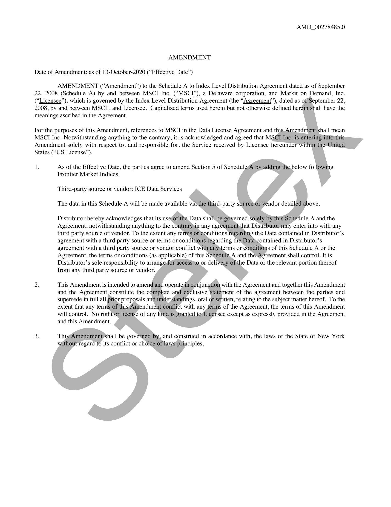
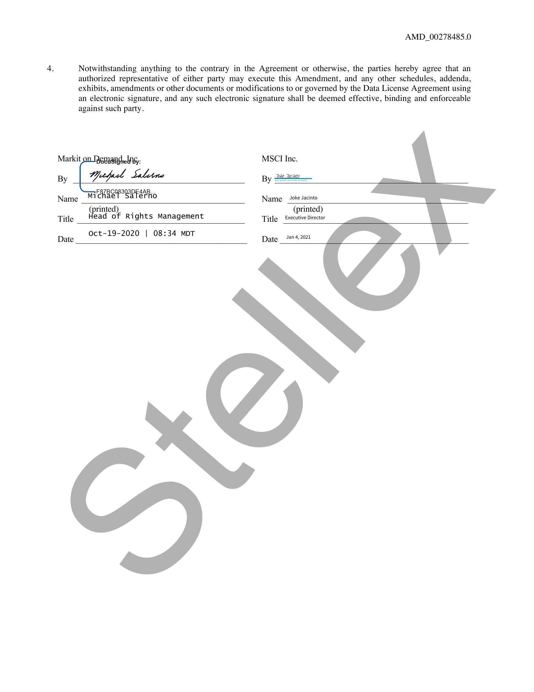

##### Amendment to Schedule A to Index Level Distribution Agreement]

  
````col
```col-md
flexGrow=.5
===
> [!info] [Page 1](_attachments/images_MSCI-Index-Data-3.6.4.1.14.2.4MSCI_MOD_IndexDistribution_ScheduleA_Amendment_20201013.pdf_155020/page_1.png)
> 
```  
```col-md
AMENDMENT  
Date of Amendment: as of 13-October-2020 (“Effective Date’)  
AMD_00278485.0  
AMENDMENT (“Amendment”) to the Schedule A to Index Level Distribution Agreement dated as of September
22, 2008 (Schedule A) by and between MSCI Inc. (“MSCI”), a Delaware corporation, and Markit on Demand, Inc.
(“Licensee”), which is governed by the Index Level Distribution Agreement (the “Agreement”), dated as of September 22,  
2008, by and between MSCI , and Licensee. Capitalized terms used herein but not otherwise defi
meanings ascribed in the Agreement.  
ined herein shall have the  
For the purposes of this Amendment, references to MSCI in the Data License Agreement and this.Amendment shall mean  
MSCI Inc. Notwithstanding anything to the contrary, it is acknowledged and agreed that MSCI  
Inc. is entering into this  
Amendment solely with respect to, and responsible for, the Service received by Licensee hereunder within the United  
States (“US License”).  
1. As of the Effective Date, the parties agree to amend Section 5 of ScheduleA by adding
Frontier Market Indices:  
Third-party source or vendor: ICE Data Services  
the below following  
The data in this Schedule A will be made available via the third-party sourceor vendor detailed above.  
Distributor hereby acknowledges that its use(of the Data shall be governed solely byithis Schedule A and the
Agreement, notwithstanding anything to the contrarypin any agreementthat Distributor may enter into with any
third party source or vendor. To the extent any terms or conditions regarding the Data contained in Distributor’s  
agreement with a third party source or terms or conditions regarding the Dataycontained  
in Distributor’s  
agreement with a third party source or vendor conflict with anysterms or conditions of this Schedule A or the
Agreement, the terms or conditions (as applicable) of this Schedule.A and the Agreement shall control. It is  
Distributor’s sole responsibility to arranger access)to or delivery of\the Data or the re!
from any third party source or vendor.  
2. This Amendment is intended to amend and operatedn conjunetion with the Agreement and
and the Agreement constitute the complete and exclusive statement of the agreement  
evant portion thereof  
together this Amendment
between the parties and  
supersede in full all ptior proposals and understandings, oral or written, relating to the subject matter hereof. To the
extent that any terms of thisAmendment conflict with any terms of the Agreement, the terms of this Amendment
will control. No right or license of any kind is granted torLicensee except as expressly provided in the Agreement  
and this Amendment.  
3. ThissAmendment shall be governed by, and construed in accordance with, the laws o
without regard to its conflict or choice of\laws principles.  
the State of New York  
```
````
Notes:    
````col
```col-md
flexGrow=.5
===
> [!info] [Page 2](_attachments/images_MSCI-Index-Data-3.6.4.1.14.2.4MSCI_MOD_IndexDistribution_ScheduleA_Amendment_20201013.pdf_155020/page_2.png)
> 
```  
```col-md
AMD_00278485.0  
Notwithstanding anything to the contrary in the Agreement or otherwise, the parties hereby agree that an
authorized representative of either party may execute this Amendment, and any other schedules, addenda,
exhibits, amendments or other documents or modifications to or governed by the Data License Agreement using
an electronic signature, and any such electronic signature shall be deemed effective, binding and enforceable  
against such party.
Markit : MSCI Inc.
py | Geped Saline By 2edite—
Name M1 Hae Poor at tio Name Joke Jacinto
(printed) . (printed)
Title ead of Rights Management Title | fxecutive Director  
Oct-19-2020 | 08:34 MDT
Date | Date  
Jan 4, 2021  
```
````
Notes:  


![[_attachments/MSCI-Index-Data-3.6.4.1.14.2.4 MSCI_MOD_IndexDistribution_ScheduleA_Amendment_20201013.pdf]