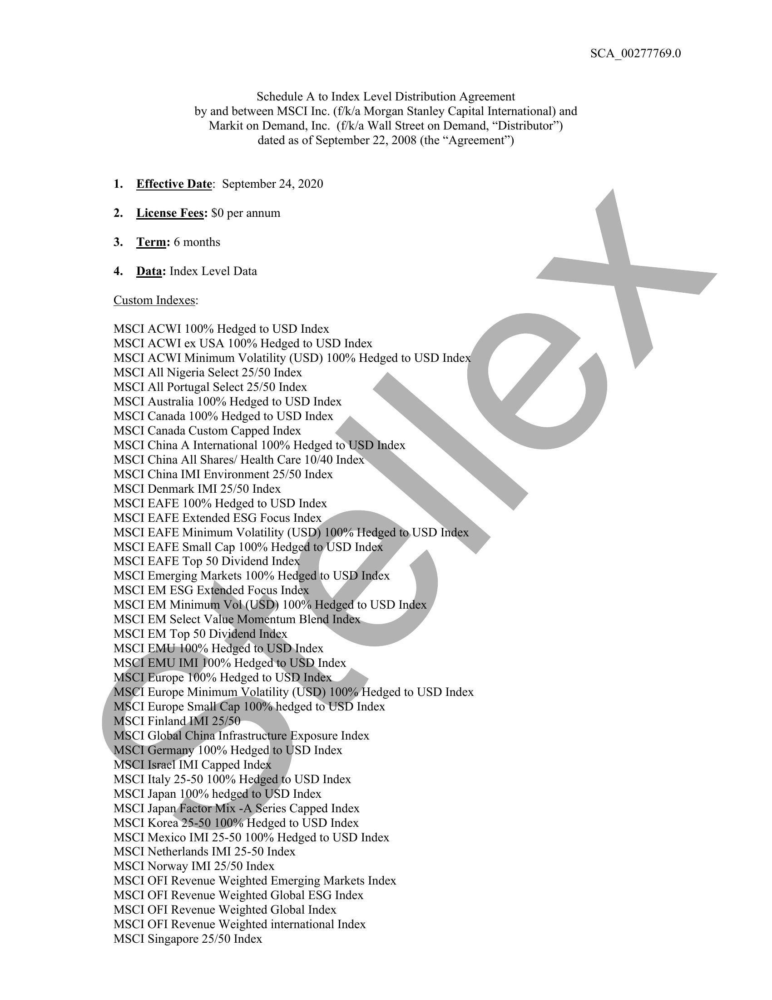
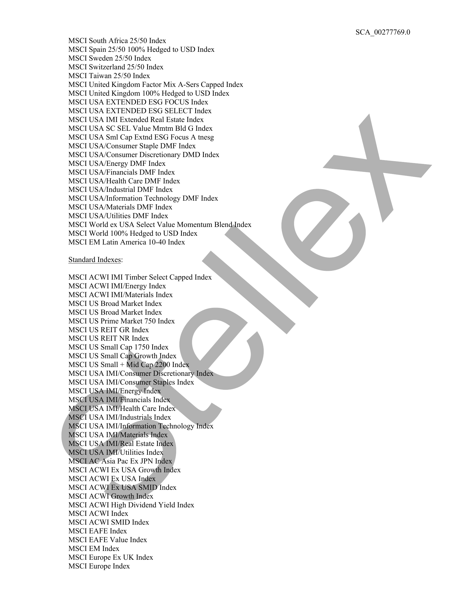
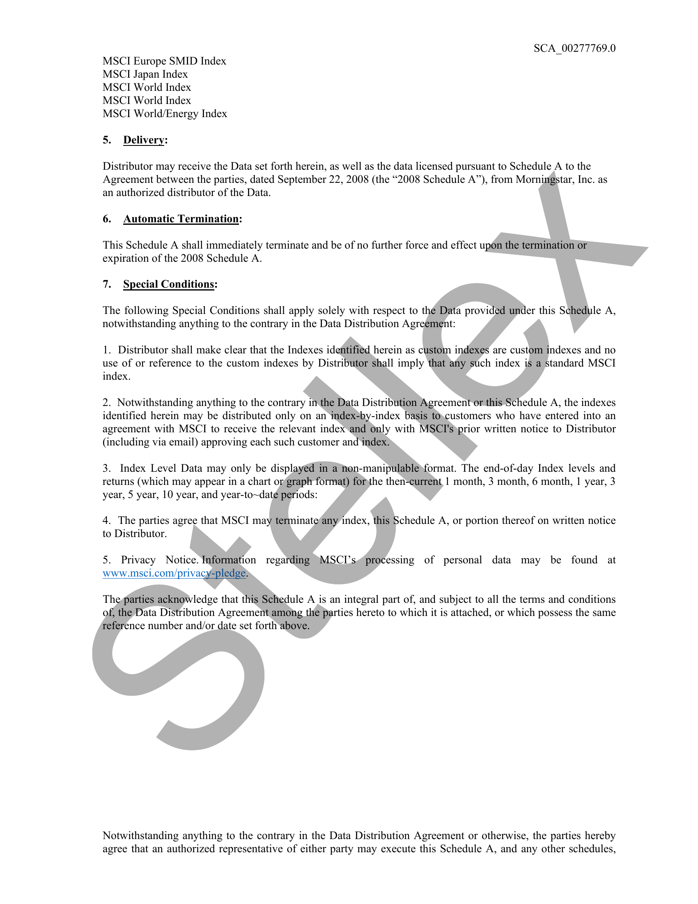
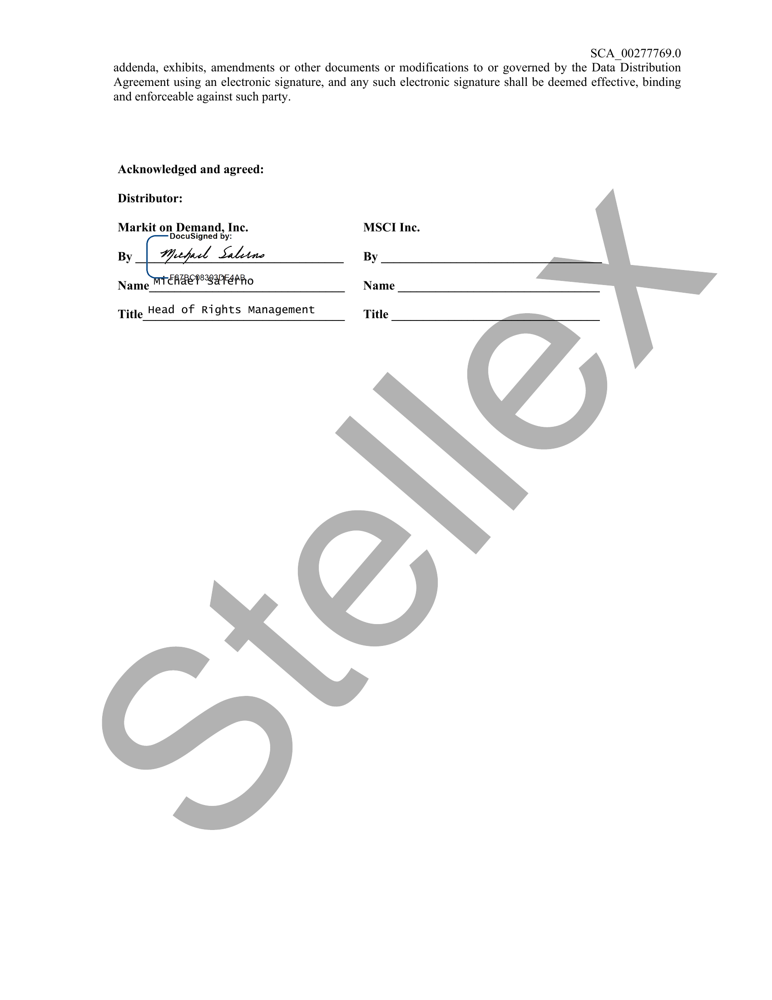

##### Schedule A to Index Level Distribution Agreement]

  
````col
```col-md
flexGrow=.5
===
> [!info] [Page 1](_attachments/images_MSCI-Index-Data-3.6.4.1.14.2.5MSCI_MOD_IndexDistribution_ScheduleA_20200924.pdf_155104/page_1.png)
> 
```  
```col-md
Schedule A to Index Level Distribution Agreement
by and between MSCI Inc. (f/k/a Morgan Stanley Capital International) and
Markit on Demand, Inc. (f/k/a Wall Street on Demand, “Distributor’”)
dated as of September 22, 2008 (the “Agreement”)  
1. Effective Date: September 24, 2020
2. License Fees: $0 per annum  
3. Term: 6 months  
4. Data: Index Level Data  
Custom Indexes:  
MSCI ACWI 100% Hedged to USD Index  
MSCI ACWI ex USA 100% Hedged to USD Index
MSCI ACWI Minimum Volatility (USD) 100% Hedged to USD Index
MSCI All Nigeria Select 25/50 Index  
MSCI All Portugal Select 25/50 Index  
MSCI Australia 100% Hedged to USD Index  
MSCI Canada 100% Hedged to USD Index  
MSCI Canada Custom Capped Index  
MSCI China A International 100% Hedged to USD Index
MSCI China All Shares/ Health Care 10/40 Index  
MSCI China IMI Environment 25/50 Index  
MSCI Denmark IMI 25/50 Index  
MSCI EAFE 100% Hedged to USD Index  
MSCI EAFE Extended ESG Focus Index  
MSCI EAFE Minimum Volatility (USD) 100% Hedged to, USD Index
MSCI EAFE Small Cap 100% Hedged to USD Index
MSCI EAFE Top 50 Dividend Index  
MSCI Emerging Markets 100% Hedged to USD Index
MSCI EM ESG Extended Focus Index  
MSCI EM Minimum Voh(USD) 100% Hedged to USD Index
MSCI EM Select Value Momentum Blend Index  
MSCI EM Top 50 Dividend Index  
MSCI EMUsh00% Hedged to USD,Index  
MSGI EMU IMI 100% Hedged to USD Index  
MSCI Europe 100% Hedged to USD Index.  
MSCI Europe Minimum Volatility (USD) 100% Hedged to USD Index
MSCI Europe SmallCap 100%,hedged to USD Index
MSCI Finland IMI 25/50  
MSCI Global China Infrastructure Exposure Index
MSCIGermany 100% Hedged'to USD Index  
MSCL Israel IMI Capped Index  
MSCI Italy 25-50 100% Hedged to USD Index  
MSCI Japan 100% hedged to USD Index  
MSCI JapanFactorMix -A Series Capped Index  
MSCI Korea 25-50 100% Hedged to USD Index  
MSCI Mexico IMI 25-50 100% Hedged to USD Index
MSCI Netherlands IMI 25-50 Index  
MSCI Norway IMI 25/50 Index  
MSCI OFI Revenue Weighted Emerging Markets Index
MSCI OFI Revenue Weighted Global ESG Index  
MSCI OFI Revenue Weighted Global Index  
MSCI OFI Revenue Weighted international Index  
MSCI Singapore 25/50 Index  
SCA_00277769.0  
```
````
Notes:    
````col
```col-md
flexGrow=.5
===
> [!info] [Page 2](_attachments/images_MSCI-Index-Data-3.6.4.1.14.2.5MSCI_MOD_IndexDistribution_ScheduleA_20200924.pdf_155104/page_2.png)
> 
```  
```col-md
MSCI South Africa 25/50 Index  
MSCI Spain 25/50 100% Hedged to USD Index
MSCI Sweden 25/50 Index  
MSCI Switzerland 25/50 Index  
MSCI Taiwan 25/50 Index  
MSCI United Kingdom Factor Mix A-Sers Capped Index
MSCI United Kingdom 100% Hedged to USD Index
MSCI USA EXTENDED ESG FOCUS Index  
MSCI USA EXTENDED ESG SELECT Index
MSCI USA IMI Extended Real Estate Index  
MSCI USA SC SEL Value Mmtm Bld G Index
MSCI USA Sml Cap Extnd ESG Focus A tnesg
MSCI USA/Consumer Staple DMF Index  
MSCI USA/Consumer Discretionary DMD Index
MSCI USA/Energy DMF Index  
MSCI USA/Financials DMF Index  
MSCI USA/Health Care DMF Index  
MSCI USA/Industrial DMF Index  
MSCI USA/Information Technology DMF Index
MSCI USA/Materials DMF Index  
MSCI USA/Utilities DMF Index  
MSCI World ex USA Select Value Momentum BlendJndex
MSCI World 100% Hedged to USD Index  
MSCI EM Latin America 10-40 Index  
Standard Indexes:  
MSCI ACWI IMI Timber Select Capped Index
MSCI ACWI IMI/Energy Index  
MSCI ACWI IMI/Materials Index  
MSCI US Broad Market Index  
MSCI US Broad Market Index  
MSCI US Prime Market 750 Index
MSCI US REIT GR Index  
MSCI US REIT NR Index  
MSCI US Small Cap 1750 Index  
MSCI US Small Cap)Growth Index
MSCI US Small + Mid Cap2200 Index
MSCI USA IMI/Consumer Discretionary Index
MSCI USA IMI/Consumer Staples Index
MSCI USAsiMI/Energy Index  
MSGI USA IMI/Financials Index,  
MSCI USA IMI/Health Care Index
MSCI USA IMI/Industrials Index  
MSCI USA IMI/Information Technology Index
MSCI USA IMI/Materials Index  
MSCI USAdMI/Real Estate Index
MSCIUSA IMI1/Utilities Index  
MSCI AC Asia Pac Ex JPN Index  
MSCI ACWI Ex USA Growth Index
MSCI ACWI Ex USA Index  
MSCI ACWI Ex\USA SMID Index
MSCI ACWI Growth Index  
MSCI ACWI High Dividend Yield Index
MSCI ACWI Index  
MSCI ACWI SMID Index  
MSCI EAFE Index  
MSCI EAFE Value Index  
MSCI EM Index  
MSCI Europe Ex UK Index  
MSCI Europe Index  
SCA_00277769.0  
```
````
Notes:    
````col
```col-md
flexGrow=.5
===
> [!info] [Page 3](_attachments/images_MSCI-Index-Data-3.6.4.1.14.2.5MSCI_MOD_IndexDistribution_ScheduleA_20200924.pdf_155104/page_3.png)
> 
```  
```col-md
SCA_00277769.0
MSCI Europe SMID Index
MSCI Japan Index
MSCI World Index
MSCI World Index
MSCI World/Energy Index  
5. Delivery:  
Distributor may receive the Data set forth herein, as well as the data licensed pursuant to Schedule A to the
Agreement between the parties, dated September 22, 2008 (the “2008 Schedule A”), from Morningstar, Inc. as
an authorized distributor of the Data.  
6. Automatic Termination:  
This Schedule A shall immediately terminate and be of no further force and effect upon the termination/or
expiration of the 2008 Schedule A.  
7. Special Conditions:  
The following Special Conditions shall apply solely with respect to the Data provided under this Schedule A,
notwithstanding anything to the contrary in the Data Distribution Agreement:  
1. Distributor shall make clear that the Indexes identified herein as custom indexes are custom indexes and no
use of or reference to the custom indexes by Distributor shall imply that any such index is a standard MSCI
index.  
2. Notwithstanding anything to the contrary in the Data Distribution Agreement or this Schedule A, the indexes
identified herein may be distributed only on an index*by-index basis to,customers who have entered into an
agreement with MSCTI to receive the relevant index and only with MSCI'syprior written notice to Distributor
(including via email) approving each such customer and index)  
3. Index Level Data may only be displayed in anon-manipulable)format. The end-of-day Index levels and
returns (which may appear in a chart orgraph format) forthe then-current, 1 month, 3 month, 6 month, | year, 3
year, 5 year, 10 year, and year-to~date periods:  
4. The parties agree that MSCI may terminate“any index, this Schedule A, or portion thereof on written notice
to Distributor.  
5. Privacy Notice. Information regarding )MSCI’s@processing of personal data may be found at
www.msci.com/privacyspledge>  
The@arties acknowledge that this Schedule A is an integral part of, and subject to all the terms and conditions
of, the Data Distribution Agreement among the parties hereto to which it is attached, or which possess the same
reference number and/or date set forth above.  
Notwithstanding anything to the contrary in the Data Distribution Agreement or otherwise, the parties hereby
agree that an authorized representative of either party may execute this Schedule A, and any other schedules,  
```
````
Notes:    
````col
```col-md
flexGrow=.5
===
> [!info] [Page 4](_attachments/images_MSCI-Index-Data-3.6.4.1.14.2.5MSCI_MOD_IndexDistribution_ScheduleA_20200924.pdf_155104/page_4.png)
> 
```  
```col-md
SCA_00277769.0
addenda, exhibits, amendments or other documents or modifications to or governed by the Data Distribution  
Agreement using an electronic signature, and any such electronic signature shall be deemed effective, binding
and enforceable against such party.  
Acknowledged and agreed:
Distributor:  
Markit on Demand, Inc. MSCI Inc.
DocuSigned by:  
By_| Yeepucd Sabine By
Name MTEREEP-IEREAO  
Name  
Title Head of Rights Management Title  
S
g
oO  
```
````
Notes:  


![[_attachments/MSCI-Index-Data-3.6.4.1.14.2.5 MSCI_MOD_IndexDistribution_Schedule A_20200924.pdf]