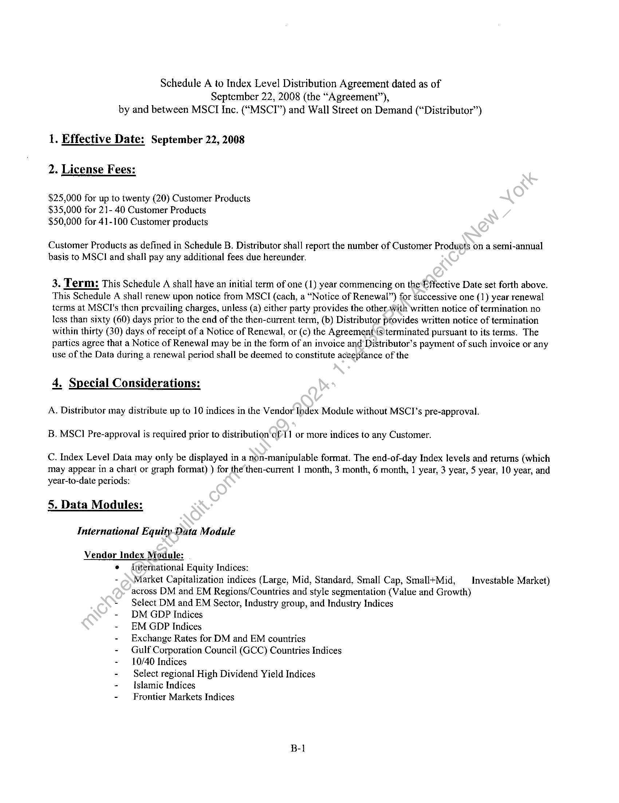
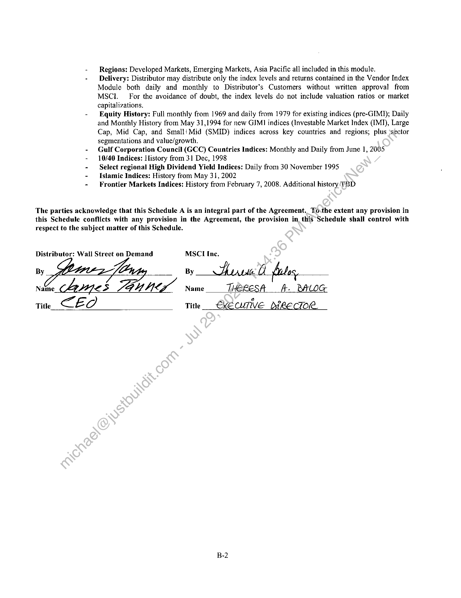
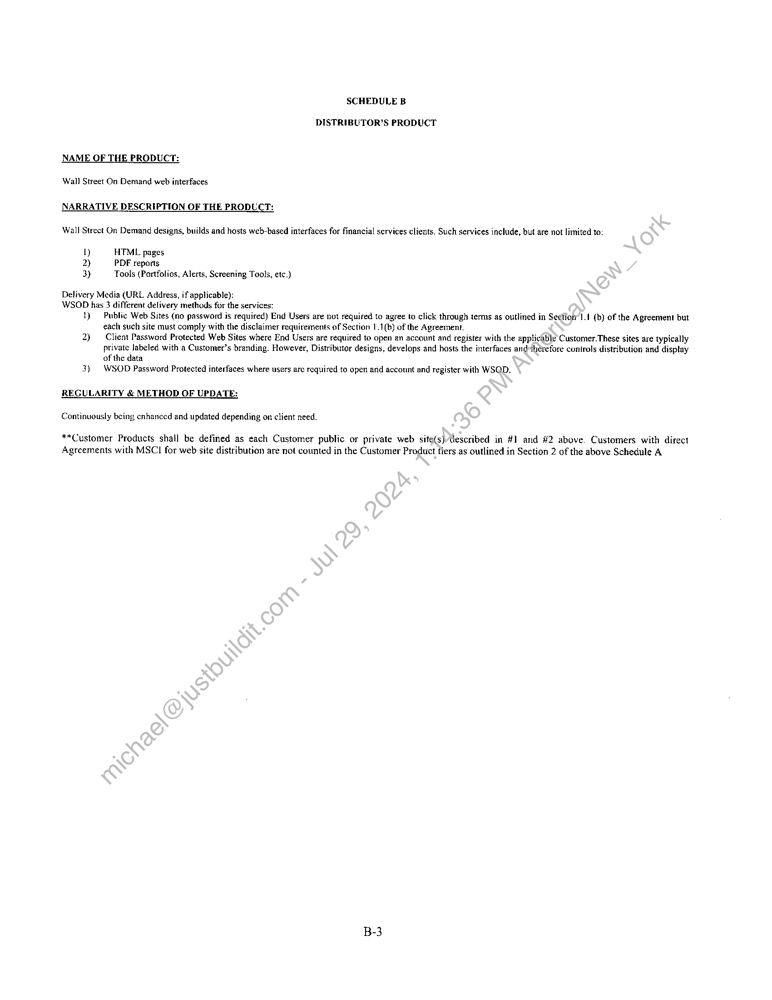
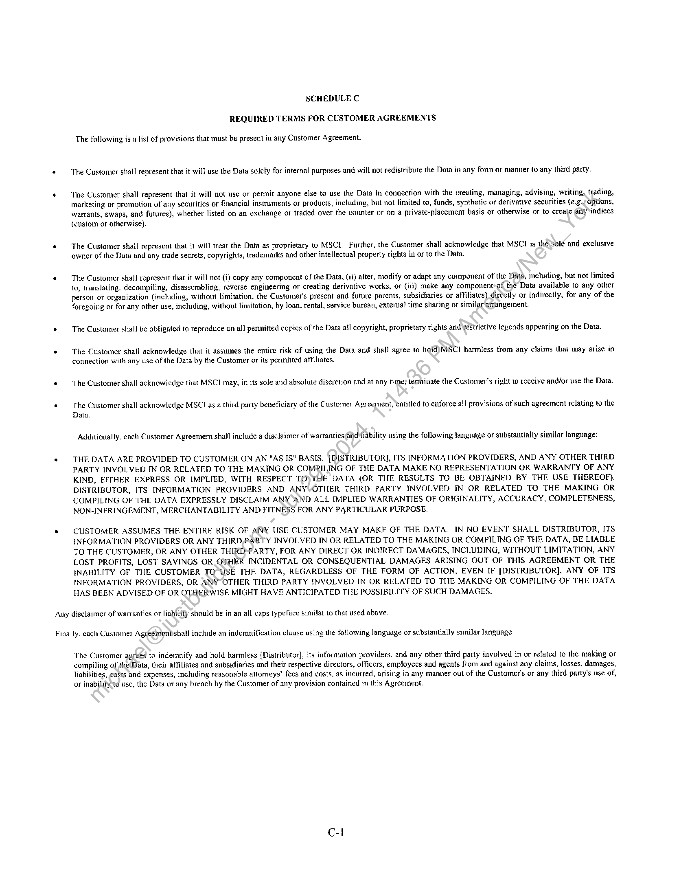

##### Schedule A to Index Level Distribution Agreement]

  
````col
```col-md
flexGrow=.5
===
> [!info] [Page 1](_attachments/images_MSCI-Index-Data-3.6.4.1.14.2.6MSCI_MOD_IndexDistribution_ScheduleA_20080922.pdf_155224/page_1.png)
> 
```  
```col-md
Schedule A to Index Level Distribution Agreement dated as of
September 22, 2008 (the “Agreement”),
by and between MSCT Inc. (“MSCI”) and Wall Street on Demand (“Distributor”)  
1. Effective Date: September 22, 2008  
2. License Fees:  
$25,000 for up to twenty (20) Customer Products
$35,000 for 21- 40 Customer Products
$50,000 for 41-100 Customer products  
Customer Products as defined in Schedule B. Distributor shall report the number of Customer Produots on a semi-annual
basis to MSC] and shall pay any additional fees due hereunder.  
3. Term: This Schedule A shall have an initial term of one (1) year commencing on the Effective Date set forth above.
This Schedule A shall renew upon notice from MSCI (cach, a “Notice of Renewal”) for Successive one (1) year renewal
terms at MSCl's then prevailing charges, unless (a) either party provides the other With written notice of termination no
less than sixty (60) days prior to the end of the then-current term, (b) Distributor provides written notice of termination
within thirty (30) days of receipt of a Notice of Renewal, or (c) the Agreementiis) terminated pursuant to its terms. The
partics agree that a Notice of Renewal may be in the form of an invoice and’ Distributor’s payment of such invoice or any
use of the Data during a renewal period shall be deemed to constitute aceeptance of the  
4, Special Considerations:  
A, Distributor may distribute up to 10 indices in the Vendor Index Module without MSCI’s pre-approval.
B. MSC] Pre-approval is required prior to distribution of 11 or more indices to any Customer.  
C. Index Level Data may only be displayed in a non-manipulable format. The end-of-day Index levels and returns (which
may appear in a chart or graph format) ) for the then-current | month, 3 month, 6 month, 1 year, 3 year, 5 year, 10 year, and
year-to-date periods:  
5. Data Modules:  
International Equity-Data Module  
Vendor Index Module:
¢ dnternational Equity Indices:
- \\Market Capitalization indices (Large, Mid, Standard. Small Cap, Small+Mid, —_ Investable Market)
across DM and EM Regions/Countries and style segmentation (Value and Growth)
~ Select DM and EM Sector, Industry group, and Industry Indices
- DM GDP Indices
- EM GDP Indices
- Exchange Rates for DM and EM countries
- Gulf Corporation Council (GCC) Countries Indices
- 10/40 Indices
- Select regional High Dividend Yield Indices
- Islamic Indices
- Frontier Markets Indices  
B-1  
```
````
Notes:    
````col
```col-md
flexGrow=.5
===
> [!info] [Page 2](_attachments/images_MSCI-Index-Data-3.6.4.1.14.2.6MSCI_MOD_IndexDistribution_ScheduleA_20080922.pdf_155224/page_2.png)
> 
```  
```col-md
Regions: Developed Markets, Emerging Markets, Asia Pacific all included in this module.  
Delivery: Distributor may distribute only the index levels and returns contained in the Vendor Index
Module both daily and monthly to Distributor’s Customers without written approval from
MSCI. For the avoidance of doubt, the index levels do not include valuation ratios or market
capitalizations.  
Equity History: Full monthly from 1969 and daily from 1979 for existing indices (pre-GIMI); Daily
and Monthly History from May 31,1994 for new GIMI indices (Investable Market Index (IMI), Large
Cap, Mid Cap, and SmaltiMid (SMID) indices across key countries and regions; plus \sector
segmentations and value/growth.  
Gulf Corporation Council (GCC) Countries Indices: Monthly and Daily from June 1, 2005  
10/40 Indices: History from 3] Dec, 1998  
Select regional High Dividend Yield Indices: Daily from 30 November 1995  
Islamic Indices: History from May 31, 2002  
Frontier Markets Indices: History from February 7, 2008. Additional history TBD  
The parties acknowledge that this Schedule A is an integral part of the Agreement. To.the extent any provision in
this Schedule conflicts with any provision in the Agreement, the provision in this Schedule shall control with
respect to the subject matter of this Schedule.  
Distributor: Wail Street on Demand MSCI Inc.  
By  
By ArwicO_files,  
Name 4ynes SGU Mix Name THERESA fA. BALOG
Title CEO Title €XECUTIVE DeeECTOR  
B-2  
```
````
Notes:    
````col
```col-md
flexGrow=.5
===
> [!info] [Page 3](_attachments/images_MSCI-Index-Data-3.6.4.1.14.2.6MSCI_MOD_IndexDistribution_ScheduleA_20080922.pdf_155224/page_3.png)
> 
```  
```col-md
SCHEDULE B  
DISTRIBUTOR’S PRODUCT  
NAME OF THE PRODUCT:  
Wall Street On Demand web interfaces  
NARRATIVE DESCRIPTION OF THE PRODUCT:  
Wall Strect On Demand designs, builds and hosts web-based interfaces for financial services clients. Such services include, but are not limited to:  
i) HTML pages
2) PDF reports
3) Tools (Portfolios, Alerts, Screening Tools, etc.)  
Delivery Media (URL Address, if applicable):
WSOD has 3 different delivery methods for the services:  
1) Public Web Sites (no password is required) End Users are not required to agree to click through terms as outlined in Section’1.1 (b) of the Agreement but
each such site must comply with the disclaimer requirements of Section 1.1(b) of the Agreement.  
2) — Client Password Protected Web Sites where End Users are required to open an account and register with the applicable’ Customer. These sites are typically
private labeled with a Customer’s branding. However, Distributor designs, develops and hosts the interfaces andvtherefore controls distribution and display
of the data  
3) | WSOD Password Protected interfaces where users are required to open and account and register with WSQD.  
REGULARITY & METHOD OF UPDATE:
Continuously being cnhaneed and updated depending on client need.  
**Customer Products shall be defined as each Customer public or private web site(s)/described in #1 and #2 above. Customers with direct
Agreements with MSCI for web site distribution are not counted in the Customer Product tiers as outlined in Section 2 of the above Schedule A  
```
````
Notes:    
````col
```col-md
flexGrow=.5
===
> [!info] [Page 4](_attachments/images_MSCI-Index-Data-3.6.4.1.14.2.6MSCI_MOD_IndexDistribution_ScheduleA_20080922.pdf_155224/page_4.png)
> 
```  
```col-md
SCHEDULE C
REQUIRED TERMS FOR CUSTOMER AGREEMENTS  
The following is a list of provisions that must be present in any Customer Agreement.  
¢ The Customer shall represent that it will use the Data solely for internal purposes and will not redistribute the Data in any fonn or manner to any third party.  
¢ — The Customer shall represent that it will not use or permit anyone else to use the Data in connection with the creating, managing, advising, writing, trading,
marketing or promotion of any securities or financial instruments or products, including, but not limited to, funds, synthetic or derivative securities (¢.g./ options,
warrants, swaps, and futures), whether listed on an exchange or traded over the counter or on a private-placement basis or otherwise or to create any\indices
(custom or otherwise).  
¢ — The Customer shall represent that it will treat the Data as proprietary to MSCI. Further, the Customer shall acknowledge that MSCI is the sole and exclusive
owner of the Data and any trade secrets, copyrights, trademarks and other intellectual property rights in or to the Data.  
© — The Customer shall represent that it will not (@) copy any component of the Data, (ii) alter, modify or adapt any component of the Data, including, but not limited
to, translating, decompiling, disassembling, reverse engineering or creating derivative works, or (ii) make any component of the Data available to any other
person or organization (including, without limitation, the Customer's present and future parents, subsidiaries or affiliates) directly or indirectly, for any of the
foregoing or for any other use, including, without limitation, by loan. rental, service bureau, extemal! time sharing or similar arrangement.  
* The Customer shall be obligated to reproduce on all permitted copies of the Data all copyright, proprietary rights and restrictive legends appearing on the Data.  
. The Customer shal! acknowledge that it assiunes the entire risk of using the Data and shall agree to held)MSCI harmless from any claims that may arise in
connection with any use of the Data by the Customer or its permitted affiliates.  
« ‘The Customer shall acknowledge that MSCI may, in its sole and absolute discretion and at any time lemminate the Customer's right to receive and/or use the Data.  
. The Customer shall acknowledge MSC as a third party beneficiary of the Customer Agreement, entitled to enforce all provisions of such agreement relating to the
Data.  
Additionally, each Customer Agreement shall include a disclaimer of warranties and liability using the following language or substantially similar language:  
* THE DATA ARE PROVIDED TO CUSTOMER ON AN “AS IS" BASIS. [DISTRIBUTOR], ITS INFORMATION PROVIDERS, AND ANY OTHER THIRD
PARTY INVOLVED IN OR RELATED TO THE MAKING OR COMPILING OF THE DATA MAKE NO REPRESENTATION OR WARRANTY OF ANY
KIND, EITHER EXPRESS OR IMPLIED, WITH RESPECT TQ) THE DATA (OR THE RESULTS TO BE OBTAINED BY THE USE THEREOF).
DISTRIBUTOR, ITS INFORMATION PROVIDERS AND ANYVOTHER THIRD PARTY INVOLVED IN OR RELATED TO THE MAKING OR
COMPILING OF THE DATA EXPRESSLY DISCLAIM ANY AND ALL IMPLIED WARRANTIES OF ORIGINALITY, ACCURACY, COMPLETENESS,
NON-INFRINGEMENT, MERCHANTABILITY AND FITNESS FOR ANY PARTICULAR PURPOSE.  
* CUSTOMER ASSUMES THE ENTIRE RISK OF ANY USE CUSTOMER MAY MAKE OF THE DATA. IN NO EVENT SHALL DISTRIBUTOR, ITS
INFORMATION PROVIDERS OR ANY THIRD,PARTY INVOLVED IN OR RELATED TO THE MAKING OR COMPILING OF THE DATA, BE LIABLE
TO THE CUSTOMER, OR ANY OTHER THIRD*PARTY, FOR ANY DIRECT OR INDIRECT DAMAGES, INCLUDING, WITHOUT LIMITATION, ANY
LOST PROFITS, LOST SAVINGS OR OTHER INCIDENTAL OR CONSEQUENTIAL DAMAGES ARISING OUT OF THIS AGREEMENT OR THE
INABILITY OF THE CUSTOMER TO°USE THE DATA, REGARDLESS OF THE FORM OF ACTION, EVEN IF [DISTRIBUTOR], ANY OF ITS
INFORMATION PROVIDERS, OR ANY OTHER THIRD PARTY INVOLVED IN OR RELATED TO THE MAKING OR COMPILING OF THE DATA
HAS BEEN ADVISED OF OR OTHERWISE MIGHT HAVE ANTICIPATED THE POSSIBILITY OF SUCH DAMAGES.  
Any disclaimer of warranties or liability should be in an all-caps typeface similar to that used above.  
Finally, cach Customer Agréeiendshall include an indemnification clause using the following language or substantially similar language:
The Customer agreés to indemnify and hold harmless [Distributor], its information providers, and any other third party involved in or related to the making or
compiling of the(Data, their affiliates and subsidiaries and their respective directors, officers, employees and agents from and against any claims, losses, damages,  
liabilities, costs and expenses, including reasonable attorneys’ fees and costs, as incurred, arising in any manner out of the Customer's or any third party's use of,
or inability‘to use, the Data or any breach by the Customer of any provision contained in this Agreement.  
C-l  
```
````
Notes:  


![[_attachments/MSCI-Index-Data-3.6.4.1.14.2.6 MSCI_MOD_IndexDistribution_Schedule A_20080922.pdf]