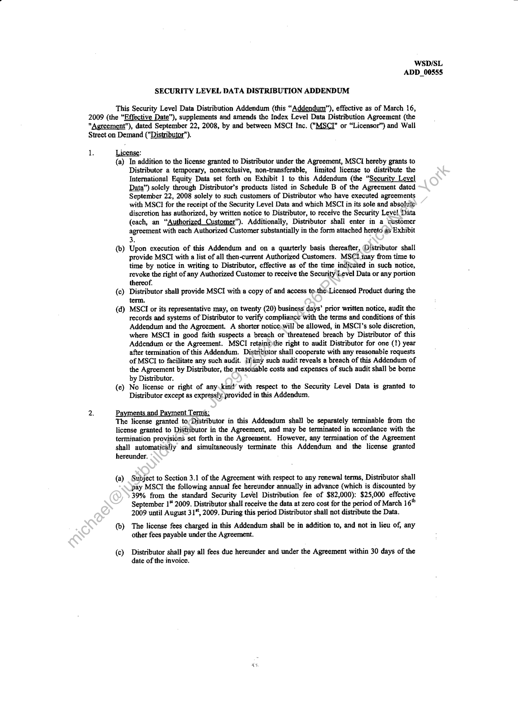
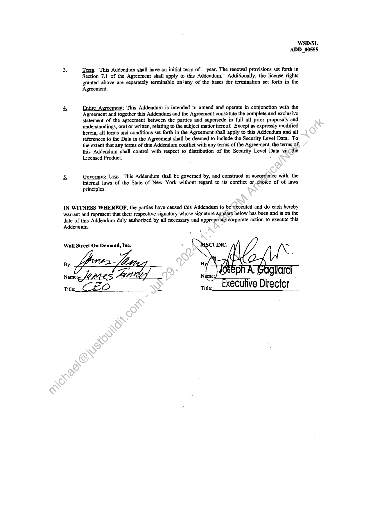
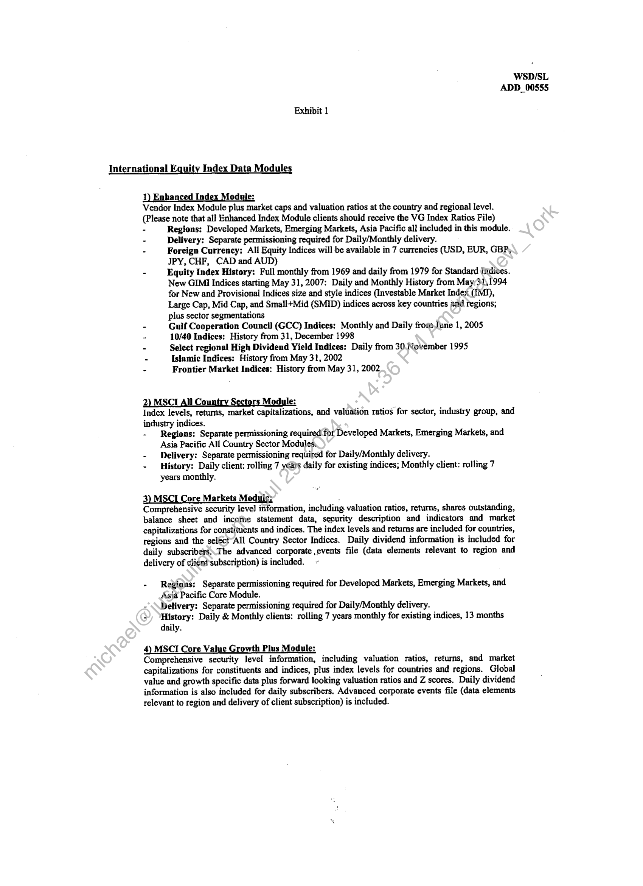
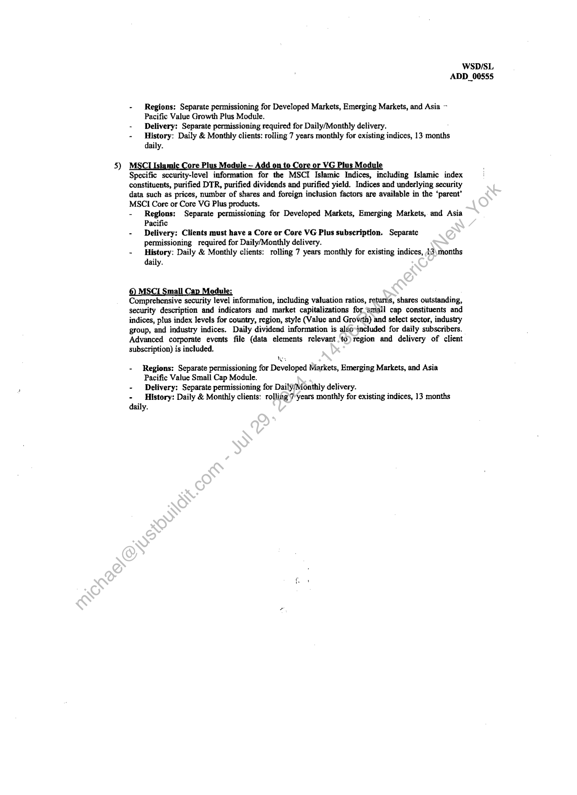
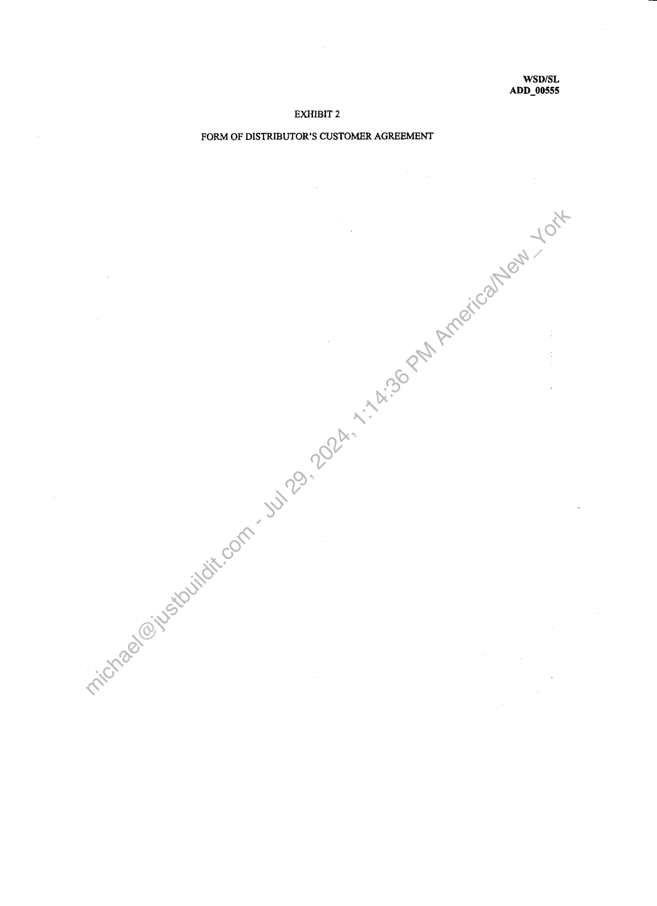

##### Security Level Data Distribution Addendum]

  
````col
```col-md
flexGrow=.5
===
> [!info] [Page 1](_attachments/images_MSCI-Index-Data-3.6.4.1.14.2.7MSCI_MOD_IndexDistribution_Addendum_20090316.pdf_155016/page_1.png)
> 
```  
```col-md
WSD/SL
ADD_00855  
SECURITY LEVEL DATA DISTRIBUTION ADDENDUM  
This Security Level Data Distribution Addendum (this “Addendum”), effective as of March 16,
2009 (the “Effective Date”), supplements and amends the Index Level Data Distribution Agreement (the
"Agreement"), dated September 22, 2008, by and between MSCI Inc. ("MSCI" or “Licensor”) and Wall
Street on Demand ("Distributor").  
1 License:  
{a} In addition to the license granted to Distributor under the Agreement, MSCI hereby grants to
Distributor a temporary, nonexclusive, non-transferable, limited license to distribute the
International Equity Data set forth on Exhibit 1 to this Addendum (the “Security Level
Data”) soicly through Distributor’s products listed in Schedule B of the Agreement dated
September 22, 2008 solely to such customers of Distributor who have executed agreements
with MSCI for the receipt of the Security Level Data and which MSC in its sole and absolute
discretion has authorized, by written notice to Distributor, to receive the Security Level Data
(each, an “Authorized Customer”). Additionally, Distributor shall enter in a customer
agreement with each Authorized Customer substantially in the form attached hereto as Exhibit
3.  
(b) Upon execution of this Addendum and on a quarterly basis thereafter, (Distributor shall
provide MSCI with a list of all then-current Authorized Customers. MSCi may from time to
time by notice in writing to Distributor, effective as of the time indicated in such notice,
revoke the right of any Authorized Customer to receive the Security Level Data or any portion
thereof.  
(c) Distributor shall provide MSCI with a copy of and access to.the.Licensed Product during the
term.  
(d) MSCTI or its representative may, on twenty (20) business days’ prior written notice, audit the
records and systems of Distributor to verify compliance with the terms and conditions of this
Addendum and the Agreement. A shorter notice,will be allowed, in MSCI’s sole discretion,
where MSCI in good faith suspects a breach or ‘threatened breach by Distributor of this
Addendum or the Agreement. MSCI retains>the right to audit Distributor for one (1) year
after termination of this Addendum. Distributor shall cooperate with any reasonable requests
of MSCI to facilitate any such audit. If any such audit reveals a breach of this Addendum of
the Agreement by Distributor, the reasonable costs and expenses of such audit shall be borne
by Distributor.  
(e) No license or right of any.kind’ with respect to the Security Level Data is granted to
Distributor except as expressly provided in this Addendum.  
2. Payments and Payment Terms:
The license granted to,Distributor in this Addendum shall be separately terminable from the  
license granted to Disttibutor in the Agreement, and may be terminated in accordance with the
termination provision’ set forth in the Agreement. However, any termination of the Agreement
shall automatically and simultaneously terminate this Addendum and the license granted
hereunder.  
(a) Subject to Section 3.1 of the Agreement with respect to any renewal terms, Distributor shall
pay MSCI the following annual fee hereunder annually in advance (which is discounted by
39% from the standard Security Level Distribution fee of $82,000): $25,000 effective
September 1“ 2009. Distributor shall receive the data at zero cost for the period of March 16”
2009 until August 31", 2009. During this period Distributor shall not distribute the Data.  
(b) The license fees charged in this Addendum shall be in addition to, and not in lieu of, any
other fees payable under the Agreement.  
(c) Distributor shall pay all fees due hereunder and under the Agreement within 30 days of the
date of the invoice.  
```
````
Notes:    
````col
```col-md
flexGrow=.5
===
> [!info] [Page 2](_attachments/images_MSCI-Index-Data-3.6.4.1.14.2.7MSCI_MOD_IndexDistribution_Addendum_20090316.pdf_155016/page_2.png)
> 
```  
```col-md
‘WSD/SL
ADD_00555  
3. Term. This Addendum shall have an initial term of 1 year. The renewal provisions set forth in
Section 7.1 of the Agreement shall apply to this Addendum. Additionally, the license rights
granted above are separately terminable on‘ any of the bases for termination set forth in the
Agreement.  
Entire Agreement; This Addendum is intended to amend and operate in conjunction with the
Agreement and together this Addendum and the Agreement constitute the complete and exclusive
statement of the agrecment between the parties and supersede in full all prior proposals and
understandings, oral or written, relating to the subject matter hereof. Except as expressly modified
herein, all terms and conditions set forth in the Agreement shall apply to this Addendum and all
references to the Data in the Agreement shall be deemed to include the Security Level Data. To
the extent that any terms of this Addendum conflict with any terms of the Agreement, the terms of,
this Addendum shall control with respect to distribution of the Security Level Data via/the
Licensed Product. .  
I>  
Governing Law. This Addendum shall be governed by, and construed in accordance with, the
internal laws of the State of New York without regard to its conflict or choice of of laws
principles.  
tg  
IN WITNESS WHEREOF, the parties have caused this Addendum to be executed and do each hereby
warrant and represent that their respective signatory whose signature appears below has been and is on the
date of this Addendum duly authorized by all necessary and appropriate) corporate action to execute this
Addendum.  
Wall Street On Demand, Inc. *
By:
5
Name: << Aen Ne giaral  
rine, CLO ning, _ExeCuTive Director  
```
````
Notes:    
````col
```col-md
flexGrow=.5
===
> [!info] [Page 3](_attachments/images_MSCI-Index-Data-3.6.4.1.14.2.7MSCI_MOD_IndexDistribution_Addendum_20090316.pdf_155016/page_3.png)
> 
```  
```col-md
WSD/SL
ADD_00555  
Exhibit 1  
International Equity Index Data Modules  
1 anced In ‘odule:  
Vendor Index Module plus market caps and valuation ratios at the country and regional level.  
(Please note that all Enhanced Index Module clients should receive the VG Index Ratios File)  
- Regions: Developed Markets, Emerging Markets, Asia Pacific all included in this module.  
- Delivery: Separate permissioning required for Daily/Monthly delivery.  
- Foreign Currency: All Equity Indices will be available in 7 currencies (USD, EUR, GBP,
JPY, CHF, CAD and AUD)  
- Equity Index History: Full monthly from 1969 and daily from 1979 for Standard Tadives.
New GIMI Indices starting May 31, 2007: Daily and Monthly History from May/31,1994
for New and Provisional Indices size and style indices (Investable Market Index (IMJ),
Large Cap, Mid Cap, and Small+Mid (SMID) indices across key countries and regions,
plus sector segmentations  
- Gulf Cooperation Council (GCC) Indices: Monthly and Daily from,lune 1, 2005  
- 10/40 Indices: History from 31, December 1998  
- Select regional High Dividend Yield Indices: Daily from 30.November 1995  
- Islamic Indices: History from May 31, 2002  
- Frontier Market Indices: History from May 31, 2002  
2 CI All Count 's Modyle:
Index levels, returns, market capitalizations, and valuation ratios for sector, industry group, and  
industry indices.  
- Regions: Separate permissioning required for Developed Markets, Emerging Markets, and
Asia Pacific All Country Sector Modules.  
- Delivery: Separate permissioning required for Daily/Monthly delivery.  
- History: Daily client: rolling 7 yeats daily for existing indices; Monthly client: rolling 7
years monthly.  
3) MSCI Core Markets Module: :  
Comprehensive security level information, including valuation ratios, returns, shares outstanding,
balance sheet and incofie statement data, security description and indicators and market
capitalizations for constituents and indices. The index levels and returns are included for countries,
regions and the seléct-All Country Sector Indices. Daily dividend information is included for
daily subscribers\The advanced corporate ,events file (data elements relevant to region and
delivery of client subscription) is included.  
- Repions: Separate permissioning required for Developed Markets, Emerging Markets, and
Asia Pacific Core Module.  
-'\\Delivery: Separate permissioning required for Daily/Monthly delivery.  
») “History: Daily & Monthly clients: rolling 7 years monthly for existing indices, 13 months
daily.  
4) MSCI Core Val wth Plus i  
Comprehensive security level information, including valuation ratios, retums, and market
capitalizations for constituents and indices, plus index levels for countries and regions. Global
value and growth specific data plus forward looking valuation ratios and Z scores. Daily dividend
information is also included for daily subscribers. Advanced corporate events file (data elements
relevant to region and delivery of client subscription) is included.  
```
````
Notes:    
````col
```col-md
flexGrow=.5
===
> [!info] [Page 4](_attachments/images_MSCI-Index-Data-3.6.4.1.14.2.7MSCI_MOD_IndexDistribution_Addendum_20090316.pdf_155016/page_4.png)
> 
```  
```col-md
WSD/SL
ADD_00555  
- Regions: Separate permissioning for Developed Markets, Emerging Markets, and Asia ~
Pacific Value Growth Plus Module.  
- Delivery: Separate permissioning required for Daily/Monthly delivery.  
- History: Daily & Monthly clients: rolling 7 years monthly for existing indices, 13 months
daily.  
5) re Pl la = VG Plus Module  
Specific sccurity-level information for the MSCI Islamic Indices, including Islamic index  
constituents, purified DTR, purified dividends and purified yield. Indices and underlying security  
data such as prices, number of shares and foreign inclusion factors are available in the ‘parent’  
MSCI Core or Core VG Plus products.  
- Regions; Separate permissioning for Developed Markets, Emerging Markets, and Asia
Pacific  
- Delivery: Clients must have a Core or Core VG Plus subscription. Scparate
permissioning required for Daily/Monthly delivery.  
- History: Daily & Monthly clients: rolling 7 years monthly for existing indices, 43\months
daily.  
© MSCI Small Cap Module:  
Comprehensive security level information, including valuation ratios, returtis, shares outstanding,
security description and indicators and market capitalizations for ‘small cap constituents and
indices, plus index levels for country, region, style (Value and Growth) and select sector, industry
group, and industry indices. Daily dividend information is algo-included for daily subscribers.
Advanced corporate events file (data elements relevant to) region and delivery of client
subscription) is included.
Nes  
- Regions: Separate permissioning for Developed Markets, Emerging Markets, and Asia  
Pacific Value Smail Cap Module.
- Delivery: Separate permissioning for Daily/Monthly delivery.
- History: Daily & Monthly clients: rolling 7’years monthly for existing indices, 13 months
daily.  
```
````
Notes:    
````col
```col-md
flexGrow=.5
===
> [!info] [Page 5](_attachments/images_MSCI-Index-Data-3.6.4.1.14.2.7MSCI_MOD_IndexDistribution_Addendum_20090316.pdf_155016/page_5.png)
> 
```  
```col-md
WSD/SL
ADD_00555  
EXHIBIT 2  
FORM OF DISTRIBUTOR’S CUSTOMER AGREEMENT  
```
````
Notes:  


![[_attachments/MSCI-Index-Data-3.6.4.1.14.2.7 MSCI_MOD_IndexDistribution_Addendum_20090316.pdf]