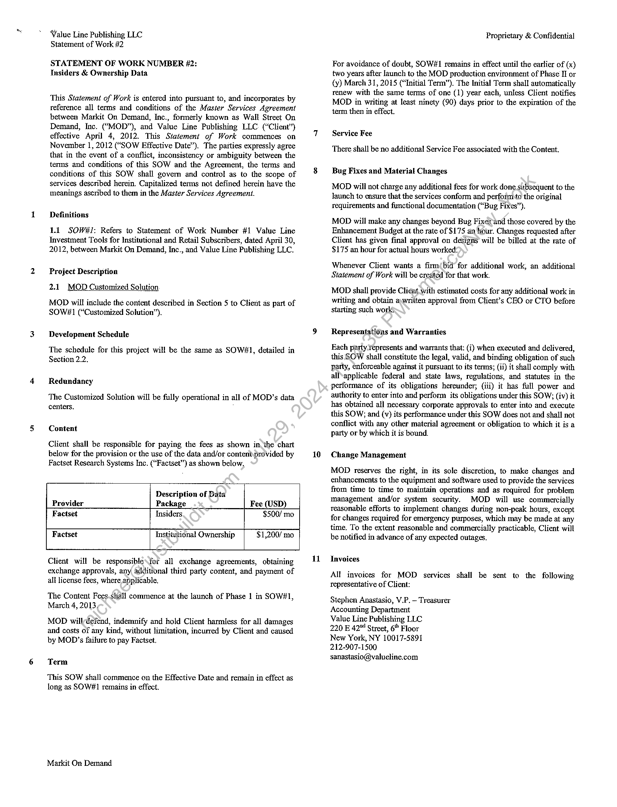
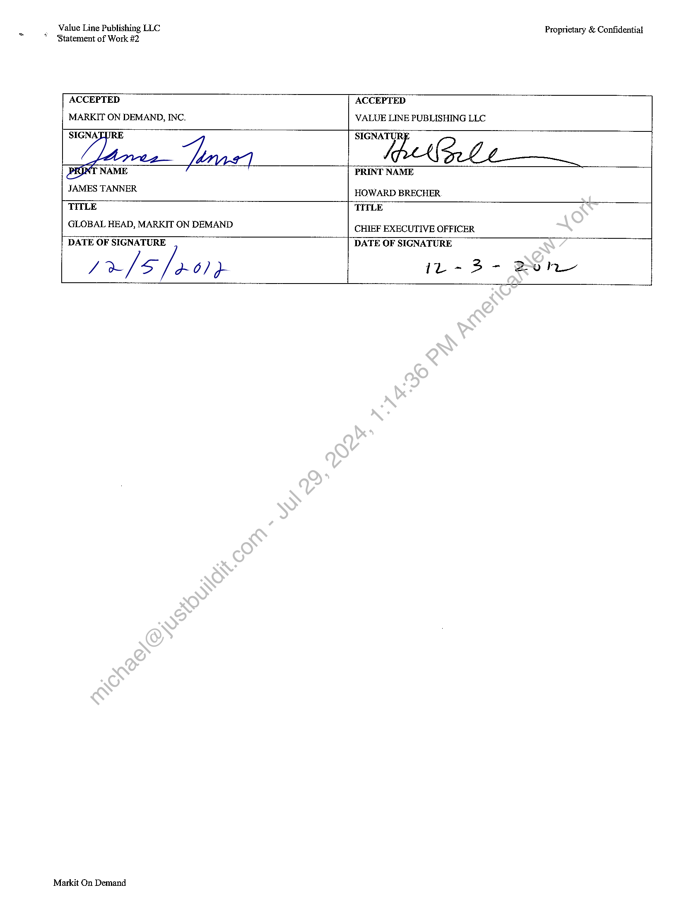

##### Statement of Work #2: Insiders & Ownership Data]

  
````col
```col-md
flexGrow=.5
===
> [!info] [Page 1](_attachments/images_3.6.4.1.15.1ValueLine_MODSOW_2Factset_Executed20121206.pdf_155233/page_1.png)
> 
```  
```col-md
Walue Line Publishing LLC
Statement of Work #2  
STATEMENT OF WORK NUMBER #2:
Insiders & Ownership Data  
This Statement of Work is entered into pursuant to, and incorporates by
reference all terms and conditions of the Master Services Agreement
between Markit On Demand, Inc., formerly known as Wall Street On
Demand, Inc. (“MOD”), and Value Line Publishing LLC. (“Client”)
effective April 4, 2012. This Statement of Work commences on
November 1, 2012 (“SOW Effective Date”). The parties expressly agree
that in the event of a conflict, inconsistency or ambiguity between the
terms and conditions of this SOW and the Agreement, the terms and
conditions of this SOW shall govern and control as to the scope of
services described herein. Capitalized terms not defined herein have the
meanings ascribed to them in the Master Services Agreement.  
Definitions  
L1 SOW#I: Refers to Statement of Work Number #1 Value Line
Investment Tools for Institutional and Retail Subscribers, dated April 30,
2012, between Markit On Demand, Inc., and Value Line Publishing LLC.  
Project Description  
2.1 MOD Customized Solution  
MOD will include the content described in Section 5 to Client as part of
SOW#1 (“Customized Solution”).  
Development Schedule  
The schedule for this project will be the same as SOW#1, detailed in
Section 2.2.  
Redundancy  
The Customized Solution will be fully operational in all of MOD’s data
centers.  
Content  
Client shall be responsible for paying the fees as shown in the chart
below for the provision or the use of the data and/or contentprovided by
Factset Research Systems Inc. (‘Factset”) as shown below,  
Description of Data  
Provider Package Fee (USD)
Factset Insiders $500/ mo
Factset Institutional Ownership $1,200/ mo  
Client will be responsible. for all exchange agreements, obtaining
exchange approvals, any additional third party content, and payment of
all license fees, where applicable,  
The Content Fees.shail commence at the launch of Phase 1 in SOW#1,
March 4, 2013,  
MOD wiildefend, indemnify and hold Client harmless for all damages
and costs of any kind, without limitation, incurred by Client and caused.
by MOD’s failure to pay Factset,  
Term  
This SOW shall commence on the Effective Date and remain in effect as
long as SOW#1 remains in effect.  
Markit On Demand  
10  
i  
Proprietary & Confidential  
For avoidance of doubt, SOW#1 remains in effect until the earlier of (x)
two years after launch to the MOD production environment of Phase II or
(y) March 31, 2015 (“Initial Term”). The Initial Term shall automatically
renew with the same terms of one (1) year each, unless Client notifies
MOD in writing at least ninety (90) days prior to the expiration of the
term then in effect.  
Service Fee  
There shall be no additional Service Fee associated with the Content.  
Bug Fixes and Material Changes  
MOD will not charge any additional fees for work done subsequent to the
Jaunch to ensure that the services conform and performto the original
requirements and functional documentation (“Bug Fixes”).  
MOD will make any changes beyond Bug Fixes and those covered by the
Enhancement Budget at the rate of $175 an hour. Changes requested after
Client has given final approval on designs will be billed at the rate of
$175 an hour for actual hours worked:  
Whenever Client wants a firm(bid for additional work; an additional
Statement of Work will be created for that work.  
MOD shall provide Client with estimated costs for any additional work in
writing and obtain a,written approval from Client’s CEO or CTO before
starting such works  
Representations and Warranties  
Each party represents and warrants that: (i) when executed and delivered,
this SOW shall constitute the legal, valid, and binding obligation of such
party, enforceable against it pursuant to its terms; (ii) it shall comply with
all‘applicable federal and state laws, regulations, and statutes in the
performance of its obligations hereunder; (iii) it has full power and
authority to enter into and perform its obligations under this SOW; (iv) it
has obtained all necessary corporate approvals to enter into and execute
this SOW; and (v) its performance under this SOW does not and shall not
conflict with any other material agreement or obligation to which it is a
party or by which it is bound.  
Change Management  
MOD reserves the right, in its sole discretion, to make changes and
enhancements to the equipment and software used to provide the services
from time to time to maintain operations and as required for problem
management and/or system security. MOD will use commercially
teasonable efforts to implement changes during non-peak hours, except
for changes required for emergency purposes, which may be made at any
time. To the extent reasonable and commercially practicable, Client will
be notified in advance of any expected outages.  
Invoices  
All invoices for MOD services shall be sent to the following
representative of Client:  
Stephen Anastasio, V.P.— Treasurer
Accounting Department  
Value Line Publishing LLC  
220 E 42™ Street, 6" Floor  
New York, NY 10017-5891
212-907-1500
sanastasio@valueline.com  
```
````
Notes:    
````col
```col-md
flexGrow=.5
===
> [!info] [Page 2](_attachments/images_3.6.4.1.15.1ValueLine_MODSOW_2Factset_Executed20121206.pdf_155233/page_2.png)
> 
```  
```col-md
Value Line Publishing LLC
‘Statement of Work #2  
Proprietary & Confidential  
ACCEPTED
MARKIT ON DEMAND, INC.  
ACCEPTED
VALUE LINE PUBLISHING LLC  
2572  
GLOBAL HEAD, MARKIT ON DEMAND  
PRINT NAME
JAMES TANNER HOWARD BRECHER.
TITLE TITLE  
CHIEF EXECUTIVE OFFICER  
DATE OF SIGNATURE  
yr /5/%0)9  
DATE OF SIGNATURE  
it - B- Bone  
Markit On Demand  
```
````
Notes:  


![[_attachments/3.6.4.1.15.1 Value Line_MOD SOW _2 Factset_Executed 20121206.pdf]