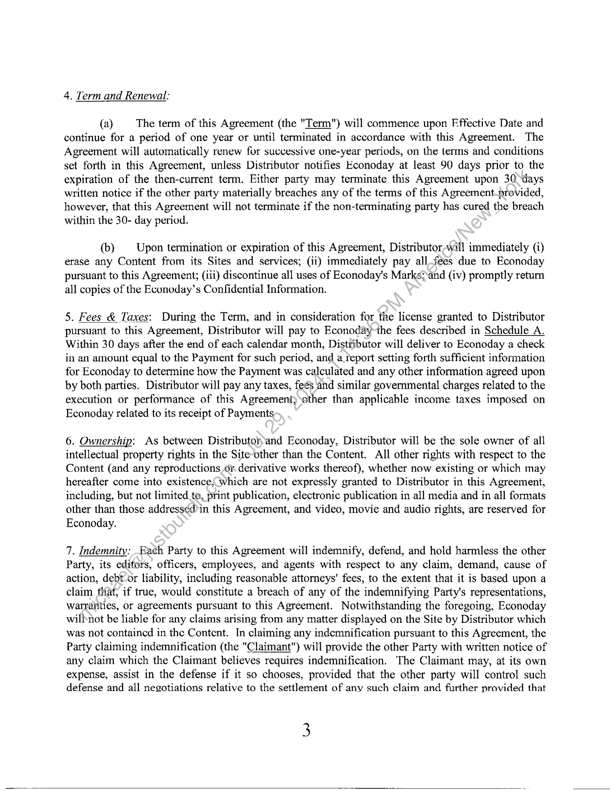

##### CONTENT DISTRIBUTION AGREEMENT]

  
````col
```col-md
flexGrow=.5
===
> [!info] [Page 1](_attachments/images_3.6.4.1.16.1Econoday_MOD_ContentDistributionAgrmtExecuted20070413.pdf_155246/page_1.png)
> 
```  
```col-md
ECONODAY, INC.
CONTENT DISTRIBUTION AGREEMENT  
THIS CONTENT DISTRIBUTION AGREEMENT dated April 13, 2007 (the "Effective Date")
between WALL STREET ON DEMAND, INC a Delaware Corporation ("Distributor"), located at ,
5718 Central Ave Boulder, CO 80301, and Econoday, Inc., a California corporation ("Econoday"),
located at 3685 Mt. Diablo Blvd., Suite 253, Lafayette, CA 94549 (Distributor and Econoday
collectively referred to in this Agreement as the "parties").  
BACKGROUND:  
Distributor wishes to distribute and resell certain of Econoday’s works of authorship, data and other
content (the "Content") through the Distributor’s services and sale channels and on its web site
(“Site”). Econoday owns or controls copyrights and other rights withrespect to the Content.
Econoday intends to grant to Distributor a license of those rights on the;terms and conditions of this
Agreement. Therefore, Distributor and Econoday agree as follows?  
AGREEMENT:  
1. License:  
(a) Subject to the other terms and conditions contained in this Agreement, Econoday
hereby grants to Distributor, for the durationof the Term (as defined in Section 4), for the
nontransferable, non-sublicenseable, non-exclusive right and license to: (i) distribute and resell the
Content in digital form of display on the Distributor’s web Site (alone or in combination with other
works, including, but not limited to stext, data, images, photographs, illustrations, animation,
graphics, video or audio segments, and hypertext links); (ii) reproduce, transmit, communicate,
display or distribute the Contentfon or as part of the Site, by means of any technology, whether
now known or hereafter to beeome known; and (iii) to advertise and promote the Content, by
whatever method and in whatever media Distributor deems appropriate, using in each case above
Econoday's name and trademark as the source of the Content and including Econoday’s copyright
notices in connection.with authorized uses of the Content. For purposes of this Agreement, “Site”
refers to the web Site’or Sites indicated on Schedule A.  
(b) No provision of this Agreement will be deemed to restrict or limit Econoday's right
to market, sell, distribute, display or otherwise provide access to the Econoday Content directly or
indirectly anywhere in the world, or enter into contracts, grant licenses or make arrangements with
any other party to market, sell, distribute, display or otherwise provide access to the Econoday
Content anywhere in the world. All rights not expressly granted to Distributor herein will be
retained by Econoday.  
2. Credit and Attribution: ‘The Econoday logo will appear on every page of the Site containing
Content. Any page of the Site containing Content must also contain the following copyright notice:
"Copyright 2007 [relevant year] Econoday. Inc. All Rights Reserved." Before making any
Econoday Content publicly available on the Site, Distributor will give Econoday commercially  
1  
```
````
Notes:    
````col
```col-md
flexGrow=.5
===
> [!info] [Page 2](_attachments/images_3.6.4.1.16.1Econoday_MOD_ContentDistributionAgrmtExecuted20070413.pdf_155246/page_2.png)
> 
```  
```col-md
reasonable notice to review the use and placement of the Distributor Content on the Site. To the
extent Econoday notifies Distributor as to any use of the Econoday Content in a way that Econoday
reasonably believes will have an adverse effect on the image or reputation of Econoday, Distributor
will change the use of the Content to address Econoday's concern.  
3 Representations & Covenants:  
(a) Distributor hereby represents and warrants that the Site will not violate any laws,
regulations or ordinances, or the rights of any third party and will not give rise to any claim ‘of such
violation, including, without limitation, claims of libel, slander, defamation, copyright
infringement, infringement of moral rights, trademark infringement, false designation of origin,
disparagement, violation of privacy, publicity, identity or other proprietary rights, violation of
patent or shop rights, piracy or plagiarism.  
(b) Distributor will not (i) sublicense or otherwise transfer orassign any right granted in
this Agreement to any other person or entity except as expressly set forth here-in; (ii) post the
Content of the Private Calendar (described in Schedule A) in anys“public" or "free" area, or area
accessible without a password, on the World Wide Web; (iii) make the Content available through
third parties by incorporating or "bundling" the Distributor’s services as one information source or
service of many available through third-party front-endsoftware or a third-party, electronic
information service or Internet Site; (iv) permit end users ‘to access the Econoday Content via any
interactive online or electronic information service other than Distributor’s service; (v) make,
publish or distribute or cooperate with any third)party in making publishing or distributing any
public announcements, press releases, advertising, marketing, promotional or other materials
(whether in print, electronically or otherwise), that use Econoday Marks without its prior approval
with regard to the execution or performance of this Agreement and (vi) will use reasonable
commercial efforts not to permit any other party to, edit, alter or otherwise change in any manner
the content, format or presentation ofthe Content, including, without limitation, all copyright and
proprietary rights notices.  
(c) Distributor. will (i) acquire, install, operate and maintain at its expense all
communications lines, equipment, software, services and related technology necessary to distribute
the Content; (ii) be responsible for, and will pay for, any development work, software or hardware
relating to the setup,and integration of the Content as part of the Distributor’s service; and (iii) will
maintain complete and accurate books and records, in accordance with generally accepted
accounting practices, of all matters related to its compliance with its obligations hereunder and
permit Econoday through its authorized representatives, to inspect the such records of Distributor
during viormal business hours no more than twice per year.  
(da) | Econoday hereby represents and warrants that the Content will not violate any laws,
regulations or ordinances, or the rights of any third party and will not give rise to any claim of such
violation, including, without limitation, claims of libel, slander, defamation, copyright
infringement, infringement of moral rights, trademark infringement, false designation of origin,
disparagement, violation of privacy, publicity, identity or other proprietary rights, violation of
patent or shop rights, piracy or plagiarism.  
```
````
Notes:    
````col
```col-md
flexGrow=.5
===
> [!info] [Page 3](_attachments/images_3.6.4.1.16.1Econoday_MOD_ContentDistributionAgrmtExecuted20070413.pdf_155246/page_3.png)
> 
```  
```col-md
4. Term and Renewal:  
(a) The term of this Agreement (the "Term") will commence upon Effective Date and
continue for a period of one year or until terminated in accordance with this Agreement. The
Agreement will automatically renew for successive one-year periods, on the terms and conditions
set forth in this Agreement, unless Distributor notifies Econoday at least 90 days prior to the
expiration of the then-current term. Either party may terminate this Agreement upon 30 days
written notice if the other party materially breaches any of the terms of this Agreement-provided,
however, that this Agreement will not terminate if the non-terminating party has cured the breach
within the 30- day period.  
(b) Upon termination or expiration of this Agreement, Distributor-will immediately (i)
erase any Content from its Sites and services; (ii) immediately pay all fees due to Econoday
pursuant to this Agreement; (iii) discontinue all uses of Econoday's Marks>and (iv) promptly return
all copies of the Econoday’s Confidential Information.  
5. Fees & Taxes: During the Term, and in consideration for the license granted to Distributor
pursuant to this Agreement, Distributor will pay to Econoday~the fees described in Schedule A.
Within 30 days after the end of each calendar month, Distributor will deliver to Econoday a check
in an amount equal to the Payment for such period, and a.report setting forth sufficient information
for Econoday to determine how the Payment was calculated and any other information agreed upon
by both parties. Distributor will pay any taxes, fees and similar governmental charges related to the
execution or performance of this Agreement)\other than applicable income taxes imposed on
Econoday related to its receipt of Payments  
6. Ownership: As between Distributor,and Econoday, Distributor will be the sole owner of all
intellectual property rights in the Site-other than the Content. All other rights with respect to the
Content (and any reproductions or. derivative works thereof), whether now existing or which may
hereafter come into existence; which are not expressly granted to Distributor in this Agreement,
including, but not limited te, print publication, electronic publication in all media and in all formats
other than those addressed)in this Agreement, and video, movie and audio rights, are reserved for
Econoday.  
7. Indemnity: Each Party to this Agreement will indemnify, defend, and hold harmless the other
Party, its editors, officers, employees, and agents with respect to any claim, demand, cause of
action, debt-or liability, including reasonable attorneys’ fees, to the extent that it is based upon a
claim that, if true, would constitute a breach of any of the indemnifying Party's representations,
warraiities, or agreements pursuant to this Agreement. Notwithstanding the foregoing, Econoday
willnot be liable for any claims arising from any matter displayed on the Site by Distributor which
was not contained in the Content. In claiming any indemnification pursuant to this Agreement, the
Party claiming indemnification (the "Claimant") will provide the other Party with written notice of
any claim which the Claimant believes requires indemnification. The Claimant may, at its own
expense, assist in the defense if it so chooses, provided that the other party will control such
defense and all negotiations relative to the settlement of any such claim and further provided that  
```
````
Notes:    
````col
```col-md
flexGrow=.5
===
> [!info] [Page 4](_attachments/images_3.6.4.1.16.1Econoday_MOD_ContentDistributionAgrmtExecuted20070413.pdf_155246/page_4.png)
> 
```  
```col-md
any settlement intended to bind the Claimant will not be final without the Claimant's written
consent.  
8. Limitation of Liability, EXCEPT WITH RESPECT TO LIABILITY ARISING FROM A
PARTY'S INDEMNIFICATION OBLIGATIONS HEREUNDER, NEITHER PARTY HERETO
WILL BE LIABLE TO THE OTHER FOR DIRECT, INDIRECT, INCIDENTAL,
CONSEQUENTIAL, SPECIAL OR EXEMPLARY DAMAGES (EVEN IF SUCH PARTY HAS
BEEN ADVISED OF THE POSSIBILITY OF SUCH DAMAGES). IN ANY EVENT;-THE
LIABILITY OF ECONODAY HEREUNDER WILL NOT EXCEED THE FEES RECEIVED BY
ECONODAY HEREUNDER.  
9. Disclaimer: ECONODAY PROVIDES THE ECONODAY INFORMATION "AS _ IS",
WITHOUT ANY EXPRESS OR IMPLIED WARRANTIES. FOR EXAMPLE, ECONODAY
DOES NOT WARRANT THE ACCURACY, TIMELINESS, COMPLETENESS, ADEQUACY,
MERCHANTABILITY OR FITNESS FOR A PARTICULAR PURPOSE: OF THE ECONODAY
INFORMATION, AND ECONODAY WILL NOT BE LIABLE TO DISTRIBUTOR OR TO ANY
THIRD PARTY WITH RESPECT TO ANY ACTUAL ORSALLEGED INACCURACY,
UNTIMELINESS, INCOMPLETENESS, INADEQUACY, “UNMERCHANTABILITY OR
UNFITNESS.  
10. Confidential Information: Distributor and Econoday understand and agree thal in the
performance of this Agreement each party may haye access to private or confidential information
of the other party, including, but not limited to, ‘trade secrets, marketing and business plans and
technical information, which is designated as\confidential by the disclosing party in writing,
whether by letter or by the use of a proprietary, stamp or legend, prior to or at the time it is disclosed
to the other party ("Confidential Information"). Each party agrees that: (i) all Confidential
Information will remain the exclusive property of the owner; (ii) it will maintain, and will use
prudent methods to cause its employees and agents to maintain, the confidentiality and secrecy of
the Confidential Information; (iii) it will not, and will use prudent methods to ensure that its
employees and agents do not,(copy, publish, disclose to others or use (other than pursuant to the
terms hereof) the Confidential Information; and (iv) it will return or destroy all copies of
Confidential Information- upon request of the other party. Notwithstanding the foregoing,
Confidential Information will not include any information to the extent it (a) is or becomes a part of
the public domaindhrough no act or omission on the part of the receiving party, (b) is disclosed to
third parties by,the disclosing party without restriction on such third parties, (c) is in the receiving
party's possession, without actual or constructive knowledge of an obligation of confidentiality with
respect thereto, at or prior to the time of disclosure under this Agreement, (d) is disclosed to the
receivirig-party by a third party having no obligation of confidentiality with respect thereto, (e) is
independently developed by the receiving party without reference to the disclosing party's
Confidential Information or (f) is released from confidential treatment by written consent of the
disclosing party.  
11. General: All notices under this Agreement will be given in writing via overnight mail to the
addresses set forth in paragraph one of this agreement (or such other address as either party may
substitute by notice pursuant to this Agreement) and all such notices given in accordance pursuant
to this Agreement will be deemed as given as of the date of mailing. If any provision of this  
4  
```
````
Notes:    
````col
```col-md
flexGrow=.5
===
> [!info] [Page 5](_attachments/images_3.6.4.1.16.1Econoday_MOD_ContentDistributionAgrmtExecuted20070413.pdf_155246/page_5.png)
> 
```  
```col-md
Agreement is determined by a court of competent jurisdiction to be invalid or unenforceable, such
determination will not affect the validity or enforceability of any other part or provision of this
Agreement. The waiver by either party of any breach of any provision of the Agreement by the
other party will not be construed to be either a waiver of that party's rights regarding any
suceceding breach of any such provision or a waiver of the provision itself. This Agreement
constitutes the entire agreement between the parties with respect to this subject matter and
supersedes all previous proposals, both oral and written, negotiations, representations,
commitments, writings and all other communications between the parties. This Agreement may
not be amended or modified except by an instrument in writing signed by the parties» This
Agreement will be governed by and construed in accordance with the laws of the State of Delaware
without reference to its conflicts of laws provisions. Jurisdiction for litigation of any dispute,
controversy or claim arising out of or in connection with this Agreement, will be‘only in a federal
or state court having subject matter jurisdiction located in Delaware. Nothing’ contained in this
Agreement will be deemed or construed as creating a joint venture of partnership between
Econoday and Distributor. Neither party, by virtue of this Agreement,/is-authorized as an agent,
employee or legal representative of the other. Except as specifically set forth in this Agreement,
neither party will have the power to control the activities and operations of the other and their status
is, and at all times will continue to be, that of independent contractors.  
IN WITNESS WHEREOF, the parties have executed, this Agreement as of the date of this
Agreement.  
LICENSEE: Wall Street on Demand, Inc. ECONODAY: Econoday, Inc.
Name! James Tanner ‘ Name: Cynthia Parker
Title: President & CEO Title: President and CEO  
```
````
Notes:    
````col
```col-md
flexGrow=.5
===
> [!info] [Page 6](_attachments/images_3.6.4.1.16.1Econoday_MOD_ContentDistributionAgrmtExecuted20070413.pdf_155246/page_6.png)
> 
```  
```col-md
SCHEDULE A  
SITES: Distributor will notify Econoday of sites which display Econoday data in a monthly report
which includes the name of the company displaying the content and the URL where the content is
displayed.  
FEES:  
Econoday will invoice Distributor monthly for content licensed according to the price list below or
as negotiated. Monthly invoices will be created from a monthly report provided to Econoday by
Distributor on or before the 5" of each month. will include a report of usage for Which the payment
is made.  
Invoices will be sent to:  
WALL STREET ON DEMAND, INC.
5718 Central Ave
Boulder, CO 80301  
CONTENT:  
Global: $2500/Month
Key Economic Events and analysis for 9 countries: USA, Canada, Great Britain, Germany, France,
Italy, Japan, Australia, EMU  
USS. Basic: $1000/Month  
U.S. Economic events and Treasury events: release time, date, data with event definition and “Why
Investors Care”.  
U.S. Premium: $2500/Month
U.S. Economic events and-Treasury events: release time, date, data, analysis and trend graphs with
event definition and.“Why Investors Care”.  
USS. Private$5,000/Month  
U.S. Economic events and Treasury events: release time, date, data, analysis and trend graphs and a
table displaying a 6 month history of the data release for the components of the market-moving
events: All events include an event definition and “Why Investors Care”. All content on the
Private calendar is archived. The calendar is designed with easy navigation back to 1999 allowing a
user to see all of the release information posted on any day or week, which serves as an ideal
research tool. There is also a comprehensive Resource Center built into the calendar which
includes:  
© Weekly articles summarizing the market activity around the glohe.
o Simply Economics — recap of the U.S. markets  
6  
```
````
Notes:    
````col
```col-md
flexGrow=.5
===
> [!info] [Page 7](_attachments/images_3.6.4.1.16.1Econoday_MOD_ContentDistributionAgrmtExecuted20070413.pdf_155246/page_7.png)
> 
```  
```col-md
o International Perspective — recap of the non-U.S. markets
o Short-Take — focuses on a current topic of interest to the markets  
e Event Release Dates for the entire year for all indicators. Each date is linked to the related
report.
e Event Definitions
e Content rich Modules updated monthly which comprehensively cover the topics.
e Bond Markets
e Equity Markets
e Chart Room of the Economy
e FedWatching
e Country Profiles  
Resource Sections can also be purchased separately:
BOND MARKETS: $500/Month  
About the Bond Market - This section describes the fixed’income market, from corporate bonds to
Treasury securities. It also discusses how the bond market is related to economic indicators.  
Bond Market Charts - _ This section depicts in pictures and words the direction of various fixed
income securities, particularly in their relationship to default risk.  
Treasury Market Charts - This sectionsdepicts in pictures and words the key Treasury market
sccuritics and their relationship to the federal funds rate.  
‘Treasury Auctions - This sectiorincludes all weekly, monthly and quarterly Treasury auctions for
key securities.  
EQUITY MARKETS: $500/Month  
About the Steck Market - This section reveals that many stock market measures don't always move
in tandemOInvestors are advised to compare individual portfolios to a variety of market indexes,
not justithe Dow Jones Industrials or the Nasdaq composite.  
The Dow Jones Family - “This section shows long term and short term changes in the key market
indexes compiled by Dow Jones including the Industrials, Transportation, and Utility indexes.  
The S&P Family - [i This section shows long and short term changes in some key indexes compiled
by Standard and Poor's.  
```
````
Notes:    
````col
```col-md
flexGrow=.5
===
> [!info] [Page 8](_attachments/images_3.6.4.1.16.1Econoday_MOD_ContentDistributionAgrmtExecuted20070413.pdf_155246/page_8.png)
> 
```  
```col-md
Other Key Market Indices - _) This section shows long and short term changes in key market
indexes such as the Nasdaq composite, the Russell 2000, the Wilshire 5000 and the NYSE Arca
Tech 100.  
CHART ROOM: $500/Month  
Indicators of Production and Sales - This section depicts GDP and its key components, detailing
growth in the U.S. economy. Economic growth directly impacts corporate profits and therefore
stock prices.  
Indicators of Inflation - Several indicators reveal inflation in goods, services, andawages. These
various measures are compared here. Inflation erodes the purchasing power of current and future
investments. Low and stable inflation rates benefit consumers and investors:  
Federal Reserve Policy - ‘(he Fed is mainly concerned with inflationand factors that portend
inflationary pressures. The Fed determines whether to ease or tighten credit conditions based on
economic and inflationary conditions.  
Interest Rates - This section shows a comparison of key interest rates. The difference between long  
and short-term rates tells us about the economy. Also, it allows us to make more informed
investment decisions if we are interested in the fixed income market.  
FED WATCHING: $500/Month  
About the Fed - This section desefibes the institution, the relevance of the Fed to financial markets,
and gives a glossary of key terms:  
Fed Watching Indicatorg+This section depicts in pictures and in words key factors that are leading
indicators for Fed policymaking.  
Key Fed Facts.-\SThis section describes the voting and non-voting members of the FOMC, policy
actions taken\inthe past ten years and the dates for upcoming FOMC meetings.  
COUNTRY PROFILES: $500/Month  
This module presents encapsulated views of the major world economic powers - Britain, European
Monetary Union, Japan, Canada, Australia and the United States.  
```
````
Notes:    
````col
```col-md
flexGrow=.5
===
> [!info] [Page 9](_attachments/images_3.6.4.1.16.1Econoday_MOD_ContentDistributionAgrmtExecuted20070413.pdf_155246/page_9.png)
> 
```  
```col-md
ARTICLES:  
Simply Economies: $500/Month
Robust article appearing every Monday that focuses on U.S. market activities during the prior week
and highlights key events in the week ahead.  
International Perspective: $500/Month  
Weckly article appearing every Monday that focuses on major international markets with a
comprehensive summary of activities during the prior week along with a preview of key events in
the week ahead.  
Short-Take: $250/Month
Article that appears periodically throughout the month that highlights a\specific topic of interest
and explores it in-depth to enhance investors’ understanding of the-subject  
MyECONODAY  
Automatically receive updates throughout the day for critical market events in your Outlook
calendar. Sync them to your mobile device to carry all the key economic and corporate events with
you. You may download directly to a PDA device if you don't use Outlook. Additional content
modules will be added in the future.  
Economic Events Module: $19.95/Month
Market Focus/Market Reflections and 50 Domestic Events  
Market Moving Events:$19.95/Month
Market Focus/Market-Reflections and 12 Market Moving Indicators and Earning Date
Announcements from 5000 Stock Tickers  
Market Moving PLUS: $31.95/Month
Market Focus/Market Reflections, 5000Stock Tickers, 50 Domestic Events  
GlobalEconomic Events: $31.95/Month
Key Economic Events for 9 countries: USA, Canada, Great Britain, Germany, France, Italy, Japan,
Australia, EMU  
```
````
Notes:    
````col
```col-md
flexGrow=.5
===
> [!info] [Page 10](_attachments/images_3.6.4.1.16.1Econoday_MOD_ContentDistributionAgrmtExecuted20070413.pdf_155246/page_10.png)
> 
```  
```col-md
10  
```
````
Notes:  


![[_attachments/3.6.4.1.16.1 Econoday_MOD_Content Distribution Agrmt Executed 20070413.pdf]