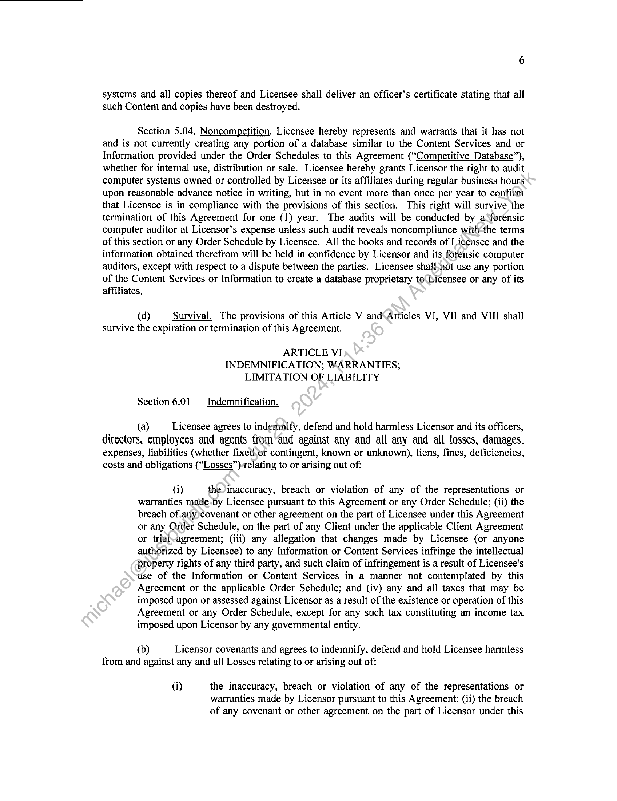

##### License Agreement]

  
````col
```col-md
flexGrow=.5
===
> [!info] [Page 1](_attachments/images_3.6.4.1.17.1FactSet_MODMSA20060801.pdf_155040/page_1.png)
> 
```  
```col-md
EXECUTION COPY
LICENSE AGREEMENT  
License Agreement (this “Agreement”), dated as of August 1, 2006,
between FactSet Research Systems Inc., a Delaware corporation
(“Licensor”), located at 601 Merritt 7, Norwalk, CT 06851, and Wall
Street on Demand, Inc., a Delaware limited liability company
(“Licensee”), located at 5718 Central Avenue, Boulder, Colorado,
80301.  
WHEREAS, Licensee wishes to gain access to proprietary information of
Licensor through a variety of media specified below in order to make. various portions of
such information available to Licensee’s clients, and  
Licensor wishes to make such information available to-Licensee subject to the
terms and conditions of this Agreement; and  
NOW, THEREFORE, in consideration of the Premises and the mutual covenants
contained herein, the parties hereto agree as follows:
ARTICLE I
LICENSE GRANT
Section 1.01. Definitions,
“Affiliates” means an entity’s licensors, independent contractors, providers and affiliates.
“Client” means a client as set forth on Exhibit A.  
“Content” means the content described in each Order Schedule and a component of
Content Services.  
“Content Services” means the content services described in each Order Schedule.
Content Services)may include, among other things, Information, compilation, selection and
arrangement©f Information, navigational aids and software, computer readable files, copies of
documents.and databases developed and owned by Licensor or otherwise licensed to Licensor by
third party data providers.  
“Delivery System” means Licensor’s data delivery system.  
“Delivery Platform” means Licensee’s delivery platform for the Licensee Products set
forth on the applicable Order Schedule.  
```
````
Notes:    
````col
```col-md
flexGrow=.5
===
> [!info] [Page 2](_attachments/images_3.6.4.1.17.1FactSet_MODMSA20060801.pdf_155040/page_2.png)
> 
```  
```col-md
“Information” means financial, economic and other information or editorial content from
time to time available from the Content Services, whether proprietary to Licensor or which
constitutes third party information that is provided to Licensee by Licensor, including without
limitation the selection and arrangement of such information, and any compilations thereof.  
“Licensee Products” means the Licensee products specified on the applicable Order
Schedule, which includes content transmitted to the Client via the applicable Delivery Platform.  
“Order Schedule” means any of the executed order schedules attached to this Agreement
and made a part hereof specifying the applicable Content Services and Delivery System to be
used with a particular set of Licensee Products and a Delivery Platform and setting forth
additional information, terms and conditions specific to the applicable Content Service.  
Section 1.02. License Grant. Subject to the terms and conditions of this)Agreement and
the applicable Order Schedules, Licensor grants to Licensee a limited, non-exclusive,
nontransferable, non-sublicensable, worldwide right and license to distribute and display the
applicable Content solely to and for the Clients by means of the applicable Delivery Platform and
Licensee Products. Any rights not expressly granted herein or in ariy-Order Schedule are reserved
to Licensor.  
Section 1.03. Information Retrieval. As applicable, Licensee shall retrieve the
Information contained in the applicable Content Services from Licensor’s data centers for
subsequent manipulation, electronic distribution to Clients or both. Licensee shall not transfer the
Information to tapes, CD-ROM or any other meditim-except as expressly authorized in this
Agreement or the applicable Order Schedule. Notwithstanding the foregoing and subject to
limitations on storage, and requirements for deletion, substitution or removal, of Information and
Content Service set forth in this Agreement or in any applicable Order Schedule, Licensee may,
at its option, store the Information at its data center, solely for the purpose of manipulation of the
Information, distribution to the Clients, or both during the term of the applicable Order Schedule.
Licensee shall only distribute the Information contained in the applicable Content Services in
approved formats via the applicable Licensee Products and Delivery Platform to Clients.  
Section 1.04. Grant Limitations. Except as expressly set forth herein or in any Order
Schedule, no other usé‘or distribution of the Content by Licensee or any Client shall be permitted
without the express-prior written permission of an authorized officer of Licensor. Licensee
further specifically agrees and understands that no rights of dissemination by any third party and
no rights to sublicense to any third party for redistribution are being granted to Licensee or to any
third party Urider this Agreement. In addition, under no circumstances may Licensee redistribute
any Infotmation, or Content Services to the following entities and their affiliates other than by
provision of the Licensee Products: Bloomberg, Thomson, Computershares, Vickers, Reuters,
Tlids Partners, and The McGraw Hill Companies (collectively, the “Excluded Entities”). Licensee
may not redistribute data by way of a flat electronic data feed to any entity without Licensor’s
prior written consent. Breach of the terms of this provision shall be considered a material breach
and shall not be subject to the grace period set forth in Section 5.02 below.  
ARTICLE II
FEES AND REPORTS  
```
````
Notes:    
````col
```col-md
flexGrow=.5
===
> [!info] [Page 3](_attachments/images_3.6.4.1.17.1FactSet_MODMSA20060801.pdf_155040/page_3.png)
> 
```  
```col-md
Section 2.01. Fees. Licensee agrees to pay to Licensor the fees and royalties (the
“Fees”) set forth in the applicable Order Schedule in accordance with the payment terms of such
Order Schedule in order to make use of the Content Services.  
Section 2.02. Reports. Beginning with the calendar month during which a Client first
subscribes to the Content Services, Licensee shall provide to Licensor written reports in
accordance with the reporting requirements set forth in the applicable Order Schedule with regard
to the Content Services. Licensor’s right to conduct periodic audits of Licensee hereunder shal}
include a right by Licensor to verify the accuracy of reports that have been previously delivered
to Licensor by Licensee hereunder. Nothing in this section shall give Licensor the right to view
unrelated confidential Client information stored in Licensee’s systems.  
Section 2.03. Audit Rights. During the term of this Agreement and for a period of one
(1) year after its termination, Licensee shall keep and maintain a full and accurate set of books,
records and Client Agreements with respect to the redistribution of the Information and the
Content Services to Clients, including the specific number of various types of Clients, as required
by the applicable Order Schedule. Such books, records and agreements-shall be subject to audit
and review, for the purpose of verifying that the redistribution of the Information and the Content
Services are being provided and that applicable Fees have been paid in accordance with this
Agreement and the Order Schedules hereto. Licensor or af independent, third party auditor
selected by Licensor, shall have the right to conduct such audit during business hours on
reasonable advance notification, but not more frequently than once during any twelve (12) month
period. The Licensor, its auditors or both shall be permitted to make copies and extracts of such
records as they deem necessary. All information copied by the auditor shall be used only for
purposes of performing the audit and reporting to Licensor and Licensee the results of the audit
and shall not be distributed to anyone other.than the designated employee(s) of Licensee and
Licensor for any other purposes. If so requested, Licensor’s auditing employees and the
independent auditor shall sign a confidentiality agreement in form and substance reasonably
acceptable to Licensee. The failure\by Licensor to exercise any such audit right shall in no way
relieve Licensee from its responsibilities to comply fully with the terms and conditions of this
Agreement. All such audits shall be conducted at Licensor’s sole expense, unless an audit by
Licensor reveals an underpayment greater than 5% of Fees due to Licensor with respect to any
individual Order Scheduléin which case Licensee shall pay to Licensor (i) all fees and charges
relating to the unauthorized use or redistribution of the Content discovered during such audit and
(ii) all reasonable audit expenses incurred by Licensor. The audit rights described in this
paragraph shall. survive termination or expiration of this Agreement as necessary to enable
Licensor to exercise rights granted to it under any Order Schedule. Nothing in this section shall
give Licensor the right to view unrelated confidential Client information stored in Licensee’s
systems,  
ARTICLE III
DELIVERY AND SUPPORT  
Section 3.01. Data Delivery, Commencing on the date or dates set forth on the applicable
Order Schedule, Licensor shall make the Information and Content Services available to Licensee in
accordance with such Order Schedule, in the manner and method set forth on such Order Schedule.
The form, format, or other means of delivery of the Information and the Content Services shall be
mutually agreed upon by the parties as set forth in such Order Schedule. Licensee shall obtain,
operate and maintain at its expense any and all computer equipment, communication devices or  
```
````
Notes:    
````col
```col-md
flexGrow=.5
===
> [!info] [Page 4](_attachments/images_3.6.4.1.17.1FactSet_MODMSA20060801.pdf_155040/page_4.png)
> 
```  
```col-md
services necessary to communicate with Licensor, or to install, maintain, access, deliver, transmit,
receive, retrieve or use the Information and the Content Services.  
Section 3.02. Client Support. Licensee shall be solely responsible for the support of
Clients. Licensee acknowledges and agrees that Licensor shall have no obligation or right to
communicate with Clients based on this Agreement. Licensee acknowledges that Licensor may
have existing relationships with or, otherwise than with regard to this Agreement may develop
relationships with, Clients. Licensor will designate a contact to answer data related questions a$
they arise during the course of normal business. The Licensor will have no obligation ‘to
communicate directly with the Licensee’s clients, but only employees of the Licensee.  
Section 3.03. Change Notices. Licensor will provide Licensee with writtennotice of any
anticipated material change in the content, format, medium, or form of deliveryof the Content
initiated by Licensor at least thirty (30) days prior to the effective date of the implementation of
such change.  
ARTICLE IV
COPYRIGHTS, TRADEMARKS
AND PROTECTION OF INTELLECTUAL PROPERTY  
Section 4.01. Intellectual Property. The Information and the Content Services are the
exclusive property of Licensor and are protected by the various applicable intellectual property and
other laws of the United States and other countries. Licensee acknowledges that the Information
and the Content Services have been developed, compiled, prepared, revised, selected and arranged
by Licensor and other suppliers through the application of methods and standards of judgment
developed and applied through the expenditure of substantial time, effort and money and constitute
valuable intellectual property and trade-secrets of Licensor and others. Licensee agrees, upon
reasonable request by Licensor and at icensor’s expense, to assist Licensor as necessary to protect
the proprietary rights of Licensor in the Content Services during the term of this Agreement and the
Order Schedules. Except as expressly permitted herein or in an Order Schedule, Licensee may not
sell or modify the Information or the Content Services or download, reproduce, transmit, display,
publicly perform, distribute, create derivative works from, reverse engineer, reverse assemble or
otherwise attempt to discover any source code, assign, sublicense, grant a security interest in or
otherwise transfer any\right in the Information, or the Content Services. Except as expressly
permitted in an Order)Schedule, the use of the Information or the Content Services on any other
Web site (including, but not limited to, framing) or in a networked computer environment for any
purpose is prohibited.  
Section 4.02. Passwords. Licensee agrees to notify Licensor promptly in the event of
any known or suspected unauthorized use of any password, or any known or suspected breach of
security, including loss, theft, or unauthorized disclosure of any passwords made available to
Licensee or any other Client. In the event of a breach of security, Licensee will remain liable for
any unauthorized use until Licensee notifies Licensor in writing to the attention of its
Comptroller at the address set forth below.  
Section 4.03. Trademarks. Licensee agrees not to use any trademarks, service marks,
names, logos, or other identifiers owned by Licensor, its employees or Affiliates without the prior
written permission of Licensor. In addition, Licensee may not use Licensor’s trademarks: (i) in,
as, or as part of, Licensee’s own trademarks or those of any third parties; (ii) to identify products
or services that are not those of Licensor; (iii) in a manner likely to cause confusion; or (iv) ina  
```
````
Notes:    
````col
```col-md
flexGrow=.5
===
> [!info] [Page 5](_attachments/images_3.6.4.1.17.1FactSet_MODMSA20060801.pdf_155040/page_5.png)
> 
```  
```col-md
manner that implies inaccurately that Licensor or sponsors or endorses or is otherwise connected
with, Licensee’s own activities, products and services or those of third parties.  
Section 4.04. Copyrights. Licensee shall display the copyrights as required in the
applicable Order Schedule in accordance with the terms of such Order Schedule.  
Section 4.05. Data Integrity. Licensee acknowledges the value to Licensor of the
integrity of the Information and the Content Services. Licensee therefore agrees:  
(a) to maintain the Information and the Content Services in the Licensee Products on the
Delivery Platform in the latest available format and content;  
(b) to update the Information and Content Services only with updates.received from
Licensor and to do so promptly after receipt; and  
(c) to provide to Licensor upon request, solely for purposes of-permitting Licensor to
diagnose and evaluate the accuracy of the Information and-the Content Services in
the Licensee Products, without charge, static page screenshots of the Content view
the Delivery Platform. If, as the result of such validation process, Licensor should
determine that the Information, the Content Services or both, as presented in any
Licensee Product in any way misrepresents the applicable Content Services,
Information or both, as supplied to Licensee by Licensor (except as otherwise
expressly permitted under an Order Schedule), then within ninety (90) days following
Licensor’s written notification to such effect to Licensee, Licensee shall implement
any changes to its software, systems or procedures that are reasonably necessary to
rectify any such inconsistency toLicensor’s and Client’s reasonable satisfaction.  
ARTICLE V
TERM AND TERMINATION  
Section 5.01. Term. Unless terminated earlier as specified in this Agreement, the term of
this Agreement shall begin onthe date hereof and shall continue until the termination of all Order
Schedules. Each Order Schedule shall specify its term and any renewal term.  
Section 5.02.)Termination. Either party may immediately terminate this Agreement if:
(i) the other party*shall have failed to cure a material breach or default in the performance of any
of its obligations hereunder or under any Order Schedule within fifteen (15) days’ written notice
thereof: or ii) the other party shall have declared bankruptcy or terminated or suspended its
business)and shall have failed to remedy such termination or suspension within thirty (30) days
thereafter. Notwithstanding the foregoing, if Licensee breaches this Agreement or any Order
Schedule by distributing or otherwise making available any of the Information or the Content
Services in violation of the terms of this Agreement or the applicable Order Schedule, Licensor
shall have the right to terminate delivery or access to Licensee, as the case may be, within two (2)
business days after written notice to Licensee.  
Section 5.03. Effect of Termination. Following any termination or expiration of this
Agreement: (i) Licensee and all Clients shall immediately cease all use of the Information and the
Content Services and other intellectual property and proprietary information and materials
granted hereunder and the license granted in this Agreement and in any Order Schedule shall
immediately terminate; and (ii) Licensee and all Clients shall expunge the Information and the
Content Services and any information derived from the Content from their respective computer  
```
````
Notes:    
````col
```col-md
flexGrow=.5
===
> [!info] [Page 6](_attachments/images_3.6.4.1.17.1FactSet_MODMSA20060801.pdf_155040/page_6.png)
> 
```  
```col-md
systems and all copies thereof and Licensee shall deliver an officer’s certificate stating that all
such Content and copies have been destroyed.  
Section 5.04. Noncompetition. Licensee hereby represents and warrants that it has not
and is not currently creating any portion of a database similar to the Content Services and or
Information provided under the Order Schedules to this Agreement (“Competitive Database”),
whether for internal use, distribution or sale. Licensee hereby grants Licensor the right to audit
computer systems owned or controlled by Licensee or its affiliates during regular business hours
upon reasonable advance notice in writing, but in no event more than once per year to confirm
that Licensee is in compliance with the provisions of this section. This right will survive the
termination of this Agreement for one (1) year. The audits will be conducted by a\forensic
computer auditor at Licensor’s expense unless such audit reveals noncompliance withthe terms
of this section or any Order Schedule by Licensee. All the books and records of Licensee and the
information obtained therefrom will be held in confidence by Licensor and its forensic computer
auditors, except with respect to a dispute between the parties. Licensee shall-not use any portion
of the Content Services or Information to create a database proprietary toLicensee or any of its
affiliates.  
(d) Survival. The provisions of this Article V and‘Articles VI, VII and VIII shall
survive the expiration or termination of this Agreement.  
ARTICLE VI
INDEMNIFICATION; WARRANTIES;
LIMITATION OF LIABILITY  
Section 6.01. Indemnification.  
(a) Licensee agrees to indemnify, defend and hold harmless Licensor and its officers,
directors, employees and agents from’and against any and all any and all losses, damages,
expenses, liabilities (whether fixed,or contingent, known or unknown), liens, fines, deficiencies,
costs and obligations (“Losses”)relating to or arising out of:  
6) theinaccuracy, breach or violation of any of the representations or
warranties made-by Licensee pursuant to this Agreement or any Order Schedule; (ii) the
breach of.arly)covenant or other agreement on the part of Licensee under this Agreement
or any Order Schedule, on the part of any Client under the applicable Client Agreement
or triai-agreement; (iii) any allegation that changes made by Licensee (or anyone
authorized by Licensee) to any Information or Content Services infringe the intellectual
property rights of any third party, and such claim of infringement is a result of Licensee's
use of the Information or Content Services in a manner not contemplated by this
Agreement or the applicable Order Schedule; and (iv) any and all taxes that may be
imposed upon or assessed against Licensor as a result of the existence or operation of this
Agreement or any Order Schedule, except for any such tax constituting an income tax
imposed upon Licensor by any governmental entity.  
(b) Licensor covenants and agrees to indemnify, defend and hold Licensee harmless
from and against any and all Losses relating to or arising out of:  
(0) the inaccuracy, breach or violation of any of the representations or
warranties made by Licensor pursuant to this Agreement; (ii) the breach
of any covenant or other agreement on the part of Licensor under this  
```
````
Notes:    
````col
```col-md
flexGrow=.5
===
> [!info] [Page 7](_attachments/images_3.6.4.1.17.1FactSet_MODMSA20060801.pdf_155040/page_7.png)
> 
```  
```col-md
Agreement; and (iii) any allegation that the Information or any Content
Services, as delivered to Licensee, infringe the intellectual property
rights of any third party.  
(c) The indemnifying party shall have the sole right to conduct the defense of any
such claim or action and all negotiations for its settlement or compromise, except that the
indemnified party, may, in its sole discretion, participate in the defense of any such claim or
action at its own expense, unless the named parties in such claim or action include both the
indemnifying party and indemnified party and representation of such parties by the same counsel
would be inappropriate due to actual or differing interests between them, in which case the
indemnified party shall be entitled to retain its own counsel. Under such circumstances, the
indemnifying party shall reimburse the indemnified party for the indemnified party's. reasonable
attorney's fees and expenses. Without limiting the foregoing, the indemnifying-party may not,
without the indemnified party's prior written consent, settle, compromise or consent to the entry
of any judgment in any such commenced or threatened claim or action, unless such settlement,
compromise or consent: (i) includes an unconditional release of the relevant indemnitees from all
liability arising out of such commenced or threatened claim or action, afd (b) is solely monetary
in nature and does not include a statement as to, or an admission of-fault, culpability or failure to
act by or on behalf of, the relevant indemnitees or otherwise adversely affect any of them.  
(d) The indemnified party shall provide prompt written notice of any claim or action
to the indemnifying party. The omission by the indemnified party to give notice to the
indemnifying party of any claim or action as providéd herein shall not relieve the indemnifying
party of its indemnification obligation under this Agreement except to the extent that such
omission results in a failure of actual notice to the indemnifying party and the indemnifying party
is materially damaged as a result of such failure-to give notice.  
Section 6.02. DISCLAIMER “OF WARRANTY. EXCEPT AS EXPRESSLY SET
FORTH HEREIN, THE INFORMATION AND THE CONTENT SERVICES (INCLUDING
ALL CONTENT, SOFTWARE,» FUNCTIONS, SUBSCRIPTION, MATERIALS AND
INFORMATION MADE AVAILABLE) IS PROVIDED “AS IS” AND “AS AVAILABLE”,
WITHOUT WARRANTIES OF ANY KIND, EITHER EXPRESS OR IMPLIED, INCLUDING,
BUT NOT LIMITED TO} WARRANTIES OF TITLE OR IMPLIED WARRANTIES OF
MERCHANTABILITY, FITNESS FOR A _ PARTICULAR PURPOSE, TITLE,
COMPATABILITY,» SECURITY, ACCURACY, OR NON-INFRINGEMENT. TO THE
FULLEST EXTENT PERMISSIBLE BY LAW, LICENSOR AND ITS AFFILIATES MAKE
NO WARRANTIES AND SHALL NOT BE LIABLE FOR THE USE OF THE
INFROMATION OR THE CONTENT SERVICES UNDER ANY CIRCUMSTANCES,
INCLUDING BUT NOT LIMITED TO NEGLIGENCE BY LICENSOR. LICENSOR DOES
NOT\WARRANT (1) THAT THE AVAILABILITY OF THE INFORMATION OR THE
CONTENT SERVICES WILL BE UNINTERRUPTED, TIMELY, SECURE OR ERRORFREE, (Il) THAT DEFECTS OR ANY ERRORS WILL BE CORRECTED, (III) THAT THE
INFORMATION OR THE CONTENT SERVICES WILL MEET ANY PARTICULAR
CRITERIA OF PERFORMANCE OR QUALITY, OR (IV) THAT THE RESULTS THAT MAY
BE OBTAINED FROM THE USE OF THE INFROMATION OR THE CONTENT SERVICES
WILL BE ACCURATE OR RELIABLE OR THAT THE QUALITY OF ANY INFROMATION
OR THE CONTENT SERVICES WILL MEET LICENSEE’S EXPECTATIONS. RETRIEVAL
OF THE INFROMATION AND THE CONTENT SERVICES IS DONE AT LICENSEE’S
OWN DISCRETION AND RISK AND LICENSEE WILL BE SOLELY RESPONSIBLE FOR
ANY DAMAGE TO LICENSEE’S COMPUTER SYSTEM OR LOSS OF DATA THAT
RESULTS FROM THE DOWNLOAD OF ANY SUCH MATERIAL. NO ADVICE OR  
```
````
Notes:    
````col
```col-md
flexGrow=.5
===
> [!info] [Page 8](_attachments/images_3.6.4.1.17.1FactSet_MODMSA20060801.pdf_155040/page_8.png)
> 
```  
```col-md
INFORMATION, WHETHER ORAL OR WRITTEN, OBTAINED BY LICENSEE FROM
LICENSOR OR AS INFROMAITON OR THE CONTENT SERVICES SHALL CREATE ANY
WARRANTY NOT EXPRESSLY STATED IN THIS AGREEMENT.  
6.03. LIMITATION OF LIABILITY.  
(a) UNDER NO CIRCUMSTANCES SHALL LICENSOR OR ITS AFFILIATES,
OR ANY PROVIDER OF TELECOMMUNICATIONS OR NETWORK SERVICES.FOR
LICENSOR OR ITS AFFILIATES, BE LIABLE FOR ANY DIRECT, INDIRECT,
INCIDENTAL, SPECIAL, EXEMPLARY OR CONSEQUENTIAL DAMAGES THAT ARE
DIRECTLY OR INDIRECTLY RELATED TO (I) THE USE OF, OR THE INABILITY TO
USE, THE INFORMATION OR THE CONTENT SERVICES, EVEN IF LICENSOR, ITS
AFFILIATES, OR THEIR PROVIDERS OF TELECOMMUNICATIONS.OR NETWORK
SERVICES HAVE BEEN ADVISED OF THE POSSIBILITY OF SUCH: DAMAGES, (II)
UNAUTHORIZED ACCESS TO OR ALTERATION OF LICENSEE’S.: TRANSMISSIONS OR
DATA, (III) STATEMENTS OF ANY THIRD PARTY WITHIN THE INFORMATION OR
THE CONTENT SERVICES OR (IV)ANY OTHER MATTER RELATING TO THE
INFORMATION OR THE CONTENT SERVICES. THE TOTAL LIABILITY OF LICENSOR
AND ITS AFFILIATES HEREUNDER IS LIMITED,fO THE AMOUNT, IF ANY,
ACTUALLY PAID BY LICENSEE FOR ACCESS AND.USE OF THE INFORMATION AND
THE CONTENT SERVICES IN THE APPLICABLE*TERM OR IN ANY ONE RENEWAL
TERM UNDER THE APPLICABLE ORDER SCHEDULE. LICENSEE HEREBY RELEASES
LICENSOR AND ITS AFFILIATES FROM ANY AND ALL OBLIGATIONS, LIABILITIES
AND CLAIMS IN EXCESS OF THIS LIMITATION. SOME STATES DO NOT ALLOW THE
EXCLUSION OR LIMITATION OF INCIDENTAL OR CONSEQUENTIAL DAMAGES, SO
THE ABOVE LIMITATION OR EXCLUSION MAY NOT APPLY TO LICENSEE.  
(b) EXCEPT WITH RESPECT TO THE INDEMNITY IN PARAGRAPH 6.03(a)
HEREIN, IN NO EVENT SHALL, LICENSEE BE LIABLE TO LICENSOR FOR INDIRECT,
INCIDENTAL, SPECIAL, EXEMPLARY, CONSEQUENTIAL OR PUNITIVE DAMAGES
(INCLUDING DAMAGES.  
 FOR LOSS OF BUSINESS PROFITS, BUSINESS
INTERRUPTION, LOSS OF BUSINESS INFORMATION, AND THE LIKE), ARISING IN
CONNECTION WITH. ‘THIS AGREEMENT OR USE OF THE INFROMATION OR THE
CONTENT SERVICES. EXCEPT WITH RESPECT TO THE INDEMNITY IN PARAGRAPH
6.03(a) HEREIN,.(A) THE TOTAL LIABILITY OF LICENSEE HEREUNDER IS LIMTED TO
THE AMOUNT REQUIRED TO BE PAID BY LICENSEE HEREUNDER AND (B)
LICENSOR), HEREBY RELEASES LICENSEE FROM ANY AND ALL OBLIGATIONS,
LIABILITIES AND CLAIMS IN EXCESS OF THIS LIMITATION.  
ARTICLE VII
CONFIDENTIALITY  
Section 7.01. Confidentiality.  
(a) For purposes of this Agreement, “Confidential Information” shall mean, with
respect to either party, any and all confidential or proprietary knowledge, data information or
material, which relates to past, present or future products, research and development, inventions,
processes, techniques, designs or technical information and data, including, without limitation, (i)
trade secrets, inventions, mask works, ideas, processes, formulas, source code, data, programs,  
```
````
Notes:    
````col
```col-md
flexGrow=.5
===
> [!info] [Page 9](_attachments/images_3.6.4.1.17.1FactSet_MODMSA20060801.pdf_155040/page_9.png)
> 
```  
```col-md
other works of authorship, know-how, trade dress, improvements, discoveries, developments,
designs and techniques (hereinafter collectively referred to as “Trade Secrets”), and (ii)
information regarding plans for research, development, new products, marketing and selling,
business plans, budgets and unpublished financial statements, licenses, prices and costs, suppliers
and customers and information relating to any of the foregoing or other proprietary financial,
commercial, business or technical information of such party which are disclosed by such party to
the other. Confidential Information includes not only written information but also information
transmitted orally, visually, electronically or by any other means and includes all notes, analyses,
compilations, studies or other documents. Notwithstanding the foregoing, Confidential
Information shall not include the information that (i) is within the public domain or has been
publicly disclosed; (ii) was in the unrestricted possession of the disclosing party prior.to ‘réceipt
from the other party; (iii) is received by the disclosing party from a third party.not-under an
obligation of confidentiality to either party, provided that such source did not obtain the
information from an entity or person prohibited from disclosing such inforniation by a legal,
contractual or fiduciary obligation to such party; or (iv) a party is required>to disclose through
legal process or in connection with a review by any governmental or‘self-regulatory entity;
provided, however, that such party shall first provide the other party with a reasonable
opportunity to seek protective legal treatment for such Confidentialdnformation.  
(b) Each party agrees that Confidential Information received by such party, its
affiliates or their respective directors officers, employees, agents or advisors (a “Recipient”)
pursuant to this Agreement will be used exclusively for the purpose of performing the obligations
contained in this Agreement, and that such information will be kept confidential by the Recipient,
provided that any such Confidential Information may be disclosed by the Recipient to a limited
group of its own employees, directors, officers, agents and outside advisors (“Representatives”)
who are actually engaged in, and need to know such Confidential Information to perform their
duties, each of whom must be advised of the’confidential nature of the Confidential Information
and of the terms of this Agreement andymust agree to abide by such terms. Recipient will use its
best efforts to cause such Representatives to comply with the terms of this paragraph 9 and shall
be responsible for any breach of thisArticle VII by its Representatives.  
(c) Recipient acknowledges that a breach, actual or threatened, of any term or
condition of this Article VID by Recipient will cause immediate and irreparable harm to the other
party, and that the other party, its agents and representatives shall be entitled to immediate
injunctive relief and/or specific performance from a court of competent jurisdiction, without
having to prove irreparable harm and Recipient shall stipulate to such court that such irreparable
harm exists. Such remedy shall not be deemed to be the exclusive remedy for any such breach of
this Article Vii but shall be in addition to all other remedies available at law or in equity.  
ARTICLE VIII
MISCELLANEOUS  
Section 8.01.  
(a) Assignment. This Agreement and the rights and obligations hereunder shall not
be assignable or transferable by Licensee (including by operation of law in connection with a
merger or consolidation of Licensee) without the prior written consent of the other party hereto.
Any attempted assignment in violation of this Section 8.01(a) shall be void.  
```
````
Notes:    
````col
```col-md
flexGrow=.5
===
> [!info] [Page 10](_attachments/images_3.6.4.1.17.1FactSet_MODMSA20060801.pdf_155040/page_10.png)
> 
```  
```col-md
10  
(b) Amendment. This Agreement may be amended, superseded, canceled, renewed
or extended, and the terms thereof may be waived, only by a written instrument signed by
Licensor and Licensee or, in the case of a waiver, by Licensor or Licensee, as the case may be,
waiving compliance. No delay on the part of any party in exercising any right, power or
privileged, and no single or partial exercise of any such right shall preclude any further exercise
thereof or the exercise of any other such right, power or privilege. The rights and remedies herein
provided are cumulative and are not exclusive of any rights or remedies that any other party may.
otherwise have at law or in equity.  
(c) No Third-Party Beneficiaries. This Agreement is for the sole benefit, of the
parties hereto and their permitted assigns and nothing herein expressed or implied shall-give or be
construed to give to any person, other than the parties hereto and such assignsany legal or
equitable rights hereunder.  
(d) Notices. All notices or other communications required or-permitted to be given
hereunder shall be in writing and shall be delivered by hand or sent by.facsimile or sent, postage
prepaid, by registered, certified or express mail or overnight courier\service and shall be deemed
given when so delivered by hand or facsimile, or if mailed, three days after mailing (one business
day in the case of express mail or overnight courier service), as-follows:  
(i) if to Licensor,  
FactSet Research Systems Inc.
601 Merritt 7
Norwalk, CT 06851  
Attention: Adam Barkin
with a copy to:  
FactSet Research Systems Inc.  
601 Merritt 7  
Norwalk, CT 06851  
Attention: Rachel R. Stern, General Counsel  
(ii) if to-bicensee,  
Wall Street On Demand, Inc.
$718 Central Avenue
Boulder, CO 80301
Attention: Sofia Rossato  
(e) Interpretation; Exhibits and Schedules. The headings contained in this Agreement, in
any Exhibit or Schedule hereto are for reference purposes only and shall not affect in any way the
meaning or interpretation of this Agreement. All Exhibits and Schedules annexed hereto or
referred to herein are hereby incorporated in and made a part of this Agreement as if set forth in
full herein. Any capitalized terms used in any Schedule or Exhibit but not otherwise defined
therein, shall have the meaning as defined in this Agreement. When a reference is made in this
Agreement to a Section, Exhibit or Schedule, such reference shall be to a Section of, or an Exhibit
or Schedule to, this Agreement unless otherwise indicated.  
```
````
Notes:    
````col
```col-md
flexGrow=.5
===
> [!info] [Page 11](_attachments/images_3.6.4.1.17.1FactSet_MODMSA20060801.pdf_155040/page_11.png)
> 
```  
```col-md
11  
(f) Counterparts. This Agreement may be executed in one or more counterparts, all of
which shall be considered one and the same agreement, and shall become effective when one or
more such counterparts have been signed by each of the parties and delivered to the other parties.  
(g) Entire Agreement. This Agreement along with the Schedules and Exhibits hereto
contain the entire agreement and understanding between the parties hereto with respect to the
subject matter hereof and supersede all prior agreements and understandings relating to such
subject matter. Neither party shall be liable or bound to any other party in any manner by any
representations, warranties or covenants relating to such subject matter except as specifically set
forth herein.  
(h) Severability. If any provision of this Agreement (or any portion thereof) or the
application of any such provision (or any portion thereof) to any person or circumstance shall be
held invalid, illegal or unenforceable in any respect by a court of competent jurisdiction, such
invalidity, illegality or unenforceability shall not affect any other provision hereof (or the
remaining portion thereof) or the application of such provision to;any other persons or
circumstances.  
(i) Consent to Jurisdiction. Each party irrevocably submits to the exclusive jurisdiction
of (i) the Supreme Court of the State of New York, New YorkCounty, and (ii) the United States
District Court for the Southern District of New York, for the purposes of any suit, action or other
proceeding arising out of this Agreement or any transaction contemplated hereby or thereby.
Each of Licensor and Licensee agrees to commence any: such action, suit or proceeding either in
the United States District Court for the Southern District of New York or if such suit, action or
other proceeding may not be brought in such(court for jurisdictional reasons, in the Supreme
Court of the State of New York, New York County.  
Gj) Governing Law. This Agreement shall be governed by and construed in accordance
with the internal laws of the State.of’ New York applicable to agreements made and to be
performed entirely within such State, without regard to the conflicts of law principles of such
State.  
(k) Waiver of Juty Trial. Each party hereby waives, to the fullest extent permitted by
applicable law, any right it may have to a trial by jury in respect to any litigation directly or
indirectly arising. out of, under or in connection with this Agreement or any transaction
contemplated hereby.  
(D. independent Contractors. The relationship created hereunder between Licensor and
Licensee) shall be solely that of independent contractors entering into an agreement. No
representations or assertions shall be made or actions taken by either party which could imply or
establish any agency, joint venture, partnership, employment or trust relationship between the
parties with respect to the subject matter of this Agreement.  
(m) Force Majeure. Neither Licensor nor Licensor shall bear any responsibility or
liability for any losses arising out of any delay in or interruption of their performance of their
obligations under this Agreement due to any act of God, governmental authority, or public enemy
or due to war, riot, fire, flood, civil commotion, insurrection, general banking failure, labor
difficulty (including, without limitation, any strike or other work stoppage or slowdown) severe
weather condition, epidemic or other cause beyond the reasonable control of the party affected.
Should any event of force majeure continue for a period of three months or more then either party
may terminate this Agreement upon written notice to the other party.  
```
````
Notes:    
````col
```col-md
flexGrow=.5
===
> [!info] [Page 12](_attachments/images_3.6.4.1.17.1FactSet_MODMSA20060801.pdf_155040/page_12.png)
> 
```  
```col-md
(Remainder of page intentionally left blank)  
12  
```
````
Notes:    
````col
```col-md
flexGrow=.5
===
> [!info] [Page 13](_attachments/images_3.6.4.1.17.1FactSet_MODMSA20060801.pdf_155040/page_13.png)
> 
```  
```col-md
IN WITNESS WHEREOF, Licensee and Licensor have duly executed
this Agreement effective as of the date first written above.  
FACTSET RESEARCH SYSTEMS INC. WALL STREET ON DEMAND, INC.  
toliatitts x leah  
Title: D> { Title: Lestat  
```
````
Notes:    
````col
```col-md
flexGrow=.5
===
> [!info] [Page 14](_attachments/images_3.6.4.1.17.1FactSet_MODMSA20060801.pdf_155040/page_14.png)
> 
```  
```col-md
14  
EXHIBIT A
CLIENT DEFINITION  
A “Client” shall mean any entity with that has a contractual arrangement with Licensee in writing
for the purpose of obtaining the Content (each, a “Client Agreement”). The Client Agreement
shall be substantially in the form of Annex A-1 hereto.  
Furthermore, a Client must primarily in the business of online brokerage, retail brokerage,
discount brokerage, or the creation or maintenance of one or more financial websites or portals.  
Clients fall into one of the three segmentations, “Large”, “Medium” and “Small” described in
detail below:  
Large Clients can be further defined as 1) open web sites that have greater than’5,000,000 page
views per month, or 2) registration-required web sites that have greater than 100,000 registered
users.  
Medium Clients can be further defined as 1) open web sites that have greater than 2,500,000 but
less than 5,000,000 page views per month, or, 2) registration-required web sites that have greater
than 50,000 but less than 100,000 registered users.  
Small Clients can be further defined as 1) open web sites that have less than 2,500,000 page
views per month, or 2) registration-required web sites that have less than 50,000 registered users.  
```
````
Notes:    
````col
```col-md
flexGrow=.5
===
> [!info] [Page 15](_attachments/images_3.6.4.1.17.1FactSet_MODMSA20060801.pdf_155040/page_15.png)
> 
```  
```col-md
15  
ANNEX A-1
FORM OF CLIENT AGREEMENT
WSOD Contract Template
Client Name CLIENT NAME, INC.
Client Address 213 Main Street  
Anytown, USA 99999
Incorporation State STATE  
Effective Date June 1, 2004
Date of this contract May 20, 2004
draft
SOW#1 Start Date June 1, 2004
To update these fields
1. select all,
2. choose “Update Field” from the context (right-click) menu,
3. update the values in the resulting dialog boxes
4. name and save the contract
5. close the contract and then open it
6. repeat steps 1 & 2 above
7. your updates will appear in the dialogue boxes — just click OK on each to accept
8. the fields should now be updated.  
This page is not part of the contract document, and may be deleted from a copy sent to a client.  
MASTER SERVICE AGREEMENT  
SERVICE PROVIDER CLIENT
WALLSTREET ON DEMAND, INC. (WSOD CLIENT NAME, INC.  
PRINCIPAL OFFICE PRINCIPAL OFFICE
5718 Central Avenue 213 Main Street
Boulder, CO 80301 Anytown, USA_ 99999  
INCORPORATION INCORPORATION
Delaware STATE  
```
````
Notes:    
````col
```col-md
flexGrow=.5
===
> [!info] [Page 16](_attachments/images_3.6.4.1.17.1FactSet_MODMSA20060801.pdf_155040/page_16.png)
> 
```  
```col-md
16  
WSOD EFFECT
CLIEN INE
T DATE  
NUMB June 1, 2004
ER  
The entirety of this Agreement consists of the attached Master Service Agreement and/or any
Statements of Work. Together, these documents are referred to as the Agreement. By signing
below, each party agrees that it has read the Agreement and will be bound by it with effect from
June 1, 2004. This date is referred to as the Effective Date. This Agreement is made and entered
into as of the Effective Date by and between Wall Street On Demand Inc. (WSOD), a Delaware
corporation having a principal place of business at 5718 Central Avenue, Boulder, Colorado, and
CLIENT NAME, INC. (Client), a STATE corporation having a place of business at 213>Main
Street  
Anytown, USA 99999.  
Further, WSOD’s undersigned, and Client’s undersigned, are agents of theirrespective entities
and possess the requisite power and authority to enter into the Agreement, binding their
respective business entities to the terms contained herein. The terms,and conditions of this
agreement do not constitute a breach, or violation of, or constitute-adefault under any material
agreement to which WSOD or Client is bound.  
ACCEPTED ACCEPTED
WALL STREET ON DEMAND, INC. CLIENT NAME, INC.  
SIGNATURE SIGNATURE
PRINT NAME, PRINT NAME
James Tanner  
President & CEO  
OEFSIGNATURE DATE OFS  
WSOD and Client agree as follows:  
1 Definitions  
Addendum means any written document signed by both parties for the express purpose of adding additional terms to this Agreement
or amending the terms contained herein. Any amended terms must expressly state the original terms and the new substitution or
alteration. Any\Addendum shall not be binding on either party until it has been signed by authorized agents of both WSOD and
Client.  
Service Fees means fees and reasonable costs payable by Client for the performance of WSOD Services as detailed in each Statement
of Work:  
WSOD Services means the services detailed in a Statement of Work, and will often include design work, consulting work, aggregation
Work, reporting and hosting work.  
Customized Solution means any software product, functionality design, report design or service implementation (and any associated
Documentation and Updates) developed by WSOD for Client under the terms of a Statement of Work, or other relevant
Documentation.  
Documentation means any standard written material in machine readable or printed form that describes the design, functions,
operation or use of the Customized Solution.  
Statement of Work means a written document, in a form prescribed by WSOD, signed by both parties regarding tasks to be performed
and/or items to be delivered under this Agreement. Statements of Work shall be controlling with regard to the specifications for each
project, fee amounts, delivery dates, services to be performed, and the duration of each project. Otherwise, if the terms of this Master
Services Agreement and any Statement of Work conflict , the terms of the Master Services Agreement shall control. A Statement of
Work shall not be binding on either party until it has been signed by both parties.  
2 Provision of Services  
```
````
Notes:    
````col
```col-md
flexGrow=.5
===
> [!info] [Page 17](_attachments/images_3.6.4.1.17.1FactSet_MODMSA20060801.pdf_155040/page_17.png)
> 
```  
```col-md
17  
2.1 WSOD Services will be documented in a Statement of Work and the Statement of Work will specify whether such services will
be provided on a fixed-price basis or a time and materials basis, or volume. Each Statement of Work shall be given a sequential
number so as to keep track of all signed Statements of Work.  
2.2 Client shall provide WSOD with full cooperation to facilitate proper and prompt performance of the WSOD Services, including:  
a) providing WSOD with specific and detailed information concerning Client’s use of, and providing reasonable access
to, any applicable software; and
b) providing WSOD adequate access to Client’s personnel who have sufficient experience to coordinate and assist WSOD  
in the provision of the WSOD Services.
3 Payments and Fees
3.1 Fees. On the payment dates specified on the relevant Statement of Work, Client shall pay to WSOD the Service Fees and WSOD.
charges as set forth in the applicable Statement of Work. Unless otherwise specified in the applicable Statement of Work, all Services
shall be billed by WSOD to Client monthly in arrears.
3.2 Payment of Invoices, All undisputed Service Fees are (unless otherwise indicated on the relevant Statement of Work) payable 30
days after the date of the relevant invoice. A service charge of 1.5% per month or the highest lawful interest rate, whichever is lower,
will be applied to all amounts not paid when due. Client shall, within 15 days of receipt of any invoice, provide written notice to
WSOD of any dispute setting forth in reasonable detail the reason for such dispute.
3.3 Billing Errors. If Wall Street On Demand makes a billing mistake that results in a credit to Client, that credit will be due within
15 days of discovery, or on the next invoice, whichever is sooner.
3.4 Currency and Method of Payments. Unless otherwise specified, Service Fees are quoted, and all payments’shall be made in,
United States dollars.
3.5 Payments to Third Party Information Providers. Where necessary in an applicable statement of work, Wall Street On Demand
will pay any the information providers on time, according to the terms in its agreements with those.providers.
4 Taxes
4.1 Payment of Taxes. In addition to the Service Fees, Client will pay to WSOD or to the relevant taxing authority, as appropriate,
any applicable taxes or duties (excluding taxes levied or imposed on WSOD income) payable under this Agreement, so that after
payment of such taxes and duties the amount received by WSOD is not less than the Service Fees.  
5 Title
5.1 WSOD Property. Unless otherwise agreed in a Statement of Work, Client acknowledges that the only rights it has to the  
Customized Solution under this Agreement are non-exclusive rights under licens¢)Client agrees not to use the Customized Solution
other than as licensed under this Agreement. The parties acknowledge that performance of this Agreement may result in the
development by WSOD of new concepts, software, methods, techniques, processes, adaptations and ideas, in addition to WSOD prior
technology, which may be embodied in the Customized Solution. Untess otherwise agreed in the Statement of Work, the parties agree
that the same shall belong to WSOD exclusively.  
5.2 Certain unique products, implementations, materials, software, applications, and/or features (“Unique Features”) may be
suggested by the Client during the course of business for which the Client requires exclusive ownership of all intellectual property
rights, Unique Features need to be defined as such by the clairning party when they are discussed by the parties in a relevant Statement
of Work, or equivalent Documentation. Unique Features'will remain exclusive to the claiming party, unless the non-claiming party
requests and receives permission from the claiming paity-to utilize the Unique Feature elsewhere. To the extent required in order to
perform the WSOD Services, Client shall grant WSOD license to use such intellectual property for inclusion in the Customized
Solution to be delivered to Client under this Statement of Work.  
5.3 Notwithstanding the foregoing, in the event Client contributes any know how, technology, concepts, ideas, inventions or similar
property (“Client Intellectual Property”) and’such rights in such Client Intellectual Property are able to be protected under applicable
law, Client shall retain all such rights ex¢lusively for the life of such rights, including without limitation, all rights under patent law.
To the extent required in order to perform the WSOD Services, Client shall grant WSOD a license to use such Client Intellectual
Property for inclusion in the Customized Solution to be delivered to Client under this Statement of Work.  
6 Licenses  
6.1 WSOD grants to Client a.ron-transferable, non-assignable, non-sub licensable, license to use the Customized Solution.  
6.2 License Limitations»'The licenses granted shall be subject to the following limitation: Client shall only give access to the
Customized Solution to entitled users, and use such Customized Solution only at the web sites which are set forth on the relevant
Statement of Work,  
6.3 Client Patents~The Client shall agree to hold WSOD harmless from any infringement of its intellectual property, including but
not limited to paients, trademarks, and copyrights for the duration of this Agreement.  
7 Termination  
7.1 Term./This Agreement and the licenses granted under it will remain in effect so long as any services are ongoing between
WSOD and Client, or so long as any Statement of Work has not reached completion. In the event that this Agreement should lapse due
to 4ompletion of services and all Statements of Work, the execution of an additional Statement of Work by both parties shall
‘automatically reinstate the terms of the Agreement.  
7.2 Termination, Either party may terminate this Agreement or any individual Statement of Work (within the timescales set out
below) if the other party:  
a) commits a material breach of this Agreement which is incapable of remedy. Such termination shall be effective
immediately upon giving Notice pursuant to Section 11;
b) commits a material breach of this Agreement, which remains unremedied 30 days after receipt of notice. In this event,  
the non-breaching party shall have the option, to be exercised at its sole discretion, to terminate immediately without further
notice, at the end of the 30 day notice period; or  
c) makes an assignment for the benefit of its creditors, files or has filed against it a petition under any bankruptcy,
insolvency, reorganization or similar law, appoints or has appointed against it a trustee or receiver for any of its property or
commences or has commenced against it (by resolution or otherwise) the liquidation or winding-up of its affairs, which
termination shall be effective immediately upon giving Notice pursuant to Section 11  
d) In any of the events in Section 7.2 or 7.3, where Client is the breaching party, upon termination of a Statement of Work
or this Agreement, Client shall pay any outstanding fees accrued through the date of termination. Further, the full amount  
```
````
Notes:    
````col
```col-md
flexGrow=.5
===
> [!info] [Page 18](_attachments/images_3.6.4.1.17.1FactSet_MODMSA20060801.pdf_155040/page_18.png)
> 
```  
```col-md
18  
payable under all applicable Statements of Work shall be accelerated, becoming fully due and payable upon a termination of  
this Agreement under the terms of this section.
7.3 Material Breach. Notice of a Material Breach must be sent pursuant to the terms set forth in section 11. Material Breach
includes, but is not limited to:  
a) any breach of the terms of the license provisions in this Master Service Agreement, or any applicable Statement of  
Work;  
b) any failure to make complete and timely payments under the terms of this Master Service Agreement or any Statement  
of Work
7.4 Statement of Work. The parties’ termination for any reason of any individual Statement of Work shall not result in a termination
of this Agreement but shall result in only the termination of the relevant Statement of Work. The provisions of this Agreement relating
to the effects of termination shall apply to each Statement of Work as an independent contract.
7.5 Qbligations upon Termination. Upon termination of a Statement of Work pursuant to which Customized Solution was developed,
if WSOD retains ownership of the Customized Solution Client will cease using, displaying, marketing, or employing the Customized
Solution in any form. Further WSOD retains all rights to derivative works based in any way upon the Customized Solution including
but not limited to materials, products, software, designs or services which may relate to the Customized Solution.
7.6 Survival. The respective rights and obligations of the parties under Clauses 5, 7.4, 9, 10 and 14 shall survive any(termination of
this Agreement.
8 Warranties and Indemnities
8.1 Mutual Warranties. Each party warrants that:  
a) it has full power to enter into and perform its obligations under this Agreement;  
b) it has obtained all necessary corporate approvals to enter into and execute this Agreement, and  
c) its performance under this Agreement does not or shall not conflict with any other material agreement or obligation to  
which it is a party or by which it is bound.
8.2 WSOD Warranty, WSOD warrants to Client that the Wall Street On Demand Services shall be of a professional quality
conforming to generally accepted industry standards and practices, in addition to the standards outlined in the attached Service Level
Agreement agreed to by Client and WSOD. In the performance of its obligations under this Agreement, WSOD shall comply with all
laws and regulations of all applicable governmental authorities.
8.3 Disclaimer of Warranties. Except as expressly set forth in this agreement or 4 Statement of Work, there are no other warranties
with respect to the services provided under this agreement. Client acknowledges that-the information displayed by the Wall Street On
Demand Service is obtained by Wall Street On Demand from various sources which Wall Street On Demand and Client believe to be
reliable, that transmission of the Content is accomplished by communications facilities over which Wall Street On Demand has no
control, and that Wall Street On Demand assumes no responsibility for such Content or for outages or for interruptions of service.
Except as expressly set forth in this agreement or a Statement of Work, Wall Street On Demand and its suppliers make no warranty or
representation that the Customized Solution will meet client’s requirements or that the content displayed will be error free or be
received by WSOD without interruption. WSOD and its suppliers make and client receives no other warranties whether express,
implied, statutory, or otherwise arising from course of dealing Or usage of trade, and WSOD expressly disclaims all other warranties,
including the implied warranties of merchantability, non-infringement and fitness for a particular purpose.
8.4 Customer Agreements. Client will be responsible for making sure that all of the end-users of the Customized Service sign an
agreement that protects and indemnifies Wall Street OnDemand and its vendors from any liability for problems related to the
accuracy or timely delivery of data.
8.5 Exclusion of special damages. Neither paity/nor its suppliers shall be liable for any indirect, special, incidental, punitive, or
consequential damages, loss of profits, economic loss, loss of business, or loss of data or computer files or programs, even if advised
of the possibility of such damages. The forégoing shall apply regardless of whether such liability is based in contract, tort, (including
but not limited to gross negligence) and:strict liability or any other theory of legal liability.
8.6 Limitation of Liability. For YSOD Services performed under a Statement of Work, WSOD shall not be liable to Client, or any
3 party, for an amount greater than that having then been paid by Client to WSOD under that Statement of Work. Client agrees that
the fees reflect full consideration for the allocation of risk as set forth in this Clause.
8.7 Indemnity by WSOD. WSOD agrees to indemnify Client against any Damages Client may suffer provided that  
a) WSOD is‘notified in writing of such Action within thirty (30) days of receipt of notice of such Action,  
b) WSOD shall have the sole control of the defense and/or settlement thereof,
c) thé.Client furnishes to WSOD on request, information available to the Client for defense of such action,
d) ihe Client cooperates, and agrees to work with WSOD in good faith, in any defense and/or settlement of such Action,
e) the Client shall not admit any such Action or any allegations made in such Action without the prior written consent of
WSOD.
8.8 _Indeminfication by WSOD to Client shall extend only to Damages due to:
A) any misrepresentation or breach of warranty by WSOD contained in this Agreement,
b) any breach of WSOD obligations under this Agreement; or
c) any claim that the WSOD Services, Documentation, Customized Solution or any other product or service delivered or  
performed by WSOD pursuant to this Agreement or any Statement of Work infringes any intellectual property right of any third  
party.  
8.9 | WSOD’s indemnity obligation under Section 8.8(c) shall not apply to:
a) any claim that arises out of the substance of a specific direction from Client to WSOD to add or modify a functionality
in the WSOD Services or Customized Solution,
b) any intellectual property owned by Client that is not part of the materials created by WSOD and delivered to Client as
part of the Customized Solution hereunder and
c) any third party claims against Client asserting that the Customized Solution infringes any patent claiming exclusive
rights over a technology, method or invention that is in such widespread unlicensed use by third parties as to be considered a
fundamental public domain element of the Internet (e.g. the hyperlink) and where (a) WSOD did not at the time it rendered the
WSOD Services have actual knowledge that the Customized Solution as used by Client in the manner contemplated in a
Statement of Work infringed such patent.  
```
````
Notes:    
````col
```col-md
flexGrow=.5
===
> [!info] [Page 19](_attachments/images_3.6.4.1.17.1FactSet_MODMSA20060801.pdf_155040/page_19.png)
> 
```  
```col-md
19  
8.10 Customer Agreements. Client will be responsible for ensuring that all Client’s end-users of the Customized Service sign an
agreement releasing Wall Street On Demand and its vendors from any liability for problems related to the accuracy or timely delivery
of data.  
9 Governing Law, Jurisdiction, Third Party Rights  
9.1 This Agreement will be governed by and construed in accordance with the laws of the State of Colorado, without regard to the
principals thereof relating to conflict of laws. Both parties consent to the exclusive jurisdiction of any state or federal court sitting in
the State of Colorado, and of any court to which an appeal there from may be taken. Each party hereby irrevocably waives the right to
atrial by jury in any action or proceeding arising out of this Agreement.  
9.2 Despite anything to the contrary in this Agreement, the prevailing party in any claim shall have the right to collect its reasonable
expenses incurred in enforcing this Agreement, including but not limited to reasonable attorneys’ fees.  
10 Confidentiality  
10.1 Confidentially Obligations. Either party (the Disclosing Party) may from time to time disclose Confidential Information to the
other party (the Recipient). Confidential Information is all nonpublic information concerning the business, technology, internal
structure and strategies of the Disclosing Party which is conveyed to the Recipient verbally or in tangible form and is either marked as
“confidential” or which due to the circumstances surrounding its disclosure, should be reasonably construed as confidential»During
the term of this Agreement and for so long as the Confidential Information retains commercial value, Recipient will keep-in
confidence and will not disclose, or permit any employee, agent or other person working under Recipient’s direction'to disclose any
Confidential Information to any other person. Recipient will employ at least the same methods and degree of care, but no less than a
reasonable degree of care, to prevent disclosure of the Confidential Information as Recipient employs with respect to its own
confidential information.  
10.2 Permitted Disclosures. There will be no obligations on Recipient with respect to any Confidential-Information which:  
a) is now generally known or available or which, subsequently through no act or failure to act on the part of Recipient,
becomes generally known or available;  
b) is rightfully known to Recipient at the time of receiving such information;  
c) is provided to Recipient by a third party without restriction on disclosure arid) without Recipient having actual notice or  
Treason to know that the third party lacks authority to provide it;  
d) is independently developed by Recipient; or  
e) is required to be disclosed by operation of law or by any government onregulatory authority.
10.3 Obligations upon Termination. Upon termination of this Agreement, each party shall, at the other party’s option, either return or
destroy all software and Confidential Information of the other party.
11 Notices
11.1 Notices deliverable under this Master Service Agreement shall be given in writing, addressed to the executing parties of the
applicable Statement of Work, or their replacements, and shall be deemed to have been given either one day after being given to an
express overnight carrier with a reliable system for tracking delivery, or when sent by a facsimile promptly and specifically confirmed
by telephone, with another copy sent by express overnight carrier With a reliable system for tracking delivery, of if by e-mail, and the
recipient has acknowledged receipt with an e-mail of his or her own
12 Change Control
Any change to the WSOD Services will be referred to"as‘a Change and be subject to a notice (Change Notice) in accordance with the
following Change procedure. Either party may request. Change and issue a Change Notice. A Change Notice can be in any form but
must provide reasonable details of the Change.and) if possible, the party’s estimate of the effect (if any) of the Change on the price, its
impact on delivery dates, the manpower required, and any other effect which it considers the Change will have. The other party will
respond in writing by return if possible, but in any event within 7 calendar days of receipt of the Change Notice, indicating whether or
not it accepts the Change, and giving its;own estimate of the effects which the Change will have, including any costs and timing issues
expected to arise in connection with evaluating the Change. Each party shall respond to all further correspondence by return if
possible, but in any event within 7-calendar days of receipt of previous correspondence, until agreement on the Change is reached and
recorded in an agreed contracthamendment signed by both parties. Neither party shall be under any obligation to accept any Change
that is not subject to such am agreed contract amendment.
13 General
13.1 Assignment. Neithér party may transfer any of its rights or obligations under this Agreement without the prior written consent of
the other party. Thi5‘Clause 13.1 shall not be construed as limiting WSOD right to use subcontractors to carry out any of its
obligations underthis Agreement. WSOD shall remain liable for any such services provided by a subcontractor. Any assignment not
in conformity with this Clause 13.1 is void.
13.2 Entire Agreement, Amendment; Waiver. This Agreement constitutes the entire understanding between the parties regarding its
subject matter and supersedes all proposals, verbal or written, and all other representations, statements, negotiations and undertakings
relating to such subject matter. In entering this Agreement, neither party has relied on any statement, warranty or representation
(exCept'in the case of fraud) made by the other save as set out in this Agreement. No change in, addition to, or waiver of any provision
ofthis Agreement shall be binding upon either party unless in writing signed by an authorized representative of such party, Failure of
either Party to complain of any act or omission of the other Party, no matter how long the same may continue, shal! not be deemed to
be a waiver by such Party of any of its rights hereunder. No waiver by any Party at any time of any other provision of this Agreement
shall be deemed a waiver or breach of any other provision of this Agreement or consent to any subsequent breach of the same of any
other provision hereunder. If any act or omission by any Party shall require the consent of approval of another Party, such consent or
approval of such act or omission on any one occasion shall not be deemed a consent to or approval of said act or omission on any
subsequent occasion or consent to or approval of any other acts or omission on the same or any subsequent occasion.
13.3 Negotiated Terms. The language, terms, conditions, and provisions of this Agreement and any Exhibit are the result of
negotiations between the Parties and this Agreement will not be construed in favor of or against any Party by reason of the extent to
which any Party or its professional advisors participated in the preparation of this Agreement or based on a Party’s undertaking of an
obligation under this Agreement.
13.4 Headings. The headings of sections of this Agreement are for convenience of reference only and will not affect the meaning or
interpretation of this Agreement in any way.  
```
````
Notes:    
````col
```col-md
flexGrow=.5
===
> [!info] [Page 20](_attachments/images_3.6.4.1.17.1FactSet_MODMSA20060801.pdf_155040/page_20.png)
> 
```  
```col-md
20  
13.5 Severability. If any provision of this Agreement is held by a court of competent jurisdiction to be invalid, illegal or
unenforceable, the remainder of this Agreement shall remain in effect and this Agreement shall be read as though the offending
provision had not been written.  
13.6 Counterparts. This Agreement may be signed in multiple counterparts, each of which shall be deemed effective as if each party
had signed each such counterpart.  
13.7 Export Compliance. Client acknowledges that certain software developed hereunder may be subject to United States or other
export regulations for high-technology items and agrees to comply with all such regulations.  
13.8 Force Majeure. Neither party shall be liable for any failure to perform (except payment obligations) under this Agreement if
prevented from doing so by acts of God, strikes, lock-outs, governmental orders or restrictions, war, threat of war, hostilities,
revolution, riots, epidemics, fire, earthquake, flood or other occurrence that could not with reasonable diligence be controlled or
prevented by the party. Any failure to perform shall be cured as soon as reasonably practical by the non-performing party. Any event
of force majeure that continues for more than 90 days shall entitle the other party to terminate upon serving notice on the non=
performing party.  
13.9 Privacy. WSOD shall not collect any information about the manner in which Client, or any of Client’s customers, uses the
Customized Solution including, without limitation, individualized or aggregated data related to activity on WSOD networks, nor shall
WSOD employ cookies or software tools of a similar nature, absent the specific written permission of Client; provided however, that
WSOD shall have the right to collect aggregated and individual tracking data related to activity on WSOD networks; and use cookies
in connection therewith, so long as such aggregated data does not reveal any Customer Data and is used solely in Connection with
WSOD’s provision of the services contracted for herein. Customer Data means the nonpublic personal information of Client’s
customers or prospective customers (and/or those of Client’s parent, affiliated or subsidiary companies) received by WSOD in
connection with the performance of its obligations under this Agreement, including, but not limited to (i)’an individual’s name,
address, e-mail address, telephone number and/or social security number, (ii) the fact that an individual has a relationship with Client
and/or its parent, affiliated or subsidiary companies, or (iii) an individual’s account information.  
13.10 Independent Contractor. WSOD and Client agree that WSOD’s relationship is¢that of an independent contractor.  
14 Service Level Agreement  
14,1 WSOD agrees to provide Client with maintenance and support services which shall consist of the following:
a) WSOD will be available by telephone to receive requests for maintenance and support services (i) twenty-four hours
per day, seven days per week for problems with the Customized Service which compromise production processing and (ii)
normal business hours (8:00 AM — 6:00 PM ET) for questions about.the,Customized Service and problems with the Customized
Service which do not compromise production processing.
b) Problem Severity. Problems with the WSOD Customized Service will be classified according to the impact that they
have on Client.  
Level One — any problem that prevents Client fromyprocessing customer orders or prevents Client from performing required
back office functionality.  
Level Two — any problem that impacts Clients’ ability to perform required functionality and for which there is a manual work
around.  
Level Three — any problem where the.W/SOD software system fails to process as per the system documentation. However, the
impact of this problem on Client is minor.
The following table defines the obligations of WSOD to respond to problems with the WSOD software system when operated in
Client’s data center:  
```
````
Notes:    
````col
```col-md
flexGrow=.5
===
> [!info] [Page 21](_attachments/images_3.6.4.1.17.1FactSet_MODMSA20060801.pdf_155040/page_21.png)
> 
```  
```col-md
Severity Definition
Critica
1
Impact
Enterprise-wide outages (no work-around)
Device or service outage affecting all sites
{no work-around)  
Major
Impact  
Outages or functionality incidents affecting
one site but some clients are still able to
use the service satisfactorily  
Moder  
ate  
Impact
Outages or functionality incidents which do
not prevent the clients from using the  
21  
Enterprise-wide outages  
(no work-around)  
All communication lines  
are down.  
Device or service outage affecting all sites (no work-around)  
All the servers on one  
data center are  
completely down or  
complete component outage (e.g. rankings fall on all servers.  
A partial component outage of some seryers ora disruption of
the redundancy model  
A particular piece of functionality is impaired on limited set of
servers (e.g. a quote retrieval systézmis falling for a specific
symbol on a single server instance, or one WAN line is down)  
services  
Minor  
Impact
Incidents or issuers are not impacting on
the satisfactory operation of the service  
One server is down (seamless to the end users) or a minor data
disruption such as a blank High Low for a symbol  
Client
14.2 Availability - “Availability” means the amount of time in’a calendar month during which Client may access and has use of the
Customized Solution. “Available Hours” means all timés)of day and night, 7 days a week, 365 days a year, excluding Scheduled
Outages.
14.3 Uptime - “Uptime” shall be calculated as a percentage by taking the total number of minutes within the Available Hours for the
month, minus the total number of minutes of Monitored Product Failure divided by the total number of minutes within the Available
Hours for the month. For example, in a thirty day month, there are 43,200 minutes, assuming all the minutes in the month are counted
as Available Hours. During this month, 432‘minutes of Monitored Product Failures would constitute a 1% loss of Uptime (432/43,200
= 1%). Uptime in a month with 432 minutes of Monitored Product Failure would be 99%.
14.4 Exclusions - WSOD is responsible for resolving all System, and Application related problems. Degraded Performance due to
Client's infrastructure, or telecommunications failure beyond WSOD’s contro! will not affect service level performance standards for
purposes of the Service Level ¢alculations.
a) Scheduled Outage - A Scheduled Outage shall be defined as the period once each calendar month not to exceed four
consecutive hours‘in léngth during which the System shall be inaccessible. Scheduled Outages will occur on Saturday of the
first full weekend bf the month between 10:00pm and 4:00am Eastern time. WSOD may require additional time; any additional
time taken is not considered a Scheduled Outage. Scheduled Outages are excluded from System Availability calculations.
b) Thetésting periods will exclude any non-scheduled and scheduled outages of the Third Party Monitoring Provider.
c) The testing periods will exclude any failure due to any third party telecommunications provider.
dy ‘Connections that fail due to unavailability of a third party provider of the Client will not be included in the service level
performance calculations.
€) The failure of any third party hardware or software to perform in accordance with its manufacturer’s specifications that
is not caused by WSOD negligence or willful misconduct will be excluded from the testing periods.
14:5 Monitoring - WSOD and Client will agree on System pages to monitor. Each page shall be monitored from more than one
Jocation outside of WSOD’s network on a round-robin basis at least once every five minutes. A page will fail a monitoring test (a
Monitored Product Failure) if ali monitoring locations fail to access a page in two successive tries from each monitoring location.
14.6 Remedies - Following the launch of the Customized Solution, the following remedies shall be available to Client for a failure of
the WSOD Services to meet the specified service levels:  
<delete this section and following table if'no penalties>  
```
````
Notes:    
````col
```col-md
flexGrow=.5
===
> [!info] [Page 22](_attachments/images_3.6.4.1.17.1FactSet_MODMSA20060801.pdf_155040/page_22.png)
> 
```  
```col-md
22  
J Upp nh eit aan STOTT sin ecnnaannmamananasmans  
Less than 99.5% WSOD shall devote dedicated resources to review and assess the cause of degradation to the  
Services, and shall provide Client with written documentation as to the cause of the
Less than 97.0% for 3  
degradation, and the proposed or implemented solution to remedy such degradation in the
Services.
Same as above.
consecutive months
Less than 95.0% for 3 10% Client shall have the option, at its sole discretion, to terminate the Agreement on thirty days’
consecutive months notice to WSOD.  
Less than 92.0% 20% Same a 2b  
STATEMENT OF WORK NUMBER 41  
DESIGN, DEVELOPMENT & HOSTING OF <PROJECT NAME>  
This Statement of Work incorporates by reference all terms and conditions of the WSOD Master Services Agreement(“Agreement”)
between Wall Street On Demand, Inc. and CLIENT NAME, INC. dated June 1, 2004. This Statement of Work commences on June 1,
2004.  
1 Project Description  
Wall Street On Demand will design, build and host <.  fill in project description here, or otherwise modify:this section to suit.>  
2 Development Schedule  
The schedule for this project will be determined after receipt of detailed requirements from the Client. Tentatively, the project will be
ready for acceptance testing on <acceptance date> and in production on <production date>.  
3 Redundancy <remove this section if we will not be supporting redundant sites>  
The current web site will be fully operational in both Wall Street On Demand’s primary Boulder data center and its redundant data
center in Littleton.  
4 Reporting  
Wall Street On Demand will provide our monthly standard reporting package when the project is running in production.  
5 Service Fee  
<Fill in fees, modifying this section to reflect agreed upon prices.>  
There will be no development fees, and no volume-related fees.  
In consideration of the WSOD deliverables described herein, the monthly Service Fee for the work enumerated in this Statement of
Work will be $XX,XXX.  
The Service Fee for all of the work enumerated in this Statementof Work #_ will be $. per month and shall commence the earlier
of : when all pages are in a WSOD production environment for access by client (“Launch”) or by ,200X (SOW launch date).  
6 Content  
<Choose appropriate content language.>  
The Client will be responsible for licensing all data.content needed for this project. Wall Street On Demand can recommend and make
introductions to specific, appropriate content providers, but the Client will be responsible for all agreements with data providers.
<.  0F.  
>  
‘Wall Street On Demand will be responsible for purchasing all of the data content required by Client needs for this project. Content
fees will be treated as pass-throughs by/Wall Street On Demand and will be invoiced to Client along with any Service Fee. Wall Street
On Demand will be the contracting party for all data agreements, and will be responsible for paying the content providers for all
licensing expenses.  
Wall Street On Demand will not mark-up content costs, either explicitly or implicitly. Client has the right to view the applicable
content agreements and invoices on-demand.  
<Modify following contenttable or remove it as appropriate.>  
[Package Price
custom reports delivered to Client directly.
reports.
company snapshot, and data for Screening.  
7 Intellectual Property  
Notwithstanding anything in the Agreement to the contrary, the parties agree that the "look and feel" of the web pages (the HTML
Design) or PDF reports designed hereunder, to the extent originated and prepared exclusively for Client pursuant to this Agreement,
and to the extent copyrightable under United States copyright law, shall betong exclusively to Client.  
8 Term  
This statement of work will remain in effect for a minimum of two years (“Initial Term”). The Initial Term shall renew for successive
renewal terms of one (1) year (“Renewal Term”), unless either party notifies the other in writing of its decision not to extend the term
at least ninety (90) days prior to the expiration of the term then in effect.  
9 Client Responsibilities  
```
````
Notes:    
````col
```col-md
flexGrow=.5
===
> [!info] [Page 23](_attachments/images_3.6.4.1.17.1FactSet_MODMSA20060801.pdf_155040/page_23.png)
> 
```  
```col-md
23  
Client shall notify WSOD of any issues relating to the Client’s Product which may affect the WSOD Services, including, but not
limited to, periods of likely materially increased access to the Client Product (for example caused by promotions), geographical
spreads of subscribers and therefore likely access requirements, and changes to the URL.  
Client shall provide WSOD with non-binding forecasts of its requirements for Hosting Services as those requirements change.
10 Invoices  
All invoices for WSOD services shall be sent to the following representative of Client:  
123 Main Tower, Suite 1000  
Anytown, USA 00000  
Phone: (123) 123 — 1234  
Email: invoices@client.com  
11 Material Changes and New Functionality  
Wall Street On Demand will not charge any additional fees for bug fixes. Wall Street On Demand will make any changes beyond bug
fixes at the rate of $125 an hour, for actual hours worked.  
Whenever Client wants a firm bid for additional work, an additional Statement of Work will be created for that work.  
12. Change Management  
WSOD reserves the right, in its sole discretion, to make changes and enhancements to the equipment and softwaréyised to provide the
Services from time-to-time to maintain operations and as required for problem management and/or system security. WSOD will use
commercially reasonable efforts to implement changes during non-peak hours, except for changes required for emergency purposes,
which may be made at any time. To the extent reasonable and commercially practicable, Client will be notified in advance of any
material changes prior to implementation.  
ACCEPTED ACCEPTED
WALL STREET ON DEMAND, INC. CLIENT NAME, INC.
James Tanner  
President & CEO  
DATE OF DALE GF SIGNATURE,
SIGNATURE  
```
````
Notes:    
````col
```col-md
flexGrow=.5
===
> [!info] [Page 24](_attachments/images_3.6.4.1.17.1FactSet_MODMSA20060801.pdf_155040/page_24.png)
> 
```  
```col-md
24  
FORM OF
CONTENT SERVICE ORDER SCHEDULE
__, 2006
(THE “ORDER SCHEDULE”)  
This Order Schedule is entered into as of___, 2006 by and among FactSet Research Systems Inc.
(“Licensor”) and Wall Street On Demand, Inc. (“Licensee”), pursuant to, and incorporates herein by
reference the terms and conditions of, the Content Service Master Distribution Agreement, dated as of  
__, 2006 (the “Agreement”), by and between Licensor and Licensee. Capitalized terms used but not
otherwise defined in this Order Schedule will have the meaning ascribed to such terms in the Agreement. In
the event of any conflict between the provisions of this Order Schedule and the Agreement, the provisions
of this Order Schedule shall control with respect to the Content Service to be provided under this-Order
Schedule.  
I CONTENT SERVICE: Licensor will provide the Content Service set forth below under the terms
and conditions of the Agreement and this Order Schedule:  
A. Content Service: (the “Content Service”).
B. Content Service General Description:
c. Delivery System:
IL. REDISTRIBUTION OF CONTENT SERVICE: Litverisee may redistribute the Content Service to  
Clients for their use under the terms and conditions of the Agreement and this Order Schedule.
The Content Service will be redistributed to Clients via the Delivery Platform, subject to the  
following:
A. License Product General Description:
B. Additional Redistribution Restrictions:
Cc. Additional Limitations on Copying, Storage, Requirements for Deletion, Substitution or
Removal:
Til. TERM:
A. Commencement Date:
B. Initial Term: [ ] years
@ Renewal Term Language: [for example, “automatically renews unless either party  
provides-90 days written notice prior to the end of the then current term”]  
D. Effective Termination Date:  
IV. PAYMENTS:
A. Content Service Fees:
Royalty Fees:  
B
Cc. Expenses:
D.  
Remittance Information:  
```
````
Notes:    
````col
```col-md
flexGrow=.5
===
> [!info] [Page 25](_attachments/images_3.6.4.1.17.1FactSet_MODMSA20060801.pdf_155040/page_25.png)
> 
```  
```col-md
VI.  
Ix,  
E. Additional Payment Terms:  
REPORTING, AUDIT OR VERIFICATION REQUIREMENTS:  
A. Additional Reporting Requirements:
B. Audit Requirements:  
TRADEMARKS AND ATTRIBUTIONS:  
A. Licensor Trademarks:  
B. Additional Attribution Guidelines:  
OTHER SPECIAL CONDITIONS:  
MODIFICATIONS:  
Any changes, modifications, revisions or amendments to this Order Schedule including any
change, modification, revision or amendment to its Appendices must be signed by FactSet and  
Licensor.  
IN WITNESS WHEREOF, the parties have causéd this Order Schedule to be executed by their
duly authorized representatives.  
FACTSET RESEARCH SYSTEMS INC.  
By:  
Name:
Title:
Date:  
WALL STREET ON DEMAND INC.  
By:  
Name:
Title:
Date:  
25  
```
````
Notes:    
````col
```col-md
flexGrow=.5
===
> [!info] [Page 26](_attachments/images_3.6.4.1.17.1FactSet_MODMSA20060801.pdf_155040/page_26.png)
> 
```  
```col-md
26  
FORM OF
CONTENT SERVICE ORDER SCHEDULE
August 1, 2006
(THE “ORDER SCHEDULE”)
INSIDER TRANSACTION DATA  
This Order Schedule is entered into asof___—_, 2006 by and among FactSet Research Systems Inc.
(“Licensor”) and Wall Street On Demand Inc. (“Licensee”), pursuant to, and incorporates herein by
reference the terms and conditions of, the Content Service Master Distribution Agreement, dated as of.  
__, 2006 (the “Agreement”), by and between Licensor and Licensee. Capitalized terms used but not
otherwise defined in this Order Schedule will have the meaning ascribed to such terms in the Agreement. In
the event of any conflict between the provisions of this Order Schedule and the Agreement, the provisions
of this Order Schedule shall control with respect to the Content Service to be provided under this Order
Schedule.  
I. CONTENT SERVICE: Licensor will provide the Content Service set forth‘below under the terms
and conditions of the Agreement and this Order Schedule:  
A. Content Service: Insider Transaction Data (the “Content Service”).  
B. Content Service General Description: Insider transaction data for U.S. securities based  
on SEC forms 3, 4, or 5
Cc. Delivery System: FTP
Il. REDISTRIBUTION OF CONTENT SERVICE: Licensee may redistribute the Content Service to  
Clients for their use under the terms and Conditions of the Agreement and this Order Schedule.
The Content Service will be redistributed to Clients via the Delivery Platform, subject to the
following:  
A. License Product General Description: The Insider Transaction data shall be delivered to
Clients as hosted by Licensee  
B. Additional Redistribution Restrictions: None.  
Cc. Additional Limitations on Copying, Storage, Requirements for Deletion, Substitution or
Removal: None.  
IL. TERM:
AQ Commencement Date: August 1, 2006
B. Initial Term: 3 years  
Cc. Renewal Term Language: Automatically renews unless either party provides 90 days’
written notice prior to the end of the then current term.  
Dz. Effective Termination Date: July 31, 2009  
IV. PAYMENTS:  
A, Content Service Fees: None.  
```
````
Notes:    
````col
```col-md
flexGrow=.5
===
> [!info] [Page 27](_attachments/images_3.6.4.1.17.1FactSet_MODMSA20060801.pdf_155040/page_27.png)
> 
```  
```col-md
VI.  
IX.  
27  
B. Royalty Fees: Royalties shall be payable within 15 days after the end of each calendar
month in accordance with the table below.  
Client Category Monthly Royalty per Client
Small $500  
Medium $600  
Large $650  
Cc. Expenses: None.  
D. Remittance Information:  
FactSet Research Systems Inc.
601 Merritt 7
Norwalk, CT 06851
Attention: Adam Barkin
E. Additional Payment Terms: Royalties shall be calculated,based on the table set forth in
paragraph IV.B above, without setoff for any credits, discounts or other accommodations
to Clients.
REPORTING, AUDIT OR VERIFICATION REQUIREMENTS:
A. Additional Reporting Requirements: Licensee shall provide a report listing the name of
each Client, the category of each Client (i-e., Small, Medium or Large), the name of the
Content Service, and the royalty payable in respect of such Client.
TRADEMARKS AND ATTRIBUTIONS:
A. Licensor Trademarks: ©)FactSet Research Systems Inc. 200[ ]*. All rights reserved.
*Insert appropriate year.
B. Additional Attribution Guidelines: None.
OTHER SPECIAL.CONDITIONS: None.
MODIFICATIONS:
Any, changes, modifications, revisions or amendments to this Order Schedule including any  
change, modification, revision or amendment to its Appendices must be signed by FactSet and
Licensor.  
```
````
Notes:    
````col
```col-md
flexGrow=.5
===
> [!info] [Page 28](_attachments/images_3.6.4.1.17.1FactSet_MODMSA20060801.pdf_155040/page_28.png)
> 
```  
```col-md
IN WITNESS WHEREOF, the parties have caused this Order Schedule to be executed by their
duly authorized representatives.  
SEARCH SYSTEMS INC.  
28  
```
````
Notes:    
````col
```col-md
flexGrow=.5
===
> [!info] [Page 29](_attachments/images_3.6.4.1.17.1FactSet_MODMSA20060801.pdf_155040/page_29.png)
> 
```  
```col-md
29  
FORM OF
CONTENT SERVICE ORDER SCHEDULE
August 1, 2006
(THE “ORDER SCHEDULE”)
LIONSHARES DATA  
This Order Schedule is entered into asof___, 2006 by and among FactSet Research Systems Inc.
(“Licensor”) and Wall Street On Demand Inc. (“Licensee”), pursuant to, and incorporates herein by
reference the terms and conditions of, the Content Service Master Distribution Agreement, dated as of  
__, 2006 (the “Agreement”), by and between Licensor and Licensee. Capitalized terms used butnot
otherwise defined in this Order Schedule will have the meaning ascribed to such terms in the Agreement. In
the event of any conflict between the provisions of this Order Schedule and the Agreement, the provisions
of this Order Schedule shail control with respect to the Content Service to be provided under.this Order
Schedule.  
L CONTENT SERVICE: Licensor will provide the Content Service set forth below under the terms
and conditions of the Agreement and this Order Schedule:
A. Content Service: Lionshares Ownership Data (the “ContentService”).
B. Content Service General Description: Global Institutional, Mutual Fund, and “declarable
Stakes” holders of global equities (as available)
Cc. Delivery System: FTP
IL. REDISTRIBUTION OF CONTENT SERVICE: Licensee may redistribute the Content Service to  
Clients for their use under the terms and conditions of the Agreement and this Order Schedule.
The Content Service will be redistributed-to Clients via the Delivery Platform, subject to the
following:  
D. License Product General Description: The Lionshares Ownership Data shall be delivered
to Clients as hosted by Licensee  
E. Additional Redistribution Restrictions:
Licensee may provide only the following subsets to Clients:  
Security Summary Level data:  
Number of Institutional Holders  
Percent of shares held by Institutional Investors  
Number of Shares held By Institutional Investors  
Number of Shares purchased by Institutional Investors
Number of Shares sold by Institutional Investors  
Net shares increased or decreased by Institutional Holders
Number of Institutional Holders liquidating entire position
Number of New Institutional Holders  
VVVVVVVWV  
Security View Detail level data:
> Top 20 Institutional Investors (name, as of date, number & % shares
held/bought/sold)
> Top 20 Mutual Fund Investors (name, as of date, number & % shares
held/bought/sold)  
```
````
Notes:    
````col
```col-md
flexGrow=.5
===
> [!info] [Page 30](_attachments/images_3.6.4.1.17.1FactSet_MODMSA20060801.pdf_155040/page_30.png)
> 
```  
```col-md
TI.  
IVS  
30  
Institutional View Data  
Top 20 positions  
Name of Institution  
Type of Institution (pension fund, mutual fund manager, etc.)
Investment Style  
Address of Institution  
Main Phone Number of Institution
Institution URL (as available)
Number of Securities Held  
Total Equities Under Mgmt ($)  
New Positions  
Sold Out Positions  
Increased Existing Position  
Decreased Positions  
Industry Breakdown  
Market Cap Breakdown
Geographic Breakdown  
VVVVVVVVVVVVVVVV  
Mutual Fund View Data  
Top 20 positions  
Name of Institution  
Type of Fund (open end, variable annuity; etc.)
Investment Style  
Managing Institution  
Number of Securities Held  
Total Equities Under Mgmt ($)  
Total Assets under Mgmt ($)  
New Positions  
Vv  
VVVVVVV  
F. Additional Limitations on, Copying, Storage, Requirements for Deletion, Substitution or
Removal: None.  
TERM:  
A. Commencement Date: August 1,, 2006  
B. Initial Term: 3 years  
Cc. Renewal Term Language: Automatically renews unless either party provides 90 days’
written notice prior to the end of the then current term.  
D) Effective Termination Date: July 31, 2009  
PAYMENTS:  
A. Content Service Fees: None.  
B. Royalty Fees: Royalties shall be payable within 15 days after the end of each calendar  
month in accordance with the table below.  
Client Category Monthly Royalty per Client
Small $1,200
Medium $1,400  
Large $1,500  
```
````
Notes:    
````col
```col-md
flexGrow=.5
===
> [!info] [Page 31](_attachments/images_3.6.4.1.17.1FactSet_MODMSA20060801.pdf_155040/page_31.png)
> 
```  
```col-md
VI.  
IX.  
31  
Expenses: None.  
D. Remittance Information:
FactSet Research Systems Inc.
601 Merritt 7
Norwalk, CT 06851
Attention: Adam Barkin
E. Additional Payment Terms: Royalties shall be calculated based on the table‘set forth in
paragraph IV.B above, without setoff for any credits, discounts or other accommodations
to Clients.  
REPORTING, AUDIT OR VERIFICATION REQUIREMENTS:  
A. Additional Reporting Requirements: Licensee shall providesa report listing the name of
each Client, the category of each Client (i.e., Small, Medium or Large), the name of the  
respective Content Service, and the royalty payable in respect of such Client.
TRADEMARKS AND ATTRIBUTIONS:
A. Licensor Trademarks: © FactSet Research Systems Inc. 200[ ]*. All rights reserved.
*Insert appropriate year.
B. Additional Attribution Guidelines: None.
OTHER SPECIAL CONDITIONS: None.
MODIFICATIONS:
Any changes, modifications, revisions or amendments to this Order Schedule including any
change, modification,revision or amendment to its Appendices must be signed by FactSet and
Licensor.
IN WITNESS WHEREOF, the parties have caused this Order Schedule to be executed by their  
duly authorized representatives.  
SYSTEMS INC.  
```
````
Notes:  


![[_attachments/3.6.4.1.17.1 FactSet_MOD MSA 20060801.pdf]