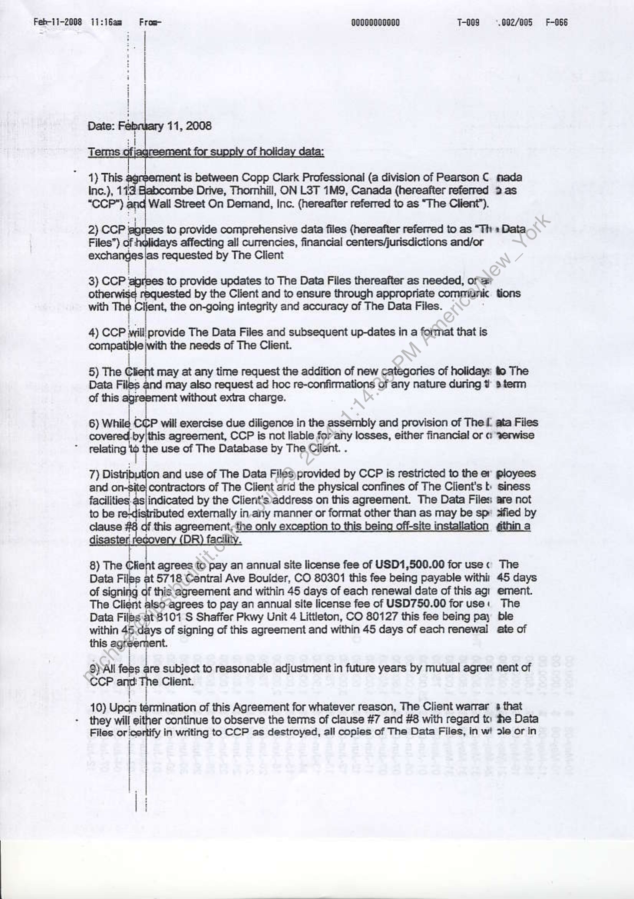
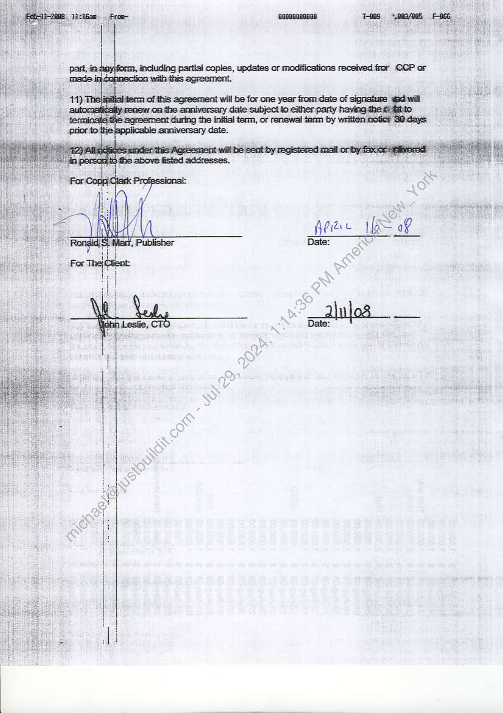
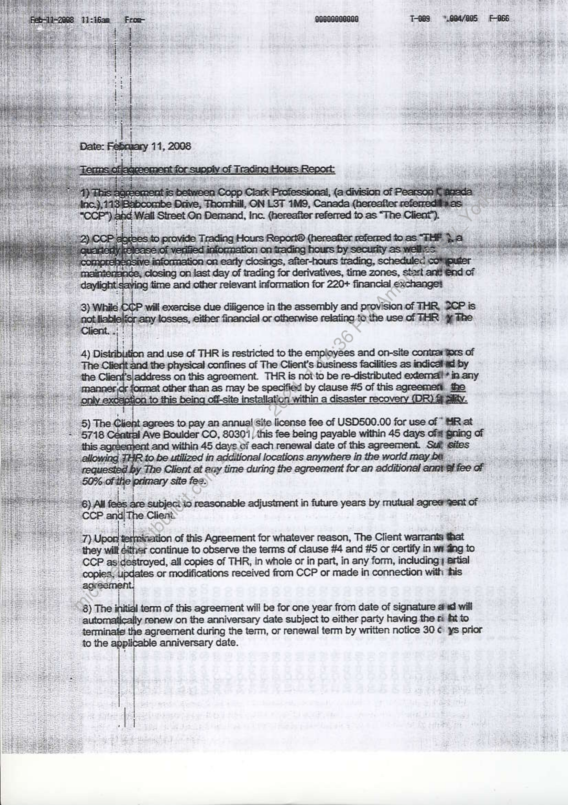
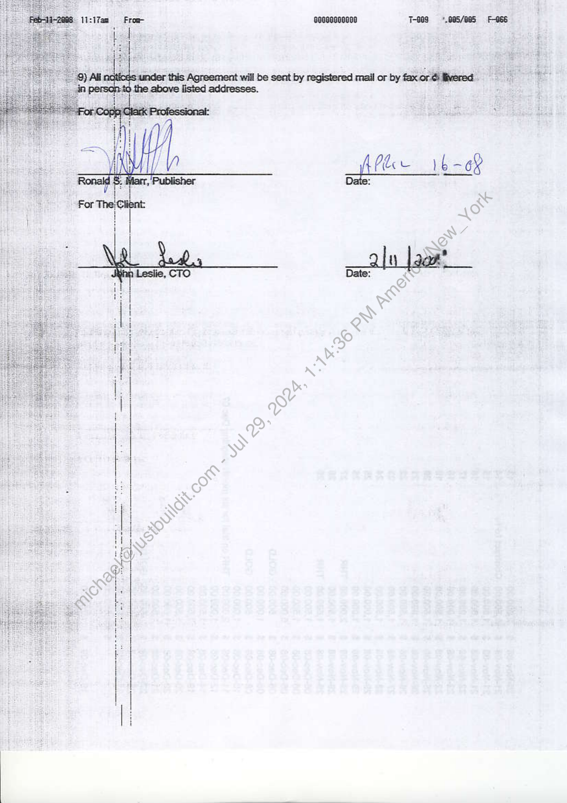

##### Agreement for Data Files]

  
````col
```col-md
flexGrow=.5
===
> [!info] [Page 1](_attachments/images_3.6.4.1.18.120080211-CoppClark-WSOD-HolidayCalendarandTradingHours-DataAgreements.pdf_155131/page_1.png)
> 
```  
```col-md
Feb-11-2008 11:16am  Froe- eoooo000000 J-009 = '.002/005  
1) This jent is between Copp Clark Professional (a division of Pearson C mada
Drive, Thomhill, ON L3T 1M9, Canada (hereafter referred 3 as  
to provide comprehensive data files (hereafter referred to as “Th » Data
Files”) of | affecting all currencies, financial centers/jurisdictions and/or
stones requested by The Client  
3) CCP agrees to provide updates to The Data Files thereafter as needed, of
othe: requested by the Client and to ensure through appropriate commiunic tions
with > Client, the on-going integrity and accuracy of The Data Files.  
4) CCP eo provide The Data Files and subsequent up-dates in a foimnat that is
ee the needs of The Client.  
5 Te st nay at re request the addition of new categories of holidays te The
Data Fi may also request ad hoc re-confirmations of any nature during w 8 term
of this ment without extra charge.  
6) wnig c will exercise due diligence in the assembly and provision of The f. ata Files
cor -by|this agreement, CCP is not liable forany losses, either financial or « 3erwise
saps use of The Database by The Client. .  
and use of The Data on esarbeedcabst lope dpe poet Ployees  
aioe s|indicated by the Client's.address on this agreement. The Data Files: are not
- ibuted externally in -~ manner or format other than as may be sp: ified by
this agreement;the only exception to this being off-site installation gthin a
R) facility.  
8) The Ckent agrees to pay an annual site license fee of USD1,500.00 for use« The
Data Files at 5718 Central Ave Boulder, CO 80301 this fee being payable withi: 45 days
of signing of this egreement and within 45 days of each renewal date of this agi ement.
The Clignt Iso-agrees to pay an annual site license fee of USD750.00 for use: The
Data Files at8101 S Shaffer Pkwy Unit 4 Littleton, CO 80127 this fee being pay ble
within ert ye of signing of this agreement and within 45 days of each renewal ate of
this ag  
9) All fobs re subject to reasonable adjustment in future years by mutual agree nent of
ccP =p e Client.  
they will either continue to observe the terms of clause #7 and #8 with regard tc the Data  
10) Upeti rmination of this Agreement for whatever reason, The Client warrar a that
Files or ‘certify in writing to CCP as destroyed, all copies of The Data Files, in wi ole or in  
F-066  
```
````
Notes:    
````col
```col-md
flexGrow=.5
===
> [!info] [Page 2](_attachments/images_3.6.4.1.18.120080211-CoppClark-WSOD-HolidayCalendarandTradingHours-DataAgreements.pdf_155131/page_2.png)
> 
```  
```col-md  
```
````
Notes:    
````col
```col-md
flexGrow=.5
===
> [!info] [Page 3](_attachments/images_3.6.4.1.18.120080211-CoppClark-WSOD-HolidayCalendarandTradingHours-DataAgreements.pdf_155131/page_3.png)
> 
```  
```col-md
agrees to. pay an annual Site license fee of USD500.00 for use of MRat
Ave Boulder CO, 803011, this fee being payable within 45 days oft gning of  
7) Upon tesfnivaation of this Agreement for whatever reason, The Client warrants that
“they her continue to observe the terms of clause #4 and #5 or certify in widing to
strayed, ail copies of THR, in whole or in part, in any form, including; artial
or modifications received from CCP or made in connection with this  
8) The init: term of this agreement will be for one year from date of signature asd will
: renew on the anniversary date subject to either party having the ti fat to
reement during the term, or renewal term by written notice 30 © ys prior
anniversary date.  
to the vikablo  
t
|
|
]  
```
````
Notes:    
````col
```col-md
flexGrow=.5
===
> [!info] [Page 4](_attachments/images_3.6.4.1.18.120080211-CoppClark-WSOD-HolidayCalendarandTradingHours-DataAgreements.pdf_155131/page_4.png)
> 
```  
```col-md
*,005/005  F-066  
16 -6¥  
J-003  
Pie
t  
ooesogoosso
under this Agreement will be sent by registered mail or by fax or é livered  
Froe-  
id a ina 0.
emnloateeeee _ —
porereet ee > WRU Yorn eer es Sn eet  
| 9) All  
Febti-2008 11:17am  
```
````
Notes:  


![[_attachments/3.6.4.1.18.1 20080211 - Copp Clark - WSOD - Holiday Calendar and Trading Hours - Data Agreements.pdf]