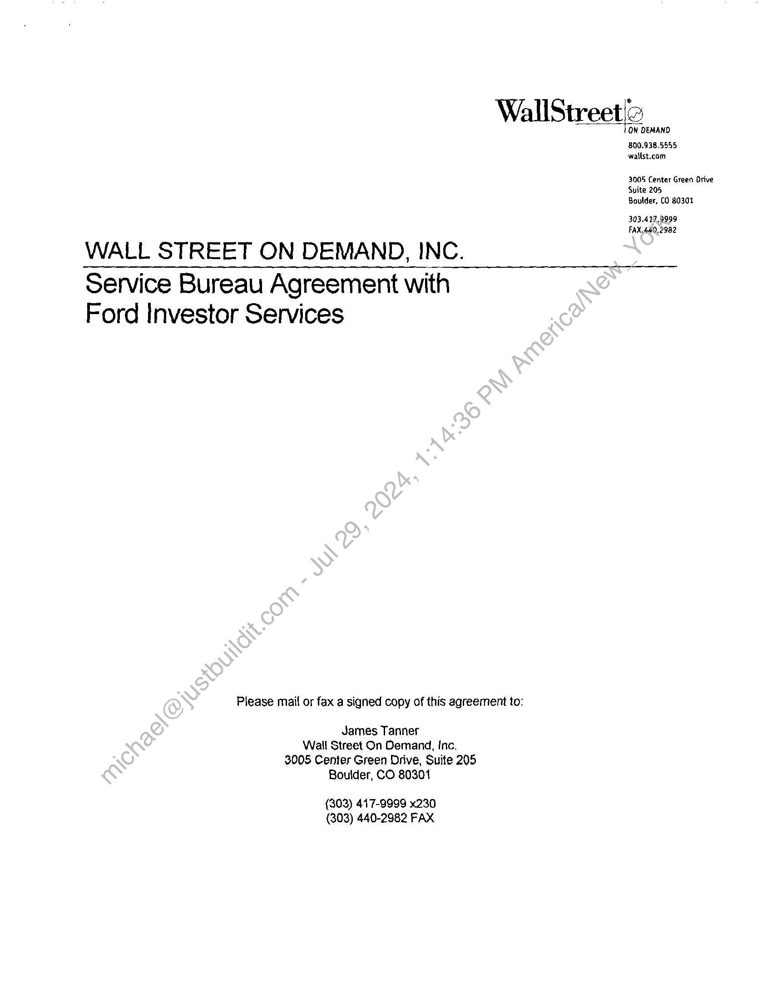
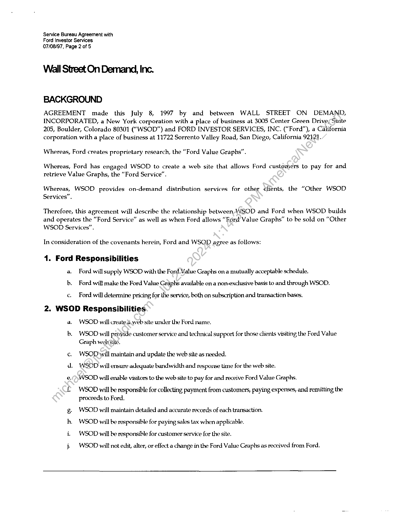
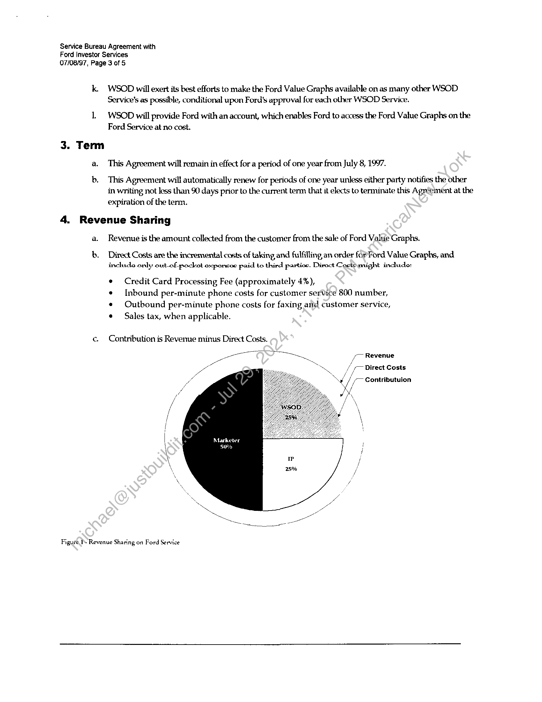
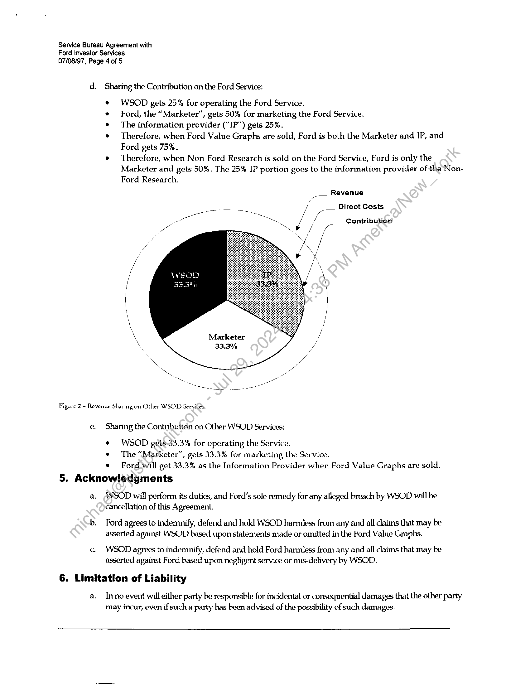
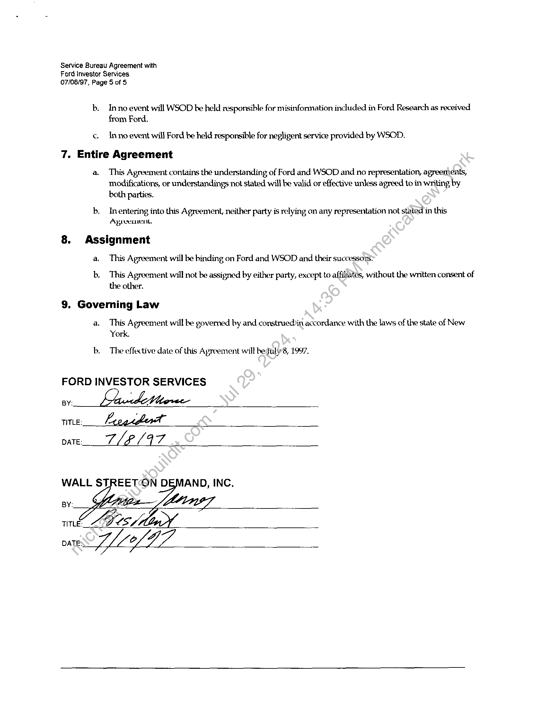

##### Service Bureau Agreement]

  
````col
```col-md
flexGrow=.5
===
> [!info] [Page 1](_attachments/images_3.6.4.1.19.1FordInvestorServices_MODServiceBureauAgrmtExecuted19970708.pdf_155435/page_1.png)
> 
```  
```col-md
WallStreet|2  
WALL STREET ON DEMAND, INC.  
Service Bureau Agreement with
Ford Investor Services  
Please mail or fax a signed copy of this agreement to:  
James Tanner
Wall Street On Demand, Inc.
3005 Center Green Drive, Suite 205
Boulder, CO 80301  
(303) 417-9999 x230
(303) 440-2982 FAX  
ON DEMAND  
800.938.5555
watlst.com  
3005 Center Green Drive
Suite 205
Boulder, CO 80301  
303.417.9999
FAX.440, 2982  
```
````
Notes:    
````col
```col-md
flexGrow=.5
===
> [!info] [Page 2](_attachments/images_3.6.4.1.19.1FordInvestorServices_MODServiceBureauAgrmtExecuted19970708.pdf_155435/page_2.png)
> 
```  
```col-md
Service Bureau Agreement with
Ford Investor Services
07/08/97, Page 2 of 5  
Wall Street On Demand, Inc.  
BACKGROUND  
AGREEMENT made this July 8, 1997 by and between WALL STREET ON DEMAND,
INCORPORATED, a New York corporation with a place of business at 3005 Center Green Drives Suite
205, Boulder, Colorado 80301 (“WSOD”) and FORD INVESTOR SERVICES, INC. (“Ford”), a California
corporation with a place of business at 11722 Sorrento Valley Road, San Diego, California 92121.  
Whereas, Ford creates proprietary research, the “Ford Value Graphs”.  
Whereas, Ford has engaged WSOD to create a web site that allows Ford customers to pay for and
retrieve Value Graphs, the “Ford Service”.  
Whereas, WSOD provides on-demand distribution services for other ¢lients, the “Other WSOD
Services”.  
Therefore, this agreement will describe the relationship between-WSOD and Ford when WSOD builds
and operates the “Ford Service” as well as when Ford allows “Ford Value Graphs” to be sold on “Other
WSOD Services”.  
In consideration of the covenants herein, Ford and WSOD agree as follows:  
1. Ford Responsibilities
a. Ford will supply WSOD with the Ford Value Graphs on a mutually acceptable schedule.
b. Ford will make the Ford Value Graphs available on a non-exclusive basis to and through WSOD.
c. Ford will determine pricing for the service, both on subscription and transaction bases,
2. WSOD Responsibilities
a. WSOD will aeate.a.web site under he Ford name.  
b. WSOD will provide customer service and technical support for those clienls visiting the Ford Value
Graph webGite.  
WSOD will maintain and update the web site as needed.
WSOD will ersure adequate bandwidth and response time for the web site.  
a 9  
e. ) WSOD will enable visitors to the web site to pay for and receive Ford Value Graphs.  
WSOD will be responsible for collecting payment from customers, paying expenses, and remitting the
proceeds to Ford.  
g. WSOD will maintain detailed and accurate records of each transaction.
h. WSOD will be responsible for paying sales tax when applicable.
i. WSOD will be responsible for customer service for the site.  
} = WSOD will not edit, alter, or effect a change in the Ford Value Graphs as received from Ford.  
```
````
Notes:    
````col
```col-md
flexGrow=.5
===
> [!info] [Page 3](_attachments/images_3.6.4.1.19.1FordInvestorServices_MODServiceBureauAgrmtExecuted19970708.pdf_155435/page_3.png)
> 
```  
```col-md
Service Bureau Agreement with
Ford Investor Services
07/08/97, Page 3 of S  
k. WSOD will exert its best efforts to make the Ford Value Graphs available on as many other WSOD
Service's as possible, conditional upon Ford's approval for each other WSOD Service.  
1 ~WSOD will provide Ford with an account, which enables Ford to access the Ford Value Graphs on the
Ford Service at no cost.  
a. This Agreement will remain in effect for a period of one year from July 8, 1997.  
b. This Agreement will automatically renew for periods of one year unless either party notifies the other
in writing not less than 90 days prior to the current term that it elects to terminate this Agreement at the
expiration of the term.  
4. Revenue Sharing  
a. Reverwe is the amount collected from the customer from the sale of Ford Value Graphs.  
b. Direct Costs are the incremental costs of taking and fulfilling an order fopFord Value Graphs, and
include only out_of pockot oxponcos paid to third partios. Direct Coctimight inchide:  
¢ Credit Card Processing Fee (approximately 4%),  
e [Inbound per-minute phone costs for customer service 800 number,
¢ Outbound per-minute phone costs for faxing aid customer service,
¢ Sales tax, when applicable.  
c. Contribution is Revenue minus Direct Costs.  
> 7 Revenue  
N  
/
f /_ Direct Costs  
/
YY Contributuion
i.
\
\  
/
/
/
/
/  
| Marketer
\ 50% !  
Figure I Revenue Sharing on Ford Service  
```
````
Notes:    
````col
```col-md
flexGrow=.5
===
> [!info] [Page 4](_attachments/images_3.6.4.1.19.1FordInvestorServices_MODServiceBureauAgrmtExecuted19970708.pdf_155435/page_4.png)
> 
```  
```col-md
Service Bureau Agreement with
Ford Investor Services
07/08/97, Page 4 of 5  
d.  
Sharing the Contribution on the Ford Service:  
WSOD gets 25% for operating the Ford Service.  
Ford, the “Marketer”, gets 50% for marketing the Ford Service.  
The information provider (“IP”) gets 25%.  
Therefore, when Ford Value Graphs are sold, Ford is both the Marketer and IP, and
Ford gets 75%.  
e Therefore, when Non-Ford Research is sold on the Ford Service, Ford is only the
Marketer and gets 50%. The 25% IP portion goes to the information provider of the-NonFord Research.  
Revenue
—  
Direct Costs  
Contribution  
Marketer
33.3%  
Figure 2 - Revenue Sharing on Other WSOD Seryiées  
e  
Sharing the Contribution on Other WSOD Services:  
¢ WSOD gets-33.3% for operating the Service.
¢ The “Marketer”, gets 33.3% for marketing the Service.
¢ Ford will get 33.3% as the Information Provider when Ford Value Graphs are sold.  
5. Acknowledgments  
a.  
WSOD will perform its duties, and Ford’s sole remedy for any alleged breach by WSOD will be
cancellation of this Agreement.  
Ford agrees to indemnify, defend and hold WSOD harmless from any and all claims that may be
asserted against WSOD based upon statements made or omitted in the Ford Value Graphs.  
WSOD agrees to indemnify, defend and hold Ford harmless from any and all claims that may be
asserted against Ford based upon negligent service or mis-delivery by WSOD.  
6. Limitation of Liability  
a.  
Inno event will either party be responsible for incidental or consequential damages that the other party
may incur, even if such a party has been advised of the possibility of such damages.  
```
````
Notes:    
````col
```col-md
flexGrow=.5
===
> [!info] [Page 5](_attachments/images_3.6.4.1.19.1FordInvestorServices_MODServiceBureauAgrmtExecuted19970708.pdf_155435/page_5.png)
> 
```  
```col-md
Service Bureau Agreement with
Ford investor Services
07/08/97, Page 5 of S  
b. Inno event will WSOD be held responsible for misinformation included in Ford Research as received
from Ford.
c. Inno event will Ford be held responsible for negligent service provided by WSOD.
7. Entire Agreement  
a. This Agreement contains the understanding of Ford and WSOD and no representation, agreements,
modifications, or understandings not stated will be valid or effective unless agreed to in writing by
both parties.  
b. _Inentering into this Agreement, neither party is relying on any representation not stated in this
Agreeenit,  
8. Assignment
a. This Agreement will be binding on Ford and WSOD and their successors:  
b. This Agreement will not be assigned by either party, except to affiliates, without the written consent of
the other.  
9. Governing Law  
a. This Agreement will be governed by and construediin accordance with the laws of the state of New
York.  
b. The effective date of this Agreement will beguly8, 1997.  
FORD INVESTOR SERVICES  
TITLE: ae  
WALL STREETON DEMAND, INC.
BY: GALNEZ,  
TITLE: GZ  
```
````
Notes:  


![[_attachments/3.6.4.1.19.1 Ford Investor Services_MOD Service Bureau Agrmt Executed 19970708.pdf]