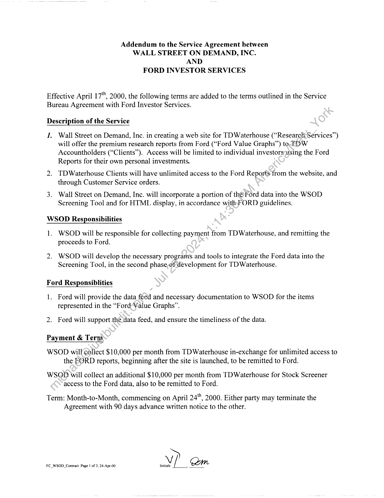
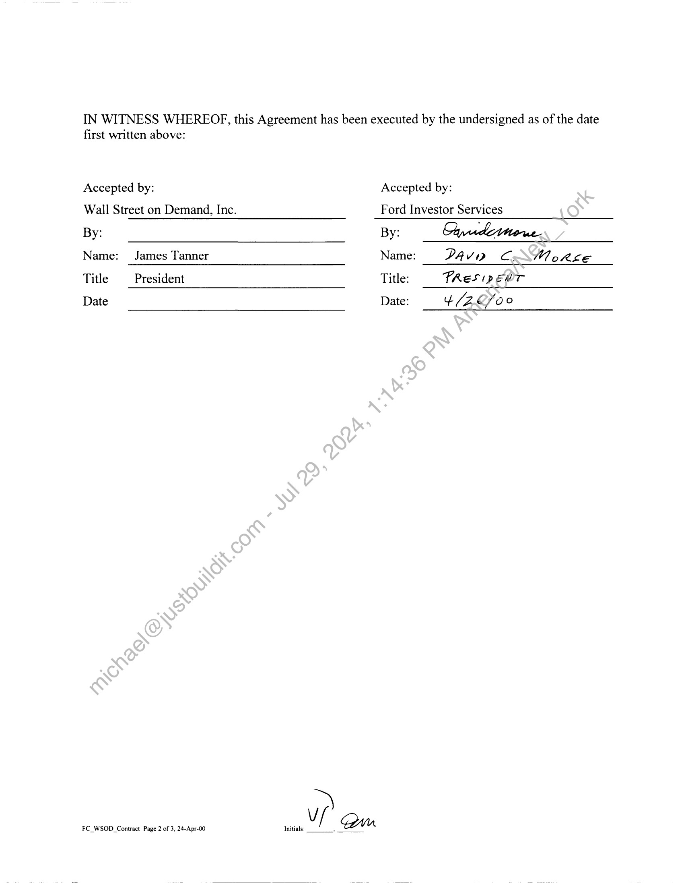
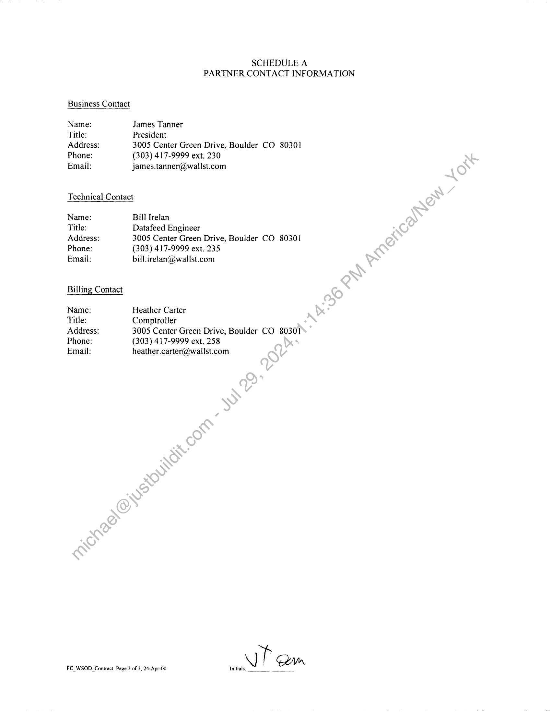

##### Addendum to the Service Agreement between Wall Street on Demand, Inc. and Ford Investor Services]

  
````col
```col-md
flexGrow=.5
===
> [!info] [Page 1](_attachments/images_3.6.4.1.19.2FordInvestorServices_MODAddendum20000417.pdf_155221/page_1.png)
> 
```  
```col-md
Addendum to the Service Agreement between
WALL STREET ON DEMAND, INC.
AND
FORD INVESTOR SERVICES  
Effective April 17"", 2000, the following terms are added to the terms outlined in the Service
Bureau Agreement with Ford Investor Services.  
Description of the Service  
J. Wall Street on Demand, Inc. in creating a web site for TD Waterhouse (“ResearcliServices”)
will offer the premium research reports from Ford (“Ford Value Graphs’’) to TDW
Accountholders (“Clients”). Access will be limited to individual investorsusing the Ford
Reports for their own personal investments.  
2. TDWaterhouse Clients will have unlimited access to the Ford Reports from the website, and
through Customer Service orders.  
3. Wall Street on Demand, Inc. will incorporate a portion of th©Ford data into the WSOD
Screening Tool and for HTML display, in accordance withsFORD guidelines.  
WSOD Responsibilities  
1. WSOD will be responsible for collecting payment from TDWaterhouse, and remitting the
proceeds to Ford.  
2. WSOD will develop the necessary programs and tools to integrate the Ford data into the  
Screening Tool, in the second phase,of development for TDWaterhouse.  
Ford Responsiblities  
1. Ford will provide the data feed and necessary documentation to WSOD for the items
represented in the “Ford-Value Graphs”.  
2. Ford will support the data feed, and ensure the timeliness of the data.  
Payment & Term  
WSOD will collect $10,000 per month from TD Waterhouse in-exchange for unlimited access to
the FORD reports, beginning after the site is launched, to be remitted to Ford.  
WSGD will collect an additional $10,000 per month from TD Waterhouse for Stock Screener
access to the Ford data, also to be remitted to Ford.  
Term: Month-to-Month, commencing on April 24", 2000. Either party may terminate the
Agreement with 90 days advance written notice to the other.  
FC_WSOD_Contract Page | of 3, 24-Apr-00 Initials: |, ZZ, t  
```
````
Notes:    
````col
```col-md
flexGrow=.5
===
> [!info] [Page 2](_attachments/images_3.6.4.1.19.2FordInvestorServices_MODAddendum20000417.pdf_155221/page_2.png)
> 
```  
```col-md
IN WITNESS WHEREOF, this Agreement has been executed by the undersigned as of the date  
first written above:  
Accepted by:  
Wall Street on Demand, Inc.  
Accepted by:  
Ford Investor Services  
By:  
Name: James Tanner
Title President
Date  
FC_WSOD_Contract Page 2 of 3, 24-Apr-00 Initials.  
By: hyukitiere  
Name: PAVD Co: Wo RE
Title: FRES (Pp EWT  
Date: ¢/Z C/o0  
```
````
Notes:    
````col
```col-md
flexGrow=.5
===
> [!info] [Page 3](_attachments/images_3.6.4.1.19.2FordInvestorServices_MODAddendum20000417.pdf_155221/page_3.png)
> 
```  
```col-md
Business Contact  
Name:
Title:
Address:
Phone:
Email:  
SCHEDULE A
PARTNER CONTACT INFORMATION  
James Tanner  
President  
3005 Center Green Drive, Boulder CO 80301
(303) 417-9999 ext. 230
james.tanner@wallst.com  
Technical Contact  
Name:
Title:
Address:
Phone:
Email:  
Billing Contact  
Name:
Title:
Address:
Phone:
Email:  
FC_WSOD_Contract Page 3 of 3, 24-Apr-00 Initials.  
Bill Irelan  
Datafeed Engineer  
3005 Center Green Drive, Boulder CO 80301
(303) 417-9999 ext. 235  
bill. irelan@wallst.com  
Heather Carter  
Comptroller  
3005 Center Green Drive, Boulder CO 80301
(303) 417-9999 ext. 258
heather.carter@wallst.com  
VP am  
```
````
Notes:  


![[_attachments/3.6.4.1.19.2 Ford Investor Services_MOD Addendum 20000417.pdf]