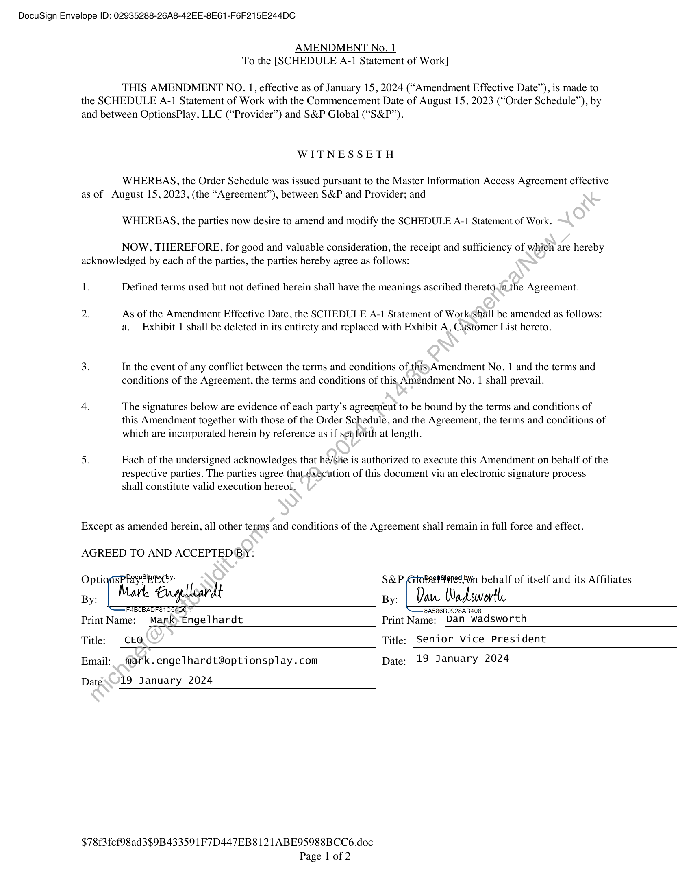
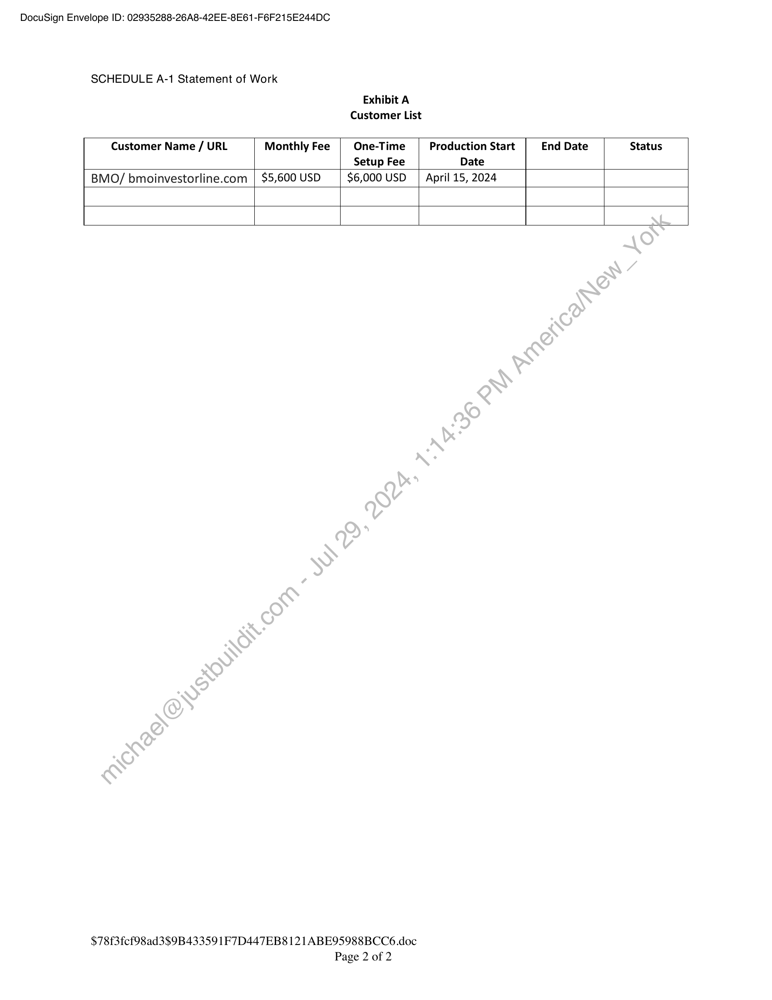

##### Amendment No. 1 to the SCHEDULE A-1 Statement of Work]

  
````col
```col-md
flexGrow=.5
===
> [!info] [Page 1](_attachments/images_3.6.4.1.2.120240115-SPGMI-Fincentric-OptionsPlay-Amendment_1.pdf_155425/page_1.png)
> 
```  
```col-md
DocuSign Envelope ID: 02935288-26A8-42EE-8E61-F6F215E244DC  
AMENDMENT No. 1
To the [SCHEDULE A-1 Statement of Work]  
THIS AMENDMENT NO. 1, effective as of January 15,2024 (“Amendment Effective Date’), is made to
the SCHEDULE A-1 Statement of Work with the Commencement Date of August 15, 2023 (“Order Schedule’), by
and between OptionsPlay, LLC (“Provider”) and S&P Global (“S&P”).  
WITNESSETH  
WHEREAS, the Order Schedule was issued pursuant to the Master Information Access Agreement effective
as of August 15,2023, (the “Agreement”), between S&P and Provider; and  
WHEREAS, the parties now desire to amend and modify the SCHEDULE A-1 Statement of Work.  
NOW, THEREFORE, for good and valuable consideration, the receipt and sufficiency of which are hereby
acknowledged by each of the parties, the parties hereby agree as follows:  
1. Defined terms used but not defined herein shall have the meanings ascribed thereto.in the Agreement.  
2. As of the Amendment Effective Date, the SCHEDULE A-1 Statement of Work,Shall be amended as follows:
a. Exhibit 1 shall be deleted in its entirety and replaced with Exhibit A, Customer List hereto.  
3. In the event of any conflict between the terms and conditions of thisyAmendment No. 1 and the terms and
conditions of the Agreement, the terms and conditions of this Amendment No. | shall prevail.  
4. The signatures below are evidence of each party’s agreement to be bound by the terms and conditions of
this Amendment together with those of the Order Schedule, and the Agreement, the terms and conditions of
which are incorporated herein by reference as if s¢t forth at length.  
5. Each of the undersigned acknowledges that he/she is authorized to execute this Amendment on behalf of the
respective parties. The parties agree that.¢xécution of this document via an electronic signature process
shall constitute valid execution hereof,  
Except as amended herein, all other terms and conditions of the Agreement shall remain in full force and effect.  
AGREED TO AND ACCEPTED BY:  
one Wher Ey, S&P Gtorrest Fares yn behalf of itself and its Affiliates
Engelleardt py: | Daw Wadsworth
F4BOBADF81C54D0. 8A586B0928AB408.
Print Name: Mark) Engelhardt Print Name: Dan Wadsworth
Title: CEO Title: Senior Vice President
Email: _mark.engelhardt@optionsplay.com Date: 19 January 2024  
Datex19 January 2024  
$78f3fcf98ad3$9B43359 1F7D447EB8 121 ABE95988BCC6.doc
Page 1 of 2  
```
````
Notes:    
````col
```col-md
flexGrow=.5
===
> [!info] [Page 2](_attachments/images_3.6.4.1.2.120240115-SPGMI-Fincentric-OptionsPlay-Amendment_1.pdf_155425/page_2.png)
> 
```  
```col-md
DocuSign Envelope ID: 02935288-26A8-42EE-8E61-F6F215E244DC  
SCHEDULE A-1 Statement of Work  
Exhibit A
Customer List  
Customer Name / URL Monthly Fee One-Time Production Start End Date Status
Setup Fee Date
BMO/ bmoinvestorline.com | $5,600 USD $6,000 USD | April 15, 2024  
$78f3fcf98ad3$9B43359 1F7D447EB8 121 ABE95988BCC6.doc  
Page 2 of 2  
```
````
Notes:  


![[_attachments/3.6.4.1.2.1 20240115-SPGMI-Fincentric-OptionsPlay-Amendment_1.pdf]