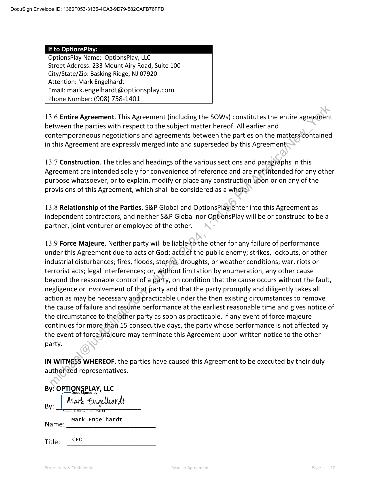

##### Reseller Agreement]

  
````col
```col-md
flexGrow=.5
===
> [!info] [Page 1](_attachments/images_3.6.4.1.2.220230815-SPGMI-MOD-OptionsPlay-ResellerAgreement.pdf_155107/page_1.png)
> 
```  
```col-md
DocuSign Envelope ID: 1360F053-3136-4CA3-9D79-582CAFB76FFD  
RESELLER AGREEMENT  
THIS RESELLER AGREEMENT (this “Agreement”) is made and entered into by and between
OptionsPlay, LLC (“OptionsPlay”) and Markit On Demand, Inc., its parent company, and its
Affiliates (“S&P Global”) on August 15, 2023 (the “Execution Date”). This Agreement is effective
as of August 15, 2023 (the “Effective Date”). “Affiliates” means any entity directly or indirectly
controlling, controlled by or under common control with another entity, where “control” means
ownership of more than 50% of the voting stock or other equity interests of an entity, or the
right to direct the management of such entity.  
WHEREAS, OptionsPlay is in the business of providing the OptionsPlay suite of prodticts, web
site design/customization, software development and hosting services and maintenance
services. WHEREAS S&P Global wishes to resell such products and services,;and OptionsPlay is
willing to provide such products and services to S&P Global for resale.  
NOW THEREFORE, in consideration of the premises set forth abovésand for other good and
valuable consideration, the receipt and sufficiency of which are-hereby acknowledged, the
parties hereto agree as follows:  
1. DEFINITIONS.
1.1 “Customer” means a customer of S&P Globalthiat subscribes to the Product Offering.  
1.2 “Documentation” means OptionsPlay’s operator and user manuals, designs, technical
reference manuals, flow diagrams, file descriptions and any other written materials pertaining
to the use of the Product Offering, in.each case, to the extent generally provided by
OptionsPlay upon request to OptionsPlay’s customers.  
1.3 “Product Offering” means.the online, web-based applications and platforms and data
provided by OptionsPlay:and set out in the applicable SOW. In addition, except as otherwise set
forth in the applicable SOW, “Product Offering” includes any Deliverables delivered under the
SOW.  
1.4 “Professional Services” means OptionsPlay’s services for integrating, implementing or
customizing.the Product Offering and any other professional or consulting services requested
by S&P.Global and agreed to by OptionsPlay pursuant to an SOW.  
1.5“Product Offering Net Revenue” means the amounts identified to S&P Global by
OptionsPlay for deployment of Product Offering to Customer by S&P Global less (a) any
amounts collected for sales or use taxes, unless OptionsPlay is responsible to pay such taxes
related to the resale of such subscriptions.  
1.6 “SOW” means a written document entered into between the parties referencing this
Agreement that defines the specific deliverables and any additional terms and conditions for a  
```
````
Notes:    
````col
```col-md
flexGrow=.5
===
> [!info] [Page 2](_attachments/images_3.6.4.1.2.220230815-SPGMI-MOD-OptionsPlay-ResellerAgreement.pdf_155107/page_2.png)
> 
```  
```col-md
DocuSign Envelope ID: 1360F053-3136-4CA3-9D79-582CAFB76FFD  
Professional Services engagement and, as applicable, additional SOW’s, mutually agreed upon
by the parties in writing, may be added to this Agreement during the Term.  
1.7 “OptionsPlay Marks” means the mark OptionsPlay and associated logo and any other
trademark, service mark, trade dress, logos, logo design, trade names, corporate names, and
other identifiers of source or goodwill, including registrations and application or other
designation used by OptionsPlay in connection with the Product Offering.  
1.8 “Term” means, collectively, the Initial Term.
2. APPOINTMENT.  
2.1 Appointment as S&P Global. OptionsPlay hereby engages S&P Global as ayreseller to
market, and resell Professional Services and subscriptions to the Product Offering nonexclusively worldwide, and S&P Global hereby accepts the engagement, all upon the terms and
conditions set forth in this Agreement. S&P Global may offer the Professional Services and the
Product Offering to any third party that purchases or licenses other products or services from
S&P Global. Subscriptions to the Product Offering may be resold on a standalone basis or as
part of a bundle of products or services offered by S&P Global.  
2.2 Marketing Support. OptionsPlay shall provide S&P Global reasonable content and
marketing support, at no additional cost to S&P Global, in order to support S&P Global efforts
under Section 2.1. This support will include product descriptions and promotional copy, product
specifications, sample product content or,deliverables, sales literature (including PowerPoint
presentations), and scripts as applicable. OptionsPlay shall also engage in reasonable training of
S&P Global personnel. In addition, QptionsPlay shall attend sales meetings with prospective
Customers at S&P Global’s reasonable request and notification. Out of pocket expenses relating
to Marketing Support for such sales meetings shall be preapproved in writing by S&P Global, in
its sole discretion, and a mutually agreed upon amount will be paid by S&P Global.  
3. LICENSE GRANT AND:HOSTING SERVICES.  
3.1 License Grant-Subject to the terms and conditions of this Agreement, OptionsPlay hereby
grants to S&P\Global a non-exclusive, worldwide, non-transferable (except as permitted under
Section 13,3) license (i) to access and use the Product Offering and to copy and use the
Documentation for internal training purposes and for marketing and demonstration purposes
with.respect to prospective Customers, (ii) to reproduce, distribute, sublicense and grant access
to the Product Offering to Customers, (iii) to use, reproduce, modify, distribute, and display the
Documentation in connection with the resale of the Product Offering to Customers and (iv) to
access and use the Product Offering and to copy and use the Documentation to support
Customers.  
3.2 Restrictions. All trademark and copyright notices of OptionsPlay must be reproduced on all
copies of the Product Offering and the Documentation.  
```
````
Notes:    
````col
```col-md
flexGrow=.5
===
> [!info] [Page 3](_attachments/images_3.6.4.1.2.220230815-SPGMI-MOD-OptionsPlay-ResellerAgreement.pdf_155107/page_3.png)
> 
```  
```col-md
DocuSign Envelope ID: 1360F053-3136-4CA3-9D79-582CAFB76FFD  
3.3 Hosting Services. OptionsPlay shall maintain the Product Offering, provide hosting services
for the Product Offering and perform other associated services for the Product Offering
(collectively, “Hosting Services”), provided however that if undisputed OptionsPlay’s fees set
forth in Section 6.1 for a given Customer is more than 60 days overdue, and after OptionsPlay
has provided S&P Global with at least 30 days prior written notice, then OptionsPlay may at its
discretion suspend hosting services for that Customer until such payment is made.  
4. SUPPORT AND MAINTENANCE.  
4.1 Maintenance and Updates. OptionsPlay will provide maintenance services for. the Product
Offering by providing S&P Global and the Customers (a) all patches, updates, bug fixes,
enhancements, new releases, new versions and other improvements to the.Product Offering
along with other generally available technical material that OptionsPlay provides to its other
similarly situated customers and (b) all such services and repairs as are required to maintain the
Product Offering or are ancillary, necessary or otherwise related to\S&P Global’s and
Customers’ access to or use of the Product Offering, so that thé.Product Offering operates
properly in accordance with this Agreement.  
5. PROFESSIONAL SERVICES.  
5.1 Services. OptionsPlay agrees to provide Professional Services as set forth in each SOW,
including the delivery of any deliverables specified in the SOW (the “Deliverables”), and S&P
Global may resell such Professional Services and Deliverables to Customers. The parties may
change the services, provided any changes are made in writing and signed by authorized agents
for both parties as specified in the SOW: The parties agree to the terms and conditions set forth
in each SOW. In the event of a conflict between the terms of an SOW and this Agreement, the
SOW shall prevail.  
6. COMPENSATION.  
6.1 Fees. S&P Global’shall pay OptionsPlay the Product Offering Net Revenue and Professional
Services Fees (“Fees”) due, if any, as set forth in the applicable SOW, and if not specified, then
within sixty (60):days of invoice from OptionsPlay unless S&P Global has a bona fide dispute
with respect to such Fees, provided however that if OptionsPlay’s fees set forth in this Section
6.1 for,agiven Customer is more than sixty (60) days overdue, then OptionsPlay may at its
discretion suspend Professional Services for that Customer until payment is made. Payment of
fees does not indicate acceptance of the Professional Services or corresponding Deliverables.  
6.2 Invoice. All invoices shall be addressed to S&P as specified in the applicable SOW and
delivered to: CARMInvoicees@spglobal.com.  
6.3 Payment. All payments under this Agreement shall be in United States currency drawn ona
United States bank or wire transfer.  
```
````
Notes:    
````col
```col-md
flexGrow=.5
===
> [!info] [Page 4](_attachments/images_3.6.4.1.2.220230815-SPGMI-MOD-OptionsPlay-ResellerAgreement.pdf_155107/page_4.png)
> 
```  
```col-md
DocuSign Envelope ID: 1360F053-3136-4CA3-9D79-582CAFB76FFD  
6.4 Records and Audit. Both parties shall maintain and make available for inspection during the
period in which any payments are due hereunder and for two years thereafter, all books, records,
contracts and accounts relating to the payments due under this Agreement (“Records”). A party
may, once per year, at its sole expense, upon thirty (30) days’ prior written notice to the other,
party request to examine the other party’s Records only, to verify the amounts paid under this
Agreement. Such audit shall be subject to the auditor executing a confidentiality agreement that
is satisfactory to the disclosing party and allows the auditor to produce a confidential report to
the auditing party which certifies whether payments were accurate, but which otherwise
requires the auditor to keep confidential all information of the audited party as a result of the
audit. If the results of an audit reveal underpayment, then the underpaying party shall/pay the
deficiency to the other party. The cost of the audit shall be borne by the party ‘requesting the
audit unless the results thereof reveal that the audited party has underpaid amounts due
hereunder by more than ten percent (10%), in which case the other party shall-pay the requesting
party the reasonable cost of the audit. If the audit reveals any overpayment, the overpaid party
shall remit the amount of the overpayment to the other party.  
6.5 Taxes. Each of the parties is responsible for the payment of ail taxes that may be levied or
assessed upon it in connection with this Agreement.  
7. CONFIDENTIALITY.  
7.1 Definition. “Confidential Information” means the information of a party (“Disclosing
Party”) that is disclosed to the other party (“Receiving Party”) under this contract that the
Receiving Party knows or reasonably should know is confidential to the Disclosing Party.
Confidential Information may be disclosedin written, visual, oral or other form. Confidential
Information also includes all summaries or abstracts of Confidential Information.  
7.2 Obligations. Each party acknowledges that in the course of performing this Agreement, it
may obtain the Confidentialinformation of the other party. The Receiving Party shall, at all
times both during the termvof this Agreement and thereafter, keep in confidence and trust all
of the Disclosing Party’s ‘Confidential Information received by it. The Receiving Party shall not
use the Confidential Information of the Disclosing Party other than as reasonably required to
perform this Agreement. The Receiving Party shall take reasonable steps to prevent
unauthorized)disclosure or use of the Disclosing Party’s Confidential Information and to prevent
it from becoming publicly available or falling into the possession of unauthorized persons, but
in no event will the Receiving Party use less care than it would in connection with its own
confidential information of like kind. The Receiving Party shall not disclose Confidential
Information of the Disclosing Party to any person or entity other than its officers, employees
and consultants who need access to such Confidential Information in order to effect the intent
of this Agreement and who have entered into confidentiality agreements or are bound by
professional responsibility obligations which protect the Confidential Information of the
Disclosing Party sufficient to enable the Receiving Party to comply with its obligations of
confidentiality under this Agreement.  
```
````
Notes:    
````col
```col-md
flexGrow=.5
===
> [!info] [Page 5](_attachments/images_3.6.4.1.2.220230815-SPGMI-MOD-OptionsPlay-ResellerAgreement.pdf_155107/page_5.png)
> 
```  
```col-md
DocuSign Envelope ID: 1360F053-3136-4CA3-9D79-582CAFB76FFD  
7.3 Exceptions. The confidentiality obligations set forth herein do not apply to information
which is: (a) now or hereafter, through no unauthorized act or failure to act on the Receiving
Party’s part, in the public domain or publicly available; (b) known to the Receiving Party without
an obligation of confidentiality at the time the Receiving Party receives the same from the
Disclosing Party; (c) hereafter furnished to the Receiving Party by a third party without
restriction on disclosure; (d) furnished to others by the Disclosing Party without restriction on
disclosure; or (e) independently developed by the Receiving Party without use of or reference
to the Disclosing Party’s Confidential Information. Nothing in this Agreement shall prevent.the
Receiving Party from disclosing Confidential Information to the extent the Receiving Party is
legally compelled to do so by any law or governmental investigative or judicial agency,pursuant
to proceedings over which that agency has jurisdiction, on condition that, prior tothe
disclosure, the Receiving Party (i) asserts the confidential nature of the Confidential
Information; (ii) immediately notifies the Disclosing Party in writing of the requirement, order
or request to disclose; and (iii) cooperates fully with the Disclosing Party-in protecting against
any the disclosure and/or obtaining a protective order narrowing thescope of the compelled
disclosure and protecting its confidentiality.  
7.4 Other Permitted Disclosures. Notwithstanding the foregoing confidentiality obligations, a
party may provide a copy of this Agreement to the following persons and/or entities who are
under obligations of confidentiality substantially similar to those set forth in this Agreement:
potential acquirers, merger partners, lenders and investors and to their employees, agents,
attorneys, investment bankers, lenders, financial advisors and auditors in connection with the
due diligence review of such party. A party may-also provide a copy of this Agreement to the
party’s outside accounting firm and legal advisors and in connection with any litigation or
proceeding relating to this Agreement.  
8. TRADEMARKS  
8.1 Grant of License. Subject to the terms and conditions of this Agreement, OptionsPlay
hereby grants to S&P Global a non-exclusive, worldwide, non-transferable (except as permitted
under Section 13.3) license, to use and display the OptionsPlay Marks to market, advertise and
sell the Product Offering, the Professional Services and the Deliverables.  
8.2 Advertising and Promotional Materials. All advertising, promotional materials (including all
Web pages, packaging, and displays) and catalogs controlled by S&P Global that include or refer
to any,of-the OptionsPlay Marks in connection the Product Offering, the Professional Services
and.the Deliverables (all of the foregoing being hereinafter collectively referred to as
“Promotional Materials”) is subject to OptionsPlay’s prior written approval. S&P Global shall
submit a pre-production sample of any proposed Promotional Materials bearing the
OptionsPlay Marks to OptionsPlay for its approval prior to S&P Global’s commercial use thereof.
Upon OptionsPlay’s approval of any Promotional Materials, no further approval are required
from OptionsPlay for S&P Global’s use of the same or substantially similar Promotional
Materials.  
```
````
Notes:    
````col
```col-md
flexGrow=.5
===
> [!info] [Page 6](_attachments/images_3.6.4.1.2.220230815-SPGMI-MOD-OptionsPlay-ResellerAgreement.pdf_155107/page_6.png)
> 
```  
```col-md
DocuSign Envelope ID: 1360F053-3136-4CA3-9D79-582CAFB76FFD  
8.3 Ownership of OptionsPlay Marks. S&P Global acknowledges that OptionsPlay is and will
remain the owner of all right, title and interest in and to each of the OptionsPlay Marks in any
form or embodiment thereof and is also the owner of all goodwill associated with the
OptionsPlay Marks, and all goodwill generated by those sales shall inure exclusively to the
benefit of OptionsPlay.  
9, TERM AND TERMINATION  
9.1 Term. The initial term of this Agreement (“Initial Term”) will commence on the Effective
Date and continue for a period of two years. This Agreement will automatically renew every
one year after Effective Date. Unless otherwise stated in the applicable SOW, either party may
terminate this Agreement within 180 days of the end of the Term with written-notice to the
other Party, unless a Customer of S&P Global has deployed and is currently deploying the
OptionsPlay Product Offering. In the event S&P terminates this Agreement or a SOW,
OptionsPlay shall refund any pre-paid fees for the unused portion of the Products and Services
listed in the applicable SOWs.  
9.2 Material Breach. Either party may terminate this Agreement on or after the 30th day after
the party gives the other party written notice of a material. breach by the other party of any
obligation hereunder, unless such breach is cured within30 days following the breaching
party’s receipt of the written notice. Additionally, either party may at its option, upon written
notice, terminate this Agreement effective immediately if the other party becomes adjudicated
insolvent, makes a general assignment for theybénefit of creditors, files a voluntary petition of
bankruptcy, suffers or permits the appointment of the receiver for its business or assets,
becomes subject to any proceeding underany bankruptcy or insolvency law, whether domestic
or foreign, or is wound-up, dissolved.or liquidated, voluntarily or otherwise.  
9.3 Effect of Termination. Upon any termination or expiration of this Agreement, S&P Global
shall cease soliciting new subscriptions to the Product Offering. Existing Customer subscriptions
to the Product Offering survive the termination or expiration of this Agreement, and the
Agreement and the parties’ obligations hereunder continue to the extent necessary to permit
S&P Global to fulfilits obligations under any agreements with its Customers related to the
Product Offering; tne Professional Services or the Deliverables that are in existence at the time
of the termination or expiration of this Agreement. In addition, the termination or expiration of
this Agreement for any reason shall not affect a party’s rights or obligations that expressly or by
their nature continue and survive (including, without limitation, the payment terms and the
provisions concerning confidentiality, limitation on liability, indemnity, warranty and the
warranty disclaimers).  
9.4 Transition Services. Upon the termination or expiration of this Agreement, if requested by
S&P Global, OptionsPlay shall work with S&P Global in good faith to effect a reasonable
transition plan, including providing transition assistance to address transition matters as S&P
Global may reasonably request.  
```
````
Notes:    
````col
```col-md
flexGrow=.5
===
> [!info] [Page 7](_attachments/images_3.6.4.1.2.220230815-SPGMI-MOD-OptionsPlay-ResellerAgreement.pdf_155107/page_7.png)
> 
```  
```col-md
DocuSign Envelope ID: 1360F053-3136-4CA3-9D79-582CAFB76FFD  
10. WARRANTY.  
10.1 Product Offering Warranty. OptionsPlay represents, warrants and covenants to S&P
Global that the Product Offering shall perform in accordance with this Agreement. For any
breach of this warranty, OptionsPlay shall promptly correct the issue so that the Product
Offering performs as warranted at no additional cost to S&P Global.  
10.2 Professional Services Warranty. OptionsPlay represents, warrants and covenants that
OptionsPlay will perform the Professional Services in a timely, professional and workmanlike
manner and that all materials and Deliverables provided to S&P Global will comply with{i) the
requirements set forth in this Agreement and in the SOW, (ii) the documentationand
Specifications for those materials and Deliverables, (iii) any samples or documents provided by
OptionsPlay to S&P Global.  
10.3 Authority; Conflicts. Each party represents and warrants to the other that as of the
Effective Date of this Agreement: (a) such party has the full corporate right, power and
authority to enter into this Agreement and to perform the acts ‘required of it hereunder; (b) the
execution of this Agreement by such party, and the performance by such party of its obligations
and duties hereunder, do not and will not violate any agreement to which such party is a party
or by which it is otherwise bound; (c) when executed.and delivered by such party, this
Agreement will constitute the legal, valid and binding obligation of such party, enforceable
against such party in accordance with its terms; (da) such party is not subject to any pending or
threatened litigation or governmental action;which could interfere with such party’s
performance of its obligations under this Agreement or in any related agreement, and (e) the
parties shall at all times comply with all applicable laws, rules and regulations in effect at the
time services are performed pursuant.to this Agreement.  
10.4 Disclaimer. EXCEPT AS OTHERWISE SET FORTH IN THIS AGREEMENT OR ANY SOW,
NEITHER PARTY MAKES ANY WARRANTIES OF ANY KIND, WHETHER EXPRESS, IMPLIED,
STATUTORY OR OTHERWISE, AND EACH PARTY SPECIFICALLY DISCLAIMS AND EXCLUDES ALL
OTHER WARRANTIES, WHETHER STATUTORY, EXPRESS OR IMPLIED, INCLUDING ANY
WARRANTIES OF MERCHANTABILITY OR FITNESS FOR A PARTICULAR PURPOSE.  
11. INDEMNIFICATION.  
11.1 By.OptionsPlay. OptionsPlay will defend S&P Global and its officers, directors, affiliates,
employees and agents, and S&P Global’s Customers (collectively, “S&P Global Indemnified
Parties”) from and against, and shall indemnify and hold harmless the S&P Global Indemnified
Parties from all resulting losses, liabilities, damages, costs and expenses (including reasonable
attorneys’ fees and costs of litigation) arising out of or relating to any third party claim, action,
proceeding or suit (each, a “Claim”) that the Product Offering, the Professional Services or the
Deliverables infringe any patents, copyrights, trademarks, trade secrets or other intellectual
property rights of any third party. As a condition to receiving the indemnity under this
Agreement, S&P Global will promptly notify OptionsPlay in writing of the Claim for which it  
```
````
Notes:    
````col
```col-md
flexGrow=.5
===
> [!info] [Page 8](_attachments/images_3.6.4.1.2.220230815-SPGMI-MOD-OptionsPlay-ResellerAgreement.pdf_155107/page_8.png)
> 
```  
```col-md
DocuSign Envelope ID: 1360F053-3136-4CA3-9D79-582CAFB76FFD  
seeks indemnification (except that the failure to provide the notice will relieve the OptionsPlay
of its obligations only to the extent that such failure materially prejudices the OptionsPlay’s
ability to defend the Claim). OptionsPlay shall have sole control of the Claim, its defense and all
negotiations for its settlement or compromise and shall exercise control in good faith.
OptionsPlay shall use counsel reasonably acceptable to S&P Global. S&P Global may employ
counsel at its own expense. OptionsPlay will have no liability for any losses, damages, costs or
expenses resulting from any settlement or compromise made by S&P Global without
OptionsPlay’s prior written consent, not to be unreasonably withheld. OptionsPlay shall not
settle a Claim in a manner that admits fault or establishes liability on the part of S&P Global
without S&P Global’s prior written consent.  
12. LIMITATION OF LIABILITY.  
12.1 Consequential Damages Disclaimer. UNDER NO CIRCUMSTANCES W1iiL EITHER PARTY
HAVE ANY LIABILITY TO THE OTHER PARTY OR ANY THIRD PARTY FOR-ANY CONSEQUENTIAL,
EXEMPLARY, INCIDENTAL, INDIRECT OR SPECIAL DAMAGES OR COSTS RESULTING FROM ANY
CLAIM (WHETHER IN CONTRACT, TORT, NEGLIGENCE, STRICT LIABILITY OR PRODUCTS LIABILITY)
REGARDING THIS AGREEMENT.  
12.2 Cap On Liability. EXCEPT FOR INDEMNIFICATION OBLIGATIONS, IN NO EVENT WILL EITHER
PARTY BE LIABLE TO THE OTHER PARTY UNDER THIS AGREEMENT, REGARDLESS OF THE FORM
OF CLAIM OR ACTION, IN AN AMOUNT THAT EXCEEDS THE AGGREGATE OF THE AMOUNTS PAID
AND PAYABLE BY S&P TO OPTIONSPLAY DURING THE TWELVE MONTH PERIOD IMMEDIATELY
PRECEDING THE INCIDENT GIVING RISE TQsTHE CLAIM OR ACTION.  
13. MISCELLANEOUS  
13.1 Governing Law and Venue. This Agreement will be deemed to have been made and
delivered in New Jersey andthereby shall be governed as to validity, interpretation,
construction, effect andsincall other respects by the internal laws of the State of New York
without giving effect tocits conflicts of laws principles or rules. The parties hereto and their
successors and assigns irrevocably consent to the exclusive jurisdiction of any courts located in
the city of New. York and State of New York for the resolution of any disputes arising from or
related to this)Agreement. Nothing in this Agreement shall be deemed as preventing a party
from seeking injunctive relief (or any other provisional remedy) from any court having
jurisdiction over the parties and the subject matter of the dispute as necessary to protect that
party’s name, proprietary information, trade secrets, know-how, or any other intellectual
property or proprietary rights.  
13.2 Amendment and Waiver. No amendment hereto, or waiver of any right hereunder, shall
be effective unless in writing by both parties. No waiver by any party hereunder or failure of
any party to take action to enforce or assert any right or remedy hereunder shall be deemed a
waiver of any prior, concurrent or subsequent breach.  
```
````
Notes:    
````col
```col-md
flexGrow=.5
===
> [!info] [Page 9](_attachments/images_3.6.4.1.2.220230815-SPGMI-MOD-OptionsPlay-ResellerAgreement.pdf_155107/page_9.png)
> 
```  
```col-md
DocuSign Envelope ID: 1360F053-3136-4CA3-9D79-582CAFB76FFD  
13.3 Assignment. Neither party may assign its rights under this Agreement without the prior
written consent of the other party (excluding S&Ps right to assign to an S&P affiliate). Any
assignment permitted hereunder will be subject to the written consent of the assignee to all of
the terms and provisions of this Agreement. Any attempted assignment in derogation of this
section will be null and void. Notwithstanding the foregoing, either party may, without consent,
assign its rights under this Agreement to any person or entity in connection with a merger,
acquisition, divestiture, or sale of all or substantially all of its assets to which this Agreement
relates (an “Event”); provided, however, OptionsPlay shall provide S&P Global with as much.
notice as reasonably practicable for such OptionsPlay Event and S&P Global shall then have the
right to terminate this Agreement by providing a written notice to OptionsPlay within\sixty (60)
days following the receipt of such notice of such OptionsPlay Event, if in S&P Global’s
reasonable opinion the new owner of OptionsPlay: (i) is a competitor of S&P Global; or (ii)
presents a substantial risk to S&P Global’s reputation, intellectual property, rights, or ability to
collect payment hereunder. This Agreement shall be binding upon and inure to the benefit of
the respective successors, permitted assigns and legal representatives,of the parties hereto.  
13.4 Severability. If any provision of this Agreement shall be held by any court to be illegal, void
or unenforceable, such provision shall be of no force and effect, but the illegality of such
provision shall have no effect upon and shall not impair the enforceability of any other
provision hereof.  
13.5 Notices. A party giving or making any noticé) request, demand or other communication
(each, a “Notice”) under this Agreement shalijgive the Notice in writing and use one of the
following methods of delivery: personal delivery, registered or certified mail (in each case,
return receipt requested and postage prepaid), nationally recognized overnight courier (with all
fees prepaid), or confirmed e-mail. Any party giving a Notice shall address the Notice to the
receiving party (the “Addressee”) at the address listed on the signature page of this Agreement
or to another Addressee or another address as designated by a party in a Notice pursuant to
this Section.  
If to S&P Global:  
S&P Global Name:,S&P Global Inc.  
Street Address: 55"Water St.  
City/State/Zip; New York, New York 10041
Attention:Content Acquisition & Rights Management
(CARM)  
Email:\carmvendornotices@spglobal.com  
Phone Number:  
A copy of any notice to Service Provider shall also be sent
to:  
S&P Global Inc.  
General Counsel’s Office  
55 Water Street  
New York, New York 10041  
```
````
Notes:    
````col
```col-md
flexGrow=.5
===
> [!info] [Page 10](_attachments/images_3.6.4.1.2.220230815-SPGMI-MOD-OptionsPlay-ResellerAgreement.pdf_155107/page_10.png)
> 
```  
```col-md
DocuSign Envelope ID: 1360F053-3136-4CA3-9D79-582CAFB76FFD  
If to OptionsPlay:  
OptionsPlay Name: OptionsPlay, LLC  
Street Address: 233 Mount Airy Road, Suite 100
City/State/Zip: Basking Ridge, NJ 07920
Attention: Mark Engelhardt  
Email: mark.engelhardt@optionsplay.com
Phone Number: (908) 758-1401  
13.6 Entire Agreement. This Agreement (including the SOWs) constitutes the entire agreement
between the parties with respect to the subject matter hereof. All earlier and
contemporaneous negotiations and agreements between the parties on the matters-contained
in this Agreement are expressly merged into and superseded by this Agreements  
13.7 Construction. The titles and headings of the various sections and paragraphs in this
Agreement are intended solely for convenience of reference and are not intended for any other
purpose whatsoever, or to explain, modify or place any construction upon or on any of the
provisions of this Agreement, which shall be considered as a whole)  
13.8 Relationship of the Parties. S&P Global and OptionsPlayenter into this Agreement as
independent contractors, and neither S&P Global nor OptionsPlay will be or construed to be a
partner, joint venturer or employee of the other.  
13.9 Force Majeure. Neither party will be liableto’the other for any failure of performance
under this Agreement due to acts of God; acts.of the public enemy; strikes, lockouts, or other
industrial disturbances; fires, floods, storms, droughts, or weather conditions; war, riots or
terrorist acts; legal interferences; or, without limitation by enumeration, any other cause
beyond the reasonable control of a party, on condition that the cause occurs without the fault,
negligence or involvement of that party and that the party promptly and diligently takes all
action as may be necessary and:practicable under the then existing circumstances to remove
the cause of failure and resume performance at the earliest reasonable time and gives notice of
the circumstance to the other party as soon as practicable. If any event of force majeure
continues for more than 15 consecutive days, the party whose performance is not affected by
the event of force majeure may terminate this Agreement upon written notice to the other  
party.  
IN WITNESS WHEREOF, the parties have caused this Agreement to be executed by their duly
authorized representatives.  
By: OPTIONSPLAY, LLC  
DocuSigned by  
oy [ feat Enylluardt  
FABUSADFETCSADU  
Mark Engelhardt
Name:  
Title: _ CEO  
```
````
Notes:    
````col
```col-md
flexGrow=.5
===
> [!info] [Page 11](_attachments/images_3.6.4.1.2.220230815-SPGMI-MOD-OptionsPlay-ResellerAgreement.pdf_155107/page_11.png)
> 
```  
```col-md
DocuSign Envelope ID: 1360F053-3136-4CA3-9D79-582CAFB76FFD  
By: Markit,On,Pemand, Inc.
4). 3  
Renee Spampinato  
Name:  
Title: Head of Markit Digital  
```
````
Notes:  


![[_attachments/3.6.4.1.2.2 20230815-SPGMI-MOD-OptionsPlay-ResellerAgreement.pdf]