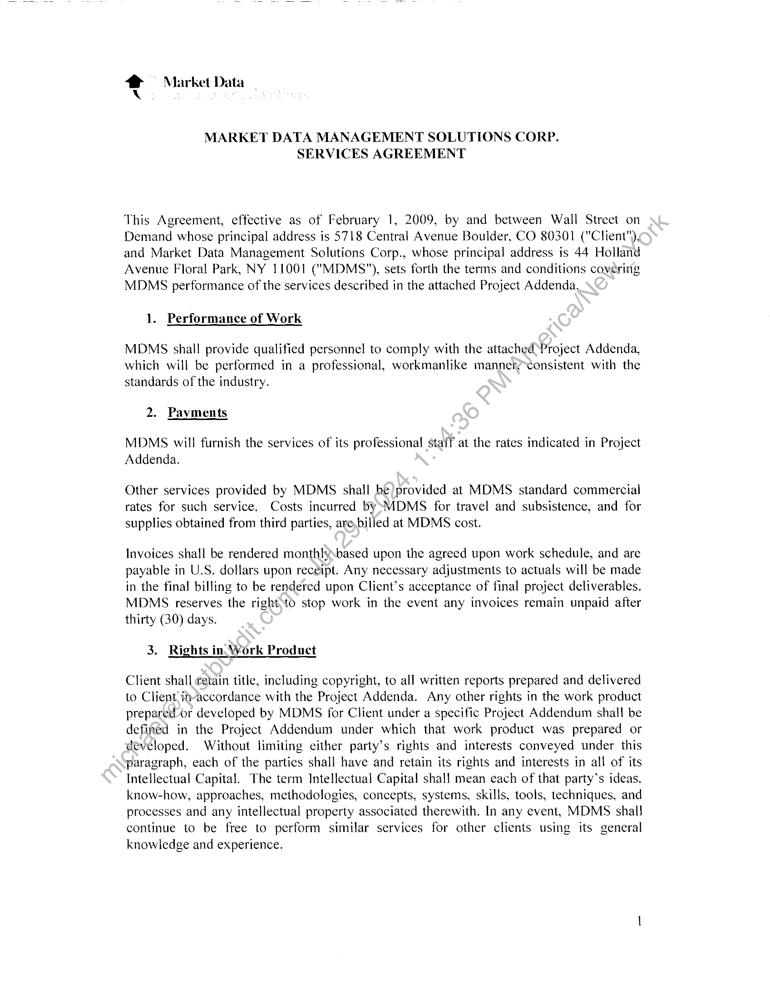
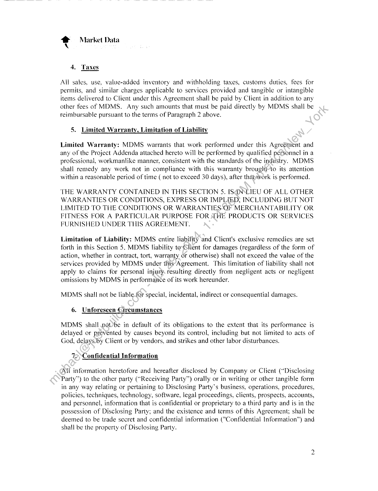
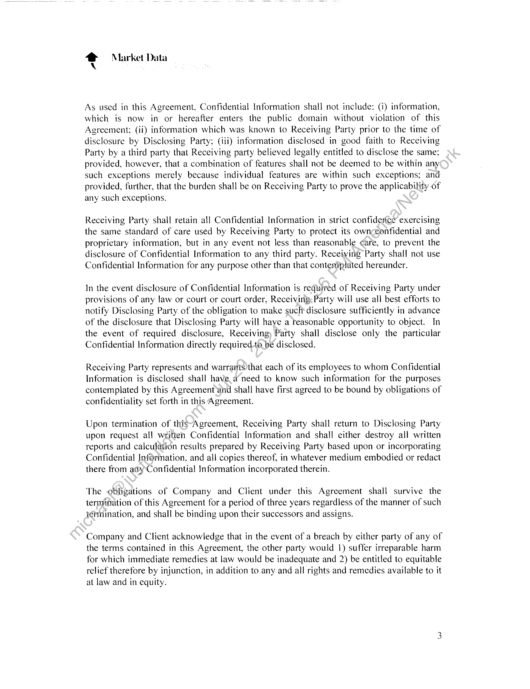
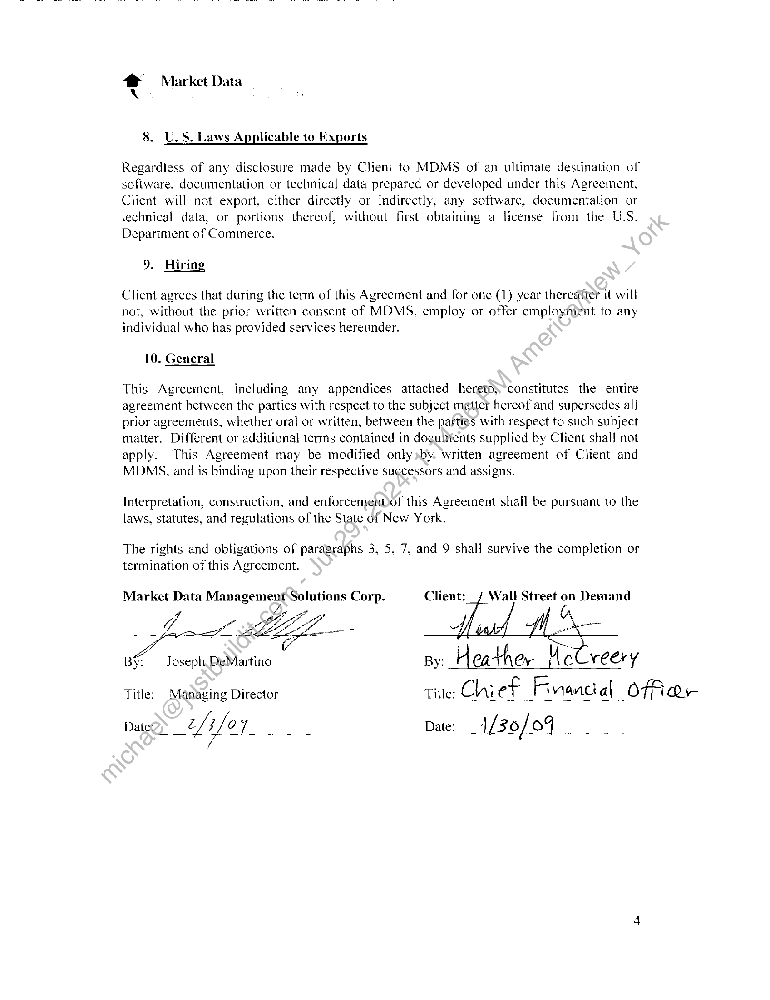
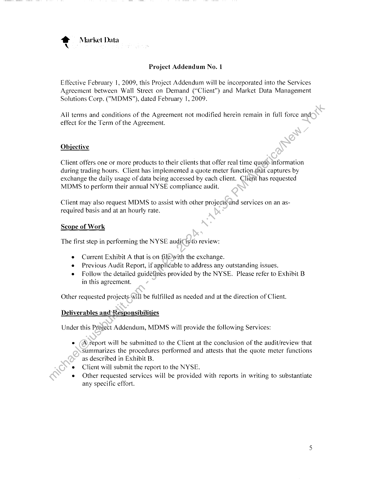
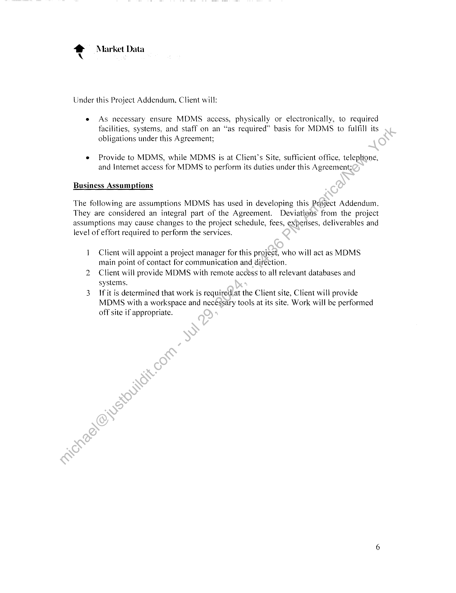
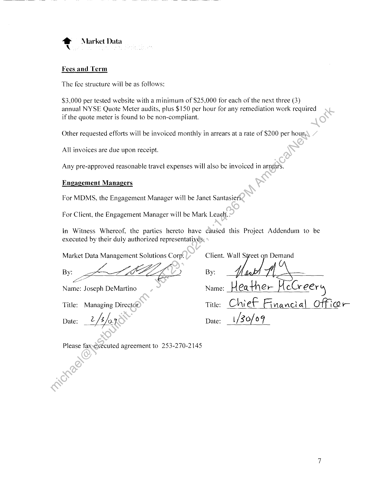
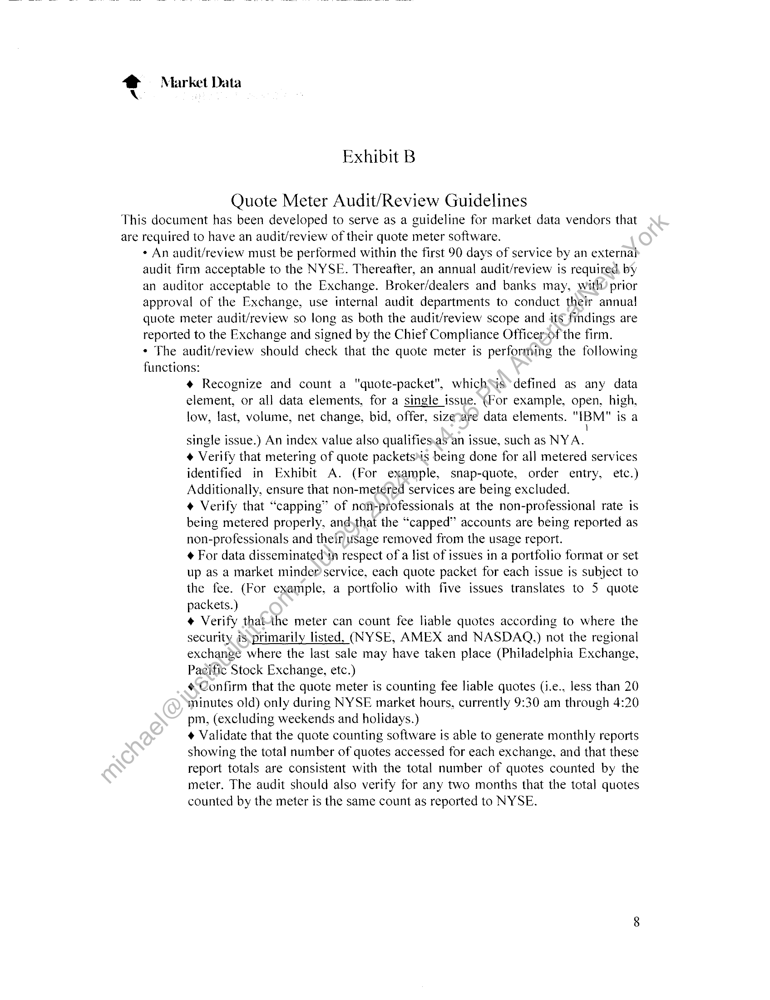

##### SERVICES AGREEMENT]

  
````col
```col-md
flexGrow=.5
===
> [!info] [Page 1](_attachments/images_3.6.4.1.20.1MarketDataManagementSolutionsCorpMSAQuoteAudit20090201.pdf_155420/page_1.png)
> 
```  
```col-md
2 ~ Market Data  
MARKET DATA MANAGEMENT SOLUTIONS CORP.
SERVICES AGREEMENT  
This Agreement, effective as of February 1, 2009, by and between Wall Street on
Demand whose principal address is 5718 Central Avenue Boulder, CO 80301 ("Client"),
and Market Data Management Solutions Corp., whose principal address is 44 Holland
Avenue Floral Park, NY 11001 ("MDMS"), sets forth the terms and conditions covering
MPMS performance of the services described in the attached Project Addenda.  
1. Performance of Work  
MDMS shall provide qualified personnel to comply with the attached Project Addenda,
which will be performed in a professional, workmanlike mannety-consistent with the
standards of the industry.  
2. Payments  
MDMS will furnish the services of its professional staff at the rates indicated in Project
Addenda.  
Other services provided by MDMS shall be/provided at MDMS standard commercial
rates for such service. Costs incurred bysMDMS for travel and subsistence, and for
supplies obtained from third parties, are,billed at MDMS cost.  
Invoices shall be rendered monthlysbased upon the agreed upon work schedule, and are
payable in U.S. dollars upon receipt. Any necessary adjustments to actuals will be made
in the fina! billing to be rendered upon Client’s acceptance of final project deliverables.
MDMS reserves the right4o stop work in the event any invoices remain unpaid after
thirty (30) days.  
3. Rights in. Work Product  
Client shall etain title, including copyright, to all written reports prepared and delivered
to Client in-accordance with the Project Addenda. Any other rights in the work product
prepared-or developed by MDMS for Client under a specific Project Addendum shall be
defined in the Project Addendum under which that work product was prepared or
developed. Without limiting either party’s rights and interests conveyed under this
paragraph, each of the parties shall have and retain its rights and interests in all of its
Intellectual Capital. The term Intellectual Capita! shall mean each of that party’s ideas,
know-how, approaches, methodologies, concepts, systems, skills, tools, techniques, and
processes and any intellectual property associated therewith. In any event, MDMS shall
continue to be free to perform similar services for other clients using its general
knowledge and experience.  
```
````
Notes:    
````col
```col-md
flexGrow=.5
===
> [!info] [Page 2](_attachments/images_3.6.4.1.20.1MarketDataManagementSolutionsCorpMSAQuoteAudit20090201.pdf_155420/page_2.png)
> 
```  
```col-md
* Market Data  
4. Taxes  
All sales, use, value-added inventory and withholding taxes, customs duties, fees for
permits, and similar charges applicable to services provided and tangible or intangible
items delivered to Client under this Agreement shall be paid by Client in addition to any
other fees of MDMS. Any such amounts that must be paid directly by MDMS shall be
reimbursable pursuant to the terms of Paragraph 2 above.  
5. Limited Warranty, Limitation of Liability  
Limited Warranty: MDMS warrants that work performed under this Agreétent and
any of the Project Addenda attached hereto will be performed by qualified personnel in a
professional, workmanlike manner, consistent with the standards of the industry. MDMS
shall remedy any work not in compliance with this warranty broughtto its attention
within a reasonable period of time ( not to exceed 30 days), after thatwork is performed.  
THE WARRANTY CONTAINED IN THIS SECTION 5. ISGN\LIEU OF ALL OTHER
WARRANTIES OR CONDITIONS, EXPRESS OR IMPLIED, INCLUDING BUT NOT
LIMITED TO THE CONDITIONS OR WARRANTIES-OF MERCHANTABILITY OR
FITNESS FOR A PARTICULAR PURPOSE FOR HE PRODUCTS OR SERVICES
FURNISHED UNDER THIS AGREEMENT.  
Limitation of Liability: MDMS entire liability and Client's exclusive remedies are set
forth in this Section 5. MDMS liability toyClient for damages (regardless of the form of
action, whether in contract, tort, warranty or otherwise) shall not exceed the value of the
services provided by MDMS under this‘Agreement. This limitation of liability shal) not
apply to claims for personal injury resulting directly from negligent acts or negligent
omissions by MDMS in performance of its work hereunder.  
MDMS shall not be liable-for special, incidental, indirect or consequential damages.
6. Unforeseen Circumstances  
MDMS shall notbe in default of its obligations to the extent that its performance is
delayed or prevented by causes beyond its control, including but not limited to acts of
God, delays.by Client or by vendors, and strikes and other labor disturbances.  
T>,>Confidentiai Information  
All information heretofore and hereafter disclosed by Company or Client (“Disclosing
Party’) to the other party (“Receiving Party”) orally or in writing or other tangible form
in any way relating or pertaining to Disclosing Party’s business, operations, procedures,
policies, techniques, technology, software, legal proceedings, clients, prospects, accounts,
and personnel, information that is confidential or proprietary to a third party and is in the
possession of Disclosing Party; and the existence and terms of this Agreement; shall be
deemed to be trade secret and confidential information ("Confidential Information”) and
shall be the property of Disclosing Party.  
```
````
Notes:    
````col
```col-md
flexGrow=.5
===
> [!info] [Page 3](_attachments/images_3.6.4.1.20.1MarketDataManagementSolutionsCorpMSAQuoteAudit20090201.pdf_155420/page_3.png)
> 
```  
```col-md
* Market Data  
As used in this Agreement. Confidential Information shall not include: (i) information,
which is now in or hereafter enters the public domain without violation of this
Agreement; (ii) information which was known to Receiving Party prior to the time of
disclosure by Disclosing Party: (iii) information disclosed in good faith to Receiving
Party by a third party that Receiving party believed legally entitled to disclose the same:
provided, however, that a combination of features shall not be deemed to be within any
such exceptions merely because individual features are within such exceptions; and
provided, further, that the burden shall be on Receiving Party to prove the applicability of
any such exceptions.  
Receiving Party shall retain all Confidential Information in strict confiderice exercising
the same standard of care used by Receiving Party to protect its ownceonfidential and
proprietary information, but in any event not less than reasonable Care, to prevent the
disclosure of Confidential Information to any third party. Receiving Party shall not use
Confidential Information for any purpose other than that conteniplated hereunder.  
In the event disclosure of Confidential Information is required of Receiving Party under
provisions of any law or court or court order, Receiving Party will use all best efforts to
notify Disclosing Party of the obligation to make such disclosure sufficiently in advance
of the disclosure that Disclosing Party will have a reasonable opportunity to object. In
the event of required disclosure, Receiving) Party shall disclose only the particular
Confidential Information directly required to be disclosed.  
Receiving Party represents and warrants)that each of its employees to whom Confidential
Information is disclosed shall have a need to know such information for the purposes
contemplated by this Agreement‘and shall have first agreed to be bound by obligations of
confidentiality set forth in this Agreement.  
Upon termination of this~Agreement, Receiving Party shall return to Disclosing Party
upon request all written Confidential Information and shall either destroy all written
reports and calculation results prepared by Receiving Party based upon or incorporating
Confidential Information, and all copies thereof, in whatever medium embodied or redact
there from any Confidential Information incorporated therein.  
The obligations of Company and Client under this Agreement shall survive the
termination of this Agreement for a period of three years regardless of the manner of such
termination, and shall be binding upon their successors and assigns.  
Company and Client acknowledge that in the event of a breach by either party of any of
the terms contained in this Agreement, the other party would 1) suffer irreparable harm
for which immediate remedies at law would be inadequate and 2) be entitled to equitable
relief therefore by injunction, in addition to any and all rights and remedies available to it
at law and in equity.  
```
````
Notes:    
````col
```col-md
flexGrow=.5
===
> [!info] [Page 4](_attachments/images_3.6.4.1.20.1MarketDataManagementSolutionsCorpMSAQuoteAudit20090201.pdf_155420/page_4.png)
> 
```  
```col-md
* Market Data  
8. U.S. Laws Applicable to Exports  
Regardless of any disclosure made by Client to MDMS of an ultimate destination of
software, documentation or technical data prepared or developed under this Agreement.
Client will not export, either directly or indirectly, any software, documentation or
technical data, or portions thereof, without first obtaining a license from the U.S.
Department of Commerce.  
Client agrees that during the term of this Agreement and for one (1) year thereafter it will
not, without the prior written consent of MDMS, employ or offer employment to any
individual who has provided services hereunder.  
10. General  
This Agreement, including any appendices attached heretox*constitutes the entire
agreement between the parties with respect to the subject matter hereof and supersedes all
prior agreements, whether oral or written, between the parties with respect to such subject
matter. Different or additional terms contained in documents supplied by Client shall not
apply. This Agreement may be modified only »by. written agreement of Client and
MDMS, and is binding upon their respective suecessors and assigns.  
Interpretation, construction, and enforcementof this Agreement shall be pursuant to the
laws, statutes, and regulations of the State of New York.  
The rights and obligations of paragraphs 3, 5, 7, and 9 shall survive the completion or
termination of this Agreement.  
Market Data Management Solutions Corp. Client:_ / Wall Street on Demand  
LoL  
BY: Joseph. DeMartino By: H eather Ue very
Title: Managing Director Title: Chi ef Fi nand al Offi Qr
Date‘ é z/o 7 Date: 1[30]/ of  
```
````
Notes:    
````col
```col-md
flexGrow=.5
===
> [!info] [Page 5](_attachments/images_3.6.4.1.20.1MarketDataManagementSolutionsCorpMSAQuoteAudit20090201.pdf_155420/page_5.png)
> 
```  
```col-md
4 Market Data  
Project Addendum No. 1  
Effective February |, 2009, this Project Addendum will be incorporated into the Services
Agreement between Wall Street on Demand (“Client") and Market Data Management
Solutions Corp. ("MDMS"), dated February 1, 2009.  
All terms and conditions of the Agreement not modified herein remain in full force and
effect for the Term of the Agreement.  
Objective  
Client offers one or more products to their clients that offer real time quot information
during trading hours. Client has implemented a quote meter function.dhat captures by
exchange the daily usage of data being accessed by each client. Client has requested
MDMS to perform their annual NYSE compliance audit.  
Client may also request MDMS to assist with other projecis-and services on an asrequired basis and at an hourly rate.  
Scope of Work  
The first step in performing the NYSE audit isto review:  
e Current Exhibit A that is on filewith the exchange.  
e Previous Audit Report, if applicable to address any outstanding issues.  
e Follow the detailed guidelines provided by the NYSE. Please refer to Exhibit B
in this agreement.  
Other requested projects-Wwill be fulfilled as needed and at the direction of Client.  
Deliverables and Responsibilities  
Under this Project Addendum, MDMS will provide the following Services:  
e (A,report will be submitted to the Client at the conclusion of the audit/review that
summarizes the procedures performed and attests that the quote meter functions
as described in Exhibit B.  
e Client will submit the report to the NYSE.  
e Other requested services will be provided with reports in writing to substantiate
any specific effort.  
```
````
Notes:    
````col
```col-md
flexGrow=.5
===
> [!info] [Page 6](_attachments/images_3.6.4.1.20.1MarketDataManagementSolutionsCorpMSAQuoteAudit20090201.pdf_155420/page_6.png)
> 
```  
```col-md
Ld Market Data  
Under this Project Addendum, Client will:  
e As necessary ensure MDMS access, physically or electronically, to required
facilities, systems, and staff on an “as required” basis for MDMS to fulfill its
obligations under this Agreement;  
e Provide to MDMS, while MDMS is at Client's Site, sufficient office, telephone,
and Internet access for MDMS to perform its duties under this Agreement;  
Business Assumptions  
The following are assumptions MDMS has used in developing this Project Addendum.
They are considered an integral part of the Agreement. Deviations from the project
assumptions may cause changes to the project schedule, fees, expenses, deliverables and
level of effort required to perform the services.  
1 Client will appoint a project manager for this project, who will act as MDMS
main point of contact for communication and direction.  
2 Client will provide MDMS with remote access to all relevant databases and
systems.  
3 Ifit is determined that work is required/at the Client site, Client will provide
MDMS with a workspace and necessary tools at its site. Work will be performed
off site if appropriate.  
```
````
Notes:    
````col
```col-md
flexGrow=.5
===
> [!info] [Page 7](_attachments/images_3.6.4.1.20.1MarketDataManagementSolutionsCorpMSAQuoteAudit20090201.pdf_155420/page_7.png)
> 
```  
```col-md
* Market Data  
Fees and Term  
The fee structure will be as follows:  
$3,000 per tested website with a minimum of $25,000 for each of the next three (3)
annual NYSE Quote Meter audits, plus $150 per hour for any remediation work required
if the quote meter is found to be non-compliant.  
Other requested efforts will be invoiced monthly in arrears at a rate of $200 per hour,
All invoices are due upon receipt.  
Any pre-approved reasonable travel expenses will also be invoiced in arrears.
Engagement Managers  
For MDMS, the Engagement Manager will be Janet Santasierix  
For Client, the Engagement Manager will be Mark Leach.  
In Witness Whereof, the parties hereto have caused this Project Addendum to be
executed by their duly authorized representatives:  
Market Data Management Solutions Corp. Client. Wall Sireet on Demand
By: ELAS 2) By: dud ral ——  
Lo
Name: Joseph DeMartino Name: Heather cCreery  
Title: Managing Director Title: Chi eF Fina nci al Offico —  
Date: Q/ $/0.4. Date: 1/30 6 q  
Please fax.executed agreement to 253-270-2145  
```
````
Notes:    
````col
```col-md
flexGrow=.5
===
> [!info] [Page 8](_attachments/images_3.6.4.1.20.1MarketDataManagementSolutionsCorpMSAQuoteAudit20090201.pdf_155420/page_8.png)
> 
```  
```col-md
e Market Data  
Exhibit B  
Quote Meter Audit/Review Guidelines
This document has been developed to serve as a guideline for market data vendors that
are required to have an audit/review of their quote meter software.
+ An audit/review must be performed within the first 90 days of service by an external
audit firm acceptable to the NYSE. Thereafter, an annual audit/review is required by
an auditor acceptable to the Exchange. Broker/dealers and banks may, with) prior
approval of the Exchange, use internal audit departments to conduct their annual
quote meter audit/review so long as both the audit/review scope and its findings are
reported to the Exchange and signed by the Chief Compliance Officermof the firm.
* The audit/review should check that the quote meter is performing the following
functions:
@ Recognize and count a "quote-packet", whichSis*defined as any data
element, or all data elements, for a single issue. (For example, open, high,
low, last, volume, net change, bid, offer, sizerare data elements. "IBM" is a  
single issue.) An index value also qualifies.as an issue, such as NYA.  
@ Verify that metering of quote packets*is being done for all metered services
identified in Exhibit A. (For example, snap-quote, order entry, etc.)
Additionally, ensure that non-metéréd services are being excluded.  
+ Verify that “capping” of nofi-professionals at the non-professional rate is
being metered properly, andythat the “capped” accounts are being reported as
non-professionals and their) usage removed from the usage report.  
¢ For data disseminated‘n respect of a list of issues in a portfolio format or set
up as a market minder service, each quote packet for each issue is subject to
the fee. (For example, a portfolio with five issues translates to 5 quote
packets.)  
Verify that-the meter can count fee liable quotes according to where the
security @ primarily listed, (NYSE, AMEX and NASDAQ.) not the regional
exchange where the last sale may have taken place (Philadelphia Exchange,
Pacific Stock Exchange, etc.)  
¢Confirm that the quote meter is counting fee liable quotes (i.e., less than 20
minutes old) only during NYSE market hours, currently 9:30 am through 4:20
pm, (excluding weekends and holidays.)  
+ Validate that the quote counting software is able to generate monthly reports
showing the total number of quotes accessed for each exchange, and that these
report totals are consistent with the total number of quotes counted by the
meter. The audit should also verify for any two months that the total quotes
counted by the meter is the same count as reported to NYSE.  
```
````
Notes:  


![[_attachments/3.6.4.1.20.1 MarketData Management Solutions Corp MSA QuoteAudit 20090201.pdf]