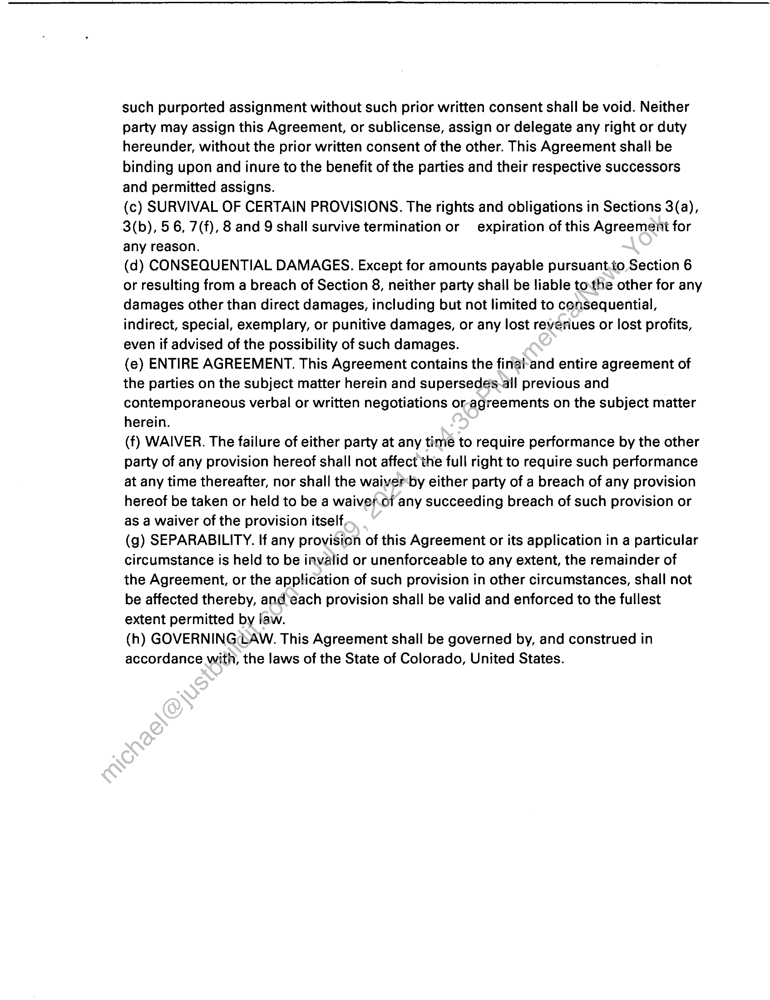
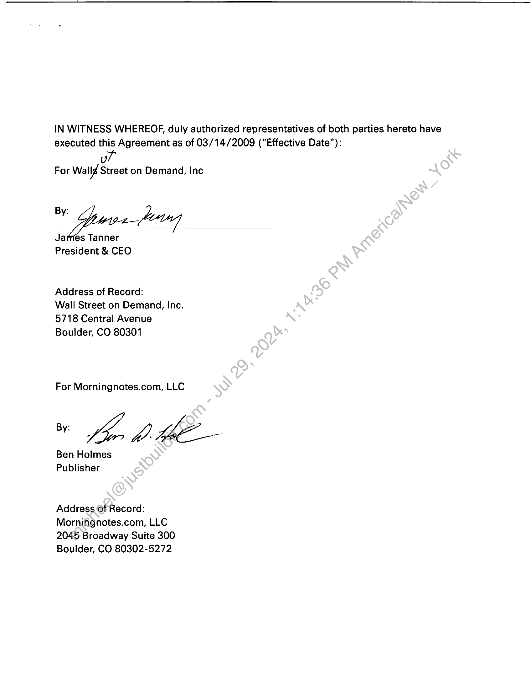

##### CONTENT DISTRIBUTION AGREEMENT]

  
````col
```col-md
flexGrow=.5
===
> [!info] [Page 1](_attachments/images_3.6.4.1.21.1Morningnotes.com_WSODContentDistributionAgreementExecuted20090314.pdf_155439/page_1.png)
> 
```  
```col-md
CONTENT DISTRIBUTION AGREEMENT
THIS CONTENT DISTRIBUTION AGREEMENT is entered into by  
Morningnotes.com, LLC, a Louisiana Limited Liability Corporation ("Morningnotes") having
their principal corporate offices at 2045 Broadway, Boulder, CO 80302  
and  
Wall Street on Demand, Inc, a Delaware Corporation ("WSOD"), having their principal
corporate offices at 5718 Central Avenue, Boulder, CO 80301  
Wall Street on Demand is a provider of design, development and hosting/solutions for
custom websites, reports and analytic tools for the financial services.industry. WSOD wants
to obtain from Morningnotes the right to receive the content defitied in Exhibit B (the
"Morningnotes Content") via the delivery methods defined in:Exhibit C (the "Delivery
Methods") and make available the Morningnotes Contentto‘its customer, UBS Securities, for
display to UBS users who have access to a certain restricted area within the UBS website  
http://www.ubs.com (the “UBS Web Services”), allorthe terms and conditions set forth
below.  
1. GRANT OF RIGHTS; RESTRICTIONS.  
(a) ACCESS TO MORNINGNOTES CONTENT.  
Morningnotes hereby grants to WSOD, subject to the terms and conditions contained
in this Agreement, a limited, non-exclusive, nontransferable right to: (i) receive via
the Delivery Methods the Morningnotes Content; (ii) store the most recent
transmission of the Morningnotes Content on host computers owned and operated by
WSOD/UBS locaiéd within the United States (the "WSOD/UBS Host Computers");
and (iii) distribute and display the Morningnotes Content solely to "Registered Users"
(as defined iri Section I(b) (i)), solely by means of the UBS Web Services and solely
by meanéof the distribution methods defined in Exhibit A (ii) (the "Authorized
Distribution Methods"). No provision of this Agreement shall be deemed to restrict or
limit Morningnotes’ right to market, sell, distribute, display or otherwise provide
access to the Morningnotes Content directly or indirectly anywhere in the world, or
enter into contracts, grant licenses or make arrangements with any other party to
market, sell, distribute, display or otherwise provide access to the Morningnotes
Content anywhere in the world. WSOD shall not sub license or otherwise transfer or
assign any right granted in Section | (a) to any other person or entity.  
(b) REGISTERED USERS.  
(i)"Registered User" shall mean an individual who (a) becomes legally bound by the  
```
````
Notes:    
````col
```col-md
flexGrow=.5
===
> [!info] [Page 2](_attachments/images_3.6.4.1.21.1Morningnotes.com_WSODContentDistributionAgreementExecuted20090314.pdf_155439/page_2.png)
> 
```  
```col-md
UBS online member agreement and (b) has access via the Restricted Area of the UBS
Web Services to any portion of the Morningnotes Content. (ii) UBS shall cause each
Registered User to be legally bound by its online member agreement. (iii) The UBS
Web Services shall not make available the Morningnotes Content in any "public" or
"free" area, or area accessible without a password, on the World Wide Web.  
(c) ADDITIONAL LICENSE RESTRICTIONS.  
(i) WSOD shall not distribute the Morningnotes Content to any third party other than
a Registered User or distribute the Morningnotes Content through anymeans other
than through the Restricted Area of the UBS Web Services and the Authorized
Distribution methods without Morningnotes prior written consent’ WSOD shall not
make the Morningnotes Content available through third parties by incorporating or
"bundling" the UBS Web Services as one information source or service of many
available through third-party front-end software or a third-party, electronic
information service or Internet site without Morningnotes prior written consent. The
UBS Web Services shall not allow Registered Users to access the Morningnotes
Content via any interactive online or electronic information service other than the UBS
Web Services. The UBS Web Services shall not function to allow or authorize making
any of the Morningnotes Content available:(a) as part of a "co-branded" or "private
label" web site, web service, or Internet ‘access service, or as part of a "channel"
through a software or Internet service. or similar arrangements or relationships that
offer or provide access to Morningnotes Content from or through other web sites,
web services, or Internet access services; or (b) as part of the UBS Web Services
when "framed" and displayed as part of another web site or web service. (ii) The UBS
Web Services shall not‘allow the Morningnotes Content to be indexed by Web search
engines or any search engine that is external to or not integrated into the UBS Web
Services. (iii) WSOD shall not grant any site or enterprise licenses to receive access
to Morningnotés Content, without prior written consent from Morningnotes. All rights
not expressly granted to WSOD herein shall be retained by Morningnotes.  
DELIVERY OF MORNINGNOTES CONTENT.  
(a) DELIVERY AND INSTALLATION. WSOD shall acquire, install, operate and
maintain at its expense all communications lines, equipment, software, services and
related technology necessary to receive the Morningnotes Content via the Delivery
Method. WSOD also shal! be responsible for, and shall pay for, any development
work, software or hardware relating to the setup and integration of the Morningnotes
Content as part of the UBS Web Services.  
(b) LIMITATIONS ON USE. Except as specifically provided herein, WSOD shall not
use, store, manipulate, distribute or otherwise make available, and shall use
reasonable commercial efforts to cause each third party who obtains access to the
Morningnotes Content through WSOD services provided to UBS (including, without  
```
````
Notes:    
````col
```col-md
flexGrow=.5
===
> [!info] [Page 3](_attachments/images_3.6.4.1.21.1Morningnotes.com_WSODContentDistributionAgreementExecuted20090314.pdf_155439/page_3.png)
> 
```  
```col-md
limitation, any Registered User) notto use, store, manipulate, distribute or otherwise
make available, any Morningnotes Content without the prior written consent of
Morningnotes. WSOD shall not, and shall use reasonable commercial efforts not to
permit any other party to, edit, alter or otherwise change in any manner the content, f
ormat or presentation of the Morningnotes Content, including, without limitation, all
copyright and proprietary rights notices.  
(c) QUALITY OF TRANSMISSIONS. WSOD shall use commercially reasonable:efforts
to ensure that each transmission of Morningnotes Content (i) is of high quality, (ii)
contains an accurate and complete copy of the Morningnotes Content which WSOD
has been licensed to distribute, and (iii) is free from errors or defects‘caused by
WSOD.  
(d) TECHNICAL ISSUES RESOLUTIONS AND COMMUNICATIONS.
Morningnotes.com shall use its best efforts to ensure that technical issues and errors
are resolved as quickly and efficiently as possible. Where atv issue is identified,
Morningnotes technical staff will communicate direct!ywith staff at WSOD to address
those issues.  
. PROPRIETARY RIGHTS.  
(a) OWNERSHIP; COPYRIGHT. WSOD acknowledges and agrees that all  
ownership and proprietary rights (including, without limitation, the copyrights) to the
Morningnotes Content are and shall remain the sole and exclusive property of
Morningnotes or its licensors.  
(b) TRADEMARKS. WSOD acknowledges and agrees that Morningnotes or its
licensors are the sole owners of the trademarks and service marks ("marks") used in
connection with the Morningnotes Content and that nothing contained in this
Agreement grants WSOD any right to use any Morningnotes Mark, logo or trade
name, except as expressly provided in this Agreement.  
(c ) INFRINGEMENT. WSOD shall promptly advise Morningnotes of any possible
infringement of which WSOD becomes aware of Morningnotes' Marks, copyrights,
trade secrets or other proprietary rights, or any use of the Morningnotes Content in
violation of this Agreement.  
«PAYMENTS.  
(a) CALCULATION OF PAYMENTS. Beginning on the Effective Date, WSOD shall  
pay to Morningnotes the payments ("Payments") defined in Exhibit E.  
(b) PAYMENT. WSOD will provide payment within 30 days from the date of  
invoice.  
(c) TAXES. WSOD shall pay any taxes, fees and similar governmental charges related
to the execution or performance of this Agreement, other than applicable income
taxes imposed on Morningnotes related to its receipt of Payments.  
(d) CURRENCY. All amounts are stated in U.S. Dollars and shall be paid in U.S.  
```
````
Notes:    
````col
```col-md
flexGrow=.5
===
> [!info] [Page 4](_attachments/images_3.6.4.1.21.1Morningnotes.com_WSODContentDistributionAgreementExecuted20090314.pdf_155439/page_4.png)
> 
```  
```col-md
currency.
INDEMNIFICATION.  
(a) BY MORNINGNOTES. Morningnotes shall indemnify and hold harmless WSOD
against all liabilities, costs and expenses (including reasonable attorneys’ fees)
incurred by WSOD that arise out of any claim asserted by a third party that the
Morningnotes Content infringes any patent, trade secret, copyright or other
intellectual property rights of any third party, or any breach by Morningnotes of this
Agreement, provided that WSOD, upon receipt of notice of a claim that/could result
in Morningnotes indemnifying WSOD pursuant to this subsection, gives prompt
written notice to Morningnotes of the existence of such claim ana-permits
Morningnotes, if it so requests, either to conduct the defense-of such claim or to
participate with WSOD in the defense thereof and in any seitiement negotiations
relating thereto; provided, however, that Morningnotes:shall not be required to pay
any settlement amount that it has not approved in advance.  
(b) BY WSOD. WSOD shall indemnify and hold harmless Morningnotes against all
liabilities, costs and expenses (including reasonable attorneys’ fees) incurred by
Morningnotes that arise out of any claim asserted by a third party that involves, relates
to or concerns (i) any use by WSOD of any Morningnotes Content in violation of this
Agreement; provided that Morningnotes, upon receipt of notice of a claim that could
result in WSOD indemnifying Morningnotes pursuant to this subsection, gives prompt
written notice to WSOD of the existence of such claim and permits WSOD, if it so
requests, either to conductthe defense of such claim or to participate with
Morningnotes in the defense thereof and in any settlement negotiations relating
thereto; provided however, that WSOD shall not be required to pay any settlement
amount that it has not approved in advance.  
DISCLAIMER. MORNINGNOTES PROVIDES THE MORNINGNOTES CONTENT "AS IS",
WITHOUT ANY)EXPRESS OR IMPLIED WARRANTIES. FOR EXAMPLE,
MORNINGNOTES DOES NOT WARRANT THE ACCURACY, TIMELINESS,
COMPLETENESS, ADEQUACY, MERCHANTABILITY OR FITNESS FORA
PARTICULAR PURPOSE OF THE MORNINGNOTES CONTENT, AND MORNINGNOTES
SHALL NOT BE LIABLE TO WSOD OR TO ANY THIRD PARTY WITH RESPECT TO
ANY ACTUAL OR ALLEGED INACCURACY, UNTIMELINESS, INCOMPLETENESS,
INADEQUACY, UNMERCHANTABILITY OR UNFITNESS. WSOD SHALL NOT MAKE
ANY STATEMENT RESPECTING THE MORNINGNOTES CONTENT THAT IS
CONTRADICTORY TO OR INCONSISTENT WITH THE FOREGOING STATEMENTS.  
TERM AND TERMINATION.
(a) TERM. The term of this Agreement shall commence on the Effective Date (defined  
on last page of this Agreement) and shall terminate on the first anniversary of
the Effective Date. Unless either party delivers to the other written notice of non-  
```
````
Notes:    
````col
```col-md
flexGrow=.5
===
> [!info] [Page 5](_attachments/images_3.6.4.1.21.1Morningnotes.com_WSODContentDistributionAgreementExecuted20090314.pdf_155439/page_5.png)
> 
```  
```col-md
renewal at least 30 days prior to the end of the then-current term or renewal term, this
Agreement shall automatically be extended for additional one year terms.
Notwithstanding the foregoing, this agreement shall terminate automatically upon the
termination of the UBS Web Services provided by WSOD.  
(b) UNCURED BREACH. If either party shall breach any provision contained in this
Agreement (other than a breach of Section 8, which shall be deemed incurable)  
and such breach is not cured within 30 days after receiving written notice of such
breach from the other party, the party giving such notice may then deliver a-second
written notice to the breaching party, terminating, this Agreement, in which event this
Agreement, and the licenses granted hereunder, shall terminate on the date specified
in such second notice.  
(d) INSOLVENCY. In the event that either party, shall be adjudged insolvent or
bankrupt, or upon the institution of any proceedings by it seeking relief,
reorganization or arrangement under any laws relating‘to insolvency, or if an
involuntary petition in bankruptcy is filed against such party and said petition is not
discharged within 60 days after such filing, or upon any assignment for the benefit of
its creditors, or upon the appointment of a receiver, liquidator or trustee of any of its
assets, or upon the liquidation, dissolution or winding up of its business (an "Event of
Bankruptcy"), then the party affected by,any such Event of Bankruptcy shall
immediately Give notice thereof to the.other party, and the other party at its option
may terminate this Agreement, and the licenses granted hereunder, upon written
notice.  
(e) EFFECT OF TERMINATIQN? Upon the expiration or termination of this Agreement
for any reason, WSOD shall (i) immediately inhibit all access to the Morningnotes
Content through the UBS Web Services, (ii) delete any Morningnotes Content then
stored on the WSOD/UBS Host Computers, (iii) cease advertising and promoting the
availability of the Morningnotes Content via the UBS Web Services and (iv)
discontinue all.uses of Morningnotes' trade names or Marks. In addition, upon
expiration ortermination of this Agreement, each party, at its expense, shall promptly
return tothe other all copies of the other party's Confidential Information.  
```
````
Notes:    
````col
```col-md
flexGrow=.5
===
> [!info] [Page 6](_attachments/images_3.6.4.1.21.1Morningnotes.com_WSODContentDistributionAgreementExecuted20090314.pdf_155439/page_6.png)
> 
```  
```col-md
7. CONFIDENTIAL INFORMATION.  
WSOD and Morningnotes understand and agree that in the performance of this
Agreement each party may have access to private or confidential information of the
other party, including, but not limited to, trade secrets, marketing and business plans
and technical information, which is designated as confidential by the disclosing party
in writing, whether by letter or by the use of a proprietary stamp or legend, prior to or
at the time it is disclosed to the other party ("Confidential Information"): Both parties
agree that the terms of this Agreement. including without limitation,its financial terms
such as the Payments and the information contained in reports shall be deemed
Confidential! Information owned by the other party. WSOD acknowledges and agrees
that the technical and functional specifications and the code and design of the XML
Feed and all tools and utilities supplied by Morningnotes to WSOD are Confidential
Information of Morningnotes. Each party agrees that: (i) all Confidential Information
shall remain the exclusive property of the owner; (ii) it shall maintain, and shall use
prudent methods to cause its employees and agents to maintain, the confidentiality
and secrecy of the Confidential Information; (iii) it shall not, and shall use prudent
methods to ensure that its employees and‘agents do not, copy, publish, disclose to
others or use (other than pursuant tothe terms hereof) the Confidential Information:
and (iv) it shall return or destroy all.copies of Confidential Information upon request
of the other party. Notwithstanding the foregoing, Confidential Information shall not
include any information to the-extent it (i) is or becomes a part of the public domain
through no act or omission on the part of the receiving party, (ii) is disclosed to third
parties by, the disclosing party without restriction on such third parties, (iii) is in the
receiving party's possession, without actual or constructive knowledge of an
obligation of confidentiality with respect thereto, at or prior to the time of disclosure
under this Agreement, (iv) is disclosed to the receiving party by a third party having
no obligation of confidentiality with respect thereto, (v) is independently developed
by the receiving party without reference to the disclosing party's Confidential
Information or (vi) is released from confidential treatment by written consent of the
disclosing party.  
8» MISCELLANEOUS.  
(a) NOTICES. All notices shal! be in writing, and delivered by certified mail, return
receipt requested, overnight courier service, or by facsimile with confirmation to the
address set forth on the signature page, or other address stipulated in writing by a
party. Notice shall be deemed delivered and received on the date it is actually
received.  
(b) AMENDMENT, ASSIGNMENT. This Agreement may not be amended except in a
writing executed by authorized representatives of WSOD and Morningnotes. Any  
```
````
Notes:    
````col
```col-md
flexGrow=.5
===
> [!info] [Page 7](_attachments/images_3.6.4.1.21.1Morningnotes.com_WSODContentDistributionAgreementExecuted20090314.pdf_155439/page_7.png)
> 
```  
```col-md
such purported assignment without such prior written consent shall be void. Neither
party may assign this Agreement, or sublicense, assign or delegate any right or duty
hereunder, without the prior written consent of the other. This Agreement shall be
binding upon and inure to the benefit of the parties and their respective successors
and permitted assigns.  
(c) SURVIVAL OF CERTAIN PROVISIONS. The rights and obligations in Sections 3(a),
3(b), 5 6, 7(f), 8 and 9 shall survive termination or expiration of this Agreement for
any reason.  
(d) CONSEQUENTIAL DAMAGES. Except for amounts payable pursuant.to Section 6
or resulting from a breach of Section 8, neither party shall be liable tothe other for any
damages other than direct damages, including but not limited to consequential,
indirect, special, exemplary, or punitive damages, or any lost reveriues or lost profits,
even if advised of the possibility of such damages.  
(e) ENTIRE AGREEMENT. This Agreement contains the final-and entire agreement of
the parties on the subject matter herein and supersedes-all previous and
contemporaneous verbal or written negotiations or-agreements on the subject matter
herein.  
(f) WAIVER. The failure of either party at any time to require performance by the other
party of any provision hereof shall not affect the full right to require such performance
at any time thereafter, nor shall the waiver‘by either party of a breach of any provision
hereof be taken or held to be a waiver.of any succeeding breach of such provision or
as a waiver of the provision itself.  
(g) SEPARABILITY. If any provision of this Agreement or its application in a particular
circumstance is held to be invalid or unenforceable to any extent, the remainder of
the Agreement, or the application of such provision in other circumstances, shall not
be affected thereby, and each provision shall be valid and enforced to the fullest
extent permitted by law.  
(h) GOVERNING AW. This Agreement shall be governed by, and construed in
accordance with, the laws of the State of Colorado, United States.  
```
````
Notes:    
````col
```col-md
flexGrow=.5
===
> [!info] [Page 8](_attachments/images_3.6.4.1.21.1Morningnotes.com_WSODContentDistributionAgreementExecuted20090314.pdf_155439/page_8.png)
> 
```  
```col-md
IN WITNESS WHEREOF, duly authorized representatives of both parties hereto have
executed this Agreement as of 03/14/2009 ("Effective Date"):  
wl
For Wally Street on Demand, Inc  
0 foeee ly
James Tanner  
President & CEO  
Address of Record:  
Wall Street on Demand, Inc.
5718 Central Avenue
Boulder, CO 80301  
For Morningnotes.com, LLC  
"bop dhe  
Ben Holmes
Publisher  
Address 6f Record:
Morningnotes.com, LLC
2045 Broadway Suite 300
Boulder, CO 80302-5272  
```
````
Notes:    
````col
```col-md
flexGrow=.5
===
> [!info] [Page 9](_attachments/images_3.6.4.1.21.1Morningnotes.com_WSODContentDistributionAgreementExecuted20090314.pdf_155439/page_9.png)
> 
```  
```col-md
EXHIBIT A  
DESCRIPTION OF THE UBS WEB SERVICES; AUTHORIZED DISTRIBUTION
METHODS; TERRITORY  
(i) Description of Service:  
The UBS Web Services is a customer-facing electronic information platform delivered
via a Web site owned and operated by UBS at UBS websites. The UBS Web  
Services provides access to news, investment information, research and data to the
brokerage customers of UBS AG. WSOD plans to incorporate the Morningnotes
Content into the UBS Web Services located within a "Restricted Area”. Only
Registered Users will have access to the Restricted Area.  
(ii) Authorized Distribution Methods:  
The UBS Web Services will only make the Morningnotes Content available through
the Restricted Area to Registered Users and solely through the World Wide Web.
(iii) Archive:  
The UBS Web Services shall only make available the most recent transmission of the
Morningnotes Content to Registered Users.  
EXHIBIT B
DESCRIPTION OF THE MORNINGNOTES CONTENT  
The Morningnotes Content corisists of transaction records contained in a queryable
database of underwritten U.S equity offerings. The content is delivered via a
persistent XML feed. THe backend data source is continuously updated with
information throughout the weekday, on an “as available” basis.  
EXHIBIT C
DELIVERY METHODS  
Morningnotes will deliver the Morningnotes Content to WSOD continuously, every
day on an “as available” basis. Delivery will be made via an XML feed pulled by the
client at scheduled intervals.  
EXHIBIT D  
WALL STREET ON DEMAND SERVICES SOFTWARE AND FACILITIES.  
WSOD is a provider of design, development and hosting solutions for custom
websites, reports and analytic tools for the financial services industry. Wall Street on
Demand is acting as the designer, service provider and host to the UBS web pages
which display the Morningnotes content.  
```
````
Notes:    
````col
```col-md
flexGrow=.5
===
> [!info] [Page 10](_attachments/images_3.6.4.1.21.1Morningnotes.com_WSODContentDistributionAgreementExecuted20090314.pdf_155439/page_10.png)
> 
```  
```col-md
EXHIBIT E
PAYMENTS
WSOD will pay to Morningnotes a monthly license fee equal to US$2,500.00.
Payments will be made versus quarterly invoices submitted by Morningnotes to  
WSOD.  
<<End of file>>  
```
````
Notes:  


![[_attachments/3.6.4.1.21.1 Morningnotes.com_WSOD Content Distribution Agreement Executed 20090314.pdf]