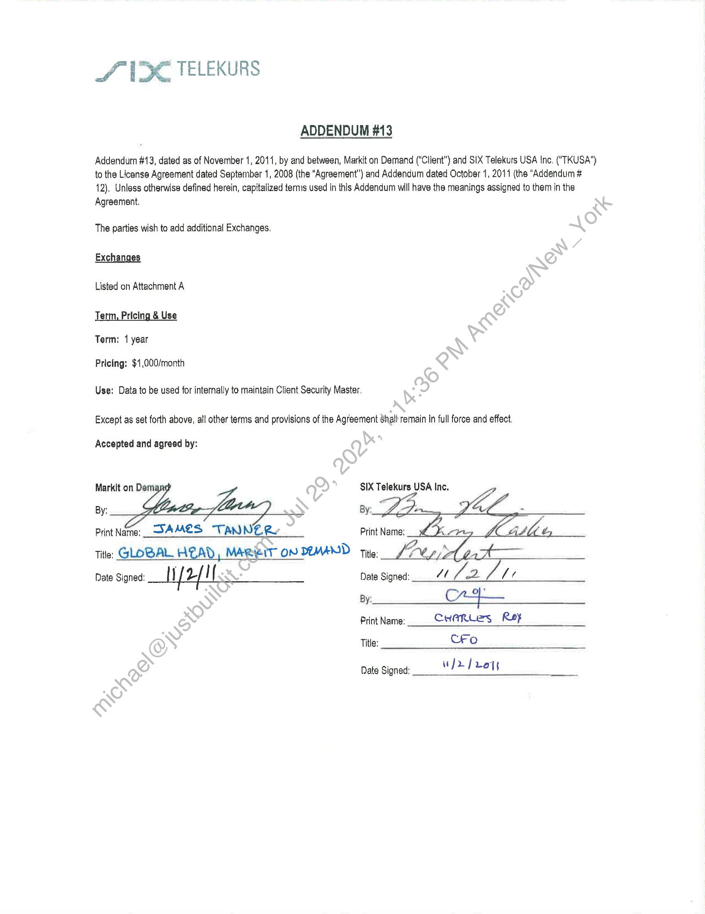

##### Addendum #13 to License Agreement]

  
````col
```col-md
flexGrow=.5
===
> [!info] [Page 1](_attachments/images_3.6.4.1.22.1SIX_MODVDFAddend_13_Executed20111102.pdf_155230/page_1.png)
> 
```  
```col-md
S13 TELEKURS  
ADDENDUM #13
Addendum #13, dated as of November 1, 2011, by and between, Markit on Demand (“Client”) and SIX Telekurs USA Ine, ("TKUSA")
to the License Agreement dated September 1, 2008 (the “Agreement”) and Addendum dated October 1, 2011 (the “Addendum #
12), Unless otherwise defined herein, capitalized terms used in this Addendum will have the meanings assigned to them in the
Agraement.
The parties wish to add additional Exchanges.  
Exchanges  
Listed on Attachment A  
erm, Pricing & Use
Term: 1 year  
Pricing: $1,000/month  
Use: Data to be used for internally to maintain Client Security Master.  
Except as set forth above, all other terms and provisions of the Agreement Shalt remain in full force and effect.  
Accepted and agreed by:  
Markit on Dem SIX Telekurs USA Inc.
By: By:  
PrintName:_ AMES TANNER Print Name:  
Title: GLOBAL HEAD, MAR EIT ON DEMAND tits LA  
Date Signed: Wf 2 if Date Signed: pa
By: Ce  
Print Name: Ceranles Roy
Title: Cro  
Date Signed: fr fro  
```
````
Notes:    
````col
```col-md
flexGrow=.5
===
> [!info] [Page 2](_attachments/images_3.6.4.1.22.1SIX_MODVDFAddend_13_Executed20111102.pdf_155230/page_2.png)
> 
```  
```col-md
SVC TELEKURS  
Attachment A  
Country® Exchange Namo E  
He
tock Exchange 103
GreTai Securities Market  
Duhal, Ublted Arab Emirates  
1, Dubal Financial Market 517
Deutsche Boerse AG, OTC Trades EUR 738
Deutsche Boerse AG, OTC Trades FXR 739
Tokyo;vapan ?
The Nikkei indices 3127
Zurich, Switzerland 3  
SIX Swiss Exchange 4  
xchange Name’  
TMX Group |nic, Toronto Stock Exchange  
BerlinyGarmany  
Paris” France
NYSE Euronext Cash Markets and Indices
Sandown, Saulh Alica  
JSE Johannesburg Stock Exchange  
|_ Shenzhen Stock Exchange  
Mercato Continuo Italiano  
RTS Global Standard Market RUB  
BC  
```
````
Notes:  


![[_attachments/3.6.4.1.22.1 SIX_MOD VDF Addend _13_Executed 20111102.pdf]