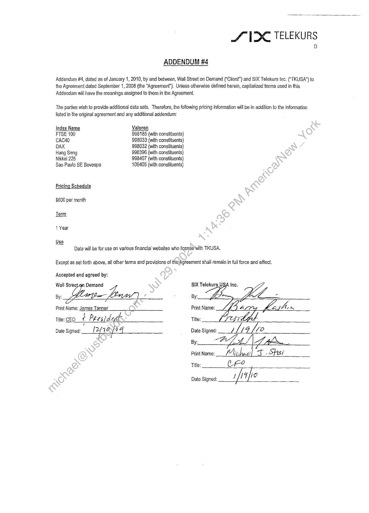

##### Addendum #4 to Agreement between Wall Street on Demand and SIX Telekurs Inc.]

  
````col
```col-md
flexGrow=.5
===
> [!info] [Page 1](_attachments/images_3.6.4.1.22.10SIX_MODMDFAddend_4_Exdecuted20100119.pdf_155156/page_1.png)
> 
```  
```col-md
S UDC TELEKURS  
ADDENDUM #4  
Addendum #4, dated as of January 1, 2010, by and between, Wall Street on Demand ("Client") and SIX Telekurs Inc. ("TKUSA”) to
the Agreement dated September 1, 2008 (the “Agreement”). Unless otherwise defined herein, capitalized terms used in this
Addendum will have the meanings assigned to them in the Agreement.  
The parties wish to provide additional data sets. Therefore, the following pricing information will be in addition to the information
listed in the original agreement and any additional addendum:  
Index Name Valoren  
FTSE 100 998185 (with constituents)
CAC40 998033 (with constituents)
DAX 998032 (with constituents)
Hang Seng 998396 (with constituents)
Nikkei 225 998407 (with constituents)
Sao Paulo SE Bovespa 409405 (with constituents)  
Pricing Schedule  
$600 per month
Term  
1 Year  
Uso  
Data will be for use on various financial websites who license’ with TKUSA.  
Except as set forth above, all other terms and provisions of the Agreement shall remain in full force and effect.  
Accepted and agreed by:  
Wall Stree-an Demand Bun SIX Telekurs U
By: a= . By“ WZ  
Print Name: James Tanner Print Name:  
t
tite: co ¢ Peesident Title:
Date Signed: Pfag [04 Date Signed: [14 [10  
By:  
Print Name:  
Title:  
Date Signed: if aio  
```
````
Notes:  


![[_attachments/3.6.4.1.22.10 SIX_MOD MDF Addend _4_Exdecuted 20100119.pdf]