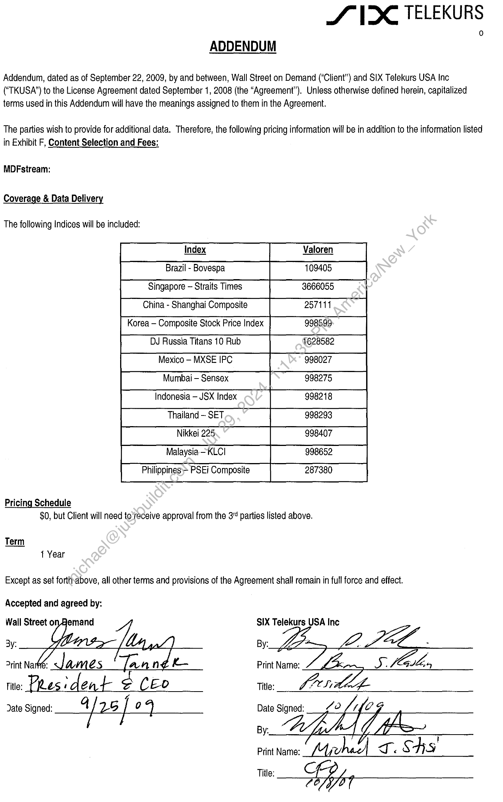

##### Addendum to License Agreement between Wall Street on Demand and SIX Telekurs USA Inc.]

  
````col
```col-md
flexGrow=.5
===
> [!info] [Page 1](_attachments/images_3.6.4.1.22.11SIX_MODMDFAddend_2_Executed20091008.pdf_155252/page_1.png)
> 
```  
```col-md
SVX TELEKURS  
ADDENDUM  
Addendum, dated as of September 22, 2009, by and between, Wall Street on Demand (“Client”) and SIX Telekurs USA Inc
(‘TKUSA’) to the License Agreement dated September 1, 2008 (the “Agreement”). Unless otherwise defined herein, capitalized
terms used in this Addendum will have the meanings assigned to them in the Agreement.  
The parties wish to provide for additional data. Therefore, the following pricing information will be in addition to the information listed  
in Exhibit F, Content Selection and Fees:  
MDFstream:  
Coverage & Data Delivery  
The following Indices will be included:  
Pricing Schedule  
$0, but Client will need to'receive approval from the 3 parties listed above.  
Term
1 Year  
Except as set forttnabove, all other terms and provisions of the Agreement shall remain in full force and effect.  
Accepted and agreed by:  
SIX Telekurs USA Inc
By:  
i Ta
Title: Pres ‘ d eat e CEo Title:  
G
Date Signed: Gi} Z5 | Q )  
By.  
Print Name: hae) I. & HS  
Title: Shope  
```
````
Notes:  


![[_attachments/3.6.4.1.22.11 SIX_MOD MDF Addend _2_Executed 20091008.pdf]