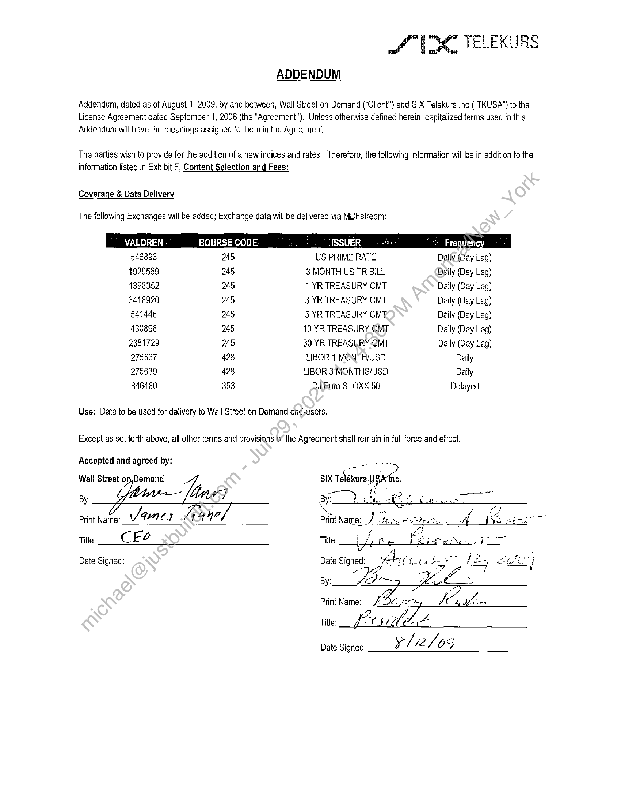

##### Addendum to License Agreement]

  
````col
```col-md
flexGrow=.5
===
> [!info] [Page 1](_attachments/images_3.6.4.1.22.2SIX_MODMDFAddend_1_Executed20090812.pdf_155321/page_1.png)
> 
```  
```col-md
S (DC TELEKURS  
ADDENDUM  
Addendum, dated as of August 1, 2009, by and between, Wall Street on Demand (“Client”) and SIX Telekurs Inc ("TKUSA”) to the
License Agreement dated September 1, 2008 (the “Agreement”), Unless otherwise defined herein, capitalized terms used in this
Addendum will have the meanings assigned te them in the Agreement.  
The parties wish to provide for the addition of a new indices and rates. Therefore, the following information will be in addition to the
information listed in Exhibit F, Content Selection and Fees:  
Coverage & Data Delivery  
The following Exchanges will be added; Exchange data will be delivered via MDFstream:  
VALOREN BOURSE CODE ISSUER Frequene'
546893 245 US PRIME RATE Daily (Day Lag)
1929569 245 3 MONTH US TR BILL Daily (Day Lag)
1398352 245 1 YR TREASURY CMT Daily (Day Lag)
3418920 245 3 YR TREASURY CMT Daily (Day Lag)
541446 245 5 YR TREASURY CMT, Daily (Day Lag)
430896 245 10 YR TREASURY CMT Daily (Day Lag)
2381729 245 30 YR TREASURY CMT Daily (Day Lag)
278637 428 LIBOR 1 MONTH/USD Daily
275839 428 LIBOR 3 MONTHS/USD Daily
846480 353 DJ Euro STOXX 50 Delayed  
Use: Data to be used for delivery to Wall Street on Demand end-users.  
Except as set forth above, all other terms and provisions of the Agreement shall remain in full force and effect.  
Accepted and agreed by:
Wall Street on,Demand SIX aurayts
es 6. Chee
Print Name: James oo erlit ‘Name: I Jen. ne ee - ad KE a
Title: CE. o Title: is Ce Spex Seow TO
Date Signed: Date A he ae ie a / Bot Paae ij  
By:
Print Name: Ba on Ke Title: _f2 as) se Oe  
Date Signed: le S05  
```
````
Notes:  


![[_attachments/3.6.4.1.22.2 SIX_MOD MDF Addend _1_Executed 20090812.pdf]