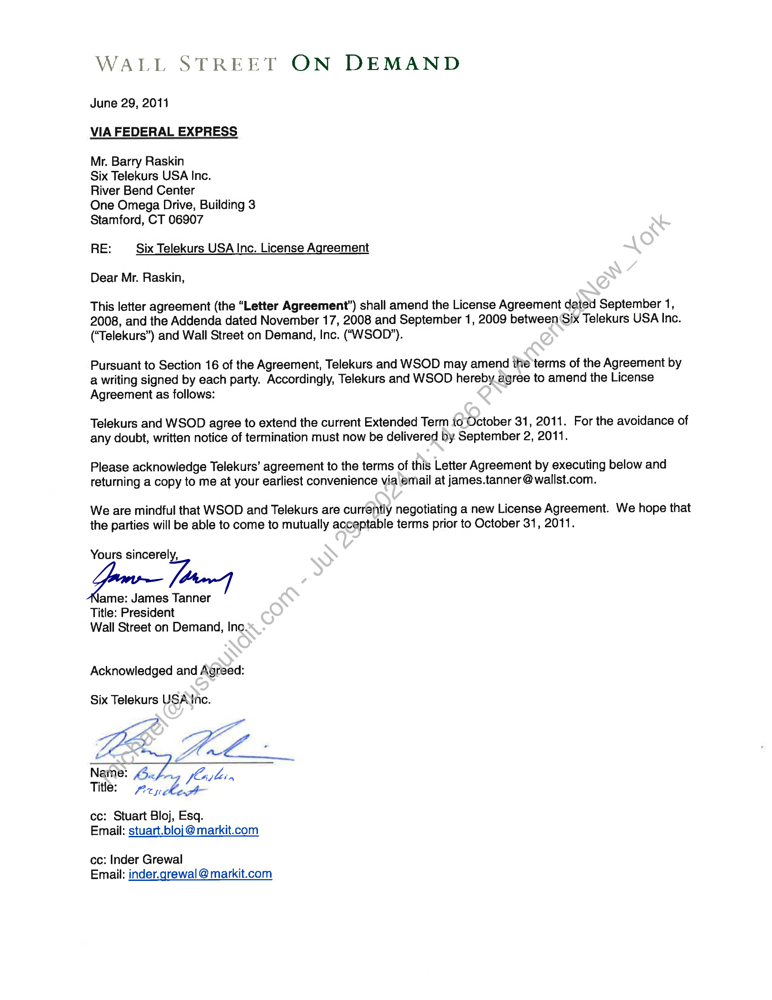

##### Letter Agreement Amending License Agreement between Wall Street on Demand, Inc. and Six Telekurs USA Inc.]

  
````col
```col-md
flexGrow=.5
===
> [!info] [Page 1](_attachments/images_3.6.4.1.22.3SIX_MODVDFExtensionLtr_Executed20110629.pdf_155504/page_1.png)
> 
```  
```col-md
WALL STREET ON DEMAND  
June 29, 2011
VIA FEDERAL EXPRESS  
Mr. Barry Raskin  
Six Telekurs USA Inc.  
River Bend Center  
One Omega Drive, Building 3
Stamford, CT 06907  
RE: Six Telekurs USA Inc. License Agreement  
Dear Mr. Raskin,  
This letter agreement (the “Letter Agreement’) shall amend the License Agreement dated September 1,
2008, and the Addenda dated November 17, 2008 and September 1, 2009 between (Six Telekurs USA Inc.
(‘Telekurs”) and Wall Street on Demand, Inc. (“WSOD").  
Pursuant to Section 16 of the Agreement, Telekurs and WSOD may amend ihe'terms of the Agreement by
a writing signed by each party. Accordingly, Telekurs and WSOD hereby agree to amend the License
Agreement as follows:  
Telekurs and WSOD agree to extend the current Extended Term io October 31, 2011. For the avoidance of
any doubt, written notice of termination must now be delivered by September 2, 2011.  
Please acknowledge Telekurs’ agreement to the terms of this Letter Agreement by executing below and
returning a copy to me at your earliest convenience via email at james.tanner @wallst.com.  
We are mindful that WSOD and Telekurs are currently negotiating a new License Agreement. We hope that
the parties will be able to come to mutually acceptable terms prior to October 31, 2011.  
Yours sincerely,
lame: James Tanner
Title: President
Wall Street on Demand, Inc.
Acknowledged and Agreed:  
Six Telekurs USA‘inc.  
LEE GEE  
Name: <4. b jlo
Title: zy, Ab 1  
cc: Stuart Bloj, Esq.
Email: stuart.bloj @ markit.com  
cc: Inder Grewal
Email: inder.grewal @ markit.com  
```
````
Notes:  


![[_attachments/3.6.4.1.22.3 SIX_MOD VDF Extension Ltr_Executed 20110629.pdf]