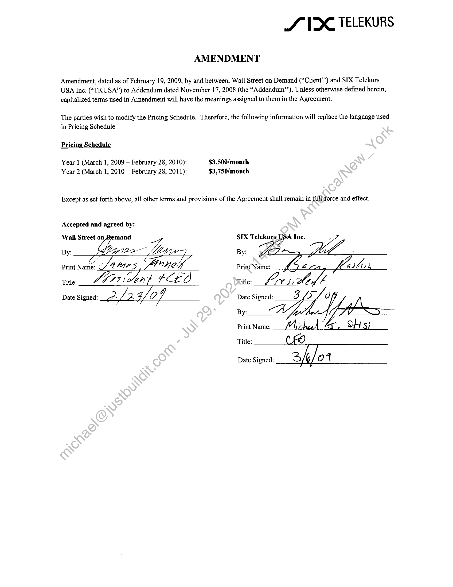

##### Amendment to Addendum to Agreement between Wall Street on Demand and SIX Telekurs USA Inc.]

  
````col
```col-md
flexGrow=.5
===
> [!info] [Page 1](_attachments/images_3.6.4.1.22.4SIX_MODVDFAmendment_Executed20090219.pdf_155142/page_1.png)
> 
```  
```col-md
SVX TELEKURS  
AMENDMENT  
Amendment, dated as of February 19, 2009, by and between, Wall Street on Demand (‘Client’’) and SIX Telekurs
USA Inc. (“TKUSA”) to Addendum dated November 17, 2008 (the “Addendum’’). Unless otherwise defined herein,
capitalized terms used in Amendment will have the meanings assigned to them in the Agreement.  
The parties wish to modify the Pricing Schedule. Therefore, the following information will replace the language used
in Pricing Schedule  
Pricing Schedule  
Year 1 (March 1, 2009 — February 28, 2010): $3,500/month
Year 2 (March 1, 2010 — February 28, 2011): $3,750/month  
Except as set forth above, all other terms and provisions of the Agreement shall remain in full force and effect.  
Accepted and agreed by:
Wall Street on SIX Telekurs USA Inc.  
Print Name: Lene  
BE,
Title: WZ, 4CE0 Title: Lociidled 7  
Date Signed: 2SL2 4. of Date Signed:  
By:  
Lata  
Print Name:  
Oi ko. Shs;
Title:  
Date Signed: “ah / 4  
```
````
Notes:  


![[_attachments/3.6.4.1.22.4 SIX_MOD VDF Amendment_Executed 20090219.pdf]