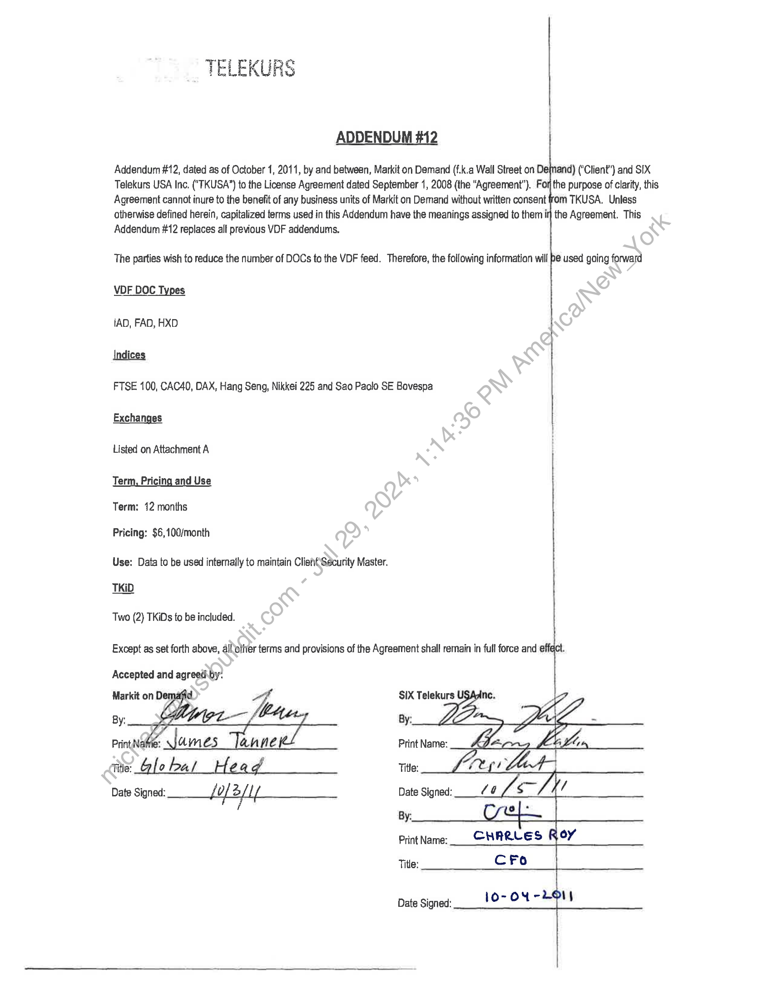
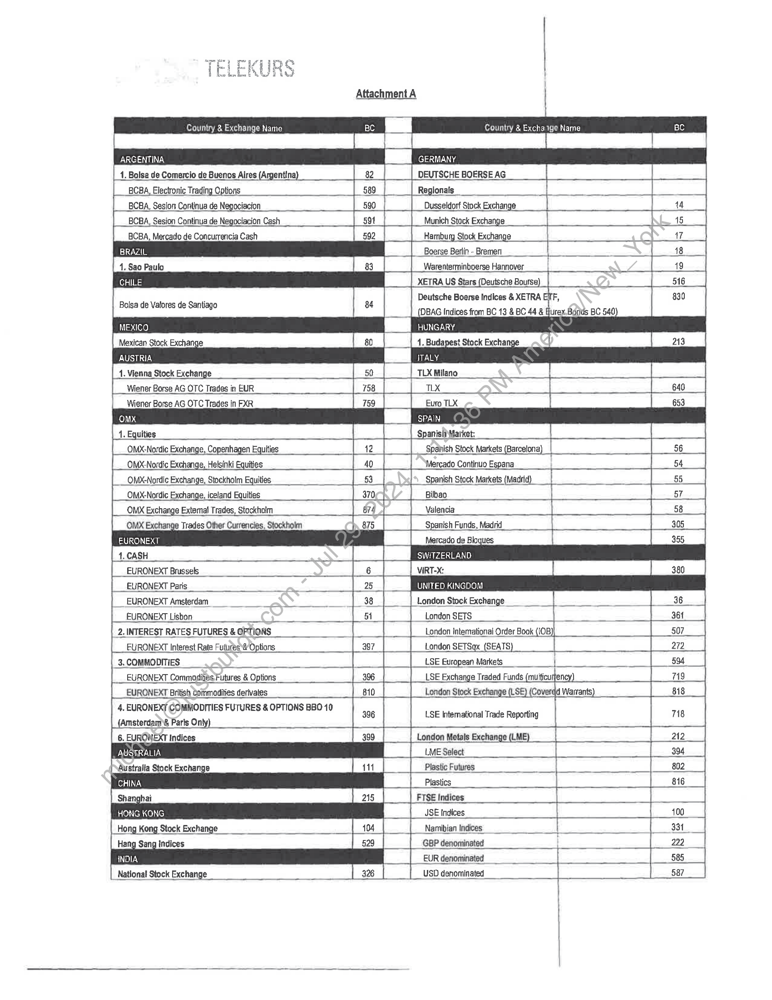
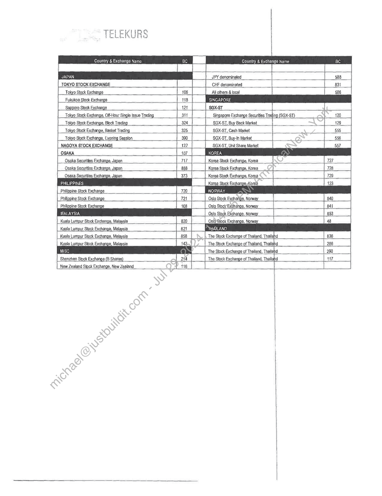

##### TELEKURS Addendum #12 to License Agreement]

  
````col
```col-md
flexGrow=.5
===
> [!info] [Page 1](_attachments/images_3.6.4.1.22.6SIX_MODVDFAddend_2_Executed20111001.pdf_155153/page_1.png)
> 
```  
```col-md
TELEKURS  
ADDENDUM #12
Addendum #12, dated as of October 1, 2011, by and between, Markit on Demand (f.k.a Wall Street on De{nand) (‘Client’) and SIX
Telekurs USA Inc. ("TKUSA”) to the License Agreement dated September 1, 2008 (the Agreement”). For the purpose of clarity, this
Agreement cannot inure to the benefit of any business units of Markit on Demand without written consent fom TKUSA. Unless
otherwise defined herein, capitalized terms used in this Addendum have the meanings assigned to them ir] the Agreement. This
Addendum #12 replaces all previous VDF addendums.  
The parties wish to reduce the number of DOCs to the VDF feed. Therefore, the following information will be used going forward
VDF DOC Types  
(AD, FAD, HXD  
Indices  
FTSE 100, CAC40, DAX, Hang Seng, Nikkei 225 and Sao Paolo SE Bovespa  
Exchanges
Listed on Attachment A
Term, Pricing and Use  
Term: 12 months  
Pricing: $6,100/month  
Use: Data to be used internally to maintain ClisntSecurity Master.
TKID  
Two (2) TKiDs to be included.  
Except as set forth above, allottier terms and provisions of the Agreement shall remain in full force and “T  
Accepted and agreedi.by.  
Print Name:  
. Title:
Date Signed: fol 2 / lf Date Signed:
By:  
Print Name:  
Title:  
Date Signed:  
```
````
Notes:    
````col
```col-md
flexGrow=.5
===
> [!info] [Page 2](_attachments/images_3.6.4.1.22.6SIX_MODVDFAddend_2_Executed20111001.pdf_155153/page_2.png)
> 
```  
```col-md
Country & Exchange Name  
ARGENTINA
1. Bolsa de Comercio de Buenos Aires (Argentina) 82  
MEXICO.
Mexican Stock Exchange
AUSTRIA  
HUNGARY  
ITALY
TLX Milano  
‘Budapest Stock Exchange)  
BCBA, Electronic Trading Options | Regionals ___ i
BCBA, Sesion Continua de Negociacion Dusseldorf Stock Exchange _ | _ 44
|___BCBA, Sesion Continua de Negociacion Cash Munich Stock Exchange 4 15  
BCBA, Mercado de Concurrencia Cash Hamburg Stock Exchange 17}
BRAZIL Boerse Berlin - Bremen | 18  
1. Sao Paulo Warenterminboerse Hannover | 19  
CHILE XETRA US Stars (Deutsche Bourse) _ iz _t 516 +
Bolsa de Valores de Santiago Deutsche Boerse Indices & XETRA ENF, 830  
(DBAG Indices from BC 13 & BC 44 & flurex Bonds BC 540)  
[4 Vienna Stock Exchange
Wiener Borse AG OTC Trades in EUR  
758  
TLX  
Wiener Borse AG OTC Trades in FXR  
Euro TLX  
SpanisinMarket:  
41. Equities a  
OMX-Nordic Exchange, Copenhagen Equities | 42 Spanish Stock Markets (Barcelona) |__ 56.
OMX-Nordic Exchange, Helsinki Equities AO + __| “Mercado Continuo Espana | 54  
|__ OMX-Nordic Exchange, Stockholm Equities | 53 Xt Spanish Stock Markets (Madrid) _ 55  
OMX-Nordic Exchange, iceland Equities 370, a Bilbao 57  
OMX Exchange Extemal Trades, Stockholm 674 Valencia 58  
OMX Exchange Trades Other Currencies. Stockholm 875 Spanish Funds, Madrid _| 305  
Mercado de Bloques
1. CASH  
EURONEXT Brussels 6 VIRT-X: 380
EURONEXT Pari sare | wre KNcood  
_EURONEXT Amsterdam we _ 38 London Stock Exchange _ 36  
EURONEXT Lisbon | 54 London SETS = = 361  
_2. INTEREST RATES FUTURES & OPTIONS _ | London Intemational Order Book ((0B)) 507
EURONEXT Interest Rate Fuiures\ Options | 397 London SETSqx_ (SEATS) 272!  
3. COMMODITIES ' LSE European Markets | 594
EURONEXT Commodities Futures & Options 396 ‘| LSE Exchange Traded Funds (mutticurfency) 719 _}  
EURONEXT British Commodities derivates [se |__ London Stock Exchange (LSE) (Co' Warrants) _ 818  
4, EURONEXT COMMODITIES FUTURES & OPTIONS BBO 10 396 LSE Intemational Trade Reporting 716  
|_{Amsterdarm& Paris Only) = | |  
6. EURONEXT Indices 399 | London Motals Exchange (LME) + 212  
AUSTRALIA LME Select in 394  
Australia Stock Exchange Plastic Futures 802  
CHINA Plastics 816  
FISE Indices i  
HONG KONG JSE Indices ai 100  
Hong Kong Stock Exchange Namibian Indices 331  
Hang Sang indices | GBP denominated 222  
EUR denominated 585  
National Stock Exchange USD denominated 587  
```
````
Notes:    
````col
```col-md
flexGrow=.5
===
> [!info] [Page 3](_attachments/images_3.6.4.1.22.6SIX_MODVDFAddend_2_Executed20111001.pdf_155153/page_3.png)
> 
```  
```col-md
Country & Exchange Name  
TOKYO STOCK EXCHANGE  
Country & Exchange Name  
JPY denominated  
CHF denominated  
Tokyo Stock Exchange 106 Allathers & local  
Fukukoa Stock Exchange 118  
Sapporo Stock Exchange | tat | SGX-ST  
Tokyo Stock Exchange, Off-Hour Single Issue Trading 3it Singapore Exchange Securities Traqing (SGX-ST)_  
Tokyo Stock Exchange, Evening Session  
SGX.ST, Buy-In Market lo  
Tokyo Stack Exchange, Block Trading |_ 324 SGX-ST. Buy Back Market a 129
Tokyo Stock Exchange, Basket Trading _ 325 |__SGX-ST, Cash Market 555
390 556  
Osaka Securities Exchange, Japan_  
NAGOYA STOCK EXCHANGE 122 SGX-ST. Unit Share Market
OSAKA 107_|
Osaka Securities Exchange. Japan 7i7_| Karea Stock Exchange. Korea  
888  
Korea Stock Exchange, Korea  
Osaka Securities Exchange. Japan
PHILIPPINES  
373  
Korea Stock Exchange, Kora  
Korea Stock Exchange sKorea
NORWAY  
Philippine Stock Exchange
Philippine Stock Exchange  
721  
Oslo Stock Excharige. Nonway_  
Philippine Stock Exchange  
Kuala Lumpur Stock Exchange, Malaysia  
103  
OsioStock Exchange, No!  
Kuala Lumpur Stock Exchange, Malaysia 821
858 The Stock Exchange of Thailand, Thailand  
Oslo StockExchange, No! | 841
Oslo Stock Exchange. Norway_ 853  
4g  
| Kuala Lumpur Stock Exchange, Malaysia
Kuala Lumpur Stock Exchange, Malaysia  
Shenzhen Stack Exchange (B Shares)  
The Stock Exchange of Thailand, Thailahd 286
The Stock Exchange of Thailand, Thailand | 290
The Stock Exchange of Thailand, Thailahd ANT  
New Zealand Stock Exchange, New Zealand  
```
````
Notes:  


![[_attachments/3.6.4.1.22.6 SIX_MOD VDF Addend _2'_Executed 20111001.pdf]