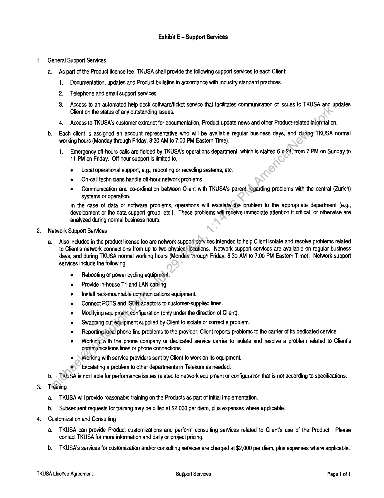
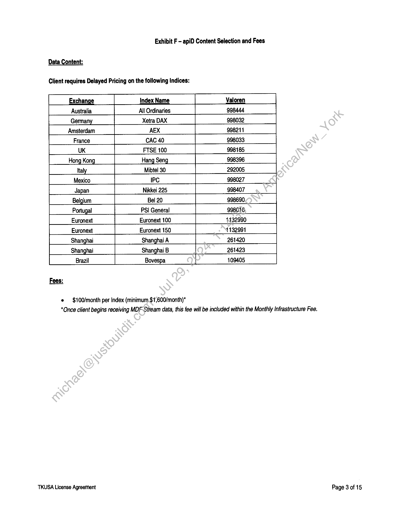

##### Telekurs (USA) Inc. License Agreement]

  
````col
```col-md
flexGrow=.5
===
> [!info] [Page 1](_attachments/images_3.6.4.1.22.7SIX_MODMSA_Executed20081001.pdf_155254/page_1.png)
> 
```  
```col-md
TELEKURS (USA) INC. LICENSE AGREEMENT
CUSTOMER DATA SHEET  
A. Parties:
Client:
Company Name: Wall Street On Demand
Address: 5718 Central Avenue
Address:  
Address: Boulder, CO 80301
Client Billing Address:  
Company Name: Wall Street On Demand
Address: 5718 Central Avenue
Address:
Address: Boulder, CO 80301
Attention: Meredith Rutherford
B. Notice Addresses:
Company Name: Wall StreetOnDemand  
Address: 5718 Central Avenue
Address:  
Address: Boulder, CO 80301  
Attention: Meredith Rutherford  
TKUSA:
Telekurs (USA) Inc.  
River Bend Center
One Omega Drive, Building 3
Stamford, CT 06907  
Telekurs (USA) inc.  
River Bend Center  
One Omega Drive, Building 3
Stamford, CT 06907  
Attention: President  
C. Agreement Effective Date: September 1;.2008  
D. Agreement Commencement Date: September 1, 2008  
E. Initial Term: _2 Years  
Het  
By executing this document, Clientyagrees to subscribe to, and TKUSA agrees to provide, the products and services described in pages 1
through 4 of the attached Telekurs (USA) Inc. Terms and Conditions of Services, together with Exhibits A through G attached hereto.  
Accepted and agreed-by:  
Print Name: LL jhe.
Title: @s ys 4 a Title: Lesa Y 4 ZL .
Date Signed: _/W x Date Signed 2 / LOE  
By: y ~  
Print Name: ehael Fe SAS  
Title:  
Cfo  
Date Signed:__- “07+ lok  
```
````
Notes:    
````col
```col-md
flexGrow=.5
===
> [!info] [Page 2](_attachments/images_3.6.4.1.22.7SIX_MODMSA_Executed20081001.pdf_155254/page_2.png)
> 
```  
```col-md
Telekurs (USA) Inc. Terms and Conditions of Services  
Telekurs (USA) Inc. (‘TKUSA”) agrees to license and distribute
the products, services and data (collectively, the “Products”)
described in this agreement, in the customer data sheet, and in any
schedules and exhibits referred to in this agreement (collectively, this
“Agreement’), only upon the terms and conditions contained in this
Agreement. TKUSA does not agree to and rejects any different or
additional terms that might be contained in any purchase order or
other documents and deems each of them a material alteration to
this Agreement. This Agreement and TKUSA’s distribution of
Products are expressly conditioned on acceptance of all of TKUSA’s
terms.  
Section 1. License  
1.1. Right to Use Products. On the terms and conditions of this
Agreement, TKUSA will deliver to Client through electronic means
certain Products that may include securities prices and other data
obtained by TKUSA from exchanges and other sources (as defined
below) and further enumerated in Exhibit A. The terms of TKUSA’s
license to Client of electronic means for Client's accessing the
Products are as set forth on Exhibit B. TKUSA grants to Client for
the term of this Agreement a limited, non-exclusive, non-transferable
right and license to use the Products internally within its own
organization.  
(a) Availability of individual data elements may vary between
financial instruments and/or Data Sources (defined in Section 2.2
below). TKUSA does not warrant that all data elements are available
or provided for each financial instrument included in the Products.  
(b) Nothing herein shall be construed to prohibit Client from
obtaining or disseminating data from sources other than those
described in this Agreement.  
1.2 Distribution to Third Parties. Client is prohibited from
distributing any portion of the Products to any third party, except as
expressly authorized in Exhibit C.  
1.3 Use Limitations. Client shall not, except as expressly
permitted in this Agreement, copy, sell, distribute, transfer, assign,
publish, disseminate, store as part of any database oifile, nor
convey, allow access by a third party to the Products or any
derivation, revision or recombination thereof, nor shall Client use the
Products to produce end-of-day, end-of-week, end-of-month or other
files or databases of non-contemporaneous. data:  
Section 2. Data Delivery; Communications  
2.1 Representations and Warranties of TKUSA. TKUSA
represents and warrants that:  
(a) It is the owner of and/or has the right under US law to
license the Products to Client for the purposes described in Exhibit
A.  
(b) The Products-may include (but do not include in all cases)
software and/or data that are proprietary or copyrighted and a
proprietary, copyrighted software platform, developed and marketed
by Telekurs Financial Information Ltd.  
(c) TKUSA is a wholly owned subsidiary of Telekurs Financial
Information Ltd. and has the full right to license the Products under
this Agreement.  
2.2 Product Use Limitations. \t is understood that TKUSA collects
data from a variety of sources, including but not limited to, any
securities and commodities exchanges; associations of securities
and/or commodities dealers; providers of news services; providers of
commentary services; providers of proprietary databases; and
federal, state and local governmental agencies (collectively, “Data
Sources’). Client is expressly prohibited from accessing, processing,
distributing or otherwise using all other classes of information that  
TKUSA License Agreement  
may be available on or via the Products, including but not limited to
historical information, news, or corporate action events, but that are
not expressly described on Exhibit A.  
2.3 Data Sources. Individual Data Sources shall be made
available to Client upon request, provided that Client demonstrates (i)
that it has entered proper license agreements with such Data
Sources, as applicable, and (ii) Client's compliance with the terms of
such Data Source licensing agreements and this Agreement,
including fee provisions. Data Source licensing of specific elements
of the data may vary between financial instruments and Data
Sources.  
2.4 Instrument Coverage. Instrument coveragée\-of Products
available hereunder shall be substantially as represented by the
“Data’ section accessed via the public Internet site of TKUSA
(www.tkusa.com, or any successor site), as updated from time to
time, and subject to the prior approval and’ fees required by Data
Sources, where applicable.  
Section 3. TKUSA Modifications  
TKUSA may modify the format, data content or delivery speed
of Products from time to time:and at any time for technical reasons,
or in order to comply with source-or exchange-mandated changes or
regulatory changes, er to accommodate increased data volume, or to
add information not-previously included or for other reasons within
TKUSA’s discretion. TKUSA may also modify the configuration,
software and hardware or communications requirements from time to
time and: at any time for technical reasons, or in order to
acconimodate increased data volume, to add information not
previously included in the Products, or for other reasons within
TKUSA's discretion. TKUSA shall endeavor to give Client such
advance notice of any such changes as is reasonably practicable.
Client shall have sole responsibility for installation of any such new
releases and for making modifications to its software or hardware as
may be necessary in order to accommodate any such modifications.
Client shall incorporate such new releases (no matter in what form
embodied) into the Products within 60 days after receipt of any such
new release.  
Section 4, Fees  
4.1 Fees to Third Parties. Client shall pay promptly when due all
fees or charges assessed pursuant to the Data Source agreements
described in Section 2.3 above.  
4.2 Fees to TKUSA. Client shall pay TKUSA promptly when due
the fees set forth in Exhibit F to this Agreement for use (and
distribution, if applicable) of the Products by Client. TKUSA may
increase the fees set forth in Exhibit F to this Agreement at any time
upon at least 60-days prior written notice; provided, however, that no
such increase shall take effect during the Initial Term of this
Agreement (except as otherwise specified in Sections 4.4 and 4.5
below with respect to the distribution of information derived from the
Products to third parties or for additional Products). If TKUSA
increases the fees, notwithstanding anything to the contrary in
Section 5 below, Client shall have the right to terminate this
Agreement upon at least 30-days’ prior written notice; provided,
however, that such notice must be received by TKUSA at least 30
days before the effective date of the price increase. Client shall
Continue to receive the Products at the fees in effect before the price
increase during any such 30-day notice period.  
4.3 Procurement Fees. Client shall pay TKUSA any
communications, hardware and operating software procurement and
installation fees (if any) as described in Exhibit D.  
Terms & Conditions of Service  
```
````
Notes:    
````col
```col-md
flexGrow=.5
===
> [!info] [Page 3](_attachments/images_3.6.4.1.22.7SIX_MODMSA_Executed20081001.pdf_155254/page_3.png)
> 
```  
```col-md
Telekurs (USA) Inc. Terms and Conditions of Services  
4.4 Distribution Fees. \f TKUSA has given Client permission to
distribute information derived from the Products to a third party as
described in Exhibit C, Client shall pay TKUSA the fees set forth in
Exhibit F. Notwithstanding any other provisions of this Agreement,
such fees shail be subject to increase as Set forth in this Section 4.
4.5 Fees For Additional Products. From time to time during the
term of this Agreement, Client may desire to increase the bodies of
Products it receives from TKUSA from Data Sources in addition to
those described in Exhibit D to this Agreement. TKUSA agrees to
make such additional information available to Client, provided that
Client shall pay such monthly charges for such additional Data
Sources as are in effect at the time that such additional information is
first made available to Client, subject to fee increases as set forth in
this Section 4. Client may also be required to obtain additional Data
Source agreements before receiving such additional Products from
TKUSA, in accordance with Section 2.3 of this Agreement.  
4.6 Late Charges. Client shall pay TKUSA a late charge equal to
the product of the balance due multiplied by the lesser of 11% per
month or the maximum rate allowed by law, on any amounts due
under this Agreement that Client has not paid within 30 days after the
earlier of the due date or the date of receipt of notice that such
amount is due.  
4.7 Taxes. All fees and charges incurred under this Agreement are
exclusive of any and ail taxes and communications charges. Client
shall be responsible for paying any and ail federal, state or local
sales, uSe, property or other similar taxes, other than taxes assessed
to TKUSA based on its net income.  
4.8 US Currency. All payments under this Agreement shall be
made in US currency.  
Section 5. Reports and Audits  
5.1 Reports. Client shall keep accurate books of account and
records covering the types of Products, the manner, location~{if
applicable), and number of users (if applicable) by which any portion
of the Products is accessed or used, which may include, by way of
example (but not limitation): the total number of sites,\the total
number of terminals at each such site and the number of terminals
with access to each portion of the Products; the number of securities
accessed or used; the number of times a website is accessed; the
number of page views; or other appropriate~ measurement (the
“Reports”). Client shall provide the Reports to TKUSA accurately
disclosing all applicable information as required by TKUSA and/or the
Data Sources not more than 15 daysyafter the end of each calendar
Month occurring during the term of this Agreement.  
(a) A sample form of Report for Client use is included with
this Agreement as Exhibit. G.  
(b) With respectto any Data Source agreement, Client shall
report any information that may be required by the Data Source to
TKUSA and to such Data Source. Such report shall be delivered to
TKUSA in a,format and with sufficient frequency to allow TKUSA to
confirm that Client is complying with all reporting and payment dates
imposed by such Data Source.  
(c) Client acknowledges that, under its reporting obligations
to certain Data Sources, TKUSA may be required be required to
disclose certain Client data (e.g. name, address, number of users,
etc.) to such Data Sources.  
5.2 Audit Rights. TKUSA (and its independent certified public
accountant and/or other representatives) shall have the right, during
tegular business hours and upon not fewer than 5-days’ prior notice
to Client, to examine such books of account and records and all other
documents and materials related to the access to and use of the  
TKUSA License Agreement  
Products and the portions of the Products accessed, for the purpose
of determining the accuracy of Client's Reports and Client's use and
access in compliance with the terms of this Agreement. Should any
audit by TKUSA show more than 5% underpayment of fees due
under Section 4 for a monthly period, Client shall promptly pay such
fees to TKUSA, together with interest from the date such fees should
have been paid (at a rate equal to 1%% per month), and shall
promptly reimburse TKUSA for the entire cost of such audit.  
5.3 English Language. All required notices, payments and
statements shall be in writing in English, sent in accordance with the
notice provisions of this Agreement.  
Section 6. Client's Operational Responsibilities;
Representations, Warranties and Covenants  
6.1 Representations. Client represents, warrants and covenants
to TKUSA that:  
(a) Client has independently determined that the Products
under this Agreement meet Client's ‘and any applicable Product
Users’ (defined in Section 6.1(c) below) requirements.  
(b) Client will have sole responsibility for the use of the
Products, including operatinig-procedures, audit controls, accuracy
and security of input atid-output data, restart and recovery routines
and other procedures necessary for Client's intended use of the
Products.  
(c) Client Will insure that its personnel, employees and any
persons authorized to use the Products and the delivery system and
others who'use or operate or have access to the Producis, including
but noi limited to End-Users as defined in Exhibit C (collectively,
“Product Users’), are always educated and trained in the proper use
of the Products and that the Products are used in accordance with
the user documentation.  
(d) Client will maintain backup data necessary to replace any
critical data of Client.  
6.2 No Unlawful Uses. Client agrees that it will not engage in and
fepresents that it is not currently engaged in any unlawful
transactions or business and that it will limit by contract any use or
permission by anyone to use the Products (including the data and
information contained therein) for any unlawful purpose or any
purpose not expressly permitted by this Agreement.  
6.3 Protection of Proprietary Information. Client acknowledges
that the user documentation provided by TKUSA and/or Data
Sources with respect to the Products (the “User Documentation”)
contains trade secrets developed at TKUSA’s expense. Client agrees
to keep in confidence and protect the User Documentation, knowhow and any other of TKUSA’s information that is confidential or a
trade secret (collectively, “Proprietary Information’) from disclosure to
third parties and restrict its use as provided in this Agreement. Client
shall maintain in strict confidence and hold and use the User
Documentation with at least at the level of security that it maintains
with its own proprietary information and trade secrets and in any
event in strict confidence with a reasonable level of security. Client
will not divulge or permit any of its employees, agents or
representatives to divulge any Proprietary Information, directly or
indirectly, in whole or in part, to any third party. Except as expressly
permitted by this Agreement, Client will not copy Proprietary
Information, except when and as may be necessary in connection
with Client’s authorized use in accordance with this Agreement.
Client will mark each copy, including its storage media, with all
notices that appear on the original, including but not limited to all
copyright, governmental restricted rights and other proprietary
notices included on the Products.  
Terms & Conditions of Service  
```
````
Notes:    
````col
```col-md
flexGrow=.5
===
> [!info] [Page 4](_attachments/images_3.6.4.1.22.7SIX_MODMSA_Executed20081001.pdf_155254/page_4.png)
> 
```  
```col-md
Telekurs (USA) Inc. Terms and Conditions of Services  
This Section 6.3 will survive termination or cancellation of this
Agreement or any license granted by this Agreement.
6.4 No Transfer. TKUSA does not transfer title to or ownership of
any Products to Client or any third party. Client and any third party
permitted in accordance with Exhibit C shall have access to
Products, subject to the terms of this Agreement.
6.5 No Unauthorized Use. Client will not reverse engineer,
reproduce, copy, “screen scrape”, decompile or disassemble the
Products. Client will take all reasonable precautions to protect the
Products from theft and unauthorized use. Client will promptly report
any theft or unauthorized use and take further actions as are
reasonably requested by TKUSA to prevent or remedy any such
action.
6.6 Rights Retained. All rights relating to the Products that are not
specifically provided under this Agreement are retained by TKUSA.
6.7 No Enabling. Client will not permit, aid or enable anyone to do
anything that Client may not do under this Agreement.
6.8 Client Data. Notwithstanding any other provision of this
Agreement, Client acknowledges that TKUSA and its affiliates may
be subject to reporting obligations that may require disclosure to
Data Sources of certain information regarding the Client and Product
Users, including but not limited to names, addresses and number of
users, and that TKUSA is hereby authorized to disclose such
information to Data Sources.
Section 7. TKUSA Limited Warranty Limitation of Liability  
7.1 Limited Warranty. Neither TKUSA nor any of its affiliated
companies, any Data Sources, nor any of their respective licensors,
employees or agents, warrants that any provision of the Products will
be either uninterrupted or error free. Except as expressly provided in
Section 2.1 above, THE PRODUCTS TO BE PROVIDED UNDER
THIS AGREEMENT, AND ANY OTHER MATERIALS OR SERVICES
PROVIDED IN CONNECTION THEREWITH ARE PROVIDED “AS.
IS", WITHOUT WARRANTY OF ANY KIND, EITHER EXPRESS) OR
IMPLIED, INCLUDING BUT NOT LIMITED TO IMPLIED
WARRANTIES OF MERCHANTABILITY OR FITNESS FOR ANY
PARTICULAR PURPOSE, OR IMPLIED WARRANTIES ARISING
FROM COURSE OF DEALING OR COURSE OF PERFORMANCE.  
7.2 Assumption of Risk. Client expressly agrees that use of the
Products is at Client’s sole risk.
7.3 Limitation of Liability. Except-for-damages incurred under
Section 8, none of neither Party, its.affiliated companies, any Data
Source, nor anyone else who™has been involved in creating,
producing, delivering or installingthe Products, shall be liable to the
other, any Product User orany.third party for any indirect, incidental,
special, exemplary or ‘consequential damages arising out of this
Agreement or use of ahy/of the Products, or arising out of any breach
of any warranty under this Agreement, even if such party has been
advised of the possibility of such damages, such as (but not limited
to) loss of revenue or anticipated profits or lost business.
7.4 Survival. The provisions of this Section 7 shall survive any
termination of this Agreement.
Section 8. Patent, Copyright, Trade Secret  
As to any Product that, in TKUSA’s reasonable, good faith
belief, may become subject to a claim of infringement or
misappropriation, TKUSA may elect to (a) obtain the right of
continued use of such Product for Client, or (b) replace or modify
such Product to avoid such claim. If TKUSA does not do so, Client
shall discontinue use and retum the Product, and all applicable
licenses shall terminate.  
TKUSA License Agreement  
TKUSA, at its expense, will indemnify, defend and hold harmless
Client or its officers, directors, managers or employees, (collectively,
the “Client Indemnified Parties”) from and against any third party
claim or action threatened or brought against Client Indemnified
Parties by a third party based on or arising out of the Product or any
use thereof constituting an infringement, violation, contravention or
breach of any patent, copyright or trademark or constituting the
misappropriation of a trade secret of any third party. Upon any such
claim, Client may, at its option, terminate this Agreement with no
further liability to TKUSA. The provisions of this Section 8 shall
survive any termination of this Agreement.  
Section 9. Term and Termination
9.1 Term. This Agreement shall take effect as of the date by which
it has been executed by both Client and<TKUSA (the “Effective
Date’). The date upon which TKUSA may commence charging fees
to Client shall be the earliest of the\following dates (whichever, the
“Commencement Date’):  
(a) The earliest date thai-any Product is made available for
use by Client or Client's Product Users; or  
(b) The earliest\date that Client or any Product User sells or
offers any Product or compilation thereof for sale or use by others,
whether or not-Client receives any consideration for any such
Product; or  
(c) “Such earlier date that Client and TKUSA agree or have
agreed in«writing shall be the Commencement Date.
This Agreement shall remain in effect from the Effective Date until
the conclusion of the initial term (the “Initial Term’). After expiration of
the Initial Term, the term of this Agreement shall automatically extend
for additional terms of 1 year (each, an “Extended Term”); provided,
however, that either party may terminate this Agreement at the end
of either the Initial Term or any Extended Term upon written notice to
the other party delivered at least 60 days before the end of Initial
Term or the then-current Extended Term (whichever is applicable).  
9.2 Termination. TKUSA may terminate this Agreement as
follows:  
(a) TKUSA may terminate this Agreement without notice if
Client breaches any term of this Agreement and fails to remedy such
breach within 14 days after written notice is provided to Client by
TKUSA. Client shall be deemed to have remedied any breach by any
of its customers by terminating such customer's access to the
Product. If Client or any of its employees, agents or representatives
attempts to use or dispose of any Product in a manner contrary to the
terms of this Agreement, TKUSA may immediately and without notice
to Client terminate this Agreement and shall, in addition, have the
right, in addition to such other remedies as may be available to
TKUSA at law or in equity, to injunctive relief enjoining such acts or
attempts without the necessity of posting any bond in respect thereof,
it being acknowledged by Client that such acts could cause
irreparable harm to TKUSA and that legal remedies alone are
inadequate.  
(b) TKUSA may terminate this Agreement in whole or in part
immediately upon notice to Client, and immediately terminate all
subscriptions, if any rights or concessions necessary for the
collection, compilation, processing or distribution are withdrawn,
terminated or not renewed; and TKUSA shall not be liable to Client
for any amounts other than a refund of any prepaid subscription fees,
pro rata through the termination date.  
Terms & Conditions of Service  
```
````
Notes:    
````col
```col-md
flexGrow=.5
===
> [!info] [Page 5](_attachments/images_3.6.4.1.22.7SIX_MODMSA_Executed20081001.pdf_155254/page_5.png)
> 
```  
```col-md
Telekurs (USA) Inc. Terms and Conditions of Services  
9.3 Post-Termination. If this Agreement is terminated for any
reason, Client shall,  
(a) Cease all further use or distribution of the Products and
data derived from the Products and shall promptly destroy all copies
in its possession of the User Documentation. Client shall also purge
all machine-readable data and information in its possession or
control related to the Products from its data storage facilities. Client
shall, upon request, certify in writing to TKUSA Client’s compliance
with this Section 9.3. Client shall also at TKUSA’s instruction, either
retum to TKUSA or destroy, any Product that Client has licensed
from TKUSA within 7 days of the termination date of this Agreement.
TKUSA, on not less than 3-days’ notice, retains the right to audit
Client's compliance with this Section 9.3.  
(b) Immediately destroy or return to TKUSA all copies of any
Proprietary Information in Client’s possession;  
(c) Warrant that all such Proprietary Information has been
destroyed or returned to TKUSA; and inform and instruct Client’s
Product Users of their obligations relative to TKUSA’s Proprietary
Information.  
(d) Immediately pay any monies due under the license
granted under this Agreement  
(e) The provisions of Sections 4.7, 5, 6.2, 6.3, 7, 8, 9.2, 9.3
and 9.4 shall survive any termination of this Agreement.  
9.4 Dispute Resolution. Client and TKUSA agree to observe the
following procedures and use commercially reasonable efforts to
resolve any disputes that may arise under this Agreement, before
resorting to litigation, except with respect to any matters concerning
intellectual property or that are addressed in Sections 6.2, 6.3, 8 or 9:  
(a) Client and TKUSA shall form a committee (the “Joint
Committee”) composed of one representative appointed by Client
and one representative appointed by TKUSA, from time to time, to
teview and discuss the parties’ respective obligations under this
Agreement. The Joint Committee shall establish a consultation and
communication procedure and protocol for either party's bringing
issues before the Joint Committee for resolution. Either party may
bring a matter of disagreement or conflict under the Agreement to the
Joint Committee for resolution. Each party shall act\reasonably and
in good faith to attempt to resolve and settle any such disagreement
or conflict.  
(b) If the Joint Committee is unable to resolve a disagreement
of conflict within 30 days (including the failure of the parties to accept
a resolution) (each, a “Dispute”), the party alleging a Dispute shall
notify the other party, providing ‘the particulars of the Dispute (the
“Notice of Dispute”). Each pariy‘shall appoint a representative who is
a senior executive officer of-such party to meet with the other party's
senior executive officein good faith to try to resolve the Dispute
within 14 days after-the'date of the Notice of Dispute. If the Dispute is
not resolved within 30 days after the date of the Notice of Dispute, no
further action-is required under this Section 9.4, and each party may
pursue its remedies under this Agreement.  
9.5 Equitable Remedies. Nothing in this Section 9 shall prevent or
delay TKUSA or Client from applying to a court as described in
Section 11.4 for equitable relief.  
Section 10. Notices  
All notices required by this Agreement shall be provided in
writing via regular US mail, or by a nationally recognized overnight
delivery service and shall be deemed to have been provided upon
receipt, or upon 2 days after deposit in the US mail with proper
Postage, or upon delivery to a nationally recognized private courier
service, in each case addressed as set forth on the customer data  
TKUSA License Agreement  
sheet accompanying and constituting an integral part of this
Agreement, or to such other address as shall have more recently
been conveyed to the other party in accordance with this Section 10.
Section 11. Miscellaneous Provisions  
11.1 Force Majeure. TKUSA shall not have any liability for any
default under this Agreement resulting from a force majeure, which
shall be deemed to include any circumstances beyond its reasonable
control. Such circumstances shall include, but are not limited to, acts
of government, fire, flood, earthquake, strikes, power failures or
communications line or network failures.  
11.2 Entire Agreement. This Agreement is a complete and
exclusive statement of the terms of its subject matter;  
11.3 No Waiver. Failure of either party to insist‘at any time upon
strict compliance with the terms of this Agreement or to seek remedy
for any breach shall not constitute or be consiued as a waiver of any
rights or remedies under this Agreementof any such breach.  
11.4 Governing Law and Jurisdiction. This Agreement will be
governed by the laws of the State of New York, excluding its conflict
of laws rules. All disputes arising in connection with this Agreement
shall be resolved in the state or federal courts of New York, and
Client hereby submits tothe personal jurisdiction of all such courts.
11.5 No Assignment by Client. Client may not assign or transfer
any of its rightsor the license granted hereunder without TKUSA’s
consent, which consent shall not be unreasonably withheld or
delayed.  
11.6, No Modification. This Agreement may be modified only by
an.amendment signed by a duly authorized representative of each
party.  
11.7 Interpretation. This Agreement shall be interpreted fairly
according to its terms without presumptions against the drafting party
and without reference to the Section headings, which are for
reference only.  
11.8 Limitation on Actions. No arbitration proceeding or legal
action, regardless of its form, whether in contract or tort, including
negligence, related to or arising out of this Agreement may be
brought by either party more than 1 year after the cause of action first
accrued.  
Terms & Conditions of Service  
```
````
Notes:    
````col
```col-md
flexGrow=.5
===
> [!info] [Page 6](_attachments/images_3.6.4.1.22.7SIX_MODMSA_Executed20081001.pdf_155254/page_6.png)
> 
```  
```col-md
Exhibit A - MDF stream Product Description  
Product Description  
Telekurs real-time market data feeds include data from the full range of trading sessions and across an extensive assortment of
reported, derived and statistical data elements. All feeds are normalized and consolidated into our Market Data Feed (MDF) for
delivery in a single, consistent format.  
MDFstream is Telekurs’ broadcast data feed, which is built on a sophisticated, rapid queueing design optimized for high
throughput.  
MDFstream delivers a mix-and-match solution of real-time and delayed data, segmented by exchange or contributor source.
Product Delivery  
MDFstream is delivered via point-to-point connection.  
Customer Access  
Access to the data and integration into the customer environment is simplified by straightforward API access:  
Client is responsible acquiring all circuits and related hardware to establishing connectivity to the to(MDFstream servers located
at Telekurs’ data center.  
Client is responsible for acquiring all circuits and related hardware to establish conneclivity to the to MDFselect servers located at
Telekurs’ data center. Please refer to Exhibit D, Product Delivery.  
An optional interface to the industry's most widely used data distribution platform is available via a third party.  
TKUSA License Agreement Product Description Page 1 of 1  
```
````
Notes:    
````col
```col-md
flexGrow=.5
===
> [!info] [Page 7](_attachments/images_3.6.4.1.22.7SIX_MODMSA_Executed20081001.pdf_155254/page_7.png)
> 
```  
```col-md
Exhibit A - apiD Product Description  
Product Description
Telekurs apiD provides a basis for different interfaces to integrate Telekurs financial and news data into a customer application or platform.
The apiD provides access to a wide range of Telekurs Financial data, as well as a set of predefined functions and three technical
interfaces for data delivery. Benefits of apiD include:  
e All data comes from a single source and is fed in through a standard interface, which simplifies configuration and operation.  
e Thanks to a sophisticated authorization system, the data selection can be customized according to a range of different
requirements (e.g. bank clients, in-house users at various departments).  
e — Intelligent packaging of data and functions facilitates the rapid implementation of apiD-based applications.
© Open, standardized interfaces permit fast and simple programming and data integration.  
apiD offers easy access to Telekurs’ comprehensive range of data: quotes, portfolio management information, business reports and much
more. Data available includes:  
Quotes Fundamental Data/Details On: Additional Infopmation  
Real-time Quotes Corporate Actions
Delayed Quotes Markets  
Time & Sales Data Financial Instruments
Calculated Values Stock Market Listings Business, News  
Historical Prices 8rd paity data (depending on local markets)  
The apiD infrastructure is based on a modular concept. In this way, a range of different client solutions — Internet, Intranet or Extranet
applications, or the supply of data for special applications such as asset management systems — can be implemented with a minimum of
fuss. With apiD, clients can use a host of predefined functions to create an application, or integrate data into their applications, easily and
quickly. The most important of these are:  
e — Search functions for pinpointing securities, compariiés or trading places, based on a variety of criteria  
e — User-friendly market summaries with predefined lists  
e — Easy-to-read portfolio function for assembling and managing client portfolios  
 — Convenient limit-monitoring feature  
e Functions for generating simple or more complex charts on the basis of predefined forms (with Java-API or JSP)  
e —Heatmap functions for the graphical display of market overviews, complete with the biggest gainers/losers (with Java-API or JSP)
There are three API levels to serve different customer needs:  
XML format for real-time data delivery with automatic (push) and/or manual updates.  
e — Java-API for.developing applications in a Java environment. Java-API is based on XML format and a Java library. The Telekurs
display product Telekurs iD was developed using this Java-API.  
e JSP Tag for developing request-based HTML solutions (Intranet, Extranet or Internet solutions with customized layouts). This
interface can also be used to retrieve the financial and news data in a format other than XML, e.g., in “csv” format.  
For data\integration, Telekurs Financial offers the possibility of cooperation with authorized apiD partners, thus ensuring comprehensive
advice and support.  
Product Delivery  
apiD has the same basic structure and architecture as the Telekurs iD generation of display products. The apiD server provides access to
data and functions via technical interfaces. Data can be supplied either through the standard XML or Java-API interfaces and/or via JSP.  
Customer Access  
Depending on individual customer needs and data volumes, an application can access the apiD server directly in the server zone of
Telekurs Financial.  
TKUSA License Agreement Product Description Page 1 of 1  
```
````
Notes:    
````col
```col-md
flexGrow=.5
===
> [!info] [Page 8](_attachments/images_3.6.4.1.22.7SIX_MODMSA_Executed20081001.pdf_155254/page_8.png)
> 
```  
```col-md
Exhibit B - Territory and Use of Service  
Territory  
Pursuant to the terms of this Agreement, Client may use and/or distribute the Products (or data derived from the Products) within the
following territory:  
Rights are granted for distribution of the data globally. In the event Client has a prospect with users outside of the Americas, Client shall
determine whether or not such prospect is an existing user of data from TKUSA or one of its affiliates. In the event prospect is not a
current TKUSA client (or a client of a TKUSA affiliate), no further review is required by TKUSA. If prospect is a current client, TKUSA
teserves the right to structure the pricing to such client for TKUSA data which may correspond to their existing contract, but may.or may
not correspond to the fee structure in Exhibit F.  
[-- | North & South America  
--Or--  
[| Other (specify): __ Global  
Usage Description  
1. General Usage Statement
a. Client plans to use and/or distribute the Products (or data derived from the Products) as follows:
To design, develop and host custom websites, reports and tools for the financial  
services industry. End users do noi have the ability to download Telekurs data  
as all data will remain at Wali Street On Demand data centers.  
b. The Products (or data derived from the Products) will be delivered to the following database location(s):
5718 Central Avenue  
Boulder, CO 80301  
c. Name and description of the of the Client business unit (e.g., private banking, custodian, clearing agent etc.) using the
Products (or daia derived from the Products):  
Technology  
d. Description of how the Products (or data derived from the Products) will be used, including name and description of all
applications:  
Custom design and host websites for the financial services industry.  
TKUSA License Agreement Territory and Use of Service Page 1 of 2  
```
````
Notes:    
````col
```col-md
flexGrow=.5
===
> [!info] [Page 9](_attachments/images_3.6.4.1.22.7SIX_MODMSA_Executed20081001.pdf_155254/page_9.png)
> 
```  
```col-md
Exhibit B - Territory and Use of Service  
2. Distribution
a. Please specify the name all users of the Products (or data derived from the Products):  
Departments: Technology  
Subsidiaries:  
Affiliates:  
Others:  
b. The Products (or data derived from the Products) will be distributed outside the-firm (e.g. to clients, clearing agents, etc.):  
¢. Geographic region(s) where these users are located:  
ra North America  
See above note about prospects outside ofthe US.  
TKUSA License Agreement Territory and Use of Service Page 2 of 2  
```
````
Notes:    
````col
```col-md
flexGrow=.5
===
> [!info] [Page 10](_attachments/images_3.6.4.1.22.7SIX_MODMSA_Executed20081001.pdf_155254/page_10.png)
> 
```  
```col-md
Exhibit C - External Distribution  
TKUSA makes no representations that any portion of the Product may be distributed by Client to any third party, unless TKUSA has given
Client specific permission to distribute such portions of the Product to a third party under an Exhibit to this Agreement.  
Check one:  
A) _ Distribution of raw data outside Client's firm is not permitted. Client’s use of the Product is solely for the development
of Client's proprietary or internal application(s) as described in Exhibit B and for use by Client's employees within such
application(s).  
Client's redistribution of any component of the Product or data derived from the Product is prohibited.
- Or--  
B) _ Distribution outside Client's firm is permitted. Client may use the Product for the development of Client’s proprietary or
intemal application(s) as described in Exhibit B and for use by Client's employees within such application(s) and, in
consideration of the fees in Exhibit F, Client may redistribute the Product, component thereof or data derived from the
Product as authorized below to end users, as described below. Distributionsto third parties other than end users is
prohibited.  
1. It is the sole responsibility of Client to confirm with all applicable Data Sources whether or not such portions of the
Product that are selected by Client under this Agreement or in a Written signed amendment hereto may be distributed to
a third party.  
a. With respect to those portions of the Product that.may permissibly be distributed to a third party, it shall be the
sole responsibility of Client to ensure that all applicable written approvals from the appropriate Data Sources are
obtained by Client and/or such third parties prior to Client commencing distribution of the Product to such third
party.  
b. It is presumed that all users having-access to the Product have access to ALL Data Sources permissioned. If
Client desires to limit Data Source access by some but not all users, then any software that Client uses to
distribute and/or allow access to the Product must at all times prevent such users from having access to any
unlicensed information that may be transmitted to Client by TKUSA. If Client accesses the Product using its own
application, then any Software that Client uses to access the Product must at all times prevent such users from
having access torany unlicensed information that may be transmitted to Client as part thereof. TKUSA may, at
any time during Client's normal business hours and upon prior notice, inspect the hardware and software system
used by Client with respect to such transmission for the purpose of verifying the inaccessibility of the unlicensed
information to either Client or third parties.  
2. Prior to.comimencing distribution of the Product via Client’s proprietary application to any end user, Client shall enter
into-avvalid license agreement containing the provisions specified below with each such end user, as appropriate.  
3. \Client agrees to include the appropriate language from Exhibit C-1 and/or Exhibit C-2 (attached) in license agreements
with its end user customers.  
TKUSA License Agreement Extemal Distribution Page 1 of 1  
```
````
Notes:    
````col
```col-md
flexGrow=.5
===
> [!info] [Page 11](_attachments/images_3.6.4.1.22.7SIX_MODMSA_Executed20081001.pdf_155254/page_11.png)
> 
```  
```col-md
Exhibit C-1 — Distribution Via Closed User Group  
Distribution to end users via closed user group and/or ID/password protected terminals IS permitted.  
Distribution of raw data to end users via closed user group and/or ID/password protected terminals IS NOT permitted.  
If distribution to end users via closed user group and/or protected terminals is permitted, Client agrees to include the following
provisions in alt agreements it enters into with end users of the Product. For purposes of this Exhibit C-1, such end users are
teferred to as “Licensees”.  
1. Licensee agrees to use the Product solely via (name the Client's
service or proprietary application here). Such usage shall be limited to Licensee’s employees for its own
internal, lawful purposes. Redistribution to, or use or access by any other person or entity, includirig but not
limited to, any entity that is not principally owned by the Licensee is expressly prohibited.  
2. Licensee agrees that TKUSA (including its Data Sources) shall have no liability for-the accuracy or
completeness of the Product via Client's proprietary application or for any delays, interruptions, or omissions
therein, and neither TKUSA nor any Data Source shall have any liability in connection-with any termination of
service (with or without notice).  
3. Licensee agrees that its arrangement with Client for receipt of the Produciis subject to termination without
notice in the event that this Agreement between Client and TKUSA is terminated for any reason.  
4, Licensee agrees to comply with any conditions, restrictions or limitations imposed by any of the Data Sources,
including obtaining any applicable written approvals from the appropriate Data Sources or, in the absence of
such required approval, accept termination of that portion of the Product attributable to any such Data Source.  
5. Licensee acknowledges that the Data Sources described in the preceding paragraph may have the right to
terminate provision of the Market Data to TKUSA and Client with or without notice and that neither any such
Data Source, TKUSA nor Client shall have any liability in connection therewith.  
TKUSA License Agreement Distribution Via Closed User Group Page 1 of 1  
```
````
Notes:    
````col
```col-md
flexGrow=.5
===
> [!info] [Page 12](_attachments/images_3.6.4.1.22.7SIX_MODMSA_Executed20081001.pdf_155254/page_12.png)
> 
```  
```col-md
Exhibit C-2 - Distribution Via Public Internet  
Distribution to end users via the public Internet IS NOT permitted.  
Distribution to end users via the public Internet IS permitted, as stated in Exhibit B  
If distribution to end users via the public Internet is permitted, Client agrees to include the following provisions in a “click on
agreement” or other affirmatively acknowledged on-line agreement with visitors to public Internet sites created, hosted or
otherwise maintained by Client that contain all or portions of the Product. This is in addition to any other requirements that the
Data Sources may impose upon Client for redistribution via public Internet
1. Content
a. The content available through (name Client Service), “The Service” is the
property of Client (including its licensors, independent contractors, and any affiliates;-successors or
assigns, together, ‘The Company”), and is protected by copyrights, trademarks, servicemarks, patents or
other proprietary rights and laws.
b. By acknowledging these terms, the viewer of The Service, herein defined as. “Customer”, understands
and agrees that the information in, or derived from The Service may_iot be copied, republished,
tedistributed, transmitted, altered, edited or exploited in any manner for.any purpose, without the express
written permission of The Company.
c. Customer agrees that The Company, its affiliates and any independent contractor engaged by The
Company shalt not be liable for any errors or delays in the coritent of any information provided through
The Service, or for any actions taken by Customer or any third:party, in reliance thereon. The information
contained within The Service has been obtained from sources considered reliable, but such information is
Not guaranteed, and The Company and its affiliates olits licensors make no representation or warranty as
to the accuracy or completeness, or continued availability of this information.  
Limitation of Warranties and Indemnification. The Service is provided as is, without warranty of any kind. Customer
agrees that The Company, its affiliates, licensors and any independent contractor engaged by The Company shall
not be liable in any way. Customer agrees to indemnify and hold harmless The Company, its affiliates, licensors
and any independent contractor engaged by) The Company from any claim or demand, including reasonable
attorneys’ fees, made by any third party die to (a) any inaccuracy, error, or delay in, or omission of (i) any such
data, information, or message within The Service, (ii) the transmission or delivery of any such data, information, or
message; or (b) any loss or damage arising from or occasioned by (i) any such inaccuracy, error, delay, or
omission, (ii) non-performance, of (iii) interruption of any such data, information, or message, due either to any
negligent act or omission by The Company or to any “force majeure" (i.e., acts of government, fire, flood,
earthquake, strikes, power failures or communications line or network failures) or any other cause beyond the
reasonable control of The:Company.  
2. DISCLAIMER OF WARRANTIES AND LIABILITY. CUSTOMER EXPRESSLY AGREES THAT USE OF THE
SERVICE IS‘AT ITS OWN RISK AND THE COMPANY HAS NO LIABILITY OR OBLIGATION TO CUSTOMER
WITH RESPECT TO ANY PORTION OF THE SERVICE. THE COMPANY DISCLAIMS ALL WARRANTIES,
EXPRESS OR IMPLIED, INCLUDING, BUT NOT LIMITED TO, IMPLIED WARRANTIES OF
MERCHANTABILITY OR FITNESS FOR A PARTICULAR PURPOSE. THIS DISCLAIMER INCLUDES
DIRECT, INDIRECT, INCIDENTAL, CONSEQUENTIAL AND ANY AND ALL FORMS OF DAMAGES,
REGARDLESS OF THE FORM OF ACTION OR THE BASIS OF THE CLAIM.  
TKUSA License Agreement Distribution Via Public Internet Page 1 of 2  
```
````
Notes:    
````col
```col-md
flexGrow=.5
===
> [!info] [Page 13](_attachments/images_3.6.4.1.22.7SIX_MODMSA_Executed20081001.pdf_155254/page_13.png)
> 
```  
```col-md
Exhibit D - Product Delivery  
Product Delivery Methods
1. File Transfer Protocol (FTP), a standard Internet protocol, is the preferred method for file delivery. Customers may choose FTP file
transfer over the Internet, or over a dedicated network circuit (see point 2 below).
e Customer may choose to "retrieve or receive" files via FTP using a command-line interface, a commercial program, or a
standard web browser.
e — Telekurs offers UNIX or Windows compression, custom filenames, FTPS (SSL), SFTP (SSH), and GPG encryption.
e FTP servers are fully redundant, and access is provided through diversified suppliers.
2. Point-to-Point Connection (MDF select or MDF stream, FTP file transfer via dedicated circuit)
Client connection to the Service(s) server is via TCP/IP, utilizing:
e — Dedicated circuits (T1/T3) and routers, which shall be provided by Client, using the carrier of choice.
e Managed network service(s) such as SAVVIS or BT_Radianz.
e — Under special circumstances, via the Internet.  
Procurement of Hardware, Equipment and Third Party Services  
TKUSA will purchase the Service server(s) on behalf of Client, and will install and:maintain such hardware at TKUSA’s
site. Cost associated with procurement of such hardware will be submitted to:Client for reimbursement, and will be
subject to a 10% service charge.  
Client is responsible for procuring equipment and telecommunications Services necessary to connect to the Service at
TKUSA’s site. All such equipment must be configured according to TKUSA minimum specifications.  
If at any point in time during the term of this Agreement there is a more cost effective delivery option, TKUSA will work
in conjunction with Client to migrate over to the more cost effective option.  
Client is responsible for establishing Ti connection (or-cther approved connection) to TKUSA, for the purpose of
accessing the Service servers located at TKUSA,as permitted hereunder. All one-time and monthly communications
charges, and responsibility for installing, maintaining and disconnecting modems, lines, satellite, and/or radio delivery
shall be the sole responsibility of Client.  
Telekurs will assign IP addressing for Client’s connections to the TKUSA network.  
Network Equipment Supported  
Client is responsible for providing network equipment at TKUSA’s site and at Client's site(s). TKUSA reserves the right
to refuse equipment that is.not.configured or supplied according to minimum specifications:  
e Cisco Router, model.depends on bandwidth requirements  
e — Internal T-1 module  
¢ — Cisco’s (internal) Data Compression Advanced Integration Module (AIM-COMPR2)  
e — ISDN Terminal Adapter or dial modem for remote access to routers. Client supplies POTS or ISDN line.  
TKUSA Data Feed Connection Locations  
Location(s) for the installation and connection of Client's communications lines and equipment to receive the Service
Shall be as follows:  
TKUSA Primary Data Center Telekurs Alternate Data Center  
Stamford, Connecticut, 06907
Phone: 09) 3588700  
TKUSA License Agreement Product Delivery Page 1 of 2  
```
````
Notes:    
````col
```col-md
flexGrow=.5
===
> [!info] [Page 14](_attachments/images_3.6.4.1.22.7SIX_MODMSA_Executed20081001.pdf_155254/page_14.png)
> 
```  
```col-md
Exhibit D - Product Delivery  
Customer Data Feed Connection Location(s)  
Client location(s) for the installation and connection of communications lines and equipment to receive the Service shall be
as follows:  
Primary Site  
FFowaonermae |
00  
Backup Site
Street Address: 8101 Shaffer Parkway
Floor or other locator:
PSawPoies iOS  
Segond, Backup Site (if applicable)  
fy  
TKUSA License Agreement Product Delivery Page 2 of 2  
```
````
Notes:    
````col
```col-md
flexGrow=.5
===
> [!info] [Page 15](_attachments/images_3.6.4.1.22.7SIX_MODMSA_Executed20081001.pdf_155254/page_15.png)
> 
```  
```col-md
Exhibit E - Support Services  
1. General Support Services
a. As part of the Product license fee, TKUSA shall provide the following support services to each Client:
1. Documentation, updates and Product bulletins in accordance with industry standard practices
2. Telephone and email support services
3. Access to an automated help desk software/ticket service that facilitates communication of issues to TKUSA and updates
Client on the status of any outstanding issues.
4. Access to TKUSA’s customer extranet for documentation, Product update news and other Product-related information.
b. Each client is assigned an account representative who will be available regular business days, and during TKUSA normal
working hours (Monday through Friday, 8:30 AM to 7:00 PM Eastern Time).
1. Emergency off-hours calls are fielded by TKUSA's operations department, which is staffed 6 x-24, from 7 PM on Sunday to
11 PM on Friday. Off-hour support is limited to,
e Local operational support, e.g., rebooting or recycling systems, etc.
e —On-cail technicians handle off-hour network problems.  
e Communication and co-ordination between Client with TKUSA’s parent.regarding problems with the central (Zurich)
systems or operation.  
In the case of data or software problems, operations will escalatethe problem to the appropriate department (e.g.,
development or the data support group, etc.). These problems will'receive immediate attention if critical, or otherwise are
analyzed during normal business hours.  
2. Network Support Services  
a. Also included in the product license fee are network support'services intended to help Client isolate and resolve problems related
to Client’s network connections from up to two physical Jocations. Network support services are available on regular business
days, and during TKUSA normal working hours (Monday through Friday, 8:30 AM to 7:00 PM Eastern Time). Network support
services include the following:  
e — Rebooting or power cycling equipment.  
e — Provide in-house T1 and LAN cabling.  
e — Install rack-mountable communications equipment.  
e Connect POTS and ISDN)adaptors to customer-supplied lines.  
e Modifying equipment configuration (only under the direction of Client).  
« — Swapping out equipment supplied by Client to isolate or correct a problem.  
e — Reporting.jocal phone line problems to the provider; Client reports problems to the carrier of its dedicated service.  
e Workingowith the phone company or dedicated service carrier to isolate and resolve a problem related to Client's
communications lines or phone connections.  
e Working with service providers sent by Client to work on its equipment.
>) Escalating a problem to other departments in Telekurs as needed.
b. - TKUSA is not liable for performance issues related to network equipment or configuration that is not according to specifications.  
3. Training  
a. TKUSA will provide reasonable training on the Products as part of initial implementation.  
b. Subsequent requests for training may be billed at $2,000 per diem, plus expenses where applicable.
4. Customization and Consulting  
a. TKUSA can provide Product customizations and perform consulting services related to Client's use of the Product. Please
contact TKUSA for more information and daily or project pricing.  
b. TKUSA's services for customization and/or consulting services are charged at $2,000 per diem, plus expenses where applicable.  
TKUSA License Agreement Support Services Page 1 of 1  
```
````
Notes:    
````col
```col-md
flexGrow=.5
===
> [!info] [Page 16](_attachments/images_3.6.4.1.22.7SIX_MODMSA_Executed20081001.pdf_155254/page_16.png)
> 
```  
```col-md
Exhibit F - Market Data Feed Content Selection & Fees  
1. Product. The Product licensed under this Agreement is:  
MDFstream: [X_] OR MOF select. [_]
Dedicated Server Environment: L]
Shared Server Environment: [__]  
All pricing applies to a single business unit. A “Business Unit” is defined as any segment of an organization or an.entire business
organization that is not divided into segments and that share the same activities and records.  
The below listed fees are for Business Units conducting business within North and South America. For Business Units‘not in this territory,
Client must request pricing and permission for use of MDF by these Business Units.  
2. Base Fee  
Monthly Infrastructure Fee: $8,333" and Telekurs licenses directly with End Users. As End Users become clients of Telekurs the
following deduction chart will be used towards the Monthly Infrastructure Fee:  
Total Client Spend New Monthly Infrastructure Fee
$100,000/annum $4,167  
$150,000/annum $2,083
$200,000/annum [Gas
$250,000/annum Gratis & will waive Backup fees below  
*Price does not include Communication lines which must be.negotiated between Wall Street On Demand and provider.  
The following fee schedule will apply for End Users who license directly with Telekurs:  
[Exchanges | _Cost Per Exchange
Po t-to | 83007month  
21+ $100/month
The Monthly Infrastructure-Fee will include the following:
Data - Exchange List)provided on Attachment A
Support — Dedicated Account Services Rep responsible for the day-to-day relationship, pricing questions and general inquiries from
Monday — Friday 8am - 7pm ET. In addition, Operational Support is available 24 X 7.  
Hardware = 3 Dedicated SUN MDF Stream Servers. Supplied by Telekurs and hosted at Telekurs primary & backup data centers.
Additional servers can be requested at a fee.  
TKiD — One User ID, each additional TKD to be priced at $10,000/annum  
Additional Pricin
Should Wall Street On Demand decide to use the Telekurs feed as a backup source for current data provider the following fees shall apply:  
International Exchanges - $2,000/month
Domestic Exchanges - $1,000/month  
TKUSA License Agreement . Page 2 of 15  
```
````
Notes:    
````col
```col-md
flexGrow=.5
===
> [!info] [Page 17](_attachments/images_3.6.4.1.22.7SIX_MODMSA_Executed20081001.pdf_155254/page_17.png)
> 
```  
```col-md
Exhibit F - apiD Content Selection and Fees  
Data Content:  
Client requires Delayed Pricing on the following Indices:  
998016
1432990  
Euronext Euronext 150 1132991  
Shanghai Shanghai A 261420  
Shanghai Shanghai B 261423
Brazil Bovespa  
Fees:  
e — $100/month per Index (minimum .$1,600/month)*
*Once client begins receiving MDF Stream data, this fee will be included within the Monthly Infrastructure Fee.  
TKUSA License Agreement Page 3 of 15  
```
````
Notes:    
````col
```col-md
flexGrow=.5
===
> [!info] [Page 18](_attachments/images_3.6.4.1.22.7SIX_MODMSA_Executed20081001.pdf_155254/page_18.png)
> 
```  
```col-md
Exhibit G - Sample Reporting Form  
1. Report Format. While the exact format of the reports to be delivered to TKUSA under the Agreement may vary according to Client's
systems and reporting procedures, certain data must be included in each report, as follows:  
¢ Client Name  
e Name of TKUSA Service being reported  
e — Reporting Month and Year  
¢ — Total payable to TKUSA for the reporting period, in US Dollars.  
e Name and contact information of Client's representative responsible for reporting, in case of questions.  
2. Report Timing. Pursuant to the Agreement, all reports should be sent to TKUSA no later than the 15" of the month following the reporting
period.
3. Report Delivery. All reports should be delivered to TKUSA by one of the following methods:  
By email: billings @tkusa.com  
By post: Telekurs (USA) Inc.
P.O. Box 4999
Stamford, CT 06907-4999
Attention: Finance/Billings  
TKUSA License Agreement Page 4 of 15  
```
````
Notes:    
````col
```col-md
flexGrow=.5
===
> [!info] [Page 19](_attachments/images_3.6.4.1.22.7SIX_MODMSA_Executed20081001.pdf_155254/page_19.png)
> 
```  
```col-md
Attachment A  
County & Exchange Name  
ARGENTINA  
BRAZIL  
1. Sao Paulo  
CHILE  
Bolsa de Valores de Santiago  
MEXICO  
Mexican Stock Exchange
AUSTRIA  
1. Vienna Stock Exchange  
Wiener Borse AG OTC Trades in EUR
Wiener Borse AG OTC Trades in FXR  
OMX  
OMX-Nordic Exchange, Copenhagen Equities
OMX-Nordic Exchange, Helsinki Equities  
OMX-Nordic Exchange, Stockholm Equities
OMX-Nordic Exchange, Iceland Equities
OMX Exchange Extemal Trades, Stockholm  
OMX Exchange Trades Other Currencies, Stockholm
EURONEXT  
@
Sra
B/S  
EURONEXT Brussels
EURONEXT Paris  
EURONEXT Amsterdam
EURONEXT Lisbon  
3, COMMODITIES
EURONEXT Coimmodities Futures & Options
EURONEXT British commodities derivates  
4, EURONEXT COMMODITIES FUTURES & OPTIONS BBO 10
(Amsterdam & Paris Only)  
6. EURONEXT Indices  
AUSTRALIA  
Australia Stock Exchange  
CHINA  
fy  
HONG KONG
Hong Kong Stock Exchange
Hang Sang Indices  
TKUSA License Agreement  
County & Exchange Name BC  
GERMANY  
DEUTSCHE BOERSE AG  
Dusseldorf Stock Exchange
Munich Stock Exchange
Hamburg Stock Exchange
Boerse Berlin - Bremen  
Warenterminboerse Hannover
XETRA US Stars (Deutsche Bourse)  
Deutsche Boerse Indices & XETRA ETF,
(DBAG Indices from BC 13 & BC 44 8& Eurex Bonds BC 540)  
HUNGARY  
1. Budapest Stock Exchangs
ITALY  
fixie
Pwo oe]
ep iss
SRAIN  
Spanish Market:  
Spanish Stock Markets (Barcelona) |——
——
| SpeninSocWeras waar ——SSCSC~rCt«a CS
Valencia | si
Sear
a
SWITZERLAND  
0
UNITED KINGDOM
London Stock Exchange 36  
London SETS 361  
London Intemational Order Book (IOB) 507  
London SETSqx (SEATS)  
icy
Ni
ce)  
LSE European Markets  
[ESE European Markets
779
a
LSE Intemational Trade Reporting 718
London Metals Exchange (LME) 242
LME Select 304
Plastic Futures 802
Plastics 816
FTSE Indices
JSE Indices 100
[Nenibanindeas——SSSCS~S~S  
Page 5 of 15  
```
````
Notes:    
````col
```col-md
flexGrow=.5
===
> [!info] [Page 20](_attachments/images_3.6.4.1.22.7SIX_MODMSA_Executed20081001.pdf_155254/page_20.png)
> 
```  
```col-md
INDIA  
JAPAN
Prowostoxscuns
[Tone Sore or SegeaeTaRS | |  
Tokyo Stock Exchange, Evening Session  
TKUSA License Agreement  
EUR denominated
USD denominated
JPY denominated
CHF denominated  
All others & local
SINGAPORE  
SGX-ST
Singapore Exchange Securities Trading (SGX-ST)
SGX-ST, Buy Back Market
SGX-ST, Cash Market
SGX-ST, Buy-In Market
SGX-ST, Unit Share Market  
=
a  
Page 6 of 15  
```
````
Notes:  


![[_attachments/3.6.4.1.22.7 SIX_MOD MSA_Executed 20081001.pdf]