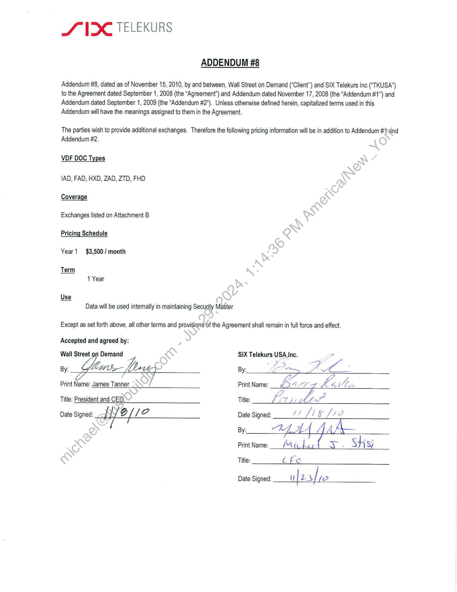
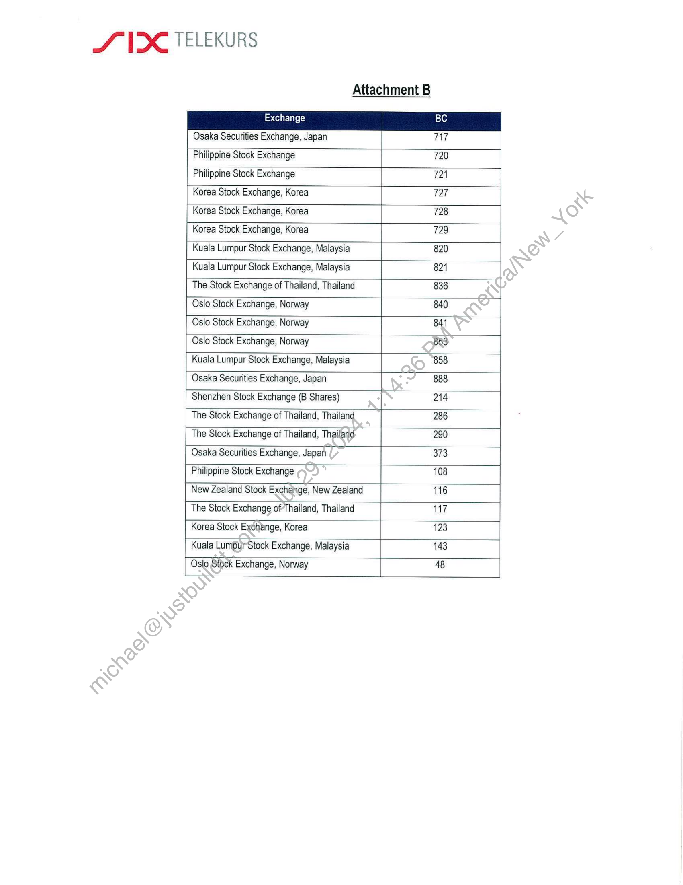

##### Addendum #8 to the Agreement between Wall Street on Demand and SIX Telekurs Inc]

  
````col
```col-md
flexGrow=.5
===
> [!info] [Page 1](_attachments/images_3.6.4.1.22.8SIX_MODVDFAddend_8_Executed20101108.pdf_155010/page_1.png)
> 
```  
```col-md
SVX TELEKURS  
ADDENDUM #8  
Addendum #8, dated as of November 15, 2010, by and between, Wall Street on Demand (“Client”) and SIX Telekurs Inc (“TKUSA”)
to the Agreement dated September 1, 2008 (the “Agreement’) and Addendum dated November 17, 2008 (the “Addendum #1”) and
Addendum dated September 1, 2009 (the “Addendum #2”). Unless otherwise defined herein, capitalized terms used in this
Addendum will have the meanings assigned to them in the Agreement.  
The parties wish to provide additional exchanges. Therefore the following pricing information will be in addition to Addendum #1\and
Addendum #2.  
VDF DOC Types  
IAD, FAD, HXD, ZAD, ZTD, FHD
Coverage  
Exchanges listed on Attachment B  
Pricing Schedule  
Year1 $3,500/ month  
Data will be used internally in maintaining Security Master  
Except as set forth above, all other terms and provisions’of the Agreement shall remain in full force and effect.  
Accepted and agreed by:
Wall Street on Demand SIX Telekurs ae  
Print Name: James. Tanner Sy Print Name: VG, ase Cal Ln  
Title: President and CEO. Title: fee LL a  
Date Signed: wb iie Date Signed: LL [12
By: TAH. L AAA / _
PrintName:_— /iches : Sh Si  
Title: Cfo  
Date Signed: it | 2sfie  
```
````
Notes:    
````col
```col-md
flexGrow=.5
===
> [!info] [Page 2](_attachments/images_3.6.4.1.22.8SIX_MODVDFAddend_8_Executed20101108.pdf_155010/page_2.png)
> 
```  
```col-md
SVC TELEKURS  
Attachment B  
Exchange BC
Osaka Securities Exchange, Japan 717
Philippine Stock Exchange 720
Philippine Stock Exchange 721
Korea Stock Exchange, Korea 727
Korea Stock Exchange, Korea 728
Korea Stock Exchange, Korea 729
Kuala Lumpur Stock Exchange, Malaysia 820
Kuala Lumpur Stock Exchange, Malaysia 821
The Stock Exchange of Thailand, Thailand 836
Oslo Stock Exchange, Norway 840
Oslo Stock Exchange, Norway 841
Oslo Stock Exchange, Norway 859
Kuala Lumpur Stock Exchange, Malaysia 858
Osaka Securities Exchange, Japan 888
Shenzhen Stock Exchange (B Shares) 214
The Stock Exchange of Thailand, Thailand 286
The Stock Exchange of Thailand, Thailand 290
Osaka Securities Exchange, Japan 373
Philippine Stock Exchange 108
New Zealand Stock Exchange, New Zealand 116
The Stock Exchange of Thailand, Thailand 117
Korea Stock Exchange, Korea 123
Kuala Lumpur-Stock Exchange, Malaysia 143
Oslo Stock Exchange, Norway 48  
```
````
Notes:  


![[_attachments/3.6.4.1.22.8 SIX_MOD VDF Addend _8_Executed 20101108.pdf]