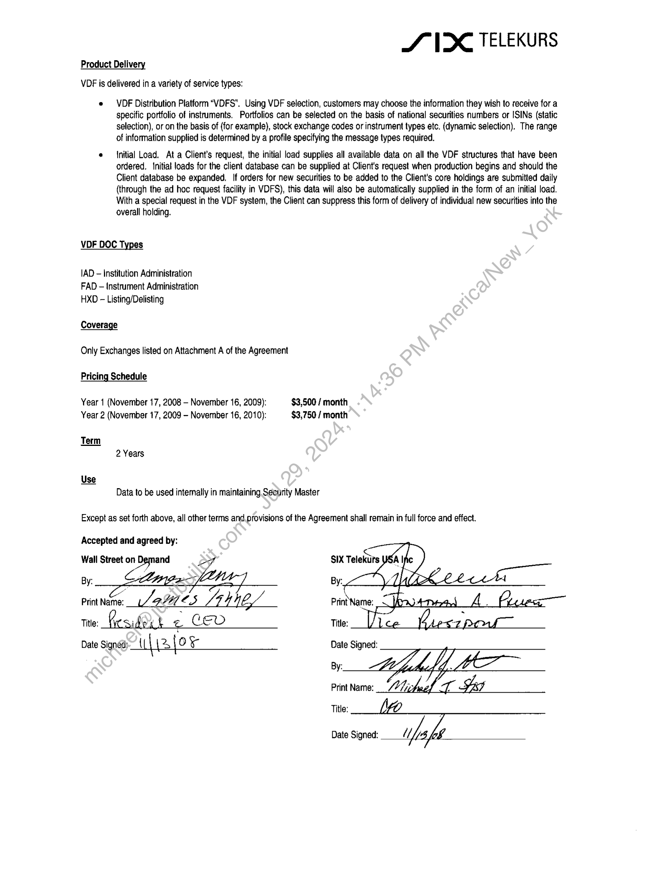

##### VDF Service Agreement]

  
````col
```col-md
flexGrow=.5
===
> [!info] [Page 1](_attachments/images_3.6.4.1.22.9SIX_MODVDFAddend_3_Executed20080901.pdf_155304/page_1.png)
> 
```  
```col-md
Product Delive
VDF is delivered in a variety of service types:  
SVX TELEKURS  
e VDF Distribution Platform “VDFS”. Using VDF selection, customers may choose the information they wish to receive for a
specific portfolio of instruments. Portfolios can be selected on the basis of national securities numbers or ISINs (static
selection), or on the basis of (for example), stock exchange codes or instrument types etc. (dynamic selection). The range
of information supplied is determined by a profile specifying the message types required.  
« — {nitial Load. At a Client's request, the initial load supplies all available data on all the VDF structures that have been
ordered. Initial loads for the client database can be supplied at Client's request when production begins and should the
Client database be expanded. If orders for new securities to be added to the Client's core holdings are submitted daily
(through the ad hoc request facility in VDFS), this data will also be automatically supplied in the form of an initial load.
With a special request in the VDF system, the Client can suppress this form of delivery of individual new securities into the  
overall holding.  
VDF DOC Types
IAD — Institution Administration
FAD — {nstrument Administration  
HXD - Listing/Delisting  
Coverage  
Only Exchanges listed on Attachment A of the Agreement  
Pricing Schedule  
Year 1 (November 17, 2008 - November 16, 2009):
Year 2 (November 17, 2009 - November 16, 2010):  
Data to be used intemally in maintaining Security Master  
$3,500 / month
$3,750 / month  
Except as set forth above, all other terms and.provisions of the Agreement shall remain in full force and effect.  
Accepted and agreed by:  
Wall Street oa
By:  
print Nee. Lah es Li 4 4E/
tte: (reside k ~ CED  
SIX Telekurs  
Date Signed:
By:
Print Name:
Title:  
Date Signed:  
```
````
Notes:  


![[_attachments/3.6.4.1.22.9 SIX_MOD VDF Addend _3_Executed 20080901.pdf]