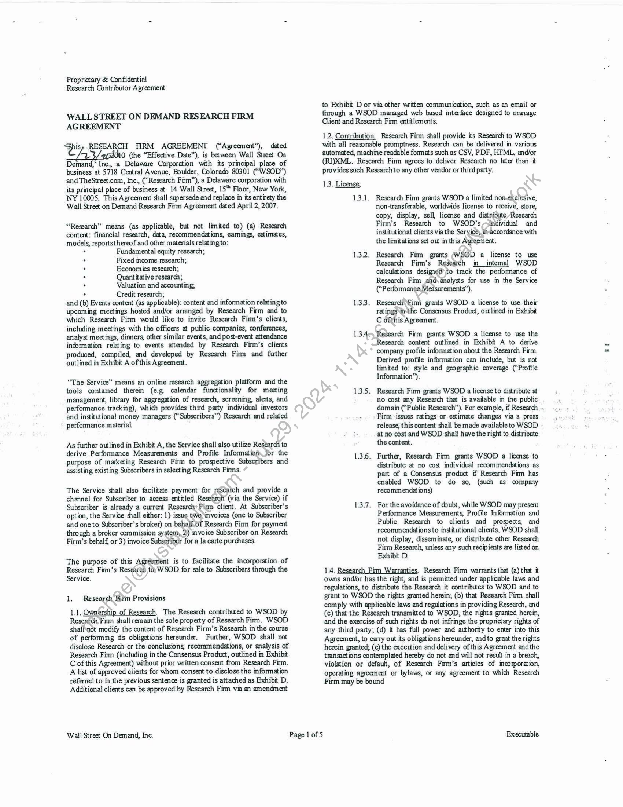

##### Proprietary & Confidential Research Contributor Agreement]

  
````col
```col-md
flexGrow=.5
===
> [!info] [Page 1](_attachments/images_3.6.4.1.3.1TheStreet.com_WSODResearchFirmAgreementExecuted20110223.pdf_155456/page_1.png)
> 
```  
```col-md
Proprietary & Confidential
Research Contributor Agreement  
WALLSTREET ON DEMAND RESEARCH FIRM
AGREEMENT  
His RESEARCH FIRM AGREEMENT (“Agreement”), dated
CAs /acihio (the “Effective Date”), is between Wall Street On
Demand,‘ Inc., a Delaware Corporation with its principal place of
business at 5718 Central Avenue, Boulder, Colorado 80301 (“WSOD”)
and TheStreet.com, Inc., (‘Research Firm”), a Delaware corporation with
its principal place of business at 14 Wall Street, 15" Floor, New York,
NY 10005. This Agreement shall supersede and replace in its entirety the
Wall Street on Demand Research Firm Agreement dated April 2, 2007.  
“Research” means (as applicable, but not limited to) (a) Research
content: financial research, data, recommendations, eamings, estimates,
models, reportsthereof and other materials relating to:  
° Fundamental equity research;
Fixed income research;
Economies research;
Quantitative research;
Valuation and accounting;  
. Credit research;
and (b) Events content (as applicable): content and information relatingto
upcoming meetings hosed and/or arranged by Research Firm and to
which Research Firm would like to invite Research Firm’s clients,
including meetings with the officers at public companies, conferences,
analyst meetings, dinners, other similar events, and post-event attendance
information relating to events attended by Research Firm’s clients
produced, compiled, and developed by Research Firm and futher
outlined in Exhibit A of this Agreement.  
“The Service” means an online research aggregation platform and the
tools contained therein (e.g calendar functionality for meeting
management, library for aggregation of research, screening, alerts, and
performance tracking), which provides third patty individual investors
and institutional money managers (“Subscribers”) Research and related
performance material  
As further outlined in Exhibit A, the Service shall also utilize Restarch to
derive Performance Measurements and Profile Information for the
purpose of marketing Research Firm to prospective Subscribers and
assisting existing Subscribers in selecting Research Firms.  
The Service shall also facilitate payment for réséatch and provide a
channel for Subscriber to access entitled Researclt (via the Service) if
Subscriber is already a current Research’ Pinm client. At Subscriber’s
option, the Service shall either: 1) issue two invoices (one to Subscriber
and one to Subscriber’s broker) on behalf. of Research Firm for payment
through a broker commission system, 2) invoice Subscriber on Research
Firm’s behalf, or 3) invoice Subsgriber for a la carte purchases.  
The purpose of this Agréement is to facilitate the incorporation of
Research Firm’s Research to) WSOD for sale to Subscribers through the
Service.  
1. Research Firm Provisions  
1,1. Qwmership of Research. The Research contributed to WSOD by
Research, Firm shall remain the sole property of Research Fim. WSOD
shall\not modify the content of Research Firm’s Research in the course
of performing its obligations hereunder. Further, WSOD shall not
disclose Research or the conclusions, recommendations, or analysis of
Research Fim (including in the Consensus Product, outlined in Exhibit
C of this Agreement) without prior written consent from Research Firm.
A list of approved clients for whom consent to disclose the information
referred to in the previous sentence is granted is attached as Exhibit D.
Additional clients can be approved by Research Fim via an amendment  
Wall Street On Demand, Inc.  
to Exhibit D or via other written communication, such as an email or
through a WSOD managed web based interface designed to manage
Client and Research Fim entitlements.  
12. Contribution Research Firm shall provide its Research to WSOD
with all reasonable promptness. Research can be delivered in various
automated, machine readable formats such as CSV, PDF, HTML, and/or
(RI)XML. Research Firm agrees to deliver Research no later than it
provides such Researchto any other vendor or third party.  
13. License.  
13.1. Research Firm grants WSOD a limited non-exclusive,
non-transferable, worldwide license to receive, sore,
copy, display, sell, license and distribute Research
Firm’s Research to WSOD’s,-individual and
institutional clients via the Seryicé, invaccordance with
the limitations set out in this Agreement.  
1.3.2. Research Fim grants (WSOD a license to use
Research Firm’s Research in_intemal WSOD
calculations design¢éd’to track the performance of
Research Fim andvanalyss for use in the Service
(“Performanee Measurements”).  
1.33. Research \Fimm grants WSOD a license to use their
ratings tthe Consensus Product, outlined in Exhibit
C ofthis Agreement.  
1.3.46 Research Firm grants WSOD a license to use the
Research content outlined in Exhibit A to derive
company profile information about the Research Firm,
Derived profile information can include, but is not
limited to: style and geographic coverage (“Profile
Information”),  
1.3.5, Research Firm grants WSOD a license to distribute a
no cost any Research that is available in the public
domain (“Public Research”). For example, if Research
Firm issues ratings or estimate changes via a press
release, this content shall be made available to WSOD
at no cost and WSOD shall have the right to distribute
the content.  
1.3.6. Further, Research Firm grants WSOD a license to
distribute at no cost individual recommendations as
part of a Consensus product if Research Firm has
enabled WSOD to do so, (such as company
recommendations)  
1.3.7. For the avoidance of doubt, while WSOD may present
Performance Measurements, Profile Information and
Public Research to clients and propecs, ad
recommendations to institutional clients, WSOD shall
not display, disseminate, or distribute other Research
Firm Research, unless any such recipients are listed on  
Exhibit D.
1.4. Research Fim Warranties. Research Firm warrants that (a) that it  
owns andr has the right, and is permitted under applicable laws and
regulations, to distribute the Research it contributes to WSOD and to
grant to WSOD the rights granted herein; (b) that Research Firm shall
comply with applicable laws and regulations in providing Research, and
(c) that the Research transmitted to WSOD, the rights granted herein,
and the exercise of such rights do not infringe the proprietary rights of
any third party; (d) it has full power and authority to enter into this
Agreement, to carry out its obligations hereunder, and to grant the rights
herein granted; (¢) the execution and delivery of this Agreement andthe
transactions contemplated hereby do not and will not result in a breach,
violation or default, of Research Firm’s articles of incorporation,
operating agreement or bylaws, or any agreement to which Research
Firm may be bound  
Executable  
```
````
Notes:    
````col
```col-md
flexGrow=.5
===
> [!info] [Page 2](_attachments/images_3.6.4.1.3.1TheStreet.com_WSODResearchFirmAgreementExecuted20110223.pdf_155456/page_2.png)
> 
```  
```col-md
Proprietary & Confidential
Research Contributor Agreement  
2. WSOD Provisions  
2.1. The Service. As between the parties, the Service ad all WSOD
materials shall remain the sole property of WSOD. WSOD shall
provide Research Firm access to the Service solely for the purpose of
verifying the accuracy and attribution of Research. Research Firm shall
not modify, decompile, or reverse engineer the Service, in whole or in
part, or any components thereof, and shall immediately inform WSOD
of any knowedge of any attempts made by third parties to modify,
decompile, or reverse engineer any of the Service or components
thereof.  
22. Corrections If Research Firm requests that any Research, be
deleted, replaced, or appended with a correction because such content
contains material errors, or is, or could be subject to a claim that t is
defamatory or obscene, invades the right of privacy, or infringes the
copyright or other rights of any person or entity, WSOD shall comply
with the request within three (3) business days after receiving such
request. If such content has already been distributed by WSOD, WSOD
shall re-send the corrected content to its current customers. However,
the preceding shall not apply to ratings provided by Research Firm. In
no instance shall WSOD be obligated to delete, replace, append with a
correction, or re-send any ratings previously provided by Research Firm.  
2.3. Costs WSOD shall bear all costs relating to the Service and the
transmission of Research via the Service to Subscribers. Research Fim
shall bear all costs relating to the delivery of its Research to WSOD ina
mutually agreeable machine readable format.  
24, Distribution and Pricing. WSOD shall have the non-exclusive
right to market, sell, and license Research, either directly or through
third parties, to Subscribers, only to the extent necessary to fulfill
obligations under this Agreement.  
24.1. Pricing of Research shall be determined by Research
Firm and communicated to WSOD in writing pursuant
to this Section, and Exhibit B for a la carte orders.  
242, Modifications to such pricmg as Research Fim
". determines them during the term of this Agreement,, -» Shall be set forth in writing.  
2.4.3. Subscriptions to Research Firm Research shall “be
entitled on the Service by the Research Firm. For
example, once the Subscriber has signed an_agreement
with Research Firm, Research Firm can entitle the
Subscriber on the Service. WSOD_shall not entitle any
Subscriber to Research Firm.\Research without
Research Firm approval.  
2.4.4. WSOD shall collec no foyalties from the sale of
enterprise subscription) licenses to Research.
Notwithstanding the\forgoing see section 2.4 below
for royalty distributions for the sale of a la carte
subscriptions @r reports see Exhibit C.  
2.4.5. WSOD shallpay Research Firm within 60 days from
the/énd Of each month for any enterprise subscription
revenue collected by WSOD on Research Firm’s
behalf  
2.5. Revenue. Shire from Single Report and Single User Subscription
Distribution. When Research is sold at list price as individual reports or
as individual subscriptions through the Service per the terms in Exhibit
B, WSOD shall retain 5% of the gross revenue received in order to
cover WSOD’s costs of disseminating the Research.  
Within 60 days of the end of each fiscal quarter, WSOD shall pay
Research Firm a portion of the gross revenue as follows: (a)95%of the
gross revenues received by WSOD for the license or sale of Research
Firm’s Research on a per-order basis, and (b) 95% of gross revenues
received by WSOD for the sale of Research Firm’s Research on an
individual subscription basis. In the event that Research is distributed to  
Wall Street On Demand, Inc.  
Page 2 of 5  
multiple subscribers on an ongoing basis, at Research Firm’s written
request, WSOD shall not receive any fees for such distribution. The
revenue share calculation resulting from Research Firm’s participation
in the Consensus Product is set forth in Exhibit C
Reports and Audits. WSOD shall prepare, at the end of each calendar
year, at Research Firm’s written request, a statement showing all
Research Firm revenue paid or payable for such year. WSOD shall
prepare usage readership reports. The reports will either be emailed or
posed to an FTP site. There will be a 30 day embargo period and a 10
day delivery window. The report shall be available by the 10® day of the
month, following an embargo period of 30 days appliedto the lat dayof
readership usage metrics. For exampke, for readership activity taking
place between January | — January 31, the report will be available no
later than March 10°. A sample ofthe readership reports ism Exhibit E.
Research Firm shall have the right, at any time during normal business
hours, and with no Jess than thirty (30) days’ prionsritte notice andno
more than once in any twelve (12) month period to (or appoint an agent
to) inspect and audit WSOD’s books and records neasonably related to
revenue share payments under the Agreement. The party against which
the adjustment is made shall promptly pay the amount of any such
adjustment tothe party that the adjustment favors. Research Firm shall
bear the costs of any such audit unléssithe results of any audit reveal an
understatement of amounts due to’Research Firm of five percent (5%) or
more of the amounts actually\due} in which case WSOD shall reimburse
Research Firm forthe reasonable and documented costs of such audit in
addition to remitting the/understated amounts payable to Research Firm,
Research Firm is efititled to see Research Firm’s own performance and
related revenue Sharepayments, and is not permitted to reviewthe
performance .or related revenue share payments of other providers or
firms.  
26.  
27. Addition and Cancellation of Subscribers. WSOD shall notify
Research Firm within thirty G0) days of any new Subscribers. In the
‘event that a given Subscriber breaches any applicable agreement with
Research Firm or ceases payment, WSOD shall cancel the applicable
portions of the Service to Subscriber within thirty (30) days of being
notified by Research Firm.  
2.8. WSOD_ Warranty. WSOD warrants (a) it has full power and
authority to enter into this Agreement, to carry out its obligations
hereunder, andto grant the rights herein granted; (b) the execution and
delivery of this Agreement and the transactions contemplated hereby do
not and will not result in a breach, violation or default, of WSOD’s
articles of incorporation or bylaws, or any agreement to which WSOD
may be bound; and (c) to WSOD’s knowedge at the time this
Agreement was executed, performance of its duties under this ageement
will not violate the intelicctual property rights of any third party or the
laws or regulations of any governmental, regulatory, or judicial
authority.  
3. General Legal Provisions  
3.1. Tem. This Agreement becomes effective on the Effective Date for
a one(1) year term and automatically renews for additional 1-year terms
unless written notice is given by either party sixty (60) days before the
endoftheterm.  
32.Temination Either paty shall have the right to terminate this
Agreement for material breach by the other party if such breach is not
cured within 30 days from receipt of a written notice of breach from the
other patty. Ifthe breach cannot be cured within thity (30) days, and
the breaching party has begun to cure within the thirty (30) day period,
the cure period shall be extended for a mutually ageeable period of
time, or the Agreement will be terminated in accordance with this
Section and Section 3.3, directly below.  
Research Firm shall have the right to terminate this Agreement if, for  
any two consecutive months, the Royalties due Research Firm under
Section 24 do not exceed the Research Firm’s costs for providing the  
Executable  
```
````
Notes:    
````col
```col-md
flexGrow=.5
===
> [!info] [Page 3](_attachments/images_3.6.4.1.3.1TheStreet.com_WSODResearchFirmAgreementExecuted20110223.pdf_155456/page_3.png)
> 
```  
```col-md
Proprietary & Confidential
Research Contributor Agreement  
Research as specified in Section 2.2. In such case, Research Firm may
terminate the Agreement upon thirty (30) days written notice to WSOD.  
3.3. Effect of Termination. Upon termination or expiration of this
Agreement, upon request, each party shall destroy the other’s data and
materials and any other information shared among the parties for
purposes of performing obligations hereunder, except as prohibited by
law or regulation.  
3.4. Confidentiality. Inthe course ofthe parties’ performance under this
Agreement, the paties may receive or have access to Confidential
Information of the other. “Confidential Information,” shall be defined
herein as: all proprietary information disclosed by a party to the other
and indicated as confidential upon disclosure. Confidential Information
shall not include information that: (a) isknown to the party receiving it
as of the date of disclosure, other than by prior confidential disclosure,
(b) is in the public domain, through no fault of the party receiving it; or
(c) is independently developed by the party receiving it. Each party
shall make best efforts and use at least reasonable care to safeguard the
Confidential Information of the other party as it would its own
Confidential Information. Neither party may use, copy, or disclose, in
any manner, whether oral or written, any Confidential Information ofthe
other, unless (a) it is necessary to perform its obligations under this
Agreement, (b) a party discloses Confidential Information to its
attomeys, accountants and financial advisors, and to third parties
(“Potential Acquirors”) conducting an examination of the party’s
operations in connection with a potential acquisition of all or a portion
of such party’s business if relevant to such examination and provided
that any financial advisor or Potential Acquiror executes a written
agreement agreeing to maintain the confidence of such information on
terms not less restrictive than those contained herein, (c) required by
governmental or judicial order, provided that such party (i) gives the
other party prompt notice of any request to disclose Confidential
Information (whether pursuant to subpoena, interrogatory, deposition,
civil investigative demand, order, regulatory requirement or otherwise
(“Process”)) prior to disclosure of Confidential Information, (ii)
cooperates with the other party as the other patty may request in
connection with any attempt by the other party to prevent, limit or
condition the disclosure of any Confidential Information pursuant’ to  
. such Process and (iii) complies with any protective order, grant of
confidential treatment reques or other limitation that may be impoSed
on the disclosure of the Confidential Information. Each,party shall
promptly notify the other party of any actual or suspected unauthorized
use or disclosure of Confidential Information.  
3.5. Limitations. Each Party acknowledges that) other than the
foregomg warranties, the other party makes no( warranties, express or
implied, regarding any software, information) Service or services
provided under this Agreement, including those of merchantability and
fitness for a particular purpose. WSOD’s Service and Research Firm’s
Research are provided on an as-néeded, pemission basis, “as is.”
WSOD makes no warranty or représehtation that its operation shall be
uninterrupted or error free atid shall have no liability arising from
interruptions in or errors in the operation of the Service. WSOD makes
no warranty regarding*and)shall have no liability arising from the
display or distribution of research, the erroneous delivery of research or
inaccuracy, invalidity, or incompleteness of research.  
3.6. Indemnity. “Bach of the parties agrees to indemnify and hold
harmless the-other (including its affiliates, partners, officers, directors,
employees, agents, and representatives) agains any third paty claims,
threatenéd-claims, and/or liabilities of any nature, mcluding reasonable
attomey’s fees, arising out of or relating to any breach of the warranties
or obligations of the parties pursuant to this Agreement (the breaching
party being the “Indemnifying Party” and the other party being the
“Indemnified Party.”). The Indemnifying Party in its sole discretion
may settle any such claim by substituting non-infringing products,
software, or services for any infringing products, software, or services.
The indemnifying party shall not enter into any settlement or consent to
any order that could adversely affect the validity or enforceability of the
intellectual property of the other party without consent. The  
Wall Street On Demand, Inc. Page 3 of 5  
Indemnified Party shall give the Indemnifying Pasty (a) prompt written
notice of the claim or threat of such claim; (b) the right to control and
direct the defense and settlement of the claim or threatened claim; and
(c) reasonable assistance and information pataining to the claim or
threatened clam. The Indemnifying Party shall have no liability for
damages caused by the Indemnified party’s breach of this Section.  
3.7. Limitations on Liability. In no event shall either paty be liable for
any special, indirect, or consequential damages arising out of provision
of the Services or Research or the use or mability to use the Service‘or
Research by any Party, or third party, or any term of this Agreement
regardless of the form of the action, and even if the other party to’this
Agreement or third party has been advised of the possibility of such
damages, the other party shall not have any liability with tespect to any
loss or damage related to any failure of the Service-or Research or
decisions made by or obtained through the use\of the Service or
Research.  
3.8. Publicity. Each party may disclosetherexistence and nature oftheir
relationship under this Agreement. WSQD shall be permitted to display
Research Firm’s name and logo in préssfeleases, client lists, marketing
materials, and annual and other reports, provided that such name and
logo are not afforded any particular prominence versus any other
research firm, and provided further that with regard to press releases
only, neither party shall_make any public announcement without the
other’s prior consent ,  
3.9. Independent(Partiés Neither party is an employee, agent, coventurer, or Iéga! ‘representative of the other for any purpose. The
parties are independent contractors.  
3.10. Notices. All notices to be given shall be in writing delivered
to the address set forth herein or sent by facsimile. The facsimile
numbers are (303) 444-2586 for WSOD and 212-321-5010 for Research
Firm. Notices shall be sent attention: Sofia Rossato for WSOD and
attention General Counsel for Research Firm. Each notice shall be
effective (a) if delivered by hand or by nationally recognized courier
service, when delivered at the address set forth herein and(b) if given by
certified mail, three (3) business days after the posting (postage prepaid)
thereof. Notifications via electronic mail to the following people shall be
deemed acceptable for the purposes of adding Subscribers:  
WSOD Representative Name: Sofia Rossato
Email: sofia@walls.com  
Research Firm Representative Name: Christopher Stuart
Email: Christopher. Stuart@thesreet.com  
3.11. Goveming Law. This Agreement shall be govemed by and
construed under the laws of the State of New York, without regard to its
provisions goveming conflicts of law. Each party hereby irrevocably
submits to the exclusive general jurisdiction of the courts of the State of
New York, County of New York andthe district court of the United
States of America for the Southern District of New York and waives the
defenses of improper venue or inconvenient forum for the maintenance
of any action arising out of or relating to this Ageement.  
3.12. Taxes. WSOD shall not be responsible for any taxes or duties
incurred or imposed by any relevant taxing authority through the sale of
Research Firm’s Research to Subscribers, including but not limited to
sales, excise, value added, or use taxes. Any applicable taxes shall be
included inthe cos of the Research, as determined by Research Firm.  
3.13. Entire Agreement, Amendment, and Waiver, This Agreement
contains the entire understanding and agreement between the parties
regarding the Service. It supersedes any prior contribution agreements
between the patties, and any prior agreements, written or oral, regarding
the Service. This Agreement may not be modified or amended except in
a writing signed by both parties No waiver shall be effective unless
made in a writing signed by the party agams: whom enforcement of such
waiver is sought. No waiver of any term or condition or of any breach
of this Ageement shall be deemed a continuing waiver or a waiver of  
Executable  
```
````
Notes:    
````col
```col-md
flexGrow=.5
===
> [!info] [Page 4](_attachments/images_3.6.4.1.3.1TheStreet.com_WSODResearchFirmAgreementExecuted20110223.pdf_155456/page_4.png)
> 
```  
```col-md
Proprietary & Confidential
Research Contributor Agreement  
any other tem or condition or of any later breach of the Agreement. All
rights and remedies, whether conferred by this Agreement, by any other
instrument or by law, shall be cumulative, and may be exercised
singularly or concurrently. Except asmay be expressly provided herein,
this Agreement is not intended to confer any rights or remedies upon
any person other than the parties hereto.  
3.14, Assignment. This Agreement shall not be assigned without
the written consent of the other party, except to an affiliate of the
assigning party or to the purchaser of the business to which it relates, so
long as such affiliate or purchaser is not a direct competitor of the other
party. Any other attempted assignment shall be void. This Agreement
shall bind permitted successors and assigns.  
3.15. Severability. If any term or provision of this Agreement is
held to be invalid or unenforceable, such term or provision shall be
ineffective only to the extent of such invalidity or unenforceability and
the remainder ofthis Agreement shall continue in full force and effect.  
ACCEPTED
WALL STREET ON DEMAND, INC.  
3.16, Survival. The following Sections shall remain in effect and
survive expiration and/or termination of this Agreement; Ownership of
Research, Research Firm Warranties, The Service, WSOD Warranty and
all Sections under General Legal Provisions.  
SAT. unt Deliver atures This Agreement may
be executed in one or more counterparts, both of which shall be
considered one and the same agreement and shall become effective
when one or more counterparts have been signed by each party and
delivered to the other party, it beng undersood that both parties need:
not sign the same counterpart. Signatures delivered via facsintilevor
electronically in PDF format shall be deemed originals for all.purposes.  
ACCEPTED  
/) The Street. com> Luc.  
: Richa rd & foitmar
Chie Hecéuntin Office —  
DATE.OF SIGNATURE  
v/os /oen  
President & CEO
DATE OF SIGNATURE  
L24/ 1  
Wall Street On Demand, Inc. Page 4 of 5 Executable  
```
````
Notes:    
````col
```col-md
flexGrow=.5
===
> [!info] [Page 5](_attachments/images_3.6.4.1.3.1TheStreet.com_WSODResearchFirmAgreementExecuted20110223.pdf_155456/page_5.png)
> 
```  
```col-md
Proprietary & Confidential
Research Contributor Agreement.  
Exhibit A - Information Provided to WSOD by the Research Firm
Content Type:
[Please describe the Research content type to beprovided to WSOD, for examp!e, Fundamental Equities, Economics Research
Quantitative Research, Valuation and Accounting Research, Calendar and Events Data]  
Example of Research Firm Research:  
Regions Covered:
In formation needed for performance calcul ations
Research Firm shall send the following data to WSOD whenever Research Firm issues a recommendation on a individual sock:  
Analyst Covering the Stock (if applicable)  
Date of Recommendation  
Time of Recommendation  
Stock Ticker  
Exchange  
Company name  
Other unique identifier (such as CUSIP, SEDOL, etc.)
Recommendation  
Target Price (if applicable) 5
12-month EPS forecast (if applicable)  
In addition, Research Firm shall send a one-time history file which includes 3-5 years of history (if availablé)/ Finally, the data listed above represents a
minimum amount of information needed to calculate Performance Measurements and derive Research Firm Profile Information. We would also invitethe
Research Firmto identify and contribute meta data that will further help in the marketing of the servicet& prospective clients. For example, headlines and
abstracts of the research could be made available to prospects (as they are currently via other research platforms).  
wi  
Many Research Firs already submit this data to external performance evaluation systems Wecm accommodate your pre-existing outbound feed formats in
orderto save you development time.  
The information outlined above will be used to develop performance measurements ofthe Service. Performance measures will be used to market the Research
Firm’s products on the Service.  
Research Library *  
WSOD shall integrate research feeds from Research Firm into the Service for the purpose of providing subscribers a platform to purchase a la carte research,
individual subscriptions or contact the Research Firm for a direct licenSe1 enterprise subscriptions If the subscriber is already a current subscriber of the
content, WSOD will service that agreement by providing access the entitled research, via the Service.  
A lacarte research pricing is outlined in Exhibit B- Research bibraty Retail Pricing, ofthis Agreement.  
Calendar
The Service also includes a Research Calendar, an interface that helps investors manage internal and external events, and leam about new upcoming events  
based ontheir interests. If applicable, Research Finti shall contribute forward looking event information to WSOD in a machine readable format and WSOD
shall integrate such content intothe Calendar.  
Event content and information relates to upedming meetings hosted and/or arranged by Research Firm andto which Research Firm would like to invite  
Research Firm’s clients, including meétiigs“with the officers at public companies, conferences, analyst meetings, dinners, other similar events, and post-event
attendance information relating to events attended by Research Firm’s clients.  
Wall Street On Demand, Inc. Page 5 of 7 Executable  
```
````
Notes:    
````col
```col-md
flexGrow=.5
===
> [!info] [Page 6](_attachments/images_3.6.4.1.3.1TheStreet.com_WSODResearchFirmAgreementExecuted20110223.pdf_155456/page_6.png)
> 
```  
```col-md
Proprietary & Confidential
Research Contributor Agreement  
Exhibit B — ResearchTeam Consensus Product  
The ResearchTeam Consensus Product (“Consensus Product”) is comprised of several reports which aggregate ratings from mutkiple research sources to create an
overall consensus rating. The reports include but are not limitedto: a company consensus report, list-based reports (eg. upgrades, downgrades, coverage list, select
list) and an overall team performance report (showing performance of the team across all covered companies).  
Per Sections 1.3.2 and 1.3.3 ofthis Agreement, Research Firm shall agree to participate in the Consensus Product.  
At WSOD’s discretion, WSOD can include Research Firm’s ratings in the Consensus Product. WSOD can also measure the performance of Research Fitm’s
ratings, and such performance results may be included in Consensus Product. If Research Firm is atop performer, WSOD can, at WSOD’s discretion, include the
Research Firm’s name in the Consensus Product.  
The following section describes the calculation used to determinethe revenue sharing arrangement for those research firms included in the Conséasus Product:  
1. Net Quarterly Subscription Revenue is defined as revenue collected for the Consensus Product, minus applicable taxes'atid service fees (ie. credit
card fees), such service fees not to exceed 5% of such revenue.
Research Pool Share is defined as 90% of the Net Quarterly Subscription Revenue.
‘WSOD’s Share is defined as 10% of the Net Quarterly Subscription Revenue.
The Research Pool Share shall be distributed among those research firms included in the Consensus Produtt,using the following calculation:
The portion of the Research Pool Share given to each research firm will consist of two sections: a)Flat Participation Allocation payment and a
Performance Based Allocation Share payment.
a. The Flat Participation Allocation is defined as 30% of the Research Pool Share. The Flat Participation Allocation shall be divided into
equal payments across all research firms included in the Consensus Product.
b. The Performance-Based Allocation is defined as 70% of the Research Pool Share The Performance-Based Allocation payment shall be
determined based on the calculation described below.
i. The Performance-Based Allocation payment will be determined based on the performance generated by the research firms
for the securities mcluded in the Consensus Product.
ii, On a quarterly basis, WSOD will measure the performance of the research firms’ ratings on individual securities using a net
total retums-based performance methodology.  
iii, Theresearch firm with the top performance in 4 giyen security will be allocated a Symbol Score (defined below), based on
the coverage universe of the winning research fitm in the Consensus Product and the number of other research firms that
provide a rating forthe given security.  
iv.  ?]The Symbol Score is defined as the'imber of research firms covering the symbol, multiplied by the inverse of the number
of symbols covered by the winning research firm within the Consensus Product.  
1. For example,
a.  Ifresearch, firm A has the top performance (is the winner) for MSFT,
b. _ and research firm A covers 500 symbols in the Consensus Product,
c.  andthere are 10 other firms covering MSFT inthe Consensus Product,
d. (the symbol score for research firm A on MSFT would be 0.02 points.
2. Inanotherexample,
a. if research firm B had the top performance (is the winner) for [BM,
b. and there were 20 other providers covering IBM,
c. and research firm B had a coverage universe of 20,
d. the Symbol Score for IBM for research firm B would be | point.  
v. . THe Dotal Score for a given research firm is defined asthe sum of all Symbol Scores for the given research firm, divided by
theltotal sum of all Symbol Scores allocated to all research firms.  
1. For example, if research firm A had 100 points acrossall of ther Symbol Scores,  
Wee  
2.  andthere were a total of 1,000 points across all Symbol Scores,
3. the Total Score for research firm A would be 10%.  
vi. The Performance-Based Allocation Share is defined as the Total Score multiplied by the Performance-Based Allocation
(defined above). For example, If the Total Score is 10%, the Performance Based Allocation Share for the given research firm
is 7% (= 10%*70%)  
c. For purposes of illustration only,
i. ifthe Research Pool Share is $100,
ii. andthe Total Score for research firm A is 10%,
iii, andthe total number of research firms in the Consensus Product is 15,
iv. the total quarterly payment toresearch firm A would be $9.  
Wall Street On Demand, Inc. Page 6 of 7 Executable  
```
````
Notes:    
````col
```col-md
flexGrow=.5
===
> [!info] [Page 7](_attachments/images_3.6.4.1.3.1TheStreet.com_WSODResearchFirmAgreementExecuted20110223.pdf_155456/page_7.png)
> 
```  
```col-md
Proprietary & Confidential
Research Contributor Agreement  
6. The Rescarch Pool Share shall be paid by WSOD to esearch Firm on a quarterly basis, perthe calculations outlined inthis section.  
WSOD has the right to change or adjust the calculation at any point in time. The calculation of revenue share payments under this Exhibit C is subject to the
reporting obligations and audit rights set forth in Section 2.5.  
Exhibit C — Research Library Entitled Client List  
Please select which clients you would like to permission your Research to. Additional clients may be pemissioned via email, or in a future phase through a WSOD
hosed entitlements interface.  
O Texas Pacific Group (TPG) — Axon
© Goldman Sachs Invesment Partners (GSIP)  
1 Wellington Management Company  
Exhibit D — Usage Reporting File Specification  
The Research Usage Report is a collection of usage data storedat WSOD, compiled with User data from the epplication and meta-data from each ofthe
individual research documents accessed by the end user. The report will havea comma delimited file formatand will include the following fields:  
Name Type Description  
AccessTime Datetime UTC date/time the research document was réquested  
User ID String WSOD client unique end user ID string.  
UserName String First and Last name of the end user.  
UserEmail String Email address of the end user  
Firm String Firm name of the end user  
WSODDocID String WSOD Internal Doturnent ID unique identifying a specific
document  
ExternaIDocID String Research firrh’s Document ID, if provided by the research firm in  
the document’s meta data.  
Title String Title from the research document, if provided by the research firm
inthe document’s meta data.  
Symbols List Pipe delimited list of symbols referenced in the document, if
provided by the research firm in the document’s meta data.
Symbols will be listed using the research firm’s symbol set as
provided inthe meta data accompanying the document.  
Rating String Pipe delimited list of Rating(s), if provided by the research firm in
the document’s meta data.  
Author ‘String Pipe delimited list of Author(s) of the Document, if provided by
the research firm in the document’s meta data.  
DocumentDate Date/Time Date of the document  
Delivery: The reports will either be emailed or postedto an FTP site. There will be a 30 day embargo period and a 10 day delivery window. The report shall be
available by the 10° day ofthe month, following an embargo period of 30 days applied to the las day of readership usage metrics. For example, for readership
activity taking place between January 1 —January 31, the report will be available no later than March 10"  
Wall Street On Demand, Inc. Page 7 of 7 Executable  
```
````
Notes:  


![[_attachments/3.6.4.1.3.1 TheStreet.com_WSOD Research Firm Agreement Executed 20110223.pdf]