##### Content Redistribution License Agreement]

  
````col
```col-md
flexGrow=.5
===
> [!info] [Page 1](_attachments/images_3.6.4.1.4.1Briefing_MODLicenseAgreementExecuted20031201.pdf_155144/page_1.png)
> 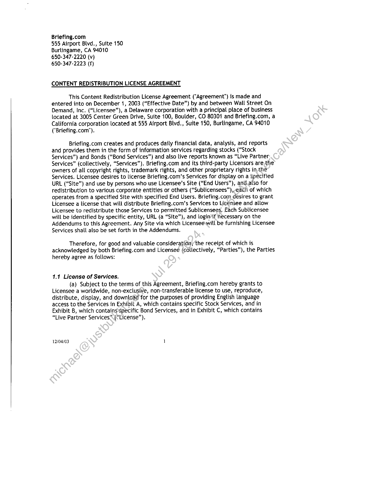
```  
```col-md
Briefing.com  
555 Airport Blvd., Suite 150
Burlingame, CA 94010
650-347-2220 (v)
650-347-2223 (f)  
CONTENT REDISTRIBUTION LICENSE AGREEMENT  
This Content Redistribution License Agreement ("Agreement") is made and
entered into on December 1, 2003 (“Effective Date”) by and between Wall Street On
Demand, Inc. (“Licensee”), a Delaware corporation with a principal place of business
located at 3005 Center Green Drive, Suite 100, Boulder, CO 80301 and Briefing.com, a
California corporation located at 555 Airport Blvd., Suite 150, Burlingame, CA 94010
("Briefing.com").  
Briefing.com creates and produces daily financial data, analysis, and reports
and provides them in the form of information services regarding stocks (“Stock
Services”) and Bonds (“Bond Services”) and also live reports known as “Live Partner
Services” (collectively, “Services”). Briefing.com and its third-party Licensors are the
owners of all copyright rights, trademark rights, and other proprietary rights in the
Services. Licensee desires to license Briefing.com’s Services for display on a Specified
URL (“Site”) and use by persons who use Licensee’s Site (“End Users”), and.also for
redistribution to various corporate entities or others (“Sublicensees”),-each of which
operates from a specified Site with specified End Users. Briefing.com desires to grant
Licensee a license that will distribute Briefing.com’s Services to Licensee and allow
Licensee to redistribute those Services to permitted Sublicensees. Each Sublicensee
will be identified by specific entity, URL (a “Site”), and login’if necessary on the
Addendums to this Agreement. Any Site via which Licensee will be furnishing Licensee
Services shall also be set forth in the Addendums.  
Therefore, for good and valuable consideration, the receipt of which is
acknowledged by both Briefing.com and Licensee (collectively, “Parties”), the Parties
hereby agree as follows:  
1.1 License of Services.  
(a) Subject to the terms of this Agreement, Briefing.com hereby grants to
Licensee a worldwide, non-exclusive, non-transferable license to use, reproduce,
distribute, display, and download for the purposes of providing English language
access to the Services in Exhibit A, which contains specific Stock Services, and in
Exhibit B, which containsspeécific Bond Services, and in Exhibit C, which contains
“Live Partner Services’. (“License”).  
12/04/03 1  
```
````
Notes:    
````col
```col-md
flexGrow=.5
===
> [!info] [Page 2](_attachments/images_3.6.4.1.4.1Briefing_MODLicenseAgreementExecuted20031201.pdf_155144/page_2.png)
> 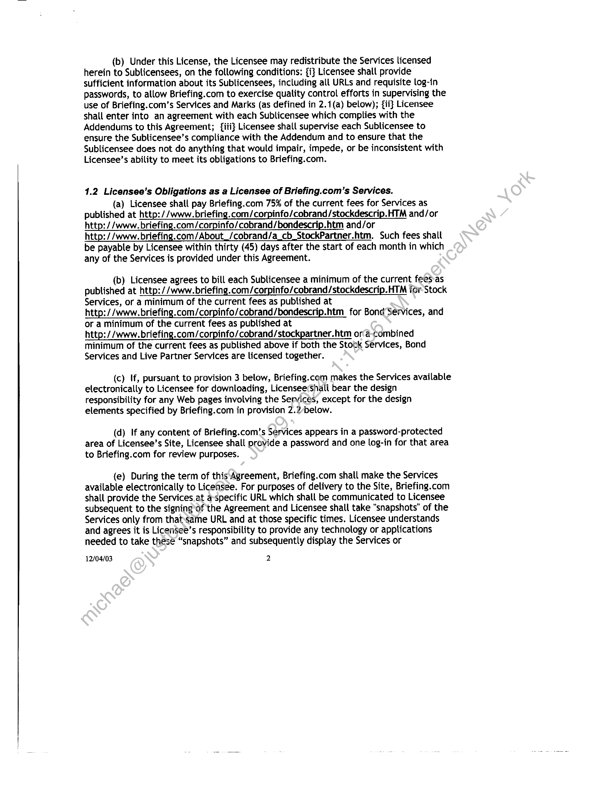
```  
```col-md
(b) Under this License, the Licensee may redistribute the Services licensed
herein to Sublicensees, on the following conditions: {i} Licensee shall provide
sufficient information about its Sublicensees, including all URLs and requisite log-in
passwords, to allow Briefing.com to exercise quality control efforts in supervising the
use of Briefing.com’s Services and Marks (as defined in 2.1(a) below); {ii} Licensee
shall enter into an agreement with each Sublicensee which complies with the
Addendums to this Agreement; {iii} Licensee shall supervise each Sublicensee to
ensure the Sublicensee’s compliance with the Addendum and to ensure that the
Sublicensee does not do anything that would impair, impede, or be inconsistent with
Licensee’s ability to meet its obligations to Briefing.com.  
1.2 Licensee’s Obligations as a Licensee of Briefing.com’s Services.  
(a) Licensee shall pay Briefing.com 75% of the current fees for Services as
published at http: //www.briefing.com/corpinfo/cobrand/stockdescrip.HTM and/or
http://www. briefing.com/corpinfo/cobrand/bondescrip.htm and/or  
http://www. briefing.com/About_/cobrand/a_cb_StockPartner.htm. Such fees shall
be payable by Licensee within thirty (45) days after the start of each month in which  
any of the Services is provided under this Agreement.  
(b) Licensee agrees to bill each Sublicensee a minimum of the current fees-as
published at http://www.briefing.com/corpinfo/cobrand/stockdescrip.HTM for Stock
Services, or a minimum of the current fees as published at  
http://www. briefing.com/corpinfo/cobrand/bondescrip.htm for Bond Services, and
or a minimum of the current fees as published at  
http://www. briefing.com/corpinfo/cobrand/stockpartner.htm ora-combined
minimum of the current fees as published above if both the Stock Services, Bond
Services and Live Partner Services are licensed together.  
(c) If, pursuant to provision 3 below, Briefing.com makes the Services available
electronically to Licensee for downloading, Licensee Shall bear the design
responsibility for any Web pages involving the Services, except for the design
elements specified by Briefing.com in provision 2.2/below.  
(d) If any content of Briefing.com’s Services appears in a password-protected
area of Licensee’s Site, Licensee shall provide a password and one log-in for that area
to Briefing.com for review purposes.  
(e) During the term of this Agreement, Briefing.com shall make the Services
available electronically to Licensee. For purposes of delivery to the Site, Briefing.com
shall provide the Services.at a-specific URL which shall be communicated to Licensee
subsequent to the signing-of the Agreement and Licensee shall take “snapshots” of the
Services only from thatsame URL and at those specific times. Licensee understands
and agrees it is Licensee’s responsibility to provide any technology or applications
needed to take thesé “snapshots” and subsequently display the Services or  
12/04/03 2  
```
````
Notes:    
````col
```col-md
flexGrow=.5
===
> [!info] [Page 3](_attachments/images_3.6.4.1.4.1Briefing_MODLicenseAgreementExecuted20031201.pdf_155144/page_3.png)
> 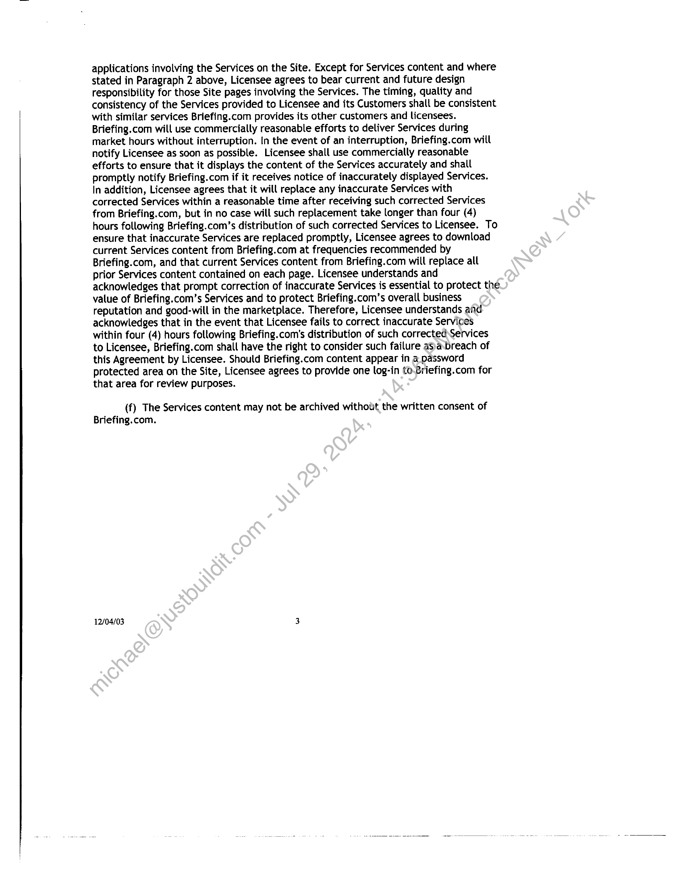
```  
```col-md
applications involving the Services on the Site. Except for Services content and where
stated in Paragraph 2 above, Licensee agrees to bear current and future design
responsibility for those Site pages involving the Services. The timing, quality and
consistency of the Services provided to Licensee and its Customers shalt be consistent
with similar services Briefing.com provides its other customers and licensees.
Briefing.com will use commercially reasonable efforts to deliver Services during
market hours without interruption. In the event of an interruption, Briefing.com will
notify Licensee as soon as possible. Licensee shall use commercially reasonable
efforts to ensure that it displays the content of the Services accurately and shall
promptly notify Briefing.com if it receives notice of inaccurately displayed Services.
In addition, Licensee agrees that it will replace any inaccurate Services with
corrected Services within a reasonable time after receiving such corrected Services
from Briefing.com, but in no case will such replacement take longer than four (4)
hours following Briefing.com’s distribution of such corrected Services to Licensee. To
ensure that inaccurate Services are replaced promptly, Licensee agrees to download
current Services content from Briefing.com at frequencies recommended by
Briefing.com, and that current Services content from Briefing.com will replace all
prior Services content contained on each page. Licensee understands and
acknowledges that prompt correction of inaccurate Services is essential to protect the
value of Briefing.com’s Services and to protect Briefing.com’s overall business
reputation and good-will in the marketplace. Therefore, Licensee understands and
acknowledges that in the event that Licensee fails to correct inaccurate Services
within four (4) hours foltowing Briefing.com’s distribution of such corrected Services
to Licensee, Briefing.com shall have the right to consider such failure asa breach of
this Agreement by Licensee. Should Briefing.com content appear in a password
protected area on the Site, Licensee agrees to provide one log-in to-Briefing.com for
that area for review purposes.  
(f) The Services content may not be archived without the written consent of
Briefing.com.  
12/04/03 3  
```
````
Notes:    
````col
```col-md
flexGrow=.5
===
> [!info] [Page 4](_attachments/images_3.6.4.1.4.1Briefing_MODLicenseAgreementExecuted20031201.pdf_155144/page_4.png)
> 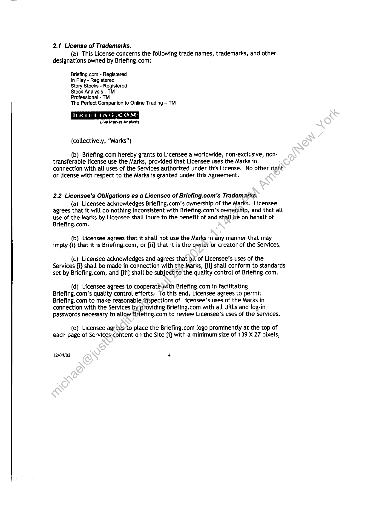
```  
```col-md
2.1 License of Trademarks.
(a) This License concerns the following trade names, trademarks, and other
designations owned by Briefing.com:  
Briefing.com - Registered  
In Play - Registered  
Story Stocks - Registered  
Stock Analysis - TM  
Professional - TM  
The Perfect Companion to Online Trading - TM  
BRIEFING.COM
Live Market Analysis  
(collectively, “Marks”)  
(b) Briefing.com hereby grants to Licensee a worldwide, non-exclusive, nontransferable license use the Marks, provided that Licensee uses the Marks in
connection with all uses of the Services authorized under this License. No other right
or license with respect to the Marks is granted under this Agreement.  
2.2 Licensee’s Obligations as a Licensee of Briefing.com’s Trademaris.  
(a) Licensee acknowledges Briefing.com’s ownership of the Marks. Licensee
agrees that it will do nothing inconsistent with Briefing.com’s ownership, and that all
use of the Marks by Licensee shall inure to the benefit of and shall be on behalf of
Briefing.com.  
(b) Licensee agrees that it shall not use the Marks in any manner that may
imply {i} that it is Briefing.com, or {ii} that it is the owner or creator of the Services.  
(c) Licensee acknowledges and agrees that all of Licensee’s uses of the
Services {i} shall be made in connection with the.Marks, {ii} shall conform to standards
set by Briefing.com, and {iii} shall be subject)to the quality control of Briefing.com.  
(d) Licensee agrees to cooperate with Briefing.com in facilitating
Briefing.com’s quality control efforts. To this end, Licensee agrees to permit
Briefing.com to make reasonable inspections of Licensee’s uses of the Marks in
connection with the Services by providing Briefing.com with all URLs and log-in
passwords necessary to allow Briefing.com to review Licensee’s uses of the Services.  
(e) Licensee agrees to place the Briefing.com togo prominently at the top of
each page of Services:content on the Site {i} with a minimum size of 139 X 27 pixels,  
12/04/03 4  
```
````
Notes:    
````col
```col-md
flexGrow=.5
===
> [!info] [Page 5](_attachments/images_3.6.4.1.4.1Briefing_MODLicenseAgreementExecuted20031201.pdf_155144/page_5.png)
> 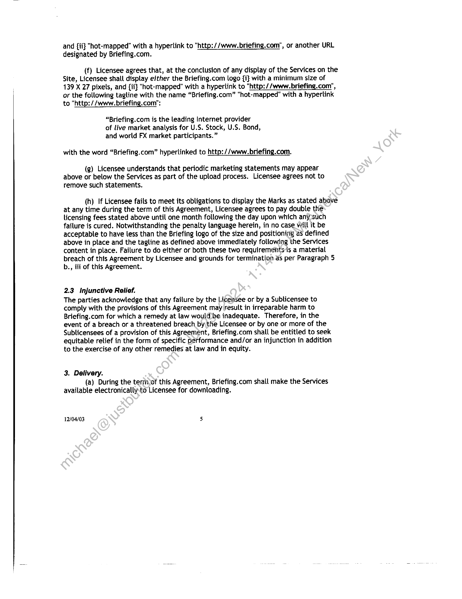
```  
```col-md
and {ii} "hot-mapped” with a hyperlink to "http://www. briefing.com”, or another URL
designated by Briefing.com.  
(f) Licensee agrees that, at the conclusion of any display of the Services on the
Site, Licensee shall display either the Briefing.com logo {i} with a minimum size of
139 X 27 pixels, and {ii} "hot-mapped” with a hyperlink to "http://www. briefing.com",
or the following tagline with the name “Briefing.com” "hot-mapped” with a hyperlink  
to "http://www. briefing.com”:  
“Briefing.com is the leading Internet provider
of live market analysis for U.S. Stock, U.S. Bond,
and world FX market participants.”  
with the word “Briefing.com” hyperlinked to http: //www.briefing.com.  
(g) Licensee understands that periodic marketing statements may appear
above or below the Services as part of the upload process. Licensee agrees not to
remove such statements.  
(h) If Licensee fails to meet its obligations to display the Marks as stated above
at any time during the term of this Agreement, Licensee agrees to pay double the
licensing fees stated above until one month following the day upon which any-such
failure is cured. Notwithstanding the penalty language herein, in no case will it be
acceptable to have less than the Briefing logo of the size and positioning as defined
above in place and the tagline as defined above immediately following the Services
content in place. Failure to do either or both these two requirements is a material
breach of this Agreement by Licensee and grounds for termination.as per Paragraph 5
b., iii of this Agreement.  
2.3 Injunctive Relief.  
The parties acknowledge that any failure by the Licensee or by a Sublicensee to
comply with the provisions of this Agreement may result in irreparable harm to
Briefing.com for which a remedy at law woul@be inadequate. Therefore, in the
event of a breach or a threatened breach by the Licensee or by one or more of the
Sublicensees of a provision of this Agreement, Briefing.com shall be entitled to seek
equitable relief in the form of specific performance and/or an injunction in addition
to the exercise of any other remedies at law and in equity.  
3. Delivery.
(a) During the termof this Agreement, Briefing.com shall make the Services
available electronically:to Licensee for downloading.  
12/04/03 5  
```
````
Notes:    
````col
```col-md
flexGrow=.5
===
> [!info] [Page 6](_attachments/images_3.6.4.1.4.1Briefing_MODLicenseAgreementExecuted20031201.pdf_155144/page_6.png)
> 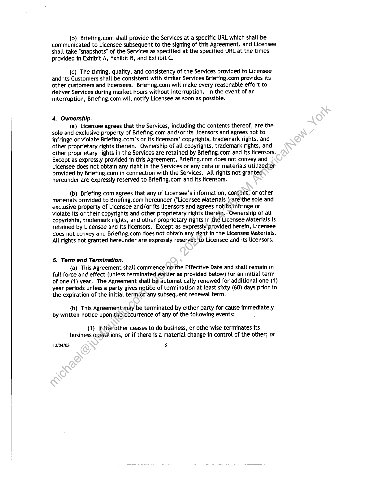
```  
```col-md
(b) Briefing.com shall provide the Services at a specific URL which shall be
communicated to Licensee subsequent to the signing of this Agreement, and Licensee
shall take "snapshots" of the Services as specified at the specified URL at the times
provided in Exhibit A, Exhibit B, and Exhibit C.  
(c) The timing, quality, and consistency of the Services provided to Licensee
and its Customers shall be consistent with similar Services Briefing.com provides its
other customers and licensees. Briefing.com will make every reasonable effort to
deliver Services during market hours without interruption. In the event of an
interruption, Briefing.com will notify Licensee as soon as possible.  
4, Ownership.  
(a) Licensee agrees that the Services, including the contents thereof, are the
sole and exclusive property of Briefing.com and/or its licensors and agrees not to
infringe or violate Briefing.com’s or its licensors’ copyrights, trademark rights, and
other proprietary rights therein. Ownership of all copyrights, trademark rights, and
other proprietary rights in the Services are retained by Briefing.com and its licensors.
Except as expressly provided in this Agreement, Briefing.com does not convey and
Licensee does not obtain any right in the Services or any data or materials utilized-or
provided by Briefing.com in connection with the Services. All rights not granted
hereunder are expressly reserved to Briefing.com and its licensors.  
(b) Briefing.com agrees that any of Licensee’s information, content, or other
materials provided to Briefing.com hereunder ("Licensee Materials”)are the sole and
exclusive property of Licensee and/or its licensors and agrees not'to infringe or
violate its or their copyrights and other proprietary rights therein. Ownership of all
copyrights, trademark rights, and other proprietary rights in the Licensee Materials is
retained by Licensee and its licensors. Except as expressly provided herein, Licensee
does not convey and Briefing.com does not obtain any right in the Licensee Materials.
All rights not granted hereunder are expressly reserved to Licensee and its licensors.  
§. Term and Termination.  
(a) This Agreement shall commence on the Effective Date and shall remain in
full force and effect (unless terminated eartier as provided below) for an initial term
of one (1) year. The Agreement shall be automatically renewed for additional one (1)
year periods unless a party gives notice of termination at least sixty (60) days prior to
the expiration of the initial term(r any subsequent renewal term.  
(b) This Agreement:may be terminated by either party for cause immediately
by written notice upon the occurrence of any of the following events:  
(1) Ifthe other ceases to do business, or otherwise terminates its
business operations, or if there is a material change in control of the other; or  
12/04/03 6  
```
````
Notes:    
````col
```col-md
flexGrow=.5
===
> [!info] [Page 7](_attachments/images_3.6.4.1.4.1Briefing_MODLicenseAgreementExecuted20031201.pdf_155144/page_7.png)
> 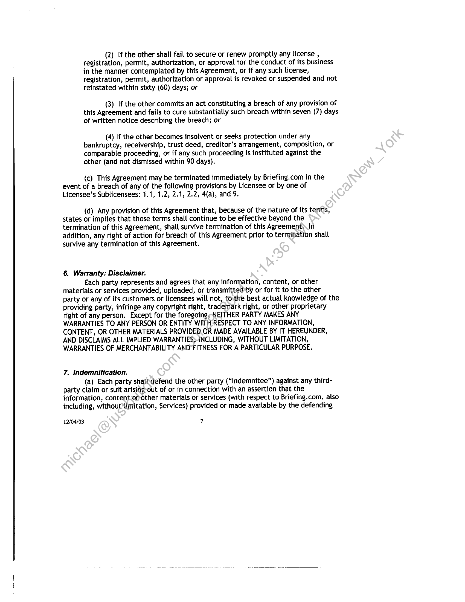
```  
```col-md
(2) If the other shall fail to secure or renew promptly any license ,
registration, permit, authorization, or approval for the conduct of its business
in the manner contemplated by this Agreement, or if any such license,
registration, permit, authorization or approval is revoked or suspended and not
reinstated within sixty (60) days; or  
(3) If the other commits an act constituting a breach of any provision of
this Agreement and fails to cure substantially such breach within seven (7) days
of written notice describing the breach; or  
(4) If the other becomes insolvent or seeks protection under any
bankruptcy, receivership, trust deed, creditor’s arrangement, composition, or
comparable proceeding, or if any such proceeding is instituted against the
other (and not dismissed within 90 days).  
(c) This Agreement may be terminated immediately by Briefing.com in the
event of a breach of any of the following provisions by Licensee or by one of
Licensee’s Sublicensees: 1.1, 1.2, 2.1, 2.2, 4(a), and 9.  
(d) Any provision of this Agreement that, because of the nature of its terms,
states or implies that those terms shall continue to be effective beyond the
termination of this Agreement, shall survive termination of this Agreement In
addition, any right of action for breach of this Agreement prior to termination shall
survive any termination of this Agreement.  
6. Warranty: Disclaimer.  
Each party represents and agrees that any information, content, or other
materials or services provided, uploaded, or transmitted’by or for it to the other
party or any of its customers or licensees will not, tothe best actual knowledge of the
providing party, infringe any copyright right, trademark right, or other proprietary
right of any person. Except for the foregoing; NEITHER PARTY MAKES ANY
WARRANTIES TO ANY PERSON OR ENTITY WITH-RESPECT TO ANY INFORMATION,
CONTENT, OR OTHER MATERIALS PROVIDED.OR MADE AVAILABLE BY IT HEREUNDER,
AND DISCLAIMS ALL IMPLIED WARRANTIES;-INCLUDING, WITHOUT LIMITATION,
WARRANTIES OF MERCHANTABILITY AND FITNESS FOR A PARTICULAR PURPOSE.  
7. Indemnification.  
(a) Each party shaildefend the other party (“Indemnitee”) against any thirdparty claim or suit arising-out of or in connection with an assertion that the
information, content-orother materials or services (with respect to Briefing.com, also
inctuding, withouttimitation, Services) provided or made available by the defending  
12/04/03 7  
```
````
Notes:    
````col
```col-md
flexGrow=.5
===
> [!info] [Page 8](_attachments/images_3.6.4.1.4.1Briefing_MODLicenseAgreementExecuted20031201.pdf_155144/page_8.png)
> 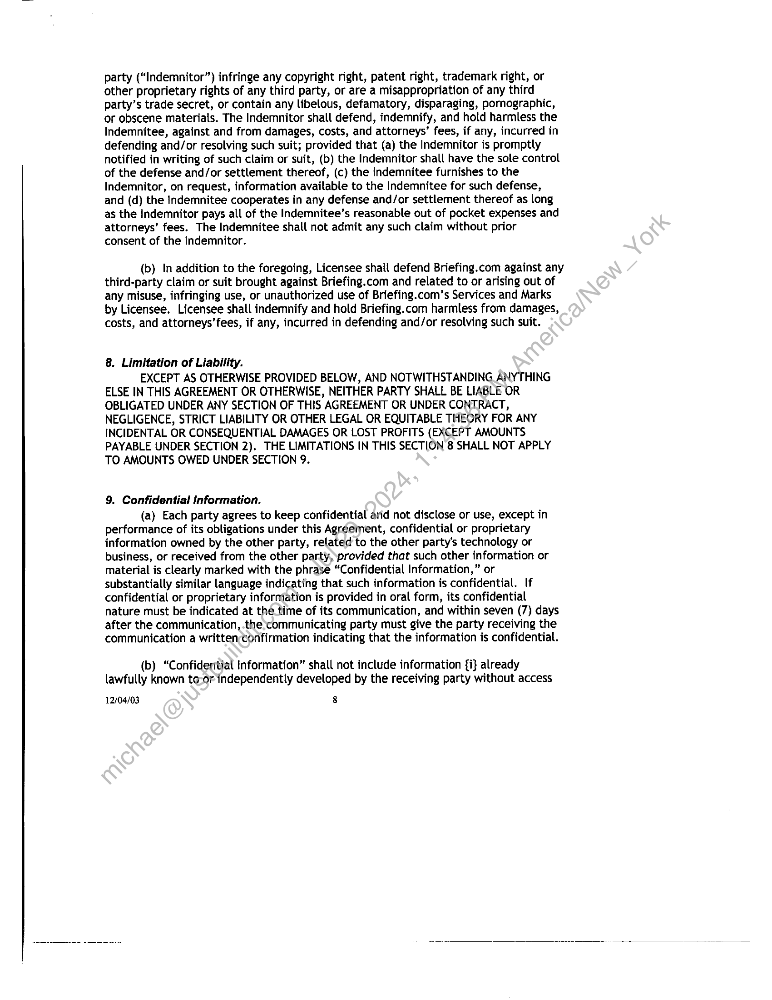
```  
```col-md
party (“Indemnitor”) infringe any copyright right, patent right, trademark right, or
other proprietary rights of any third party, or are a misappropriation of any third
party’s trade secret, or contain any libelous, defamatory, disparaging, pornographic,
or obscene materials. The Indemnitor shall defend, indemnify, and hold harmless the
Indemnitee, against and from damages, costs, and attorneys’ fees, if any, incurred in
defending and/or resolving such suit; provided that (a) the Indemnitor is promptly
notified in writing of such claim or suit, (b) the Indemnitor shall have the sole control
of the defense and/or settlement thereof, (c) the indemnitee furnishes to the
Indemnitor, on request, information available to the Indemnitee for such defense,
and (d) the Indemnitee cooperates in any defense and/or settlement thereof as long
as the Indemnitor pays all of the Indemnitee’s reasonable out of pocket expenses and
attorneys’ fees. The Indemnitee shall not admit any such claim without prior
consent of the Indemnitor.  
(b) In addition to the foregoing, Licensee shall defend Briefing.com against any
third-party claim or suit brought against Briefing.com and related to or arising out of
any misuse, infringing use, or unauthorized use of Briefing.com’s Services and Marks
by Licensee. Licensee shall indemnify and hold Briefing.com harmless from damages,
costs, and attorneys’ fees, if any, incurred in defending and/or resolving such suit.  
8. Limitation of Liability.  
EXCEPT AS OTHERWISE PROVIDED BELOW, AND NOTWITHSTANDING ANYTHING
ELSE IN THIS AGREEMENT OR OTHERWISE, NEITHER PARTY SHALL BE LIABLE OR
OBLIGATED UNDER ANY SECTION OF THIS AGREEMENT OR UNDER CONTRACT,
NEGLIGENCE, STRICT LIABILITY OR OTHER LEGAL OR EQUITABLE THEORY FOR ANY
INCIDENTAL OR CONSEQUENTIAL DAMAGES OR LOST PROFITS (EXCEPT AMOUNTS
PAYABLE UNDER SECTION 2). THE LIMITATIONS IN THIS SECTION 8 SHALL NOT APPLY
TO AMOUNTS OWED UNDER SECTION 9.  
9. Confidential Information.  
(a) Each party agrees to keep confidential arid not disclose or use, except in
performance of its obligations under this Agreement, confidential or proprietary
information owned by the other party, related to the other party's technology or
business, or received from the other party, provided that such other information or
material is clearly marked with the phrase “Confidential Information,” or
substantially similar language indicating that such information is confidential. If
confidential or proprietary information is provided in oral form, its confidential
nature must be indicated at the time of its communication, and within seven (7) days
after the communication, the communicating party must give the party receiving the
communication a written confirmation indicating that the information is confidential.  
(b) “Confidential Information” shall not include information {i} already
lawfully known to-or independently developed by the receiving party without access  
12/04/03 8  
```
````
Notes:    
````col
```col-md
flexGrow=.5
===
> [!info] [Page 9](_attachments/images_3.6.4.1.4.1Briefing_MODLicenseAgreementExecuted20031201.pdf_155144/page_9.png)
> 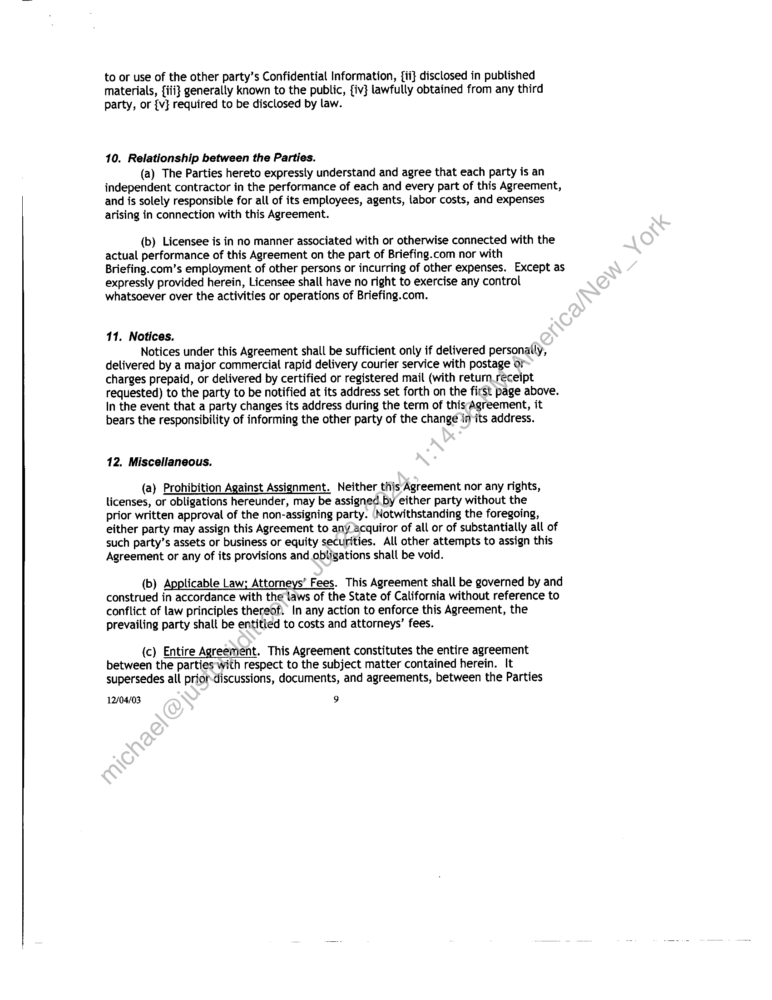
```  
```col-md
to or use of the other party’s Confidential Information, {ii} disclosed in published
materials, {iii} generally known to the public, {iv} lawfully obtained from any third
party, or {v} required to be disclosed by law.  
10. Relationship between the Parties.  
(a) The Parties hereto expressly understand and agree that each party is an
independent contractor in the performance of each and every part of this Agreement,
and is solely responsible for all of its employees, agents, labor costs, and expenses
arising in connection with this Agreement.  
(b) Licensee is in no manner associated with or otherwise connected with the
actual performance of this Agreement on the part of Briefing.com nor with
Briefing.com’s employment of other persons or incurring of other expenses. Except as
expressly provided herein, Licensee shall have no right to exercise any control
whatsoever over the activities or operations of Briefing.com.  
11. Notices.  
Notices under this Agreement shall be sufficient only if delivered personally,
delivered by a major commercial rapid delivery courier service with postage or
charges prepaid, or delivered by certified or registered mail (with return receipt
requested) to the party to be notified at its address set forth on the first page above.
In the event that a party changes its address during the term of thisAgreement, it
bears the responsibility of informing the other party of the change in-its address.  
12, Miscellaneous.  
(a) Prohibition Against Assignment. Neither this Agreement nor any rights,
licenses, or obligations hereunder, may be assigned by either party without the
prior written approval of the non-assigning party. Notwithstanding the foregoing,
either party may assign this Agreement to any acquiror of all or of substantially all of
such party’s assets or business or equity securities. All other attempts to assign this
Agreement or any of its provisions and obligations shalt be void.  
(b) Applicable Law; Attorneys’ Fees. This Agreement shall be governed by and
construed in accordance with the laws of the State of California without reference to
conflict of law principles thereof, In any action to enforce this Agreement, the
prevailing party shalt be entitled to costs and attorneys’ fees.  
(c) Entire Agreement. This Agreement constitutes the entire agreement
between the parties with respect to the subject matter contained herein. It
supersedes all prior-discussions, documents, and agreements, between the Parties  
12/04/03 9  
```
````
Notes:    
````col
```col-md
flexGrow=.5
===
> [!info] [Page 10](_attachments/images_3.6.4.1.4.1Briefing_MODLicenseAgreementExecuted20031201.pdf_155144/page_10.png)
> 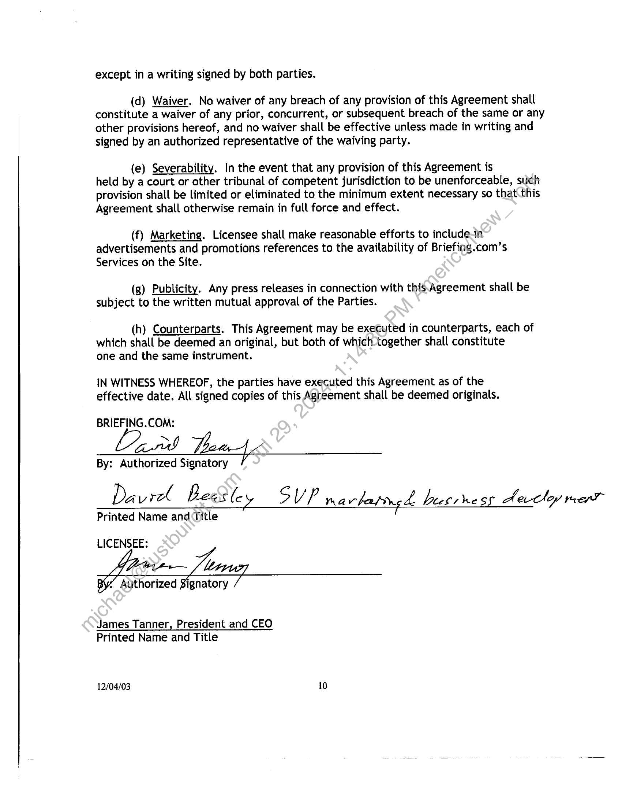
```  
```col-md
except in a writing signed by both parties.  
(d) Waiver. No waiver of any breach of any provision of this Agreement shall
constitute a waiver of any prior, concurrent, or subsequent breach of the same or any
other provisions hereof, and no waiver shall be effective unless made in writing and
signed by an authorized representative of the waiving party.  
(e) Severability. In the event that any provision of this Agreement is
held by a court or other tribunal of competent jurisdiction to be unenforceable, such
provision shall be limited or eliminated to the minimum extent necessary so that.this
Agreement shall otherwise remain in full force and effect.  
(f) Marketing. Licensee shall make reasonable efforts to include.in
advertisements and promotions references to the availability of Briefing.com’s
Services on the Site.  
(g) Publicity. Any press releases in connection with this Agreement shall be
subject to the written mutual approval of the Parties.  
(h) Counterparts. This Agreement may be executed in counterparts, each of
which shall be deemed an original, but both of which-together shall constitute
one and the same instrument.  
IN WITNESS WHEREOF, the parties have executed this Agreement as of the
effective date. All signed copies of this Agreement shall be deemed originals.  
BRIEFING.COM:
Lire Tow 4.2
By: Authorized Signatory  
Davicl Bedel- SUP rravbattne dL bees he sf decoy mat  
Printed Name and Title  
LICENSEE:  
“ Authorized Signatory  
James Tanner, President and CEO
Printed Name and Title  
12/04/03 10  
```
````
Notes:    
````col
```col-md
flexGrow=.5
===
> [!info] [Page 11](_attachments/images_3.6.4.1.4.1Briefing_MODLicenseAgreementExecuted20031201.pdf_155144/page_11.png)
> 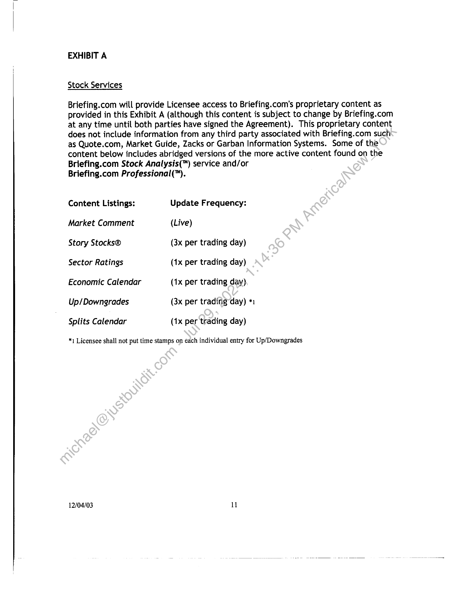
```  
```col-md
EXHIBIT A  
Stock Services  
Briefing.com will provide Licensee access to Briefing.com’s proprietary content as
provided in this Exhibit A (although this content is subject to change by Briefing.com
at any time until both parties have signed the Agreement). This proprietary content
does not include information from any third party associated with Briefing.com such
as Quote.com, Market Guide, Zacks or Garban Information Systems. Some of the
content below includes abridged versions of the more active content found on the
Briefing.com Stock Analysis(™) service and/or  
Briefing.com Professional(™).  
Content Listings: Update Frequency:
Market Comment (Live)  
Story Stocks® (3x per trading day)
Sector Ratings (1x per trading day)
Economic Calendar (1x per trading day)
Up/Downgrades (3x per trading-day) *1
Splits Calendar (1x per trading day)  
*) Licensee shall not put time stamps on each individual entry for Up/Downgrades  
12/04/03 11  
```
````
Notes:    
````col
```col-md
flexGrow=.5
===
> [!info] [Page 12](_attachments/images_3.6.4.1.4.1Briefing_MODLicenseAgreementExecuted20031201.pdf_155144/page_12.png)
> 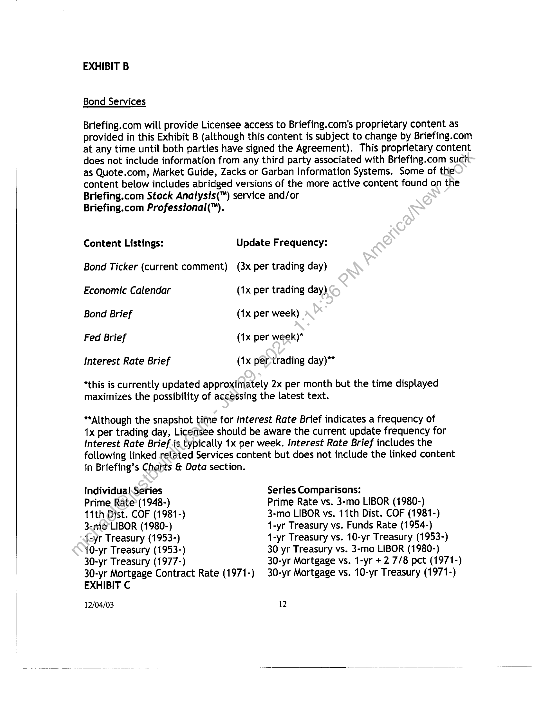
```  
```col-md
EXHIBIT B  
Bond Services  
Briefing.com will provide Licensee access to Briefing.com’s proprietary content as
provided in this Exhibit B (although this content is subject to change by Briefing.com
at any time until both parties have signed the Agreement). This proprietary content
does not include information from any third party associated with Briefing.com such
as Quote.com, Market Guide, Zacks or Garban Information Systems. Some of the
content below includes abridged versions of the more active content found on the
Briefing.com Stock Analysis(™) service and/or  
Briefing.com Professional(™).  
Content Listings: Update Frequency:  
Bond Ticker (current comment) (3x per trading day)  
Economic Calendar (1x per trading day)
Bond Brief (1x per week)  
Fed Brief (1x per week)*
Interest Rate Brief (1x per-trading day)**  
*this is currently updated approximately 2x per month but the time displayed
maximizes the possibility of accessing the latest text.  
“Although the snapshot time for Interest Rate Brief indicates a frequency of  
1x per trading day, Licensee should be aware the current update frequency for
Interest Rate Brief is typically 1x per week. Interest Rate Brief includes the
following linked related Services content but does not include the linked content
in Briefing’s Chants & Data section.  
Individual.Series Series Comparisons:  
Prime Rate (1948-) Prime Rate vs. 3-mo LIBOR (1980-)  
11th Dist. COF (1981-) 3-mo LIBOR vs. 11th Dist. COF (1981-)
3-moLIBOR (1980-) 1-yr Treasury vs. Funds Rate (1954-)  
{-yr Treasury (1953-) 1-yr Treasury vs. 10-yr Treasury (1953-)
10-yr Treasury (1953-) 30 yr Treasury vs. 3-mo LIBOR (1980-)
30-yr Treasury (1977-) 30-yr Mortgage vs. 1-yr + 2 7/8 pct (1971-)  
30-yr Mortgage Contract Rate (1971-) 30-yr Mortgage vs. 10-yr Treasury (1971-)
EXHIBIT C  
12/04/03 12  
```
````
Notes:    
````col
```col-md
flexGrow=.5
===
> [!info] [Page 13](_attachments/images_3.6.4.1.4.1Briefing_MODLicenseAgreementExecuted20031201.pdf_155144/page_13.png)
> 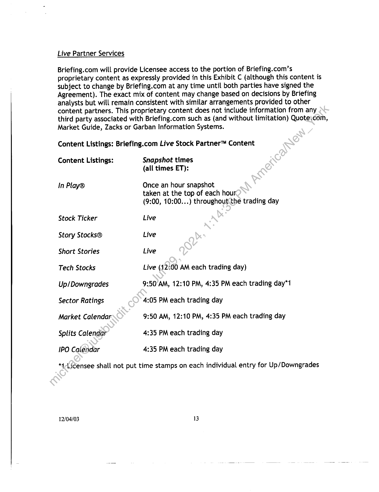
```  
```col-md
Live Partner Services  
Briefing.com will provide Licensee access to the portion of Briefing.com’s
proprietary content as expressly provided in this Exhibit C (although this content is
subject to change by Briefing.com at any time until both parties have signed the
Agreement). The exact mix of content may change based on decisions by Briefing
analysts but will remain consistent with similar arrangements provided to other
content partners. This proprietary content does not include information from any
third party associated with Briefing.com such as (and without limitation) Quote\com,
Market Guide, Zacks or Garban Information Systems.  
Content Listings: Briefing.com Live Stock Partner™ Content  
Content Listings: Snapshot times
(all times ET):  
In Play® Once an hour snapshot
taken at the top of each hour
(9:00, 10:00.  ) throughout(the trading day  
Stock Ticker Live  
Story Stocks® Live  
Short Stories Live  
Tech Stocks Live (12:00 AM each trading day)
Up/Downgrades 9:50 AM, 12:10 PM, 4:35 PM each trading day*1
Sector Ratings 4:05 PM each trading day  
Market Calendar 9:50 AM, 12:10 PM, 4:35 PM each trading day
Splits Calendar 4:35 PM each trading day  
IPO Calendar 4:35 PM each trading day  
*4-Ligéensee shall not put time stamps on each individual entry for Up/Downgrades  
12/04/03 13  
```
````
Notes:  


![[_attachments/3.6.4.1.4.1 Briefing_MOD License Agreement Executed 20031201.pdf]