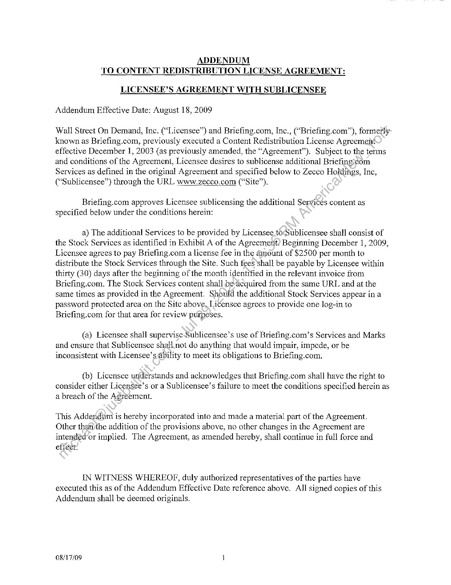
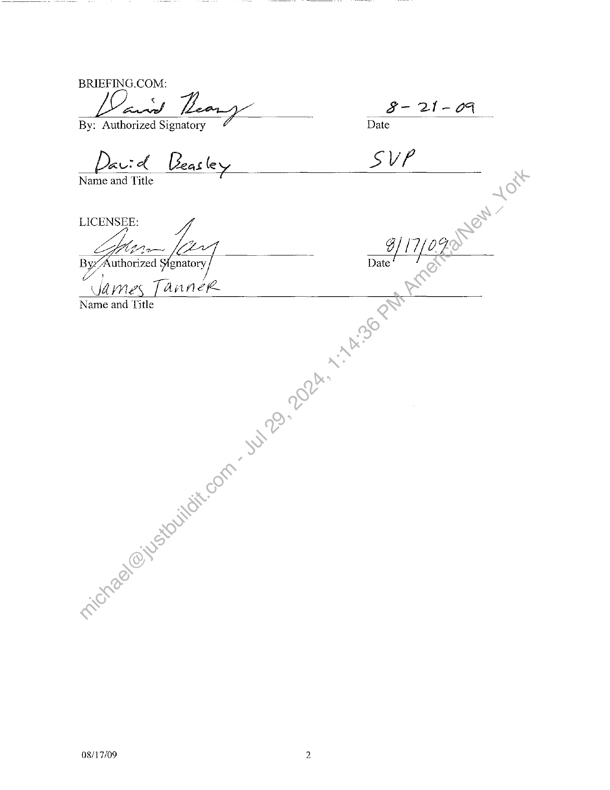

##### Addendum to Content Redistribution License Agreement]

  
````col
```col-md
flexGrow=.5
===
> [!info] [Page 1](_attachments/images_3.6.4.1.4.2Briefing_MODAddendum20090821.pdf_155319/page_1.png)
> 
```  
```col-md
ADDENDUM
TO CONTENT REDISTRIBUTION LICENSE AGREEMENT:  
LICENSEE’S AGREEMENT WITH SUBLICENSER
Addendum Effective Date: August 18, 2009  
Wall Street On Demand, Inc. (“Licensee”) and Briefing.com, Inc., (“Briefing.com”), formetly
known as Briefing.com, previously executed a Content Redistribution License Agreement
effective December 1, 2003 (as previously amended, the “Agreement”). Subject to the terms
and conditions of the Agreement, Licensee desires to sublicense additional Briefingscom
Services as defined in the original Agreement and specified below to Zecco Holdings, Inc,
(“Sublicensee”) through the URL www.zecco.com (“Site”).  
Briefing.com approves Licensee sublicensing the additional Services content as
specified below under the conditions herein:  
a) The additional Services to be provided by Licensee tocSublicensee shall consist of
the Stock Services as identified in Exhibit A of the Agreemerit? Beginning December 1, 2009,
Licensee agrees to pay Briefing.com a license fee in the amount of $2500 per month to
distribute the Stock Services through the Site. Such fees shall be payable by Licensee within
thirty (30) days after the beginning of the month identified in the relevant invoice from
Briefing.com. The Stock Services content shall beacquired from the same URL and at the
same times as provided in the Agreement. Should the additional Stock Services appear in a
password protected area on the Site above, Licensee agrees to provide one log-in to
Briefing.com for that area for review purposes.  
(a) Licensee shall supervise-Sublicensee’s use of Briefing.com’s Services and Marks
and ensure that Sublicensee shall. not do anything that would impair, impede, or be
inconsistent with Licensee’s ability to meet its obligations to Briefing.com.  
(b) Licensee understands and acknowledges that Briefing.com shall have the right to
consider either Licensee’s or a Sublicensee’s failure to meet the conditions specified herein as
a breach of the Agreement.  
This Addendivm is hereby incorporated into and made a material part of the Agreement.
Other thanthe addition of the provisions above, no other changes in the Agreement are
intended or implied. The Agreement, as amended hereby, shall continue in full force and
effect.  
IN WITNESS WHEREOF, duly authorized representatives of the parties have
executed this as of the Addendum Effective Date reference above. All signed copies of this
Addendum shall be deemed originals.  
08/17/09 1  
```
````
Notes:    
````col
```col-md
flexGrow=.5
===
> [!info] [Page 2](_attachments/images_3.6.4.1.4.2Briefing_MODAddendum20090821.pdf_155319/page_2.png)
> 
```  
```col-md
BRIEFING.COM:  
Cnet S- 21-04
By: Authorized Signatory Date
Devt ed Bea tle Y Ss VP
Name and Title  
LICENSEE
ay, 17/09  
By Authorized Signatory y) Date
: “james 7 aaneke  
Name and Title  
08/17/09 2  
```
````
Notes:  


![[_attachments/3.6.4.1.4.2 Briefing_MOD Addendum 20090821.pdf]