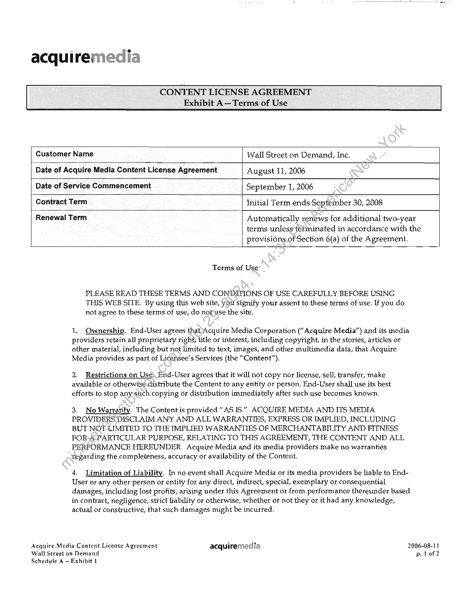

##### Acquire Media Content License Agreement]

  
````col
```col-md
flexGrow=.5
===
> [!info] [Page 1](_attachments/images_3.6.4.1.5.1Acquiremedia_MODMLAFullyExecuted20060811.pdf_155212/page_1.png)
> 
```  
```col-md
- e
acquiremecia
CONTENT LICENSE AGREEMENT  
Acquire Media Content License Agreement (” AMCLA”), made as of August 11, 2006, by and between
Acquire Media Corporation (“Acquire Media”), a New Jersey corporation with its principal office at 3
Becker Farm Road, Suite 204, Roseland, New Jersey 07068, and Wall Street on Demand, Inc. (“Licensee”),
a Delaware corporation, with an office at 5718 Central Avenue, Boulder, CO 80301.  
1 Definitions,  
(a) “Licensed Content” means any data, materials, reports, images or other information, in
any form, which Acquire Media licenses and provides to Licensee, as listed in Schedule A as,“Licensed
Content,” including but not limited to headlines, stories, press releases, articles, publications, translations,
text, clips, graphics, photographs, images, videos, audio files, charts, tables, securities Prices, formatting
elements, artwork, logos, metadata and all other materials contained therein, whether or not protected by  
copyright.  
(b) “Media Providers” means Acquire Media and any third-party from which Acquire
Media has acquired the right to distribute and to grant Licensee the rightio use the Licensed Content or,
with respect to Other Delivered Content (as defined in subsection 1(e)below), the third-party from which
Licensee has acquired the right to receive and to use such Other Delivered Content pursuant to
agreements entered into between Licensee and such third party.  
(c) “Services” means only those information services provided by Licensee that are listed on
Schedule A.  
(d) “End-User” means those individuals or entities which have access to the Content by
means of the Services.  
(e) “Other Delivered Content” means data, materials, reports, images or other information,
in any form, which Acquire Media does not license to Licensee but which Acquire Media delivers to
Licensee, as listed in Schedule A as “Other Delivered Content,” and the right to receive and to use such
data, materials, reports, images or other information, in any form, derives from a separate agreement
between Licensee and a Media Provider.  
() “Content’sneans both Licensed Content and Other Delivered Content.  
(g) “Third-Party Licensees” means those entities, approved in advance by Acquire Media,
with whom Licensee shas entered into written agreements to provide Content for delivery by such ThirdParty Licensees directly to End-Users.  
2. Grant of Rights - Licensed Content.  
(a) Subject to all of the terms and conditions of this AMCLA, Acquire Media grants to
Licensee a nonexclusive, non-transferable (except to the extent expressly set forth in Section 11(a) of this
AMCLA) license to display and otherwise to make available to its End-Users the Licensed Content, to the
extent expressly set forth in Schedule A; provided, however, that Licensee and its End-Users may use any
metadata provided by Acquire Media solely for purposes of accessing and viewing the Licensed Content
and for no other purpose.  
(9) to display, to distribute and otherwise to make available to End-Users
the Content by way of the Services (including by and through authorized Third-Party Licensees), to the
extent expressly set forth in Schedule A, and  
Acquire Media Content License Agreement acquiremedia 2006-08-11
Wall Street on Demand p. 1 of 8  
```
````
Notes:    
````col
```col-md
flexGrow=.5
===
> [!info] [Page 2](_attachments/images_3.6.4.1.5.1Acquiremedia_MODMLAFullyExecuted20060811.pdf_155212/page_2.png)
> 
```  
```col-md
(ii) to license End-Users to use or to display the Content pursuant to EndUsers agreements, containing the provisions set forth in Exhibit A and subject to the requirements of any
Media Provider specific special riders set forth in Schedule A.  
(b) Licensee may not in any way make the Content available, through any medium,  
(i) to any person or entity which redistributes or causes the redistribution of
the Content without prior written permission of Acquire Media,  
(ii) for use in print, television oy radio news media (including web sites
affiliated with or supporting entities engaged in such news distribution) without prior written penmission
of Acquire Media,  
(iii) to any person or entity which links the Content to a web site, or
otherwise distributes or makes available material, which is pornographic, obscene, defamatory,
harassing, grossly offensive, malicious in nature, or which infringes, or potentially infringes, any
intellectual or other property rights (including copyright, patent, trademark and trade secret rights) of
any person, or  
(iv) to any person or entity which uses or permit the use of the Content in
any way that compromises the integrity thereof or which infringes any. Copyrights or proprietary interests
of any Media Provider.  
(c) All Content displayed by Licensee, any Third-Party Licensees or any End-Users shall
include any copyrights or other proprietary legends and protections relating to the Content, and any
datelines provided by the Media Providers. Licensee shalhcause the Services to display either (i)
“Content provided by Acquire Media” or such other attribution phrase as Acquire Media may approve,
or (ii) if referring to the Media Provider of the Content, \as being delivered by Acquire Media.  
(d) All Content stored by Licensee shal be subject to the retention and deletion rules set
forth in Schedule A, if any.  
(e) All title and copyrights imand to the Content (including but not limited to any images,
photographs, animations, video, audio, music, text, and metadata), and any copies of the Content, are
owned by the Media Providers. The Content is protected by copyright laws and international treaty
provisions. No rights of any kind)other than those expressly granted by this AMCLA, are transferred to
Licensee pursuant to this AMCLA.  
(f) Licenseéshall obtain from each of its End-Users and it Third-Party Licensees, and shal]
require its Third-Party Dicensees to obtain from each of their End-Users, agreement to the terms set forth
in Exhibit A. Licenge® may use its own contracts or other appropriate forms to obtain such agreements.  
3. Delivery.of the Content. Acquire Media will deliver, or make available, the Content to Licensee
in accordance with the Technical Specifications attached hereto if any, and otherwise in Acquire Media’s
standardformat which is in compliance with the XMLNews standard as documented at
www.xmunews.org. Acquire Media reserves the right to change its standard format on 60-days’ notice to
Licensee as long as compliance with XMLNews is retained. Subject to the performance of Media
Providers, Acquire Media will use commercially reasonable efforts, consistent with industry standards, to
maintain the timeliness of its delivery of the Content to Licensee.  
4. Use and Display of Content.  
(a) Licensee shall not edit or modify Content in any way except to the extent necessary to
conform to the look and feel of the Services (but only if such modifications do not materially alter the
Content) or permit its End-Users or Third-Party Licensees or its Third-Party Licensees’ respective EndUsers to edit or to modify the Content. Licensee may elect not to include in the Services all of the Content  
Acquire Media Content License Agreement acquiremedia 2006-08-11
Wall Street on Demand p. 2 of 8  
```
````
Notes:    
````col
```col-md
flexGrow=.5
===
> [!info] [Page 3](_attachments/images_3.6.4.1.5.1Acquiremedia_MODMLAFullyExecuted20060811.pdf_155212/page_3.png)
> 
```  
```col-md
provided by Acquire Media except to the extent that Licensee is notified by Acquire Media that such
Content must be included in the Services in order for Acquire Media to comply with the requirements of
its Media Providers.  
(b) During the term of this AMCLA, Licensee shall provide Acquire Media, at no charge,
reasonable access to the Services for purposes of reviewing compliance by Licensee with the requirements
of this AMCLA. Acquire Media may make such access available to its Media Providers, at no charge to
either Acquire Media or its Media Providers.  
(c) Acquire Media handles corrections to and retractions of Content by publishing the
correction or a retraction message as a republishing of the original. With respect to Third-Party Licensees
for whom Licensee hosts the web site or platform through which the Content is viewed by or displayed
to End-Users, Licensee shall implement a procedure for overwriting original content with republished
content. With respect to all other Third-Party Licensee, Acquire Media will deliver the Content directly
to such Third-Party Licensee and will arrange directly with such Third-Party Licensee forthe handling of
corrections and retractions.  
(d) In the event that a Media Provider notifies Acquire Media that,irt-the opinion of the
Media Provider, the Content is being displayed in any manner or in conjunction with any other material
that, in the Media Provider's sole discretion, tamishes, disparages or is otherwise objectionable to the
Media Provider or harms the image of the Media Provider and its services, Licensee, immediately after
receipt of notification in writing from Acquire Media (including notice by email), shall, as directed by the
Media Provider, cause such objectionable manner of display to céase-or cause such objectionable material
to be removed from any locations on which it appears.  
(e) In the event that Acquire Media receives notice from any Media Provider that it has
elected to exclude any Content from the Content being\delivered pursuant to this AMCLA, based on any
notice from any party (whether a natural person, corporation, government agency or other business or
legal entity) to such Media Provider asserting any challenge to its rights with respect to the use of any
Content, or a good faith concern that any particular use of such Content may create legal liability for it,
Acquire Media, and/or Licensee, then Acquite-Media shall have the right, without incurring any liability
to Licensee, at any time, to exclude such Gontent from the rights granted hereunder. Licensee agrees that
it shall, immediately folowing notice of stich Media Provider's notice, remove the designated Content
referenced in its notice from any distribution or display.  
(f) In the event that.a Media Provider instructs Acquire Media to suspend providing the
Media Provider's Content,-or a portion thereof, to Licensee, Acquire Media may, without liability to
Licensee, suspend the providing such Content, after providing prior written notice to Licensee (including
notice by email) as far in.advance of such suspension as permitted by such Media Provider, and in the
absence of any specific limitation not less than 24-hours’ advance notice, until otherwise instructed by the
Media Provider.  
(gy In the event that Acquire Media determines in good faith that breach by Licensee, its
Third-Party Licensees or End-Users of any provision of this AMCLA is causing Acquire Media to be in
breachvOfits obligations to a Media Provider, in addition to any other remedies Acquire Media may have,
purstant to this AMCLA or otherwise, Acquire Media may on one-week’s notice (including notice by
email) suspend delivery of the Content from such Media Provider to Licensee unt] the breach is cured.  
(h) Acquire Media’s suspension of delivery of Content pursuant to Sections 4(f) and 4(g)
shall not constitute a breach of its obligations pursuant to this AMCLA.  
5. Acquire Media Charges.  
(a) Licensee shalt pay to Acquire Media all of the fees and charges in accordance with the
pricing schedule and provisions set forth in Schedule A, plus all applicable federal, state and local taxes.
Acquire Media shall not be required to render an invoice with respect to any such fees due.  
Acquire Media Content License Agreement acquiremedia 2006-08-11
Wall Street on Demand p.3 of 8  
```
````
Notes:    
````col
```col-md
flexGrow=.5
===
> [!info] [Page 4](_attachments/images_3.6.4.1.5.1Acquiremedia_MODMLAFullyExecuted20060811.pdf_155212/page_4.png)
> 
```  
```col-md
(b) Licensee shall within 15 days of the end of each calendar month render an accounting (by
Service and Third-Party Licensee, and End-User if fees are measured by End-User) during such calendar
month and pay any additional fees, royalties and charges, if any, due in accordance with the pricing
schedule and provisions set forth in Schedule A, plus all applicable federal, state and local taxes. Acquire
Media shall not be required to render an invoice with respect to any such fees due.  
(c) Licensee shall pay a service charge of one and one half percent with respect to all
payments that are not made in ful within 45 days of the date due. In addition to all other remedies,
Acquire Media reserves the right to suspend the delivery of the Content to Licensee if Licensee’s account
is 60 or more days past due, after notice by facsimile, emai), and/or overnight delivery of Acquire
Media’s intention to suspend service in five business days if full payment is not received by Acquire
Media with respect to all payments which are then 45 or more days past due.  
(d) The fees and charges charged during any renewal period will be based on the price
schedule in effect at the time of the renewal.  
(e) Licensee shall be solely responsible for all costs and expenses associated with Licensee's
local servers, all cost and expenses related to Licensee’s communications lines and equipment used to
receive and to distribute the Content, and to the extent specified in Schedule-Ay other communications
charges borne by Acquire Media in delivering Content to Licensee.  
(f} Licensee shall maintain accurate and complete records.relating to the storage and
distribution of the Content and the number of authorized servers:  
(g) Acquire Media may, upon 60-days’ prior notice, review the books and records of
Licensee relating to the license granted to Licensee or with respect to the Services or the number of ThirdParty Licensees and, if fees for End-Users are due Acquire Media, End-Users, at the place where such
books and records are maintained, during normal business hours in a manner which would not
unreasonably interfere with normal business activities. A true copy of any report of the result of any
such review shall be delivered to Licensee promptly upon completion. In no event shall any review be
made for any period beginning more than thyée years prior to the date of the review, nor may reviews be
conducted more frequently than annually Any such review shall be at the sole cost and expense of
Acquire Media unless errors in Acquire Media's favor shall be established as a result thereof amounting
to at least ten percent of the amount payable to Acquire Media for the period examined, in which case
Licensee shall rezmburse Acquire(Media for the reasonable cost thereof, in addition to the payment of the
amount of any underpayment,together with simple interest, at the then current Citicorp Prime Rate,
computed from the date on*vhich the payment was due. Such payment shall be made within 30 days of
notice to Licensee of theresults of any such review.  
6. Term And-‘fermination.  
(a) “Fhe term of this AMCLA shall commence as of the date specified in Schedule A and
continue for\the period specified in Schedule A. Either party must deliver written notice of cancellation
at least 30days before the end of the then-current term or else the term of this AMCLA will be extended
for therénewal term specified in Schedule A.  
(b) Either party may terminate this AMCLA in the event that the other party materially
breaches this AMCLA, and fails to cure or to correct such breach within 20 days after it receives written
notice of the breach. Licensee’s failure to make payment after receipt of a notice of suspension (as
described in Section 5(c)) constitutes material breach.  
(c) Either party shall have the right to terminate this AMCLA upon the other party (i)
becoming or being declared insolvent or bankrupt, (ii) becoming the subject of any proceedings relating
to its Liquidation, insolvency or for the appointment of a receiver or similar officer for it, or (iit) making an
assignment for the benefit of all or substantially all of its creditors.  
Acquire Media Content License Agreement acquiremedia 2006-08-11
Wail Street on Demand p.4 of 8  
```
````
Notes:    
````col
```col-md
flexGrow=.5
===
> [!info] [Page 5](_attachments/images_3.6.4.1.5.1Acquiremedia_MODMLAFullyExecuted20060811.pdf_155212/page_5.png)
> 
```  
```col-md
(d) Upon termination of this AMCLA, Licensee will destroy, and where possible cause its
Third-Party Licensees and End-Users to destroy, all copies of the Content then in its possession and,
within ten business days, certify in writing to Acquire Media that such destruction has been completed;
provided, however, that Licensee shall have the right to retain any of the Content permitted to be retained
by the originating Media Provider upon presentation of documentation of such rights to Acquire Media,
which Acquire Media in its sole reasonable judgment deems to be sufficient.  
(e) In addition to its other remedies, pursuant to the provisions of this AMCLA or otherwise,
upon seven-days’ notice, Acquire Media in its sole discretion may suspend delivery of Content to
Licensee if Licensee shall be in material breach of any of its obligations pursuant to this AMCLA andiinay
continue such suspension until such breach is cured and Licensee has demonstrated to Acquire Media
that it has taken action to ensure that such breach shall not re-occur.  
(f) In the event that any Third-Party Licensee terminates its use of Acquire Media products
or services, Licensee shall not be responsible for any fees, directly or indirectly accrued as.a result of such
termination except for fees which would otherwise have been due with respect to such Third-Party
Licensee for the period ending 30 days aftex the month in which notice of such termination was given to
Acquire Media.  
7. Warranties.  
(a) Acquire Media hereby represents and warrants that itthas full title to, or authority to use
and/or distribute, the Licensed Content and that Acquire Media’suse and distribution of the Licensed
Content does not infringe on the intellectual property rights of\any other party or entity.  
(b) Licensee hereby represents and warrants that it has, and wil] have for the term of this
AMCLA, full authority to use the Other Delivered Content being delivered pursuant to this AMCLA, in
accordance with separate agreements between Licensee and the relevant Media Provider.  
(c) ACQUIRE MEDIA AND ITS MEDIA PROVIDERS EXPRESSLY DISCLAIM ANY
OTHER WARRANTIES FOR THE LICENSED CONTENT AND ITS DELIVERY. THE LICENSED
CONTENT IS PROVIDED “AS JIS” WITHOUT WARRANTY OF ANY KIND, EITHER EXPRESS OR
IMPLIED, INCLUDING, WITHOUT LIMITATION, ANY WARRANTY AS TO THE ACCURACY OF
THE LICENSED CONTENT OR THE AVAILABILITY OF THE DELIVERY SERVICE, THE IMPLIED
WARRANTIES OF MERCHANTABILITY AND FITNESS FOR A PARTICULAR PURPOSE, OR
NONINFRINGEMENT. EXCEPF TO THE EXTENT OF THE EXPRESS WARRANTIES CONTAINED
IN SUBSECTION (a) OF THIS/SECTION 7, THE ENTIRE RISK ARISING OUT OF USE OF THE
LICENSED CONTENT OR\THE PERFORMANCE OF THE DELIVERY SERVICE REMAINS WITH
LICENSEE.  
(d) UNDER NO CIRCUMSTANCES SHALL ACQUIRE MEDIA OR ITS SUPPLIERS OR
MEDIA PROVIDERS (EXCEPT TO THE EXTENT ANY SUCH MEDIA PROVIDER MAY HAVE
AGREED OTHERWISE PURSUANT TO A SEPARATE AGREEMENT WITH LICENSEE) BE LIABLE
FOR ANY. DAMAGES, INCLUDING SPECIAL, INCIDENTAL, PUNITIVE OR CONSEQUENTIAL
DAMAGES, ARISING OUT OF OR JN CONNECTION WITH THE PROVISION OF THE LICENSED
CONTENT, OR THE PERFORMANCE OR FAILURE TO PERFORM OF THE DELIVERY SERVICE,
INCLUDING, BUT NOT LIMITED TO, COMPUTER FAILURE OR MALFUNCTION, FAILURE OF
PERFORMANCE, MISTAKES, OMISSIONS OR DELAYS IN OPERATION, TRANSMISSION OR
RECEIPT OF DATA, LOSS OF DATA, COMMUNICATIONS FAILURES, BUSINESS
INTERRUPTION, OR LOST PROFITS, IN CONTRACT, TORT OR OTHERWISE, EVEN IF THEY
HAVE BEEN ADVISED OF THE POSSIBILITY OF SUCH DAMAGES. INFORMATION
CONTAINED IN THE LICENSED CONTENT IS OBTAINED FROM SOURCES BELIEVED TO BE
RELIABLE. HOWEVER, ACQUIRE MEDIA AND THE MEDIA PROVIDERS DO NOT
GUARANTEE THE ACCURACY AND COMPLETENESS OF THE INFORMATION CONTAINED IN
THE LICENSED CONTENT WHICH IS SUPPLIED ON AN “AS IS” BASIS.  
Acquire Media Content “License Agreement acquiremedia 2006-08-11
Wall Street on Demand p. Sof 8  
```
````
Notes:    
````col
```col-md
flexGrow=.5
===
> [!info] [Page 6](_attachments/images_3.6.4.1.5.1Acquiremedia_MODMLAFullyExecuted20060811.pdf_155212/page_6.png)
> 
```  
```col-md
(e) UNLESS SPECIFICALLY RESTRICTED BY THE EXPRESS PROVISION OF THIS
AMCLA, ACQUIRE MEDIA AND THE MEDIA PROVIDERS RESERVE THE RIGHT TO ADD OR
WITHDRAW SOURCES AND ITEMS OF COVERAGE FROM THE LICENSED CONTENT
WITHOUT PRIOR NOTICE TO LICENSEE.  
f) EXCEPT WITH RESPECT TO ITS OBLIGATIONS OF INDEMNIFICATION SET
FORTH IN SECTION 8 OF THIS AMCLA, IN NO EVENT SHALL ACQUIRE MEDIA BE LIABLE
FOR ANY DAMAGES, LIABILITIES, LOSSES OR EXPENSES, IN EXCESS OF THE AGGREGATE
AMOUNT ACQUIRE MEDIA SHALL HAVE RECEIVED FROM LICENSEE PURSUANT TO THIS
AMCLA FOR THE CURRENT TERM HEREOF.  
(g) BECAUSE SOME STATES/JURISDICTIONS DO NOT ALLOW THE EXCLUSION
OR LIMITATION OF IMPLIED WARRANTIES OR LIABILITY FOR CONSEQUENTIAL.OR
INCIDENTAL DAMAGES, THE ABOVE LIMITATIONS MAY NOT APPLY TO LICENSEE.  
8. Indemnity.  
(a) Licensee shall indemnify and hold Acquire Media and each Media‘Provider, and their
respective officers, directors, employees and agents, harmless from and againsiany and all claims,
damages, losses, liabilities or expenses, including reasonable attorney’s fees ‘and expenses, resulting from
or arising out of Licensee’s unauthorized use or unauthorized distribution of the Content, including but
not limited to alteration or modification of the Content.  
(b) Acquire Media shaS! indemnify and hold Licensee harmless from and against all claims
and damages, including reasonable attomey’s fees and expenses, incurred by Licensee to the extent such
claims, damages, losses, liabilities or expenses, including reasonable attorney's fees and expenses, arising
out of a valid claim that the delivery of the Content or the Licensed Content (but only to the extent that
the Media Provider with respect to such Licensed Content agrees to indemnify Acquire Media with
respect to such indemnification of Licensee) infringes the copyrights, or other proprietary rights of a third
party pursuant to applicable law and provided that Licensee has used the Content in accordance with the
instructions and restrictions of Acquire Media-and the Media Providers. Acquire Media agrees to use
reasonable efforts to obtain from each of the Media Providers which has agreed to so indemnify Acquire
Media with respect to the Licensed Content an express agreement to extend such indemnification to
Licensee. With respect to any Media Provider that has expressly extended such indemnification to
Licensee, Licensee agrees to look t6’such Media Provider, and not Acquire Media, for indemnification
regarding such claims of infringement.  
(c) Such obligations are subject to the following conditions (i) indemnified party shail
promptly notify the indeninifying party in writing of any claim or litigation that is subject to such
indemnification obligation; (ii) indemnified party shall grant to indemnifying party sole control of the
settlement, compromise, negotiation and defense of any such claim, and (iii) indemnified party gives
indemnifying party all information, assistance and authority, at indemnified party’s expense, to enable
indemnifying party to so defend or otherwise settle or dispose of such claim or suit on behalf of
indemnified party. The party requesting indemnification shall have the right, at its own expense, to
participate in the defense of any such claim or litigation through counsel of its own choosing, and shall in
any évént cooperate reasonably with the indemnifying party in the defense of such claim or litigation  
9. Confidentiality.  
(a) During the term of this AMCLA and thereafter, each party (the “Receiving Party”) will
use and reproduce the other party’s (the “Disclosing Party”) Confidential Information only as necessary
for the performance of the Receiving Party’s obligations pursuant to this AMCLA and will restrict
disclosure of the Disclosing Party’s Confidential Information to the Receiving Party’s employees,
consultants, independent contractors, or professional advisors with a need to know and will not disclose
the Disclosing Party’s Confidential Information to any third party without the prior written approval of
the Disclosing Party. Notwithstanding the foregoing, it will not be a breach of this AMCLA for the  
Acquire Media Content License Agreement acquiremedia 2006-08-11
Wall Street on Demand p. 6 of &  
```
````
Notes:    
````col
```col-md
flexGrow=.5
===
> [!info] [Page 7](_attachments/images_3.6.4.1.5.1Acquiremedia_MODMLAFullyExecuted20060811.pdf_155212/page_7.png)
> 
```  
```col-md
Receiving Party to disclose Confidential Information of the Disclosing Party if required to do so by law,
regulation or applicable securities exchange or in a judicial or other governmental investigation or
proceeding, provided the Receiving Party uses reasonable commercial efforts to give prior notice to the
Disclosing Party and the Disclosing Party has had the reasonable opportunity to seek safeguards against
widespread dissemination prior to such disclosure.  
(b) As used in this AMCLA, the term “Confidential Information” refers to: (i) the terms and
conditions of this AMCLA,; (ii) the Disclosing Party’s trade secrets, financial information, business plans,
strategies, methods and/or practices; and (iit) any other information relating to the Disclosing Party or its
business that is confidential or proprietary, including but not limited to information about the Disclosing
Party’s proprietary and intellectual property, personnel, products, customers, marketing strategies,
services or future business plans.  
(c) Notwithstanding the foregoing Section 9(b), Confidential Information specifically
excludes (i) information that is or becomes generally available to the public through no action or fault of
the Receiving Party; (ii) information that is known to the Receiving Party without restriction, prior to
receipt from the Disclosing Party pursuant to this AMCLA, from its own independent sources as
evidenced by the Receiving Party’s written records, and which was not acquired, directly or indirectly,
from the Disclosing Party; (iii) information that the Receiving Party receives\Gom any third party
reasonably known by such Receiving Party to have a legal right to transmit such information, and not
under any obligation to keep such information confidential; and (iv) information independently
developed by the Receiving Party’s employees or agents provided that the Receiving Party can show that
those employees or agents developed such information without these of the Confidential Information
received hereunder.  
10. Relationship of Parties. Acquire Media and Licensee are independent contractors pursuant this
AMCLA, and nothing herein will be construed to creat@a ‘partnership, joint venture or agency
relationship between them. Neither party has authority to enter into agreements of any kind on behalf of
the other.  
11. Miscellaneous.  
(a) Assignment. Licensee may assign this AMCLA to any subsidiary or affiliate or entity
owned or controlled by Licensee without regard to the jurisdiction of incorporation of such subsidiary,
affiliate or entity, or as part of theSale of that part of its business or any substantial portion of its data
processing facilities, or pursuant.to any merger, consolidation or other reorganization, without Acquire
Media's consent, upon notice to Acquire Media. Acquire Media shall not assign this AMCLA without
Licensee's prior written.consent, which shaJJ not be unreasonably withheld, except to an affiliate or to an
entity acquiring all or substantially all of the business or assets of Acquire Media, provided that such
assignee has the fulkability to perform Acquire Media’s obligations pursuant to this AMCLA. An
assignee of either ‘party, if authorized hereunder, shall be deemed to have all of the rights and obligations
of the assigning party set forth in this AMCLA. It is understood that no assignment shall release the
assigning party from any of its obligations hereunder.  
{b) Notice. Except to the extent that an express provision of this AMCLA provides
otherwise, all notices which either party is required or permitted to give by any provision of this AMCLA
shall be in writing and shall be delivered by hand, mailed by certified mail, return receipt requested or
registered mail, return receipt requested, or sent by a reputable overnight air express company,
addressed to the other party at the address first set forth above or fo such other address as the party shall
specify by ten-days’ prior notice given in accordance with this subsection. All such notices shall be
deemed given on the date of receipt.  
(c) Force Majeure. Acquire Media shall not be liable for any delays in its performance
pursuant to this AMCLA due to causes beyond its reasonable control or anticipation, including, without
limitation, fire, war, earthquake, floods, strikes, lock-outs, other labor controversies, riots, civil  
Acquire Media Content License Agreement acquiremedia 2006-08-11
Wall Street on Demand p. 7 of &  
```
````
Notes:    
````col
```col-md
flexGrow=.5
===
> [!info] [Page 8](_attachments/images_3.6.4.1.5.1Acquiremedia_MODMLAFullyExecuted20060811.pdf_155212/page_8.png)
> 
```  
```col-md
commotion, acts or restrictions of any government or governmental agency, orders of court or shortages,
delays or interruptions in the availability of facilities or materials as specified in Schedule A.  
(d) Headings. The captions of the various sections of this AMCLA have been inserted only
for the purpose of convenience; such captions are not a part of this AMCLA and shall not be deemed, in
any manner, to modify, explain, enlarge or restrict any of the provisions of this AMCLA.  
(e) Governing Law. This AMCLA shall be governed by and construed pursuant to the [aws
of the State of New Jersey without giving effect to the choice of law principles thereof.  
(f) Consent to Jurisdiction, Venue and Service. Each party consents and agrees that all
legal proceedings relating to the subject matter of this AMCLA shall be maintained in courts sitting
within the State of New York, and each party consents and agrees that jurisdiction and venueforsuch
proceedings shall lie exclusively with such courts; provided, however, that if the such courts, on their own
motion, decline to accept jurisdiction of such proceedings, any proceeding brought by Acquire Media
against Licensee for non-payment, indemnification or for injunctive relief specifically. authorized by the
terms of this AMCLA shall then be maintained in courts sitting within the State of New Jersey and any
other proceeding not so based may be brought in any jurisdiction that would beappropriate in the
absence of the consent to jurisdiction and venue set forth in this Section 11(f}:  
(g) Severability. If any provision of this AMCLA or any Schedule, Exhibit or Rider attached
hereto is held invalid or otherwise unenforceable, the enforceability-ofthe remaining provisions of this
AMCLA and the Schedules, Exhibits and Riders will not be impaired thereby.  
(h) No Waiver. The failure by any party to exercise any right or remedy provided for herein
will not be deemed a waiver of any right or remedy hereunder.  
(i) Survival. In the event of the termination or upon expiration of this AMCLA, Sections
2(b), 2(c), 2(d), 2(e), 4(h), 5, 7(b), 7(c), 7(d), 7(f), 8(@),9) 10 and 11 hereof will survive and continue in full
force and effect.  
(j) Complete Agreement. The terms and conditions of the Schedules, Exhibits and Riders, if
any, attached hereto, are incorporated into'this AMCLA by this reference and shall constitute part of this
AMCLA as if fully set forth herein. In the event of a conflict between the terms of this AMCLA and any
Schedule, Exhibit or Rider the termiS.of the Schedule, Exhibit or Rider shall control. This AMCLA,
including the Schedwes, Exhibitsyand Riders, if any, attached hereto, sets forth the entire understanding
of the parties as to the Content-described in Schedule A and its delivery and may not be modified except
in a writing executed by both parties.  
IN WITNESS WHEREOF the parties have executed this AMCLA as of the date first set forth above.  
PP . Name:
a
title: Pres jelece$ : Title: TUS nt éCEO
Acquire Media Content License Agreement acquiremedia 2006-08-11  
Wall Street on Demand p- 8 of 8  
```
````
Notes:    
````col
```col-md
flexGrow=.5
===
> [!info] [Page 9](_attachments/images_3.6.4.1.5.1Acquiremedia_MODMLAFullyExecuted20060811.pdf_155212/page_9.png)
> 
```  
```col-md
D  
acquiremedi  
CONTENT LICENSE AGREEMENT
Schedule A  
1. General
Customer Name Wall Street on Demand, Inc.
Date of Acquire Media Content License August 11, 2006
Agreement
Date of Service Commencement September 1, 2006
Term Initial Term ends September 30, 2008
Renewal Term Automatically renews for additional two-year terms
unless terminated in accordance with the provisions of
Section 6(a) of the) Agreement.
2. Fees  
Monthiy Charge i Annual Charge |, One Time Charge  
One Time Items  
Set Up | Fees 3 (first s server receiving Content)  
Recurring Items — ‘Software License and
Support Fees  
Master Software License and Support Fee | i waived
(first server receiving Content)  
Recurring Items — Content Processing Fee.  
Content Processing and Delivery Fee $250 for fi rst
| AMPS account;  
$250 for each
additional AMPS
account after the
| first  
Acquire Media Content License Agreement acquiremedia 2006-08-(1
Wall Street on Demand p. Lof5
Schedule A  
```
````
Notes:    
````col
```col-md
flexGrow=.5
===
> [!info] [Page 10](_attachments/images_3.6.4.1.5.1Acquiremedia_MODMLAFullyExecuted20060811.pdf_155212/page_10.png)
> 
```  
```col-md
2. Fees (Cont.)  
Monthly Charge /
Recurring Items | per site  
License Costs related to Specific ied Content  
j  
~ $600  
Us Public Companies Press Release Package
North / American Companies Press Re Release Package ; | : $ 750
Global Public Companies Press Release Package 7 $ 900 ~
Market News Package - ~ - | oo $ +000 |
Individual investor Package | — / | $ 2,250.
Active 2 Investor Package / Oo | $ 3,000  
| Institutional: Investor Package ' $ 5,000  
Optional Licensed Content
10K Wizard —- 10K, 100, BK  
‘Briefing, com Stock Introductory : $ 1,000  
Briefing.com Bond Introductory | $1,000
$$ -— —  
Briefing.com Live L $ 5,000  
MidnightTrader ( (selected content) | $1,500  
Other Delivered Content  
Dow Jones Business News _ No additional charge  
Acquire Media Content License Agreement acquiremedia
Wall Street on Demand  
Schedule A  
2006-08-11
p. 2 of 5  
```
````
Notes:    
````col
```col-md
flexGrow=.5
===
> [!info] [Page 11](_attachments/images_3.6.4.1.5.1Acquiremedia_MODMLAFullyExecuted20060811.pdf_155212/page_11.png)
> 
```  
```col-md
3. Package Definition, Retention and Deletion Rules  
Package Definition Retention and Deletion  
US Public Companies Press Release Package 90 days
Business Wire, PR Newswire, Market Wire, Primezone, U.S. Newswire  
North American Companies Press Release Package 90 days
Business Wire, PR Newswire, Market Wire, Primezone, U.S. Newswire, Canada Newswire,  
CCNMatthews  
Global Public Companies Press Release Package 90 ‘days  
Business Wire, Canada Newswire, CCNMatthews, CompanyNewsGroup, Hugin,
Japan Corporate News, M2 PressWire, Market Wire, PR Newswire, Primezone,
| U.S. Newswire  
_————  
Market News Package 90 days
Business Wire, Canada Newswire, CCNMatthews, CompanyNewsGroup, Hugin, Japan
Corporate News, MCT Business News Top Stories, M2 PressWire, Market Wire, PR
Newswire, Primezone, U.S. Newswire  
Individual Investor News Package 90 days
Business Wire, Canada Newswire, CCNMatthews, CompanyNewsGroup,
Theflyonethewail.com Market News, Hugin, !nvestrend (FinancialWire), Japan Corporate
News, MCT Business News, M2 PressWire, MarketWire, PR Newswire, Prirnezone,  
US NewsWire  
Active Investor News Package 90 days
10K Wizard (10K, 10Q, 8K forms), Business Wire, Canada Newswire, CCNMatthews,
CompanyNewsGroup, Hugin, investrend (FinancialWire), Jag Notes, Japan Corporate
News, MCT Business News, M2 PressWire, MarketWire, PRNewswire, Primezone, US
NewsWire  
Institutional Investor News Package 90 days
10K Wizard (10K, 10Q, 8K forms), Business Wire, Canada Newswire, CCNMatthews,
CompanyNewsGroup, Hugin, Investrend (FinancialWire), Jag Notes, Japan Corporate
News, KRT Business News, M2 PressWire, MarketWire, PR Newswire, Primezone
TheFlyOnTheWall - Commentary, US NewsWire  
10K Wizard — 10K, 10Q, 8K 90 days
Briefing.com Stock Introductory. 90 days
Briefing.com Bond Introductety 90 days
Briefing.com Live 90 days
MidnightTrader (selected content) 90 days  
ay Licensee’s Services  
Content is being provided for use in connection with portions of web sites supplied with other content by Licensee to
which access is restricted by use of a unique username and password.  
Acquire Media Content License Agreement acquiremedia 2006-08-11
Wall Street on Demand p. 3 of 5
Schedule A  
```
````
Notes:    
````col
```col-md
flexGrow=.5
===
> [!info] [Page 12](_attachments/images_3.6.4.1.5.1Acquiremedia_MODMLAFullyExecuted20060811.pdf_155212/page_12.png)
> 
```  
```col-md
5. Definition of Payment Terms  
Monthly charges are due monthly in advance.  
So long as CyberTrader, Inc. is paying Acquire Media to deliver Content to Licensee for use in connection with entities
controlling, controlled by or under common control with CyberTrader, Inc., Acquire Media will waive the Content
Processing and Delivery Fee for the first two AMPS accounts for Licensee.  
Licensee reasonably believes that the following Third-Party Licensees will be converted from their existing content
packages to the content packages listed within the next nine months:  
TD Waterhouse North American Press Release Package (including 2 sites for an additional $250/month)
Schwab Institutional North American Press Release Package  
Schwab & Co. North American Press Release Package  
ScotiaBank North American Press Release Package  
Stifel Nicolaus Market News Package  
Barclays Bank Individual Investor News Package  
Licensee agrees to use commercially reasonable efforts to convert each of these Third-Party Licensees to the content
packages listed above within such twelve-month period and Acquire Media agrees to cooperate with all reasonable
requests to customize the content packages to accommodate the requests of each-such Third-Party Licensee. If,
however, a particular Third-Party Licensee declines to convert, despite the reasonable efforts of Licensee, such
Licensee will be deleted from the commitment set forth in this Section 5 and any-delays in such conversion necessary
to accommodate any such Third-Party Licensee will be excused, provided that Licensee has used reasonable effort to
convert such Third-Party Licensee within such twelve-month period.  
6. Service Level Agreement  
a. Acquire Media will maintain the hardware and network/communications interfaces necessary for the Content to be
available to be delivered to Licensee from a server maintained by Acquire Media no less than 99.9% of the time
during any month ("Standard Uptime"). Acquire Media shall queue each story, headline or other applicable portion
of the Content that it is available to Licensee fordelivery within one second of the receipt of such story, headline or
other applicable portion of the Content fromthe Media Provider. Acquire Media guarantees that 99.9% of the
stories, headlines or other applicable portions of the Content will be available for delivery, as determined on a
monthly basis (collectively, the preceding two sentences are referred to as the “Delivery Standard"). Scheduled
Maintenance occurring not more than four times per year, performed between the hours of 7 p.m. and 7 a.m.
Eastern Time, lasting not more than three hours, is exempted from the Standard Uptime and the Delivery Standard
determinations, provided that.Licensee is given at least five (5) business days prior written notice of such
Scheduled Maintenance.  
b. If Acquire Media fails tomeet the Standard Uptime or Deliver Standard set forth in subsection (a), in any calendar
month, 10 percent ofthe Content Processing and Delivery Fee for that month will be refunded.  
7. Additional Provisions  
Each Third-Party Licensee proposed to receive the Service must be approved in advance by Acquire Media and its
content suppliers. Acquire Media will have 10 business days to determine whether to grant such approval. ff, after the
10 business days period, a content supplier has not responded with approval, the request shall be deemed a
disapproval until further notice. WSOD must have the capability of blocking certain sources at the third-party licensee
level.  
Acquire Media will provide first line support only to Licensee and is not required to provided support directly to any
client of Licensee or to any End-User.  
Acquire Media Content License Agreement acquiremedia 2006-08-11
Wall Street on Demand p. 4 ofS
Schedule A  
```
````
Notes:    
````col
```col-md
flexGrow=.5
===
> [!info] [Page 13](_attachments/images_3.6.4.1.5.1Acquiremedia_MODMLAFullyExecuted20060811.pdf_155212/page_13.png)
> 
```  
```col-md
8. Address for Invoices and Notices  
Licensee Corporate Name Wall Street on Demand, Inc.
Attention (Individual Name) Sofia Rosato
Email sofia.rosato@wallst.com
Fax phone number 303-440-2982
Voice phone number 303-417-9999
Mailing Address 5718 Central Avenue
Boulder, CO 80301
Acquire Media Content License Agreement acquiremedia 2006-08-11
Wall Street on Demand p. 5 of 5  
Schedule A  
```
````
Notes:    
````col
```col-md
flexGrow=.5
===
> [!info] [Page 14](_attachments/images_3.6.4.1.5.1Acquiremedia_MODMLAFullyExecuted20060811.pdf_155212/page_14.png)
> 
```  
```col-md
acquiremedia  
CONTENT LICENSE AGREEMENT  
‘erms of Use  
Customer Name Wall Street on Demand, Inc.  
Date of Acquire Media Content License Agreement August 31, 2006  
Date of Service Commencement September 1, 2006  
Contract Term Initial Term ends September 30, 2008  
Renewal Term Automatically renews for additional two-year
terms unless*tetminated in accordance with the
provisions of Section 6(a) of the Agreement.  
Terms of Use  
PLEASE READ THESE TERMS AND CONBITIONS OF USE CAREFULLY BEFORE USING
THIS WEB SITE. By using this web site, you signify your assent to these terms of use. If you do
not agree to these terms of use, do notuse the site.  
1. Ownership. End-User agrees that Acquire Media Corporation (“Acquire Media”) and its media
providers retain all proprietary right, title or interest, including copyright, in the stories, articles or
other material, including but not limited to text, images, and other multimedia data, that Acquire
Media provides as part of Licensee’s Services (the “Content”).  
2. Restrictions on Uses, End-User agrees that it will not copy nor license, sell, transfer, make
available or otherwise.distribute the Content to any entity or person. End-User shall use its best
efforts to stop any:such copying or distribution immediately after such use becomes known.  
3. No Warratty. The Content is provided “AS 1S.” ACQUIRE MEDIA AND ITS MEDIA
PROVIDERS DISCLAIM ANY AND ALL WARRANTIES, EXPRESS OR IMPLIED, INCLUDING
BUT NOY LIMITED TO THE IMPLIED WARRANTIES OF MERCHANTABILITY AND FITNESS
FOR-A-PARTICULAR PURPOSE, RELATING TO THIS AGREEMENT, THE CONTENT AND ALL
PERFORMANCE HEREUNDER. Acquire Media and its media providers make no warranties
regarding the completeness, accuracy or availability of the Content.  
4. Limitation of Liability. In no event shall Acquire Media or its media providers be liable to EndUser or any other person or entity for any direct, indirect, special, exemplary or consequential
damages, including lost profits, arising under this Agreement or from performance thereunder based
in contract, negligence, strict liability or otherwise, whether or not they o7 it had any knowledge,
actual or constructive, that such damages might be incurred.  
Acquire Media Content License Agreement acquiremecia 2006-08-11
Wall Street on Demand p. 1 of 2
Schedule A ~ Exhibit 1  
```
````
Notes:    
````col
```col-md
flexGrow=.5
===
> [!info] [Page 15](_attachments/images_3.6.4.1.5.1Acquiremedia_MODMLAFullyExecuted20060811.pdf_155212/page_15.png)
> 
```  
```col-md
5. Indemnification. End-User shall indemnify and hold harmless Acquire Media and its media
providers against any claim, damages, loss, liability or expense, including attorneys fees, arising out
of End-User’s use of the Content in any way contrary to this Agreement.  
6. Beneficiaries of this Agreement. The rights and limitations in this Acquire Media End-User
Agreement are for the benefit of Acquire Media and its media providers, each of which shall have the
right to enforce tts rights hereunder directly and on its own behalf.  
Acquire Media Content License Agreement acquiremedia 2006-08-11
Wail Street on Demand p. 2 of 2
Schedule A — Exhibit 1  
```
````
Notes:  


![[_attachments/3.6.4.1.5.1 Acquiremedia_MOD MLA Fully Executed 20060811.pdf]